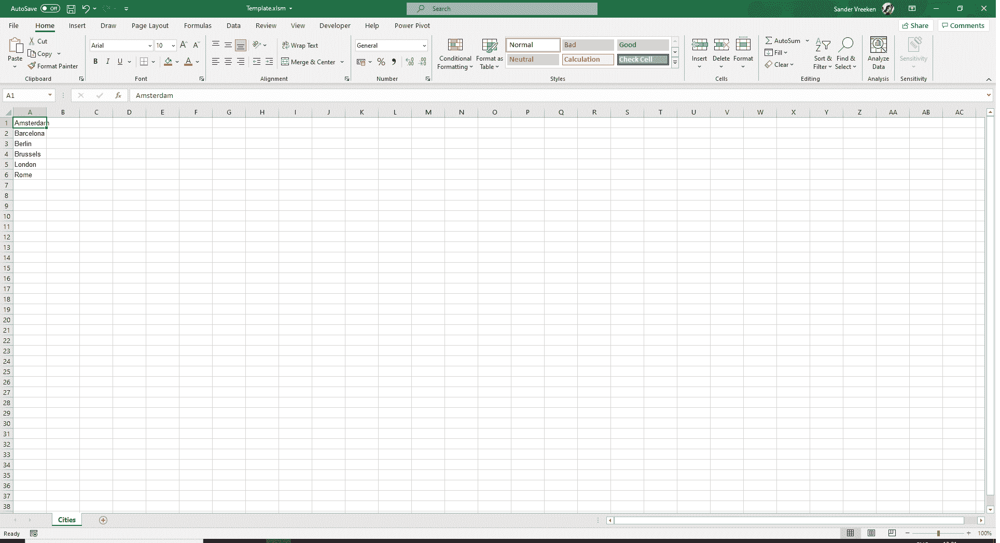
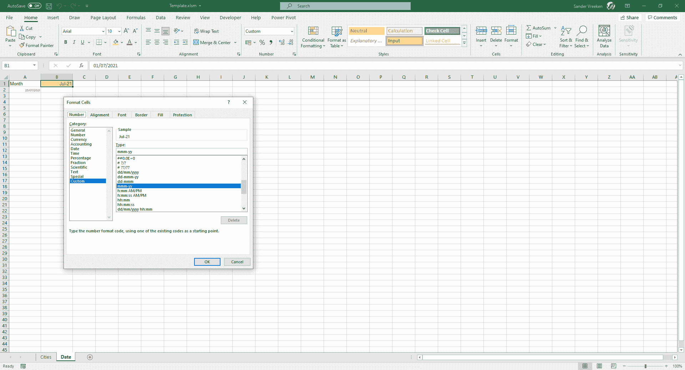
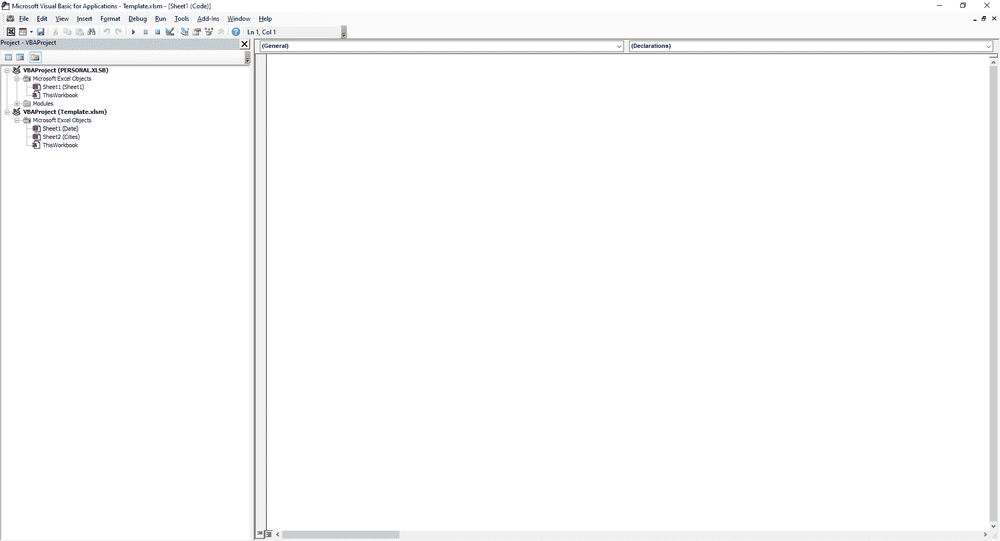
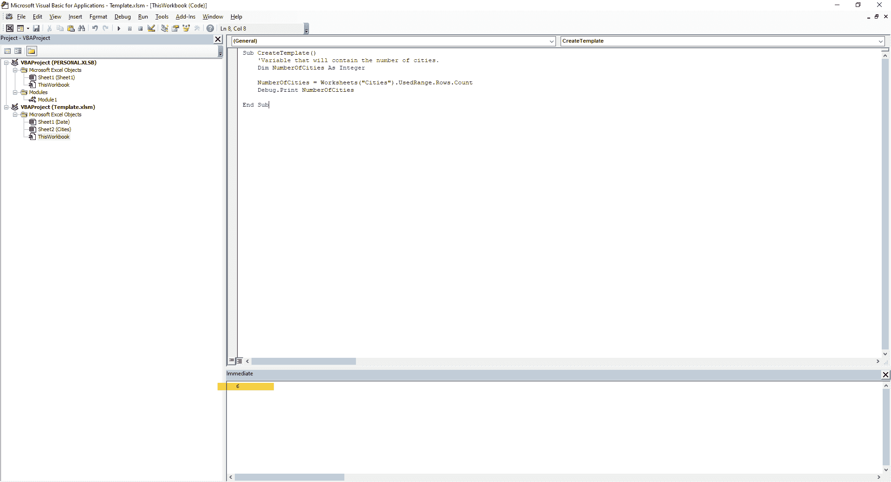
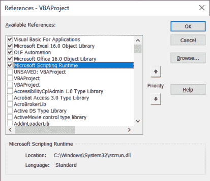

# Visual Basic Excel 教程–如何在电子表格中自动执行重复性任务

> 原文：<https://www.freecodecamp.org/news/automate-repetitive-tasks-in-excel-with-vba/>

我使用 VBA(Visual Basic for Applications)来自动化重复的任务。这在我的日常生活中节省了很多时间。

基于您正在阅读本教程的事实，我假设您也希望能够这样做。

所以我将带你了解 VBA 的基础知识，比如如何使用变量、循环、if-else 语句、数组和字典。

## VBA 介绍和项目概述

虽然 VBA 在 2008 年被宣布为遗产，但 Visual Basic 的这一实现可以帮助您自动化日常生活中的重复任务。

这种语言是面向对象的，它是用 C++编写的，并且它包括了你在当今的编码语言中所期望的所有特性。

在本教程中，我们将编写一个宏来准备一个模板来记录几个欧洲城市的温度——阿姆斯特丹、巴塞罗那、柏林、布鲁塞尔、伦敦和罗马。

模板将由我们根据用作参数的城市和日期共同构建的宏自动创建。

最后，我们还将学习如何从模板中的另一个文件导入数据。

为了跟随本教程，我希望您对 Excel 有一个基本的了解。但是你不需要任何 VBA 的经验(尽管它可能帮助你理解我将要介绍的不同概念)。

我下载了几个数据的 Excel 文件，可以免费使用。你也可以[在我的 GitHub](https://github.com/SanderVreeken/FreeCodeCamp-VBA-Automation) 上找到它们以及最终结果。

## 让我们定义我们的参数

首先，我们将定义本教程中使用的不同城市。如果我们手动完成这项工作，那么增加城市的数量将意味着更多的工作。

但是在我们的例子中，由于宏会为我们完成工作，我们可以添加任意多的城市。然后我们就运行宏，去做别的事情。

为了定义城市，我们可以做两件事之一。我们可以在代码的数组中包含城市，也可以在模板的单独工作表中定义它们。

对于本教程，我们将做后者，这使得其他人在没有任何 VBA 知识的情况下添加城市变得更加容易。

### 如何设置 Excel 工作簿

打开一个新的 Excel 文件，将其另存为启用宏的 Excel 工作簿(扩展名为。xlsm)，随便你怎么命名。

将第一个工作表重命名为 Cities，并通过在第一列中键入六个城市的名称来添加这六个城市，每行一个城市，如下所示:



Figure 01: Cities Worksheet

为了定义日期，我们将创建另一个名为 date 的工作表，用户可以在其中定义希望创建模板的月份。

由于并非每年和每月都是相同的(例如不同的天数、不同的工作日数)，您的数据模板需要每个月进行调整，以便正确显示这些差异。

我还添加了数据验证，以确保我们只能输入一个日期，并确保该日期不超过今天的日期(但这是完全可选的)。只要你有一个带日期的单元格，最好是 B1 单元格，就够了。

对于本教程，我们只需要月份和年份，所以我选择了不同的日期格式，如下所示:



Figure 02: Date Worksheet

## 如何用 Visual Basic for Applications 生成宏

现在我们已经设置了参数，我们可以继续实际构建宏了。

如果这是您第一次使用 VBA，您可能需要自定义功能区以获得必要的可用功能。

为此，请确保选中了开发人员框(如下面的图 3 所示),并且在您保存更改后，开发人员选项在您的功能区中可用。


Figure 03: Settings Excel

现在，您应该能够从 Excel 的“开发人员”选项卡中打开 Visual Basic，它看起来应该是这样的:



Figure 04: Visual Basic

这是 Excel 提供的编辑器，您可以在其中创建、调整和删除函数和宏。现在我不会讲太多的细节，但我会边走边解释一些要素。

现在，让我们动手编写我们的第一个宏。您可以选择只为单个工作表编写宏，或者选择在整个工作簿中使用它们。

由于我们之前创建的两个工作表只维护参数，所以我选择为整个工作簿编写宏，方法是双击项目侧栏中的“ThisWorkbook”选项。

暂时不要担心我截图中的 PERSONAL.xlsb 这是一个包含我可以在所有文件中使用的函数的文件，将在未来的教程中处理。

### 如何创建我们的第一个宏

选定工作簿后，就可以开始运行第一个程序了。

VBA 的宏以关键字 Sub 开始，subroutine 的缩写，后面是它们的名字和两个括号。虽然编辑器与像 Visual Studio 代码这样的 IDE 相比微不足道，但当您在两个括号后按 enter 时，它会使用 End Sub 来完成代码。

现在，我已经创建了一个名为`CreateTemplate`的空宏，如下所示:

```
Sub CreateTemplate()

End Sub
```

有点遗憾的是，该函数现在不做任何事情，所以让我们添加以下代码，看看它做了什么:

```
Sub CreateTemplate()

    'Adding a new worksheet called NewSheet to the workbook, next to the worksheet we currently have selected.
    Sheets.Add.Name = "NewSheet"

End Sub
```

如果我们现在运行这段代码，该函数将在我们的 Excel 工作簿中创建一个名为 NewSheet 的新工作表。

请注意，我在代码中包含了一个注释，以撇号开头。这不会被执行，只是为了帮助你和我理解代码。

我们可以通过将光标放在函数中的某个位置并按下编辑器顶部的绿色“play”图标来运行这段代码，当鼠标悬停在该图标上时，它会显示“Run Sub”。

按下此按钮后，您将看到名为 NewSheet 的新工作表已在我们的工作簿中创建，并已添加到侧栏中，与我们已有的工作表相邻。

就我个人而言，我不喜欢在我们选择的工作表旁边创建工作表(可能是有意的，也可能不是)。因此，我将向 add 方法添加一个参数来定义它的位置:

```
Sub CreateTemplate()

    'Adding a new worksheet called NewSheet to the workbook, next to the worksheet Date.
    Sheets.Add(After:=Sheets("Date")).Name = "NewSheet"

End Sub
```

删除新创建的工作表，因为我们现在将为之前定义的每个城市创建工作表。由于输入的城市数量可能不同，我们想知道在我们的城市工作表中实际使用了多少行。

```
Sub CreateTemplate()

    Debug.Print Worksheets("Cities").UsedRange.Rows.Count

End Sub
```

为了测试我们是否能够从文件中提取日期，我们使用`Debug.Print`(类似于 Python 中的 print 或 JavaScript 中的 console.log)来打印行数，Excel 将根据我们提供的代码为我们计算行数。

确保打开即时窗口(在 Visual Basic 中，通过选择“视图”>“即时窗口”)并运行上面的宏。在本教程前面的城市工作表中定义了相同数量的城市后，它将打印出 6 个，正如我们所期望的那样。

## 如何在 VBA 中将值存储为变量

我不想打印这个值，而是想把它存储为一个变量。为此，请添加以下代码:

```
Sub CreateTemplate()
    'Variable that will contain the number of cities.
    Dim NumberOfCities As Integer

    NumberOfCities = Worksheets("Cities").UsedRange.Rows.Count
    Debug.Print NumberOfCities

End Sub
```

我们在 VBA 中使用 Dim 关键字来声明一个变量，它应该总是包含类型(例如 String、Integer、Double)。

在我们声明了变量之后，我们可以像之前打印的那样，将使用的行数赋给这个变量，并打印这个数字来测试我们是否得到了相同的结果。您可以在下图中看到这一点:



Figure 05: Printing to Immediate Window

我们现在可以使用这个数字来定义一个循环，为每个城市创建一个工作表。

```
Sub CreateTemplate()
    'Variable that will contain the cityname that is used to name a sheet.
    Dim CityName As String
    'Variable that will contain the number of cities.
    Dim NumberOfCities As Integer
    'Variable that will be used to track the index of the loop to create worksheets.
    Dim SheetIndex As Integer

    NumberOfCities = Worksheets("Cities").UsedRange.Rows.Count

    For SheetIndex = 1 To NumberOfCities
        'Setting the cityname variable based on the index.
        CityName = Worksheets("Cities").Cells(SheetIndex, 1)
        'Adding a new worksheet called NewSheet to the workbook as last to ensure the alphabetical order.
        Sheets.Add(After:=Sheets(Sheets.Count)).Name = CityName
    Next SheetIndex

End Sub
```

## 如何在 VBA 使用循环

让我解释一下这一切是如何运作的。在上面的例子中，我声明了另外两个变量，即`CityName`和`SheetIndex`，它们将保存城市的名称(我们将用它作为工作表标题)并维护循环的索引。

循环本身以关键字`For`开始。此后，我们定义索引的开始(在本例中是一个),并循环遍历它，直到达到城市的数量。

对于每次迭代，城市都被存储在变量`CityName`中，然后我们用它来创建一个新的工作表。运行该函数，您将看到正在创建的工作表，其标题与我们的城市工作表中定义的标题相同。这是魔法，我知道！

现在工作表已经存在，我们可以添加该月的单个日期。前面，我们已经定义了要在日期工作表中使用的月份。这现在可以帮助我们创建另一个循环，以便表示一个月中的所有一天。

## 如何在 VBA 使用函数

但是首先我们需要获得用户在标签日期中输入的一个月的天数。我们可以通过使用 VBA 的一个函数来做到这一点。除了我们以前用过的子程序，我们还可以使用一个返回某些东西的函数。

我们现在使用的函数看起来与您自己在 Excel 中定义一个月的天数时使用的函数非常相似(但是您会使用`Date`而不是`DateSerial`):

```
Function DaysInMonth(DateInput As Date)
    DaysInMonth = Day(DateSerial(Year(DateInput), Month(DateInput) + 1, 1) - 1)
End Function
```

您可以在我们之前定义的子例程的上方或下方输入这个函数，因为 VBA 是一种编译语言，而不是解释语言。

注意——虽然我不会再粘贴这个函数，但它会在本教程的剩余部分出现。

我们现在可以在子程序中使用这个函数。这让我们的生活变得容易多了，因为我们现在可以使用这些超能力，而不会污染我们的子程序。

```
Sub CreateTemplate()
    'Variable that will contain the cityname that is used to name a sheet.
    Dim CityName As String
    Dim MonthNum As Integer
    'Variable that will contain the number of cities.
    Dim NumberOfCities As Integer
    'Variable that will contain the date entered in the Date worksheet.
    Dim ReportDate As Date
    'Variable that will be used to track the index of the loop to create worksheets.
    Dim SheetIndex As Integer

    NumberOfCities = Worksheets("Cities").UsedRange.Rows.Count

    For SheetIndex = 1 To NumberOfCities
        'Setting the cityname variable based on the index.
        CityName = Worksheets("Cities").Cells(SheetIndex, 1)
        'Adding a new worksheet called NewSheet to the workbook as last to ensure the alphabetical order.
        Sheets.Add(After:=Sheets(Sheets.Count)).Name = CityName
    Next SheetIndex

    ReportDate = Worksheets("Date").Cells(1, 2)
    Debug.Print DaysInMonth(ReportDate)

End Sub
```

现在，如果已经创建了带有城市名称的工作表，请将其删除，并(再次)运行宏，以确保在“即时”窗口中打印出您之前在日期工作表中定义的月份的正确天数。

然后，我们可以将天数作为一个整数存储在另一个变量(称为`NumberOfDays`)中，用于另一个循环。

```
Sub CreateTemplate()
    'Variable that will contain the cityname that is used to name a sheet.
    Dim CityName As String
    'Variable that will be used to track the index of the loop to add the single dates for the month.
    Dim DateIndex As Integer
    'Variable that will contain the number of cities.
    Dim NumberOfCities As Integer
    'Variable that will contain the number of days in the chosen month
    Dim NumberOfDays As Integer
    'Variable that will contain the date entered in the Date worksheet.
    Dim ReportDate As Date
    'Variable that will be used to track the index of the loop to create worksheets.
    Dim SheetIndex As Integer

    NumberOfCities = Worksheets("Cities").UsedRange.Rows.Count

    For SheetIndex = 1 To NumberOfCities
        'Setting the cityname variable based on the index.
        CityName = Worksheets("Cities").Cells(SheetIndex, 1)
        'Adding a new worksheet called NewSheet to the workbook as last to ensure the alphabetical order.
        Sheets.Add(After:=Sheets(Sheets.Count)).Name = CityName
    Next SheetIndex

    ReportDate = Worksheets("Date").Cells(1, 2)
    NumberOfDays = DaysInMonth(ReportDate)

    For SheetIndex = 1 To NumberOfCities
        'Setting the cityname variable based on the index.
        CityName = Worksheets("Cities").Cells(SheetIndex, 1)

        For DateIndex = 1 To NumberOfDays
            Worksheets(CityName).Cells(DateIndex + 1, 1) = DateSerial(Year(ReportDate), Month(ReportDate), DateIndex)
        Next DateIndex
    Next SheetIndex

End Sub
```

这将是一个循环中的循环，增加一点趣味！🔥

我会告诉你我们在这里做什么。再说一次，我们在城市中循环。但是我们现在不是创建另一个工作表，而是用`Cityname`变量做一些别的事情。

在循环中在循环中(你仍然得到我现在的位置吗？)我们将日期打印到工作表中，就像本教程前面一样，我们使用了`DateSerial`函数。

确保从工作簿中删除带有城市名称的工作表，再次运行宏，您应该会看到包含该月日期的工作表。

请注意，日期将从第二行开始打印，因为我在前面的代码中为单元格列添加了+1。为什么，你可能会问自己？因为我想在第一行添加一些标题，现在我们将把它们添加到同一个循环中。

我们可以使用`Range`后跟一个单元格(或多个单元格)的位置来定位它的值和其他属性，而不是使用 cells 属性后跟一个整数的行号和列号来定义单元格。

```
 For SheetIndex = 1 To NumberOfCities
        'Setting the cityname variable based on the index.
        CityName = Worksheets("Cities").Cells(SheetIndex, 1)

        For DateIndex = 1 To NumberOfDays
            Worksheets(CityName).Cells(DateIndex + 1, 1) = DateSerial(Year(ReportDate), Month(ReportDate), DateIndex)
        Next DateIndex

        Worksheets(CityName).Range("B1") = "Minimum"
        Worksheets(CityName).Range("C1") = "Mean"
        Worksheets(CityName).Range("D1") = "Maximum"
    Next SheetIndex
```

在上面的例子中，我已经为我们的表格添加了标题，由于我们的循环，这些标题现在将被打印到每一张工作表中。

## 如何在 VBA 使用数组

听说过干每？不要重复自己！不幸的是，这正是我们在这里所做的。

另一种方法是将这三个头存储在一个数组中，然后对它们进行循环，得到相同的结果。三个项目真的有这个必要吗？老实说是有争议的。但是下面你会发现我的代码示例如下:

```
Sub CreateTemplate()
    'Variable that will contain the cityname that is used to name a sheet.
    Dim CityName As String
    'Variable that will be used to track the index of the loop to add the single dates for the month.
    Dim DateIndex As Integer
    'Variable that will be used to track the index of the loop to insert the headers.
    Dim HeaderIndex As Integer
    'Variant that will store the headers as used in every single worksheet.
    Dim Headers(2) As Variant
    'Variable that will contain the number of cities.
    Dim NumberOfCities As Integer
    'Variable that will contain the number of days in the chosen month
    Dim NumberOfDays As Integer
    'Variable that will contain the date entered in the Date worksheet.
    Dim ReportDate As Date
    'Variable that will be used to track the index of the loop to create worksheets.
    Dim SheetIndex As Integer

    Headers(0) = "Minimum"
    Headers(1) = "Mean"
    Headers(2) = "Maximum"

    NumberOfCities = Worksheets("Cities").UsedRange.Rows.Count

    For SheetIndex = 1 To NumberOfCities
        'Setting the cityname variable based on the index.
        CityName = Worksheets("Cities").Cells(SheetIndex, 1)
        'Adding a new worksheet called NewSheet to the workbook as last to ensure the alphabetical order.
        Sheets.Add(After:=Sheets(Sheets.Count)).Name = CityName
    Next SheetIndex

    ReportDate = Worksheets("Date").Cells(1, 2)
    NumberOfDays = DaysInMonth(ReportDate)

    For SheetIndex = 1 To NumberOfCities
        'Setting the cityname variable based on the index.
        CityName = Worksheets("Cities").Cells(SheetIndex, 1)

        For DateIndex = 1 To NumberOfDays
            Worksheets(CityName).Cells(DateIndex + 1, 1) = DateSerial(Year(ReportDate), Month(ReportDate), DateIndex)
        Next DateIndex

        For HeaderIndex = 0 To UBound(Headers) - LBound(Headers)
            Worksheets(CityName).Cells(1, HeaderIndex + 2) = Headers(HeaderIndex)
        Next HeaderIndex

    Next SheetIndex

End Sub
```

变量被用作一个数组，它被声明在你期望的地方，标题被插入到变量声明之后的每个索引目录中。

我没有提供单个单元格的位置，而是使用了一个从零到项目数(减一，因为 VBA 的数组也是从零开始)的循环。然后将标题打印到工作表中，就像前面的情况一样。

您可能需要稍后添加另一个头，在这种情况下，最新的解决方案更容易。但是如果你百分之百确定你只坚持三种，选择对你最方便的。毕竟两种方式都懂最好。

对于本教程的剩余部分，您选择两个选项中的哪一个并不重要，只要您打印了标题。

## 如何使用 VBA 导入数据

此时，我们已经创建了实际的模板，因此我们可以在工作簿中输入城市和日期。然后宏会为我们完成剩下的工作。

我想在本教程中更进一步，向您展示如何触发一个资源管理器窗口，您可以在其中选择一个文件并从该文件导入数据。

确保您已经完成了上述步骤，并获得了所有城市的工作表。让我们开始一个新的子程序，并在顶部定义以下变量:

```
Sub ImportData()
    Dim FileLocation As String
    Dim WorksheetTitle As String

    WorksheetTitle = ActiveSheet.Name
End Sub
```

我们需要第一个变量来存储我们要在设备上导入数据的文件的位置。我们使用第二个来存储用户当前选择的工作表的标题。

将以下代码添加到宏中，就在我们将`WorksheetTitle`设置为等于工作表名称的行的正下方(但仍在 End Sub 之前):

```
FileLocation = Application.GetOpenFilename
If FileLocation = "False" Then
    Beep
    Exit Sub
End If

Application.ScreenUpdating = False
Set ImportWorkbook = Workbooks.Open(Filename:=FileLocation)

Debug.Print ImportWorkbook.Worksheets(1).Range("B1")

ImportWorkbook.Close
Application.ScreenUpdating = True
```

起初这可能看起来有点神秘，但应该不难理解。`Application.GetOpenFilename`函数触发一个文件浏览器窗口并返回一个位置，然后存储在先前定义的变量中。

如果你决定不选择一个文件，这意味着如果`FileLocation` =“假”，你会听到标志性的嘟嘟声(是的，Excel 也有很棒的声音！😍)而宏会在这里结束。

如果是真的，我们将继续使用宏，它首先结束 Excel 的屏幕更新。这有助于确保一切顺利进行。

对于这个宏，如果没有这条线，您可能不会注意到差异，但是对于更复杂的计算，您会注意到差异。相信我。

## 如何在 VBA 使用对象

之后，包含在 FileLocation 变量所在的文件中的数据被存储到常量`ImportWorkbook`中。

请注意，我们使用的是主要用于对象的关键字`Set`，比如工作簿的导入。

为了测试我们是否能够从文件中提取日期，我们再次使用`Debug.Print`来打印城市，它位于本教程开头提到的链接所提供的文件的单元格 B1 中。

如果您导入文件`Data_Amsterdam`，您应该会在即时窗口中看到阿姆斯特丹。文件关闭后，Excel 将再次正常运行。我们可以很容易地将(刚打印出来的)城市名粘贴到我们自己的模板中，只需将`Debug.Print`替换为:

```
ThisWorkbook.Worksheets(WorksheetTitle).Range("A1") = ImportWorkbook.Worksheets(1).Range("B1")

'Equal to the following.
ThisWorkbook.Worksheets(WorksheetTitle).Cells(1, 1) = ImportWorkbook.Worksheets(1).Range(1, 2)
```

注意，我们现在可以使用我们的`ImportWorkbook`变量从导入的工作簿中获取数据。但是我们也可以使用`ThisWorkbook`(受 VBA 保护的关键字名称)来获取我们自己模板的属性。

如果我们现在运行这个宏并导入`Data_Amsterdam`，城市现在应该打印在阿姆斯特丹工作表的左上角。

## 在 VBA 如何使用字典

正如所承诺的，现在是时候获取实际温度了。你可以使用一个循环来插入数字，就像上面演示的那样，但是我今天感觉很棒，我想向你展示我们如何使用字典来做这件事。

同样，就像本教程前面的阵列一样，对于这种情况，这种方法可能有点多余。但是如果你需要处理大量的数据，这将会派上用场。

我们首先要做的是在这里定义几个新变量:

```
Dim DataIndex As Integer
Dim DaysIndex As Integer
Dim FileLocation As String
Dim Headers(2) As Variant
Dim WorksheetTitle As String
Set TemperaturesDict = CreateObject("Scripting.Dictionary")

Headers(0) = "Maximum"
Headers(1) = "Minimum"
Headers(2) = "Mean"
```

顶部的两个索引将跟踪我们稍后将使用的循环的索引。我之前从宏中复制了头声明和变量。

是的，我们可以将它们定义为一个全局变量，但那是另一天的另一个话题。

请注意，我已经更改了顺序，因为这是它们在导入文件中的显示方式。

字典也是一个对象，因此我们将在变量下面直接使用关键字`Set`来声明它。

但是在您实际上可以这样使用字典之前，请确保您已经勾选了 Microsoft Scripting Runtime(正如您在上面的图 6 中所看到的),您可以在编辑器中的 Tools 和 References 下找到它。



Figure 06: Visual Basic References

之前，我向您展示了如何将单个单元格中的值从一个工作簿复制到另一个工作簿中。现在，我不想复制单个值，而是想在继续粘贴它们之前，将它们一起存储在一个字典中。

```
 For DaysIndex = 11 To ImportWorkbook.Worksheets(1).UsedRange.Rows.Count
        Set DataDict = CreateObject("Scripting.Dictionary")
        For DataIndex = 0 To 2
            DataDict.Add Headers(DataIndex), ImportWorkbook.Worksheets(1).Cells(DaysIndex, DataIndex + 2)
        Next DataIndex
        TemperaturesDict.Add DaysIndex, DataDict
    Next DaysIndex
```

这可能是本教程中最难的部分，我会尽量解释清楚。

我们从一个循环开始，就像我们之前在本教程中多次使用的那样——到目前为止还不错。循环从 11 开始，当达到导入工作簿中使用的行数时结束。

然后，我正在定义一部新词典。为什么？在大多数其他语言中，可以使用点符号添加新的键值对——但在 VBA 却不行。为了所谓的嵌套(在字典中添加字典)，您将必须创建一个新的(内部)字典，然后将其添加到您的另一个(外部)字典中。

因此，循环中的字典将首先填充不同的可用温度，即最低温度、平均温度和最高温度。

为此，我将使用上面讨论过的 headers 数组，并对这些值进行循环。通过使用字典的名称添加一个键值对，然后调用`.Add`方法、想要使用的键、一个逗号，然后是它的值:

```
DictName.Add Key, Value
```

当您导入`Data_Amsterdam`文件时，这将是在第一次迭代后输入的内容:

```
Maximum: 22.105547
Minimum: 14.385546	
Mean: 18.25388 
```

然后，这个字典被添加到名为`TemperaturesDict`的“主”字典中——这意味着我们现在会有这样的内容:

```
10: 
    Maximum: 22.105547
    Minimum: 14.385546	
    Mean: 18.25388 
```

我们对所有其他日期和温度类型进行同样的操作，直到文件被完全删除，我们准备好将这些信息插入到模板中。但是然后呢？

```
 Headers(0) = "Minimum"
    Headers(1) = "Mean"
    Headers(2) = "Maximum"

    For DaysIndex = 2 To ThisWorkbook.Worksheets(WorksheetTitle).UsedRange.Rows.Count
        If TemperaturesDict.Exists(DaysIndex - 1) Then
            For DataIndex = 0 To 2
                ThisWorkbook.Worksheets(WorksheetTitle).Cells(DaysIndex, DataIndex + 2) = TemperaturesDict(DaysIndex - 1)(Headers(DataIndex))
            Next DataIndex
        End If
    Next DaysIndex
```

如上所述，导入的文件有另一个顺序。但是由于我们使用了字典，我们现在可以很容易地对 headers 数组重新排序，并按照我们最初在模板中考虑的那样显示它，因为它将搜索关键字(#winning)。

然后，我们使用一个老式的循环来遍历模板中的所有天数。循环从两点开始，因为我们在第一行定义了标题。现在从索引一开始会覆盖那些我们不想要的。在获得所有行(也就是说，所有天)后，循环结束。

因为导入的文件中只包含有限的天数，所以我们必须检查字典中是否存在与索引相等的天数。

我们用 if 语句来实现这一点，您可能会从其他编码语言中认出它。有一个负 1，因为我们的循环从 2 开始，尽管一个月中的日子总是从 1 开始。这同样适用于这段代码后面使用的负一。

如果数据确实存在于我们的数组中，我们将把它插入到模板中。然后行由循环的索引定义，列来自`DataIndex`。

最终，我们得到了第二个宏的如下代码:

```
Sub ImportData()
    Dim DataIndex As Integer
    Dim DaysIndex As Integer
    Dim FileLocation As String
    'Variant that will store the headers as used in every single worksheet.
    Dim Headers(2) As Variant
    Dim WorksheetTitle As String
    Set TemperaturesDict = CreateObject("Scripting.Dictionary")

    Headers(0) = "Maximum"
    Headers(1) = "Minimum"
    Headers(2) = "Mean"

    WorksheetTitle = ActiveSheet.Name

    FileLocation = Application.GetOpenFilename
    If FileLocation = "False" Then
        Beep
        Exit Sub
    End If

    Application.ScreenUpdating = False
    Set ImportWorkbook = Workbooks.Open(Filename:=FileLocation)

    For DaysIndex = 11 To ImportWorkbook.Worksheets(1).UsedRange.Rows.Count
        Set DataDict = CreateObject("Scripting.Dictionary")
        For DataIndex = 0 To 2
            DataDict.Add Headers(DataIndex), ImportWorkbook.Worksheets(1).Cells(DaysIndex, DataIndex + 2)
        Next DataIndex
        TemperaturesDict.Add DaysIndex, DataDict
    Next DaysIndex

    Headers(0) = "Minimum"
    Headers(1) = "Mean"
    Headers(2) = "Maximum"

    For DaysIndex = 2 To ThisWorkbook.Worksheets(WorksheetTitle).UsedRange.Rows.Count
        If TemperaturesDict.Exists(DaysIndex - 1) Then
            For DataIndex = 0 To 2
                ThisWorkbook.Worksheets(WorksheetTitle).Cells(DaysIndex, DataIndex + 2) = TemperaturesDict(DaysIndex - 1)(Headers(DataIndex))
            Next DataIndex
        End If
    Next DaysIndex

    ImportWorkbook.Close
    Application.ScreenUpdating = True

End Sub
```

当您现在运行这段代码时，您应该看到温度从数据文件导入到模板中。

请注意，我们还改变了它们最初出现的顺序——现在从最小值开始，以最大值结束。

## 结论

恭喜你！现在，您已经为自己制作了一个模板，可以轻松地用数据填充它，所有操作都使用了宏。

感谢您的阅读:)如果您对本教程或其他 VBA 实现有任何问题，请不要犹豫，直接在 Twitter 上给我发消息，这样我可以帮助您。