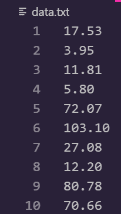
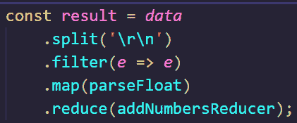
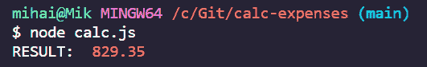

# 如何用 Node.js 自动化简单的任务

> 原文：<https://www.freecodecamp.org/news/automate-simple-tasks-with-nodejs/>

最近，我不得不开车穿越几个国家？。有很多过路费要付？还有很多 gasoline⛽要填。这意味着很多账单。

我收了收据？一路上。我计划在旅行结束时，计算一下整个旅程花了我多少钱。

最后，我得到了满满一袋文件。这意味着我有很多数字要总结。

我把它们放在电脑的电子表格里，准备开始手工计算。然后，我的程序员的头脑开始和我说话——我为什么要做所有这些手工工作？️什么时候能写一个短程序来帮我做这件事？

不要误会我的意思，我知道有很多其他的方法来做这样的计算。但是因为我想称自己为热爱自动化的程序员，所以我想自己来做。用老办法。

我决定使用 [Node.js](https://nodejs.org/) 来解决这个问题，主要是因为我对 JavaScript 相当熟悉。这应该是我早上喝☕咖啡时想到的一个非常快速的解决方案。

所以，我是这样做的:

首先，我在一个 txt 文件中填入所有的数字，每一个数字占一行。



Data source in a txt file

然后，我编写了一个小程序，它读取数据源文件，解析新行上的数字作为要添加的独立值，然后进行求和。

```
var fs = require('fs');

calculate = () => {
    fs.readFile('data.txt', 'utf8', (err, data) => {
        if (err) {
            throw new Error(err)
        }

        const arr = data.split('\r\n');
        const result = arr
            .filter(e => e)
            .map(parseFloat)
            .reduce((curr, next) => curr + next);
        console.log('RESULT: ', result);
    });
}
```

## 我是如何制作这个工具的

我先说一下实现。然后，我们将简单讨论一下我本可以选择哪些其他选项。

这是一个非常短的函数，利用了 Node.js 包，`fs`。它允许我们与操作系统交互(例如读取或写入文件)。这正是我们需要的，以便能够读取我们的数据源文件。

代码本身遵循标准的 [Node.js 回调机制](https://www.javatpoint.com/nodejs-callbacks)。在回调函数中，我使用了一点函数式方法:[管道](https://en.wikipedia.org/wiki/Pipeline_(software))多个方法，这些方法从前面的处理中获取数据，对其进行处理，然后将其传递给下一个处理。



Piping methods

第一个方法`split`，通过使用`\r\n`分隔符解析从文本文件中读取的数据。这些[符号](https://en.wikipedia.org/wiki/Newline)在编程世界中用于指定新行(在文件中)何时到来。

在程序的这个阶段，我们已经从 txt 文件中读取并解析了我们的数字。现在我们使用`filter`方法。这一步从所有空值中去除数据。

然后我们使用`map`方法——这是一个接受回调函数的 [JavaScript 数组方法](https://developer.mozilla.org/en-US/docs/Web/JavaScript/Reference/Global_Objects/Array/map)。这个回调将在给定数组的每个参数上执行。

在我们的例子中，数据是隐式传递的——来自`filter`方法输出的数据将作为`map`方法的输入。这个输入的每个成员都将由`parseFloat`方法处理。

这是另一个 JavaScript 方法,它解析一个参数，如果需要的话先将其转换成字符串，然后返回一个浮点数。我们需要执行这个步骤来保证我们得到正确的计算。

管道的最后一步是`reduce`方法，这是我们将要使用的第三个 [JavaScript 数组方法](https://developer.mozilla.org/en-US/docs/Web/JavaScript/Reference/Global_Objects/Array/reduce)。

这个方法有[多个应用](https://www.digitalocean.com/community/tutorials/js-finally-understand-reduce)，但是在我们的例子中，我们只是在迭代数组时用它来对数组中的数字求和。

这个方法接受的 reducer 回调函数完成了真正的工作。我在一个单独的命名方法中提取了我的，以提高代码的可读性。

## 我们需要做什么和我们能做什么

在最后一节中，我承诺了一个简短的讨论，关于我们还可以用什么来达到同样的目标。

现在是时候停下来想一想我们需要做什么，以及我们能做什么和如何做。

在这个具体的例子中，我的目标非常简单。我有一些数字需要自动求和。

这让我思考——我需要把数据放在什么样的数据结构中，才能有多种选择以便于处理？我就是这样想出一个数组的。毕竟，它是 JavaScript 中最简单和最常用的数据结构之一。

从这里你有几个选择:

1.  您可以像我在我的示例中所做的那样——以一种更具功能性的方式使用 JavaScript 数组方法，比如 map、filter 和 reduce。或者，
2.  你可以走老路，使用常规的[循环](https://developer.mozilla.org/en-US/docs/Web/JavaScript/Guide/Loops_and_iteration)来迭代数组并进行计算。这样的循环可以是 for-，while-，forEach 甚至 do-while JavaScript 循环。在这样的小程序中，性能可以忽略不计，所以使用什么取决于你。

两种选择都可以。更重要的是，你应该始终根据你的最终目标来做决定。

在这篇文章中，我讨论了一个非常简短和快速实现自动化的工具。它完成了我需要它做的工作。鉴于我没有太多时间投入，第一个可行的解决方案已经足够好了。

但是在有些情况下，你应该提前执行一个更加复杂的分析，这样你才能最终得到高质量的软件。

> 在决定做什么和如何做时，把你的最终目标作为你的指南，你将永远在正轨上。

## 试一试

如果你想自己尝试一下，请确保你的系统上已经安装了 Node.js。然后继续检查这个[存储库](https://github.com/mihailgaberov/calc-expenses)。

为了运行程序，在 calc.js 文件所在的目录中使用以下命令:

```
node calc.js
```

检查您的控制台窗口以查看结果。我的看起来像这样:



Console output

这就是我想与你分享的一切。我希望这一经验的一部分将伴随您未来的自动化任务。

？感谢阅读！？