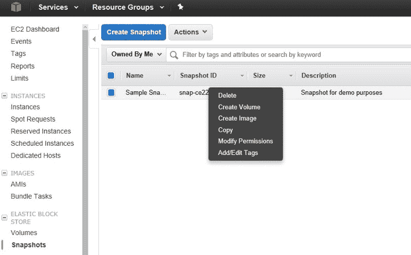
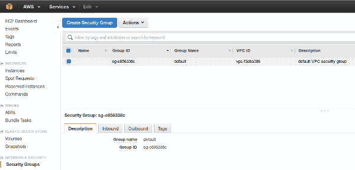
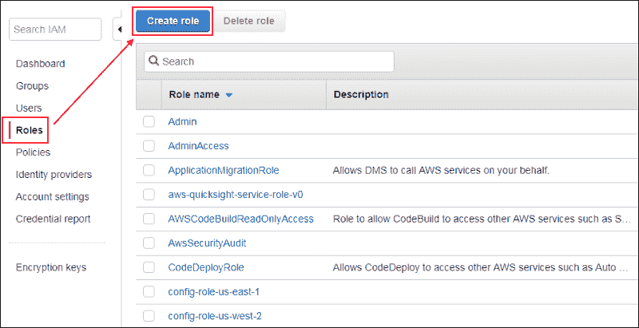

# 如何在 AWS 中设置自动化部署

> 原文：<https://www.freecodecamp.org/news/automated-deployment-in-aws-5aadc2e708a9/>

哈利·绍尔斯

# 如何在 AWS 中设置自动化部署


Photo by [Aboubakar Malipula](https://unsplash.com/photos/VVaPEPTx9jM?utm_source=unsplash&utm_medium=referral&utm_content=creditCopyText) on [Unsplash](https://unsplash.com/search/photos/launch?utm_source=unsplash&utm_medium=referral&utm_content=creditCopyText)

### 设置和配置服务器

#### 介绍

在本教程中，您将学习如何使用 Amazon 的 AWS SDK 将 Python 应用程序部署到现实世界的服务器上。

在我们开始之前，您应该具备 Python、Git 和一般云基础设施的工作知识。如果你想学习这些基础知识，我推荐 [Codecademy](https://www.codecademy.com/) 。

我使用的一些终端/Bash 命令是针对 Ubuntu 系统的。如果他们不工作，检查你的系统的等效物。


### 入门指南

*   启动您最喜欢的 [Python IDE](https://www.programiz.com/python-programming/ide) 并创建一个新项目。
*   创建您的主项目文件，并将其命名为您想要的名称——为了简单起见，我选择了“app.py”。
*   将 `*print("Hello Python!")*` 添加到文件中，并运行它以确保您的环境设置正确。
*   接下来，我们需要安装亚马逊的 SDK。虽然 AWS 确实提供了一个标准的 HTTP API，但是这个软件开发工具包要健壮得多。SDK 为您处理单调乏味的低级操作
*   打开一个终端，输入`*sudo pip3 install boto3*`，如果需要的话，输入你的 sudo 密码。
*   将`*import boto3*`添加到 Python 文件的顶部。
*   这允许我们在 Python 应用程序中使用 Amazon 的 SDK。

### AWS 凭据

在我们实际使用 AWS 上的任何东西之前，我们需要 AWS 帐户的凭证。如果你没有，你可以在这里注册。

*   转到您的[身份和访问管理面板](https://console.aws.amazon.com/iam/home?#/users)，点击“用户”选项卡下的“添加用户”。
*   输入用户名并勾选“程序化访问”旁边的框
*   如果需要，单击“下一步:权限”并创建一个新组。
*   出于本教程的目的，我将使用“AdministratorAccess”策略创建一个新组。这使我们有权限以编程方式管理 AWS 控制台中的一切。
*   点击“下一步:标签”并添加任何相关信息。这是可选的。
*   点击“查看”，然后点击“创建用户”
*   下载您的安全凭证(CSV 文件)并将其复制到项目的根目录中。如果你使用源代码控制，要小心。

### 阅读凭证

*   使用以下代码创建一个新文件“creds.py ”:

```
import csv
```

```
class Creds:
```

```
# credentials
```

```
username = “”
```

```
access_key_id = “”
```

```
secret_key = “”
```

```
def __init__(self, creds_file):
```

```
with open(creds_file) as file:
```

```
reader = csv.reader(file, delimiter=”,”)
```

```
header = next(reader)
```

```
creds_line = next(reader)
```

```
self.username = creds_line[0]
```

```
self.access_key_id = creds_line[2]
```

```
self.secret_key = creds_line[3]
```

*   将`*from creds import Creds*`添加到主 Python 文件的顶部。
*   在里面初始化你的 Creds 对象:`*creds = Creds(“credentials.csv”)*`

太好了！现在我们可以使用这些来访问 Amazon Web 服务。



### 设置 EC2 服务器

在您的`*creds*`变量后添加以下代码:

```
REGION = “us-east-2”
```

```
client = boto3.client(
```

```
‘ec2’,
```

```
aws_access_key_id=creds.access_key_id,
```

```
aws_secret_access_key=creds.secret_key,
```

```
region_name=REGION
```

```
)
```

现在，让我们提供一个 Ubuntu Server 18.04 的新实例。这也符合亚马逊的免费等级！

在文件的顶部，添加来自 boto core . exceptions import client error 的*，这样你的程序就知道如何处理错误。*

前往 AWS 仪表板，进入 EC2->网络和安全->密钥对，然后单击“创建密钥对”

输入名称并点击“创建”我用的是“机器人”。虽然您应该避免像这样硬编码字符串，但我们暂时忽略这一点，以便让它启动并运行。

要在服务器上运行命令并在 Web 上打开它，我们必须在 AWS 上创建一个安全组和 IAM 角色。转到您的仪表板。



### 创建安全组:

*   导航到网络和安全->安全组。
*   创建一个安全组，打开端口 22、80、443 和 5000。这将允许从网上访问它。允许所有 IP 访问它们。
*   复制您刚刚创建的安全组的组 ID，并将其粘贴到名为 *SECURITY_GROUP 的全局变量中。*



### 创建 IAM 角色:

*   转到您的 AWS 仪表板，导航到 IAM 服务。
*   单击“角色”选项卡。
*   点击“创建角色”并选择“EC2”出于本教程的目的，您可能希望选择“管理员访问”，但是在现实环境中，这可能不合适。
*   单击其余步骤，创建一个角色。
*   复制 IAM 角色的名称，并将其粘贴到名为 *IAM_PROFILE 的全局变量中。*
*   添加以下代码以从 Amazon 提供一个最小的 Ubuntu 服务器:

```
def provision_server():
```

```
# Ubuntu Server 18.04 ID from the AWS panel
```

```
image_id = "ami-0f65671a86f061fcd"
```

```
# Second smallest instance, free tier eligible.
```

```
instance_type = "t2.micro"
```

```
# Make this a command-line argument in the future.
```

```
keypair_name = "robot"
```

```
response = {}
```

```
try:
```

```
response = ec2.run_instances(ImageId=image_id,
```

```
InstanceType=instance_type,
```

```
KeyName=keypair_name,
```

```
SecurityGroupIds=[SECURITY_GROUP],
```

```
IamInstanceProfile={'Name': IAM_PROFILE},
```

```
MinCount=1,
```

```
MaxCount=1)
```

```
print(response['Instances'][0])
```

```
print("Provisioning instance…")
```

```
# wait for server to be provisioned before returning anything
```

```
time.sleep(60)
```

```
return str(response['Instances'][0]['InstanceId'])
```

```
except ClientError as e:
```

```
print(e)
```

恭喜你！您已经准备好在 Amazon 上提供您的第一台 EC2 服务器。在第 2 部分中，当您准备好继续学习时，了解如何配置它的网络和安全设置，并为它部署一个真正的 web 应用程序。

### 部署应用程序

你成功了！让我们来学习如何管理 EC2 实例，并从 Github 向一个实例部署应用程序。

Amazon 的 SDK 支持在实例上执行命令。这很有帮助。它允许我们管理实例，而不必担心设置安全外壳之类的事情。

*   首先，我们需要获得您的私有云中的实例列表:

```
def get_instance_ids():
```

```
instance_id_list = []
```

```
instances = ec2.describe_instances()
```

```
instances = instances[‘Reservations’][0][‘Instances’]
```

```
for instance in instances:
```

```
instance_id_list.append(instance[‘InstanceId’])
```

```
return instance_id_list
```

*   添加此代码以便能够在您的服务器终端上执行命令:

```
def send_command_aws(commands=[“echo hello”], instance=”i-06cca6072e593a0ac”):
```

```
ssm_client = boto3.client(‘ssm’,
```

```
aws_access_key_id=creds.access_key_id,
```

```
aws_secret_access_key=creds.secret_key,
```

```
region_name=REGION)
```

```
response = ssm_client.send_command(
```

```
InstanceIds=[instance],
```

```
DocumentName=”AWS-RunShellScript”,
```

```
Parameters={‘commands’: commands}, )
```

```
command_id = response[‘Command’][‘CommandId’]
```

```
time.sleep(5)
```

```
output = ssm_client.get_command_invocation(
```

```
CommandId=command_id,
```

```
InstanceId=instance,
```

```
)
```

```
print(output)
```

*   最后，我们需要生成命令来安装依赖项，并在实时服务器上从 Github 部署 Flask webapp:

```
def generate_git_commands(git_url=GIT_URL, start_command=”sudo python3 hellopython/app.py”, pip3_packages=[], additional_commands=[]):
```

```
commands = []
```

```
if “.git” in git_url:
```

```
git_url = git_url[:-4]
```

```
repo_name = git_url[git_url.rfind(‘/’):]
```

```
# install dependencies
```

```
commands.append(“sudo apt-get update”)
```

```
commands.append(“sudo apt-get install -y git”)
```

```
commands.append(“sudo apt-get install -y python3”)
```

```
commands.append(“sudo apt-get install -y python3-pip”)
```

```
commands.append(“sudo rm -R hellopython”)
```

```
commands.append(“pip3 — version”)
```

```
commands.append(“sudo git clone “ + git_url)
```

```
# commands.append(“cd “ + repo_name)
```

```
# install python dependencies
```

```
for dependency in pip3_packages:
```

```
commands.append(“sudo pip3 install “ + dependency)
```

```
# run any additional custom commands
```

```
for command in additional_commands:
```

```
commands.append(command)
```

```
# start program execution
```

```
commands.append(start_command)
```

```
return commands
```

*   将这些常量添加到程序的顶部:

```
GIT_URL = "https://github.com/hsauers5/hellopython"REGION = "us-east-2"SECURITY_GROUP = "sg-0c7a3bfa35c85f8ce"IAM_PROFILE = "Python-Tutorial"
```

*   现在，将这一行添加到程序的底部:

```
send_command_aws(commands=generate_git_commands(GIT_URL, pip3_packages=["flask"]), instance=provision_server())
```

*   运行您的代码！`*python3 app.py*`
*   去你的 EC2 面板，复制机器的公共 DNS。将“:5000”添加到它，并在浏览器中导航到它。

恭喜你！您刚刚使用 Amazon 的 Boto3 SDK 完成了第一次自动化部署。

你可以在这里查看或下载完整的资源库:[https://github.com/hsauers5/AWS-Deployment](https://github.com/hsauers5/AWS-Deployment)