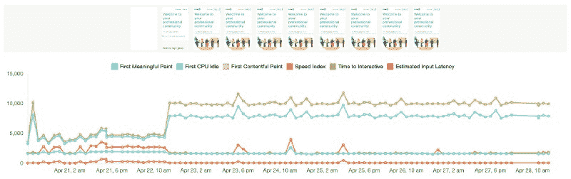
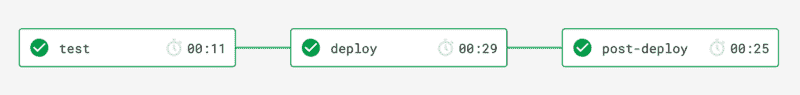
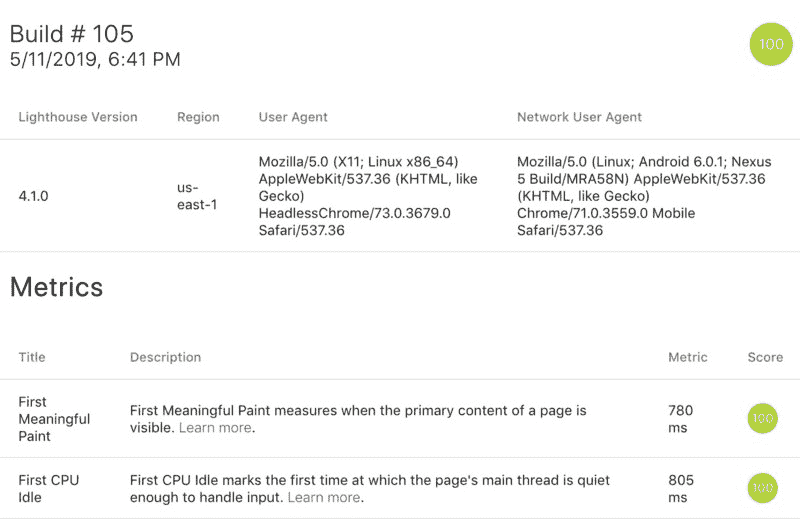

# 自动化网站性能回归测试

> 原文：<https://www.freecodecamp.org/news/automatic-website-performance-regression-testing-4e30e6bf5cd/>

亚当·汉森

# 如何用 Foo 自动化网站性能回归测试

#### 在连续交付工作流中使用部署后步骤来自动化性能回归测试

在另一篇文章中，我讲述了如何使用 Lighthouse 分析网站性能，特别是如何使用 Foo 自动监控性能。在这篇文章中，我将展示我们如何通过回归测试性能来更上一层楼…自动地？。

### 什么是回归测试？

回归测试是一种软件测试，用于确认最近的程序或代码更改没有对现有功能产生负面影响。遵循最佳实践可能包括以下内容。

*   保持严格的测试进度:在整个软件开发生命周期中，始终保持一个连续的测试进度。这不仅会迅速迫使团队适应频繁的测试制度，还会确保最终产品尽可能地得到良好的测试。
*   使用测试管理软件:除非你当前的软件项目是一个简单的自我开发的副业项目，否则你可能会有大量的测试，以至于跟踪每一个测试都远远超出了一个人或一个电子表格的能力。令人欣慰的是，市场上有许多不同的测试管理工具，旨在简化整个测试套件中所有测试的创建、管理、跟踪和报告过程。
*   **对你的测试进行分类**:想象一下一个由成百上千个测试组成的测试套件，这些测试仅仅由一个`name`或者`id`字段来标识。究竟怎么会有人整理这份庞大的清单，以找出相关的测试？解决方案是根据适合您的团队的任何标准将测试分成更小的组。大多数测试管理工具将提供分类或者标记测试的方法，这将使团队中的每个人更容易识别和引用某个*类型*的测试。
*   基于客户需求区分测试的优先级:区分测试优先级的一个有效方法是考虑客户或用户的需求。考虑给定的测试用例如何影响最终用户的体验或客户的业务需求。

查看这篇文章以获得更多信息:"[回归测试:它是什么以及如何使用它](https://airbrake.io/blog/what-is/regression-testing)"

### 「网站表现」实际上是什么意思？

> 加载时间因用户而异，取决于他们的设备能力和网络条件。**传统的**性能指标，如加载时间或 DOMContentLoaded 时间非常不可靠，因为它们发生的时间可能与用户认为应用程序加载的时间一致，也可能不一致。

> ~ [以用户为中心的性能指标|网络基础|谷歌开发者](https://developers.google.com/web/fundamentals/performance/user-centric-performance-metrics)

如今，网页加载的生命周期可以被认为是更精细的。我们可以认为网站性能指标是“以用户为中心”的。当用户访问一个网页时，他们通常会寻找视觉反馈，以确保一切正常。

下面的指标代表了页面加载生命周期的重要点。每个人都回答了关于用户体验的问题。

*   第一幅内容丰富的画:发生了吗？导航启动成功了吗？服务器有响应吗？
*   **第一幅有意义的画**:有用吗？有足够的内容让用户参与进来吗？
*   **互动时间**:是否可用？用户可以和页面交互吗，还是页面还在忙着加载？
*   **长任务(不在)**:令人愉快吗？交互是否流畅自然，没有滞后和抖动？

我们可以手动或使用类似于 [Lighthouse 的工具以编程方式运行性能审计，以向类似于上面的](https://developers.google.com/web/tools/lighthouse/)指标提供值。我们可以使用像 [Foo 这样的](https://www.foo.software) [Lighthouse integration](https://github.com/GoogleChrome/lighthouse#lighthouse-integrations) 来自动监控网站性能。在下面的例子中，你可以看到 Twitter 的性能下降，并将其与确切的日期和时间相关联！如果我们能确定这是一次确切的发布会呢？在下一节中，我将解释如何做到这一点。

Twitter Performance Degradation

### 我们如何自动回归测试性能？

我们可以完成自动性能测试，集成为连续交付管道中的部署后步骤。我们可以通过用 Foo 创建一个免费的帐户并利用它的公共 REST API 来做到这一点。请遵循以下步骤。

1.  [用 Foo](https://www.foo.software/register) 创建一个免费账户。点击发送的链接验证您的电子邮件。
2.  [在 Foo](https://www.foo.software/account/pages) 上创建一个页面，您可以将 URL 添加到您想要进行性能测试的页面。
3.  从上面的屏幕中单击您页面的列表项。这将引导您到反映您的页面的仪表板。
4.  通过滚动到上面页面的底部来获取页面 API 令牌。
5.  通过请求端点来触发测试运行，如 [Foo 的 API 文档](https://www.foo.software/docs/api/Methods.html#additems)中所述。curl 命令看起来类似于`curl -X POST "https://www.foo.software/api/v1/queue/items" -H "accept: application/json" -H "Content-Type: application/json" -d "{ \"pages\": \"pagetoken1,pagetoken2\", \"tag\": \"My Tag\" }"`。
6.  将上述命令作为部署后步骤添加到 CD 管道中。你可以在 GitHub 中找到[的完整例子。下面的](https://github.com/foo-software/website-performance-monitoring/blob/master/.circleci/config.yml) [circleci](https://circleci.com/) 片段实际定义了这一步。

在上面链接的例子中，我们的管道步骤在每次提交到我们的`master`分支时运行。

Continuous Delivery Steps

瞧，我们现在在每一次提交到`master`时部署一个版本，并自动对其进行性能审计，⭐！

Foo CD Example Automatic Performance Regression Results

### 结论

[Foo 提供了许多监控和分析性能的特性](https://www.foo.software/features)。在这篇文章中，我们研究了如何利用它来自动运行 Lighthouse 性能回归测试。以下是其他功能——其中大部分是**免费的**！

*   自动性能审计、时间线可视化和结果的详细视图。
*   当绩效下降、改善或变得“恢复正常”时，电子邮件、Slack、寻呼机 Duty 通知。
*   自动运行状况检查 pings 和通知。