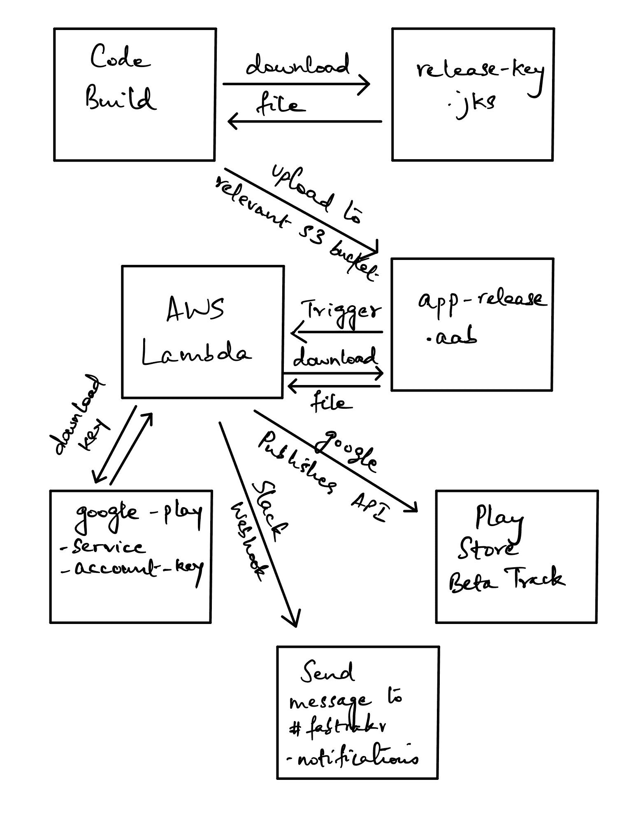

# 如何将 Android 应用捆绑包自动上传到 Play Store

> 原文：<https://www.freecodecamp.org/news/automatically-upload-an-android-app-bundle-to-the-play-store/>

在这篇文章中，我将解释如何自动上传一个 Android 应用捆绑包(。aab 文件)到 Play Store 的测试版。我们将使用 Android Studio 和 AWS 作为云基础设施提供商。

一旦我们上传了应用捆绑包，我们将触发一个松弛通知。

这是对你时间的一种有价值的利用，原因有很多，比如创造可观察性和对过程进行优先级排序。

## 我们将使用的技术

以下是我们将在本教程中使用的资源:

1.  安卓工作室
2.  AWS 代码构建
3.  自动气象站λ
4.  S3
5.  松弛的

## 项目的高级概述



上面的图片向你展示了我们将如何构建整个系统的一个概览。

本质上，需要在 AWS 上为您的 Android 存储库设置一个代码管道。该代码管道将代码构建作为其阶段之一。

推到你的 Android 应用程序库的主分支将触发代码构建。代码构建项目将从命令行签署 Android 应用程序，并将工件上传到 S3 桶。

将捆绑包上传到 S3 将触发一个 Lambda，它将下载捆绑包，并使用 Google Publishing API 将其上传到 Play Store。一旦得到 200 响应，Lambda 就会触发一个 Slack 通知。

## 如何获取您的 Google Play 服务帐户密钥

要使用 Google Play Publisher API，您需要一个 Google Play 服务帐户密钥。

服务帐户是在服务器相互通信时可以代表您的帐户。你可以在这里阅读更多关于 Google 如何使用 OAuth2.0 进行服务器到服务器的通信[。](https://developers.google.com/identity/protocols/oauth2/service-account)

要了解如何创建一个服务帐户并授予其访问 Google Play Publisher API 的权限，请点击[此处](https://developers.google.com/identity/protocols/oauth2/service-account)。

创建服务帐户并赋予其适当的权限后，请确保下载服务帐户密钥并妥善保管。你很快就会把这个上传到 S3 桶里。

## 如何签署 Android 捆绑包

要解决的主要问题是如何签署 Android 应用捆绑包。谷歌有相当不错的文档，你可以在这里找到。

下面我总结一下链接。

像这样使用`keytool`生成一个私钥:

```
keytool -genkey -v -keystore my-release-key.jks -keyalg RSA -keysize 2048 -validity 10000 -alias my-alias 
```

你可以随便叫你的钥匙。在这里，我称之为`my-release-key.jks`。您也可以选择任何您想要的别名。在本教程中，请确保使用正确的密钥名称和别名。

在 Android Studio 中打开您的`app`目录中的`build.gradle`,并向其中添加以下代码块:

```
android {
    ...
    defaultConfig { ... }
    signingConfigs {
        release {
            // You need to specify either an absolute path or include the
            // keystore file in the same directory as the build.gradle file.
            storeFile file("my-release-key.jks")
            storePassword "password"
            keyAlias "my-alias"
            keyPassword "password"
        }
    }
    buildTypes {
        release {
            signingConfig signingConfigs.release
            ...
        }
    }
} 
```

如果您将释放键的名称更改为非默认名称，请确保指定新名称。别名也是一样。

您的商店密码将是您首次将应用上传到 Play Store 时生成的密码。

现在，当你在 Android Studio 中从命令行运行命令`./gradlew :app:bundleRelease`时，你会注意到它生成了一个签名的应用捆绑包。

## 如何擦除签名信息

在`build.gradle`文件中以纯文本形式提交带有签名信息的代码存在安全风险，并且可能成为攻击媒介。

谷歌有相关的文档，你可以在这里找到。

首先，在项目目录的根目录下创建一个`keystore.properties`文件。

该文件的内容应该如下所示:

```
storePassword=myStorePassword
keyPassword=myKeyPassword
keyAlias=myKeyAlias
storeFile=myStoreFileLocation 
```

您的商店密码和密钥密码将是您第一次将应用捆绑包上传到 App Store 时使用的密码。

您的`keyAlias`和`storeFile`将分别是您在创建私钥时分配的别名和您创建的私钥的位置。

现在，我们需要将这个文件加载到`build.gradle`中。起初这让我很惊讶，但实际上 Gradle[是作为 DSL](https://docs.gradle.org/current/dsl/index.html) 工作的。所以，用 Gradle 写配置更容易。

```
//  Load properties from keystore.properties
def keystorePropertiesFile = rootProject.file("keystore.properties")

//  Creating a new Properties() object
def keystoreProperties = new Properties()

//  If keystorePropertiesFile exists, read from that, else set from build environment
if (keystorePropertiesFile.exists()) {
    //  Loading the keystoreProperties file
    keystoreProperties.load(new FileInputStream(keystorePropertiesFile))
} else {
    //  Read all environment variables from the build environment
    keystoreProperties.setProperty("storeFile", "${System.getenv('STORE_FILE')}")
    keystoreProperties.setProperty("keyAlias", "${System.getenv('KEY_ALIAS')}")
    keystoreProperties.setProperty("keyPassword", "${System.getenv('KEY_PASSWORD')}")
    keystoreProperties.setProperty("storePassword", "${System.getenv('STORE_PASSWORD')}")
} 
```

你会注意到那里的 if 条件——现在不用担心。它是专门为以后的代码构建准备的。

一旦你这样做了，在`build.gradle`中修改你的`signingConfigs`部分，如下所示:

```
signingConfigs {
        release {
            storeFile file(keystoreProperties['storeFile'])
            keyAlias keystoreProperties['keyAlias']
            keyPassword keystoreProperties['keyPassword']
            storePassword keystoreProperties['storePassword']
        }
    } 
```

## 如何设置 AWS 代码管道

我不打算在这个问题上做太多的细节描述，因为它相对简单。

通过以下三个阶段设置 AWS 代码管道:

1.  连接到 GitHub 库的`master`分支的源阶段
2.  连接到 AWS 代码构建的构建阶段
3.  将部署到 S3 存储桶的部署阶段。

你可以在这里找到更多关于建立代码管道[的文档。](https://docs.aws.amazon.com/codebuild/latest/userguide/how-to-create-pipeline.html)

## 如何设置自动气象站 S3

首先，确保将代码构建作为一个阶段来设置代码管道。接下来，设置两个 S3 桶:

1.  存放您的释放密钥的桶。我把这个桶叫做`release-key.jks`
2.  一个存储您的 Google Play 服务帐户私钥的存储桶。(您应该在创建服务帐户时下载此密钥。)

您需要允许代码生成服务角色访问这些存储桶。在设置代码管道时，应该已经创建了代码生成服务角色。

前往 IAM 控制台，找到您的代码构建服务角色，并获取 ARN。

接下来，使用控制台进入 bucket `release-key.jks`的 Permissions 选项卡，并在那里添加以下策略:

```
{
    "Version": "2012-10-17",
    "Statement": [
        {
            "Effect": "Allow",
            "Principal": {
                "AWS": [
                    "arn:aws:iam::123456789:role/service-role/codebuild-service-role-dummy",
                ]
            },
            "Action": "s3:GetObject",
            "Resource": "arn:aws:s3:::release-key-bucket/*"
        }
    ]
} 
```

此策略将允许从将执行代码构建项目的计算机上访问 S3 存储桶。

您需要将上述 ARNs 替换为您帐户的 ARNs。更新策略时，请确保为代码生成服务角色指定正确的 ARN。

您不需要更改第二个存储桶的权限策略。我们将向 AWS Lambda 角色添加相关权限，以允许它访问 bucket。

## 如何设置 AWS 代码构建

接下来，在项目根文件夹中创建一个`buildspec.yml`文件。

```
version: 0.2

phases:
  build:
    commands:
      - aws s3api get-object --bucket release-key.jks --key release-key.jks ./releaseKey.jks
      - cp ./releaseKey.jks ${CODEBUILD_SRC_DIR}/app/releaseKey.jks
      - export STORE_FILE=releaseKey.jks
      - export KEY_ALIAS=$keyAlias
      - export KEY_PASSWORD=$keyPassword
      - export STORE_PASSWORD=$storePassword
      - ./gradlew :app:bundleRelease

artifacts:
  files:
    - app/build/outputs/bundle/release/app-release.aab 
```

这个文件非常简单。它从指定的桶中获取发布密钥，并将其保存到代码构建服务器上指定位置的本地文件中。

接下来，导出`build.gradle`配置正确工作所需的所有变量。最后，从命令行运行 Gradle 的 release 命令。

在代码构建中运行这个脚本之前，您需要将变量添加到代码构建环境中。为此，首先转到 AWS 代码构建控制台，为您的 Android 应用程序选择构建项目。

接下来，选择编辑>环境，如下图所示:


完成此操作后，在弹出的屏幕上，选择附加配置下拉菜单。在这里，您将看到一个通过键值对添加环境变量的选项。

现在，当代码构建运行`buildspec.yml`文件时，它将能够导出指定的变量。

就目前的情况而言，当你的管道运行时，代码构建将能够下载私钥来签名和构建你的 Android 应用，并将签名的包上传到 S3 桶。

## 如何设置 Slack 应用程序

可观察性是自动化的标志。您想知道您的自动化何时运行，是成功还是失败，如果失败，失败的原因。

AWS 通常通过 CloudWatch 处理可观测性。但是我认为一个松散的集成也能达到这个目的。

将 Slack 集成到您的自动化工作流中的最简单的方法是设置一个 Slack 应用程序，并从您的自动化工作流向该应用程序发送通知。

要了解如何设置 Slack 应用程序，请在此处查看文档。这个过程非常简单，你应该在几分钟内就可以安装并运行一个应用程序。

一旦你创建了应用程序，你会得到一个 WebHook URL，你可以用它来调用应用程序，发布到相关的频道。跟踪这个 WebHook URL，因为我们将在 AWS Lambda 函数中使用它。

## 如何设置 AWS Lambda

到目前为止，我们有一个 Android 应用捆绑包正在被签名、构建和上传到 S3 桶。接下来，我们需要弄清楚如何将捆绑包上传到 Play Store 上的测试版。

做到这一点的方法是设置一个 AWS Lambda，它将在包上传到 S3 存储桶时被触发。当此触发发生时，Lambda 将运行，下载包，获取服务帐户密钥，并将包上传到 Play Store beta 版。

一旦您创建了一个 Lambda 并添加了一个触发器以在文件上传到 bucket 时运行它，请看下面的代码:

```
"""This Python3 script is used to upload a new .aab bundle to the play store. The execution of this Python script
    occurs through an AWS Lambda which is invoked when a new file is uploaded to the relevant S3 buckets"""

import json
import boto3
import os
from urllib import request, parse
from google.oauth2 import service_account
import googleapiclient.discovery

#   Defining the scope of the authorization request
SCOPES = ['https://www.googleapis.com/auth/androidpublisher']

#   Package name for app
package_name = 'com.app.name'

#   Define the slack webhook url
slack_webhook_url = os.environ['SLACK_WEBHOOK_URL']

def send_slack_message(message):
    data = json.dumps({ 'text': message })
    post_data = data.encode('utf-8')
    req = request.Request(slack_webhook_url, data=post_data, headers={ 'Content-Type': 'application/json' })
    request.urlopen(req)

#   This is the main handler function
def lambda_handler(event, context):
    #   Create a new client S3 client and download the correct file from the bucket
    s3 = boto3.client('s3')
    s3.download_file('service-account-bucket-key', 'service-account-bucket-key.json', '/tmp/service-account-key.json')
    SERVICE_ACCOUNT_FILE = '/tmp/service-account-key.json'

    #   Download the app-release.aab file that triggered the Lambda
    bucket_name = event['Records'][0]['s3']['bucket']['name']
    file_key = event['Records'][0]['s3']['object']['key']
    s3.download_file(bucket_name, file_key, '/tmp/app-release.aab')
    APP_BUNDLE = '/tmp/app-release.aab'

    print(f"A bundle uploaded to {bucket_name} has triggered the Lambda")

    #   Create a credentials object and create a service object using the credentials object
    credentials = service_account.Credentials.from_service_account_file(
        SERVICE_ACCOUNT_FILE, scopes=SCOPES
    )
    service = googleapiclient.discovery.build('androidpublisher', 'v3', credentials=credentials, cache_discovery=False)

    #   Create an edit request using the service object and get the editId
    edit_request = service.edits().insert(body={}, packageName=package_name)
    result = edit_request.execute()
    edit_id = result['id']

    #   Create a request to upload the app bundle
    try:
        bundle_response = service.edits().bundles().upload(
            editId=edit_id,
            packageName=package_name,
            media_body=APP_BUNDLE,
            media_mime_type="application/octet-stream"
        ).execute()
    except Exception as err:
        message = f"There was an error while uploading a new version of {package_name}"
        send_slack_message(message)
        raise err

    print(f"Version code {bundle_response['versionCode']} has been uploaded")

    #   Create a track request to upload the bundle to the beta track
    track_response = service.edits().tracks().update(
        editId=edit_id,
        track='beta',
        packageName=package_name,
        body={u'releases': [{
            u'versionCodes': [str(bundle_response['versionCode'])],
            u'status': u'completed',
        }]}
    ).execute()

    print("The bundle has been committed to the beta track")

    #   Create a commit request to commit the edit to BETA track
    commit_request = service.edits().commit(
        editId=edit_id,
        packageName=package_name
    ).execute()

    print(f"Edit {commit_request['id']} has been committed")

    message = f"Version code {bundle_response['versionCode']} has been uploaded from the bucket {bucket_name}.\nEdit {commit_request['id']} has been committed"
    send_slack_message(message)

    return {
        'statusCode': 200,
        'body': json.dumps('Successfully executed the app bundle release to beta')
    } 
```

上面的 Lambda 将使用`googleapiclient`库及其发现模块来构建 Google Play 发布 API 的 URL。

接下来，Lambda 将从您之前设置的桶中下载服务帐户密钥。您必须确保您指定了正确的存储桶名称。

根据上传是成功还是失败，我们希望发出一个 Slack 消息。将上一节中的 Slack WebHook URL 添加到 Lambda 的环境变量中。上面的函数使用 Python 的`os`模块来访问环境变量，并将消息发送到 Slack。

如果您的 Lambda 失败，可能是因为您的 Lambda 没有权限访问存储您的 Google Play 服务帐户密钥的 S3 存储桶。在这种情况下，您将会看到一条错误消息指出这一点。

要解决这个问题，您只需要向您的 Lambda 角色添加相关的权限。

以下是您需要添加的策略:

```
{
    "Version": "2012-10-07",
    "Statement": [
        {
            "Effect": "Allow",
            "Action": [
                "s3:GetObjectVersion",
                "s3:GetBucketVersioning",
                "s3:GetBucketAcl",
                "s3:GetObject",
                "s3:GetBucketTagging",
                "s3:GetBucketLocation",
                "s3:GetObjectVersionAcl"
            ],
            "Resource": [
                "arn:aws:s3:::arn:aws:s3:::your-bucket-name-with-service-account-key"
            ]
        }
    ]
} 
```

将桶的 ARN 替换为与您的帐户相关的，您就可以开始了。

## 结论

所以，你有它。这肯定不容易，而且有许多移动部件，但这是一种自动化，将为您节省大量时间和精力。

如果你是一个经常发布新应用程序更新的团队的一员，你不希望因为缺少一个负责发布更新的人而受到阻碍。

构建这种自动化会使您的 CI/CD 工作流更加顺畅和健壮。

如果你对这样的博客感兴趣，你可以在[https://redixhumayun . github . io](https://redixhumayun.github.io)阅读更多内容，或者在 Twitter 上关注我。