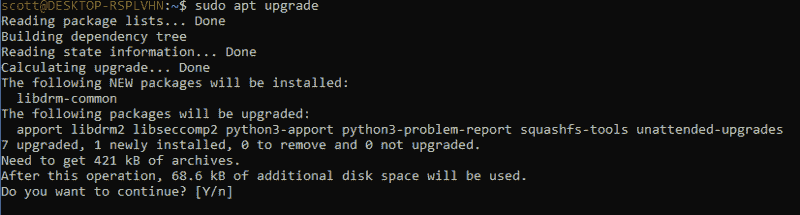
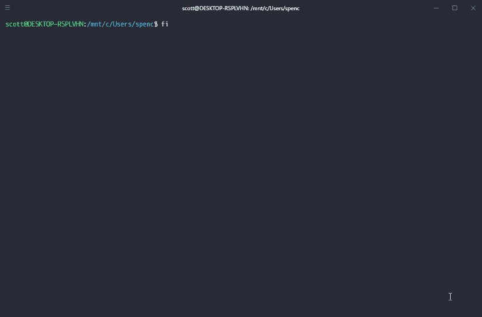
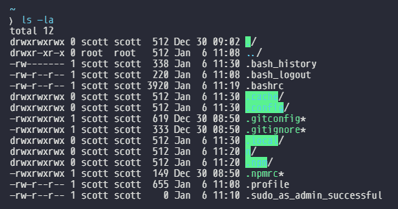
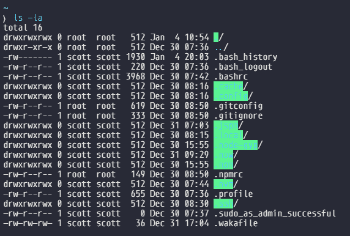

# 自动化您的 Windows 子系统 Linux 设置

> 原文：<https://www.freecodecamp.org/news/automating-your-windows-subsystem-linux-setup-df4c9a7b0e7b/>

我是 Windows 用户，从记事起就一直如此。我也摆弄过 Linux，但还是坚持使用 Windows，因为我发现它对我来说不太重要。两者各有利弊。但是当我开始学习 web 开发时，Windows 对我来说最大的一个缺点是缺少我所有的 Linux 命令行工具。

那是在 Windows 子系统 Linux (WSL)出现之前？

我喜欢！你可以在 Windows 中拥有一个 Bash shell，并通过它运行所有 Node.js 应用程序，而且有了 Windows 10 Fall Creators 更新，WSL 真的很容易设置。

快速背景故事为什么我张贴这个。前几天我销毁了我的笔记本电脑，因为我在 Windows 上使用 Bash 时遇到了一些问题，这些问题部分与将 [nvm](https://github.com/Microsoft/WSL/issues/776) 用于 WSL 有关。我对我的电脑的表现感到沮丧。但我现在意识到我反应过度了。

在我重新启动我的计算机后，我不得不从头开始重新设置我的开发环境。幸运的是，我把我所有的设置和配置信息都保存在一个 [GitHub repo](https://github.com/spences10/settings) 中，以防我得到一台新电脑或者从灾难性事件中恢复过来(比如一台被核化的电脑)。

在本文中，我将向您展示如何为我的开发环境设置我的 Windows 子系统 Linux。

这是我对 WSL 的具体设置和使用的看法，也是我下一次在 Windows 上从头开始构建开发环境的逐步指南。

所以，从微软商店安装 [WSL](https://www.microsoft.com/store/productId/9NBLGGH4MSV6) 并添加你的默认用户后，第一件事就是更新升级一切。

```
sudo apt updatesudo apt -y upgrade
```

如果您在升级声明中的`-y`之前没有使用过任何 Linux 发行版，那么对于终端中显示的任何提示，默认回答“是”。你可能不想这样做，因为可能有一些程序你不想更新，但我想。



Yes to all the things!

通过添加`-y`标志，您将不会收到这些消息？

**构建工具**

为了从 npm 编译和安装本机附加组件，您可能还需要安装构建工具，我需要这个工具用于 Gatsby images，它使用`sharp`，而后者又使用`node-gyp`:

```
sudo apt install -y build-essential
```

**安装节点**

通过 nodejs.org 网站上给出的说明安装 Node.js 并没有为我设置正确的权限。所以当我试图`npm install`任何我得到的错误时，我[发现](https://github.com/Microsoft/WSL/issues/776#issuecomment-266112578)使用`n`有帮助:

**用`n`安装节点**

因为是全新安装，所以我们可以继续使用 [n-install](https://github.com/mklement0/n-install) 和:

```
curl -L https://git.io/n-install | bash
```

这将安装 node 的最新稳定版本？

脚本完成后，使用以下命令重启 bash:

```
. /home/my_user_name/.bashrc # displays this for you to copy paste
```

检查您的节点和 npm 版本:

```
node -v && npm -v
```

**装鱼？**

Fish 现在是我的外壳，纯粹是为了自动完成/智能感知？也有一些不错的主题，你也可以得到它。



fish awesomeness ?

```
sudo apt -y install fishsudo apt -y upgrade && sudo apt -y autoremove
```

**安装我的鱼| OMF**

哦，我的鱼就像是鱼的包管理器，可以安装包和主题。

```
curl -L https://get.oh-my.fish | fish
```

**安装 OMF 主题**

```
omf install clearance
```

**开始的开始**

好了，这就是 WSL 的基本设置。您现在可能想要设置 Git。我已经在 WSL 上通过 HTTPS 使用 SSH 有一段时间了。

**注意:**在我写这篇文章的时候，WSL Git 与 VSCode 的集成还不能工作，所以我在我的 windows 机器上添加了一个 Git 安装，你可以省略它，通过终端进入完整的 Git，但是我真的很喜欢 VSCode Git 集成。

要在您的机器上设置 SSH，请看一下这个[方便的 SSH 设置](https://github.com/spences10/cheat-sheets/blob/master/git.md#how-to-authenticate-with-github-using-ssh)。我说 SSH 而不是 HTTPS，因为我在 Git 凭证管理器和密匙环管理器上遇到了各种各样的问题。最后，创建一个 SSH 密钥并通过 GitHub 进行认证实际上更快。我链接的指南会带你浏览。

**移动你的点文件**

如果你已经在 GitHub repo 中备份了所有的[点文件](https://github.com/spences10/dotfiles)，那么现在是将它们添加到你的 WSL 文件夹的好时机，上次我这样做时，我在移动每个文件后手动设置了权限，但后来发现`[rsync](https://www.tecmint.com/rsync-local-remote-file-synchronization-commands/)`移动了所有文件。

```
rsync -avzh /mnt/c/Users/dotfiles/ ~/
```

这将把我的`dotfiles`文件夹的内容复制到 WSL 中的`~/` (home)目录，您可以用:

```
ls -la ~/
```



我复制了我的`.gitconfig`、`.gitignore`和`.npmrc`点文件，你可以看到权限与`.bashrc`文件不一致。

使用`chmod`更改文件权限，并使用`stat`获取类似文件的属性:

```
stat -c “%a %n” ~/.*
```

这将列出所有以`.`开头的内容，这是我的:

```
777 /home/scott/.755 /home/scott/..600 /home/scott/.bash_history644 /home/scott/.bash_logout644 /home/scott/.bashrc777 /home/scott/.cache777 /home/scott/.config777 /home/scott/.gitconfig777 /home/scott/.gitignore777 /home/scott/.local777 /home/scott/.npm777 /home/scott/.npmrc644 /home/scott/.profile644 /home/scott/.sudo_as_admin_successful
```

我只想在这里更改`.gitconfig`、`.gitignore`和`.npmrc`，所以我要这样做:

```
chmod 644 .gitconfig .gitignore .npmrc
```

现在我的文件是这样的。？



好了，现在我们已经安装并运行了更新的 Ubuntu，节点和 fish 终端。当然，现在仍然有安装所有你想要开发的全局 npm 包的情况。

祝你好运！

### 感谢阅读

如果你认为这很有趣，请留下一两个掌声，订阅未来的更新或发推特告诉我你的想法。

如果我错过了什么，或者如果你有更好的方法，请告诉我。

在 GitHub 上让我上 Twitter 或者 T2 问我任何问题。

> 你可以在我的博客上阅读其他类似的文章。