# 如何在 Linux 启动时自动挂载存储分区

> 原文：<https://www.freecodecamp.org/news/automount-a-storage-partition-on-startup-in-linux/>

默认情况下，除了根分区和主分区之外，Linux 操作系统不会在启动时自动挂载任何其他分区。

稍后您可以很容易地挂载其他分区，但是您可能希望在启动时启用某种自动挂载功能。这意味着在登录到 Linux 操作系统后，您不需要一个接一个或一次全部安装它们。

就我个人而言，我喜欢在启动时为我的一些分区启用自动挂载功能，这些分区是我在台式计算机上工作时经常使用的。

因为我需要一直访问这些分区，所以我不喜欢每次登录到我的电脑时单独安装它们的麻烦——所以我也在它们上面使用自动安装功能。这就是为什么我想，为什么不在这里分享如何做到这一点！

嗯，有很多设置自动挂载。在这篇文章中，我将向你介绍一个我认为是其中更简单、更容易的过程。

不要害怕！我还制作了一个关于整个过程的视频教程。所以如果你想要一个可视化的演示，你可以在这里观看视频。

[https://www.youtube.com/embed/0Hfde3Iy41E?feature=oembed](https://www.youtube.com/embed/0Hfde3Iy41E?feature=oembed)

Complete Video Tutorial

## 如何在 LinuxOS 中启动时自动挂载任何分区

在本演练中，我将使用一个名为 **gnome-disk-utility** 的简单 GUI 应用程序。你也可以在 [GitLab](https://gitlab.gnome.org/GNOME/gnome-disk-utility) 查看他们的官方回购。

这一次，我使用了一个著名的 Linux 发行版，名为 [Manjaro](https://manjaro.org/) ，但是您可以将同样的方法应用于任何种类的 Linux 发行版。

首先，让我给你看看我的磁盘和分区。目前，我的台式电脑上有两个存储设备。其中一个是 240GB 的固态硬盘，另一个是 2 TB 的硬盘。

下图显示了我硬盘中的分区:

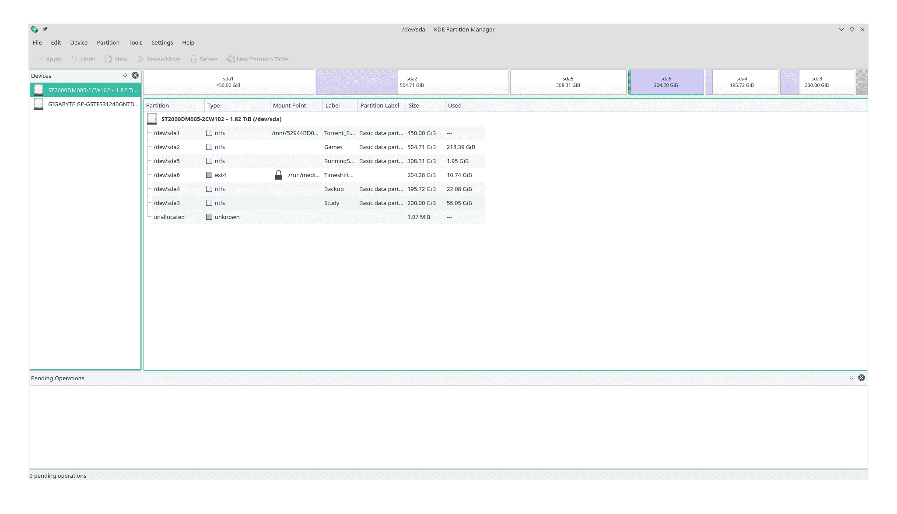

HDD Partitions

这张图显示了我的固态硬盘中的分区:

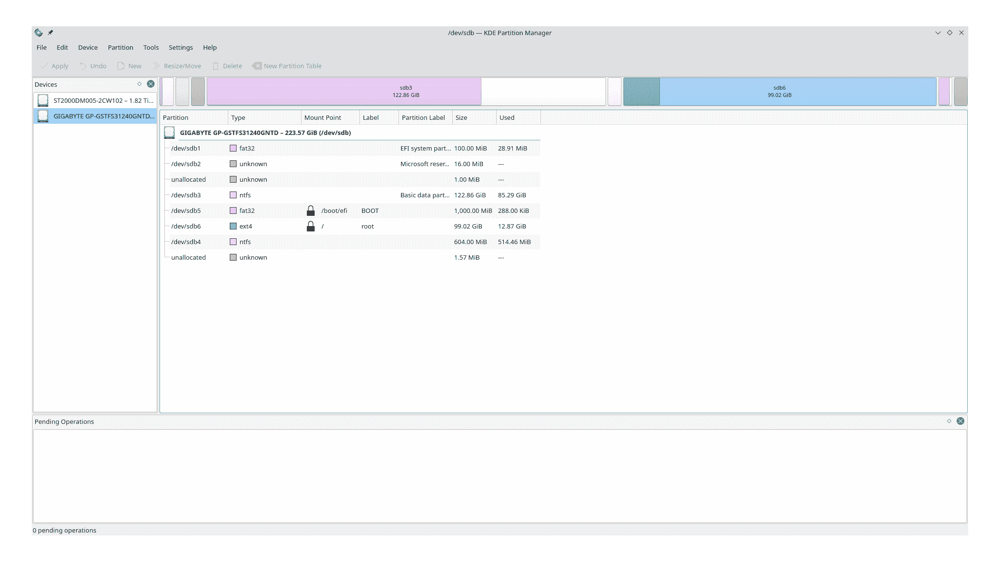

SSD Partitions

要在我想要的分区上应用自动挂载特性，我需要现在安装应用程序。遵循下面给出的步骤。

### 设置自动装载的步骤

1.  打开您的软件中心或添加/删除软件。

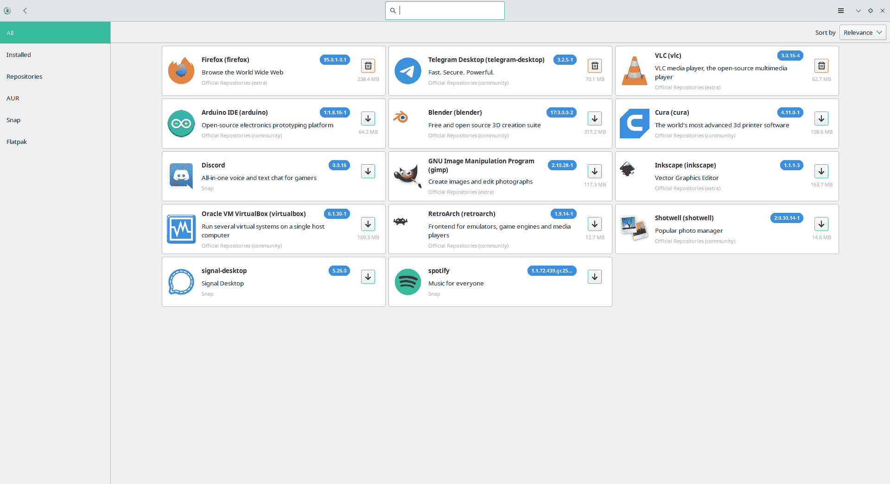

Add/Remove Software

2.搜索 gnome-disk-utility，您会得到以下内容:

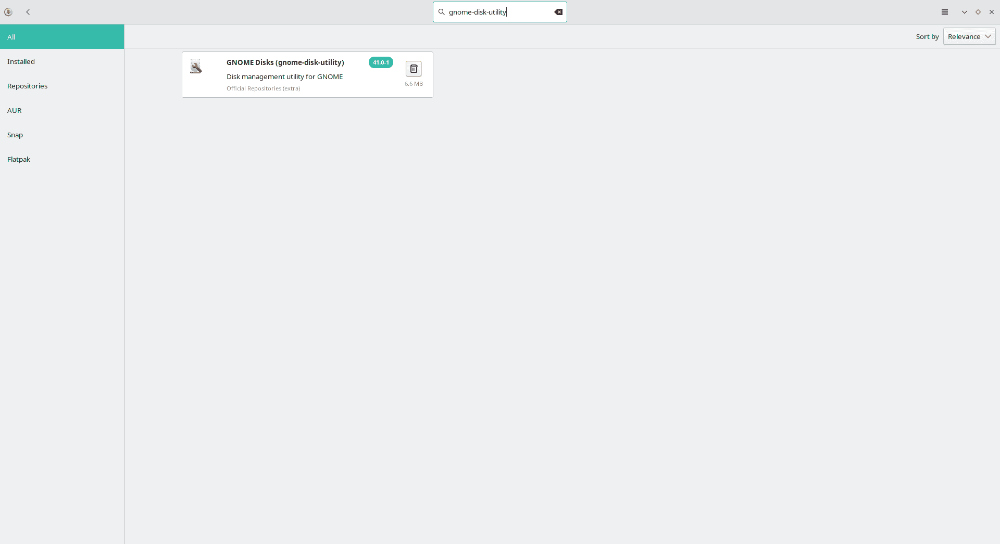

gnome-disk-utility

在这种情况下，我已经安装了应用程序，因此它不会要求我安装它。

如果您还没有安装这个应用程序，那么您需要先安装它。安装程序非常简单。只需提供许可，它就会自动安装。

3.打开我们刚刚安装的应用程序。你可以在菜单中找到它，名为**磁盘**。

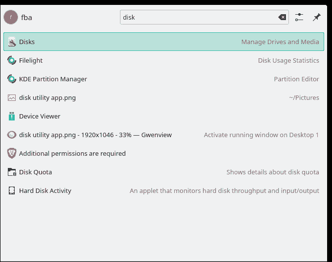

Disks in menu

您将在应用程序的左侧看到固态硬盘/硬盘:

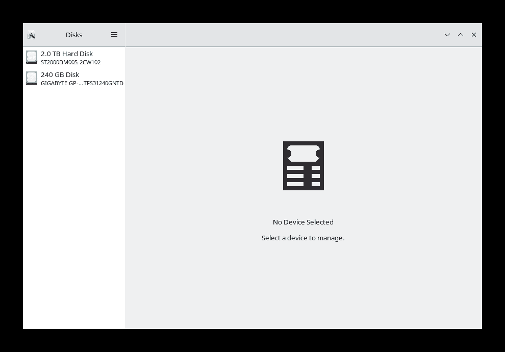

SSDs/HDDs

4.选择要启用自动装载功能的 SSD/HDD。

在这种情况下，我想在我的硬盘分区中启用该特性。因此，我会从左侧选择`2.0TB Hard Disk`。之后，它会显示我硬盘上所有的活动分区。

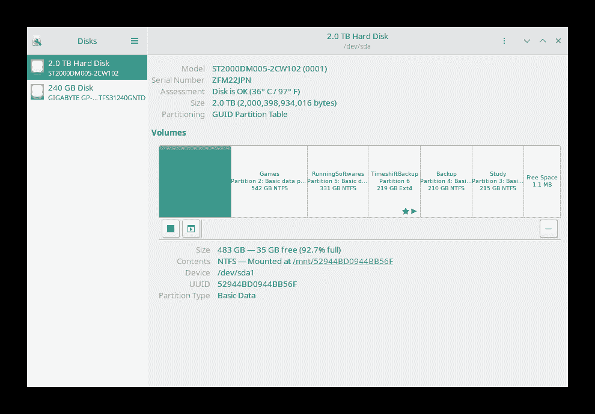

HDD partitions in gnome-disk-utility

5.接下来，只需选择您希望启用该功能的分区，然后从左下方单击右侧图标。它将为您打开“附加分区选项”。

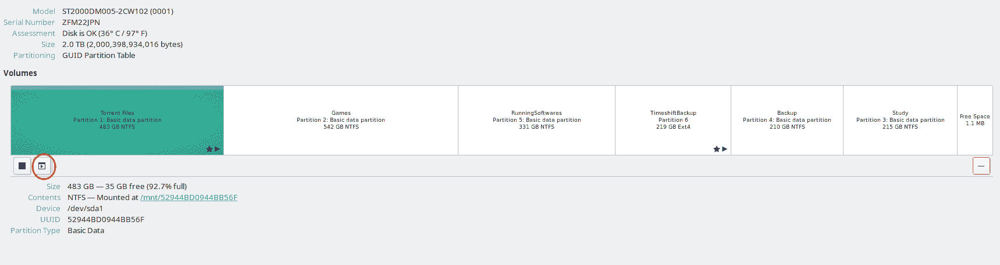

The icon for accessing the Additional Partition Options

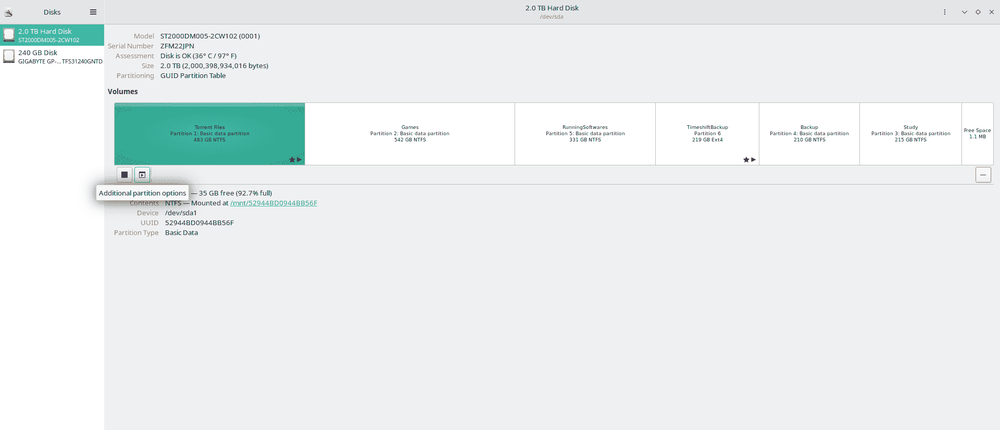

Additional Partition Options

6.然后从侧面菜单栏中选择`Edit Mount Options...`:

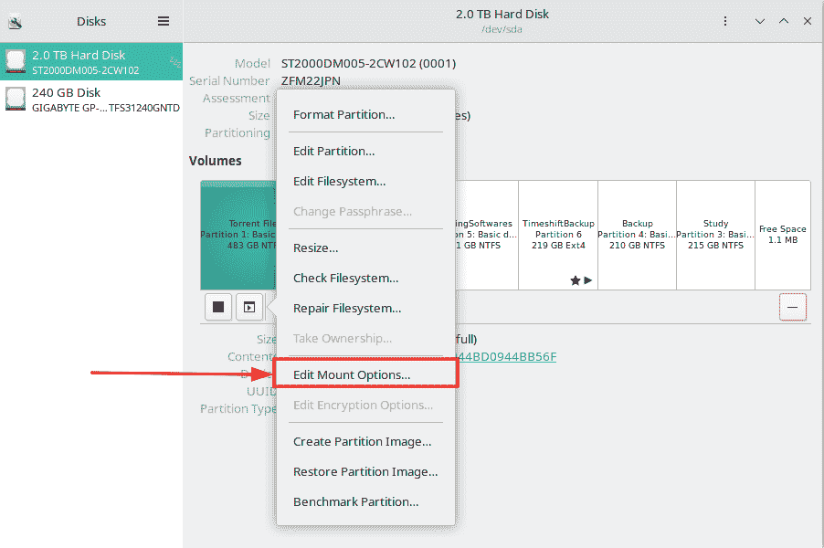

Select the Edit Mount Options...

7.取消勾选`User Session Defaults`。

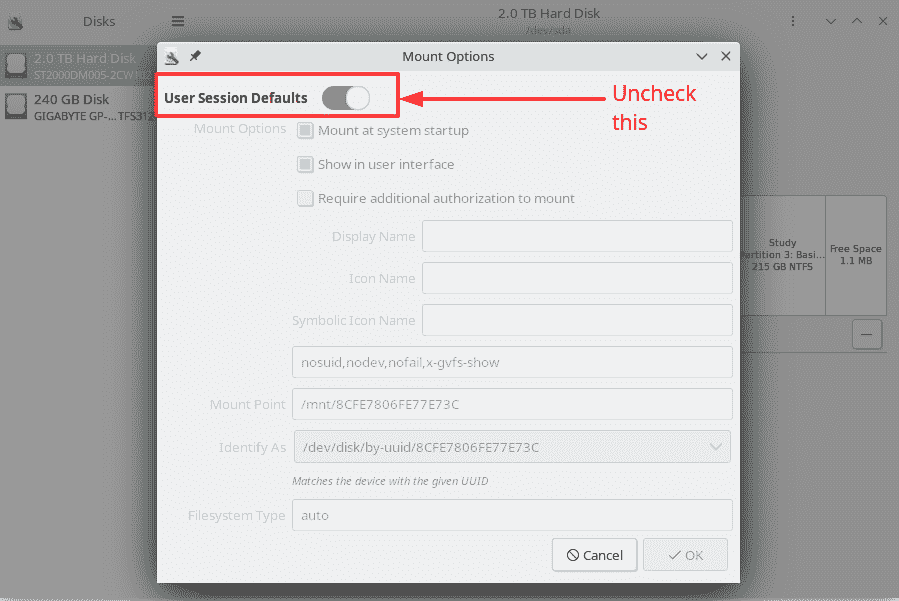

User Session Defaults

8.确保勾选了`Mount at system startup`旁边的复选框。如果您愿意，也可以自定义其他设置，但是对于我们在系统启动时的自动挂载过程，我们的任务几乎已经完成。

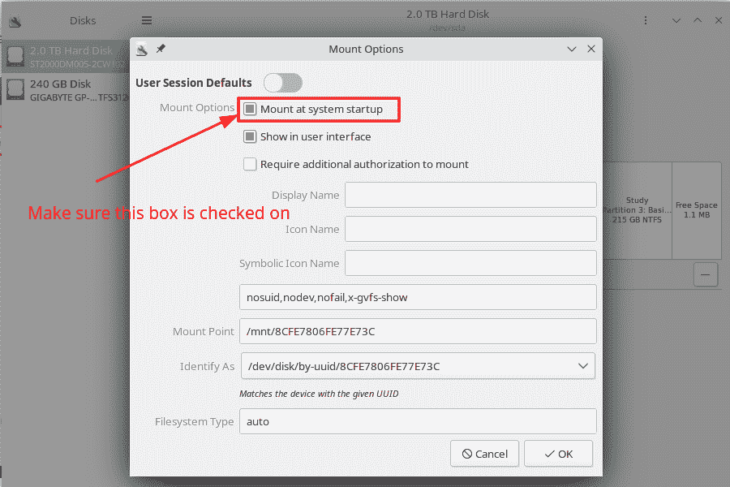

Mount at system startup

9.现在点击`OK`。

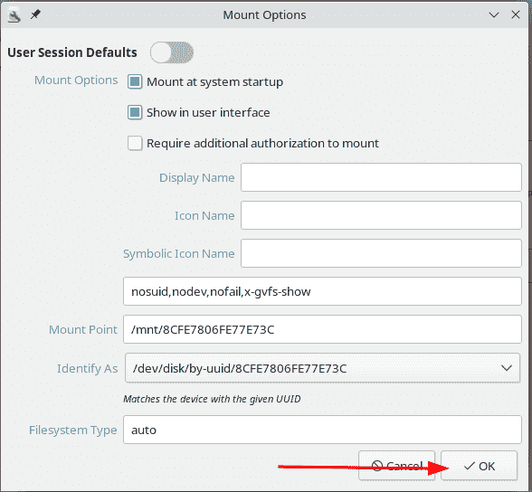

Mount options completed

从现在起你可以走了！这种方法同样适用于任何要启用自动挂载功能的驱动器分区。

## 结论

非常感谢您抽出宝贵的时间来阅读整篇文章。我在我的 [YouTube 频道](https://www.youtube.com/channel/UCEF4lxmpBKV2oYCSFH6ExIQ)上发布了许多编程和软件相关的内容。

如果你对开源项目感兴趣，那么你也可以在 GitHub 上关注我，因为我在这个平台上非常活跃。

如果你想与我讨论，或者如果你想与我联系，那么我也可以在 [Twitter](https://twitter.com/Fahim_FBA) 和 [LinkedIn](https://www.linkedin.com/in/fahimfba/) 上找到我。

哦！我忘了说我也有一个个人网站，我喜欢每隔一段时间更新一次。你可以在 https://fahimbinamin.com/检查一下。

再次感谢！