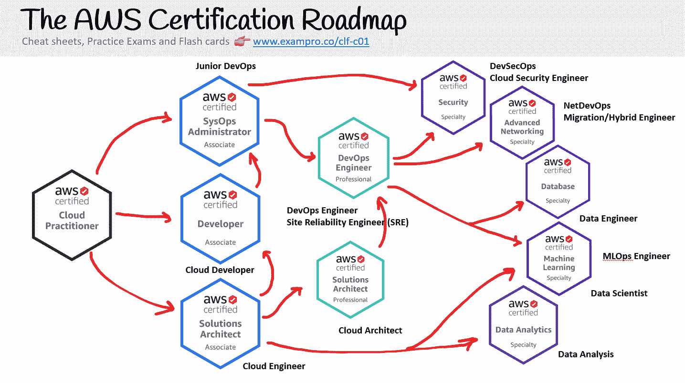
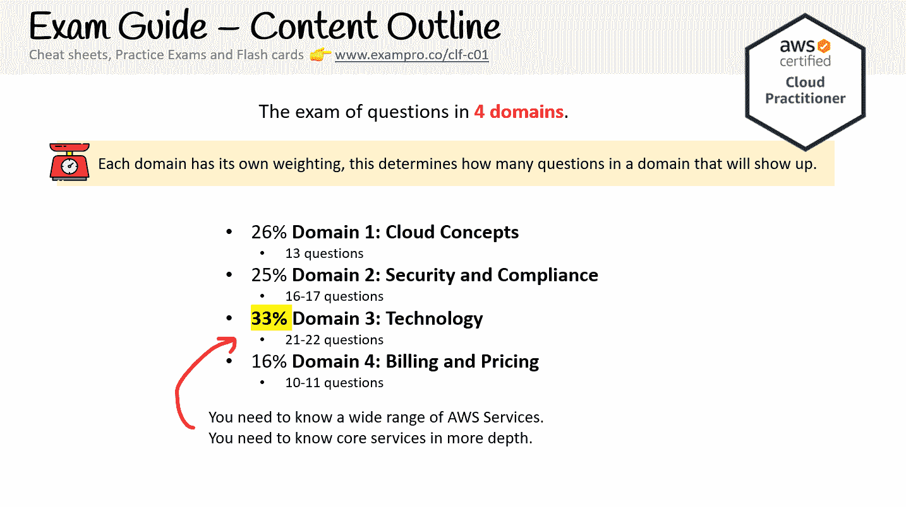
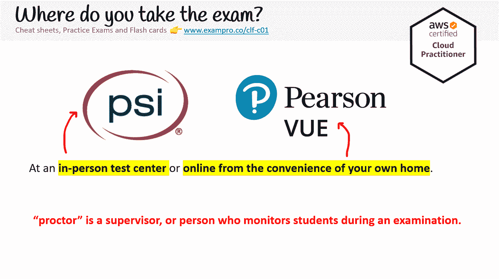
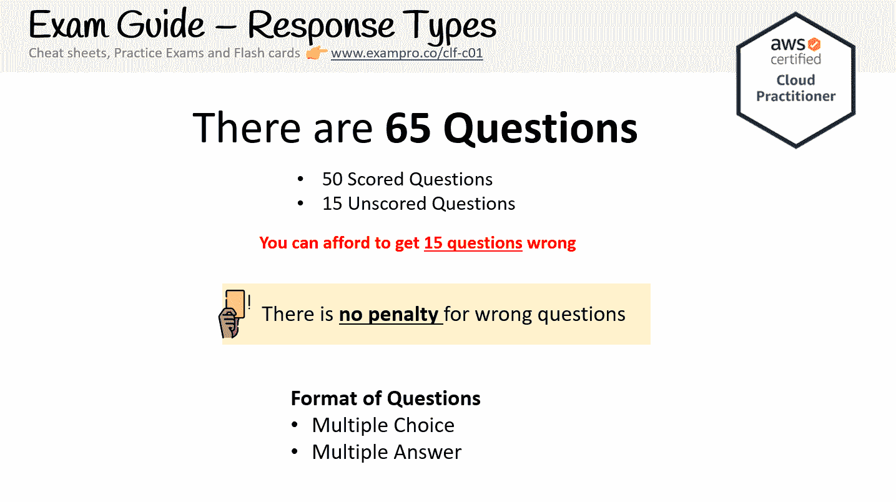
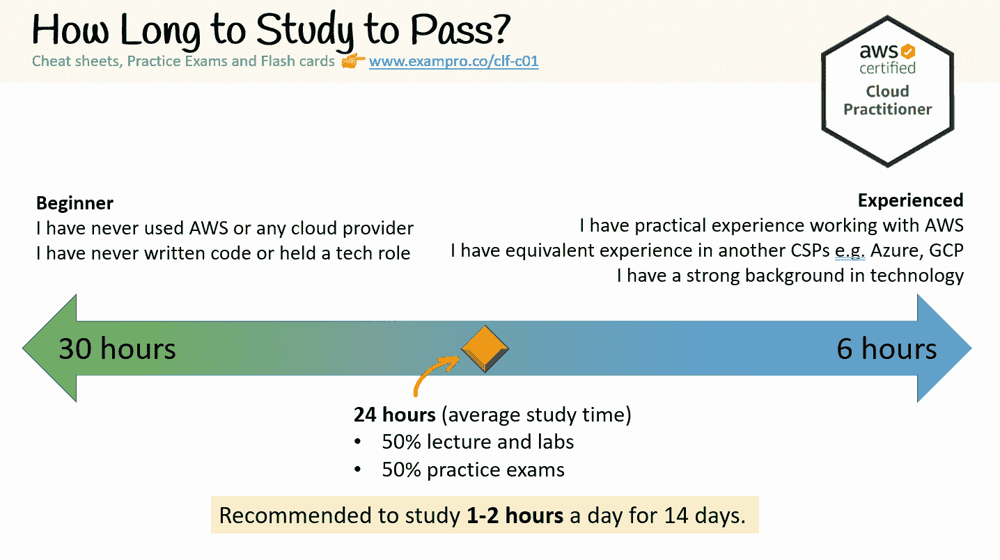

# AWS 认证云从业者学习课程–通过 13 小时的免费课程考试

> 原文：<https://www.freecodecamp.org/news/aws-certified-cloud-practitioner-certification-study-course-pass-the-exam/>

通过 AWS 认证云从业者考试是进入云开发职业生涯的第一步。freeCodeCamp 刚刚发布了我的 12 小时免费课程，可以帮助你准备考试。

这次考试主要涉及云计算概念。即使你是编程新手，你也应该能够准备这个考试并获得 AWS 认证。

整个免费课程现在在 YouTube 上直播，链接如下。在深入了解之前，请阅读本指南，以帮助您决定 AWS 认证云从业者认证是否适合您。

## 什么是 AWS 认证云从业者？

认证云从业者是通过以下步骤的**入门级 AWS 认证**:

*   云基础知识，例如云概念、云架构和云部署模型
*   密切关注 AWS 核心服务
*   快速浏览大量的 AWS 服务
*   云的身份、安全性和治理
*   AWS 服务的计费、定价和支持

课程代码是 **CLF-C01** ，但它通常被称为 **CCP** 。

亚马逊网络服务是全球领先的云服务提供商(CSP)，AWS 认证的云从业者**是人们进入云行业最常见的起点**。

如果符合以下条件，请考虑 AWS 认证云从业者:

*   你是云的新手，需要学习基础知识
*   您处于**行政、管理或销售级别**，需要获取关于云的战略信息，以便采用或迁移
*   您是一名高级云工程师或解决方案架构师，在工作多年后，需要**重置或更新**您的 AWS 知识

无论您选择哪种云角色，AWS 认证云从业者都会提供您不应跳过的基础知识。

## 本课程与 2019 AWS 认证云从业者课程有何不同

这是在 freeCodeCamp 上发布的第二版 AWS 认证云从业者课程。这个版本的内容增加了三倍，所有以前的内容都经过了修改、扩展和重新拍摄。

我做了这些重大更新，因为 AWS 认证云从业者考试做了一些重要的改变。总的来说 AWS 增加了这个考试的难度。

## AWS 认证云从业者概述

AWS 认证云从业者分为 3 个领域，每个领域都有自己的权重。权重决定了考试中出现的关于该领域的问题数量。

*   领域 1:云概念占 26%
*   领域 2:安全性和合规性占 25%
*   领域 3:技术占 33%
*   域 4 的计费和定价为 16%

官方考试指南列出了一个很长的可能出现在考试中的服务、技术和概念的列表。实际上，可能出现的内容只有三分之一会出现在考试中。

## 如何获得认证？

谷歌使用 Pearson Vue 和 PSI 考试中心来交付考试。你可以亲自参加考试，也可以在网上参加。

如果您想用任何一种考试方法安排考试，您可以通过 [AWS 培训帐户](https://aws.amazon.com/certification/certification-prep/testing/)来完成。

还有 ****6** 5 **选择题**** 和**选择题**你要把 ****打 70%才能通过**** 。

AWS 认证云从业者费用****100**美元。******

## **我可以简单的看视频通过考试吗？**

**AWS 增加了这次考试的难度。虽然观看讲座视频对通过考试至关重要，但如果你想通过考试，拥有实践经验和利用模拟考试是必不可少的。**

**您需要学习的内容会有所不同，但平均来说，您需要在 2 周内花费大约 24 小时来准备成功通过 AWS 认证云从业者考试。**

****

**本课程附带一个完全免费的实践考试，您可以在 ExamPro 上注册，无需信用卡即可免费兑换。**

**ExamPro 有多个[付费模拟考试](https://exampro.co/gcp-cdl)以及其他学习材料，以增加您通过考试的机会。**

**前往 freeCodeCamp 的 YouTube 频道开始学习 6 小时的课程。**

 **[https://www.youtube.com/embed/SOTamWNgDKc?feature=oembed](https://www.youtube.com/embed/SOTamWNgDKc?feature=oembed)**