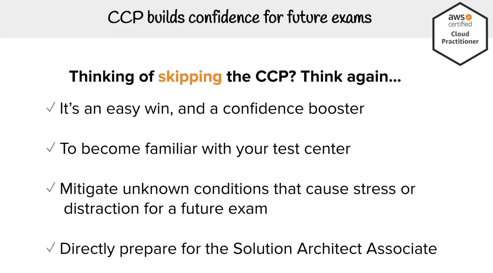

# AWS 认证云从业者培训 2019-4 小时免费视频课程

> 原文：<https://www.freecodecamp.org/news/aws-certified-cloud-practitioner-training-2019-free-video-course/>

本周的免费技术课程令人兴奋。使用 AWS 的云计算。你也可以获得认证。

与 freeCodeCamp 的 YouTube 频道上的所有视频一样，为了您的方便，这是一个完整的视频课程。如果你喜欢，可以考虑支持我们的朋友安德鲁·布朗，他通过购买他的付费课程创建了这个网站。

你也可以随时向我们的非营利组织捐赠。在我们[可笑的效率水平](https://www.freecodecamp.org/news/the-future-of-freecodecamp-5-year-anniversary/)，你给的每一美元都可以转化为全世界人民 50 小时的免费技术教育。

## 什么是 AWS 认证云从业者，你如何获得认证？

亚马逊网络服务(AWS)是使用最广泛的云计算服务之一。

使用云(基本上就是其他人的电脑的集合)的一大优势是，你不再需要购买自己的服务器并接入互联网。

相反，你可以在云中租用自己的服务器，并在上面运行你的应用程序。而且截至 2019 年，大部分公司都是这么做的。

# 合理的首款云认证

如果你想开始获得一些开发者认证，AWS 认证云从业者可能是一个很好的起点。

A slide from the course explaining why you should consider getting the CCP even though it isn't that technical and probably won't help you get a job on its own. In short - it's a confidence booster for future exams.

对于初学者来说，这不是超级技术。你可以在不知道如何编码的情况下获得这个认证。[官方认证描述](https://aws.amazon.com/certification/certified-cloud-practitioner/)建议你具备一些基本的 IT 知识和“六个月的 AWS 云工作经验，包括技术、管理、销售、采购或财务。”

但是如果你看了这个课程并在你自己的电脑上跟着做，你应该没问题。这门课程将为你详细分解大多数重要的概念。

安德鲁说，大多数人只需要 20 到 50 个小时来准备考试。尽管你可以在网上参加考试，他还是建议你亲自去考试中心参加。原因如下:

> “CCP 有什么价值？它可以帮助你表面上增加认证数量。但在简历上并不被认可为开发者的重要认证。如果你是训练营的毕业生，这可能是你熟悉 AWS 的一个很好的标志。”

> “但你应该去拿 CCP。这是为什么呢？原因完全不同。CCP 将帮助你建立信心，这是一场非常容易的胜利。因为这是最简单的认证。这是最便宜的认证。当你参加真正的考试时，这是一个让你放松的绝佳机会。

> “AWS 解决方案架构师助理考试和其他考试都非常难。通过参加 CCP 并前往考试中心，你将了解考试中心以及环境将是什么样的，这就是 CCP 的巨大价值。这是轻松获得助理认证的一种非常简单的方式。”

这是本课程涵盖主题的完整列表。我知道这是一个很长很长的清单。如果你想使用描述中的时间戳跳转到视频的特定部分，这里有一个链接，链接到 freeCodeCamp 的 YouTube 频道上的[完整的 AWS CCP 课程。](https://www.youtube.com/watch?v=3hLmDS179YE)

如果有疑问，使用谷歌搜索。这种东西不是火箭科学，外面有很多好文章。

## 云概念

*   什么是云计算？
*   云计算的六大优势和好处
*   云计算的类型
*   云计算部署模型

## AWS 全球基础设施

*   地图概述
*   地区
*   可用性区域
*   边缘位置
*   GovCloud 区域

## 入门指南

*   创建 AWS 帐户
*   计费首选项、预算和警报
*   更改 IAM 用户登录链接
*   在根帐户上激活 MFA
*   创建单个 IAM 用户
*   设置密码策略

## 把手放在某物或者某人身上

*   地区
*   EC2
*   会话管理器
*   高级材料情报(Advanced Material Information)
*   自动缩放组
*   弹性负载平衡器
*   S3
*   云锋
*   无线电数据系统
*   希腊字母的第 11 个

## ️ EC2 定价模型

*   按需
*   内向的; 寡言少语的; 矜持的
*   地点
*   专注的
*   EC2 定价备忘单

## ️计费和定价

*   免费服务
*   AWS 支持计划
*   跟进-让我们创建一个支持案例
*   AWS 市场
*   跟随-市场订阅
*   AWS 值得信赖的顾问
*   跟随值得信赖的顾问
*   合并计费
*   合并帐单数量折扣
*   AWS 成本浏览器
*   AWS 成本浏览器跟进
*   AWS 预算
*   AWS 预算紧随其后
*   TCO 计算器
*   TCO 计算器跟进
*   自动气象站着陆区
*   资源组和标记
*   资源组紧随其后
*   AWS 快速入门
*   AWS 成本和使用报告
*   成本和使用随之而来

## 技术概述

*   AWS 组织和客户
*   AWS 组织跟进
*   AWS 网络
*   数据库服务
*   供应服务
*   计算服务
*   存储服务
*   以业务为中心的服务
*   企业集成
*   日志服务
*   知道你的缩写

## AWS 安全性

*   分担责任模式
*   AWS 合规计划
*   AWS 工件
*   AWS 工件跟随其后
*   亚马逊检查员
*   AWS 晶圆
*   AWS 屏蔽
*   渗透测试
*   警卫任务
*   密钥管理服务
*   你有亚马逊
*   安全组与 NACLs
*   AWS VPN

## 变异研究

*   云*服务
*   *连接服务
*   弹性代码转换器与媒体转换
*   社交网站 vs SQS
*   检查员与值得信赖的顾问
*   ALB 对 NLB 对 CLB
*   SNS vs SES
*   人工制品与检查员

# 考试本身要花多少钱？

注意，这个视频课程是完全免费的，但是亚马逊的 CCP 考试本身就要 100 美元(模拟考试每次 20 美元)。[您可以在这里安排考试](https://www.aws.training/certification?src=practitioner)。

不，亚马逊不会付钱让我们给你这些信息。我们只是认为这是一个值得探索的认证。

AWS 还有许多其他认证。谷歌、微软和其他云服务提供商也是如此。

像往常一样，在你花钱参加考试之前做好你的研究。

好的——这是全部的菜。为了方便你，我把它嵌在下面了。准备好你的记事本，如果你有第二台显示器的话，把你的电脑插上。记得玩得开心。？

[https://www.youtube.com/embed/3hLmDS179YE?feature=oembed](https://www.youtube.com/embed/3hLmDS179YE?feature=oembed)