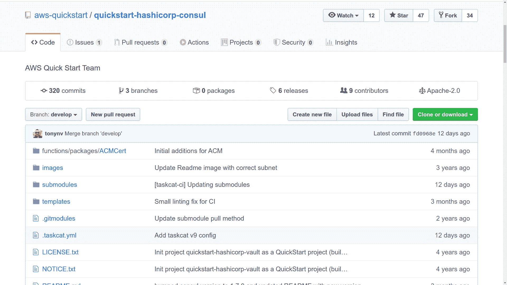

# AWS CloudFormation:当您需要帮助时，在哪里可以找到帮助

> 原文：<https://www.freecodecamp.org/news/aws-cloudformation-where-to-find-help/>

盯着一个简单、愚蠢的命令行提示，不知道接下来该如何使用 AWS CLI，这可能是一种令人羞愧的体验。而且，至少在我的经验中，盯着 AWS CloudFormation 的管理控制台会更糟。

因此，让我根据我最新的 Pluralsight 课程中的部分内容，为你提供一些快速“入门”帮助。

首先，如果您计划通过 AWS CLI 而不是管理控制台来管理您的 CloudFormation 堆栈，我将在本文的[中讨论基础知识。一旦这些都处理好了，你就可以做好一切准备了。](https://www.freecodecamp.org/news/aws-cli-tutorial-install-configure-understand-resource-environment/)

从简单开始:

```
$ aws s3 ls
2019-11-03 13:16:59 athena5905
2019-02-03 18:01:42 book-3939
2014-07-01 18:52:32 elasticbeanstalk-ap-northeast-1-426397493112
2014-08-28 16:57:49 elasticbeanstalk-us-east-1-426497493912
2019-05-04 22:17:50 ltest236
2018-07-15 15:52:30 mybucket99688223
2017-07-25 17:06:43 nextcloud3239027
```

该示例中的“aws”告诉您的 shell，您希望接下来的内容由 AWS CLI 处理。我接下来输入的“s3”告诉 CLI 我将使用 S3 服务——这是亚马逊的简单存储服务。最后，“ls”或“list”是我想对该服务运行的命令。

CLI 使用配置工具添加到我的环境中的帐户身份验证变量，现在将快速关闭并访问我的帐户，在这种情况下检索我的所有存储桶的名称。

可以预见的是，您告诉 AWS，您希望使用“CloudFormation”与 cloudformation 一起工作。如果我只是在没有指定命令的情况下运行它，我会得到一条错误消息:

```
aws cloudformation
usage: aws [options] <command> <subcommand> [<subcommand> ...] [parameters]
To see help text, you can run:

  aws help
  aws <command> help
  aws <command> <subcommand> help
aws: error: the following arguments are required: operation 
```

但是这是一个重要的信息，因为它告诉我们如何访问内联文档。每一层都有上下文相关的帮助。

看看如果在“cloudformation”后面加上“help”会怎么样。您将得到一个简短的描述，然后是所有可用子命令的列表。

```
$ aws cloudformation help

CLOUDFORMATION()                                              CLOUDFORMATION()
NAME
       cloudformation -
DESCRIPTION
AWS  CloudFormation  allows you to create and manage AWS infrastructure deployments predictably and repeatedly. You can use AWS  CloudFormation to  leverage AWS products, such as Amazon Elastic Compute Cloud, Amazon Elastic Block Store, Amazon Simple Notification Service,  Elastic  Load Balancing,  and Auto Scaling to build highly-reliable, highly scalable, cost-effective applications without creating or configuring the  underlying AWS infrastructure.
With  AWS  CloudFormation, you declare all of your resources and dependencies in a template  file.  The  template  defines  a  collection  of resources  as  a single unit called a stack. AWS CloudFormation creates and deletes all member resources of the stack together and manages  all dependencies between the resources for you.
For  more information about AWS CloudFormation, see the AWS CloudFormation Product Page.
Amazon CloudFormation makes use of other  AWS  products.  If  you  need additional  technical information about a specific AWS product, you can find the product's technical documentation at docs.aws.amazon.com.

AVAILABLE COMMANDS
       o cancel-update-stack
       o continue-update-rollback
       o create-change-set
       o create-stack
       o create-stack-set
       o delete-change-set
       o delete-stack
       o delete-stack-instances
       o delete-stack-set
       o deploy
       o describe-account-limits
       o describe-change-set
       o describe-stack-events
       o describe-stack-instance
       o describe-stack-resource
       o describe-stack-resources
       o describe-stack-set
       o describe-stack-set-operation
       o describe-stacks
       o estimate-template-cost
       o execute-change-set
       o get-stack-policy
[...]
```

现在运行“描述-堆栈”命令。你的帐户中现在可能没有活筹码，所以你看不到任何输出。

但是再做一次，这次加上“帮助”。这个将向您展示一些选项，让您过滤或操作您获得的数据。例如，您可以使用"- stack-name "后跟现有堆栈的名称，将 CLI 指向一个特定的堆栈。

```
$ aws cloudformation describe-stacks
$ aws cloudformation describe-stacks help
NAME
       describe-stacks -
DESCRIPTION
       Returns  the  description for the specified stack; if no stack name was specified, then it returns the description for all the stacks created.
       NOTE:
          If the stack does not  exist,  an  AmazonCloudFormationException  is returned.
       See also: AWS API Documentation
       See 'aws help' for descriptions of global parameters.
       describe-stacks  is  a  paginated  operation. Multiple API calls may be issued in order to retrieve the entire data set  of  results.  You  can disable pagination by providing the --no-paginate argument.  When using --output text and the --query argument on  a  paginated  response,  the --query  argument  must  extract data from the results of the following query expressions: Stacks

SYNOPSIS
            describe-stacks
          [--stack-name <value>]
          [--cli-input-json <value>]
          [--starting-token <value>]
          [--max-items <value>]
          [--generate-cli-skeleton <value>]

OPTIONS
       --stack-name (string)
          The name or the unique stack ID that is associated with  the  stack,
          which are not always interchangeable:
[...]

$ aws cloudformation describe-stacks --stack-name myname 
```

无论你使用什么样的 AWS 服务，这些工具都会对你有所帮助。但是具体来看 CloudFormation，有一些您应该知道的有价值的样本模板官方集合。JSON 或 YAML 语法是什么，你可能不想从一个空文档开始。

亚马逊本身在创建模板供我们使用方面做得很好。你的第一站应该是 [AWS 云信息模板页面](https://aws.amazon.com/cloudformation/resources/templates/)。在这里，您可以找到片段和特定应用程序框架的链接，以及一些更前沿的内容。

但是现在我想把你的注意力吸引到 AWS 服务组织的一个“样本模板”上(这个代码来自亚马逊 EC2 的一个例子)。

该模板以一个自由格式的描述开始，它告诉我们这将生成什么样的堆栈。我们还被告知，我们可以通过使用现有的弹性 IP 地址来定制模板，而不是自动生成的地址。

```
{
  "AWSTemplateFormatVersion" : "2010-09-09",

  "Description" : "AWS CloudFormation Sample Template EC2InstanceWithSecurityGroupSample: Create an Amazon EC2 instance running the Amazon Linux AMI. The AMI is chosen based on the region in which the stack is run. This example creates an EC2 security group for the instance to give you SSH access. **WARNING** This template creates an Amazon EC2 instance. You will be billed for the AWS resources used if you create a stack from this template.", 
```

您需要从 AWS 帐户的当前区域传入一个现有的 KeyPair 的名称，这样您就能够在将要启动的 Linux 实例中打开远程 SSH。您也可以从命令行传递该值。

参数部分也是定义 EC2 实例类型的地方。缺省值是 t2.small，但是我们可以将这个值换成本文档中任何其他允许的值，或者从命令行覆盖它。

```
 "Parameters" : {
    "KeyName": {
      "Description" : "Name of an existing EC2 KeyPair to enable SSH access to the instance",
      "Type": "AWS::EC2::KeyPair::KeyName",
      "ConstraintDescription" : "must be the name of an existing EC2 KeyPair."
    },

    "InstanceType" : {
      "Description" : "WebServer EC2 instance type",
      "Type" : "String",
      "Default" : "t2.small", 
```

如果您向下滚动 Mappings 部分，我们可以看到每个地区的可用硬件架构和 Amazon 机器映像标识符的长列表。

这是一个可选部分，您可以在其中插入自己的非标准值，比如说，一个图像类型将基于一组特定的参数启动——甚至可能是一个私有的 AMI 图像。这些数据被组织成键/值对。

```
 "Mappings" : {
    "AWSInstanceType2Arch" : {
      "t1.micro"    : { "Arch" : "HVM64"  },
      "t2.nano"     : { "Arch" : "HVM64"  },
      "t2.micro"    : { "Arch" : "HVM64"  }, 
```

本例中的参考资料部分定义了您的实例环境。例如，SecurityGroup 被配置为打开 SSH 端口 22，但不打开其他端口。实例的公共 IP 地址也与将要分配的新弹性 IP 地址相关联。

```
 "InstanceSecurityGroup" : {
      "Type" : "AWS::EC2::SecurityGroup",
      "Properties" : {
        "GroupDescription" : "Enable SSH access via port 22",
        "SecurityGroupIngress" : [ {
          "IpProtocol" : "tcp",
          "FromPort" : "22",
          "ToPort" : "22",
          "CidrIp" : { "Ref" : "SSHLocation"}
        } ]
      }
    }
  }, 
```

一个更重要的亚马逊资源:[快速入门](https://aws.amazon.com/quickstart/?quickstart-all.sort-by=item.additionalFields.updateDate&quickstart-all.sort-order=desc)。严格来说，这里提供的预构建基础架构堆栈是为了帮助您创建更复杂的云部署，与云形成没有直接关系。它们由第三方公司提供，以简化在 AWS 平台内构建基础设施的过程。

但事实是，每一个都是从自己独特的云形成模板开始的。点击查看实际示例通常会将您带到 GitHub repo 中的堆栈源代码模板。[这个例子](https://github.com/aws-quickstart/quickstart-hashicorp-consul)向我们展示了启动 HashiCorp 控制台所需的工具:



无论哪种方式，都可以随意使用这些模板作为学习工具——或者浏览选择，看看是否有适合您需要的堆栈。

**在我的【bootstrap-it.com】有更多的书籍、课程和文章形式的管理知识。**