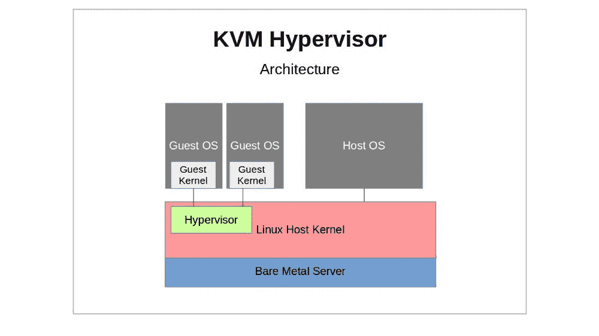

# AWS 宣布从 Xen 转向 KVM。那么 KVM 是什么呢？

> 原文：<https://www.freecodecamp.org/news/aws-just-announced-a-move-from-xen-towards-kvm-so-what-is-kvm/>

与 AWS 关于新的 EC2 高端实例类型(C5)的声明相关的是[一个强烈的暗示](https://www.theregister.co.uk/2017/11/07/aws_writes_new_kvm_based_hypervisor_to_make_its_cloud_go_faster/)亚马逊的云计算巨头已经开始将其数十万台物理服务器从迄今为止运行它们的开源 Xen 虚拟机管理程序转移到开源替代方案 KVM。

无论您的职业生涯和/或房屋抵押贷款已经深深地投资于 Xen 的未来，还是您从来不知道它的存在，您都可能有兴趣了解更多关于 KVM 的知识。所以这里有一个改编自我的书[自学](https://www.amazon.com/gp/product/B06XTZ4YWQ/ref=as_li_tl?ie=UTF8&camp=1789&creative=9325&creativeASIN=B06XTZ4YWQ&linkCode=as2&tag=projemun-20&linkId=fa7577d96ed91ffe111b08665bcb53f9) [Linux 虚拟化和高可用性:准备 LPIC-3 304 认证考试](https://bootstrap-it.com/index.php/books/)的大致介绍。

> 需要更多关于 Linux 服务器或 AWS 的基础知识吗？我的 [Linux in Action](https://www.manning.com/books/linux-in-action?a_aid=bootstrap-it&a_bid=4ca15fc9) 和[在一个月的午餐中学习亚马逊网络服务](https://www.manning.com/books/learn-amazon-web-services-in-a-month-of-lunches?a_aid=bootstrap-it&amp;a_bid=1c1b5e27)曼宁的书可能会有所帮助，还有我在 plur sight 的 [Linux 服务器管理课程。还有一门叫做](http://pluralsight.pxf.io/c/1191769/424552/7490?subId1=solving&u=https%3A%2F%2Fapp.pluralsight.com%2Fprofile%2Fauthor%2Fdavid-clinton) [Linux in Motion](https://www.manning.com/livevideo/linux-in-motion?a_aid=bootstrap-it&a_bid=0c56986f&chan=motion1) 的混合课程，由两个多小时的视频和大约 40%的 Linux in Action 文本组成。

## 千伏计（kilovoltmeter 的缩写）

与 Xen 一样，KVM(基于内核的虚拟机)是一种开源虚拟机管理程序技术，用于虚拟化运行在 x86 兼容硬件上的计算基础架构。和 Xen 一样，KVM 也有活跃的用户社区和重要的企业部署。

一台 KVM 主机实际上运行在 Linux 内核和两个 KVM 内核模块上(kvm.ko 模块和 kvm-intel.ko 或 kvm-amd.ko)。通过其紧密的内核集成，包括与 Virtio 提供的内核块和网络驱动程序的 I/O 连接，KVM 可以为其客户提供对他们可能遇到的所有复杂硬件和网络配置文件的更无缝的访问。

硬件虚拟化扩展内置于现代 CPU 设计中，是 KVM 部署所必需的，这意味着 KVM 客户机开箱即可安全地访问所需的硬件资源，而无需担心泄漏到更大的系统中。

QEMU 在这一切中到底扮演了什么角色？除了能够充当管理程序之外，QEMU 的优势还在于它是一个仿真器。KVM 在其虚拟机管理程序虚拟化角色中，可以利用 QEMU 的仿真能力来补充其自己的硬件加速功能，为其客户提供仿真芯片组和 PCI 总线。正如他们所说，整体可能大于其部分之和。



A KVM hypervisor sitting between the Linux host OS and its guest VMs

KVM 的大量管理功能实际上通常是由 Libvirt 提供的。因此，您有时可能想要参考有关 KVM 相关特性的详细信息，如网络、存储和文件系统布局，这些信息可以在[自学 Linux 虚拟化和高可用性](https://www.amazon.com/gp/product/B06XTZ4YWQ/ref=as_li_tl?ie=UTF8&camp=1789&creative=9325&creativeASIN=B06XTZ4YWQ&linkCode=as2&tag=projemun-20&linkId=fa7577d96ed91ffe111b08665bcb53f9)一书的第五章(“Libvirt 和相关工具”)中找到。

## 装置

首先，您需要确保您计划用作 KVM 主机的物理机支持硬件虚拟化。除了 BIOS 设置和/proc/cpuinfo 的内容(我们在第一章中讨论过)，您还可以使用 kvm-ok:$ kvm-ok 从运行的 Linux 系统中快速检查这一点

确定您使用的是哪种硬件架构(64 位还是 32 位)也是一个好主意:$ uname -m

但是，即使您的硬件配置文件能够胜任这项任务，您也必须让 Linux 内核参与您的计划。如果还没有，您应该添加 kvm 和 kvm-intel 或 kvm-amd 内核模块。# modprobe KVM-英特尔

如果这些模块无法加载(并且文件系统中没有/dev/kvm 设备)，那么您的 CPU 很可能无法满足您的需求。但是，如果所有这些工作都完成了，就可以安装 qemu-kvm 包了(如果有必要，还可以安装 libvirt、virt-install 和 bridge-utils)。

## 使用 KVM 管理工具

众所周知，虚拟化平台因其复杂性而名不虚传。但是有两件事会使 KVM 的入门比其他一些更具挑战性:

*   有很多可用的管理工具包，每个工具包都提供相似但不完全相同的功能。
*   他们有一个令人讨厌的习惯，即根据您使用的发行版和发行版来更改密钥二进制文件的名称。

我将在第五章向您介绍 Libvirt 工具和 vmbuilder，但在这里，我们将讨论 KVM 工具包。

使用我们称之为“KVM”的方式构建新客户是一个两步过程。首先，您将使用 qemu-img 创建一个新图像，或者修改或转换一个旧图像。然后，您将使用 qemu-kvm 设置一个虚拟机来启动安装。

> 我刚才是不是说“你会用 qemu-kvm…”？我真傻。qemu-kvm 很久以前就并入 qemu 了，已经被 qemu-system-x86_64 取代。同时，一些系统提供 kvm 作为执行 qemu-system-x86_64 -enable-kvm 的包装器——尽管您不应该将 kvm 包装器与使用稍微不同语法的旧 kvm 二进制文件混淆。

那么让我们来看看这两个步骤是如何工作的。您使用 qemu-img 创建一个磁盘映像(顺便说一下，它也可以非常有效地用于其他虚拟机管理程序)，其中“my-disk”是您想要创建的映像的名称，映像的最大大小是 6 GB，qcow2 是文件格式。顺便说一下，qcow 代表“QEMU 写时复制”。

```
qemu-img create -f qcow2 /home/username/myimages/my-disk.img 6G \
 Formatting ‘/home/username/myimages/my-disk.img’, \
 fmt=qcow2 size=6442450944 \
 encryption=off \
 cluster_size=65536 \
 lazy_refcounts=off \
 refcount_bits=16
```

选择文件格式将取决于您的具体需求。如果您需要更高的兼容性和灵活性，包括生成复杂快照的能力，那么 qcow2 可能是您的最佳选择。

qcow 磁盘映像格式允许磁盘空间分配仅在需要时增长，这意味着空间的使用总是尽可能高效。对 qcow 只读映像的更改可以保存到一个单独的文件中，该文件在内部引用原始映像。qcow2 增加了创建多个图像快照的能力。

我们现在准备进行第二步。以下是我们构建虚拟机的方式:

```
kvm -name my-VM \
 -hda /home/username/myimages/my-disk.img \
 -cdrom /home/username/Downloads/ubuntu-16.04-server-amd64.iso \
 -boot d -m 1024
```

通常会弹出一个新的 SDL 窗口(尽管不是所有发行版都是如此)，您可以在其中完成操作系统安装过程。从 Qemu 终端重新获得对鼠标的控制需要按 CTRL+ALT。

解释一下:使用“kvm”(尽管您的版本可能需要不同的精确命令)，我们将我们的新客户机称为“my-vm”，将 my-disk.img 文件指定为 hda(“硬盘 a”)，指向操作系统 ISO(在本例中为 Ubuntu 16.04 服务器)的位置，并将 1024 MB 设置为分配给 VM 的最大内存。

默认情况下，KVM 将为您的 guest 配置用户级网络(就像指定了参数-netdev user，id=user.0 -device e1000，netdev=user.0 一样)。这将通过 KVM 自己的 DHCP 服务为客人提供一个 IP 地址，并允许客人访问您的主机、互联网和基于局域网的资源。虽然默认配置很简单，但对于某些场景来说可能过于严格，因为通常会有一些性能和功能限制。

除此之外，您还可以使用命令行标志来控制各种虚拟机配置参数，包括:

*   -smp 2 提供两个处理器(“SMP”=对称多处理)。
*   -net 参数(例如:-net nic，model=virtio，macaddr =52:54:00:05:11:11)为 guest 虚拟机建立网络连接。
*   您可以使用类似-net bridge，vlan=0，br=br0 的东西来提供网桥，尽管这需要主机上有一个匹配的-net 定义。两者通过一个特殊的“vlan”参数连接。
*   -balloon virtio 将允许我扩展或减少客户的内存大小，而无需重新启动它。
*   您还可以使用-drive file=标志来定义其他块存储设备。为 format=(例如 qcow2)添加一个值。

-M 标志将指定一个特定的机器类型硬件仿真。个人电脑。例如，将提供标准 PC 配置文件。要获得可用机器类型的完整列表，您可以运行 kvm -M？：

```
kvm -M ?
Supported machines are:
ubuntu Ubuntu 15.04 PC (i440FX + PIIX, 1996) (alias of pc-i440fx-wily)
pc-i440fx-wily Ubuntu 15.04 PC (i440FX + PIIX, 1996) (default)
ubuntu Ubuntu 15.04 PC (i440FX + PIIX, 1996) (alias of pc-i440fx-vivid)
pc-i440fx-vivid Ubuntu 15.04 PC (i440FX + PIIX, 1996) (default)
pc-i440fx-utopic Ubuntu 14.10 PC (i440FX + PIIX, 1996)
pc-i440fx-trusty Ubuntu 14.04 PC (i440FX + PIIX, 1996)
pc Standard PC (i440FX + PIIX, 1996) (alias of pc-i440fx-2.5)
pc-i440fx-2.5 Standard PC (i440FX + PIIX, 1996)
pc-i440fx-2.4 Standard PC (i440FX + PIIX, 1996)
pc-i440fx-2.3 Standard PC (i440FX + PIIX, 1996)
pc-i440fx-2.2 Standard PC (i440FX + PIIX, 1996)
pc-i440fx-2.1 Standard PC (i440FX + PIIX, 1996)
pc-i440fx-2.0 Standard PC (i440FX + PIIX, 1996)
pc-i440fx-1.7 Standard PC (i440FX + PIIX, 1996)
pc-i440fx-1.6 Standard PC (i440FX + PIIX, 1996)
pc-i440fx-1.5 Standard PC (i440FX + PIIX, 1996)
pc-i440fx-1.4 Standard PC (i440FX + PIIX, 1996)
pc-1.3 Standard PC (i440FX + PIIX, 1996)
pc-1.2 Standard PC (i440FX + PIIX, 1996)
pc-1.1 Standard PC (i440FX + PIIX, 1996)
pc-1.0 Standard PC (i440FX + PIIX, 1996)
pc-0.15 Standard PC (i440FX + PIIX, 1996)
pc-0.14 Standard PC (i440FX + PIIX, 1996)
pc-0.13 Standard PC (i440FX + PIIX, 1996)
pc-0.12 Standard PC (i440FX + PIIX, 1996)
pc-0.11 Standard PC (i440FX + PIIX, 1996)
pc-0.10 Standard PC (i440FX + PIIX, 1996)
q35 Standard PC (Q35 + ICH9, 2009) (alias of pc-q35–2.5)
pc-q35–2.5 Standard PC (Q35 + ICH9, 2009)
pc-q35–2.4 Standard PC (Q35 + ICH9, 2009)
pc-q35–2.3 Standard PC (Q35 + ICH9, 2009)
pc-q35–2.2 Standard PC (Q35 + ICH9, 2009)
pc-q35–2.1 Standard PC (Q35 + ICH9, 2009)
pc-q35–2.0 Standard PC (Q35 + ICH9, 2009)
pc-q35–1.7 Standard PC (Q35 + ICH9, 2009)
pc-q35–1.6 Standard PC (Q35 + ICH9, 2009)
pc-q35–1.5 Standard PC (Q35 + ICH9, 2009)
pc-q35–1.4 Standard PC (Q35 + ICH9, 2009)
isapc ISA-only PC
none empty machine
xenfv Xen Fully-virtualized PC
xenpv Xen Para-virtualized PC
```

## KVM 监视器

在使用 QEMU 时，您可以打开一个监视器控制台，并以使用常规的无头服务器可能很难甚至不可能的方式与您的客户机进行交互。您可以通过按 CTRL+ALT，然后按 SHIFT+2 来启动 KVM 监视器，一个新的控制台将在您的桌面上打开。SHIFT+1 将关闭控制台。您还可以从命令行访问控制台，使用类似于:

```
kvm -monitor stdio
```

您可能无法以 root 用户身份(即通过 sudo)启动监视器。当然，您的版本可能需要“qemu-system-x86_64”而不是 kvm。这种方法允许您添加命令行参数(比如指定控制台目标的 monitor)。有关监视器允许的操作类型的详细信息，请参考 man qemu-system-x86_64。

这个例子(借用了 en.wikibooks.org/wiki/QEMU/Monitor 的话)将列出您的系统当前可用的所有块设备，然后将其中一个指向您想要使用的 ISO 文件:

```
(qemu) info block
ide0-hd0: type=hd removable=0 file=/path/to/winxp.img
ide0-hd1: type=hd removable=0 file=/path/to/pagefile.raw
ide1-hd1: type=hd removable=0 file=/path/to/testing_data.img
ide1-cd0: type=cdrom removable=1 locked=0 file=/dev/sr0 ro=1 drv=host_device
floppy0: type=floppy removable=1 locked=0 [not inserted]
sd0: type=floppy removable=1 locked=0 [not inserted]
(qemu) change ide1-cd0 /home/images/my.iso
```

## 建立工作关系网

默认情况下，KVM guest 虚拟机将接收 10.0.2.0/24 子网内的 IP 地址，并对其主机和更广泛的网络进行传出访问(包括 SSH 访问)。然而，在同样的默认情况下，它不能为网络客户端托管服务。如果您需要打开传入的网络连接，您可能希望在您的主机上创建一个网桥，类似于我们在前一章中为 Xen 使用的网桥。和前面一样，您将在主机上安装 bridge-utils，假设您运行的是基于 Debian 的系统，并且您希望您的主机从网络 DHCP 服务器接收 IP，编辑/etc/network/interfaces，如下所示(在 CentOS 机器上，编辑/etc/sys config/network-scripts/目录中的文件):

```
auto lo
iface lo inet loopback
auto eth0
iface eth0 inet manual
auto br0
iface br0 inet dhcp
 bridge_ports eth0
 bridge_stp off
 bridge_fd 0
 bridge_maxwait 0
```

在 CentOS 上，您需要在/etc/sys config/network-scripts/目录下创建一个 ifcfg-br0 文件，如下所示:

```
DEVICE=br0
TYPE=Bridge
BOOTPROTO=static
DNS1=192.168.0.1
GATEWAY=192.168.0.1
IPADDR=192.168.0.100
NETMASK=255.255.255.0
ONBOOT=yes
SEARCH=”example.com”
```

…然后在主网络接口文件(通常是:/etc/sys config/network-scripts/if CFG-eth 0)中添加一行 BRIDGE=br0 line。

然后，您将停止并重新启动网络服务(或重新启动)。

*正在寻找 Linux 或 AWS 管理的可靠介绍吗？查看我的*[*Linux in Action*](https://www.manning.com/books/linux-in-action?a_aid=bootstrap-it&a_bid=4ca15fc9)*和* [*在一个月的午餐中学习亚马逊网络服务*](https://www.manning.com/books/learn-amazon-web-services-in-a-month-of-lunches?a_aid=bootstrap-it&amp;a_bid=1c1b5e27) *书籍和曼宁的*[*Linux in Motion*](https://www.manning.com/livevideo/linux-in-motion?a_aid=bootstrap-it&a_bid=0c56986f&chan=motion1)*文本-视频混合课程。喜欢视频技术学习吗？我有* [*的 Linux 管理课程在 plus sight*](http://pluralsight.pxf.io/c/1191769/424552/7490?subId1=solving&u=https%3A%2F%2Fapp.pluralsight.com%2Fprofile%2Fauthor%2Fdavid-clinton)*等着看呢。*