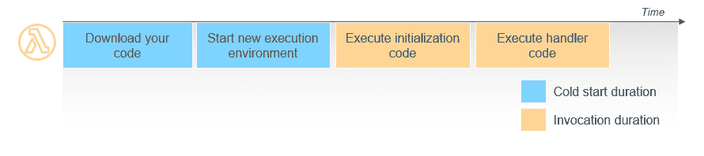
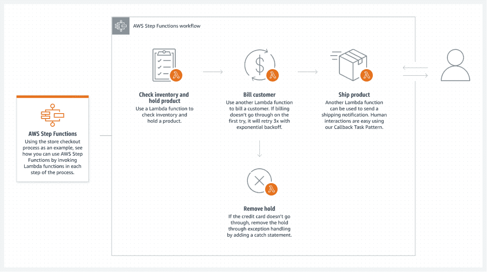
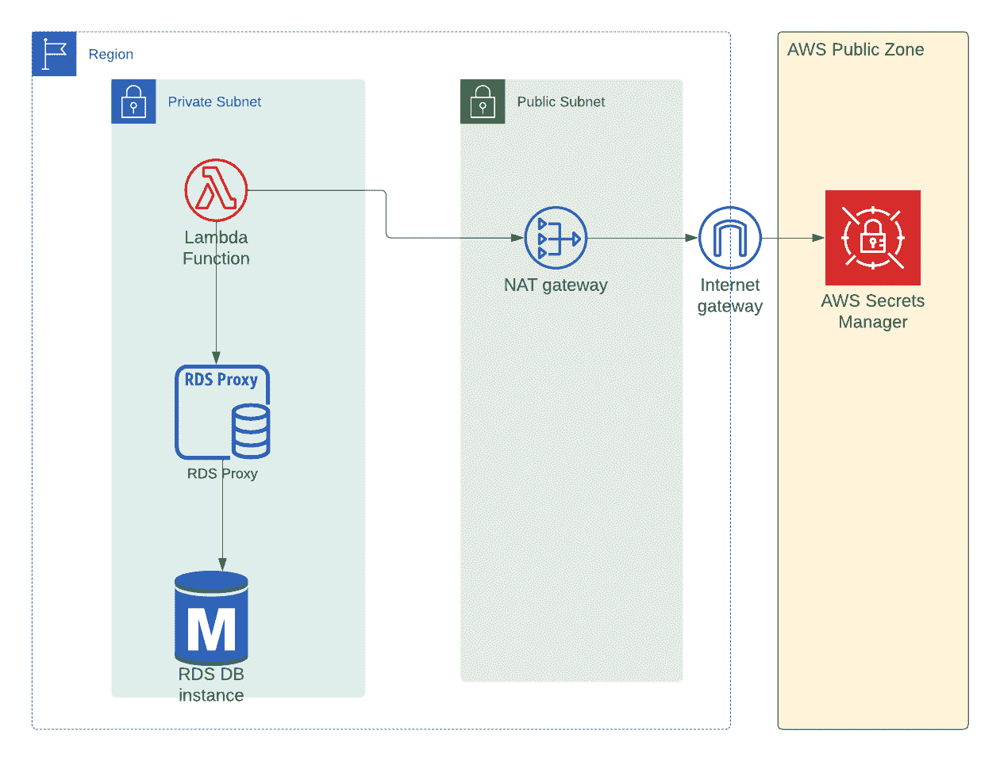
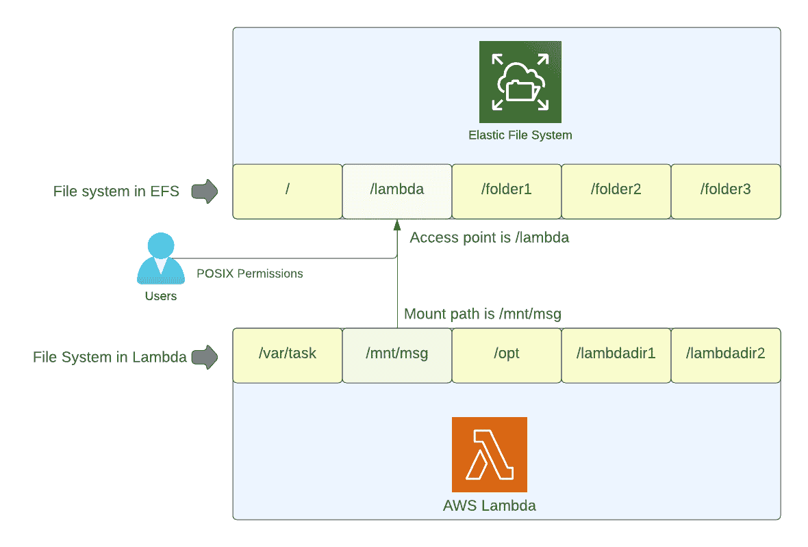

# AWS Lambda 面试问答

> 原文：<https://www.freecodecamp.org/news/aws-lambda-interview-questions/>

在本文中，我将回顾一些在关于 AWS Lambda 的采访中最常被问到的问题。

请注意，这不是一个详尽的列表，但是您可以使用该指南作为参考来更新您的知识并获得进一步学习的指导。

大多数问题将基于您的经验或某些场景。问题在标题中，你可以在标题下面找到提问背后的理由的注释。

## 解释你上一个涉及 AWS Lambda 的项目

面试官想知道你在现实生活中使用 AWS Lambda 的体验。不要在这里虚张声势，因为面试官可能会根据这个问题的答案提出进一步的问题。

你可能已经构建了一个无服务器的 API，涉及微服务、图像/视频转换、日志分析等等的系统。只要详细解释你的项目，告诉他们该项目的商业利益，这样面试官就知道你看到了全局。

## 你和 AWS Lambda 集成了哪些服务？

这是上一个问题的延伸。这不是可以连接到 AWS Lambda 的所有事件源的详细列表。只说你真正用过的服务。

你可能用过 S3、SNS、SQS、Kinesis、DynamoDB、SES 等等。并非所有的项目都是完全无服务器的。

如果你在 AWS Lambda 中使用了任何非无服务器组件，也要提到它们。例如，您可能将 AWS Lambda 与 RDS 一起使用。如果你使用过这样的配置，你可以解释一下你的推理。

## 解释 AWS Lambda 中冷启动和热启动的概念

问这个问题有两个原因。他们想知道您使用过的运行时，并且想知道您是否知道其他可能导致冷启动的运行时。

Lambda 服务接收运行 lambda 函数的请求。该服务通过下载处理函数代码和分配内存以及其他配置来准备执行环境。

即使你没有为这个`execution environment`准备时间付费，你也不得不面对调用 lambda 函数的延迟。这种延迟被称为“冷启动”。

对于 TypeScript 和 Python 运行时环境，冷启动时间不太重要，而对于 Java 或 C#运行时环境，冷启动时间稍微长一些。

为了提高性能，lambda 服务将在一段时间内保持执行环境。当您在此期间再次收到对同一个 lambda 函数的请求时，您的处理程序可以立即开始执行。这种类型的调用称为“*热启动*”。



[Image source](https://aws.amazon.com/blogs/compute/operating-lambda-performance-optimization-part-1/)

## AWS Lambda 中同步和异步调用有什么区别？

尽管这似乎是一个简单的问题，但它对你的设计和错误处理有很多影响。

在同步调用中，调用者将等待执行完成。但是在异步调用中，调用者会将事件放入一个内部队列中，这个队列稍后会在 lambda 函数中进行处理。


[Image source](https://docs.aws.amazon.com/lambda/latest/dg/invocation-async.html)

这里需要注意的重要一点是，您不能指定调用的类型，这取决于您与 AWS Lambda 一起使用的服务。

例如，如果您正在使用 API Gateway 构建无服务器 API，这将是一个同步调用。但是如果你使用 S3，这将是一个异步调用。

## 在 Lambda 中如何实现错误处理和重试逻辑？

事件驱动系统中任何可能失效的组件都将失效。所以面试官想知道你是如何处理这个错误的，以及你在之前的项目中是如何重试的。下面是一些例子。总是用具体的例子来解释。

这取决于你使用 AWS Lambda 的服务。让我们用一些例子来讨论这个问题。

如果您正在构建一个无服务器 API，最好将该错误返回给调用客户端(在这种情况下可能是一个前端应用程序)。然后，让您的前端逻辑根据错误的类型决定向用户显示什么。

如果你在 SQS 中使用 Lambda，最好使用死信队列，这样你就能知道哪些消息没有被处理。出于同样的原因，许多使用 SNS 的系统也可能使用 SQS。

在下面的代码中，我们使用了死信队列。如果任何消息在一定次数(由`maxReceiveCount`指定)后未能处理，它将被发送到死信队列。当与队列一起使用时，这种行为是 lambda 特有的。

```
const queue = new sqs.Queue(this, 'AwsLambdaSqsQueue', {
      visibilityTimeout: cdk.Duration.seconds(300),
      receiveMessageWaitTime: cdk.Duration.seconds(20),
      deadLetterQueue: {
        queue: new sqs.Queue(this, 'AwsLambdaDlq'),
        maxReceiveCount: 5,
      },
    });
```

当 lambda 被任何其他服务调用时，您可以将重试次数配置为最大值 2。这意味着除了初始调用之外，您最多可以重试 2 次。例如，你想基于 S3 对象的上传来触发，你的 lambda 最多会尝试 3 次。

## 解释开发和部署 AWS Lambda 功能的工作流程

谈论你用过的框架。面试官可能希望你也谈谈测试 lambda 函数。

你可以解释你使用了哪些框架来开发和部署 lambda 函数。你也可以谈论你用过的任何 IaC(基础设施代码)工具。

以下是最常用框架的非详尽列表:

*   无服务器
*   AWS CDK
*   AWS SAM
*   云的形成
*   普鲁米

如果你用过 Terraform，你也可以谈谈这个。

## 当你收到一封发给特定支持邮箱的邮件时，Lambda 可以被调用吗？如果是，设计系统。如果没有，解释原因。

是的，你可以。您可以创建接收规则集，并添加触发 lambda 函数的规则。

你应该把电子邮件存储到 S3，然后触发 lambda，这样你就可以有电子邮件的副本以供进一步参考。

你可以参考[这篇文章](https://www.freecodecamp.org/news/how-to-receive-emails-via-your-sites-contact-us-form-with-aws-ses-lambda-api-gateway/)关于如何从联系人表格中接收电子邮件。


[Image source](https://www.freecodecamp.org/news/how-to-receive-emails-via-your-sites-contact-us-form-with-aws-ses-lambda-api-gateway/)

## 一个 lambda 函数可以调用另一个 lambda 函数吗？

面试官想知道你是否知道这个反模式。

您可以这样做，但不建议这样做。如果你想设计一个包含多个 lambda 函数的工作流，你可以使用 step 函数。



[Image source](https://aws.amazon.com/step-functions/)

你可以在这里阅读更多关于阶跃函数[的内容。](https://aws.amazon.com/step-functions/)

另一种标准方法是发出一个事件，并基于该事件触发一个 lambda。您可以使用 SQS、SNS 或 EventBridge 作为这些事件的中介。

## 可以使用 Lambda 在 RDS 实例(私有子网中)上执行查询吗？

是的，您可以使用 AWS Lambda 在 RDS 中执行查询。为此，你可以在同一个 VPC 中使用 lambda。

由于数据库连接创建时间的原因，如果将 AWS Lambda 直接用于 RDS，可能会有一些性能影响。为了避免这些问题，您可以使用 RDS 代理。



[Image source](https://www.freecodecamp.org/news/aws-lambda-rds/)

这里有一个[详细的逐步指南](https://www.freecodecamp.org/news/aws-lambda-rds/)告诉你如何去做。

## AWS Lambda 提供了许多好处。使用 AWS Lambda 的缺点是什么？

面试官想知道你的思维过程。不要说 AWS Lambda 解决了所有问题:-)

是的，Lambda 提供了很多好处，比如成本和可伸缩性，而不需要维护服务器。但它不是所有问题的答案——像任何服务一样，它也有自己的问题(你应该能够讨论这些问题):

*   调试:如果你使用 Lambda 的无服务器架构，你可能需要依靠日志来找到问题的根源。这是因为您的应用程序将分布在许多服务/ lambda 函数中。
*   测试:您可以在本地测试中模拟 AWS 服务。但是最好在 AWS 中有一个单独的环境来测试你的 lambdas。这使得测试有点复杂。
*   后台作业:Lambda 有 15 分钟的超时限制。如果你想让任何特定的任务花费超过 15 分钟，你可能不得不转移到 Fargate 或其他解决方案。
*   成本:如果你正在运行一个 24/7 处理请求的高流量应用程序，使用 lambda 可能会很昂贵。如果你有持续的高流量，最好使用 Fargate，EC2 或其他服务。

## 在 AWS Lambda 中如何管理并发性和伸缩性？

如果你谈论你在这些情况下遇到的问题，会加分。

并发性是指同时执行多个 lambda 函数的能力。缩放是增加 lambda 函数副本数量以处理传入请求的过程。

您可以通过设置`reserved concurrency`的值来控制并发性，以便只调用提到的 lambda 函数的数量。

下面是 lambda 如何根据队列中的消息数量进行扩展的高级图表。


[Image source](https://www.cloudtechsimplified.com/aws-lambda-sqs/)

注意:当使用 SQS 标准队列时，如果你试图限制 AWS Lambda，会有一些奇怪的行为。您可以使用 FIFO 队列来解决这个问题。

## 如何将环境变量传递给 AWS Lambda？

例如，面试官可能想知道你是如何传递敏感信息的。

将环境变量传递给 AWS Lambda 有不同的方式，这取决于要传递的值的类型。

**非敏感数据**:如果你想传递任何非敏感信息，你可以直接把值传递给你的 lambda 函数环境变量。但是这些值在 Lambda 服务的 AWS 控制台中是可见的。

在下面的代码示例中，我们将 DynamoDB 表的名称直接作为环境变量传递，因为它不是敏感数据:

```
 const readDDBLambdaFn = new NodejsFunction(this, 'readDDBLambdaFn', {
      entry: path.join(__dirname, '../src/lambdas', 'read-ddb.ts'),
      ...nodeJsFunctionProps,
      functionName: 'readDDBLambdaFn',
      environment: {
        tableName: table.tableName,
      },
    });
```

**敏感数据**:如果你想传递敏感数据，比如密码和 API 密匙，你可以使用秘密管理器或者参数存储。但是，您需要确保为 Lambda 提供必要的角色，以便访问和解密各个服务的秘密。

在下面的代码片段中，我们没有传递实际的秘密。相反，我们只是传递秘密的 ARN(亚马逊资源名称)。

```
const rdsLambdaFn = new NodejsFunction(this, 'rdsLambdaFn', {
      entry: path.join(__dirname, '../src/lambdas', 'rds-lambda.ts'),
      ...nodeJsFunctionProps,
      functionName: 'rdsLambdaFn',
      environment: {
        DB_ENDPOINT_ADDRESS: dbInstance.dbInstanceEndpointAddress,
        DB_NAME: databaseName,
        DB_SECRET_ARN: dbInstance.secret?.secretFullArn || '',
      },
      vpc,
      vpcSubnets: vpc.selectSubnets({
        subnetType: ec2.SubnetType.PRIVATE_WITH_EGRESS,
      }),
    });
```

然后，在 lambda 中，您可以在 lambda 函数中动态获取实际的秘密，如下所示:

```
export const handler = async (event: any, context: any): Promise<any> => {
    const host = process.env.DB_ENDPOINT_ADDRESS || '';
    const database = process.env.DB_NAME || '';
    const dbSecretArn = process.env.DB_SECRET_ARN || '';
    const secretManager = new AWS.SecretsManager({
      region: 'us-east-1',
    });
    const secretParams: AWS.SecretsManager.GetSecretValueRequest = {
      SecretId: dbSecretArn,
    };
    const dbSecret = await secretManager.getSecretValue(secretParams).promise();
    const secretString = dbSecret.SecretString || '';

    const { password } = JSON.parse(secretString);

}
```

我在这里写了一篇关于同一主题的详细教程[。](https://www.cloudtechsimplified.com/environment-variables-secrets-database-password-aws-lambda/)

## 假设您有一个依赖于 Windows 的可执行 sometool.exe。你可以把它上传到 S3 桶里。可以用 AWS Lambda 执行这个带一些参数的二进制吗？

*这更像是一个确保你理解 AWS Lambda 执行环境的问题——特别是它使用的操作系统。*

不，你不能这样做，因为 AWS Lambda 使用 Linux 作为它的操作系统。Linux 将无法执行依赖于 Windows 的二进制文件。

## 如何跨 AWS Lambda 函数重用代码？

有两种方法可以跨多个 AWS Lambda 函数重用代码:

*   使用 lambda 层:您可以将代码或逻辑存储在 lambda 层中，您可以在不同的 Lambda 函数中重用这些代码或逻辑。

下面是一些使用`aws cdk`创建和使用 lambda 层的高级代码:

```
 const logicLayer = new lambda.LayerVersion(this, 'logic-layer', {
      compatibleRuntimes: [
        lambda.Runtime.NODEJS_14_X,
        lambda.Runtime.NODEJS_16_X,
      ],
      layerVersionName: 'business-logic-layer',
      code: lambda.Code.fromAsset('src/layers/business-logic'),
      description: 'Business logic layer',
    });

    const lambdaWithLayer = new NodejsFunction(this, 'lambdaWithLayer', {
      entry: path.join(__dirname, '../src/lambdas', 'lambda.ts'),
      ...nodeJsFnProps,
      functionName: 'lambdaWithLayer',
      handler: 'handler',
      layers: [logicLayer, utilsLayer],
    });
```

*   使用`monorepo`:您可以使用 mono repo 并在部署时动态构建包。

## 如果你删除一个 lambda 层，你的 Lambda 函数会发生什么？

在这个问题中，面试官想知道你对 lambda 层的理解程度。

使用该删除层的现有 lambda 函数将继续工作——因为 lambda 层在部署时与 lambda 函数合并。

但是你不能用删除的 lambda 层创建一个新的 lambda 函数。

你可以在这里了解更多关于 Lambda 层的信息[，我已经在这里](https://docs.aws.amazon.com/lambda/latest/dg/configuration-layers.html)写了一个相同主题的指南[。](https://www.cloudtechsimplified.com/aws-lambda-layers/)

## 如果使用 Lambda 层，可以增加部署包的大小吗？

不，如果使用 Lambda 层，就不能增加部署包的大小。压缩后的最大部署大小为 50 MB，包括 lambda 函数及其相关 lambda 层的大小。

如果你有一个大的代码库，并且想要增加部署，你可以在 AWS Lambda 中运行容器。

## 我可以使用 Lambda 运行我现有的 dockerized web 应用程序吗？

没有。你不能坐快车，跳羚，或者。NET 核心应用程序(或任何其他应用程序)，并把它们放在 lambda 中。

尽管如此，还是有一些库允许你把使用这些 web 框架的应用程序放到 AWS Lambda 中。在内部，这些库将这些 web 应用程序转换成 AWS lambda 兼容的 API。你可以在这里看到一个这样的例子[。](https://aws.amazon.com/blogs/aws/running-express-applications-on-aws-lambda-and-amazon-api-gateway/)

通过使用这些框架，你的 lambda 函数的规模将会更大，并且会导致更长的启动时间。

请记住，即使使用带有 Lambda 的容器，Lambda 的现有运行时 API 也保持不变。Lambda 仍然会:

*   成为单一功能
*   由事件或手动调用
*   暂停 15 分钟。

正如你在下面的代码中看到的，lambda API 没有任何变化。使用 Docker 的好处是你可以使用大的包而不用担心大小。

```
import { Context, APIGatewayProxyResult, APIGatewayEvent } from 'aws-lambda';

export const handler = async (
  event: APIGatewayEvent,
  context: Context
): Promise<APIGatewayProxyResult> => {
  console.log(`Event: ${JSON.stringify(event, null, 2)}`);
  console.log(`Context: ${JSON.stringify(context, null, 2)}`);
  return {
    statusCode: 200,
    body: JSON.stringify({
      message: 'Running this handler from docker',
    }),
  };
};
```

这是你使用它的方式:

```
 const repo = ecr.Repository.fromRepositoryName(
      this,
      'dockerLambda',
      'docker-lambda'
    );

    const dockerLambda = new lambda.DockerImageFunction(
      this,
      'DockerLambdaFunction',
      {
        code: lambda.DockerImageCode.fromEcr(repo),
      }
    );
```

我在`aws lambda` [这里](https://www.cloudtechsimplified.com/run-docker-containers-images-from-ecr-in-aws-lambda-along-with-cicd/)写了一个关于为你的应用程序运行 Docker 容器的分步指南。

## 如何在 lambda 函数之间共享大文件？

您可以使用弹性文件系统(EFS)在不同的功能之间共享大文件。

您可以在已创建的 EFS 中创建一个具有适当权限的`access point`，并在您的 lambda 中的`mount path`中使用该`access point`。

任何写在这个挂载路径上的文件都可以被所有其他的 lambda 函数访问，只要它们拥有这个挂载路径和适当的权限。

下面是关于如何将 AWS Lambda 与弹性文件系统(EFS)一起使用的高级逻辑图:



[Image source](https://www.cloudtechsimplified.com/elastic-file-system-efs-aws-lambda/)

你可以在这里读到这个[(有点老)。我最近写了一个更实用的分步指南](https://aws.amazon.com/blogs/compute/using-amazon-efs-for-aws-lambda-in-your-serverless-applications/)[在这里](https://www.cloudtechsimplified.com/elastic-file-system-efs-aws-lambda/)关于 EFS 与 Lambda 函数。

## **结论**

我希望这篇文章能帮助你准备涉及 AWS Lambda 的面试。

感谢您阅读至此。我在 https://www.cloudtechsimplified.com 写关于`aws`和无服务器技术的文章。如果你感兴趣，你可以[订阅](https://www.cloudtechsimplified.com/)我的博客。