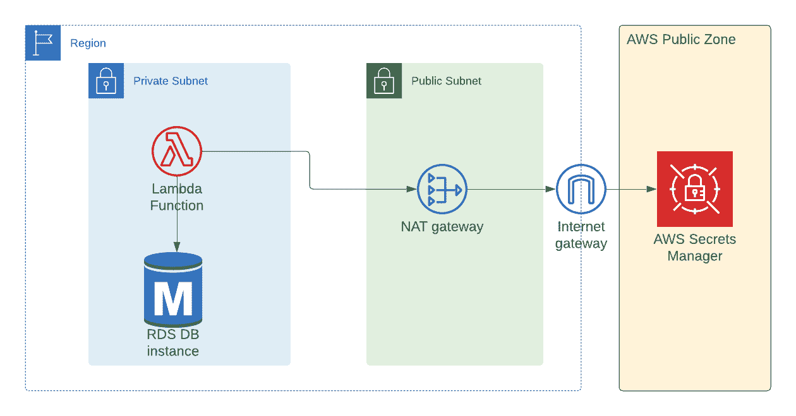
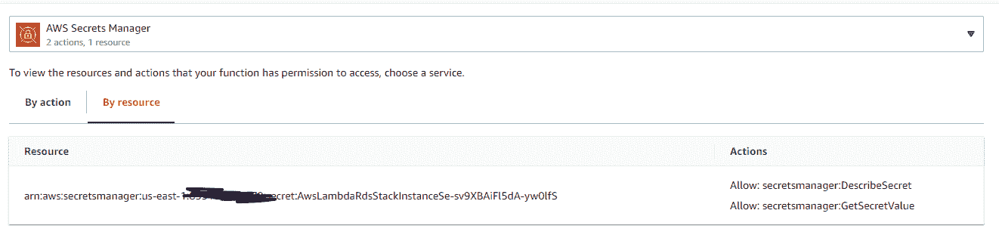
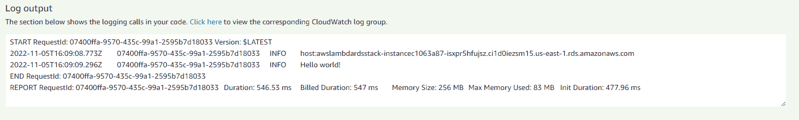
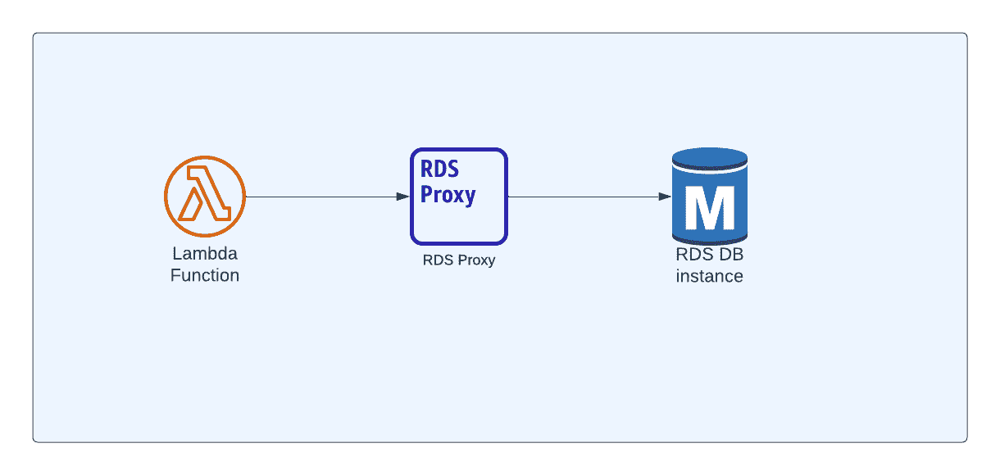
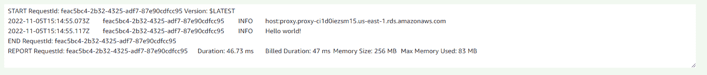

# 如何从 AWS Lambda 连接到 AWS RDS

> 原文：<https://www.freecodecamp.org/news/aws-lambda-rds/>

在本文中，我们将学习如何从 AWS Lambda 与 AWS RDS 通信。

在本教程中，我们将使用`AWS CDK`。这是一个开源软件开发框架，允许您定义云基础设施。

`AWS CDK`支持多种语言，包括 TypeScript、Python、C#、Java 等。我们将在本教程中使用 TypeScript。

部署时(使用`cdk deploy`命令)，您的代码被转换成 Cloudformation 模板，所有相应的 AWS 资源都被创建。尝试本教程只需要 CDK 和 TypeScript 的基本知识。当然，您需要有一个 AWS 帐户来创建 AWS 资源。

你可以从这里的文档中了解更多关于 AWS CDK 的信息，我在我的博客[这里写了一篇入门指南。](https://www.cloudtechsimplified.com/the-beginners-guide-to-aws-cdk/)

## AWS Lambda 和 RDS 简介

AWS Lambda 是一种无服务器、事件驱动的计算服务，让您无需提供服务器即可运行代码。

AWS RDS 是 AWS 的托管关系数据库服务，支持各种 RDMBS，如 MySQL、Postgres、Oracle、SQL Server 等。AWS 负责设置、修补和维护这些数据库服务器。

### 为什么要将 RDS 与 Lambda 一起使用？

AWS Lambda 只是一个计算服务，它没有任何关于数据存储的建议。事实上，您的一些 lambda 函数甚至不会与任何类型的数据存储进行交互。即使您想使用数据存储，也可以根据需要使用任何类型的数据库。

然而，大多数无服务器架构使用 DynamoDB 作为数据存储，只是为了降低成本和消除维护数据库服务器的需要。

DynamoDB 很棒，有它的用例。但是对所有涉及 lambda 的项目使用 DynamoDB 是不可能的，原因如下:

**动态访问模式:**如果您正在使用 DynamoDB，您必须提前设计您的查询模式。这并不总是可能的，因为您的产品(及其相关需求)可能会基于客户反馈而发展。

**受限访问模式:** DynamoDB 在编写查询时不提供灵活性。您不能像在 RDBMS 中那样执行`group by`功能。您需要导出数据，并让其他系统提供该功能。

**现有数据库:**如果您有一个现有的 RDBMS 数据库，除非有令人信服的理由，否则您不会想迁移到 DynamoDB。即使您想使用 DynamoDB，您也可能需要重新编写整个数据访问层来使用 DynamoDB，而不是常规的 RDBMS。

### 使用 RDBMS 的优点:

**实体之间的关系:** RDBMS 允许实体之间的关系。您可以定义外键来限制任何无效数据存储在数据库中。

**访问模式:** RDMBS 允许您使用动态访问模式。可以引入一个新的实体，而不需要对任何现有模型进行太多的更改。而且，它有许多功能，如`group by`–因此您不需要任何外部系统来完成这些功能。

**熟悉 SQL:** 大多数开发者都熟悉 SQL 来查询数据库，你有很大范围的数据库可以选择，包括 Oracle，Postgres，MySQL。

如果您有以下要求，可以选择 RDMBS:

*   您有一个现有的 RDBMS 数据库，并希望采用 AWS Lambda 提供的无服务器计算
*   您有动态访问模式，并且您不希望对现有模型做太多更改

现在，让我们讨论一下如何从 Lambda 连接到 RDS。

## 项目架构

几乎在所有情况下，您的 RDBMS 数据库都将位于虚拟专用云(VPC)的专用子网中，这样 VPC 之外的任何人都无法访问它。因为 lambda 函数将包含业务逻辑，所以这个 lambda 也可能位于私有子网中。在本教程中，我们将使用 Postgres 作为我们的数据库。但是这里的过程适用于您想要使用的任何数据库(MySQL、Oracle、MS SQL 等等)。架构将保持不变。

以下是该项目的架构:



我们将使用`AWS CDK`作为基础设施即代码(IaC)工具来创建 AWS 资源

### 如何创建虚拟私有云来托管我们的 Lambda 和 RDBMS

我们将创建 2 个子网，一个私有子网和一个公共子网。在私有子网中，我们将拥有 Postgres 数据库。

```
const vpc = new ec2.Vpc(this, 'VpcLambda', {
      maxAzs: 2,
      subnetConfiguration: [
        {
          cidrMask: 24,
          name: 'privatelambda',
          subnetType: ec2.SubnetType.PRIVATE_WITH_EGRESS,
        },
        {
          cidrMask: 24,
          name: 'public',
          subnetType: ec2.SubnetType.PUBLIC,
        },
      ],
    });
```

当您在 AWS CDK 中创建类型为`PRIVATE_WITH_EGRESS`的子网时，它也将创建一个 NAT 网关，并将该 NAT 网关置于公共子网中。

NAT 网关的目的是只允许从您的专用子网到 internet 的出站连接。没有人可以从公共互联网发起到您的私有子网的连接。

### 为什么我们使用 NAT 网关进行互联网连接？

您可能想知道为什么您需要互联网连接，因为 lambda 和 RDS 数据库都在同一个私有子网中。

`Secrets Manager`是 AWS 提供的一项服务，用于存储和管理数据库密码、证书等机密信息。连接数据库的密码存储在公共端点可访问的`secrets manager`中。

您可以使用`NAT Gateway`来访问`secrets manager`服务的公共端点，或者您可以创建一个接口端点来使用 AWS 网络连接到`secrets manager`而不使用公共互联网。

这两种方法都要花钱，但是 NAT Gateway 也可以从 lambda 重用来建立互联网连接(比如说如果你调用任何公共的外部 API ),而在接口端点中你不能这样做。

### 如何创建 RDS 数据库实例来存储我们的数据:

我们将为数据库使用一个`small`实例类型——只是为了本教程的目的。但是在生产环境中，您可能会使用更大的实例。

我们正在为数据库创建一个新的安全组，这样我们就可以控制谁可以通过哪个端口访问数据库实例。

```
const dbSecurityGroup = new ec2.SecurityGroup(this, 'DbSecurityGroup', {
      vpc,
    });

    const databaseName = 'cloudtechsimplified';

    const dbInstance = new rds.DatabaseInstance(this, 'Instance', {
      engine: rds.DatabaseInstanceEngine.postgres({
        version: rds.PostgresEngineVersion.VER_13,
      }),
      // optional, defaults to m5.large
      instanceType: ec2.InstanceType.of(
        ec2.InstanceClass.BURSTABLE3,
        ec2.InstanceSize.SMALL
      ),
      vpc,
      vpcSubnets: vpc.selectSubnets({
        subnetType: ec2.SubnetType.PRIVATE_WITH_EGRESS,
      }),
      databaseName,
      securityGroups: [dbSecurityGroup],
      credentials: rds.Credentials.fromGeneratedSecret('postgres'),
      maxAllocatedStorage: 200,
    });
```

上面的`CDK`代码将创建一个数据库实例，并将其放在私有子网中(根据我们所做的子网选择)。

方法`fromGeneratedSecret`将使用作为参数传递的用户名在秘密管理器服务中创建秘密。我们希望数据库用户名是`postgres`，所以我们传递这个值。

最后，我们为数据库分配 200GB 的存储空间。

### 如何配置 Lambda 函数属性

我们使用 Node16 编写 lambda 函数，下面是 lambda 的通用属性。

我们希望超时为 3 分钟，而不是默认的 3 秒钟，我们希望为 lambda 函数分配 256 MB。

由于`aws-sdk`是由 lambda 运行时本身提供的，我们希望在捆绑 lambda 时排除`aws-sdk`库。

我们已经安装了用于与 Postgres 数据库通信的`pg` npm 包，并且我们排除了`pg-native`包，因为我们不需要它。

```
 const nodeJsFunctionProps: NodejsFunctionProps = {
      bundling: {
        externalModules: [
          'aws-sdk', // Use the 'aws-sdk' available in the Lambda runtime
          'pg-native',
        ],
      },
      runtime: Runtime.NODEJS_16_X,
      timeout: Duration.minutes(3), // Default is 3 seconds
      memorySize: 256,
    };
```

接下来，我们将为 lambda 函数创建一个安全组。我们的 lambda 函数应该有关于数据库的端点、用户名和密码的信息，以便 lambda 可以连接到数据库。

我们将把这些值作为环境变量传递给 lambda 函数。

```
 const lambdaSG = new ec2.SecurityGroup(this, 'LambdaSG', {
      vpc,
    });

    const rdsLambdaFn = new NodejsFunction(this, 'rdsLambdaFn', {
      entry: path.join(__dirname, '../src/lambdas', 'rds-lambda.ts'),
      ...nodeJsFunctionProps,
      functionName: 'rdsLambdaFn',
      environment: {
        DB_ENDPOINT_ADDRESS: dbInstance.dbInstanceEndpointAddress,
        DB_NAME: databaseName,
        DB_SECRET_ARN: dbInstance.secret?.secretFullArn || '',
      },
      vpc,
      vpcSubnets: vpc.selectSubnets({
        subnetType: ec2.SubnetType.PRIVATE_WITH_EGRESS,
      }),
      securityGroups: [lambdaSG],
    });
```

**重要提示:**我们没有将数据库密码作为环境变量传递给 lambda。相反，我们将把`ARN` (Amazon 资源名称)传递给 lambda，并且为了更好的安全性，我们将从 lambda 中的 secret manager 获取实际的密码(在运行时动态获取)。

### Lambda 访问数据库密码的权限

即使我们将`secret arn`作为环境变量传递给 lambda，lambda 也应该有必要的权限从`secrets manager`服务获取秘密(在我们的例子中是数据库密码)。

下面一行代码提供了这些权限:

```
dbInstance.secret?.grantRead(rdsLambdaFn);
```

上面的`cdk`行将为 lambda 创建一个角色，该角色拥有 secrets manager 的两个权限`DescribeSecret`和`GetSecretValue`，这样我们的 lambda 在与数据库对话之前将拥有获取秘密值(在我们的例子中是数据库密码)的权限。

你可以在 Lambda 服务的 AWS 控制台中看到同样的情况。



AWS Lambda Permissions for Secrets Manager

### RDS 数据库实例的安全组

我们不想让数据库连接对所有人开放，我们希望 lambda 允许数据库连接。

下面的`cdk`代码添加了一个入口规则，允许我们的 lambda 函数通过端口`5432`(Postgres 数据库的端口)连接到 RDS 实例:

```
 dbSecurityGroup.addIngressRule(
      lambdaSG,
      ec2.Port.tcp(5432),
      'Lambda to Postgres database'
    );
```

### 与数据库通信的 Lambda 函数代码

与数据库对话的实际 lambda 函数代码非常简单。因为我们使用 Postgres 数据库，所以我们使用`pg`包与来自`nodejs`环境的 Postgres 进行通信。

在启动到数据库的连接之前，我们从`secrets manager`服务获取秘密字符串。这个秘密字符串是一个包含用户名和密码的 JSON 字符串。只需解析 JSON 字符串并只接受密码。

```
import * as AWS from 'aws-sdk';
import { Client } from 'pg';

export const handler = async (event: any, context: any): Promise<any> => {
  try {
    const host = process.env.DB_ENDPOINT_ADDRESS || '';
    console.log(`host:${host}`);
    const database = process.env.DB_NAME || '';
    const dbSecretArn = process.env.DB_SECRET_ARN || '';
    const secretManager = new AWS.SecretsManager({
      region: 'us-east-1',
    });
    const secretParams: AWS.SecretsManager.GetSecretValueRequest = {
      SecretId: dbSecretArn,
    };
    const dbSecret = await secretManager.getSecretValue(secretParams).promise();
    const secretString = dbSecret.SecretString || '';

    if (!secretString) {
      throw new Error('secret string is empty');
    }

    const { password } = JSON.parse(secretString);

    const client = new Client({
      user: 'postgres',
      host,
      database,
      password,
      port: 5432,
    });
    await client.connect();
    const res = await client.query('SELECT $1::text as message', [
      'Hello world!',
    ]);
    console.log(res.rows[0].message); // Hello world!
    await client.end();
  } catch (err) {
    console.log('error while trying to connect to db');
  }
}; 
```

最后，我们在数据库中运行一个简单的选择查询。

### 如何测试项目

现在，您可以登录 AWS 控制台进行测试。选择`Lambda`服务并选择您的 lambda 函数——在我们的例子中，它将是`rdsLambdaFn`。

在本教程中，您不需要担心 lambda 的`event`属性，因为我们在 lambda 函数代码中没有使用它。单击 Test 按钮，您将能够看到日志。



Test Lambda function

### 性能问题

Lambda 非常适合不需要太多时间的函数。事实上，lambda 函数的最大超时限制是 15 分钟。

从 lambda 代码中可以看出，每次调用 lambda 函数时，我们都会启动到数据库的连接。

根据 lambda 的事件源(例如，SQS 队列)，这会以更高的速率创建连接，并在 lambda 函数结束时断开连接。

这会显著增加 RDS 服务器的负载，进而降低性能。那么我们如何解决这个问题呢？

## 如何使用 RDS 代理

我们可以在 lambda 和 RDS 数据库之间放置一个 RDS 代理，而不是直接创建从 lambda 到数据库的连接。

RDS 代理的目的是维护连接池，以便任何用户都可以连接到代理并获得数据库连接。请注意，我们这里不是在创建连接，我们只是在获取已经创建的连接。



Using RDS Proxy with Lambda

采用这种方法有两个好处:

1.  **降低数据库服务器上的负载**:由于我们不需要为数据库服务器中的每个 lambda 调用创建连接，服务器上的负载显著降低。
2.  **改进的 lambda 性能**:在 lambda 中，我们只是从 RDS 代理获得一个连接，而不是创建一个新的连接。这提高了 lambda 函数的性能。

### 使用 RDS 代理所需的更改

我们不需要对我们的架构或代码做很多改变。我们只需要做几件事:

*   创建 RDS 代理并关联我们之前创建的 db 安全组
*   更新 lambda 端点的环境变量，以便 lambda 可以连接到 RDS 代理，而不是直接连接到 RDS

你不需要改变你的 lambda 代码。

### 更新的架构

下面是更新后的架构图


RDS Proxy with Lambda - Architecture

### 如何创建 RDS 代理

我们需要创建 RDS 代理并添加数据库实例作为代理目标。

```
const dbProxy = new rds.DatabaseProxy(this, 'Proxy', {
      proxyTarget: rds.ProxyTarget.fromInstance(dbInstance),
      secrets: [dbInstance.secret!],
      securityGroups: [dbSecurityGroup],
      vpc,
      requireTLS: false,
      vpcSubnets: vpc.selectSubnets({
        subnetType: ec2.SubnetType.PRIVATE_WITH_EGRESS,
      }),
    });
```

注意，我们也将数据库机密传递给这个代理，因为它负责维护连接。我们使用与我们打开端口 5432 时相同的数据库安全组。

### 如何更新 Lambda 的端点

我们不需要改变 lambda 代码。我们只需要更新作为环境变量传递的端点。

```
 environment: {
        DB_ENDPOINT_ADDRESS: dbProxy.endpoint,
        DB_NAME: databaseName,
        DB_SECRET_ARN: dbInstance.secret?.secretFullArn || '',
      },
```

其他任何代码都不会发生变化。

### 性能改进

当您测试 lambda 函数时，您可以看到 lambda 正在连接到代理，而不是数据库实例(因为我们将端点信息打印为`host`)。

您还应该注意到性能得到了显著提高。以前，连接需要大约 500 毫秒。现在，大约需要 50 毫秒。



Performance of lambda with RDS Proxy

请注意，从 RDS 代理获取初始连接可能需要额外的时间。而且，获得任何进一步的连接将会很快，如上所示。

## 结论

我希望这篇教程能帮助你学习如何从 AWS Lambda 连接到 RDS。

感谢您阅读至此。我在 https://www.cloudtechsimplified.com写了关于 [aws lambda](https://www.cloudtechsimplified.com/tag/aws-lambda/) 、 [fargate、](https://www.cloudtechsimplified.com/tag/fargate/) [ci/cd 管道](https://www.cloudtechsimplified.com/tag/ci-cd-pipeline/)和无服务器技术的文章。如果你有兴趣，你可以在这里订阅。