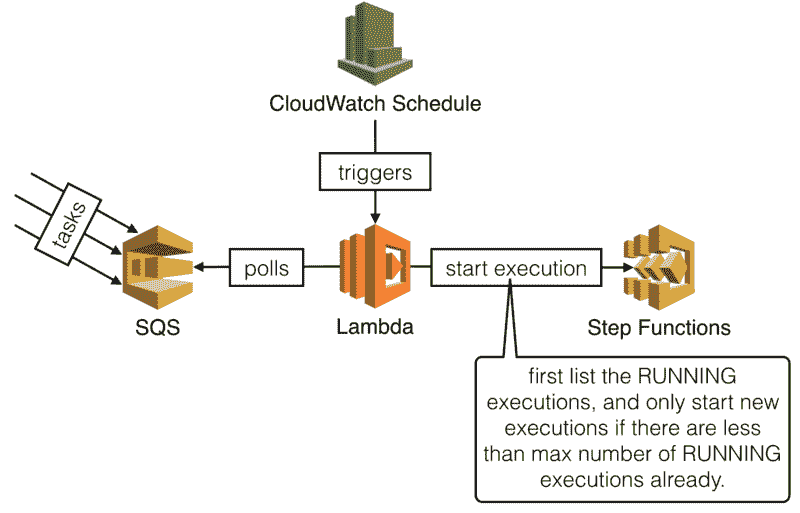
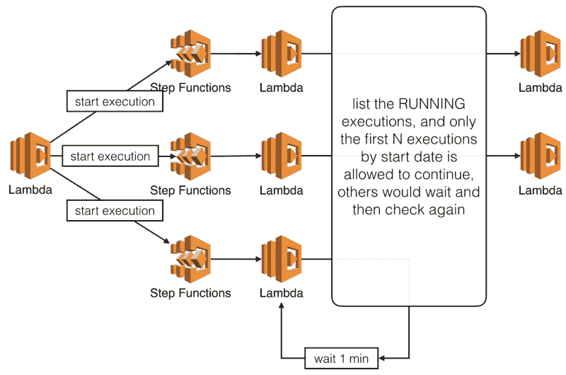
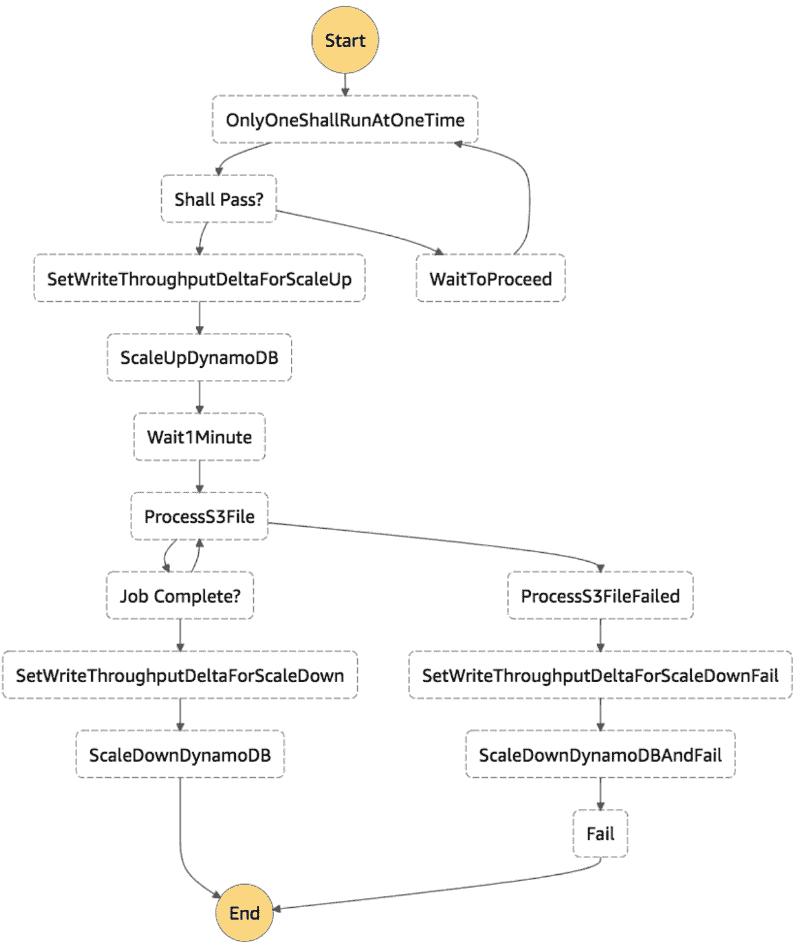
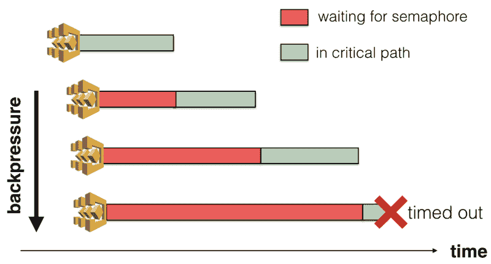

# AWS 步骤函数:如何为状态机实现信号量

> 原文：<https://www.freecodecamp.org/news/aws-step-functions-how-to-implement-semaphores-for-state-machines-8075650ceb86/>

作者:崔琰

# AWS 步骤函数:如何为状态机实现信号量


Photo by [Mikito Tateisi](https://unsplash.com/photos/bJhT_8nbUA0?utm_source=unsplash&utm_medium=referral&utm_content=creditCopyText) on [Unsplash](https://unsplash.com/search/photos/steps?utm_source=unsplash&utm_medium=referral&utm_content=creditCopyText)

在这里，我们正从我们的法律平台转移到一个勇敢的新世界，这个新世界有[的微波炉和微波炉服务。一路上，我们还讨论了 AWS 步进功能带来的乐趣。例如…](https://micro-frontends.org/)

*   灵活错误处理和重试
*   雷
*   能够将自动匹配步骤与需要人工干预的[活动](https://docs.aws.amazon.com/step-functions/latest/dg/concepts-activities.html)混合

在某些情况下，我们需要控制可以访问共享资源的当前状态机执行的数量。这可能是一项业务需求。或者这可能是由于对共享资源的规模关注。这也可能是我们的状态机设计的结果，这使得它很难并行化。

我们提出了几个解决方案，分为两大类:

1.  控制您可以启动的执行次数
2.  允许当前执行开始，但阻止执行进入关键路径，直到它能够获得一个[SEM phore](https://en.wikipedia.org/wiki/Semaphore_%28programming%29)(即一个继续进行的信号)

### 控制并发执行的数量

您可以通过引入 SQS 队列来控制当前执行的最大数量。云监控计划将触发一个 Lamb 功能:

1.  检查有多少个当前执行
2.  如果有 N 个执行，那么我们可以启动最多 N 个执行
3.  轮询 SQS 的最大消息，并为每个消息启动一个新的执行



我们在这里没有使用新的 [SQS 触发器，因为目的是**减缓**新执行的创建。因为 SQS 会急切地把任务推给我们的职能部门。](https://aws.amazon.com/blogs/aws/aws-lambda-adds-amazon-simple-queue-service-to-supported-event-sources/)

此外，您应该使用 FIFO 队列，以便任务按照它们被添加到队列中的顺序被处理。

### 使用信号量阻止执行

您可以使用[列表选项](https://docs.aws.amazon.com/step-functions/latest/apireference/API_ListExecutions.html) API 来找出有多少执行程序处于运行状态。然后你可以按[开始日期](https://docs.aws.amazon.com/step-functions/latest/apireference/API_ExecutionListItem.html#StepFunctions-Type-ExecutionListItem-startDate)对它们进行排序，只允许最早的执行转移到访问共享资源的状态。



以下面的状态机为例。



**Only One Shall RunA tOne Time** 状态调用`one-shall-pass` Lambda 函数并返回一个`proceed`标志。**会过去吗？** state 然后根据`proceed`标志分支这个执行的流程。

```
OnlyOneShallRunAtOneTime:  Type: Task  Resource: arn:aws:lambda:us-east-1:xxx:function:one-shall-pass  Next: Shall Pass?Shall Pass?:  Type: Choice  Choices:    - Variable: $.proceed  # check if this execution should proceed                      BooleanEquals: true      Next: SetWriteThroughputDeltaForScaleUp  Default: WaitToProceed   # otherwise wait and try again later          WaitToProceed:  Type: Wait  Seconds: 60  Next: OnlyOneShallRunAtOneTime
```

这里棘手的问题是如何将 Lamb 数据关联到相应的 Step 函数执行。不幸的是，阶跃函数没有将执行 ARN 传递给兰姆函数。相反，我们必须在开始执行时将执行名作为输入的一部分传递。

```
const name = uuid().replace(/-/g, '_')const input = JSON.stringify({ name, bucketName, fileName, mode })   const req = { stateMachineArn, name, input }const resp = await SFN.startExecution(req).promise()
```

当`one_shall_pass`功能运行时，它可以使用来自输入的执行程序`name`。然后，它能够将该调用与由[列表选项](https://docs.aws.amazon.com/step-functions/latest/apireference/API_ListExecutions.html)返回的执行进行匹配。

在这种特殊的情况下，只有最早的执行才能继续。所有其他执行将转换到**等待处理**状态。

```
module.exports.handler = async (input, context) => {  const executions = await listRunningExecutions()  Log.info(`found ${executions.length} RUNNING executions`)
```

```
const oldest = _.sortBy(executions, x =&gt; x.startDate.getTime())[0]       Log.info(`the oldest execution is [${oldest.name}]`)
```

```
if (oldest.name === input.name) {    return { ...input, proceed: true }  } else {    return { ...input, proceed: false }  }}
```

### 比较这些方法

让我们针对以下风险比较这两种方法:

*   Scal a bil i ty 。随着当前执行数量的增加，这种方法的效果如何？
*   **Sim plic i ty** 。这种方法增加了多少运动部件？
*   **成本**。这种方法会增加多少额外成本？

#### 可量测性

当您有大量的当前执行时，方法 2(阻塞执行)有两个问题。

首先，您可以在`ListExecutions` API 调用中点击区域 al throt tling lim。


第二，如果您已经在您的状态机上配置了超时(您应该这样做！)然后他们也可以超时。这会在系统上产生背压。



通过比较，方法 1(SQS)的可伸缩性要大得多。排队的任务直到被允许开始才开始，所以没有背压。只有 cron Lamb 函数需要列出执行程序，所以您也不太可能达到 API 极限。

#### 简单

方法 1 介绍基础结构的新作品——SQS、云表和兰姆达。同时，它也迫使生产者做出改变。

对于方法 2，附加步骤需要一个新的 Lamb 函数，但它是状态机的一部分。

#### 费用

方法 1 引入了最小基线成本，即使没有执行。然而，我们在这里谈论的是美分…

方法 2 引入了额外的状态转移，大约是每百万 25 美元。更多详情参见[步骤功能定价](https://aws.amazon.com/step-functions/pricing/)页。由于每次执行都会在被阻塞时每分钟产生 3 次转换，这些转换的成本会很快堆积起来。

### 结论

鉴于我们在这里讨论的两种方法，使用 SQS 是更具可伸缩性的。随着当前执行数量的增加，它也更具成本效益。

但是，你需要管理额外的基础设施，并迫使上游系统改变。这可能会影响其他团队，并最终影响您按时交付的能力。

如果你不希望有大量的执行，那么你最好采用第二种方法。