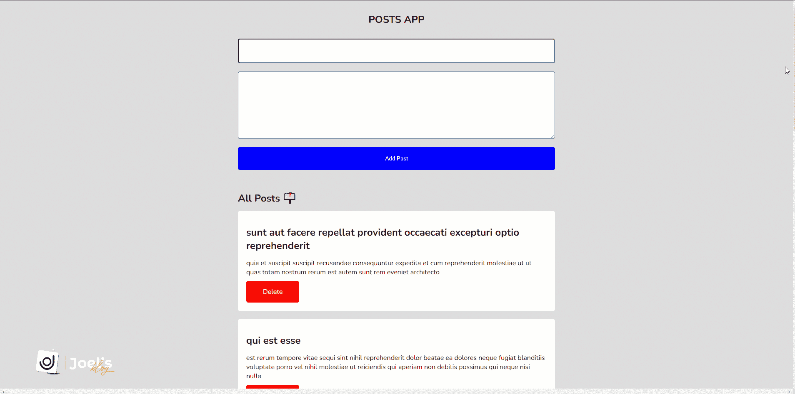

# axios React——如何发出获取、发布和删除 API 请求

> 原文：<https://www.freecodecamp.org/news/axios-react-how-to-make-get-post-and-delete-api-requests/>

[Axios](https://axios-http.com/) 是一个基于 promises 的 HTTP 客户端库。它使得向 REST 端点发送异步 HTTP 请求变得更加容易，并帮助您执行 CRUD 操作。

这个 REST 端点/API 可以是一个外部 API，比如 Google API、GitHub API 等等——也可以是您自己的后端 Node.js 服务器。

在本指南中，我们将学习如何让 Axios 在 React 中获取、发布和删除 API 请求。这只是指我们如何从 API 中检索数据，向 API 中添加数据，然后从 API 中删除数据。

Get、Post 和 Delete API 请求是开发人员最常见的日常请求。毕竟，我们总是需要获取数据以显示在我们的应用程序上或执行某些操作，以及向/从我们的 API 添加和删除数据。

## 为什么选择 Axios？

你可能会问的下一个问题是，既然我们需要安装一个额外的库，我们为什么要使用 Axios。以下是一些原因:

*   Axios 在幕后使用了 [XMLHttpRequest](https://developer.mozilla.org/en-US/docs/Web/API/XMLHttpRequest) ，它被大多数浏览器广泛支持，包括像 Internet Explorer 11 这样的老浏览器。另一方面，Fetch()只兼容 Chrome 42+、Firefox 39+、Edge 14+和 Safari 10.3+(你可以在 CanIUse.com 的[上看到完整的兼容表)。](https://caniuse.com/fetch)
*   当发送请求时，Axios 自动标记数据，不像 fetch()需要我们手动完成。
*   与需要您自己检查状态代码并抛出错误的 Fetch API 不同，Axios 具有更好的错误处理能力，可以抛出 400 和 500 范围的错误。

## 如何在 React 中开始使用 Axios

要在 React 应用程序中开始使用 Axios，首先使用以下命令将 React 安装到项目中:

```
npm install axios
```

一旦完成，我们将使用[jsonplachelder Posts API](https://jsonplaceholder.typicode.com/posts)来学习如何将这些帖子提取到我们的 React 应用程序中，添加新的帖子，最后用 Axios 删除特定的帖子。

因为这是一个 React 应用程序，所以我们将使用 React 钩子来访问状态和其他特性。我们将使用的钩子是`useEffect()`和`useState()`。

本质上，我们将使用`useEffect()`钩子在应用程序渲染/挂载后立即获取帖子，而`useState()`钩子将帮助我们为数据创建一个本地存储。



### 如何创建 Axios 实例

一旦成功安装了 Axios，创建一个 Axios 实例是个好主意。这不是必需的，但可以节省我们的时间。

为了创建一个实例，我们将使用`.create()`方法，该方法允许我们指定诸如 URL 和可能的标题之类的信息:

```
import axios from "axios";

const client = axios.create({
  baseURL: "https://jsonplaceholder.typicode.com/posts" 
});
```

## 如何在 React 中使用 Axios 发出 GET 请求

您可以使用 GET 请求从一个端点获取数据，由于有了`useEffect()`钩子，应用程序一呈现，数据就会被获取。

我们将使用该变量，然后附加`.get()`方法向我们的端点/API 发出 GET 请求。然后我们将使用一个`.then()`回调来取回所有的响应数据，因为我们已经有了一个 Axios 实例来保存分配给变量(客户端)的`baseURL`。

使用`.data`属性，我们获得响应数据，这是来自响应对象的实际数据。

```
const App = () => {
   const [posts, setPosts] = useState([]);

   useEffect(() => {
      client.get('?_limit=10').then((response) => {
         setPosts(response.data);
      });
   }, []);

   return (
      // ...
   );
};

export default App;
```

我们将数据设置为我们创建的状态，因此它可以在我们的应用程序中使用。

### 如何使用 GET 请求

成功实现 GET 请求后，下一步是使用存储在`posts`状态中的数据。

因为我们要查询一个包含 10 篇文章的数组，所以我们必须遍历这个状态，将这 10 篇文章放入我们的应用程序中:

```
// ...

return (
  <div className="app">
    <h2>All Posts 📫</h2>
    {posts.map((post) => {
       return (
          <div className="post-card" key={post.id}>
             <h2 className="post-title">{post.title}</h2>
             <p className="post-body">{post.body}</p>
             <div className="button">
                <div className="delete-btn">Delete</div>
             </div>
          </div>
       );
    })}
  </div>
);

// ...
```

## 如何在 React 中使用 Axios 发出 POST 请求

您使用 POST 请求向端点发送数据。它的工作方式类似于 GET 请求，除了当表单被提交或以其他方式提交时，将触发为执行该任务而创建的函数。

这需要一个对象来发送数据，并通过扩展以前的数据然后添加新数据来将数据添加到状态:

```
const App = () => {
   const [title, setTitle] = useState('');
   const [body, setBody] = useState('');
   const [posts, setPosts] = useState([]);

   // ...

   const handleSubmit = (e) => {
      e.preventDefault();
      addPosts(title, body);
   };

   const addPosts = (title, body) => {
      client
         .post('', {
            title: title,
            body: body,
         })
         .then((response) => {
            setPosts([response.data, ...posts]);
         });
      setTitle('');
      setBody('');
   };

   return (
      // ...
   );
};

export default App;
```

当提交表单时，我们调用`handleSubmit()`函数，该函数防止页面重新加载。它还通过将输入表单的数据作为参数传递来调用主函数`addPosts()`。

### 如何在 React 中执行删除请求

顾名思义，您可以使用它从您的端点/API 以及 UI 中删除特定的数据——DELETE 可以处理这两者。

为此，我们将结合初始化 Axios 的客户端变量使用 DELETE 方法。请求看起来是这样的:

```
const App = () => {
   const [posts, setPosts] = useState([]);

   // ...

   const deletePost = (id) => {
      client.delete(`${id}`);
      setPosts(
         posts.filter((post) => {
            return post.id !== id;
         })
      );
   };

   return (
      // ...
   );
};

export default App;
```

基本上，删除按钮上有一个`onClick"=() =>"deletePost"("post."id)`方法触发`deletePost()`方法。我们向它传递了我们试图删除的特定帖子的`ID`,这样我们就可以识别该帖子。

通过使用 filter 方法返回一个不包含该元素的数组，从端点/API 中删除它之后，我们从 UI 中删除它。

## 如何用 Async/Await 发出请求

到目前为止，我们已经看到了如何使用 promise 语法发出 Axios 请求。现在，让我们看看如何使用 async/await 编写更少的代码，并避免更难理解的`.then`链接。

要使用 async/await，首先在函数中调用`async`。然后，在发出请求并期待响应时，在函数前面添加`await`语法，直到承诺与结果达成一致。

当我们使用 async/await 时，我们所有的 Axios 请求看起来都像这样:

```
const App = () => {
   const [title, setTitle] = useState('');
   const [body, setBody] = useState('');
   const [posts, setPosts] = useState([]);

    // GET with Axios
   useEffect(() => {
      const fetchPost = async () => {
         let response = await client.get('?_limit=10');
         setPosts(response.data);
      };
      fetchPost();
   }, []);

   // DELETE with Axios
   const deletePost = async (id) => {
      await client.delete(`${id}`);
      setPosts(
         posts.filter((post) => {
            return post.id !== id;
         })
      );
   };

   // handle form submission
   const handleSubmit = (e) => {
      e.preventDefault();
      addPosts(title, body);
   };

   // POST with Axios
   const addPosts = async (title, body) => {
      let response = await client.post('', {
         title: title,
         body: body,
      });
      setPosts([response.data, ...posts]);
      setTitle('');
      setBody('');
   };

   return (
      // ...
   );
};
```

## 如何处理 Axios 中的错误

当使用来自 API 的数据时，总是建议我们处理错误以帮助显示我们得到的错误类型。这些错误可能是由于我们传递不正确的数据、向不正确的 API 发出请求或遇到网络错误而导致的。

我们可以通过使用`.then()`和`.catch()`方法来处理 Axios 中的错误，或者使用`try...catch`块来处理 async/await Axios 请求。

### 如何用`.catch`方法处理 Axios 中的错误

您可以通过将一个`.catch()`方法附加到`.then()`方法来处理错误来实现这一点。假设`.then()`方法失败了:

```
useEffect(() => {
  client
     .get('?_limit=10')
     .then((response) => {
        setPosts(response.data);
     })
     .catch((error) => {
        console.log(error);
     });
}, []); 
```

### 如何用 try…catch 块处理 Axios 中的错误

对于 async/await 场景，`try...catch`块将如下所示:

```
useEffect(() => {
  const fetchPost = async () => {
     try {
        let response = await client.get('?_limit=10');
        setPosts(response.data);
     } catch (error) {
        console.log(error);
     }
  };
  fetchPost();
}, []);
```

你可以在这里阅读更多关于使用 Axios [处理错误的信息。](https://stackabuse.com/handling-errors-with-axios/)

## 结论

在本教程中，您学习了如何使用 Axios(最强大的 HTTP 客户端库之一)来执行三个基本的 API 请求。

您可以在这个库中看到我如何使用 React 和 Axios 构建 [post 应用程序的完整实现。](https://github.com/olawanlejoel/posts-jsonplaceholder-demo)