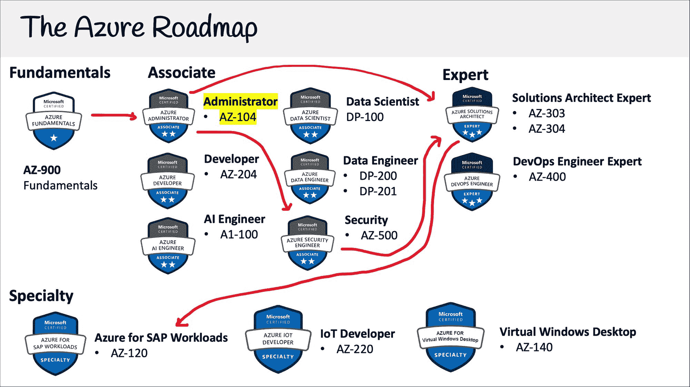
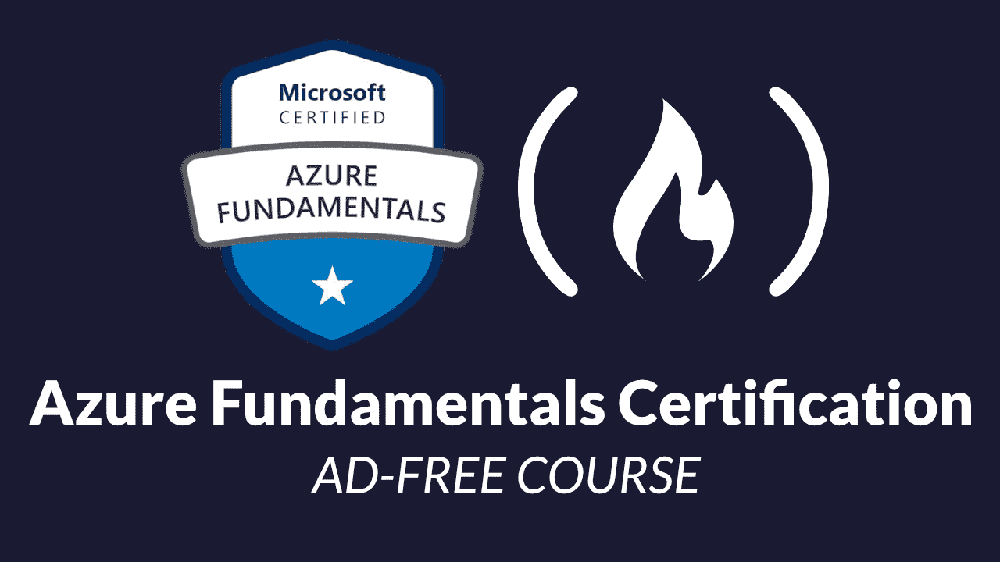
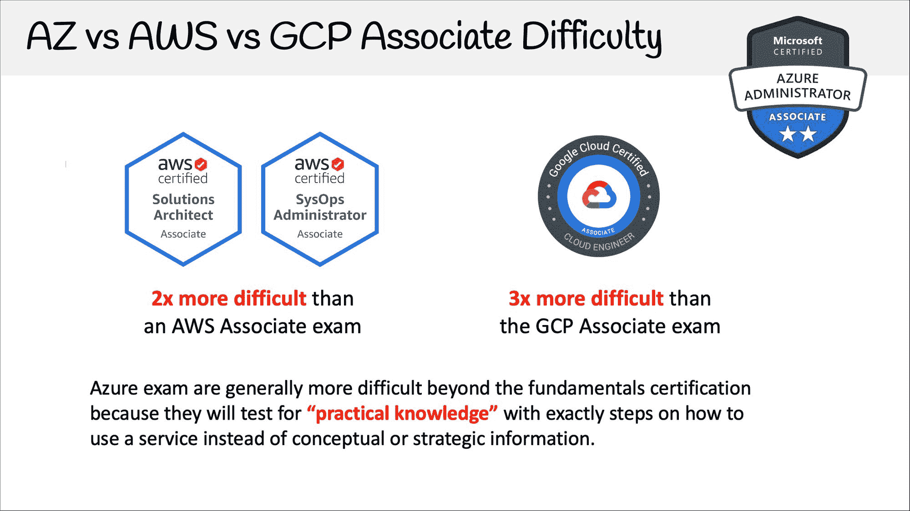

# Azure 管理员认证(AZ-104)-通过这个 11 小时的免费课程考试

> 原文：<https://www.freecodecamp.org/news/azure-administrator-certification-az-104-pass-the-exam-with-this-free-11-hour-course/>

通过完成这个 11 小时的免费课程，你可以了解获得 Azure 管理员认证所需的一切。

## 什么是微软 Azure Administrator？

Azure Administrator 是最受欢迎的 Azure 认证，因为它提供了最广泛的管理 Azure 基础设施的实用知识。它还允许你**转向任何基于 Azure 的角色的职业道路**。

如果 Azure 是贵公司使用的主要工作负载，那么这个云认证是必须获得的 Azure 认证。

如果你对 Azure 完全陌生，即使你持有不同的云认证，我也强烈建议你先考 AZ-900。这是因为 associate 级别的 Azure 认证比其他云服务提供商的任何其他认证都要困难得多。虽然 Azure 表面上看起来在服务方面很相似，但实际上却大不相同。

[Azure Fundamentals Certification (AZ-900) – Pass the Exam With This Free 3-Hour CourseWhat is Microsoft Azure?Microsoft Azure is a cloud service provider. A cloud service provider (CSPs) isa technology company that offers multiple cloud services. Azure has listed over600 cloud service offerings, from computing to storage to databases to machinelearning. Azure is the second most …Andrew BrownfreeCodeCamp.org](https://www.freecodecamp.org/news/azure-fundamentals-course-az900/)

## AWS 解决方案架构师 vs Azure 管理员

如果您熟悉 AWS 认证，就重要性而言，它相当于 AWS 解决方案架构师助理。

就实际内容而言，Azure 管理员更像是 AWS 开发人员助理和 AWS SysOps 管理员的混合体。

这是有意义的，因为 Azure 的云架构是通往微软传统内部解决方案的桥梁。因此，抽象地设计云原生解决方案是次要的，理解如何将现有的基于微软的公司引入 Azure 才是首要的。

对于那些还没有在 IT 职业中体验过活动目录、Windows 服务器和一般 Windows 管理的人来说，将会有一个额外的学习曲线。

Azure 是 windows 优先的云服务提供商，如果你没有 Windows 电脑，你可能只能观察然后直接体验如何利用一些 Azure 云服务。

正如我之前提到的，Azure associate 认证比其他云服务提供商要困难得多，所以预计会投入更多时间。

## Azure 管理员概述

Azure 管理员涵盖以下内容:

*   Azure 活动目录
*   用户、组和权限
*   确保资源合规性的政策
*   通过 Azure 资源管理器将基础设施作为代码
*   管理资源、范围和订阅
*   容器和 Kubernetes
*   Azure 虚拟机和 Azure 磁盘
*   通过 Azure 存储帐户的各种存储模式
*   Azure 网络(这里有很多内容要介绍)
*   SLA 可用性、可用性集、规模集、应用网关
*   面向全托管应用的 Azure 应用服务
*   Azure 备份，Azure 监视器
*   更多...

它没有涵盖无服务器、数据库和应用程序集成等内容。你可以在 Azure 开发者认证中找到这些。

## **如何获得 Azure 管理员认证？**

你可以通过支付考试费并在与微软 Azure 合作的考试中心参加考试来获得认证。

微软 Azure 与 Pearson Vue 和 PSI Online 合作，它们在世界各地都有考试中心网络。他们提供现场考试和在线考试。如果有机会，我建议你亲自参加考试。

微软在 Pearsue Vue 上有一个门户页面，你可以在那里注册和预订考试。

那个考试费是 **$165 美金**。

## 我可以简单的看视频通过考试吗？

你需要应用知识，因为考题会考实用知识。例如，一个问题可能会询问启动一项服务的步骤顺序，而你只能通过实践来获得这些知识。

Azure 的更新频率远高于其他云服务提供商。有时每个月都会有新的认证更新。

考试有 ****40 到 60**** 题，时间线为 ****1** 80 分钟**。

考试包含许多不同的题型。

一个及格分数是****70%左右。****

## 免费的 Azure 管理员视频课程

就像我在 freeCodeCamp 上发布的其他云认证课程一样，这个课程将永远免费。

该课程包含学习策略、讲座、跟进和备忘单，是一门完整的端到端课程。

前往 freeCodeCamp 的 YouTube 频道[开始学习 11 个小时的课程](https://youtu.be/10PbGbTUSAg)。

[https://www.youtube.com/embed/10PbGbTUSAg?feature=oembed](https://www.youtube.com/embed/10PbGbTUSAg?feature=oembed)