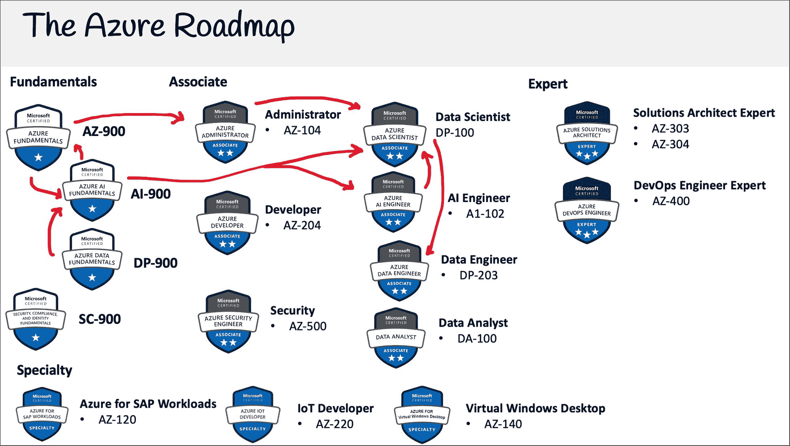

# Azure 人工智能基础认证(AI-900)-通过这个免费的 4 小时课程的考试

> 原文：<https://www.freecodecamp.org/news/azure-data-fundamentals-certification-ai-900-pass-the-exam-with-this-free-4-hour-course/>

# **什么是 Azure AI Fundamentals 认证？**

Azure AI Fundamentals 认证面向那些寻求机器学习角色的人，如人工智能工程师或数据科学家。

在过去的十年里，公司已经围绕他们的服务和产品收集了大量的数据。

2010 年代的成功公司是数据驱动型公司，他们知道如何收集、转换、存储和分析他们的海量数据。

2020 年代的成功公司将是人工智能驱动的公司，他们知道如何利用深度学习并创造人工智能产品和服务。

# **Azure AI 基础知识概述**

Azure AI 基础知识涵盖以下内容:

*   Azure 认知服务
*   人工智能概念
*   知识挖掘
*   负责任的 AI
*   ML 管道和 MLOps 的基础知识
*   经典 ML 模型
*   AutoML 和 Azure ML Studio

# ******如何获得蔚蓝**** AI ****基本面认证？******

你可以通过支付考试费并在与微软 Azure 合作的考试中心参加考试来获得认证。

微软 Azure 与 Pearson Vue 和 PSI Online 合作，它们在世界各地都有考试中心网络。他们提供现场考试和在线考试。如果有机会，我建议你亲自参加考试。

微软在 Pearsue Vue 上有一个门户页面，你可以在那里注册和预订考试。

该考试费为****99 美元**** 。

**我可以简单的看视频通过考试吗？**

对于像 AI-900 这样的基础认证，你可以通过观看视频内容，而不用亲自动手探索 Azure 服务

Azure 的更新频率远高于其他云服务提供商。有时每个月都会有新的认证更新，但是 AI-900 不是以动手为中心的，所以学习课程不太容易过时。

*   考试有 ****40 到 60**** 题，时间线为 ****60 分钟**** 。
*   考试包含许多不同的题型。
*   一个及格分数是****70%左右。****

## **免费的 Azure AI 基础视频课程**

就像我在 freeCodeCamp 上发布的其他云认证课程一样，这个课程将永远免费。

该课程包含学习策略、讲座、跟进和备忘单，是一门完整的端到端课程。

[前往 freeCodeCamp 的 YouTube 频道](https://www.youtube.com/watch?v=OwZHNH8EfSU)开始学习 4 小时的课程。

[https://www.youtube.com/embed/OwZHNH8EfSU?feature=oembed](https://www.youtube.com/embed/OwZHNH8EfSU?feature=oembed)

## 完整抄本

(注:自动生成)

嘿，我是 Andrew Brown，您的云教师考试专家，我将为您带来另一个完整的学习课程。

这一次，它是 Azure 人工智能基础，在免费代码营提供。

因此，本课程旨在帮助您通过考试并获得微软颁发的认证。

为此，我们将为您提供精彩的讲座内容，跟随我们获得实践经验，以及考试当天的小抄。

因此，当你获得这一认证时，你可以把它放在你的简历或 LinkedIn 上，展示你拥有 ASHRAE 知识来获得云工作或升职。

所以我想介绍一下我自己，我之前是多家 edtech 公司的 CTO，有 15 年的行业经验，五年专门从事云服务社区 hero，我出版过许多免费的云课程。

我喜欢星际迷航和椰子汁。

所以我想在这里花点时间感谢像你们这样的观众，因为是你们让这些免费课程成为可能。

如果你想支持更多的免费课程，就像这个，一个很好的方法就是在 pro.co 考试网站上购买我们的额外学习资料。

而这次考试，是福特 slash ai 900。

这将使你获得学习笔记、抽认卡、测试题、可下载的小抄和练习考试。

你还可以问问题，获得一些学习支持。

因此，如果你想了解我发布的更多课程，你可以在安德鲁的 twitter 上关注我，当你通过考试时与我分享安德鲁 10 路，或者你可能希望看到的下一门课程。

所以我们开始吧。

我们开始吧。

嘿，我是专业考试的安德鲁·布朗。

我们在这里开始我们的旅程，学习 AI 900，问一个最重要的问题，什么是 a 900。

因此，Azure 人工智能基础认证是为那些寻求人工智能角色的人提供的，如人工智能工程师或数据科学家。

该认证将证明一个人可以定义和理解 Azure 认知服务、人工智能概念、知识挖掘、ml 管道的负责任的人工智能基础、经典 ml 模型、auto ml 和 Azure ML studio。

所以你不需要在这里了解超级复杂的 ml 知识，但绝对有助于你度过那里。

但是，是的，所以这个认证通常是指其课程代码，AIA 900 成为 Azure 人工智能工程师或 Azure 数据科学家认证的自然途径。

这通常是一门容易通过的课程。

对于那些刚接触云或 ml 相关技术的人来说，这是一件好事，看着我们的路线图，你可能会问，好吧，那么，有哪些途径呢？还有我该学什么。

这是我的马克笔。

让我们拿出注释工具或激光笔，看看我们可以去哪里。

如果你已经有了 az 900。

在你考 ai 900 之前，这是一个很好的起点。

如果你没有你的 az 900，你可以直接跳到 900。

但我强烈建议你去买那个 az 900，因为它给了你一般的、一般的、基础的知识，它只是你不应该担心的另一件事，只是如何在基础水平上使用 Azure。

你需要 DP 900 来使用 900 吗？不，但是很多人似乎喜欢走这条路线，他们希望在进入 AI 100 之前有数据基础，因为他们知道这只是广泛的知识，在那里是有用的。

所以，你知道，很明显，你看到很多人得到了 AI 900 和 DPI 900。

合在一起，vana 100，路径更清晰一点，要么成为数据科学家，要么成为人工智能工程师。

所以人工智能工程师只是认知服务，你必须知道如何使用人工智能服务进出数据科学家更专注于建立实际的管道，以及 Azure 机器学习工作室内的类似事情。

所以你只需要决定哪条路适合你。

数据科学家肯定比人工智能工程师更难，我认为教练被更新了。

所以我把它更新为 102。

我认为人工智能工程师是两个独立的，你必须学习两个独立的课程。

但现在只剩一个了。

所以是统一的。

但你知道，如果你没有准备好学习数据科学，有些人喜欢先学习人工智能工程师，然后再学习数据科学家。

所以这有点像热身。

还是那句话，不是 100%必须的，只是根据你个人的学习风格。

很多时候，人们喜欢在数据科学家之后选择数据工程师，只是为了完善他们的完整知识。

现在，如果你已经有了 az 900 和 associate，你可以放心地去找数据科学家，如果你想冒险的话，因为这个真的很难。

所以，如果你以前通过了简单的一门，你知道，你可能会有更多的信心，学习这些东西，所有这些有趣的基础知识。

但是当然，我们总是建议你去获取这些基础证书，因为有时候课程材料并没有涵盖这些信息。

所以显而易见的东西会被忽略。

好吧。

所以在这里继续。

那么你应该学习多长时间才能通过 900 呢？嗯，如果你有一年的 Azure 使用经验，你会看到 5 个小时，少则 5 个小时，多则 10 个小时。

如果你已经过了 az 900 到 dp 900。

平均 10 小时左右。

如果你对人工智能完全陌生，你会看到 15 个小时，这可能会再次延长到 20 到 30 个小时，这取决于你对这些概念的了解程度。

但是你知道，我认为平均来说，我们在看 15 个小时，推荐的学习时间是每天 30 分钟，持续 14 天应该可以让你度过。

你知道，但是，你知道，只是不要过度学习，只是不要花太少的时间，你知道。

那么你在哪里举这个例子，你可以亲自在考试中心或者在你自己家里方便的时候在线上举。

所以有两个受欢迎的考试中心，psi 和皮尔逊 VUE，嗯，我应该说这是他们的。

这些不一定是考试中心，但它们是与 psi Pearson VUE 合作的考试中心的集合，因此您可以在当地的考试中心轻松参加考试。

如果你听说过监考这个词，它的意思是在你参加考试时监督你的监考人。

当我们谈论在线考试时，他们会说监考考试指的是在线部分，如果我可以选择在网上面对面，总是面对面，因为这是一个受控的环境，它会减少我们的压力。

而且，你知道，在网上，会有很多事情出错。

所以你知道，但这取决于你的个人喜好和你的情况。

好吗？通过考试需要什么？嗯，你必须看讲座，记住关键信息，做实验，跟着你自己的 Azure 账户走，我会说你可能只需要看这个里面的所有视频就可以了，但你知道，这真的可以强化信息。

如果你真的花时间去那里。

有一些东西是 Azure 机器学习工作室，你可能会对启动持谨慎态度，因为我们必须运行实例，它们将需要钱。

所以如果你觉得不舒服，看着你应该没问题。

但当你进入助理级时，你绝对必须期望付出一些东西来学习并承担风险，好吗？你想做模拟真实考试的付费在线练习考试。

所以我在我的专业考试平台上有这门课附带的付费练习考试。

这就是你可以帮助支持更多这些免费课程的方式。

你能不参加模拟考试就通过吗？因为她有点难。如果这是 AWS 考试？我会说是的。

为了蔚蓝。

简单的 100 分肯定有点冒险。

Ai 900 dP 900 sC 900？不，我认为你应该得到一个模拟考试，至少一个，或者浏览一个样本，在 Azure 网站上可能会有一个样本。

让我们很快地看一下考试指南。

在接下来的视频中，我们将更详细地了解一下。

所以分为以下几个领域来描述 AI 工作负载和考虑事项描述 Azure 上机器学习的基本原理描述 Azure 上计算机视觉工作负载的特征描述 Azure 上自然语言处理工作负载的特征描述 Azure 上对话式 AI 工作负载的特征。

我想让你注意到它说描述，描述，描述，描述，描述，这很好，因为这告诉你这不会非常非常难，对吗？如果你开始看到的东西说，除了描述识别，那么你知道，这将是有点困难，好吗？这里的及格分数是 1000 分中的 700 分。

所以这大约是 70%,我会说大约是 70%,因为你可能会在 70%的时候失败。

因为这些都是针对评分的。

对于回答类型，大约有 40 到 60 个问题，你可以答错 12 到 18 个问题。

我在这里加了一个星号，因为每个赞，每个部分并不总是只有一个问题，但是我会在一秒钟内谈到这个问题。

所以有些问题不止值一分。

错题不罚。

有些问题不能跳过。

并且提问的格式可以是多选、多答、拖拽热点区域案例分析。

案例研究。

我不记得了，我想我没有看过 mind 的案例研究。

但是案例研究会有一系列的问题，一系列的问题组成或者回到一个特定的商业问题。

这些非常有趣。

这就是为什么我们在这里有一个星号？

所以在持续时间里，你有一个小时，这意味着每个问题大约一分钟。

本次考试的时间是 60 分钟，您的座位时间是 90 分钟，座位时间是指您应该为该考试分配的时间。

因此，这包括复习说明、阅读、接受 NDA、完成考试以及在考试时提供反馈的时间。

在我们获得认证之前，有效期为 24 个月至两年。

而且，你知道，我们现在将继续完整的考试指南。

好吧。

嘿，我是专业考试的安德鲁·布朗。

我们在这里找到的是微软网站上的官方考试大纲。

如果你想自己找到这个，只需输入 ai 100，Azure 或微软，你应该可以很容易地找到它，页面看起来是这样的。

我希望大家向下滚动，因为我们正在寻找可衡量的技能，从这里，我们将下载技能大纲。

一旦我们打开了，你可能会想提高文本。

因此，在这些文档中，您总是会在顶部看到一个红色的文本，上面写着:嘿，我们已经更新了课程，因为您喜欢用微小的更新来更新他们的课程，这些更新通常不会影响研究的结果。

但这确实让很多人担心。

所以我们说，你的核心数据是什么？所以不，不，他们只是做了些小改动。

因为他们一年大概会做五次。

所以如果有重大修改，他们会改变它。

因此，我们没有使用人工智能 900，而是使用人工智能 901 或 9902，最近我们看到了人工智能 100 单词，现在是人工智能 102 或 103。

抱歉。

所以你知道，小心那些。

如果这是一个大的修改，那么是的，你需要一个全新的课程，它不会匹配。

但对于未成年人来说，这将是我的新东西。

因此，如果我们向下滚动，很多时候，他们只是划掉他们在这一个中更改的内容，特别是，他们没有向我们详细展示，您必须通过比较来阅读。

但是我们将在这里查看新的列表。

我们在这里的工作方式是描述人工或人工智能工作负载和考虑事项。

所以这里我们只是在描述人工智能的一般性。

预测，这是因为当我们使用自动最大似然预测时，预测将是分类和回归，预测将是实时序列预测，我想，身份特征异常检测。

所以在这次考试中没有很多。

所以我们简单地谈了一下，计算机视觉工作负载，计算机视觉下有很多东西，你会在课程中找到，LP 和知识，挖掘工作负载，对话式人工智能，工作负载。

再说一次，这些都是概念，而不是如何使用服务，然后你有负责任的人工智能部分。

所以微软有这六个原则，他们真的想让你知道。

他们把它推广到所有的人工智能服务中。

这些是 16 升的。

现在，它们并不那么难学，然后描述 Azure 上机器学习的基本原理。

所以这里只是描述回归，分类，聚类。

我们在课程中有很多实践经验。

所以到最后你就会明白这些是干什么用的了。

对于核心的机器学习概念，我们可以识别数据集中的特征和标签。

这就是他们的数据标记服务，描述如何在机器学习中使用训练验证数据集。

因此，我们谈到了如何使用机器学习算法进行训练，选择和解释分类回归指标的模型评估，auto ml 中的许多交易类别都是自动完成的，但我们可以看到它是如何完成的。

好吧。

嗯，我认为必须自己做，确定核心任务，并创建一个机器学习解决方案。

请描述数据摄取、准备、特征工程、选择、模型训练特征、评估、模型部署和管理特征的共同特征。

然后我们描述了无代码解决方案。

所以 auto ml，他们喜欢称之为自动化。

ml，但真的，业内只是称之为 auto ml。

然后是建设管道的设计师。

这就是我们看到的一些变化。

因此，识别特征的图像分类，特征的对象检测解决方案。

所以语义分割没有了，这很好，因为我甚至不知道那是什么。

因此，OCR 解决方案的出现是一件好事，而且还有人脸检测。

然后在计算机视觉任务下，我们有计算机视觉、自定义视觉、人脸服务表单识别器音调。

关于计算机视觉有很多东西。

对于 NLP，我们有关键短语提取、身份识别、情感分析、语言建模、语音识别、合成，这一项实际上并不多见。

这是一个概念，而不是我们必须做的事情。

然后是翻译。

我们有 nlp，nlp 的东西。

因此，文本分析，路易斯，或路易斯，我不知道该怎么发音。

语音服务和文本，翻译文本。

再往下，我们有一个对话式人工智能。

因此，建立网络聊天机器人，和对话人工智能解决方案的字符看起来像这两个有电话和个人数字助理不知道为什么他们决定删除它。

不过没关系。

我认为那很好。

问答创客和 Azure bot，顺便说一句，我真的很喜欢这个服务。

所以是的，我们走吧。

这就是大纲。

现在我们将进入实际的课程。

嘿，我是专业考试的安德鲁·布朗。

我们正在研究机器学习的层次。

这里我有一个看起来像洋葱的东西。

它是什么，它只是描述这些与人工智能相关的 ml 术语之间的关系，我们将从顶部开始。

因此，人工智能，也称为 AI，是指机器模仿人类行为进行工作。

所以它没有描述它是如何做到的。

但事实是，这就是人工智能的一个层面，我们有机器学习。

所以不需要显式编程就能更好完成任务的机器。

然后我们有深度学习。

所以这些机器拥有受人脑启发的人工神经网络来解决复杂的问题。

如果你谈论的是一些实际上组装 ml 或深度学习模型或算法的数据科学家或具有多学科技能和数学统计的人，预测建模机器学习来做出未来预测。

所以你需要明白的是，AI 只是结果，对吧？所以 AI 可能在下面用 m，或者深度学习，或者两者结合，或者只是 FL 语句，好吗？好了，让我们来看看人工智能的关键要素。

所以 AI 是模仿人类行为和能力的软件。

根据 Azure 或微软的说法，人工智能有几个关键要素。

让我们快速浏览一下这个列表。

所以我们有机器学习，这是人工智能系统的基础，可以像人类一样学习预测，你有异常检测。

因此，检测异常值或不合适的事物，就像人类的计算机视觉，能够像人类自然语言处理一样进行观察，也称为 NLP，能够处理人类语言并参考上下文，你知道，像人类一样，对话式人工智能能够与人类进行对话。

所以，你知道，我写在这里，根据微软和 Azure，因为你知道，全球定义有点不同。

但我只是想把这个放在这里，因为我已经明确地把它看作是一个考试问题。

所以我们要用阿什的定义。

好吧。

我们来定义一下什么是数据集。

因此，数据集是紧密相关或共享相同数据结构的数据单元的逻辑分组。

还有公开可用的数据集，用于统计、数据分析和机器学习的学习。

我只想在这里介绍几个例子。

第一个是 NIST 数据库。

因此，手写数字图像用于测试分类聚类图像处理算法，这些算法通常在学习如何构建计算机视觉 ml 模型以将手写内容转换为数字文本时使用。

所以只是一堆手写的数字和字母。

另一个非常受欢迎的数据集是 context cocoa dataset 中的公共对象。

这是一个数据集，包含许多使用 JSON 文件的常见图像，cocoa 格式可以识别图像中的对象或片段。

因此，这个数据集在对象分割识别和 IP 上下文中有很多东西，超级像素东西，分割，他们有很多图像和很多对象。

所以里面有很多东西。

那么我为什么要谈论这个，特别是可可数据集呢？嗯，当你使用 Azure Machine Learning Studio 时，它有一个每日数据标签服务。

问题是，它实际上可以导出为可可格式。

所以这就是为什么我想让你们了解可可是什么。

另一件事是，当你建立 Azure 机器学习管道时，他们实际上有开放的数据集，你将在课程的后面看到，这表明你可以使用非常常见的数据集。

所以你可能会看到 NIST 先生和另一个人。

所以我想给你点曝光率。

好吧。

先说数据标注。

这是识别原始数据的过程，例如图像、文本文件、视频，并添加一个或多个有意义和信息丰富的标签来提供上下文，以便机器学习模型可以学习。

所以有了监督机器学习，标注是产生训练数据的先决条件。

并且每条数据通常将由人来标记。

我在这里说一般的原因是因为有了 Azure 数据标注服务，他们实际上可以做 ml 辅助标注。

因此，在无监督的机器学习中，标签将由机器生成，并且可能不是人类可读的。

我想谈的另一件事是“基础真理”这个术语。

因此，这是一个适当的，适当标记的数据集，你可以用它作为客观标准来训练和评估一个给定的模型通常被称为地面真实，你的训练模型的准确性将取决于你的地面真实的准确性。

现在，使用 Azure 作为工具，我已经看到并使用了“地面真相”这个词，我在 AWS 中看到了很多，甚至这张图也来自 AWS。

但我只是想确定你熟悉所有这些东西。

好吧。

我们来比较一下有监督无监督和强化学习。

从顶部开始，我们有监督学习，这是数据被标记为训练的地方。

它被认为是任务驱动的，因为你试图做一个预测来获得一个值。

因此，当标签是已知的，并且您想要一个精确的结果时，当您需要返回一个特定的值时，因此您将在这些情况下使用分类和回归。

对于无监督学习，这是没有被标记的数据，ML 模型需要自己做标记。

这被认为是数据驱动的。

它试图识别一种结构或模式。

这是标签未知的时候。

当你试图理解数据时，结果不需要很精确。

所以你有聚类，降维和关联。

你以前听说过这个术语吗？这个想法是，它试图减少维度的数量，以便更容易地处理数据。

所以要理解这些数据，对吗？我们有强化学习。

所以这就是没有数据的地方。

有一个环境，一个 ml 模型生成数据，并做许多尝试来达到一个目标。

所以这被认为是决策驱动。

所以这是为了游戏人工智能学习任务机器人导航，当你看到有人在视频游戏中编码，可以自己玩，这就是它。

如果你想知道，这不是所有类型的机器学习。

而这些特定的、无监督的和有监督的被认为是经典的机器学习，因为它们严重依赖统计和数学来产生结果。

但是你走了。

那么什么是神经网络呢？嗯，它经常被描述为模仿大脑，它是一个代表算法的神经元或节点。

因此，数据被输入到一个神经元，根据输出，数据将被传递到许多连接的神经元中的一个，神经元之间的连接是加权的，我真的应该强调这一点非常重要。

网络被组织成层，将有一个输入层，一个太多的隐藏层和一个开放层。

这是一个非常简单的神经网络的例子。

注意 nn，很多时候你会在 ML 中看到，它是神经网络的缩写。

有时神经网络只是被称为神经网络。

所以要明白这是同一个术语。

什么是深度学习？这是一个具有三个或更多隐藏层的神经网络，它被认为是深度学习，因为在这一点上，它不是人类可读的，以了解这些层内发生了什么。

什么是福特弗里德，所以神经网络，它们在没有形成循环的节点之间有连接，它们总是向前移动。

这只是描述了网络的前向传递，你会看到 fn n，它代表前向神经网络，只是描述了这种类型的网络，然后是反向传播，这是在前向网络中。

这是我们通过神经网络向后移动的地方，调整权重以改善下一次迭代的结果。

这是神经网络学习的方式。

反向传播知道这样做的方法是有一个损失函数。

这是一个比较真实数据和预测数据的函数，用来确定网络运行的错误率。

当它到达终点时，它将执行计算，然后它将进行反向传播，调整权重，然后你有激活函数，我将在这里清除它。

所以激活功能。

它们是应用于影响连接输出的隐藏层节点的算法。

因此，对于整个隐藏层，它们在这里都有相同的一个，只是有点影响它如何学习和喜欢如何加权工作，所以这是反向传播的一部分。

就学习过程而言，有一个密集的概念，当下一层增加节点数量时，你有一个稀疏的概念，当下一层减少音符数量时。

任何时候你看到一些东西从密集层到稀疏层，这通常被称为维度降维，因为你在减少维度的数量，因为你网络中的节点数量决定了你拥有的维度。

好吧。

什么是 GPU？嗯，它是一个通用的处理单元，专门设计用于同时快速渲染高分辨率图像和视频。

GPU 可以对多组数据执行并行操作。

因此，它们通常用于非图形任务，如机器学习和科学计算。

所以一个 CPU 平均 4 到 16 个。

处理器内核，一个 GPU 可以拥有 1000 个处理器内核，因此拥有 48 个 GPU 的系统可以拥有多达 40，000 个内核。

这是我从 Nvidia 网站上抓取的一张图片。

所以这真的很好地说明了，就像这对机器学习或神经网络有多好。

因为神经网络有一堆节点。

它们是非常重复的任务，您可以将它们分散到许多内核中，这将会产生非常好的效果。

因此，GPU 适合于重复和高度并行的计算任务，如渲染、图形、加密货币挖掘、深度学习和机器学习。

我们在讨论 CUDA 之前，我们可以先讨论一下 Nvidia 是什么。

所以 Nvidia 是一家为游戏和专业市场制造图形处理器的公司。

如果你玩电子游戏，你应该听说过英伟达。

那么什么是 CUDA 呢？这就是计算统一设备架构。

它是 Nvidia 的并行计算平台和 API，允许开发人员使用支持 CUDA 的 GPU 在 GPU 上进行通用计算。

所以 GP GPUs，各大深度学习框架都集成了英伟达深度学习 SDK。

Nvidia 深度学习 SDK 是用于深度学习的 Nvidia 库的集合。

其中一个库是 CUDA 深度神经网络库。

所以 cu dnn so CUDA，RC UD 和 n 提供高度调整的实现标准例程，如前向和后向卷积卷积非常适合计算机视觉，汇集标准化激活层。

所以，你知道，在 AI 900 的 Azure 认证中。

他们不会谈论 CUDA。

但是如果你了解这两件事，你就会明白为什么 GPU 真的很重要。

好吧。

好了，让我们简单介绍一下机器学习管道。

所以这一个肯定不是详尽的，在这门课中，我们肯定会看到更复杂的。

但是让我们在这里开始吧。

从左边开始，我们可以从数据标签开始。

这在你进行监督学习时非常重要，因为你需要标记你的数据集，ML 模型可以通过示例学习，在训练期间，这个阶段和特征工程师接近阶段或被认为是预处理，因为我们准备我们的数据为模型进行训练。

当我们转到特征工程时，这里的想法是 ml 模型只能处理数字数据。

所以我们需要把它翻译成它能理解的格式。

所以提取出 ML 模型需要重点关注的重要数据。

好了，接下来是训练步骤。

因此，您的模型需要学习如何变得更智能，它将执行多次迭代，每次迭代都变得更智能，您可能还有一个超参数调整步骤，它说调整，但应该说调整。

但是 ML 模型可以具有不同的参数。

因此，您可以使用 ml 尝试许多不同的参数来优化结果。

当你进入深度学习时，不可能手动调整参数。

所以你必须使用超参数调整，然后你有服务，有时被称为部署。

但是你知道，当我们说部署时，我们谈论的是整个管道，不一定只是 ML 模型步骤。

所以我们需要让一个 ml 模型变得可访问。

因此，我们通过在虚拟机或容器中托管来提供服务。

当我们谈论 Azure 机器学习时，它要么是 Azure Kubernetes 服务，要么是 Azure 容器实例。

你就有了推论。

因此，推断是请求的行为，请求做出预测，因此，您可以发送包含 CSV 或其他内容的有效负载，然后获得结果，这样就有了实时端点和批处理。

所以实时，只是他们可以批处理，也可以实时。

但是一般来说比较慢。

但问题是我有吗？我是在做单项预测吗？还是我一次给你一堆数据。

同样，这是一个非常简化的 ml 管道，我相信我们将在本课程的后面部分再次讨论 ml 管道。

让我们比较一下预测和预言这两个术语。

所以预测，你用相关数据做一个预测。

它非常适合分析趋势，而且不是猜测。

当你谈论预测时，这是你在没有相关数据的情况下做出预测，你使用统计数据来预测未来的结果，这更多的是猜测。

他运用决策理论。

假设你有一堆数据。

这个想法是你要从数据中推断，好的，也许是 a，也许是 B，也许是 c。

对于预测来说，你没有太多的数据，所以你必须发明一些数据。

这个想法就是你会发现结果是什么。

这些都是非常宽泛的术语，但你知道，只是为了让你对这两件事有一个高层次的看法。

那么什么是绩效或评估指标呢？嗯，它们是用来评估不同的机器学习算法的。

所以这个想法是，你知道，当你的机器学习做出预测时，这些是你用来评估的指标，以确定你的 ml 模型是否如你所愿地工作。

因此，对于不同类型的问题，不同的度量标准很重要，这绝对不是一个详尽的列表。

我只是想让你们接触这些单词和东西，这样当你们看到它们的时候，你们会说，好的，我会回到这里，参考这个。

但是很多这些都不是你需要记住的，而是你应该知道的分类标准。

所以分类，我们有准确度，精确回忆 f1 评分，rockin AUC。

对于回归度量。

我们有 MSC，我们的 MSC ma 排名指标，我们有 MLR，DCG 和 DCG。

统计度量，我们有相关性，计算机视觉度量，我们有 psnr，SSI m，IOU 和 LP 度量，我们有困惑蓝流星 rogue，深度学习相关度量。

我们有盗梦空间分数，我不能说出这个人的名字，但是或者我假设它是一个人，但是这个盗梦空间距离。

有两类评估指标，我们有内部评估。

因此，度量用于评估 ml 模型的内部。

所以准确度 f1 的分数精度，回想一下，我称它们为著名的利用各种模型和外部评估指标来评估最终预测的一个 ml 模型。

所以，是的，别太激动了。

我知道那是很多东西。

重要的，我们会再看的，好吗。

我们来看看木星笔记本。

这些是基于 web 的应用程序，用于创作文档，将实时代码、叙述性文本等式和可视化结合起来。

因此，如果你正在做数据科学，或者你正在建立 ml 模型，你的应用程序将与 Jupyter 笔记本一起工作。

它们总是集成到云服务提供商的 ml 工具中。

所以 Jupyter 笔记本实际上来自 ipython。

所以 ipython 是它的前身。

他们把这个特性提取出来，变成了我买的 Jupyter 笔记本，ipython 现在是运行 python 的内核。

因此，当您在这里执行 Python 代码时，它使用的是 ipython，这是 Python Jupyter 的一个版本。笔记本经过彻底检查，更好地集成到一个名为 Jupiter labs 的 ID 中，我们稍后将在这里讨论这个 ID。

你通常想在实验室里打开笔记本，传统的基于网络的界面被称为 Jupiter classic 笔记本。

这是旧的看起来像你仍然打开他们，但是每个人现在使用木星实验室。

好吧，我们来谈谈木星实验室。

Jupiter Labs 是下一代基于网络的用户界面，经典 Jupyter 笔记本的所有熟悉功能都在一个灵活、强大的用户界面中。

它有笔记本、终端、文本编辑器、文件浏览器、丰富的输出，Jupiter labs 最终将取代经典的 Jupyter 笔记本。

所以你走吧。

我们一直在提到回归，但在这里我们更详细地讨论一下。

所以我们有点理解这个概念。

所以回归就是寻找一个函数的过程。

关联一个带标签的数据集 gnosis 是带标签的，这意味着它将被监督学习成一个连续的变量数。

另一种说法是预测这个变量的未来。

所以未来只是意味着，连续变量不一定是时间。

但这只是回归的一个很好的例子。

那么下周的温度会是多少？所以我们将是 20 岁？摄氏度？我们如何确定呢？我们会有向量，所以点，它们被画在一个多维的图上，维度可以不止是 x 和 y，你可以有很多。

然后你有一条回归线。

这是穿过我们数据集的线。

这将帮助我们找出如何预测价值。

那么我们该怎么做呢？我们需要计算一个向量到回归线的距离，这叫做误差。

所以不同的回归算法用误差来预测不同的未来变量。

看看这个图表，这是我们的回归线。

这是一个点，就像一个向量或者一条信息。

和这条线的距离，实际的距离，就是我们要在 ML 模型中使用的，来决定我们是否要在这里画另一条线，对吗？你知道，我们把这条线和所有其他线比较，好吗？这就是我们如何找到相似之处。

通常看到的是均方误差、均方根误差、平均值。绝对误差。

所以 MSE，mrsc，还有 Ma。

好吧。

让我们仔细看看分类的概念。

所以分类就是找一个函数来划分一个有标签的数据集的过程。

同样，这是对类或类别的监督学习，因此预测一个类别以应用于输入的数据。

那么下周六会下雨吗，是晴天还是雨天？所以我们有了数据集。

我们的想法是通过这条分类线来划分数据集。

回归就是测量直线或直线的向量。

这条线在这条线的哪一边？如果在这边，那就是晴天。

如果在这边，就是多雨。

好吧。

对于分类算法，我们得到了大型逻辑回归决策树、随机森林、神经网络、朴素贝叶斯、k 最近邻(也称为 k 和 n)以及支持向量机。

支持向量机。

好吧。

让我们仔细看看集群。

所以聚类就是对未标注数据进行分组的过程。

因此，未标记的数据意味着它是基于相似性和差异的无监督学习。

因此，结果可能是基于相似性或差异的分组数据。

我想这和上面的描述是一样的。

但是想象一下我们有图表和数据。

这个想法是我们在它周围画出界限来看相似的群体。

因此，我们可能会向 Windows 电脑推荐购买，或者向 Mac 电脑推荐购买。

现在记住，这是未标记的数据，所以标签是推断出来的，或者，或者他们只是说这些东西是相似的，对吗？所以聚类算法，我们得到了 K 意味着 K，mi dois，身份基础层次。

好吧。

嘿，我是专业考试的安德鲁·布朗。

我们正在看混淆矩阵。

这是一个可视化的小预测表，预测值与实际值的标签，实际值也称为误差矩阵，它们对分类问题很有用，可以确定我们的分类是否如我们所想的那样工作。

想象一下，我们有一个问题，这个人或者这些人吃了多少香蕉？所以我们在这里有一个这样的盒子，里面有我们预测的和实际的，它实际上是在比较实际情况，和模型预测的，对吗？考试的时候，他们会问你一些问题，比如，好吧，想象一下。

他们甚至可能不会说是或不是，也许像零和一。

所以他们说的是，你知道，想象你有，你想告诉我们真正的积极因素，对吗？这个想法是，他们不会给你看标签，但是你知道，一比一是真阳性，零和零是假阴性。

好吗？关于这些混淆矩阵，他们会问你的另一件事是，它们的大小。

这个想法是，我们现在看到的是一个哎呀，只是要删除那里。

但是我们在看一个二元分类器，因为我们有一个标签，只有两个标签，对，一个和两个，好的，但是你可以有三个，比如一个，两个，三个。

你怎么计算呢，这里是第三个细胞，所以这将是一个很好的预测，因为我们只有事实和预测。

这就是你如何知道它会是 6，大小会是 6，可能不会说是细胞，但我们会说是 6。

好吧。

为了理解异常检测，让我们快速定义一下什么是异常，即以偏离规范或标准为标志的异常情况。

因此，异常检测是在数据集颜色异常中发现异常值的过程，从而检测何时一段数据或访问模式出现可疑或恶意。

因此，异常检测的用例可以是数据清理、入侵检测、欺诈检测、系统健康监控、事件检测和传感或传感器网络、生态系统干扰、关键和级联缺陷的检测，异常检测是一个非常繁琐的过程，使用知识部分的 ml 更加高效和准确。

Azure 有一项名为异常检测器的服务，可以检测数据中的异常，以快速找到、快速识别和解决问题。

因此，计算机视觉是指我们使用机器学习神经网络来获得对数字图像或视频的高级理解。

所以对于计算机视觉深度学习算法，我们有卷积神经网络。

这些用于图像和视频识别。

他们的灵感来自于人眼实际处理信息的方式，并将信息发送回大脑进行处理。

你有递归神经网络 rnn，它通常用于手写识别或语音识别。

当然，这些算法还有其他应用，但这些是它们最常见的用例。

四种类型的计算机视觉，我们有图像分类，所以看看一个图像或视频，并分类其在一个类别中的位置对象检测。

因此，识别图像或视频中的对象，并应用标签和位置边界。

语义分割，因此通过在片段或对象周围绘制像素遮罩来识别片段或对象，对于对象和运动、图像分析来说非常重要，因此分析图像或视频以应用描述性上下文标签。

因此，也许一名员工坐在东京的办公桌前，图像分析会进行光学字符识别，或 OCR，在图像或视频中找到文本，并将其提取为数字文本以编辑面部检测，因此检测照片或视频中的面部，并干燥位置边界和标记他们的表情。

所以对于围绕 Azure 微软服务的一些东西的计算机视觉，有一个叫做视觉人工智能。

这是微软为 iOS 开发的一款应用。

因此，你使用设备摄像头来识别物体、人和物体，该应用程序会为有视觉障碍的人用声音描述这些物体。

完全免费。

如果你有一个 iOS 应用程序，我有一个 Android 手机，所以我不能使用它。

但我听说很棒。

Azure 计算机视觉服务的一些产品是计算机视觉。

因此，分析图像和视频，提取描述、标签、对象和文本，自定义视觉，自定义图像分类对象检测模型使用您自己的图像面部，检测和识别人和情感，图像形成识别器，将扫描文档转换为关键值或表格形式的可编辑数据。

因此，自然语言处理，也称为 NLP，是一种机器学习，可以理解语料库的上下文，即相关文本的主体。

因此，NLP 使您能够分析和解释文档中文本，并解释电子邮件消息，或者将口语标记置于上下文中。

例如，客户情绪分析客户是高兴还是悲伤，合成语音，因此与您交谈的语音助理会自动翻译语言之间的口语或书面短语和句子，解释口语或书面命令并确定适当的行动。

微软的语音助手或虚拟助手的一个非常著名的例子是 Cortana。

他使用 Bing 搜索引擎来执行任务，例如为用户设置提醒和回答问题。

而如果你在 Windows 10 的机器上，很容易不小心激活 Cortana。

当我们谈到 Azure 作为 MLP 产品时，我们有一个文本分析，以便进行情感分析，了解客户的想法。

查找主题。

主题相关短语使用关键短语提取，通过语言检测识别文本的语言，检测和分类文本中的实体。

通过翻译人员的命名实体识别，我们可以进行实时文本翻译和多语言支持。

为演讲服务。

我们已经将可听语音转录为可读的可搜索文本，然后我们有语言理解理解，也称为 Louis 自然语言处理服务，使您能够理解您自己的应用程序网站、聊天机器人物联网设备等中的人类语言。当我们谈论对话式人工智能时，它通常使用 NLP，所以这就是接下来您会看到重叠的地方。

让我们在这里看看对话式 AI，这是一种可以参与与人类对话的技术。

因此，我们在交互式语音识别系统中有聊天机器人语音助手，这就像交互式语音响应系统的第二个版本，所以你知道，当你打电话进来，他们说按这些数字，这是对一些和识别系统的响应，当他们实际上可以接受人类的语音并将其转化为行动。

这里的使用情形将是在线客户支持代替人工代理，回答客户常见问题，可能是运输问题任何有关客户支持、可访问性的问题，为视力受损的人提供语音操作 UI 人力资源流程，员工培训、入职、更新员工信息。

我从没见过它被这样使用过。

但这就是他们所说的用例医疗保健可及，负担得起的医疗保健。

所以也许你在做索赔程序。

我从没见过这个。

但也许在美国，你做得更多，一切都私有化，这更有意义，物联网，物联网设备。

所以亚马逊，Alexa 苹果，Siri，谷歌 Home，我想还有 Cortana，但它并没有一个特定的设备。

所以这就是为什么我没有把它列为他们的电脑软件，所以在手机或桌面上自动完成搜索。

那应该是 Cortana。

一些它能做的事。

对于围绕 Azure 对话式人工智能的两个服务，我们有 q&a maker，因此可以从您的现有内容创建一个对话式问答机器人，也称为知识库，以及 Azure bot service 智能服务 bot service，它可以按需扩展，用于创建发布管理机器人。

所以这个想法是你在这里制作你的机器人，然后用这个来部署它。

好吧。

让我们来看看负责任的人工智能，它专注于道德，透明和负责任的使用人工智能技术，微软通过其六项微软人工智能原则将负责任的人工智能付诸实践。

这一切都是微软发明的。

所以你知道，这不一定是一个标准，但它是微软正在努力推动人们采用的东西，所以我们首先要做的是公平。

所以这是一个人工智能系统，它应该公平地对待所有人，我们有可靠性和安全性，人工智能系统应该可靠和安全地运行。

隐私和安全人工智能系统应该安全并尊重隐私包容性系统应该授权给每个人并让人们参与透明性，人工智能系统应该是可理解的问责制。

人们应该对人工智能系统负责，我们需要更详细地了解这些。

所以我们将会有一个简短的视频。

首先阿尔里斯是公平的。

因此，人工智能系统应该公平地对待所有人，这样人工智能系统可以加强现有的社会刻板印象，刻板印象偏见可以在管道的开发过程中引入。

因此，人工智能系统被用来分配或保留机会、资源或信息，如刑事司法、雇员雇佣、金融和信贷等领域。

因此，这里的一个例子是一个 ml 模型，旨在选择最终申请人进行招聘，而不包含任何基于性别、种族或可能导致不公平优势的偏见。

所以你的 ml 可以告诉你每个特征如何影响模型的偏差预测。

一件有用的事情是公平学习。

因此，这是一个开源 Python 项目，旨在帮助数据科学家改善公平性和人工智能系统。

在我做这个课程的时候，他们的很多东西还在预览中。

所以你知道，这是公平的组成部分，它不是 100%，但很高兴看到他们正在取得进展。

好吧。

因此，我们对微软的第二个人工智能原则，这一个是人工智能系统应该可靠和安全地执行。

因此，人工智能软件必须经过严格的测试，以确保它们在发布给最终用户之前能够按预期工作。

如果存在人工智能出错的情况，向最终用户发布量化风险和危害的报告非常重要，这样他们就可以了解人工智能解决方案的缺点。

考试时你真的应该记住一些东西，他们肯定会问人工智能的可靠性，人类的安全至关重要。

自主车辆、健康诊断、建议、处方和自主武器系统。

他们的内容里没有提到这个。

我只是想做一些额外的资源研究。

我想，是的，当你拥有自动化武器时，你真的不希望出错，或者道德上你根本不应该拥有它们。

但是，嘿，这就是，这就是这个世界的运作方式。

但是，是的，这是这个类别。

我们正在讨论我们的第三个微软人工智能原则人工智能系统应该是安全的并且尊重隐私。

因此，人工智能可能需要大量数据来训练深度机器 ml 模型，ml 模型的性质可能需要个人身份信息。

所以请注意，确保用户数据不被泄露是非常重要的。

在某些情况下，ml 模型可以在用户的设备上本地运行。

因此，他们的 PII 保留在他们的设备上，避免了漏洞。

这叫做这就像边缘计算。

这就是人工智能安全原则的概念，用来检查恶意行为者。

因此，数据来源和沿袭数据使用内部和外部数据损坏考虑，异常检测。

所以你走吧。

我们正在讨论微软的第四项资产原则。

应该赋予每个人权力，让人们参与进来。

如果我们能为少数用户设计 AI 解决方案，他们就能为大多数用户设计 AI 解决方案。

所以我们谈论的是少数群体，我们谈论的是体能、性别、性取向、种族和其他因素。

这个真的很简单。

就实用性而言，这并不是 100%有意义，因为如果你和聋哑人团体一起为他们开发技术，很多时候他们需要专门的解决方案。

但这里的方法是，你知道，如果我们能为少数人设计，我们就能为所有人设计，这是那里的原则。

这就是我们需要知道的。

好吧。

让我们看看这里的透明度。

所以 AI 系统应该是可以理解的。

因此，可解释性和可理解性是指最终用户能够理解 UI 的行为。

因此，人工智能系统的透明度可以减少不公平性，帮助开发者调试他们的人工智能系统，从我们的用户那里获得更多的信任，那些构建人工智能系统的人应该公开他们为什么使用人工智能，公开人工智能系统的局限性。

采用开源人工智能框架可以提供透明度，至少从人工智能系统内部工作的技术角度来看是如此。

我们正在讨论微软的最后一个人工智能原则，这里人们应该对人工智能系统负责。

因此，为一致颁布人工智能原则并考虑到这些原则而建立的结构应该在政府、组织原则、道德和法律标准的框架内工作，这些明确定义的原则指导着微软以及他们如何开发、销售与第三方合作时的倡导者，并推动监管向原则发展。

这是微软在说，嘿，每个人都采用我们的模式。

还有许多其他的模型，我想微软在那里负责是很棒的，我只是觉得它需要更好地发展。

但是我们要做的是看一些更实际的例子，这样我们可以更好地理解如何应用它们的原理。

好吧。

因此，如果我们真的想了解如何应用微软的人工智能原则，他们已经通过一个免费的 web 应用程序为实际场景创建了这个不错的小工具。

所以他们有这些卡片，你可以通读这些卡片，它们用不同的场景进行颜色编码，还有一个网站，让我们去看看，看看我们能学到什么。

好了，我们在这里讨论人类人工智能交互的指导方针，这样我们可以更好地理解如何将微软人工智能原则付诸实践。

他们有 18 张卡，让我们来看看我们列表中的第一个例子，弄清楚系统能做什么，帮助用户理解人工智能系统能做什么。

因此，在这里，PowerPoint quickstart 构建器构建了一个在线大纲，帮助您开始研究主题显示建议的主题，帮助您了解特性功能。

然后，我们有必应应用程序显示你可以搜索的东西的类型的例子。

Apple Watch 显示吸引的所有指标解释了我们如何在第二张卡上弄清楚系统可以做什么。

因此，在这里，我们有 office 新的伴侣体验想法文档以及您的工作，并提供一键协助，但语法设计数据见解，更丰富的图像和更多。

谦逊的术语想法加上标签预览，有助于设定预期和提出建议。

Apple Music 中的推荐者使用诸如我们会认为你会喜欢传达不确定性的语言。

Outlook webmail 的帮助页面解释了如何将过滤分为重点过滤和其他过滤，我们将立即开始工作，但我们会随着使用而变得更好，明确错误将会发生，您可以教授产品并在我们的红牌上设置覆盖。

给你。

我们有基于上下文时间的时间表面，基于用户当前的任务环境来决定何时行动或中断。

当该去赴约时，Outlook 会发送一个“出发时间”通知，其中包括驾车和乘坐公共交通工具的路线，并考虑到该地点的当前位置实时交通信息。

在使用苹果地图路线后，当你打开应用程序时，它会记住你何时停了车，过一会儿，它会建议你找到停车的位置。

所有这些苹果的例子让我觉得微软和苹果有某种合作关系。

我猜微软或者比尔·盖茨确实拥有苹果的股份。

因此，也许它们比我们想象的更接近，显示上下文相关的信息，根据用户当前的任务和环境决定何时行动或中断。

由机器学习提供支持 Word 中的首字母缩略词帮助您理解在您自己的工作环境中使用的与当前 OpenDocument 相关的速记。

在 walmart.com 上，当用户在看一个产品时，比如游戏控制台会推荐与之配套的配件和游戏。

当用户搜索电影时，Google 会在我们的第五张卡上显示当前数据的结果，包括用户位置附近的放映时间。

基于匹配。

我们没有我们没有错过这个，对吧。

是的，我们做到了。

好了，这是第五个问题，匹配相关的社会规范，确保在给定的社会文化背景下，以用户期望的方式提供体验，当编辑确定改进写作风格的方法时，打印选项礼貌地考虑使用。

这是加拿大人礼貌的方式。

Google 相册能够识别宠物，并使用“重要的猫和狗”这样的措辞来识别对许多人来说，宠物是家庭中重要的一部分。

你知道吗？当我开始租我的新房子时，我说，你知道，这些可能是狗，我的房东说，嗯，宠物当然是家庭的一部分。

这是我喜欢听到的。

Cortana 在找不到联系人时使用半正式的城镇道歉，这是礼貌和社交上适当的。

我喜欢这样。

好吧，减轻社会偏见确保人工智能系统，语言和行为不会强化不良的不公平的刻板印象和偏见。

我的分析总结了你如何度过工作时间，并提出了更聪明地工作的方法。减少偏见的一种方法是使用中性图标来代表重要的人物，对我来说听起来不错。

阿炳搜索搜索引擎优化或医生显示不同的人在性别和种族方面的形象。

我觉得不错。

Android 的预测键盘在输入以字母 h 开头的代词时会提示两种性别。

我们的黄卡支持高效调用，因此在需要时可以轻松调用或请求系统服务。

因此，Flash Fill 在 Excel 中是一个非常有用的时间节省工具，可以通过画布上的交互轻松调用，让您在 Amazon.com 上保持流畅哦，嘿，有亚马逊。

除了系统在你醒来时给出推荐之外，你还可以从推荐者那里手动调用额外的菜单推荐。

如果需要，只需按一下按钮，就可以调用 Microsoft PowerPoint 中的设计思想。

我受不了这个突然出现。

他要告诉它离我远点。

好吧，支持高效，惨淡，高效。

Mazal 辞退哦，支持高效辞退吗？好吧，让它在不受欢迎的 AI 系统服务下很容易被驳回或忽略。

好的，听起来不错。

Microsoft forms 允许您创建自定义的调查、测验、投票、问卷和表单一些选项，问题触发建议的选项，但就在相关问题的下方，此建议很容易被忽略和驳回。

Instagram 允许用户通过点击广告右上方的省略号，轻松隐藏人工智能建议的报告广告。

Siri 可以很容易地用“没关系”来打发。

总是告诉我的 Alexa 没关系。

支持高效的纠正当人工智能系统出错时，可以轻松编辑、优化或恢复人工智能系统，因此我会自动 altex 通过使用云中的智能服务自动为照片生成替代文本描述可以通过单击功能区中的替代文本按钮轻松修改一旦您设置了提醒，使用 Siri，用户界面会显示一个点击编辑链接。

当自动纠正搜索查询中的拼写错误时，它提供了通过在卡号 10 上点击一次来回复到最初键入的查询的选项。

当有疑问时，确定服务的范围；当不确定用户的目标时，进行不明确、不确定、不确定、不确定或不确定的评估；或者适度地降低人工智能系统的服务等级。

所以一个自动替换的单词不确定是否正确，它通过显示多个选项来消除歧义，你可以从某些选项中选择，如果你不回应或说话或说话太轻，它会让你知道它有听力障碍。

Bing 地图将提供多种路线选择，当我们无法推荐最佳路线时，我们会选择 11 号路线。

弄清楚为什么系统会做它所做的事情，使用户能够理解为什么人工智能系统会有这样的行为。

Office Online 根据历史记录和活动推荐文档文档每个文档上方的描述性文字清楚地说明了为什么会显示推荐内容。

Amazon.com 上的产品推荐包括为什么推荐推荐链接，表明哪些产品在用户的购物历史和论坛中。

推荐脸书使您能够获得关于为什么您会在我们的绿卡上看到新闻提要中的每个广告的解释。

所以记住最近的交互，以保持短期记忆，并允许用户有效地引用该记忆。

附加文件时，outlook 会提供最近文件的列表，包括最近复制的文件链接。

Look 还会记住您最近联系过的人，并在搜索新邮件时显示他们。记住，最近的一些查询和搜索可以继续进行。

交谈中。

在寻找山谬·里维之后，他多大了？Siri 会将联系人从一个交互带到下一个交互，然后根据您告诉 Siri 要发送消息的人创建一条文本消息，发送到卡号 13 幸运数字 13 从用户行为中学习个人用户体验，通过学习用户的长期行为。

点击 Office 应用程序中的搜索栏，搜索会在屏幕上列出你最有可能需要个性化的三个命令。这项名为 zero query 的技术甚至不需要在搜索栏中键入内容，就可以提供个性化的预测答案。

Amazon.com 基于卡 14 上的先前购买给出个性化的产品推荐。

谨慎地更新和调整在更新时限制破坏性的更改自适应调整人工智能系统行为，因此 PowerPoint designer 通过自动生成设计想法来改进 office 365 订户的幻灯片，以供选择 designer 集成了智能图形、图标、建议和现有用户体验等新功能，确保更新不会造成中断。

Office tell office Tell me 功能显示动态推荐的商品，并且不需要尝试区来最小化对卡号 15 的破坏性更改。

鼓励粒度反馈使用户能够在与人工智能系统的常规交互过程中提供表明其偏好的反馈，因此 Excel 中的想法使您能够通过高层次的可视化摘要、趋势和模式来理解您的数据鼓励通过询问“这有帮助吗?”对每个建议进行反馈。Instagram 不仅提供隐藏特定广告的选项，还会征求反馈，以了解广告不相关的原因。

在苹果的音乐应用程序中，喜欢和不喜欢的按钮都很突出，很容易操作。

数字 16 传达了用户行为的结果，或者传达了用户行为将如何影响人工智能系统的未来行为。

您可以在 Excel 中获取股票和地理数据类型，这很容易，只需在单元格中键入文本，然后将其转换为股票数据类型或地理地理数据类型。

当您执行转换操作时，点击每个推荐的喜欢不喜欢按钮，转换后的单元格中会立即出现一个图标。

在 Apple Music 中，会有一个弹出窗口通知用户，他们将收到或多或少的关于卡号 17 的类似推荐。

或者几乎接近结束时提供全局控制，允许用户全局定制系统。

系统监视器及其行为方式，因此编辑器扩展了拼写和语法。

Word 的检查功能包括更高级的校对和编辑，旨在确保文档可读。编辑器可以标记一系列评论类型，并允许自定义。问题是，在 Word 中，拼写检查太糟糕了，我不明白，好像已经过了多年，拼写检查从未变得更好。

所以这家伙恳求更好的拼写检查。

我认为搜索引擎提供的设置会影响搜索结果的类型，比如安全搜索。

然后，我们有谷歌照片允许你打开和关闭未来照片的位置历史。

这看起来很有趣，因为在某种程度上，几乎可以肯定 Bing 只是在复制 google 搜索索引来学习如何索引。

我不知道那是微软给你的。

我们在卡片 18 上通知用户当人工智能系统增加或更新能力时通知用户的变化。

然后，office 中的“新增功能”对话框通过概述最新功能和更新来通知您相关更改，包括对 Outlook web 中人工智能功能的更新,“帮助”选项卡包含涵盖更新的“新增功能”部分。

所以我们开始吧。

我们排在了名单的最后。

我希望这对你来说是有趣的一课。

我希望我们可以负责任地匹配，我希望他们实际上已经做的是在这里绘制出来，并说单词匹配，但我想这是一种独立的服务，这种服务是有联系的。

所以我想我们该走了，好吧。

嘿，我是专业考试的安德鲁·布朗。

我们正在关注 Azure 认知服务。

这是一个全面的人工智能服务家族，以及帮助您构建智能应用程序的认知 API。

因此，创建可定制的、预训练的模型，由突破性的人工智能研究人员构建，我在报价中提到，我有点对微软 Azure 投下阴影，因为这是他们的营销材料，对吗？从云端到边缘，在任何地方部署认知服务。

使用容器可以快速入门，不需要机器学习专业知识。

但是我认为有一些严格的道德标准的背景知识是有帮助的。

微软喜欢谈论负责任的人。

有负责任的人工智能的东西，用行业领先的工具和准则授权负责任的使用。

让我们快速分析一下这个家庭的服务类型。

因此，对于决策，我们让异常检测器在内容早期识别潜在问题，调节者检测潜在的攻击性或不需要的内容，个性化或为每个用户创建丰富的个性化体验。

对于语言，我们有语言理解，也称为 alue is Louis，我不知道我没有把首字母放在这里，但是别担心，我们会再看到的。

在应用程序点和物联网设备中构建自然语言理解问答生成器在您的数据文本分析上创建对话式问答层。

探测情绪。

因此，情绪就像客户是快乐，悲伤，高兴，保持短语和命名实体翻译检测和翻译 90 多种支持的语言。

对于语音，我们有语音到文本，将可听的语音转录为可读的搜索文本，文本到语音将文本转换为逼真的语音，用于自然界面、语音翻译，因此将实时语音翻译集成到您的应用程序、说话者识别中，根据视觉音频识别和验证说话的人。

我们有计算机视觉，因此可以分析内容、图像和视频自定义视觉，因此分析或抱歉，自定义图像记录或图像识别以满足您的业务需求，面部检测和识别图像中的人和情感。

所以你走吧。

因此，由于您的认知服务是一个伞式人工智能服务，它使客户能够通过一个 API 键和 API 端点访问多个人工智能服务，所以您要做的是创建一个新的认知服务。

一旦你到了那里，它将生成两个密钥和一个端点。

这就是你通常使用的各种人工智能服务的认证程序。

这是你需要知道的服务的关键。

因此，知识挖掘是人工智能中的一个学科，它使用智能服务的组合来从大量信息中快速学习。

因此，它允许组织深入理解和轻松探索信息，发现隐藏的见解，并找到大规模的关系和模式。

所以我们把摄取、丰富和探索作为我们的三个步骤。

因此，对于使用连接器从一系列来源摄取内容到第一和第三方数据存储。

因此，我们可能有结构化数据，如数据库 CSV。

CSV 更多的是半结构化的，但我们不会深入到非结构化数据的细节层次。

因此，pdf、视频、图像和音频通过人工智能功能来丰富内容，让您提取信息、找到模式并加深理解。

因此，认知服务，如视觉、语言、语音、决策和搜索，并通过搜索机器人、现有业务、应用程序和数据可视化以及丰富的结构化数据探索新索引的数据，客户关系管理、rap 系统、Power BI，这整个知识挖掘的事情是一件事，但我相信围绕这一点的整个模型是这样的，Azure 向您展示如何使用认知服务来解决问题，而不必发明新的解决方案。

因此，让我们来看看 Azure 的一些用例，看看我们在哪里可以找到一些有用的用途。

所以这里第一个是内容研究。

因此，当组织给员工布置审查和研究技术资料的任务时，阅读一页又一页的密特克斯知识挖掘可以帮助员工快速审查这些密密麻麻的资料。

因此，您有一个文档，在 Richmond 步骤中，您可以进行打印文本识别关键短语提取、锐化或锐化技能、技术关键字、卫生、格式、定义次要大规模词汇匹配器，您将它放入搜索服务，现在您有了搜索参考库，因此它使工作变得容易得多。

现在，我们有了审计风险合规性管理，因此开发人员可以使用知识挖掘来帮助律师从发现文档中快速识别重要的实体，并在我们拥有的文档中标记重要的想法。

因此，子句提取子句分类、电视电源风险、命名身份提取、关键短语提取、语言检测、自动翻译，然后将它放回搜索索引中，现在您可以使用我们的管理平台或单词插件。

因此，在投标竞争激烈的行业中，或者当问题的诊断必须快速或接近实时时，我们有业务流程管理，公司使用知识挖掘来避免代价高昂的错误。

因此，客户钻井和完井报告、文档处理器、人工智能服务和定制模型排队等待人工验证、智能自动化，您将其发送到后端系统或数据湖，然后您就可以使用分析仪表板。

然后我们有客户支持和反馈分析。

因此，对许多公司来说，客户支持既昂贵又高效。

知识挖掘可以帮助客户支持团队快速找到客户查询的正确答案，或大规模评估客户情绪。

所以你有你的源数据，你用认知技能破解你的文档，所以预先训练服务或定制。

您丰富了文档。

从这里开始，您将进行预测并拥有一个知识库，您将拥有一个搜索索引，然后进行像 Power BI 这样的分析，我们有数字评估管理。

有很多这样的例子，但是它真的能帮助你理解认知服务是如何有用的。

鉴于每天创建的非结构化数据的数量，许多公司都在努力利用或查找文件中的信息。

通过搜索索引进行知识挖掘使最终客户和员工能够更快地找到他们要找的东西。

所以你可以喜欢顶级玩家的艺术、元数据和实际图像本身。

geopoint extractor 传记比下面更丰富我们正在标记，我们是自定义对象检测器类似图像标记器，我们将其放在搜索索引中，他们喜欢这些搜索索引。

现在你有了一个艺术探索者。

我们有合同管理，这是这里的最后一个，许多公司为多个部门创造产品。

因此，不同供应商和买家之间的商机呈指数级增长。

知识挖掘可以帮助组织搜索 1000 页的来源，以创建准确的出价。

这里我们有 RFP 文档。

这实际上可能会在原始集中稍后恢复，但我们将会进行风险提取、打印文本识别、关键短语提取、组织提取工程标准将创建一个搜索索引并将其放在这里，这将会恢复数据。

此外，元数据提取将回到这里。

然后这就像一个连续的管道。

嘿，我是专业考试的安德鲁·布朗。

我们关注的是面部服务。

Azure face service 提供了一种人工智能算法，可以检测、识别和分析人脸和图像，例如具有特定属性的人脸和图像人脸，人脸地标类似的人脸作为图像库中特定身份的相同人脸。

这是我运行的一个图像的例子，它将在接下来的时间里完成。

它所做的是在图像周围画一个边界框。

这是一个 ID，这是一个唯一的标识符，是图像中每个检测到的人脸的字符串。

这些在画廊中可以是独一无二的，这也非常有用。

你可以做的另一件很酷的事情是面对地标。

这个想法是，你有一张脸，它可以识别这张脸非常特别的组成部分。

并且该面部服务提供了多达 27 个预定义的地标。

另一个有趣的事情是面部属性。

所以你可以检查他们是否佩戴了配饰，配饰，比如耳环或唇环，确定其年龄，图像的模糊程度，正在经历的情绪，图像的曝光，你知道的，对比度，面部毛发，性别，眼镜，你的头发，头部姿势，有很多关于化妆的信息，这似乎是有限的，就像我们在实验室运行它时，我们得到的只是眼妆和唇妆。

但是，嘿，我们得到一些信息，他们是否戴着面具，噪音，是否有像视觉伪像的伪像，或者遮挡，是否有物体挡住了脸的部分，然后他们简单地得到一个布尔值，这个人是否微笑，我假设这是一个非常常见的组成部分。

这就是我们真正需要了解的关于面部服务的全部内容。

给你。

嘿，我是考试准备部的安德鲁·布朗，我们正在看演讲和翻译服务。

所以 Azure is translate service 顾名思义就是翻译服务，可以翻译 90 种语言和方言。

我甚至惊讶地发现，它可以翻译成呼唤，它使用神经机器翻译和机器翻译来取代统计机器翻译 SMT。

所以我在这里的猜测是，在 2010 年，它使用了经典的机器学习，然后他们决定将其切换到神经网络，这当然会更准确，因为你的运输服务可以支持定制的翻译器。

因此，它允许您根据您的业务领域用例来扩展翻译服务。

所以，如果你使用了很多技术词汇之类的东西，那么你可以微调这些词汇或特定的短语。

然后是另一项服务，Azure 语音服务。

这是一个，一个演讲，综合服务，一个服务。

因此，什么可以做语音到文本文本到语音和语音翻译，所以它是综合创造新的声音。

好了，我们有语音转文字了。

因此，实时语音到文本批量多设备，会话，会话，转录。

您可以创建自定义的语音模型，并实现文本到语音的转换。

这利用了语音合成标记语言，所以这只是一种格式化的方式，它可以创建自定义的声音。

然后，您可以使用与 Bot 框架 SDK 集成的语音辅助和语音识别。

所以说话人确认和识别。

所以你走吧。

嘿，我是专业考试的安德鲁·布朗。

我们正在研究文本分析，这是一项面向自然语言处理的服务，用于文本挖掘和文本分析。

所以文本分析可以执行情感分析，所以要了解人们对你的品牌或话题的看法。

因此，特征提供了情感标签，如负面、中性正面，然后是意见挖掘，这是一种基于方面的情感分析。

它是关于方面相关观点的粒度信息。

然后你有关键短语提取。

所以快速识别课文中的主要概念。

你有语言检测来检测输入的语言，一个写它的文本，你有命名实体识别，所以不要像人们放置物体和数量那样在你的文本中识别和分类实体，任何 AR 的子集是个人可识别信息。

所以 P 眼，我们就来更详细的看几个吧。

其中一些非常明显，但其中一些有助于举例说明。

所以我们首先关注的是关键短语提取。

所以快速识别课文中的主要概念。

所以当你需要处理大量的文本时，关键短语提取效果最好。

这与情感分析相反，情感分析在少量文本上表现更好。

因此文档大小可以是每个文档 5000 个字符或更少。

每个系列最多可以有 1000 件商品。

想象一下，你有一个有很多文本的电影评论，你想提取出关键的短语。

所以在这里，餐具柜船，企业，表面旅行，诸如此类的事情，然后你有命名实体识别。

因此，这可以检测非结构化数据中提到的可以与一种或多种语义类型相关联的单词和短语。

这是一个例子。

我觉得这是药，巴斯。

所以这个想法是，它在识别，识别这些单词或短语，然后应用语义类型。

这就像是在说，诊断就是药物治疗之类的东西。

语义类型可以更广泛。

所以有位置事件，习惯位置，这里有两次，个人诊断年龄，还有一个预定义的集合，我相信这在 Azure 中是你应该期待的，但他们有一个通用的。

还有一个是为了健康。

我们正在看情感分析，当我们在情感和观点挖掘之间进行划分时，这个图表使它变得更有意义。

这里的想法是，情感分析将在句子和文档级别对文本应用标签和置信度得分。

因此标签可以包括阴性、阳性、混合或中性，并且将具有从零到一的置信分值。

在这里，我们对这条线进行了情绪分析，说这是一种消极情绪。

但是看，有些东西是积极的，有些东西是消极的，那么它真的是消极的吗，这就是意见挖掘真正有用的地方，因为它有更多的粒度数据，我们有一个主题和我们的意见，对，所以这里我们可以看到房间很棒，但工作人员不友好的消极。

所以我们有一点分歧。

嘿，我是来自 exam pro 的 Angie brown，我们正在研究光学字符识别，也称为 OCR，这是将打印或手写文本提取为数字和可编辑格式的过程。

因此，OCR 可以应用于街道标志、产品、文档、发票、账单、财务报告、文章等的照片。

这是一个我们从食品背面提取营养数据或营养成分的例子。

所以 Azure 有两种不同的 API 可以执行 OCR。

他们有 OCR API 和 read API。

所以 OCR API 使用一个旧的识别模型。

它只支持图像，它同步执行同步笔记，当它检测到文本时立即返回，它适用于较少的文本，它支持更多的语言，它更容易实现。

另一方面，我们有 read API。

这是一个更新的识别模型，支持图像和 pdf，异步执行。

为了更快的得到结果，把每一行的任务都瘫痪了，适合大量的税收支持一些语言，但是实现起来有点困难。

因此，当我们想要使用这项服务时，我们将使用计算机视觉 SDK。

嘿，我是 exam Pro 的 Andrew Brown，我们正在查看表单识别服务。

这是一种专门的 OCR 服务，将印刷文本转换为数字和可编辑的内容。

它像数据一样保留表单的结构和关系。

这就是它的特别之处。

因此，表单识别器用于在应用程序中自动输入数据，并丰富文档搜索功能。

它可以识别关键值对选择标记表结构，它可以生成输出结构，如原始文件关系、边界框、置信度得分，并且表单识别器由一个定制的文档处理模型、预建的发票、收据、id、名片模型布局组成，下面我们来谈谈布局。

因此，从文档表单中提取文本选择标记表结构以及边界框坐标。

识别器可以提取文本选择标记和表格结构。

使用高清晰度光学字符增强模型将行号和列号与文本相关联。

那完全是无用的文字。

嘿，我是专业考试的安德鲁·布朗。

我们正在研究表单识别服务。

这是 OCR 的专门服务。

将印刷文本转换成可编辑的数字内容。

但这里的神奇之处在于，它保留了数据形式的结构和关系。

这是一张发票，你可以看到那些洋红色的线，上面写着像识别数据一样识别表单。

因此，for recognizer 用于在应用程序中自动输入数据，并丰富文档搜索功能。

它可以识别键值对、标记选择、表格、结构，并且它可以放置诸如原始文件关系、边界框、置信度得分之类的结构。

它由客户定制文档处理模型、发票、收据、身份证、名片的预建模型组成，它基于此布局模型。

给你。

让我们来谈谈定制模型。

因此，自定义模型允许您从表单的表格数据中提取文本键值对选择标记。

这些模型是用您的数据训练的，所以它们是为您的表单定制的，您只需要五个样本，样本输入表单开始，一个经过训练的文档处理模型可以输出包括关系和原始表单文档的结构化数据。

定型模型后，您可以测试和重新训练它，并最终使用它根据您的需要从更多的表单中可靠地提取数据。

您有两种学习选择，一种是无监督学习，以了解表单中字段条目之间的布局和关系。

您已经监督学习使用带标签的表单提取感兴趣的值。

我们已经讨论了无监督学习和有监督学习，所以你会对这两个非常熟悉。

好吧。

因此，表单识别器服务有许多易于上手的预建模型。

让我们来看看它们，看看默认情况下提取的是什么类型的字段。

首先是收据。

因此，来自澳大利亚、加拿大、英国、印度和美国的销售收据在这里将非常有用，这些字段将提取他的收据类型商户名称、商户电话号码、商户地址、交易、日期、交易时间、总计小计、税收提示、项目、名称、数量、价格、总价，收据上的信息是您无法从这些字段中获得的。

这就是你制作你自己的定制模型的地方。

名片用的。

它只适用于英文名片，但我们可以提取我们的联系人姓名名，姓，公司名称，部门，职位，电子邮件，网站，地址，移动电话，传真，工作电话和其他电话号码。

不知道现在有多少人在使用名片，但是，嘿，他们把它作为发票的一个选项，从各种格式的发票中提取数据并返回结构化数据。

因此，我们有客户名称、客户 ID、采购订单、发票、ID、发票、日期、到期日、供应商名称、供应商地址、供应商地址、收据、客户地址、客户地址、收据和帐单地址、帐单地址、收据送货地址、小计、总税务发票、服务地址总额、汇款地址、开始服务开始日期和结束日期、以前的未付余额，然后他们甚至有一个行项目。

因此，项目金额描述，数量，单价，产品代码，单位日期，税收，然后是身份证，可能是世界各地的护照，美国驾照，诸如此类的东西。

你有字段，如国家地区，出生日期，到期日期到期文件名称，名字，姓氏，国籍，性别，机器可读区，我不知道这是什么文件类型，以及地址和地区。

这些瓶子还有一些额外的功能。

我们并没有真正覆盖它们，这并不重要，但是是的，我们走吧。

嘿，我是 exam Pro 的安德鲁·布朗，我们在看自然理解或者刘易斯或者路易斯，这取决于你想怎么说。

这是一个无代码的 ml 服务，将语言、自然语言构建到应用程序中，机器人和物联网设备已经快速创建了企业就绪的定制模型，这些模型不断改进，所以我就称它为 Louis，因为我更喜欢通过自己的隔离域@lewis 进行访问。ai 利用 NLP 和 NLU，所以 NLU 是执行语言语句或将其转换为表示形式的能力，使您能够自然地理解您的用户。

它旨在关注意图和提取，好的，那么用户想要什么，或者曾经想要什么，以及用户在谈论什么。

因此，松散的应用程序由一个模式组成，当您使用 Louis AI web 界面时，会自动为您生成一个模式。

所以你肯定会手动阅读，但这有助于了解里面有什么。

如果你有一些编程技能，你显然可以更好地利用服务，而不仅仅是网络界面。

但是模式定义了意图。

所以用户对松散应用的要求总是包含修女的意图。

我们一会儿会讨论为什么会这样。

而实体意图的哪一部分是用来确定答案的。

然后你也有话语。

因此，包括意图和实体的用户输入的示例训练 ML 模型以将预测与真实用户输入相匹配。

因此，意图需要一个或多个示例话语来进行训练。

建议有 15 到 30 个范例话语来明确训练忽略你使用的非故意话语。

因此，意图将用户分类为话语，实体从话语中提取数据。

所以希望它能理解我总是把这些东西搞混，我总是需要一点时间来理解不仅仅是这些东西，比如功能和其他东西。

但是你知道，对于 900，我们不需要去那么深。

好吧，让我们直接把它形象化，这样会简单一点。

想象我们有这个，这个话语，这些是我们必须结束多伦多的身份，这是话语的例子。

然后这个想法是你有意图和意图。

如果你看看这个关键词，这真的有助于 word 说分类就是这样。

这是这个示例话语的分类，这就是 ML 模型将要学习的方式。

嘿，我是考试准备部的安德鲁·布朗，我们正在看问答制作服务。

这是一种基于云的 NLP 服务，允许您在数据上创建一个自然的对话层。

因此，q&a maker 在 q&a maker.ai 上有自己的 iyslah 域。它将提供最大的帮助，它将帮助您从您的自定义信息知识库中的任何输入中找到最合适的答案。

所以你通常可以用它来构建会话客户端，包括社交应用聊天机器人语音桌面应用。

q&a maker 不存储客户数据，所有客户数据都存储在区域中，客户在 Okay 中部署相关服务实例，因此让我们来看一些使用案例。

因此，当您拥有静态信息时，您可以使用知识库中的问答生成器。

答案此知识库是根据您的需求定制的，您已使用 PDF URLs 等文档构建了该知识库，您希望在不同用户提交相同问题时提供相同的答案以重复问题命令。当您希望基于元信息过滤堆栈信息时，将返回答案。

因此，元标记数据提供了与您的客户端应用程序用户和信息相关的附加过滤选项。常见元数据信息包括聊天内容类型、格式、内容、目的、内容、新鲜度。

当您想要管理包含静态信息的机器人对话时，这是一个用例。

因此，您的知识库接受用户对话文本，或命令和答案，如果答案是预先确定的对话流的一部分，在具有多个交钥匙上下文的知识库中表示，机器人可以轻松地提供此流。

因此，q&a maker 将您的内容导入到问答配对知识库中。

q&a maker 可以从现有的文档手册或网站(all docx PDF)构建您的知识库。

我认为这是最酷的事情。

所以你可以让任何人写一个 docx。

只要它有标题和正文。

他们甚至可以提取图像，我会把它变成机器人。

它节省了你很多时间，这太疯狂了。

它将使用 ml 来提取问题和答案对。

问题和答案对的内容包括用于过滤选项的问题元数据标签的所有替代形式。

在搜索过程中，根据提示继续搜索细化、细化、问答制造商商店、markdown 中的答案文本。

导入知识库后，您可以通过编辑问题和答案对来微调重要的结果。

如此处所示。

有一个聊天框。

所以你可以通过聊天框和你的机器人交流。

我不会说这是 q&a maker 的一个特别的功能，但我只是想让你知道这就是你应该如何与它互动。

因此，当你使用问答生成器 AI、Azure bot 服务 bot composer 或通过渠道时，你会得到一个可嵌入的工具，你会看到这个框，在这里你可以开始键入你的问题，并得到答案来测试它。

给你。

多轮对话就是一个例子。

有人问了一个问题，一个普通的问题。

也就是说，嘿，你说的是 AWS 还是 Azure，这有点像后续提示。

我们一会儿会谈到多圈，但这是我想让你们知道的。

好吧。

因此，聊天是 q&a maker 中的一项功能，允许您轻松地将预填充的热门聊天集添加到知识库中。

该数据集有大约 100 个以多种角色的声音聊天的场景。

所以这个想法就像如果有人说一些随机的事情，比如你最近怎么样？今天天气如何，你的机器人不一定知道的事情。

它有一些固定的答案，根据你希望如何回应，答案会有所不同。

有一个分层排名的概念。

因此，问答制作系统是一种分层排名方法，数据存储在 Azure Search 中，这也是第一个排名层，Azure Search 的最高结果然后通过问答制作和 LP 排名模型来产生最终结果和置信度得分。

当一个问题不能在一个回合中得到回答时，只需触摸多回合对话，这是一个后续提示和上下文，用于管理机器人从一个问题到另一个问题的多回合，称为多回合。

这就是你使用多回合对话的时候。

因此，q&a maker 提供了多轮提示和主动学习，以帮助您基于关键答案对改进您的问题，并且它为您提供了连接问题和答案对的机会。

该连接允许客户端应用程序位置提供顶级答案，并提供更多问题以优化最终答案的搜索。

知识库在发布端点接收到用户的问题后，我可以对这些规则或问题进行回复主动学习，以建议对您的知识库进行更改，从而提高质量吗？

嘿，我是专业考试的安德鲁·布朗。

我们正在考虑 Azure bot 服务。

因此，Azure bot 服务是一种智能的无服务器 bot 服务，可以按需扩展，用于创建发布和管理 bot。

所以你可以从 Azure 门户注册和发布各种各样的机器人。

这里有一些我从未听说过的，可能是与 Azure 合作的第三方提供商。

然后是我们知道的 Azure health 健康机器人、Azure 机器人或 webapp 机器人，它们更像是通用的机器人。

因此，Azure bot service bop bop bot service 可以通过 channel 将您的 bot 与其他 Azure、微软或第三方服务集成，因此您可以直接连接 Alexa、office 365、脸书、唐珂线、微软团队、Skype、Twilio 等。

好的，通常与 Azure bot 服务相关的两件事是 bot 框架和 bot composer。

事实上，制作这张幻灯片真的很难，因为他们没有很好的描述。

因为我想把另外两件事推到这里。

先说 Bot 框架 SDK。

因此，机器人框架 SDK，现在是第四版，是一个开源 SDK，使开发人员能够建模和建立复杂的对话。

Bot 框架和 Azure bot 服务一起提供了端到端的工作流。

因此，我们可以设计、构建、测试、发布、连接和评估。

都是

没关系。

有了这个框架，开发人员可以创建使用语音、理解自然语言、处理问题和答案等的机器人。

机器人框架包括一个模块化、可扩展的 SDK，用于构建机器人，以及工具、模板和相关的人工智能服务。

然后你有机器人框架作曲家。

这是建立在 Bot 框架 SDK 之上的。

对于开发者来说，这是一个开源的 IV，用于编写测试条款和管理对话体验。

你可以下载，这是 Windows OS X 上的一个应用程序，Linux 可能是使用类似 web 技术构建的。

这是实际的应用程序。

所以你可以看到有一点流动，你可以在那里做一些事情。

因此，你可以看到或注意到构建你的机器人，你可以将机器人部署到 Azure web 应用程序或 Azure 功能。

你有模板建问答创客 bot 企业或者个人助理 bot 语言 bot 日历，或者人家买的。

您可以通过 Bot 框架模拟器进行测试和调试，并有一个内置的包管理器。

这些事情还有很多。

但是，在 AI 900 上，这就是我们需要知道的一切。

但没错，就是这样。

嘿，我是专业考试的安德鲁·布朗。

我们正在寻找 Azure 机器学习服务，我想让你知道该服务有一个经典版本，它仍然可以在门户网站上访问。

这不是考试，我们要 100%避免它。

它有严重的局限性，我们不能把任何东西从壁橱里转移到新的壁橱里。

所以我们要关注的是 Azure 机器学习服务。

你可以在里面创建工作室。

所以你会听到我说 Azure Machine Learning Studio，我指的是新的服务，它简化了运行 AI ml 工作相关的工作负载，允许你建立灵活的自动化 ml 管道，使用 Python 或 R 运行深度学习工作负载，如 TensorFlow，我们可以在这里制作 Jupyter 笔记本。

因此，在构建机器学习模型时，构建并记录它们，共享和协作 Azure Machine Learning SDK for Python。

因此，一个专门设计用于与 Azure 机器学习服务交互的 SDK。

它做 ml Ops，机器学习操作，所以 ml 模型管道的端到端自动化，CIC D 训练推理，Azure 机器学习设计器。

因此，这是一个拖放界面，以直观地建立测试部署机器学习模型，从技术上来说，我猜是管道，作为一个数据标记服务，召集一组人来标记你负责机器学习的训练数据。

因此，通过差异度量建立公平模型，并在服务时减轻不公平并不是很好，但它应该与微软一直倡导的负责任的人工智能相结合。

好吧。

因此，一旦我们推出自己的工作室和 Azure 机器学习服务，你会看到这个漂亮的大栏，导航左侧，它向你显示这里有很多东西。

所以让我们来分析一下这些东西是什么。

因此，对于创作，我们有笔记本这些是 Jupyter，笔记本和 ID 来编写 Python 代码以构建 ml 模型。

他们有自己的预览，我不太喜欢。

但是有一种方法可以将它过渡到 Jupyter 笔记本或 Visual Studio 代码中。

我们有完全自动化的流程来建立和训练 ml 模型。

因此，如果你只限于三种类型的模型，但仍然，这很好。

我们有可视化拖放设计器的设计人员来构建端到端的 ml 管道。

对于资产，我们有您可以上传的数据集，我们将使用这些数据集，当您运行培训作业时，这些数据集将用于培训实验，它们在这里有详细说明，管道，ml 工作流，您已经建立或在 designer 模型中使用。

因此，模型注册中心包含可以部署为端点的训练模型。

因此，当您部署模型时，它托管在可访问的端点上。

因此，您将能够通过 REST API 访问它，或者可能是用于管理 got compute 的 SDK 用于笔记本、培训和推理、环境的底层计算实例，用于机器学习实验的可再现 Python 环境，数据存储数据驻留的数据存储库，数据标记，因此您有一个具有 ml 辅助标记的人来标记您的数据以进行监督学习、链接服务、外部服务，您可以连接到 Azure synapse analytics 等工作区。

让我们来看看 Azure Machine Learning Studio 中可用的计算类型，我们有四个类别，我们有计算实例，数据科学家可以用来处理数据和模型的开发工作站，计算集群到可扩展的虚拟机集群，用于按需处理、实验、代码、使用您训练的模型的预测服务的部署目标，以及将计算链接附加到现有 Azure 计算资源，如 Azure 虚拟机。

和 Azure 数据块集群。

现在，有趣的是，就像这台计算机，你可以看到你可以在 Jupiter labs，Jupiter VS code，我们的工作室和终端打开它。

但是你可以直接在工作室里用你的电脑作为你的开发工作站，我就是这么做的。

有趣的是推断，当你想做一个预测时，你使用 Azure Kubernetes 服务或 Azure 容器实例，我没有看到它出现在这里。

所以我有点搞不清楚它是不是出现在那里。

也许我们会发现，当我们做下面的日志，他们确实出现在这里，但我不确定。

但是，是的，那是四个，好吧。

因此，在 Azure Machine Learning Studio 中，我们可以进行一些数据标记，因此我们创建了数据标记工作，以准备您的地面真相。

对于监督学习，你有两个选择:人类在循环中标记，你有一个应用标记的团队，这些是人类，你授予访问标记的权限，机器学习帮助处理标记，你将使用 ml 来执行标记。

因此，您可以随时导出标签数据用于机器学习、实验，您的用户通常会多次导出标签数据并训练不同的模型。

而不是等待所有的图像都被标记。

图像、标签可以以 cocoa 格式导出。

这就是为什么我们在前面的数据集部分多次谈到可可是你的机器学习数据集。

这是一种数据集格式，可以很容易地用于训练和 Azure 机器学习。

所以一般来说，你想使用这种格式。

想法是您将选择一个标注任务类型。

这样，你就有了这个用户界面，然后人们进入，只需点击按钮，做标记。

好吧。

因此，您的 ml 数据存储安全地将您连接到 Azure 上的存储服务，而不会将您的身份验证凭据和原始数据源的完整性置于风险之中。

这是我们在工作室里可以使用的数据源的例子。

让我们快速浏览一遍。

所以我们有 Azure Blob 存储。

这是作为对象存储在许多机器上的数据，因为您的文件通过 SMB 和 NFS 协议共享一个可装载的文件共享作为您的数据湖存储第二代，这个 blob 搜索大量的大数据分析，因为您的 SQL 是一个完全托管的 MS SQL 关系数据库作为您的 Postgres 数据库，这是一个开源的关系数据库，通常被开发人员视为首选的对象相关数据库作为您的 MySQL，另一个开源关系数据库，最受欢迎的一个，并被视为一个纯关系数据库。

因此，您的 ml 数据集使得注册您的数据集以用于您的 ml 工作负载变得容易。

所以你要做的就是添加一个数据集，然后得到一堆与之相关的元数据。

而且你也可以把一个类似数据集的菜再上传一遍，让它有多个版本。

所以你会有一个当前版本和一个最新版本，开始使用它们非常容易，因为我们会有一些样本代码，供 Azure ML SDK 将其导入到你的 Jupyter 笔记本中。

对于数据集，您可以生成配置文件，该文件将为您提供汇总统计数据、数据分布等，您将必须使用计算实例来生成该数据。

你可以按下 Generate profile，然后把它存储在 blob 存储器里。

开放数据集是公开托管的数据集，通常用于学习如何构建 ml 模型。

所以如果你去打开数据集，你只需要选择一个。

因此，这是一个开放数据集的精选列表，您可以快速将其添加到您的数据存储中。

非常适合学习如何使用 auto ml 或 Azure Machine Learning designer 或任何类型的 ml 工作负载，如果你是新手的话。

这就是我们之前讨论大赦国际和可可的原因，因为它们是一些常见的数据集。

但是你走了。

看看 Azure ML 实验。

这是 Azure 运行的逻辑分组，runs Act 是在虚拟机或容器上运行 ml 任务的行为。

这是它们的列表。

并且它可以运行各种类型的 ml 任务。

所以脚本可以是预处理，自动 ml，一个训练管道，但是它不包括推理。

我的意思是，一旦你部署了你的模型或管道，你通过请求进行预测，它就不会出现在这里。

好吗？好的，所以我们有 Azure ML pipelines，这是一个完整的机器学习任务的可执行工作流，不要与 Azure pipelines 混淆，Azure pipelines 是 Azure DevOps 或 Data Factory 的一部分，它有自己的管道，这是一个完全独立的事情。

因此，子任务被封装为管道中的一系列步骤。

独立的步骤允许多个数据科学家同时在同一管道上工作，而不会使计算资源负担过重。

单独的步骤也便于在每个步骤中使用不同的计算类型大小。

当您重新运行管道时，运行将跳转到需要重新运行的步骤，例如更新的培训脚本步骤不需要重新运行，它们将被跳过。

发布管道后，您可以配置一个 REST 端点，这允许您从任何平台或堆栈重新运行管道。

有两种方法来建立管道，你可以使用 Azure ML 设计器或 pre bakley，使用 Azure 机器学习 Python SDK。

这是一些代码的例子。

在这里记一下，我的意思是，这并不重要。

但是请注意，当你创建步骤时，好的，然后你把所有的步骤组装成一个管道。

好吧。

因此，Azure Machine Learning designer 可以让你快速构建你的 ml 管道，而无需编写任何代码。

这是它的样子。

在那里，你可以看到我们的管道非常直观。

在左侧，您可以拖出一些预先构建的资产。

所以这是一种非常快速的管道建设方式。

因此，您必须对 ml 管道端到端有很好的理解，才能很好地利用它。

一旦你训练好了你的管道，你就可以创建一个推理管道，所以你可以选择你想要它是真实的还是批处理的，或者你可以稍后在它们之间切换。

所以我的意思是，这项服务有很多。

但是对于 100 米，我们不需要潜得太深，好吗。

因此，当您的 ml 模型是模型注册时，您可以创建、管理和跟踪您的注册模型，作为同名的增量版本。

因此，每次你注册一个与现有模型同名的模型时，注册中心都会确保它是一个新版本。

此外，您可以提供元数据标记，并在搜索模型时使用标记。

所以，这是分享、部署或下载你的模型的简单方法，好吗？因为您的 MLM 点允许您将机器学习模型部署为 web 服务。

因此，部署模型的工作流，注册模型，准备入口脚本，准备推理配置，本地部署模型以确保一切正常，计算，选择计算，确定目标，将模型重新部署到云，测试最终的 web 服务。

因此，我们有两个选项实时端点端点提供远程访问，以调用运行在 Azure Kubernetes 服务 Eks 或 Azure 容器实例 ACI 上的 ML 模型服务，然后我们有管道端点。

因此，提供远程访问以调用 ml 管道的端点，您可以参数化管道端点，以便在批量评分和再培训场景中管理可重复性。

因此，你可以将模型部署到一个端点，它将被部署到 Eks 或 ACI，正如我们前面所说的，事情是，当你这样做时，只需理解这将显示在 Azure 门户内的 A Ks 或 ACI 下。

不合并在 Azure 机器学习工作室下。

当您部署了一个实时端点时，您可以通过发送单个请求或批量请求来测试该端点。

所以他们有一个很好的表单，或者像这样，你可以发送一个 CSV。

所以你走吧。

所以 Azure 有一个内置的类似于 Jupiter 的笔记本编辑器，所以你可以构建和训练你的 ml 模型。

这是一个例子。

我个人不太喜欢。

但没关系，因为我们还有其他选择。

为了让它更容易。

你所要做的就是选择你的计算实例，要运行笔记本，你要选择你的内核，这是一个预加载的编程语言和编程库，用于不同的用例。

但这是木星内核的概念。

所以你可以在更熟悉的 ID 比如 VS code、Jupyter、notebook classic 或者 Jupiter lab 打开笔记本。

所以你去那里，放下它，选择它，打开它。

现在你在一个更熟悉的领域。

VS code one 和 Azure 或者 Azure ML studio 中的体验完全一样。

我个人不喜欢。

我认为大多数人会使用笔记本电脑，但他们拥有所有这些选项是很棒的。

所以 Azure 自动机器学习，也称为 auto ml，自动化了创建 ml 模型的过程。

所以有了 Azure auto，ml 你提供一个数据集，选择一个测试类型，然后 auto ml 会训练和调整你的模型。

这里有一些测试类型，让我们快速浏览一下。

因此，当您需要基于几个类别进行预测时，我们有分类；当您需要预测连续数值时，有二元分类；当您需要预测基于时间的值时，有多类别分类回归；还有时间序列预测。

所以，请更详细地看一下它们。

因此，分类是一种监督学习，其中模型使用训练数据进行学习，并将这些学习应用于新数据。

这里有一个例子。

或者这只是一个选择。

因此，分类的目标是基于对训练数据的学习来预测新数据将属于哪个类别。

所以二进制分类是一个记录被两个可能的标签标记出来。

所以可能真或假，0 或 1，只是两个值。

多类分类是一个记录被标记为超出标签范围。

所以可以像快乐，悲伤，疯狂或高兴。

只是，你知道，我可以看到有一个拼写错误。

但是是的，应该有个 f。

所以让我们纠正一下。

我们走吧。

你也可以应用深度学习，所以如果你打开了深度学习，你可能想使用 GPU 计算实例，因为深度学习更喜欢 GPU。

好吧。

看看回归，它也是一种监督学习，其中模型使用训练数据进行学习，并将这些学习应用于新数据，但它有一点不同，侵略的目标是预测未来的变量，然后你有时间序列预测，这听起来很像回归，因为它是，所以预测收入库存销售或客户需求，这是一个被视为多元回归问题的自动化时间序列实验。 与经典时间序列方法不同，过去的时间序列值与其他预测因子一起成为回归变量的额外维度，具有在训练过程中自然整合多个上下文变量及其相互关系的优势。

我应该说，这里的用例或舞蹈配置，假日检测和未来位置时间序列，深度学习神经网络。

所以你得到了汽车日玛利润预测 TCN。

许多模型支持通过分组、滚动原点、交叉验证、可配置实验室滚动窗口聚合功能，所以你去那里。

因此，在 auto ml 中，我们有数据护栏，当启用自动特征旋转时，这些护栏由 auto ml 运行，这是一系列检查，以确保高质量的输入数据用于训练模型。

给你们看一些信息。

因此，我们的想法是，可以应用验证拆分处理，对输入数据进行拆分以进行验证，从而提高性能，然后进行缺失特征值插补，因此在训练数据中没有检测到缺失值的特征，高基数特征检测，对输入进行分析，没有检测到高基数特征。

高基数意味着如果维度太多，数据会变得非常密集或难以处理。

所以这是一个很好的对照。

先说 auto ml 就是自动特征隔离。

因此，在使用 auto ml 进行模型训练期间，将对每个模型应用以下缩放或归一化技术之一。

第一个是标准尺度说唱歌手标准化特征，通过去除平均值并缩放到单位变量。

最小最大标量变换特征通过按列缩放每个特征最小最大最大 ABS 标量按其最大绝对值缩放每个特征，稳健缩放我们按定量范围缩放特征，PCA 线性降维使用数据的单值分解将其投影到更低维的空间。

如果数据过于复杂，降维非常有用。

假设你有数据，你有太多的标签，比如四个类别的 20 个 3040 个标签，你想减少维度，这样你的机器学习模型就不会不堪重负。

因此，您已经截断了 SVD 包装器。

因此，变换器通过截断的单个奇异值分解来执行线性维数缩减。与 PCA 相反，估计器在计算奇异值分解之前不会向她发送数据，这意味着它可以与稀疏矩阵一起工作，对每个样本进行有效的稀疏归一化，该样本是数据矩阵的每一行，该数据矩阵具有至少一个零分量，该数据矩阵独立于其他样本被重新缩放，即范数。

所以一个 l 或者两个 l 2，我可以参考它或者 l。

反正我一个和，我两个。

好吗？所以问题是，在考试中，他们可能不会问这些问题，但我只是想让你接触，但我只是想告诉你，auto ml 正在做这一切。

这就像预处理的东西，你知道，就像这是你必须做的东西，所以它只是照顾你还好吗？因此，在 Azure auto ml 中，他们有一个称为模型选择的功能。

这是从一组候选模型中选择一个统计模型的任务。

Azure auto ml 将使用不同的或许多不同的 ml 算法来推荐性能最佳的候选。

这里有一个列表。

我想指出的是，在下面，有三页，有 53 个模型，有很多模型。

所以你可以看到，我选择的是它的首选，被称为投票集成，这是一个集成算法，就是你把两个弱 ml 模型结合在一起，形成一个更强的模型。

注意这里，它会向我们展示结果。

这就是我们正在寻找的，这是主要的度量，最高值应该表明这是我们应该想要使用的模型，你可以得到对这个模型的解释，这就是所谓的可解释性。

现在，如果你是一名数据科学家，你可能会更聪明一点，说，我知道这个应该更好。

所以我会用这个来调整它。

但是你知道，如果你不知道你在做什么，就用最上面的线，好吗。

我们刚刚看到，我们有一个最佳的候选模型，对于这个模型的有效性，可以有一个解释，它叫做 MX L。

所以机器学习可解释性这是解释解释 ml 或者深度学习模型的过程，MX，m，l x，可以帮助机器学习开发者更好的理解解释模型行为。

所以在 Azure auto ml 选出你的首选车型后，你就可以得到各种因素的内部解释了。

因此，对性能数据集进行建模，探索总体特征重要性和个体特征重要性。

所以我的意思是，是的，这是聚合。

它所看到的，实际上在这里被切断了，但是它在说，这些是影响模型结果的最重要的因素。

所以我认为这是糖尿病数据的数据集。

所以身体质量指数会是其中之一，那会是一个巨大的影响。

因此，主要度量是确定在商场优化训练期间使用的度量的参数。

所以我们对于分类，我们有几个，回归和时间序列，我们有几个。

但是你会有这些任务类型。

在下面，您将选择附加配置。

这是您可以覆盖主要指标的地方，它可能会自动为您检测出来。

所以你不必这样做，因为它可能会对你的一些数据集进行采样，只是猜测。

但你可能需要自己覆盖它。

只是经历一些场景。

我们将把它分为两类。

因此，这里我们适合平衡良好的大型数据集。

良好的平衡意味着你的数据集是均匀分布的。

如果你有 A 和 B 的分类，假设你有 100 个，100 个，它们很平衡，对吧，你没有一个数据集，你的数据集的子集，比另一个大很多。

因此，就准确性而言，这对于图像分类、情感分析术语预测非常重要，因为平均精度得分加权适用于情感分析，对于精度得分加权的宏观召回术语预测也是如此，不确定这对什么是好的，也许情感分析适合不平衡的较小数据集。

这就是你的数据集，比如你可能在标签上有 10 条记录，500 条记录。

我们已经有了 AUC 加权欺诈检测、图像分类、异常检测、垃圾邮件检测，关于回归情形，我们将把它分成几个范围。

因此，当你有一个非常广泛的范围，斯皮尔曼相关工程真的很好，是得分。

这对于航空公司延误工资估计非常有用，但解决时间，当你看更小的范围时，我们谈论的是归一化均方根误差。

因此，价格预测，评论技巧，分数预测，对于标准化的平均绝对误差，这将是另一个，他们没有给出时间序列的描述，这是一回事。

只是在时间序列预测的背景下。

好吧。

我们可以更改的另一个选项是设置 ML 模型时的验证类型。

所以验证，模型验证是当我们比较我们的训练数据集和测试数据集的结果时，模型验证发生在我们训练模型之后。

所以你可以把它放在那里，我们有一些选择。

因此，自动 k 倍交叉验证、蒙特卡洛交叉验证、列车验证分割，我不会深入讨论这些细节。

我不认为它会出现在 AI 900 考试中。

但我只是想让你知道你有这些选择，好吗。

嘿，我是专业考试的安德鲁·布朗。

我们在这里看一下定制视觉。

这是一个完全托管的无代码服务，可以快速构建您自己的分类和对象检测 ml 模型。

该服务托管在 www custom vision.ai 上自己的隔离域中。

因此，第一个想法是上传您的图像，带上您自己的带标签的图像或自定义图像，以快速添加标签到任何未标记的数据图像。

您使用带标签的图像来教授自定义视觉、您关心的概念，这就是培训，并且您使用一个简单的 REST API 来调用快速标记图像。

用你新定制的计算机视觉模型来评估，好吗？

因此，当我们推出定制愿景时，我们必须创建一个项目。

因此，我们需要选择一个项目类型。

我们有分类和物体检测。

回顾分类，在这里，您可以选择多个标签。

所以，当你想对一幅图像应用许多标签时，想象一幅图像包含一只猫和一只狗，你有多个类，所以当你只有一个可能的标签应用于一幅图像时，它要么是苹果，香蕉，要么是橘子，它不是这些东西的倍数。

你有对象检测，这是当我们想检测图像中的各种对象。

您还需要选择一个域，域是微软管理的数据集，用于训练 ML 模型。

有不同的领域适合不同的用例。

让我们先来看看图像分类领域。

这是一个很大的域名列表。

好的，我们在这里讨论这些。

因此，general 针对广泛的图像分类任务进行了优化。

如果其他指定的域都不合适，或者您不确定要选择哪个域，请选择一个通用域，以便 G 或 a 为获得更好的准确性而进行了优化，推理时间与推荐用于大型数据集或更困难的用户场景的通用域相当。

这个领域需要更多的训练时间，然后你有一个优化更好的准确性与更快的广告时间比一个和一般领域推荐更多的大多数数据集这个领域需要更少的训练时间，然后一般和一个，你有食物优化的照片或菜肴，因为你会看到他们在餐厅菜单上。

如果你想对单个水果或蔬菜的照片进行分类，可以使用食物域。

因此，我们优化了可识别的自然和人工地标。

当地标在照片中清晰可见时，该域工作得最好，即使租借标志被它前面的人稍微遮挡，该域也工作。

然后，你有零售这样优化的图像，发现在购物车或购物网站。

如果您想要高精度的分类，则裤子衬衫使用针对边上实时分类的约束而优化的域接触域。

好的，接下来是物体检测领域，这个要短得多，所以我会讲得更快。

因此，如果其他域都不合适，或者您不确定选择哪个域，则针对广泛的对象检测任务进行优化。选择通用域，与推荐用于最准确区域的通用域相比，该域具有更好的准确性和可比较的推理时间。

位置、更大的数据集或更困难的用例场景，该域需要更多的训练结果不确定，如果您有针对查找货架上产品的品牌、徽标和图像而优化的徽标，则相同训练数据的平均精度差异预计为正负 1%,针对检测和分类货架上的产品而优化。

所以你走吧。

好的，让我们来了解一些关于这项服务的实用知识。

因此，对于图像分类，您需要上传多张图像，并对整张图像应用单个或多个标签。

这里我上传了一些图片。

我的标签在这里。

它们可以是多个也可以是单个的。

对于对象检测，将标签应用于图像中的对象以进行数据标记，并将光标悬停在图像上，custom vision 使用 ml 来显示尚未标记的可能对象的边界框。

如果它没有检测到它，你也可以点击并拖动来画出任何你想要的方块。

这里有一个我做了很多标记的地方，你必须在每个标记上至少有 50 张图片来训练。

所以当你给你的图片加标签的时候要意识到这一点。

当你训练的时候，你的模型已经准备好了，你和你有两个选择。

所以你有快速训练，训练很快，但会不太准确，你有高级训练，这增加了计算时间，以改善你的结果。

所以对于高级训练，基本上，你只需要把这个东西移到右边。

随着训练的每一次迭代，我们的 ML 模型将改进评估指标。

所以精确回忆会有所不同。

我们一会儿将在这里讨论度量，但是概率阈值决定何时停止训练，何时我们的评估度量满足我们期望的阈值。

所以这些只是额外的选项，当你训练的时候，你可以把这个从左移到右，这些从左移到右。

当我们得到结果时，我们会在这里得到一些指标。

所以我们有评估大师。

所以我们有精确的，不精确的，选择相关的项目，回忆灵敏度或称为真阳性率，多少相关项目返回平均精度，记住这些很重要，因为他们可能会在考试中问你。

因此，对于 cut，当我们查看对象检测时，我们查看这一项的评估指标结果，我们有精确召回和平均精确。

一旦我们部署了我们的管道，这是有意义的，我们继续给它一个快速测试，以确保它正常工作，按下点击点击测试按钮，你可以上传你的图像，它会告诉你，所以这一个说它值得，当你准备好发布，你只需点击发布按钮。

然后您将获得一些预测 URL 和信息，以便您可以调用它。

另一个有用的功能是智能贴标机。

所以一旦你在一条运河里装载了一些训练数据，提出建议，对吧。

所以你不能马上这么做。

但是一旦它有了一些数据，它就像，它就像一种不是 100%有保证的预测，它只是帮助你更快地建立你的训练数据集。

非常有用。

如果你有一个非常大的数据集，这就是所谓的 ml 辅助标注。

嘿，我是专业考试的安德鲁·布朗。

接下来，我们将建立一个带有 Azure 机器学习服务的工作室，这样它将成为所有秋季日志的基础。

所以我想让你做的是一直走到顶部，输入 Azure 机器学习。

你在找这个看起来像科学瓶的东西。

我们将继续创建我们自己的机器学习工作室。

所以我要在这里新建一个，我就说，我的工作室。

我会点击 OK。

我们将命名该工作区。

所以我会说我的工作场所可能会说，我会在这里工作。

对于容器，我们将为自己创建所有的节点。

我将点击创建和创建。

所以我们现在要做的就是等待这个创造，好吗？好了，在那里等了一会儿之后，看起来我们的工作室已经建好了。

因此，我们将转到资源发布工作室，以及我们现在所处的位置。

所以这里有很多东西。

但是一般来说，你想要做的第一件事就是让自己的笔记本运转起来。

在左上角，我将转到笔记本电脑。

我们需要做的是在这里加载一些文件。

现在他们确实有一些样本文件，比如如何使用 Azure ML。

所以如果我们快速浏览这里，你知道，也许我们会想看看像 NIST 女士这样的东西。

我们会打开这个。

我们继续克隆这个。

我们就在这里克隆它。

好的，我们的想法是让这台笔记本运行起来。

所以笔记本必须有某种计算机支持。

所以在这里，它说，没有找到计算机，等等。

所以我们能做的是，我要回去看我的文件，哦，它为我回到那里。

但我要做的是一路向下。

实际上，我会在这里展开它，使它变得更简单，关闭这个选项卡。

但是我们要做的是下去计算。

这里我们有四种类型的计算到计算实例，当我们运行笔记本电脑、计算集群时，当我们训练推理集群时，当我们有推理管道时。

然后，附加计算机将 hdn 站点或数据块之类的东西带到这里，但对于我们需要的计算实例，我们将继续前进，走向新的方向，您会注意到他们可以在 CPU 和 GPU 之间进行选择。

GPU 贵很多。

所以大概是每小时 90 美分。

对于笔记本来说，我们不需要任何超级强大的东西。

注意，这里会说，笔记本开发，IDs，轻量级测试，这里是经典的 ml 模型训练，自动 ml 管道，等等。

所以我想让这个对我们来说便宜一点。

因为我们将使用笔记本电脑来运行认知服务，这些成本几乎为零，因为它们不需要太多的计算能力。

对于其他一些，我们可能会做一些更大的事情。

对于这一点，这已经足够好了。

因此，我将继续并点击下一步。

我在这里只说我的笔记本实例。

我们将点击“创建”。

因此，我们只需等待它完成创建和运行，当它完成时，我会在这里看到你回来了。

好的，那么在短暂的等待之后，看起来我们的服务器正在运行。

你甚至可以在这里看到，它显示你可以在 Jupiter labs、Jupiter VS code、我们的工作室或终端中启动。

但是我要做的是回到我们的笔记本上，这样我们就有了一些一致性，我希望您注意到它现在正在这台计算机上运行。

如果不是，您可以继续选择它。

而且它还载入了 Python 3.6，还有 3.8。

现在，你用哪一个没什么大不了的。

但那是内核，就像它将如何运行这些东西。

这一切都很有趣。

但是我现在不想运行这个，我想做的是把这些认知服务放到这里。

所以我们能做的就是到这里来，我们将选择编辑器并在 Jupiter lab 中编辑。

它应该做的是打开一个新的标签页。

如果它不打开，我们能做的就是去计算。

有时候它的反应会更快一些。

如果我们只是点击那里，这是同样的方式。

我不知道为什么，但有时当你在笔记本上时，这个链接不起作用。

我们可以做的是，当我们在这里时，我们可以看到这是一个示例项目。

但是我们想做的是把这些认知服务放在这里。

我不知道我有没有给你看过，但是我有一个知识库，我要去找到它。

它就在我屏幕上的某个地方。

在这里。

好的，我有一个回购协议叫做自由 az，AZ 夜间自由，AZ 我应该是 ai 900，我想我会继续改变它，否则它会变得混乱。

好的，我要你做的是，我们把这个装进去。

这是一个公共目录，我只是在想，我们有几种方法可以做到这一点，我们可以使用终端来获取它，我要做的就是下载 zip 文件。

这只是安装它的最简单的方法之一，我们需要把它放在某个地方。

这是我的下载。

我要把它拖到这里。

好吧。

我们要做的就是把它上传到那里。

所以我不记得它是否允许你上传整个文件夹，我们会给它一个机会，看看它是否允许我们重命名为免费的 AZ 或 ai 900，我们会说打开。

是的，所以这是个人档案。

所以这没什么大不了的，但是我们可以继续这样选择。

也许我们可以把他带到文件夹，这里我们会说这是认知服务。

好吧。

我们要做的是继续上传一些东西。

所以我们有资产。

所以我有一些零散的文件。

我知道我们有摄制组会有摄制组。

哎呀。

有时它的反应并不灵敏。

我们想要 OCR，我相信我们有所谓的电影评论。

因此，我们将在这里进入 OCR 并上传我们拥有的文件。

所以我们有一些文件。

我们将在这里返回一个目录。

我也知道影评只是静态文件。

我们有一个对象文件夹。

所以我们会回到物体上。

然后我们将返回到 crew，我们需要一个名为 Wharf 的文件夹，一个名为 Crusher 的文件夹，一个名为 data 的文件夹。

对于每一个，我们都有一些图像。

想想罗恩码头，对吧？是的，我们很好，很好。

因此，我们将快速上传所有这些，我将从技术上说，我们真的不需要上传任何这些墙，这些图像，我们不需要，但我还是要把它们放在这里，我只是想起来，这些我们只是直接上传到服务。

但是因为我已经在做了，所以我就把它们放在这里，尽管我们不会用它们做任何事情。

好吧。

所以现在我们都准备好做一些认知服务。

下一段视频再见。

好了，现在我们已经建立了我们的工作环境，我们能做的就是继续下去，让认知服务连接起来，因为我们需要这个服务来与之互动。

因为如果我们打开其中任何一个，你会注意到我们需要一个认知关键终点。

所以我想让你做的是回到你的 Azure 门户。

在顶部，我们将输入认知服务。

现在的问题是，所有这些服务都是个性化的，但在某种程度上，他们确实将它们组合在一起，您可以通过统一的密钥和 API 端点来使用它们。

就是这样。

这就是我们要做的。

所以让我们说添加，它把我们带到了市场。

所以我要输入认知服务。

然后点击这里的这个。

我们将点击“创建”。

我们会在这里做一个新的。

我会打电话给我的 cogs 服务，说，好吧，我更喜欢在美国东部，我相信在美国西部，这很好。

所以在这里，我们只说我的齿轮服务。

如果不喜欢，我就输入一些数字。

我们走吧。

我们将做标准的，所以我们将为此收费。

我们去看看价格吧。

因此，您可以看到这里的定价变化很大，但就像您必须完成 1000 笔交易一样。

所以我想我们应该没问题了。

我们将在这里打勾，我们将到下面，它告诉我们关于负责任的人工智能。

请注意，有时服务实际上会让您勾选它。

但在这种情况下，它只是告诉我们那里。

我们将点击“Create”。

我不相信这花了很长时间，所以我们在这里给它一秒钟。

是的，都部署好了。

因此，我们将转到这里的资源。

我们要找的是关键点和端点。

所以我们有两个密钥和两个端点，我们只需要一个密钥。

我要复制这个端点，我们要去木星实验室，我要把它粘贴到这里。

我要把它放在所有需要它的人身上。

所以这个需要一个。

这个需要一个。

这个需要一个。

这个需要一个。

我们将在这里显示密钥，我猜没有显示，但它是复制的。

当然，在你看到它之前，我会删除我的密钥。

但这是你不想公开分享的事情。

而且通常情况下，你不会想把钥匙直接嵌入笔记本。

但这是唯一的办法。

这就是 Azure 的情况。

所以是的，我们所有的钥匙都装好了。

回到认知服务，这里没有什么特别令人兴奋的。

但它确实告诉我们哪些服务可以与之配合工作。

您会看到 custom vision 旁边有一个星号，因为我们将通过另一个应用程序访问它。

但是认知服务已经建立起来了。

这意味着我们已经准备好开始做这些实验了。

好吧。

好吧。

所以我们先来看看计算机视觉。

计算机视觉实际上被用于各种不同的服务。

正如你将看到的，它是一把伞，可以容纳很多不同的东西。

但是我们在这里特别关注的是描述流中的图像。

如果我们看一下文档，这个操作用人类可读的语言生成了图像的描述。

对于完整的句子，描述基于内容标签的集合，这些标签也由操作返回。

好的，让我们来看看实际情况。

所以第一件事是，我们需要安装这个 Azure 认知服务视觉计算机视觉。

现在我们有一个内核，它们不是默认安装的，它们不是机器学习的一部分，我相信这是预装的。

但这些 AI 服务不是。

所以我们要做的就是这样运行它。

你会注意到哪里写着 pip install，这就是它知道如何安装。

一旦完成，我们将在这里运行我们的需求。

我们有操作系统，它通常用于处理操作系统层的东西，我们见过 matplotlib，它用于可视化地绘制事物，我们将使用它来显示图像和绘制边框，我们需要处理图像。

我不确定我们是否在这里使用 NumPy，但是我已经加载了 NumPy。

这里我们有 Azure 认知服务视觉、计算机视觉，我们将加载客户端。

然后我们有了凭证。

这些是认知服务凭证的通用凭证。

它通常用于大多数服务和一些例外情况，它们的 API 还不支持它们，但我想它们将来会支持的。

请注意，当我们运行某个程序时，它会显示一个数字。

如果有星号，表示它还没有运行。

所以我会在这里点击播放。

所以，这是一个阿斯特拉，我们可以让她，我们将继续，并再次点击播放。

现在这些都已加载，我们将继续并点击“play”。

好了，现在我们已经将凭据打包在一起了。

因此，我们将密钥传递到这里，然后现在将加载到客户端，安装，传递我们的端点和密钥。

好吧，那就按播放键。

现在我们只想加载我们的图像。

因此，我们在这里加载资产数据点 jpg，只是要确保它在那里。

所以我们有资产，这就是了。

我们将把它作为一个流来加载，因为你必须传递流。

所以点击播放。

你会看到它现在运行了。

所以现在我们将继续打这个电话。

好极了。

所以我们得到了一些数据。

请注意，我们有一些属性的人，而室内男子指向字幕。

它没有显示所有的信息，有时你必须把它提取出来。

但我们会在这里看看。

这是一种展示 matplotlib 的方式。

我不认为我们必须在这里运行它，但我已经在这里了。

所以它要做的是向我们展示图像，对吗？所以它会给我们打印图像，并且它会获取任何返回的标题来查看标题是如何出现的。

所以我们要遍历标题。

这会给我们一个置信度分数，表示它认为是这个，让我们看看它会得出什么结果。

好的，这里写着品牌蜘蛛蜘蛛看着相机。

这就是那个在《星际迷航》中用数据作为置信度得分的演员。

57 . 45%即使它是 100%正确的，他们可能不知道上下文的东西，比如流行文化，比如他们可能不知道搜索字符，但是他们将能够识别名人，因为它在他们的数据库中。

这是第一次介绍计算机，计算机视觉。

但是你要记住的关键是，我们用它来描述一个图像流。

我们得到了这个置信度得分和这个上下文信息。

好吧。

这是第一个，接下来我可能会谈到自定义视觉。

好了，让我们来看看自定义视觉。

所以我们可以做一些分类和物体检测。

所以问题是，通过市场推出定制的愿景是可能的。

所以如果我们去，我们不会这样做。

如果你输入自定义视觉，它永远不会出现在这里。

但是如果你去这里的市场，输入自定义的视觉，然后你去这里，你可以这样创建它。

但我喜欢这样做，我认为这样做更容易，我们将在这里的顶部键入自定义 vision.ai。

你会来到这个网站。

你需要做的是继续登录，它将连接到你的 Azure 帐户。

进入后，您可以继续在这里创建一个新项目。

所以这里的第一个是我要称之为星际迷航船员。

我们将使用它来识别不同的星际迷航成员，我们将在这里，我们还没有创建一个资源。

因此，我们将创建新的，我的自定义视觉资源。

我们会放下这个，我们会把它放在我们的 cog 服务中，我们会尽可能地坚持我们的西部。

在这里，我们有 fo，所以 fo 被屏蔽了，我只能选择。

所以我认为 fo 是自由层，但我不明白。

一旦我们回到这里，我们将下去选择我们的标准。

我们会有很多选择。

所以我们在分类和物体检测之间。

所以分类，就是当你有一个图像，你只想说，这个图像是什么，对吧。

因此，我们有两种模式，我们可以说，让我们应用多个标签。

所以假设照片里有两个人或者有没有一只狗和一只猫。

我认为这个例子是一只狗和一只猫。

或者你只有一个单独的类，它就像，这张照片中的一样东西，它只能是特定类别中的一个。

这是我们要做的一个多类，我们这里有一堆不同的领域。

如果您愿意，可以继续阅读所有不同的领域及其最佳使用情形，但我们将坚持使用针对该领域优化的两个领域。

所以这样更快，对吧。

这对我们的演示很有帮助。

因此，我们将选择一般 a 2，我将继续创建此项目。

所以现在我们需要做的是开始标记我们的内容。

所以我们要做的是，我只想提前创建标签。

所以我们会说 Wharf 会有数据。

我们会有粉碎机。

现在我们要做的是继续上传图片。

所以，你知道，我们上传到 Jupyter 笔记本上，但这完全没有必要。

这是数据，因为我们要在这里完成。

我们将立刻对它们应用数据标签，这将节省我们很多时间，我喜欢现在上传 Worf。

我不想把它们都上传，我有一个快速测试图像，我们将使用它来确保它正常工作。

我会选择 Worf。

然后我们继续添加贝弗利。

她来了。

贝弗利·克拉舍。

好了，我们有了所有的图像。

我不知道这个是怎么进来的，但是在 Worf 下，它完全正常。

所以我想做的是继续训练这个模型，因为它们都有标签。

所以我们有一个基本事实。

我们会让它继续训练。

所以我们要去按火车。

我们有两个选项，快速训练，高级训练，高级训练，我们可以增加时间以获得更好的准确性。

但说实话，我们只是想做快速训练。

所以我会继续做快速训练。

这将开始它的迭代过程。

请注意，在左侧，我们有概率阈值，即计算计算精度时预测有效的最小概率分数，以及回忆。

所以我们的问题是，如果它不能至少满足那个要求，它就会退出。

如果它超过了，它可能会提前退出，只是因为它足够好。

好吧。

所以训练不需要太长时间，可能需要 5 到 10 分钟，我记不清需要多长时间了。

但我要做的是一会儿在这里见，好吗？

好吧。

所以在这里等了一小会儿之后，看起来我们的结果已经完成了，我们得到了 100%的匹配。

这些是我们的评估标准，用来衡量模型是否达到了它的实际目标。

所以我们有精确回忆。

我相信这是平均精度。

所以它说它做得非常好。

这意味着匹配图像应该没有问题。

在右上角，我们有一个叫做快速测试的按钮。

这给了我们快速测试这些的机会。

所以我们要做的是在本地浏览我们的文件。

实际上我要去，是的，我们要去这里，我们有战争。

我这里有一个快速的图像，我们将测试一下，看看它是否真的匹配。

上面写着 98.7%。

更糟糕的是，那还不错。

我这里还有一些额外的图像，我刚刚放入回购中进行测试，我们将看到它匹配什么。

因为我认为做一些不一定是他们的事情会很有趣，但它非常接近，你知道，它非常接近那些事情。

好吧。

所以我们会去船员这里，首先我们会尝试你。

好吧，谁是博格人，所以他有点像机器人。

所以我们可以看到他大部分都符合数据。

所以这很好。

我们再来一次。

马托克是一个点击，所以他应该匹配到 Worf。

非常适合工作。

那很好。

然后是波拉斯基。

她是一名医生和女性，所以她应该得到匹配贝弗利破碎机。

她确实如此。

所以这个效果相当不错。

我甚至没有尝试过。

所以这很令人兴奋。

现在，假设我们想继续，如果我们想做预测，我们可以在这里批量做。

我相信你可以批量生产。

但无论如何？

是的，我想我一直认为这就像，我可以发誓，是的，如果我们以前没有这些图像，我认为它实际上有一个上传选项，它可能只是一个快速测试。

所以我有点困惑。

但是不管怎样，现在这个已经准备好了，我们能做的就是继续发布它，这样它就可以被公众访问了。

所以我们就在这里说，船员模型。

好的，我们把它放下，比如说发布。

一旦发布，我们就有了这个公开的网址。

所以这是一个端点，我们可以通过编程来点击它。

我不会那么做的。

我是说，我们可以用邮递员来做。

但我的观点是，我们基本上已经搞清楚了分类。

现在我们已经完成了分类，让我们回到这里的划分。

现在，让我们继续进行目标检测。

好吧。

好了，我们仍然在自定义视觉中，让我们继续尝试对象检测。

因此，物体检测是指你可以识别场景中的特定物品。

所以这一个将是战斗，我们将称它为战斗，因为我们将尝试检测战斗，我们有更多的领域，在这里，我们将坚持用一个将军。

我们将在这里创建这个项目。

所以我们需要做的是添加一堆图像，我将继续创建我们的标签，它将被称为战斗，你可以寻找多种不同类型的标签，但你需要大量的图像。

所以我们要保持简单，我要继续添加一些图像。

我们将在这里后退几步，进入我们的对象。

我这里有一堆照片，我们需要 15 张来训练。

于是我们得到了 1-234-567-8910 1112 1314 1516。

所以我在这里增加了一张图片，这是批量测试。

所以我们不考虑这个。

我们会看到它是否真的很好。

是的，他们都在这里。

所以我们将继续上传这些。

我们会点击上传文件。

好吧。

我们会说完成了，现在我们可以开始贴标签了。

我们将点击这里，我想做的是，如果您将鼠标悬停在这里，应该会开始检测到一些东西。

如果没有，你可以点击并拖动螺栓，点击这个。

它们都是 con 徽章，所以我们不打算在这里标记任何其他东西。

好吧。

所以到这里，悬停在它会给我战斗吗？没有，所以我只是右击并拖动来得到它。

好吧。

好吧，我们开始战斗了吗？是的。

我们得到这个了吗？没错。

就这么简单。

好吧，它并不总是得到它，但大多数情况下它会。

好吧，我不明白。

所以我们就把它拖出来。

好吧，它没有得到那个。

很有意思。

好像，这个很清楚了。

但是有趣的是它挑选出了什么，什么没有抓住它。

所以它没有得到这个，可能是因为照片没有足够的对比度。

这个很有希望给我们更多的数据来处理。

是的，我认为对比度越高，它就越容易发现这些。

它没有得到那个。

我不明白。

好了，我们走吧。

是的，我知道有很多这样的包装，但是只有三张照片是这样的。

他们有徽章，但略有不同。

所以我们不考虑这些。

我认为它实际上有一个，但我们还是会标记它。

希望这里的努力是值得的。

我们走吧。

我想这是最后一个了。

好极了。

所以我们有所有的标签照片。

我们可以继续训练模型，同样的选项，快速训练，高级训练，我们将在这里进行快速训练。

请注意，选项略有不同，我们可能有阈值。

然后我们有重叠的阈值。

因此，为了正确预测，要考虑预测的边界框和基本事实框之间的最小重叠百分比。

所以完事之后我们在这里见。

好了，在这里等了一会儿之后，看起来好像完成了。

它受过训练。

所以精确度是 75%。

所以精度，数字会告诉你，如果一个标签被你的模型预测，它有多大的可能性。

那么猜对的可能性有多大呢？那你还记得吗？所以数字会告诉你，在标签中，哪些应该被正确预测，你的模型正确找到的百分比是多少？所以我们有百分之百的把握。

然后是平均精度，这个数字会告诉你所有标签的整体物体检测器性能。

好的，我们接下来要做的是，对这个模型做一个快速测试。

我们看看效果如何。

我都不记得我是否真的运行过这个。

所以在这里看到第一个会很好奇。

这不是很明显，这是他们制服的一部分。

所以我不指望你会捡起来。

但是我们会看到它做什么。

它几乎能接收到所有的信号。

例外的是，这个绝对不是诈骗徽章。

不过没关系。

艾丽西娅认为，显然，这种可能性高于选定的阈值。

所以如果我们增加它，我们只会把它降低一点。

所以这在某种程度上改善了它。

如果我们来回移动它。

好吧。

所以我通过 API 来想象它，我们可以选择让我们看看这里的另一个示例图像。

我没看到。

我把它保存在哪里了？让我再检查一下，确保它在正确的目录里。

好吧。

是的，我刚才存错地方了。

我会把它称为一秒钟的台架试验。

好的，我再浏览一下。

这是另一个例子。

看它能不能在这里找到徽章。

我们走吧。

看起来很有效。

所以，是的，我想自定义视觉很容易使用，而且相当不错。

所以我们要做的是关闭这个，然后回到我们的木星实验室，继续我们的下一个实验室，好吗？

好吧，让我们继续面部服务。

所以，请继续操作，双击左侧的。

我们要做的是从头开始。

所以我们需要做的第一件事是确保我们安装了计算机视觉系统。

所以人脸服务是计算机视觉 API 的一部分。

一旦完成，我们将继续进口。

和上一个非常相似。

但在这里，我们使用的是人脸客户端，我们仍然使用认知服务凭据来填充我们的密钥，您会创建人脸客户端并进行身份验证吗。

我们将使用之前在计算机视觉中使用的同一张图像，这里是数据，我们将打印出结果。

所以我们得到了一个对象。

所以不是很清楚是什么。

但在这里，如果我们点击显示，好的，这里，它是数据，它识别人脸 id 正在通过此代码。

所以我们只是说打开图像，我们将设置我们的图形进行绘制，它会说，嗯，它在照片中检测到多少张脸，所以这里它说，检测到一张脸，它将迭代通过它。

然后，我们将在图像周围创建一个边界框，我们可以这样做，因为它返回面部矩形，我们得到一个左上，右上，等等。

我们将在上面画争论。

所以我们有洋红色，如果我想的话，我可以把它改成三种颜色。

我不知道其他颜色是什么。

所以我不会去尝试，但是是的，就是这样。

然后，我们用面部 ID 进行注释，这是面部的唯一标识符。

然后我们展示这张图片。

好吧，这是一个。

然后，如果我们想获得更详细的信息，如年龄、情感、化妆或性别等属性，这张分辨率图像不够大。

所以我必须找到一个不同的形象，做到这一点。

所以你需要知道的一件事是，如果它不够大，我们不会处理它。

所以我们只是加载大量数据。

非常相似的过程，但它是同样的东西检测流，但现在我们在返回面属性传入。

这里我们说的是我们想要的属性。

这是一个列表，我们已经在课程内容中浏览过了，所以我们将继续运行它。

所以我们得到了更多的信息。

所以那条洋红色的线有点难以看清。

我要把它增加到三个。

好吧，还是很难看清。

不过没关系。

因此，大约 44 岁，我认为演员比这年轻一点。

数据技术上是男性展示，但他是机器人。

所以我想它不一定有性别。

他实际上化了很多妆。

但它能探测到的只是我猜它只是在嘴唇和眼睛上啄了一下。

所以上面说他没有化妆。

所以也许有一种颜色，你知道，像眼影什么的。

我们会从个性的角度来观察。

我喜欢他的 002 分，百分百。

可悲，但他是中立的，对吧。

所以我们快速浏览一下代码。

同样，这是脸的数量，所以它检测到一张脸。

然后，我们为检测到的属性在面部周围绘制一个边界框，它将返回到这里的数据中。

所以我们只是说，得到相位属性，把它变成一个字典。

然后我们就可以得到这些值并迭代它。

这就很复杂了。

所以我们开始了。

好了，我们开始下一项认知服务。

让我们来看看表单识别器。

好的，表单识别器，它试图识别表单，并把它们变成可读的东西。

所以他们有一个特别的收据。

所以在顶部，最后，我们没有使用计算机视觉，我们实际上有一个不同的。

所以这款的 Azure AI 表单识别器。

所以在那里运行。

但是这一个在使用它方面尤其不及时，注意，所有其他的都在使用认知服务证书。

因此，对于这一点，我们实际上必须使用 Azure Key 凭据，这很烦人，我试图使用另一个来保持一致，但我无法使用它。

好的，我们要做的是像以前一样运行我们的密钥，我们有一个客户端非常相似的过程。

这一次，我们实际上有一张收据。

所以我们已经开始承认收据。

因此它将分析收据信息。

然后它要做的就是向我们展示图像。

好的，我们有一个参考来看这些图像，实际上是黄色的，它是一个白色的背景。

我不知道为什么当它在这里渲染时，它会这样，但这就是发生的事情。

它甚至掩盖了服务器名称。

我不知道为什么。

但是无论如何，如果我们到下面，这是返回的结果，对，所以我们得到了我们的结果。

如果我们打印出结果，在这里，我们可以看到我们得到了一个认可的论坛，我们得到了字段，和一些其他的东西。

如果我们进入字段本身，我们会看到有更多的信息，如果你能像这里一样，它说商家电话号码，表单字段标签值，还有一个数字 512707。

对于这里的这些东西，比如收据，如果我们可以在这里快速找到 API，它有预定义的字段。

我不确定。

是的，名片，等等。

就像如果我们输入 merchant，我只是想看看这里是否有一个大的旧列表。

它并没有给我们展示一个完整的列表。

但是这些都是预先定义好的东西，对吗？所以他们定义了这些。

也许在这里。

我们走吧。

这些是预先定义好的。

所以我们有收据、类型、商家名称等。

如果我们回到这里，您可以看到我有一个名为“商家名称”的字段。

所以我们到了那里，它说阿拉莫 Drafthouse 电影院，让我们说，我们想尝试获得这种平衡。

也许我们可以试着找出是哪一个。

我做的时候从来没有运行过这个。

所以我们会看到它是什么。

但是这里有总价。

有趣的是这些，这是一个空间。

所以这有点不寻常，你认为它会在一起，但让我们看看这是否可行。

好吧，不喜欢这样。

也许那只是他们的一个印刷错误。

好吧，所以我们什么都没有。

让我们试试价格。

看它能找到什么？没有，什么都没有。

我们知道那里的电话号码。

所以我们会给出电话号码。

我们走吧。

所以你知道，这是一个不错的服务。

但是，你知道，你知道，你的里程会根据你在那里做的事情而变化。

也许我们可以试试 total，因为这样更有意义，对吗？啊，是的，我们走吧。

好极了。

所以，是的，它正在提取信息。

这就是你需要了解的关于那里的服务的全部内容。

好吧。

让我们来看看我们的 OCR 功能。

我相信那是在计算机视觉中。

所以我们将继续打开它。

在顶部，我们将像以前一样安装计算机视觉，与其他计算机视觉任务非常相似，但这次我们在这里有几个任务，我将在这里讲解。

我们会装上我们的钥匙。

我们会做我们的凭证将加载客户端。

好的，然后我们有这个函数叫做打印文本。

这个函数要做的是，打印出它处理的任何文本的结果。

好的，这个想法是我们要输入一个图像，它会给我们返回图像的文本。

所以我们要运行这个函数。

我有两张不同的图片，因为我实际上在第一张上运行了它，结果很糟糕。

所以我得到了第二张图片，它稍微好一点。

好的，我们继续运行这个，它会向我们展示图像。

好的，这是照片，它应该是提取出下一代的星际迷航，但由于图像的人工制品和大小，我们回来了，不是英语，好吧。

所以你知道，也许一个高分辨率的图像，它会有一个更好的时间。

但这就是我们得到的回报。

好吧。

让我们来看看第二张图片，看看效果如何。

这一张，我很惊讶，我实际上提取了更多的信息，你可以看到《星际迷航》字体很难实现，但我们得到了《深空九号》，九号，一个访问者告诉所有生命死亡，这里有些错误，所以它并不完美。

但是你知道，你可以看到它在这里做了一些事情。

现在是 iOS。

这就像光学字符识别，我们首先有非常简单的图像和文本。

这就是我们在 stream 中使用已识别的打印文本的地方。

但是，如果我们要处理大量的文本，我们希望这样做，希望同步分析，那么我们希望使用 read API，这就有点复杂了。

所以我们要做的是加载一个不同的图像。

这是一个脚本，我们一会儿来看看这个图像。

但是在这里，我们以流的形式读取，并创建这些操作。

好吧。

它会异步发送所有的信息。

好吧。

所以我认为这应该是结果。

小错别字。

我们将继续尝试。

好的，这里你可以看到，如果我们想看这个图像，它会把图像提取出来。

我以为我在这里展示了这张图片，但我想我没有。

是的，这个情节形象地向我们展示了这个形象。

路径。

在这上面。

它不想向我们展示它很有趣，因为这里的这个向我们展示没有问题，对吗？嗯，好吧，我可以给你看看这个图像。

没什么大不了的。

但我不知道为什么它今天没有出现在这里。

所以，如果我们去你的资产这里，我去 OCR。

我要把这个打开。

希望它能在 Photoshop 中打开。

这就是它转录的内容。

好吧，这是一件事。

这就像是《星际迷航》的指南，他们谈论着，你知道，是什么让《星际迷航》成为《星际迷航》。

所以看看这里，它实际上相当不错。

好吧。

但是像 read API 要高效得多，因为它可以异步工作。

所以当你有很多短信时，这就是你想做的，好吗？就像它在每条单独的线上进食一样，对吧，这样会更有效。

所以我们去看一些手写的东西。

因此，以防图像没有弹出，我们将继续打开这一个。

这是威廉·夏特纳写给《星际迷航》粉丝的手写便条，基本上无法理解。

我不知道你是否能在这里读到。

但是你看，他很像医院，他很健康，我甚至不能读它。

好的，让我们看看机器是怎么想的。

上面写着图像路径，叫做路径。

让我们改变一下。

我们没有运行过。

在那里运行。

我们将继续运行它。

这是我们看到的图像。

所以 poner 我们病得很重，他是他的 BD 所在的医院，等等。

没有人输。

他的家人认识哈尔登上尉。

所以读起来比我能读到的要好，老实说，就像现在这样。

真的很难，对吧？就像，如果你看这个，就像，看起来困难是健康的。

我知道为什么会这样猜测，对吗？垂死挣扎。

对我来说就像是要死了。

你没有我的意思是，所以这只是很差的手写，但我的意思是，这是很好的。

所以是的，你去那里。

好的，让我们看看另一个认知服务。

这个是文本分析。

所以我们要做的是在这里安装 Azure 认知服务，语言文本分析。

所以继续吧，点击运行。

好的，安装完成后，这个实际上使用的是认知服务证书，所以它与我们这里的其他证书相比更标准一些。

我们将继续在那里运行。

我们会让我们的信用等级低的客户。

而这一次，我们要做的是试图确定情绪，并理解为什么人们喜欢或不喜欢某部电影。

所以我已经加载了一堆评论，它们也是，我可以给你看数据，如果有帮助的话。

所以我试着在这里找到我想要的文件夹。

所以如果我们回去，看，我们的电影评论，这里就像一个评论，有人写道，第一次接触只是工作。

它是《星际迷航》中振奋人心的一章，而不是主流娱乐作品。

所以对《星际迷航:第一次接触》有不同的评论，这是一部在当时非常受欢迎的电影。

所以我们要做的是加载评论，所以它只是遍历文本文件，向我们展示评论是什么。

在这里，我们可以看到所有的文字在最后一个显示时遇到了很多麻烦，但它确实被载入了。

所以在这里，我们使用文本分析来显示关键短语，因为这可能会给我们一个指标。

这是返回的对象，但可能会给我们一个指标，像人们所说的重要的事情，所以这里我们看到博格船，企业较小的船逃脱，中立区旅行，接触伤害，共同作家美丽心灵复杂科幻小说，最佳鲸鱼，伦纳德·尼莫伊。

好吧。

未实现的潜在电影制片人约翰弗兰克斯的财富。

好的，这是非常有趣的东西，博格船，你已经看过很多博格船了。

因此，这是一个关键的短语，让我们去了解客户或顾客的情绪，或者人们对它的感受，他们是否喜欢它。

所以在这里，我们称之为情绪。

我们要做的是，如果它高于 5，那么它是正面的，如果它低于 5，那么它是负面的评论。

我想大多数人认为这是一部非常好的电影。

所以这一个说它是相当低的九。

所以我们去看看那个。

它实际上并没有呈现在那里。

所以也许我们得手动打开它。

看看这是否准确，它是空的。

所以你走吧。

我想我们在那里有一个空白的。

我一定是忘记贴进去了。

不过没关系。

这是一个很好的迹象，你知道，如果你没有它就会发生什么。

让我们看看数字 1，实际上这个是 9，这个是 04。

这个是八。

所以打开八号门。

当地球上的板发射时，企业被送到中立区，等等，等等。

然而，较小的船只逃离企业的旅行回落。

与此同时，幸存者，这是一个梗概。

没说他们喜不喜欢。

但我想是以前了。

所以没什么积极的。

对吗？如果我们看的是这个，这个很低，不，不是的。

是一个。

所以看起来这个人可能真的很喜欢它。

或者不，我想这实际上是相当低的。

因为是一不是九，九很高。

让我们看看这个。

复习第二题。

如果我们到了这里，这只狗已经提高了抱歉，我要把节目转了，但还有大量未实现的潜力。

所以这是一个公平的说法，也许他们不喜欢它。

我不知道他们是否给了它两颗星，对吧，我们可能实际上把它和实际结果联系起来，因为我确实从 IMDb 和烂番茄那里得到了这些。

但没错，就是这样。

那就是文本分析。

好了，现在我们开始问答环节。

因此，我们不需要以编程的方式做任何事情，因为 q&a maker 完全不需要代码或低代码来构建问答机器人服务。

所以我们要做的就是一直走到这里。

我要你输入 Q 和 maker.ai。

因为据我所知，通过门户网站，有时你可以找到这些东西。

同样，如果我们去市场。

我只是好奇。

我可以很快地看一下这里。

每当它决定让我们登录时。

好极了。

所以我要去市场。

我们可能会输入问答。

也许我们可以在这里做些问答。

没错。

所以我们去这里。

给它一秒钟。

似乎 Azure 现在有点慢。

一般都很快。

但是你知道，服务各不相同。

好吧，我现在还不能加载。

但没关系，因为我们不会那样做。

总之。

所以可以去问答创客. ai。

我要你做的是走到右上角，然后我们点击登录。

我们要做的是通过我们的单点登录与我们的帐户连接，因此它已经知道我在那里有一个帐户。

我要给它一点时间。

我要继续，给它一点时间。

我们走吧。

所以它说我没有任何知识基础，这是真的。

因此，让我们继续为自己创建一个新的知识库。

在这里，我们可以在稳定和预览之间选择，我将坚持使用稳定，因为我不知道预览中有什么。

我对此很满意。

所以我们需要将问答服务连接到我们的知识库。

回到 Azure，实际上，我想我们确实需要创建一个，我记得，我们实际上需要创建一个问答制作服务。

因此，我将在这里把它放在我的目录下，服务会说我的队列在队列中，服务可能会抱怨这个名称。

是的，所以我在这里写一些数字。

我们将选择一个免费层听起来不错，我会去免费我实际上得到的选择，这就是我会选择的。

在下面，我们将再次选择免费，USB 对我来说听起来很棒，它生成了名称，它与这里的名称相同。

所以没关系。

我们不需要 App Insights，我将让它保持启用状态，因为我认为当您不正常地启用时，它会改变标准或零。

因此，我们将创建我们的问答制作服务，在这里稍待片刻。

它说，我记得它会说，即使你尝试，它可能要等待 10 分钟，它才能创建服务。

因此，即使在调配之后，也需要一些时间。

所以我们应该做的是准备我们的文档，因为它可以接收各种不同的文件。

我想在这里给你们看一下问答部分，这是一整篇论文的格式指南。

基本上，知道标题和答案在哪里是非常聪明的。

对于非结构化数据，我们只有一个标题，我们有一些文本，让我们在这里写一些我们能想到的东西。

因为我们都是关于认证的，我们应该在这里写一些东西。

那么 AWS 认证有多少呢？我相信现在有 11 个。

八项美国认证。

好吧。

也许如果我们在这里使用我们的标题，这可能是一个好主意。

是啊。

好吧。

另一个可能是有多少基础 Azure 认证。

我们会给它一个标题。

我们会说有三个我想有三个。

还有其他的，对吧，像海盗船动力平台之类的。

但只是具体到 Azure。

有三种基本认证，我们有 DP 900 和 AI 900。

az 900。

我想有四个，还有 SC 900。

没错。

所以有四个。

好吧。

我们会说哪个最难。

Azure Azure 协会认证。

这里我们要说的是，我认为，我的意思是，我的观点是，这是 Azure 管理员，有一些背景噪音。

这就是为什么我在这里停顿了一下。

但是蓝色部长，az 104，我会说那是最难的，那是更难的。

AWS 或 Azure 认证，我认为 Azure 认证更难。

因为他们检查 AWS 关注概念的实现的确切步骤。

好了，我们已经有了一点知识基础。

所以我会保存它。

假设这个已经准备好了，因为我们花了一点时间把它放在一起。

我们将回到问答环节，在这里刷新一下。

给它一点时间，放下它，选择我们的服务。

注意这里我们有聊天提取，而且只提取聊天。

我会说我的或这是参考可以随时更改，这就像一个认证问答。

所以在这里，我们想填充。

我们将转到这里的文件，我将转到我的桌面。

这就是了。

我来打开它。

我们会选择专业镇。

继续创造吧。

一会儿我们在这里见。

好了，在这里等了一小会儿之后，它加载了我们的数据。

所以你可以看到，它找出了哪个是问题哪个是答案，也有一堆默认。

所以在这里，如果有人在做一些非常愚蠢的事情，比如，你能哭吗，我会说我没有身体。

它为我们预装了很多信息，这真的很棒。

为什么我们不继续测试这个呢？我们可以去说，我们会去这里，然后我们会写，说，你好。

说无聊。

这是早上好。

好的，我们会说，有多少种认证？我们没有说 AWS，但让我们看看会发生什么。

因此，即使我们没有特别提到 AWS，也可以推断一下，所以我注意到有 AWS 和 Azure，那么有多少基础 Azure 认证之类的东西，所以选择了 AWS。

所以这不像是完美的服务，但也相当不错了。

我想知道如果我们放入一个像天蓝色的会发生什么，我不知道有多少天蓝色的证书，我们只会说，有 1112 个，我不记得了，他们总是在添加更多。

但我想在这里结束。

我们走吧。

让我们在这里添加一个新的密钥对。

我们会说，有多少 Azure 认证，我应该说认证，我可能只设置一个时刻。

因此，有 12 个 Azure 认证。

谁知道他们有多少，他们有 14 个左右，比如 11 到 14 个。

他们只是补充说他们只是更新得太频繁了。

我记不清了。

因此，我们将转到这里，我们只说认证。

我们会拯救和再培训。

所以我们在这里等一会儿。

太好了。

现在我们继续，再次测试。

所以我们会说有多少认证？我看到它在拉第一个答案。

如果我说 Azure，让我们看看它是否得到正确的。

有多少 Azure 认证？好吧，所以，你知道，也许你会说你必须有一个通用的匹配。

所以，如果我们回到这里，我们说，有多少认证？你说，你知道，比如，哪个认证？哪个证书云服务提供商。

这里我们有 AWS Azure。

跟随提示，您可以通过对话流程使用向导。提示用于链接问答对，并且可以显示。

这个我还没用过。

但我是说，这听起来很不错。

因为有很多转进，所以这个想法是，如果你必须经历多个步骤，你完全可以做到。

我们在这里已经尝试了一点，你可以使用 fall prompt 来引导我们转换用于将问答配对链接在一起的道具、用于建议动作的文本或按钮。

哦，好吧，也许我们可以把 AWS 链接到 q&a。

然后搜索现有的问答或创建一个新的问答。

比方说，我们有八个人，哦，好吧，我们在上下文中输入，这种后续的理解不会脱离上下文流。

当然可以。

因为它应该在上下文中，对吧。

在这里，我们可以做另一个我们说像 Azure 会说，只有多少 Azure 联系人。

哎呀，我差点忘了。

我们会保存的。

我们要做的就是保存和训练。

回到这里。

我们会说，有多少认证？进入。

所以我们必须选择 AWS。

所以我们开始吧。

所以我们得到了一些非常有用的东西。

既然我对此感到满意，我们可以继续下去，去出版它。

所以让我们说出版。

现在它已经发表了，我们可以用 postman 或 curl 来触发它。

但我想做的是创建一个机器人，因为有了 Azure 机器人服务，我们就可以真正利用它与其他集成。

这是使用你的机器人或者实际托管你的机器人的好方法。

所以我们到这里把它连接起来。

如果你不点击它，它就不会被预先载入，所以有点痛苦。

如果你输了，回到那里再点一次。

但是姑且说认证吧。

没错。

我们会从这里看过去。

因此，我将选择免费的高级消息、10k 1k 高级消息单位、消息，我对定价有点困惑。

但是 f0 的使用意味着免费。

这就是我要用 SDK 或 no GS 的原因，现在我们要用它做任何事情，所以我要用 no GS。

继续创造吧。

我不认为这需要太长时间。

我们在这里见。

请点击这里。

我就在这里等一会儿。

我们一会儿在这里见。

好吧。

所以等了之后，我不知道大概有五分钟。

看起来我们的机器人服务已经部署，我们将转到那里的资源。

可以下载 bot 源代码。

事实上，我从来没有这样做过。

所以不知道长什么样。

所以好奇来看看这个。

只是想看看代码是什么。

我假设因为我们选择了没有 GS，它会给我们这是默认的。

因此，在创建源 IP 时下载这段代码。

不知道这需要多长时间。

也许后悔点了那个。

但我们要做的是，我们将在这里的左侧进入通道，因为我只想在这里展示。

是啊，那个没下载。

我们一会儿就在这里试试。

但我们要做的是回到侧写。

我们谈过的未指明的酒吧。

是啊，也许这需要一些时间。

所以你知道，也许我们应该给机器人一点时间。

我不知道为什么它给我们一个艰难的时刻，因为这个机器人肯定是部署。

如果我们去找机器人，对吧。

机器人服务，它在这里。

你知道，Azure 有时会有延迟。

哦，我们走吧。

好了，现在看作品。

好吧。

所以我想向你们展示有不同的渠道，这些只是整合你的机器人和不同服务的简单方法。

所以不管你是想让她把它和 Alexa GroupMe、Skype telephony、Twilio Skype for Business 一起使用，显然他们已经没有这些功能了。

因为他们现在有小团队，对吧。

keek，我不知道，人们仍然使用这种懈怠，这种不和谐，电报脸书，电子邮件。

那有点酷。

但是团队是一个非常好的团队。

我利用团队。

有一个直线频道，我不知道那是什么意思。

还有网络聊天，就像一个嵌入代码。

如果我们过去，我们可以到这里来测试，开始测试我们的网络聊天。

和以前一样，我们只是说，有多少种认证？Azure，并得到明确的答复。

我们将回到我们的概述。

让我们试试看能不能下载代码。

又来了。

我有点好奇那看起来像什么。

是的，它会下载很多代码 a。

我们走吧。

现在我们可以点击下载了。

这是代码，我将打开它。

所以，是的，我想当我们选择 JavaScript 时，这更有意义。

让我们在这里看一下。

我要把它放在我的桌面上。

所以在这里创建一个新文件夹，并调用这个 bot 代码。

好吧，我知道你看不到我在做什么。

但是让我们到这里，gret，双击这里，然后把代码拖到他身上。

然后我们可以在 VS 代码中打开它，我应该在这里的某个地方运行 VS 代码。

我将在屏幕外打开它。

一会儿我会给你看我的屏幕。

说显示代码，哎呀，文件，打开文件夹。

僵尸代码，好的。

一路回到这里。

所以我们这里有很多代码。

从来没看过这个。

但是你知道，我是一个相当好的程序员。

所以对我来说并不难理解。

这就像你的 API 请求，诸如此类。

我想这就像，如果你需要集成到你的应用程序中，那么它会向你展示所有的代码。

他们只是想看到我们的对话选择。

没什么超级刺激的。

好吧，你知道我去做什么，是不是人工智能是 100 无论数据科学家的课程，我肯定我会在这里更彻底。

但我只是好奇那看起来像什么。

现在，如果我们想有一个简单的集成，我们可以得到一个嵌入代码。

所以如果我们回到我们的频道，我相信我们可以去编辑。

啊，是啊。

这里我们有一个代码。

所以我要做的是回到木星实验室，我要去做一个新的空笔记本。

所以我们上来说笔记本。

这可以作为我们的问答环节。

上校，说可爱和制造者并不重要。

就像这样，如果你想要一个非常非常简单的方法来集成你的机器人，我们会回到这里的任何地方。

在这里，我们将继续复制这个 iframe。

我认为是百分比百分比 HTML。

所以它把这个单元格当作 HTML。

而且我没有任何 HTML 可以渲染。

所以我们会把它放在那里。

注意我们必须替换我们的密钥。

所以我会回到这里，出示我的钥匙，我们会复制。

我们将把密钥粘贴到这里。

然后我们会运行这个。

我可以在这里打字。

我在哪里？只是一些愚蠢的事情。

你是谁？有多少 Azure 认证？有吗？嗯，我想我是不是应该把那里关掉？让我们看看它是否能解决问题。

好吧，酷。

所以，是的，我的意思是，这就是问答制作人。

所以是的，那很好。

所以我想我们到此为止了。

我们可以继续检查路易或刘正在学习理解，使一个更强大的机器人，好吗。

好了，我们正在进行最后一次认知服务。

这个人会是路易斯或者路易斯，取决于你怎么说。

是李的，是语言理解。

所以你输入 L ui s.ai。

这将把我们带到这个外部网站。

所以 Azure 的一部分只是有自己的域。

在这里，我们将选择订阅。

我们没有作者的创作来源。

所以我想我们必须自己动手创造一个。

所以到这里来，我们将选择我的认知服务作为你的资源名。

因此，我的服务或我的认知服务，伟大的新认知服务帐户，但我们已经有一个，所以我不想再做一个。

对，它应该出现在这里，对吗？或者在作者创作区域中有效。

所以有可能我们只是在错误的区域。

所以我们最终可能会创造出两个这样的东西。

这完全没问题。

我不在乎。

只要我们把这个作品放在这里，因为我们会删除所有的东西，无论如何都要看到结尾。

所以就说，我的齿轮服务也是。

我们会说美国西部，因为我认为我们可能没有选择这些区域中的一个。

我们去复查一下。

如果我们回到我们的门户网站，只是服务的局限性，对吧。

所以我们要去我的齿轮服务中心。

我只想去认知服务。

所以只想看看这个部署在哪里。

这就是我们，西部的我们。

是啊，所以我不知道为什么它没有出现在那里。

但不管怎样。

如果它想要什么，我们就给它什么，好吗？

不应该给我们那么多麻烦，但是付钱，这就是事情的经过。

我们有一个授权创作服务，我将刷新这里，看看它是否添加了第二个，没有。

所以好吧。

那很好。

所以我们只能说，我的样本机器人将使用英语作为我们的文化。

如果这里没有显示任何内容，不要担心，您可以稍后选择它。

我记得我第一次这样做的时候，它没有出现。

所以现在我们有了我的 cog 服务，我的定制视觉服务，我们想要 cog 服务。

无论如何，它告诉我们关于图式，就像你如何制作一个图式来让我们谈论身体，动作，意图，和话语的例子，但是我们在这里只是设置一些非常简单的东西。

因此，我们将创建或参加，我们经常看到的是航班预订。

所以我会去这里，做那个。

我们想做的是写一个，比如，帮我订一张去多伦多的机票。

好吧。

因此，如果有人键入它，那么它会返回这个值和它周围的元数据的意图。

我们可以通过编程来提供代码，对吗？所以我们需要的是身份身份，我们实际上只需点击这里，在这里创建一个。

所以输入名称身份，我们就叫这个位置。

好吧。

这里我们有选项机器学习和列表，如果你在它之间翻转。

这就像一个魔术，有一个票的顺序，你有这些可以改变的值，或者你有一个像列表一样永远不变的值。

这就是我们的机场。

有道理，我们就这么办。

如果我们去实体，我们可以在这里看到它。

好吧，没什么特别令人兴奋的。

但我想向您展示的是，如果我们继续，我们可能应该添加，航班预订应该是关于预订航班的。

机票预订，机票预订。

好，我们继续，我知道只有一个，我们继续训练我们的模型。

因为我们不需要知道太多，对，我们在讲座内容中涉及了很多，构建一个复杂的机器人更适合于助理级别。

但是现在我们能做的是继续测试它，我们会说，帮我订一张去西雅图的机票。

好的，注意这里写着预订航班，我们可以去检查一下，然后我们得到一些额外的数据。

所以得分最高，所以这表明这是多么有可能的意图。

好了，你大概知道了，这里还有其他东西，没什么关系。

我们将回到这里，继续发布我们的模型。

所以我们可以把它放入生产时段，你可以看到我们有情绪分析、语音、启动，我们不关心这些事情。

我们可以去看看我们的终点在哪里。

现在我们有了一个可以使用的端点。

所以，是的，我的意思是，这是你真正需要了解路易斯的全部。

但是我认为我们都已经完成了认知服务。

因此，我们将保留我们的笔记本，因为我们仍将使用您的 Jupyter 笔记本做其他事情。

但我想让你做的是去你的资源组。

因为如果你已经很干净了，都在这里了，我们就在这里看看。

所以我们有我们的问答。

我们所有的东西都在这里，我只是确定它们都在。

因此，我将继续删除该资源组。

那会抹去一切，好吗？认知服务部分。

好吧，我们都没事了。

我要走了，我会让它开着，因为回到它，重新打开它总是很痛苦，但让我们回到这里的家和 Azure 机器学习工作室。

现在我们实际上可以探索建立机器学习管道。

好的，我们现在开始做核磁共振，跟着这里走。

因此，我们将学习如何建立一些管道，第一个我认为是最容易的将是自动 ml 也称为自动 ml。

这里的想法是，它将为我们建立整个管道。

所以我们不需要做任何思考，我们只需要说我们想要运行什么样的模型，然后用它来做预测。

所以我们要做的是一个新的自动化 ml，我们需要一个数据集。

所以我没有。

但好的一面是他们有这些开放的数据集。

如果你点击这里，你会看到这里有一堆。

很多这种情况你会经常遇到，不仅仅是在 Azure 上，还有其他地方，比如这个糖尿病患者，我在任何地方都见过。

所以，如果我们点击这里，也许我们可以在这里读到更多。

因此，糖尿病数据，设置了 422 个具有 10 个特征的样本，非常适合开始使用机器学习算法。

这是一个流行的心理学习玩具数据集。

这可能是我以前见过的地方，虽然它没有出现在那里。

向下滚动，您可以看到作为您的笔记本数据、砖块和 Azure synapse 可用的数据集。

问题是，我们有这些年龄，性别，身体质量指数，血压和 y 的值，试图做一个预测，它试图说，你患或不患糖尿病的可能性有多大？所以它不是布尔值。

所以不是二元分类器。

就像你一样，你会做二元分类吗？分类，比如说，你有糖尿病吗，或者你可以做一个预测，如果你给出另一个值，这个值的可能性是多少。

但不管怎样，这是预测值，很多时候这是 x，所以这里的一切都是 x。

而这被认为是 y，实际的预测。

所以有时它是为什么，有时它实际上被命名为它是什么。

但这就是这里的情况。

所以我们要关闭它。

所以我们会选择糖尿病组。

这将是第一个数据集。

所以它会担心以后的反馈。

因此，我们将点击样本糖尿病将达到下一步。

这里我们将尝试找出我们想要的模型。

我们必须创建一个新的实验，一个运行模型的容器，所以我就说，糖尿病。

我的糖尿病，这听起来有点奇怪，但这就是我们的目标需求，我们想要预测的是看到火车来预测，这就是为什么我们通常没有计算群集的原因。

所以我将继续创建一台新计算机。

我们有专用或低优先级。

从技术上来说，我们这是低优先级，但我只是想这样做低优先级，但不要忘记计算节点，你的工作可能会被抢占。

我要说的是，就目前而言，我们将坚持使用 CPU。

如果我们这样做的话，大概需要一个小时。

所以我跑了大约一个小时。

所以如果你不介意的话，只需要花你 15 美分。

但是如果你想尽快完成，我会尝试做一些更有力的事情。

所以在这里试着决定，因为如果它只需要一个小时，我可能会在更强大的东西上运行它，那是 90 美分，这可能是多余的，因为它不是真正的深度学习。

这只是一个统计，统计的东西。

如此真实和庞大的数据集，我不会说它是大型实时推理，其他延迟敏感的。

有多危险？为什么是这个，我只是在这里看看，因为这个是 29 美分，这个更贵。

但是它有 32g 的内存。

这是 28 Oh，14gb 的内存和存储。

因此，这是我们在该层中最高的，同样，您可以选择这一个，您只需要等待更长的时间，我只是想看看它是否能更快地完成，好吗，而不必进入 GPU 级别。

所以我觉得 GPU 在这里帮不上太大的忙。

电脑名是我的糖尿病机。

最小节点数。

如果希望专用节点在此处设置最大数量，则需要进行资源调配。

我想我只想要一个节点，对吗？我们将继续，哎呀，完整的名称必须是 216 个字符长。

这是什么？是不是太长了？好了，我们走吧。

我们在这里给它一点时间。

是的，它会让星团旋转起来。

所以这确实需要一点时间来开始。

所以当这一切结束后我会回来找你。

好吧。

太好了。

因此，在短暂的等待之后，看起来我们的集群正在运行。

如果我们仔细检查这里，我们可以转到计算，我相信它会显示在计算群集下。

这就是了，这略有不同。

这个给你看应用程序，这个只是尺寸，等等。

点击这里查看节点和运行时。

我们会回到这里。

我们将继续并点击下一步。

请注意，我认为它实际上会选择它通常会做的事情，它会查看您的预测值，可能会抽取一点样本，然后说，好吧，您可能想要一个回归的东西。

所以要预测一个连续的数值。

所以问题是，如果它是一个标签，比如文本，或者如果它只是一个零，它可能会选择分类，因为它是，你看我们的 y 值就像一个到处都是的数字。

它认为这是退化。

所以我认为这是一个很好的指标。

所以我们用回归法。

你知道，但你可能想要它作为一个二进制分类器，但这是另一个故事了。

所以，我们一创建它，它就开始了，它没有给我们选项说，嘿，我想开始运行它。

注意这里，它将进行特性迭代。

这意味着它会自动为我们选择功能，这正是我们想要做的。

它是用来做回归的，我们这里有一些配置。

所以训练时间是三个小时，并不意味着要训练三个小时。

但是，我想是时候了。

您可以设置一个度量分数阈值，因此它必须至少满足这个阈值才能成功。

如果它不打算这样做，它可能会退出早期横梁阀或交叉验证，只要确保数据是好的。

您可以看到被阻止的算法。

所以张量流 dnn，张量流线性回归，如果是用 dnn 的话。

所以深度学习神经网络，我大概会选择 GPU，看看会不会走得更快。

看看主度量得到归一化的均方根误差，有时考试时会问你，这个东西的主度量是什么。

所以看看他们实际用的是什么就好了。

为此，我可能会在实际的课程内容中强调这一点。

但这需要一些时间来运行。

我们有数据护栏，它实际上不会填充，我想直到我们运行它。

所以我们就顺其自然吧。

完事之后我们在这里见。

好吧。

好吧。

因此，经过非常，非常，非常长的等待，我们的自动 ml 工作完成了。

花了 60 分钟。

使用一个更大的实例，并没有节省我任何时间。

我不知道如果我运行一个 GPU 实例，会不会快很多。

我很想尝试一下。

但不是这个认证课程的内容。

所以我们进入这里，是的，更便宜的例子是同样的时间。

所以它很可能只需要 GPU。

这真的取决于它运行的模型的类型。

这里有一堆不同的算法。

它运行了大约 42 种不同的模型。

我想到上次运行它时，我看到了更多，但你可以看到它正在运行各种各样的模型，然后它会选择最佳候选。

所以它显示了全体投票。

因此，我们在课程中并没有真正涉及集成，因为它在 ml 中涉及太多，但集成是当你实际上使用两个不同的较弱模型，并结合结果，以形成一个更强大的 ml 模型。

好吧。

所以在这里，我们会得到一些解释。

我以前试过，我没有得到真正好的信息。

所以如果我们到这里，就像我没有任何模特表演。

因此该选项卡需要提供来自模型的一系列预测值。

我们没有提供任何，所以我们没有得到任何数据浏览器。

所以选择一组数据，所有的数据都是我们这里有的。

所以，在这里，我们看到了年龄。

我想这只是给了我们一个关于年龄信息的指标。

使用滑块显示按降序排列的功能重要性，选择最多三个群组并排查看功能重要性。

好吧。

所以我猜，是五号和身体质量指数。

我不知道 s ^ 5 是什么，我们必须查找数据集。

身体质量指数是你的体重指数。

因此，这是一个明确的指标，表明什么会影响你是否患有糖尿病。

所以这是有道理的。

年龄似乎不是一个很大的因素，这很有趣。

个体特征的重要性，我们可以在这里缩小范围，然后说，好吧，为什么这个异常值在这里？他们好像 79 岁了。

对吗？所以看到这些信息很有趣。

所以它确实给了你一些解释，你知道，为什么事物是它们为什么是它们。

在这里，我们有更多不同的数据。

这是一种有趣的模特表演。

我不知道我在看什么，但就像这里，它超过了平均平方。

又是那个均方计算？好吧。

是的，这是对的。

但无论如何，关键是，我们最终会得到指标，我想我们总是要点击那里，因为那更有意义。

所以是的，这里有更多的值。

当然可以。

数据转换，各种数据处理功能工程缩放技术，机器学习算法，自动 ml。

所以你知道，如果你是一个真正的数据科学家，所有这些东西对你来说都是有意义的。

我想随着时间的推移，会有意义的。

但即使在这一点上，我也不确定。

我也不在乎型号，对吧？如果你真的在建造一些东西，我相信这些信息会变得更有价值。

这样这个模型就做好了。

这个想法是，如果我们回到实际的模型，我们可以部署，因为我们实际上进入了地图。

所以我们回到自动 ml 这里。

我认为你可以部署任何你喜欢的模型。

因此，您可以在这里部署它，如果您喜欢不同的模型，您可以部署它。

如果我们进入 data guard rails，我们可能会跳过这是自动特征旋转的一种方式，它提取特征，处理分割，以及如何处理缺失的特征。

你好，Carbonell 现在，如果你有太多的数据，它可能需要进行降维。

所以这只是说，嘿，如果这是一个问题，也许我们会做一些预处理或东西，使它更容易与数据工作。

因此，如果我们对此满意，我们可以继续部署它。

所以我们说部署，就说推断我的糖尿病。

这里我们有别名 s 和 E。

Azure 容器实例。

让我们做 Azure Kubernetes Kubernetes 服务，因为我们在这里做了另一个。

比如说糖尿病。

可能是糖尿病。

哦，计算机名，对不起。

推论之一。

好吧。

因此，为了部署它，我们必须创建我们的管道。

我不确定我的配额够不够，但是我们去试试吧。

所以我认为它想要的是这里的一个。

我想我们无论在哪里都会想要这个，对吧？我不确定我们在哪里。

如果这是我们，这里的东或西。

我们去看看。

工作室。

Azure 机器学习击中了我们。

不，我从没这样做过。

我只是使用 Azure 容器实例。

但我在这里只是好奇。

说下一个。

我的糖尿病产品，我们需要选择一些节点。

节点数乘以虚拟机数，核心数必须大于或等于 12。

好吗？再一次，如果你不自信，就像对成本的担心一样，你可以再一次注意，你不一定要做对。

这也是一个基本的认证，亲身体验并不重要。

但我只是想探索这个，这样我们就能看到，对吧，因为我不在乎成本。

在我的机器上，这对我来说没什么大不了的，所以我可能没有简单的必须使用超过两个内核和 4gb 的 vn SKU。

我选择了什么？我没选对吗？我们再试一次。

哦，我选了三个。

是啊，这很公平。

它想要什么 12 核心设置之前，我认为。

无效参数，更多详细信息？因为已经有一个基于 2 的名字了。

它给我们带来了这么多麻烦，如果这个继续删除，你会想，这没关系。

好像我不用删掉它一样。

但是没关系。

这个失败了。

现在，有什么问题？配额超过了，所以我不能做它。

因为我不知道，我得去请求支持。

所以没什么大不了的。

我想我们能做的不是在 KS 上做，我们只是部署到容器实例，如果它能让我们注意到我不需要填充任何额外的东西。

我想它会展开的。

太好了。

所以我想我们会让它展开。

我们一会儿在这里见。

好吧。

好的，我回到这里，在我的自动 ml 上检查。

所以如果我们去计算，我们去推理群，如果我们去糖尿病的实验，我们什么都没有。

因为我们确实选择了部署模型。

对，我们点击了部署。

因此，它应该已经创建了一个 ACI 实例，让我们转到门户。

它可能不会出现的原因是因为我的计算能力不够了。

因为这又是一个配额问题。

对我们来说被调走没什么大不了的。

所以我们要用它做任何事。

但是，我们可以看到这里有一个容器，它正在运行。

所以我们必须能够看到我们是否到达终点。

在这里。

对，我的问题是在模特下面。

因此，我认为，如果我们部署了我们的设计人员，我们应该会想到管道端点。

但是这里有我们的二进制管道，或者我们的糖尿病产品管道。

所以如果我们想要测试数据，你知道，我们可以在这里传递东西。

我想如果我们想试着看它的运行，我不确定它是否可行，但我们会尝试一下。

因此，如果我们进入我们的样本糖尿病数据集，我们只是探索一些数据，我们应该能够选择出一些值，因为我不知道这些值意味着什么。

这么说吧，比如 36 哦，36。

但是我们已经知道身体质量指数是这里的主要因素。

性，非一即二。

所以我们会对身体质量指数说，我们会说 25.3。

血压会是 83 左右。

哎呀。

83.

给你。

s 160。

s 二可以是 99.63 4545 和 5.10。

我们唯一缺少的指标是 82。

我没有给我们所有人什么？哦，我想是的。

到六点了。

好的，让我们继续测试。

所以我们得到了一个 168 的结果。

所以这是自动毫升所有为您完成。

是啊，所以你去那里。

好了，让我们来看看视觉设计器，因为这是一个非常容易上手的好方法。

如果你不知道你在做什么，你想要一些比 auto ml 更高级的东西并进行一些定制，那么从这些例子中的一个开始是很好的。

让我们继续展开，看看我们在这里有什么。

我们有带自定义 Python 脚本的二进制分类，调整二进制分类、多类、多类分类的参数，还有字母识别、文本分类等等。

通常二进制分类，分类是相当容易的。

我正在寻找一个非常简单的织补。

我们去看看这里。

因此，该示例显示了如何将基于特征的选择过滤为选择特征。

二进制分类，如何使用二进制类预测客户关系，如何使用 smote 处理不平衡的数据集。

和模块，我真的不担心平衡定制的 Python 脚本来执行成本敏感、二进制分类、调优参数。

所以你调整模型参数，在训练过程中最好的模型，让我们用这个。

这个对我来说似乎没问题。

你在这里可以看到，它使用了一个样本数据集，我相信，我认为这是一个样本。

如果你想看所有的照片，你可以把它们拖到这里来做一些事情。

我实际上还没有建立一个端到端的，我不认为这对于这个级别的考试非常重要。

但这只是告诉你，有一个预建的，如果你已经开始掌握 ml，你知道，完整的管道。

这不是太令人困惑。

所以在开始，这里，我们有我们的分类数据。

然后它要做的是选择数据集中的列。

所以它说，排除列名工作阶级，职业，祖国，所以它在那里做一些预处理，排除数据可能会有兴趣去看看那个数据集。

因此，如果我们转到“数据集”选项卡，我相信它应该会显示在这里。

可能因为我们还没有提交这个，所以我们还看不到那个数据集。

但是我们会花一点时间来看它，我们想要清理我们的数据。

所以这里说清理所有的列。

自定义替换值，看看我们能不能看到它替换掉了什么。

它并没有说丢失的数据是多么干净。

所以我不确定它在清理什么。

但是因为这意味着它在使用某种自定义脚本，所以我不确定它在哪里。

不过没关系。

我们有拆分数据，拆分你的数据很常见。

因此，你会有一个训练和测试数据集，它通常是很好的随机化。

所以你想随机化它，然后分裂它。

这是为了让您获得更好的结果，它具有模型超参数调整功能。

所以这个想法是，它将使用 ml 来找出最佳的参数进行调整。

在这里，我们有两类决策树，它将在那里做一些工作，它将对我们的模型进行评分，然后它将评估我们的模型，看看它是否成功。

所以这一切都准备好了。

所以我们要做的就是到这里的顶部，这是设置轮。

我们需要选择某种类型的计算机。

所以我要去这里，这里有一个。

但是我要去创造，至于我的，我的糖尿病，我要去创造一个新的。

我们会说，建议使用预定义的配置来快速设置计算培训。

这个看起来还行，不知道需不需要两个节点。

但我想我们可以做这个。

所以我们只能说二进制就像二进制管道。

好吧。

说救就救。

希望这是个好建议。

我们将不得不等待它加速发展。

这需要一点时间。

好的，我们一会儿在这里见。

好的，我收到一条消息，说已经准备好了。

所以我们能做的，我想是在这里，我的笔记本实例。

不是这个，但我确实看到屏幕上弹出了一个窗口。

你可能已经看到了这一点。

但是如果你走过去，它说它已经准备好了。

我要做的是回到这里，我们要选择我们的计算，这是我们的二进制管道，我要选择它。

还有一些其他选项，我们不会瞎搞，我们将直接点击“submit”。

所以我们需要一个新的实验。

所以我就说，二进制流水线。

我们点击提交。

好的，这就是现在运行的。

过了一会儿，我们会看到这些变成绿色。

所以这不是开始。

我们在这里给它一点时间。

所以我们可以看到某种动画。

开始了，比赛开始了。

这里没什么可做的。

这需要一段时间。

我不知道，我从来没有运行过这个。

所以不知道是 1 小时还是 30 分钟。

所以当它运行完毕后我会回来看你的。

但是，是的，看起来没那么有趣，但是你得到一个可视化的插图是很酷的。

一会儿见。

我只是想在这里看一下，看看它在这里是如何进行的，您可以看到它仍在进行，它只是在清理数据，仍未完成。

我不确定这已经运行了多长时间，如果我们回顾一下我们的实验，进入我们的二进制管道，看看运行时间，我们已经运行了大约八分钟，但它并没有做很多事情。

所以它仍然在清理数据，我会想，它会更快一点。

我有点习惯使用 AWS，它说，圣人制造商。

这通常不会花这么长时间。

但我的意思是，这是很好的，这是去这里。

但是，是的，所以我们几乎摆脱了预处理阶段。

我们将开始模型调整，好的。

好了，等了一会儿之后，看起来我们的管道完成了。

如果我们继续实验，转到二进制流水线，我们可以看到，它花了 14 分 22 秒，我们可以转到这里，只看到一些附加信息，没有其他东西可以看，我们看到所有的步骤都已经运行了，所以你可以在这里看到它们。

好的，假设我们想要没有指标，但是能够实际处理数据点，在运行中比较这些数据，实际上只运行了一次，所以没有什么可比较的。

假设我们对此很满意，我们想部署这个模型，我要做的是回到设计器，单击这里。

现在在右上角，我们可以创建我们的推理管道。

因此，我可以记住是谁提交来运行它，我不想再次运行它，我只想继续前进，为我们自己创建一个实时或批处理管道，这里我们称之为实时 bi 管道。

这实际上会创建一个完全不同的管道。

这是一个全新的。

但它是专门为部署而设计的。

好的，这是一个用来训练模型的。

这个实际上是用来接收数据和进行推理的。

好的，我们可以做的是，我们可以继续提交这个。

就这样，我们把它放在二进制管道下面。

我们将点击提交。

我相信我们需要一种不同的计算机。

我很惊讶它居然还能跑。

我猜那里有一台电脑。

它将运行，一旦运行完毕，我相信我们就可以开始部署它了。

好吧，那我们就等它结束吧。

好吧。

好了，过了一会儿，我们运行了我们的推理管道。

所以这绝对是可以使用的东西。

这个想法是，我们实际使用的，它将通过这个 web 服务输入到这个 web 服务输出，但在这个认证级别并不那么重要。

让我们看看继续部署它会是什么样子。

是的，我们可以选择实时端点或现有端点。

我们还没有一个终点。

所以我们就说，二进制流水线。

好吧。

请注意，我们可以选择小写二进制管道。

我们可以选择 Azure Kubernetes 服务和 Azure 容器实例，我认为部署到容器实例要容易得多。

因为它将永远等待 Kubernetes 启动。

所以我们要做容器实例，我们有一些选项，像 SSL 之类的，不用太担心。

因此，我们只需点击“部署”即可。

好吧。

因此，我们将继续进行部署。

所以我们将等待这个实时推断，如果我们去我们的计算机，它应该旋转起来。

这是给 Eks 的。

我不知道它是否会出现在这里。

我想只有我见过这下面的东西。

但我认为这将是为 Azure Kubernetes 服务。

我不认为我们会看到它出现在下面。

然而，我们不需要再运行这个了。

所以我们将继续删除二进制管道，因为我们没有，我们现在没有任何用处。

我们可能需要释放它来做别的事情。

好吧。

所以继续删除它，我们不需要它。

回到我们的管道，或者这里的设计师，我只是想看看我们可以在哪里跟踪它。

我知道它正在展开。

所以等待实时终点。

所以当这一切结束后我会回来找你。

好吧，需要一点时间。

好了，我想我们的管道完成了。

如果我们到达端点，这就是二进制管道。

如果我们想继续下去，我们可以测试数据。

因此，它实际上已经为我们预先加载了一些数据。

我们做过测试。

很好，它填充了我们得到的一些结果。

好吧。

所以，我的意思是，我们看到像得分标签和收入和得分概率。

这样的事情是有用的。

所以它得到了所有的结果，但我不认为它有。

是的，它没有评分标签和评分概率，这是我们想要回到这里的值。

所以有终点，这就是我们探索 designer 的终点，好吗？好了，让我们来看看通过笔记本电脑实际培训一项工作会是什么样的。

请记住，我们在这里看到了这些样品。

所以我们看到了这个图像分类，NIST 先生。

这是一个非常流行的计算机视觉数据集。

这些书真的很棒，如果你真的想学习，你真的应该仔细阅读它们，因为它们可能非常非常有用。

我以前做过很多这样的事。

所以对我来说，这，这只是，这并不难理解。

但实际上我从未运行过这个。

所以让我们一起来运行它。

再说一次，我们想去木星实验室。

所以你可以点击这里，或者去计算。

如果有点过分挑剔的话。

就在这里，我们会在这里打开一个标签。

我们将拭目以待。

所以我想做的是确保我们回到这里，我可以点击这个。

我们有一些。

这是第一部分，然后是部署阶段。

所以我们来看培训。

我不知道我们是否真的需要部署，但我们会在这里阅读它。

因此，在本教程中，您将通过 Azure 机器学习服务，在计算资源下培训一个 ml 模型。

在笔记本中，有两个部分。

这是使用大赦数据集和精神学习。

Azure Machine Learning 可能是 SDK，这是一个流行的数据集，包含 70，000 张灰度图像，每张图像都是 28 乘 28 乘像素的手写数字，代表从 0 到 9 的数字，目标是创建多类分类器来划分给定图像中的数字，代表。

所以我们要在这里学习一些东西，但是让我们直接开始吧。

所以第一件事是我们需要导入我们的包。

在这里，它在线上实时绘制地图，只要确保当我们打印东西时，我们可以直观地看到它们，我们将进入 NumPy，然后是 matplotlib 本身，Azure ML 核心，然后我们将导入一个工作区，因为我们需要一个工作区。

然后我想它只是检查版本，确保我们这里有正确的版本。

好的，这是一点 28。

零，这很常见，即使作为 AWS，他们也会在这里有一个脚本来更新它，以防它过时。

我很惊讶它没有包括在这里，但没关系。

我们将向下滚动。

顺便说一下，我们正在使用 Python 3.6 Azure ML。

如果这是未来，你知道，他们可能会淘汰旧的，你用的是 3.8。

但是你知道，一般来说，如果它在他们的样本数据集中，我假设他们试图保持这一点。

好吧，连接到一个工作区。

因此，从现有工作区创建一个工作区对象会读取文件 config dot JSON。

所以我们要做的是运行，我假设这有点像一个会话。

所以这里说，它找到了我们的工作场所。

所以实际上，它不是创建一个工作空间，它只是返回现有的工作空间，所以我们把它作为一个变量，创建一个实验。

所以这很清楚。

我们在 auto ml 和 designer 中看到了实验。

所以我们只要在那里点击运行。

好吧。

所以我们把它命名为 core ml。

我们说实验。

我想知道它是否真的创造了一个。

我们过去实验一下，看看有没有。

这很酷，我速度很快，我以为它会打印出一些东西，但它什么也没做。

所以创建者，通过使用 Azure Machine 附加一个现有的计算资源计算一个托管服务数据科学家，等等，等等。

或者，或者，或者。

所以创建一个副本。

制造一台计算机大约需要五分钟。

让我们看看它想要创造什么。

我们有一些环境变量，想要加载进去，我不确定这些变量是怎么进来的。

我不确定我们的环境变量是在木星中设定的，甚至不知道它们是如何适应的。

但显然他们在某个地方。

但我们有，这无关紧要，因为这些都是违约。

这是一个 CPU 集群，0 和 4，它将使用标准的 D 2v 2，这是我们可以运行的最便宜的一个。

我想要更强大一点的东西，只为我自己。

只是因为我想早点结束。

但是，你知道，如果你没有很多钱，就坚持现有的。

好吧。

这是 CPU 集群。

所以如果我们到这里，我只想看看我们有什么选择。

我不知道为什么这里没有显示选项。

您没有足够的配额用于以下虚拟机大小。

这可能是因为我现在正在运行多个虚拟机。

是的，所以我说我已经完成了配额。

好吧，所以我可能要申请一个小时。

所以我想这是我正在用的。

这里有什么区别？这款标准 dv 双 v CPUs。

同一个，对吗？所以请求增加配额。

我不知道这是不是意外，我必须做一张支持票。

所有这些都需要很长时间。

事情是这样的，因为原因是我在运行自动 ml，设计师和后台的设计师试图同时创建所有的车间或后续工作。

但我要做的是，我会回来，当我不运行这些其他的，然后我会，我会回到这里，继续下去。

但是我们只是在这一步，我们想创造一个新的计算机。

好吧。

好了，我回来了，我释放了我的一个计算实例，如果我到这里，现在我只有一个用于我的 auto ml 的集群实例。

但是我们在这里要做的是，从头到尾读一遍。

因此，这将创建一个 0 到 4 个节点的 CPU 群集，标准的 G 2v 2，我想我们将坚持使用这里的内容，我只是浏览一下这里，看起来它试图找到计算目标，它将对其进行资源调配，它将为特定时间内最少数量的节点创建名为 pool 的群集。

所以等待完成。

因此，我们将继续并点击播放。

这将为我们创建一个新的集群。

所以我们要在这里等一会儿，大约五分钟，一会儿见。

好了，群集启动了，如果我们回到这里，我们可以看到它被确认了，我不知道它为什么这么快，但它在那里进行得相当快。

所以我们在这里的下一个部分，探索数据。

因此，下载 emnes 数据集显示一些样本图像。

所以它只是说它是一个开放的数据集。

代码在文件数据集对象中检索，该对象是数据集文件数据集的子类，引用数据存储中任何格式的单个或多个文件。

通过创建对数据源位置的引用，类使您能够将文件下载或放入您的计算机。

此外，您可以将数据集注册到您的工作区，以便于检索。

训练时。

还有更多操作方法，但我们将在这里仔细阅读。

所以我们有公开的数据集和遗漏。

他们有这样的参考文献挺好的。

因此，我们有一个数据文件夹，我们制作目录，我们获取数据集，我们下载它，然后我们注册它。

所以让我们继续运行它。

不知道有多快，但应该不会花太长时间，因为它正在运行。

我们将在左侧刷新，看看它是否会出现。

目前还没有。

就在那里。

走进这里，也许探索数据。

我不确定它会是什么样子，因为这些都是图像，对吗？是啊，所以他们在你的 Gz 字节。

所以它们在压缩文件中，我们看不到里面的内容，但它们肯定在那里。

我们知道他们在那里。

现在，它已经注册到我们的数据集中，显示一些样本图像，将压缩文件加载到 NumPy 中，然后使用 matplotlib 从上面的数据集中绘制 30 个随机图像。注意，该步骤需要加载数据函数，它包含在实用程序中。

py 文件包含在示例文件夹中，我们把它放在这里，我们只需双击，非常简单的文件来加载数据。

我们将继续运行它。

这里非常非常简单。

因此，加载数据 x 训练 x 测试我们在这里设置我们的训练和测试数据，它看起来有点像，因为它说的是训练和测试数据。

这就是我们通常看到的那种分裂。

它又一次随机分裂了。

所以我觉得这听起来不错。

让我们展示一些随机选择的图片。

是啊，所以我猜他们确实在这里设置了训练数据。

然后在下面，我们实际上在展示图像。

这是一些在远程集群上训练的随机图像。

因此，对于要在远程培训集群上运行的任务提交作业，需要更早地设置提交作业。

创建目录，创建培训脚本创建脚本，运行配置，提交作业。

首先，我们将创建我们的目录。

注意它在这里创建了这个目录。

因为我想它会把训练文件放在那里。

这实际上会写入一个训练文件。

这很有道理。

因此，如果我们点击这里，它现在应该有一个培训文件。

它只是快速浏览一下，看看这里发生了什么。

所以很多时候，当你创建这些培训文件时，你必须这样做，如果你使用 AWS 也是一样，比如当你创建 train，like 或 Sage maker 时，你创建一个培训文件，因为它是框架的一部分，这就是框架的工作方式。

但是你会有这些争论。

所以它可以作为训练的参数。

这里可能有各种各样的。

在这里，他们正在加载训练和测试数据。

这与我们之前查看数据时看到的内容相同。

这是一个逻辑回归。

它在使用 lib。

所以线性，也许是线性学习模型。

他们在那边坐了很多人。

所以接下来要做的是适应，所以适应实际上是在进行训练。

然后它会在测试集上做一个预测。

我们会得到准确性，所以我们会得到一个分数。

所以请注意，它使用准确性作为估价标准，我想是这样的。

最后，我们会转储数据，很多时候，就像你必须把模型保存在某个地方。

所以他们在输出，神经网络的实际权重和所有其他的东西。

这是一个 plk 文件。

我不知道那是什么。

但是如果您使用 TensorFlow，您会在最后使用 TensorFlow 服务，很多时候框架，如 pytorch、TensorFlow 或 MX net，都会有一个服务层。

但由于我们只是使用 scikit，learn，这非常简单，它只是将该文件转储到我们的输出中，这可能会运行一个容器。

所以这个输出不一定是这里的输出，它更像是容器的输出。

很多时候容器会把它放在某个地方。

所以，它会保存在容器上。

但是它会被传递到注册处，或者类似的地方，比如模型注册处。

总之，我们运行了这个，生成了这个文件，我们不想多次运行这个，我可能会覆盖这个文件。

所以没什么大不了的。

这里，它说注意脚本是如何保存在数据模型中的。

这里说的是数据文件夹，我想我们没有看到。

如果我们到顶部，我没有看到这是数据文件夹。

我没有注意到它在哪里。

因为它看起来更像是在加载数据。

所以在这里，它保存数据，把任何写到这个目录的东西自动上传到你的工作区。

所以我想这就是它的工作方式。

所以它可能会在这里结束。

因此，您告诉 py reference 训练脚本正确加载数据集，并复制文件。

所以我们将运行这个来复制文件。

所以我猜是它放在这里的？我只是在想，是的，所以它就把它放在那里了。

因为当它实际上为容器打包它时，它将会带来失败，因为它是一个依赖。

所以配置培训工作。

因此，创建一个脚本，运行 config，包含脚本、计算目标、训练脚本、train、文件等的目录。

有时像在其他框架中一样，我们称他们为评估者。

但这里只是调用一个脚本运行配置。

所以我只是想看看它在做什么。

所以 scikit learn 是依赖关系。

好的，当然。

我们只要点击运行。

好吧。

在这下面，我们有脚本运行配置。

所以看起来我们在传递我们的论点，我们说这是我们的数据文件夹，它显然在这里，我们正在挂载它。

然后我们将正则化设置为 0.5。

有时你也会在这里传入依赖项，我想这些是我们在顶部配置的技术参数，对吧。

但是有时你会有依赖项，如果你在里面的话，包括这里的其他文件。

我想在这里，对吗？所以看看哪里写着环境。

然后我们说把 Azure ML 默认设置包含到心灵学习中，诸如此类。

所以最后它被通过了。

对我来说有意义吗，我们还没有运行它。

因为我们在这里没有看到任何数字。

将作业提交给集群。

所以让我们开始吧。

表示作业一完成就返回“正在准备运行”状态。

所以处于起步状态。

监控远程运行。

所以总的来说，第一次运行需要 10 分钟，但是第二次运行的时间与依赖项和 Azure ML 一样长。

耕作不改变相同的图像重复使用，因此这里开始开始时间快得多。

在你等待的时候会发生这样的事情。

映像创建 Docker 映像是根据 Azure ML 环境指定的 Python 环境创建的。

该映像构建并存储在 ACR 中，ACR 是与您的工作区相关联的 Azure 容器注册表。

我们去看看是不是这样。

有时候，资源对我们来说是不可见的，所以我很好奇，我们真的能看到吗？好吧。

是的，就是这样。

好吧，那没说谎。

因此，尤其是您的工作区移民上传需要大约五分钟的时间。

对于每个 Python 环境。

由于容器会在映像创建期间缓存后续运行，因此会将日志记录到运行历史中，您可以使用这些日志来监视映像创建过程，无论这些日志在哪里，如果远程群集需要比当前可用节点更多的节点来执行运行，则会自动添加额外的节点。

缩放通常需要大约五分钟。

我以前见过这种情况，如果你在你的计算机里，有时他们会说像缩放一样，因为还不够。

因此，在该阶段运行时，必要的脚本和文件会发送到计算目标，而不是数据源或装载的拷贝。

入口脚本是 run Sentry 脚本实际上是 train.py 文件。

当作业运行时，文件位于日志目录或运行历史记录中。

您可以使用这些日志来监控运行进度，运行的点输出目录被复制到工作区的运行历史中。

所以你可以访问这些结果。

您可以通过多种方式检查正在运行的作业的进度。

本教程使用了 Jupiter 小部件。

所以看起来我们可以运行它，观察进程。

所以也许我们会运行它。

所以它实际上向我们展示了进展。

那有点酷。

我真的很喜欢。

所以它只是一个小部件，加入我们所有它正在做的事情。

让我们看一看，看看我们能在实验和我们的运行管道下看到什么。

他说的是产量之类的东西。

所以在这里的输出和日志中，我只是好奇。

这是一回事吗？我不确定这是不是这条尾巴。

是的，它有尾巴，它只是移动，所以我们可以从这里监控它。

我猜这就是它所说的。

这里我们可以看到，它正在设置 Docker，实际上是在构建 Docker 映像。

然后我不确定它是否发送到我的意思是，它已经在 ACR 上了。

我想。

好像还在安装解压包。

所以也许它现在正在图像上运行。

所以就在那等着，我们回到这里。

你知道，我们可以看到相同的信息可能是相同的。

是啊，没错。

我们已经进行了三分钟，实时观看并谈论它可能并不那么有趣。

所以我们就等着它完成吧。

到时候见。

好吧。

好吧，我在这里呆了 17 分钟。

我没看到这里有任何动静。

所以可能已经完成了。

它说，如果你运行这个下一步，这里将等待完成。

为详细日志指定 show output 为 true。

刚才这里确实有输出。

所以也许它真的完成了。

我刚刚运行了两次。

所以我不确定这是否会给我带来问题。

因为我不能运行下一步，除非我阻止了这个人，取消这个。

我想我可以打断上校，好了。

好吧，我想已经结束了。

好吧，因为已经 18 分钟了。

我没看到这里有更多的记录。

只是不太清楚。

此外，日志，我们只是有很多东西在这里。

就像，这太多了。

所以你知道，如果我们保持同步，我们可能会看到所有这些信贷。

是的，所以另一个，我们只是多了一些输出。

但我认为已经结束了。

好吧。

只是没有什么明确的说，就这样了。

你知道我在说，然后在这里，它没有说，哦，哦，我想它说了。

结束了。

好吧。

所以是的，我只是从来没有和学校合作过。

所以我不知道。

所以我想它确实明确地说。

我已经查过了。

所以我们不需要运行它。

又来了。

我只是觉得我们会被困在那里。

让我们来看看指标。

所以正则化率是 0.5 准确度是九比九就不错了。

最后一步是训练输出中编写的脚本。

s，sk learn，我想看看是不是真的在我们这里的环境里。

我觉得不是。

所以我会把这个放在某个地方。

它在我们工作区的某个地方，但它不在。

我们只是不知道它在哪里。

好吧。

所以他们会把实际模型放在那里。

因此，您可以看到运行的相关文件，好的，我们将运行它。

注册您可以与其他协作者一起工作的工作模型和空间。

当然可以。

如果我点击这里，我们回到我们的模型，它现在在这里注册。

好吧。

所以我们完成了第一部分。

我不想做所有这些其他的部分。

培训已经足够了，但是让我们来看看部署阶段。

好吧，前提条件是。

我们说有一个工作空间，我们有我们的，我们正在加载我们注册的模型。

好的，我们在您必须导入包的地方注册它，我们将创建评分脚本，部署到 ACI 模型，测试模型，如果您想这样做，您可以完成所有步骤，它确实谈到了混淆矩阵，这是可以在考试中显示的内容，实际上是谈到了混淆矩阵。

但是我们会在课堂内容中涉及到。

所以你大体上明白那是什么。

但是，你知道，我只是我太累了。

我不想重复这些。

除了阅读之外，没有太多的价值，在这里你可以自己阅读。

所以我想我们到此为止了。

好吧。

好的，我们忘记检查的一项服务是数据标注。

所以我们去那边试一试。

因此，我将继续为我们自己创建一个新项目，我会说我的标注项目，我们可以说我们是否要对图像或文本进行分类，我们有多类多标签边界框分割，让我们继续多类。

我将回到这里进行第二次多任务。

哎呦。

我不知道我们是否创建数据集，但我们可能会上传一些本地文件。

比方说，我的星际迷航数据集确实让我们在这里选择图像文件类型。

很好。

这些是图像。

告诉我们这是什么。

这里的输入非常挑剔。

file this 它引用公共数据存储或私有公共 URL 中的单个或多个文件。

好吧，我们下一个去。

如果我们能直接上传文件，那就太好了。

上传一个文件夹。

我喜欢这样。

所以我们要做的是，我们在这里的免费人工智能中有一些图像，在我们拥有的认知服务资产下，我们将回到这里，我们会说我认为对象将是最容易的。

但我们只是想要一个文件夹，对吗？所以是的，我们只拿物体。

是的，我们会上传 17 个文件。

是的，我们就让它沿着这条路走。

对我来说似乎没问题。

我们将继续创建它。

现在我们有了一个数据集，我们将继续选择该数据集，我们将说“下一步”,您的数据要求定期检查新的数据点，数据点将作为任务添加，这没关系。

我们这样做只是为了测试。

进入标签列表，我们有 TMG ds9，航海家任务折腾。

这就是《星际迷航》剧集的类型。

标出这些图片来自哪个星际迷航系列，比如下一个。

我不想启用，但你可以自动启用助理贴标机。

我会说不，我们会创建项目。

好吧，我就等着。

太好了。

我们一会儿在这里见。

好吧。

好吧。

所以我没等多久就回来了。

我认为它立即运行。

我只是假设我在等待一个写着完成的状态。

但这不是我们必须做的事。

我们有 0 到 17 个进度，我们将进入这里，我们将标记一些数据，我们可以查看说明。

它没有出现在这里。

但是没关系。

如果我们去任务，我们可以开始标记。

这是哪一季的系列，这是航海家号，我们点击提交。

这是航海家号，我们要点击提交。

这是投掷，我们将点击提交。

这是 TMG。

这是 TMG。

这是 ds9，ds9，航海家号。

赌 TMG。

ds9，你明白了，你有一些选择，比如改变对比度，如果有人看不到照片，或者旋转照片，这是旅行者，旅行者 TMG，ds9，旅行者，旅行者。

我们结束了。

因此，我们将回到我们的标记工作，我们将看到我们的数据集中的细分已被标记。

我们可以导出我们的数据集 CSV，cocoa，作为您的 ml 数据集，我相信这意味着它将返回到这里的数据集。

这会让我们的生活稍微轻松一点。

回到数据标注。

好吧。

所以你只要允许人们进入工作室，他们就可以直接进入并投入到工作中。

好吧。

如果我们看一下数据集，我相信我们现在应该有一个带标签的版本了。

所以我的标签项目。

所以我相信那是这里有标签的东西，对吗？是的，所以贴了标签。

所以你走吧。

我们都完成了 Azure 机器学习。

所以剩下的就是做一些清理工作了。

好了，我们都完成了 Azure 机器学习，如果我们想去我们的计算，只是杀死我们这里的服务。

现在，如果我们转到资源组并删除所有内容，无论如何都会将所有这些内容删除，但我将使用一个偏执狂，所以我将手动执行此操作。

点击删除。

好吧，那我们回到天蓝色平静之门。

我将转到我的资源组，一切都包含在内。

它应该都包含在我的工作室，只是一定要检查这些其他的。

我们可以看到我们做出来的所有东西。

我们将点击“删除资源组”。

不知道有没有包括 like，因为我没有看到 like 容器注册表吧？所以我知道它把东西放在那里。

我想是的。

是这个集装箱登记处。

这就差不多了，对吗？我会把所有东西都记下来，如果你有妄想症，你所能做的就是去所有的资源并在这里仔细检查，因为如果有任何东西在运行，它会在这里显示出来，好吗？但差不多就是这样了。

所以只需删除，我们都完成了。

嘿，我是专业考试的安德鲁·布朗，我们正在讨论 AI 900 小抄，这份小抄有七页长，所以让我们开始吧。

在我们的列表的顶部，我们从人工智能和机器开始，它们可以执行模仿人类行为的工作。

机器学习在任务、显式编程、深度学习和具有人工神经网络的机器方面变得更好的机器。

受人脑启发解决复杂问题。

数据科学家是一个在数学统计、预测建模、机器学习方面拥有多学科技能的人，可以做出未来的预测。

数据集是紧密相关或共享相同数据结构的数据单元的逻辑分组。

例如，m&s 和 cocoa data 标记识别原始数据的过程，因此图像、文本文件、视频以及添加一个或多个有意义和信息丰富的标签来为机器学习模型提供上下文，可以学习已标记用于训练的监督学习数据和未标记的非监督学习数据。

ml 模型需要做自己的标记，强化学习，所以没有数据，有一个环境，ml 模型通过多次尝试来生成数据，以达到一个目标。

神经网络也缩写为 nn，它是一种节点网络，组织成多层输入隐藏输出，用于训练 ml 模型。

我们有很深的神经网络。

因此，dnn，一个具有三个或更多隐藏层的神经网络，其深度学习反向传播通过神经网络向后移动，调整权重以改善迭代的结果。

这就是神经网络学习损失函数的方式，损失函数是一种将地面真实值与预测值进行比较以确定错误率的函数，网络的表现有多差，激活函数和算法应用于影响连接输出的隐藏层节点。

Arielle 用了一个很常见的例子，你有一个密集层，当下一层增加节点数量时，你有一个稀疏层，这是下一层减少节点数量的一个，你有专门设计的 GPU，可以同时快速渲染高分辨率图像和视频。

通常用于非图形任务，如机器学习和科学计算。

你有 CUDA，这是一个并行计算平台和 Nvidia 的 API，允许开发人员使用支持 CUDA 的 GPU 进行通用计算，也称为 GPU GPU。

在 ml 管道的第二张纸上，我们有预处理，我在课程中没有概述。

所以我现在就去做。

因此，在将数据传递到 ml 模型以进行训练推理之前，您可能需要进行数据清理，因此这是纠正数据集内可能对结果产生负面影响的错误数据缩减、减少数据量或应用降维以降低输入向量的维度、特征工程、将数据转换为 ML 模型要摄取的数值向量、采样或重采样通过添加或删除记录使数据集在标签间保持一致。

后处理将 ml 模型的输出翻译回人类可读的格式，训练。

在训练模型的过程中，服务于将模型部署到端点以用于推理的过程，通过发送期望返回预测的请求来调用 ml 模型，我们具有针对小或单个项目有效载荷进行优化的实时端点。

快速返回结果通常使用专用的运行服务器。

批处理转换针对较大的批处理预测进行了优化，服务器仅在批处理期间运行。

有预测用相关数据作出预测趋势分析师编辑股票猜测，预测在没有相关数据的情况下作出未来预测使用统计学预测未来结果更多的是使用决策理论进行猜测。

对于性能和评估指标，用于评估不同的机器学习算法，这里仅选择几个分类，我们有精确度 f1 分数精确度回忆，对于回归指标，我们有 MSE，我们的 MSE，ma 记住均方误差好的。

Jupyter Notebooks 是一个基于 web 的应用程序，它将作者和文档结合在一起，提供实时代码、叙述性文本和可视化等式。

分类是寻找一个函数将一个标签数据集分成类和类别的过程。

混淆矩阵是一个表格，用来显示预测性的模型预测与实际的真实情况。花点时间去看看混淆矩阵是如何工作的，因为它们绝对会在 900 的考试中问你问题。

好的，回归是找到一个函数将一个有标签的数据集关联成连续的变量数的过程。

聚类是基于相似性和差异将未标记的数据分组的过程。

好了，接下来是我们的第三张表单认知服务，这是一种伞式人工智能服务，使客户能够使用 API 密钥和端点来访问多种人工智能服务。我们有决策类别，因此异常检测器可以在内容早期识别潜在问题调节者可以检测潜在的攻击性或不必要的内容个性化器为每个人创建丰富的个性化体验。

语言理解将自然语言理解融入我们设备中的应用程序点 q&a maker 在数据上创建对话式问答层。

文本分析。

检测情感关键词并添加命名条目。

翻译检测翻译和 90 多种支持的语言。

对于语音，我们有语音到文本将可听的语音转录为可读的文本文本到语音将文本转换为逼真的语音以获得更自然的界面语音翻译集成应用程序的实时语音翻译，语音识别识别验证根据音频说话的人对于视觉，我们有计算机视觉，因此分析内容、图像和视频定制视觉定制图像识别以满足您的业务需求，面部检测检测并识别人、情感和图像。

知识挖掘是人工智能中的一个学科，它使用智能服务的组合来从大量信息中快速学习。

这包括三个方面:使用连接到第一和第三方数据存储的连接器从一系列来源获取内容，利用人工智能功能丰富内容，让您提取信息、查找模式、深入了解，通过搜索框、现有业务应用程序和数据可视化探索新索引的数据，并将其显示在第四张表单上。

我们有标记人工智能原则，所以这是负责任的人工智能，记住有六个。

因此，公平人工智能系统应该公平地对待所有人可靠性和安全性人工智能系统应该执行可靠性和安全性，隐私和安全性人工智能系统应该是安全的，并尊重隐私。

包容性人工智能系统应该授权给每个人参与的人，透明度，人工智能系统应该是可理解的责任人应该对人工智能系统负责，常见的 ml 工作负载。

对于这一点，我们有异常检测是用一个称为异常的数据集发现异常值的过程。

计算机视觉是指我们使用最大似然神经网络来获得对数字图像和视频的高级理解。

LP 是机器学习，可以理解语料库或文本主体的内容。

对话式 AI 是一种可以参与与人类对话的技术。

我知道这感觉像是我们在用不同的方式重复同样的事情。

但这就是我们在这里要学好的方法。

Azure 机器学习服务允许您提供 ml studio 来构建和维护 ml 模型和管道。

我们有作者，所以要么我们有笔记本，我们有笔记本和 ID 来编写 Python 代码以构建 ml 模型。

请记住，您可以在 Jupiter labs 和 VS code 中启动它，也可能是在您有了一个示例后，您就知道了，auto ml 完全自动化的流程来构建和训练 ml 模型，designer 可视化拖放 designer 构造和构建管道。

我们有您可以上传的数据集，这些数据集将用于培训，数据可以进行版本控制。

开放数据集是公开托管的数据集，通常用于学习如何构建 ml 模型。

实验是运行的逻辑分组，运行我们在虚拟机或容器管道上执行的 ml 任务，因此您在设计器中构建或使用的 ML 工作流有一个培训管道。

因此，在训练中建立管道和用于训练的 ml 模型推理管道使用经过训练的模型对真实数据进行预测。

然后，您将模型作为一个模型注册中心，其中包含可以部署到端点的经过训练的模型。

当您部署一个模型时，它被托管在一个可访问的端点 REST API 上。

所以实时端点调用一个 ml 模型用于推理管道端点，调用在管道上运行的那个。

对于 ci CD，在“管理”下，我们计算了用于笔记本电脑、培训推理的底层计算实例，因此我们有计算实例，即数据科学家用来处理数据模型的所有工作站。

这通常适用于您的笔记本电脑、计算机集群、虚拟机的可扩展集群、按需处理实验代码、培训和预处理、推理集群、用于培训模型的预测服务的部署目标。

因此，为了进行推断，现有 Azure 计算资源的附加计算链接，如虚拟机、Azure 数据、砖块、集群，还有另一个，但它不会显示考试可能是一个不完整的火花，但我想它包含在数据砖块中。

因此，对于为机器学习专家或实验再现可预再现 Python 环境的环境，数据存储安全地连接到 Azure 上的存储服务，而无需将您的身份验证凭据放入其中，因此它具有 Blob 存储文件共享数据、数据湖存储第二代、作为您的 SQL 数据作为您的 Postgres MySQL 数据库数据标记有人工和 ml 辅助标记来标记您的数据以进行监督学习人工和循环标记，机器学习自数据数据标记， 我们有链接服务，所以外部服务，你可以连接到一个工作区，如 Azure synapse analytics，我认为这是你现在唯一可以连接的方式，然后是文本分析。

因此，现在我们脱离了 Azure 机器学习服务，我们正在接受认知服务，以便进行文本分析、情感分析，了解人们对你的品牌或主题的看法。

标签包括负的、正的、混合的或中性的置信度分数，范围从零到一，意见挖掘关于与方面相关的意见的粒度信息粒度数据具有与情感相关的主题和意见。

关键短语提取快速识别文本中的主要概念。

语言检测检测语言，输入文本以命名实体识别方式书写。

ner 检测非结构化文本中提到的可以与一个或多个情感类型相关联的单词和短语。

我们有路易斯或路易斯语言理解无代码 ml 服务，将自然语言构建到应用程序、机器人和物联网设备中。

使用 NLU 的能力，将语言陈述转换为代表，使您能够自然地理解您的用户，路易关键模式组件，以便我们有意向用户，用户在要求什么。

因此，Louis 应用程序包含一个 nun intent 实体，实体意图的哪些部分用于确定答案话语用户输入的示例，包括意图和实体，这些用户输入训练 ML 模型以将预测与问答的真实用户输入相匹配 maker 从 URL PDF 生成一个 bot，它应该是 do cx for docs，这是一个拼写错误，然后转到 do cx 文件，多轮对话，因此跟进提示以缩小特定答案的聊天 Azure bot 服务的个性化预设响应允许您托管 bot。

因此，您有 Bot Framework SDK，这是一个端到端的 SDK，用于构建、测试、发布、连接和评估 Bot，这是他们描述的整个管道 Bot Framework composer 是一个桌面应用程序，用于设计 Bot，利用 Bot Framework SDK，所以，这就是整个备忘单。

通常，我会把它拆开来维修，但是有很多混杂在一起。

所以这就是我这样做的原因。

但是，祝你考试好运，我希望你能通过。