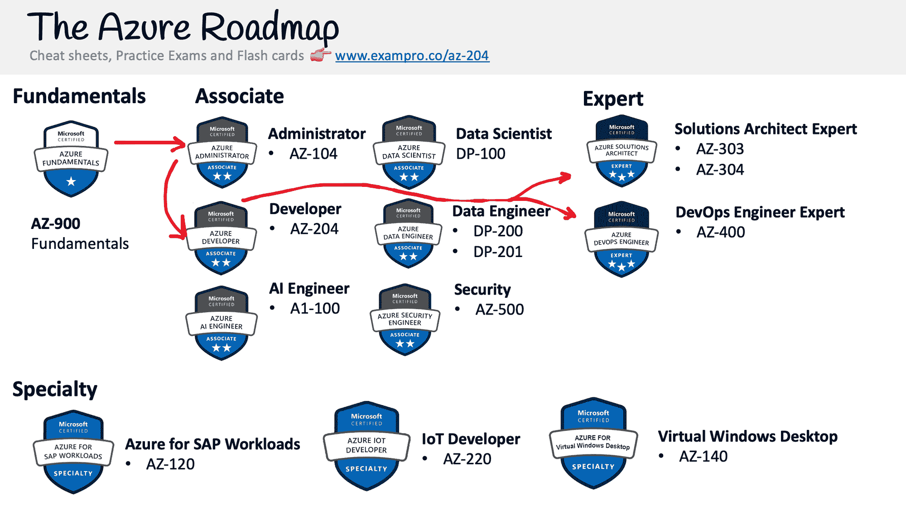

# Azure 开发者认证(AZ-204)-通过这个 13 小时的免费课程考试

> 原文：<https://www.freecodecamp.org/news/azure-developer-certification-az-204-pass-the-exam-with-this-free-13-5-hour-course/>

通过完成这个 13 小时的免费课程，你可以了解获得 Azure 开发者认证所需的一切。

## **什么是微软 Azure 开发者助理？**

Microsoft Azure Developer Associate(通常称为 AZ-204)是一项 Microsoft Azure 认证，专注于在 Azure 云服务基础上构建 web 应用程序。

Azure 开发人员高度赞扬 Azure 管理员(Az-104)，并且通常是人们在进行专业认证之前将进行的下一个认证。

微软 Azure 与其他云服务提供商(CSP)的不同之处在于，它更依赖于其开发者工具来与服务进行交互，并且在许多情况下，没有图形用户界面(GUI ),因此您必须直接与 API 进行交互。

完成 Azure Developer 和 Azure Administrator 的学习将为工程师提供全面的知识，以便更好地利用 Azure。

Azure 开发人员和 Azure 管理员通常会获得专家认证。

## Microsoft Azure Associate 认证面向谁？

此 Azure 认证适用于以下场景:

*   你是**网络应用程序开发人员**,希望学习云技术或转型为云开发人员
*   你是一名**云开发者**或**云工程师**，需要将 Azure 服务集成到你的应用程序中或将你的应用程序部署到 Azure。
*   你需要学习很多关于 Azure 函数的知识来构建无服务器工作负载

## **************概述********Azure 开发者****** 联想

Azure 开发者涵盖了以下内容:

*   将 Web 应用程序部署到 Azure 的多种方式
*   对 Azure 函数的深入探究
*   应用集成服务概览
*   使用 Azure CLIs 和 SDK 与 Azure 服务进行编程交互的大量实践

## ******如何获得认证？******

你可以通过支付考试费并在与微软 Azure 合作的考试中心参加考试来获得认证。

微软 Azure 与 Pearson Vue 和 PSI Online 合作，它们在世界各地都有考试中心网络。他们提供现场考试和在线考试。如果有机会，我建议你亲自参加考试。

微软在 Pearsue Vue 上有一个门户页面，你可以在那里注册和预订考试。

那个考试费是****165 美金**。**

## ********我可以简单的看视频通过考试吗？********

不，Azure 认证具有挑战性，因为考试旨在测试您的实践知识。因此，在你自己的 Azure 账户中执行所有的 Azure 实验室是很重要的。

强烈建议在参加真正的考试之前进行模拟考试。

ExamPro 有多个[付费模拟考试](https://exampro.co/gcp-cdl)以及其他学习材料，以增加您通过考试的机会。

前往 freeCodeCamp 的 YouTube 频道开始学习 13.5 小时的课程。

[https://www.youtube.com/embed/jZx8PMQjobk?feature=oembed](https://www.youtube.com/embed/jZx8PMQjobk?feature=oembed)