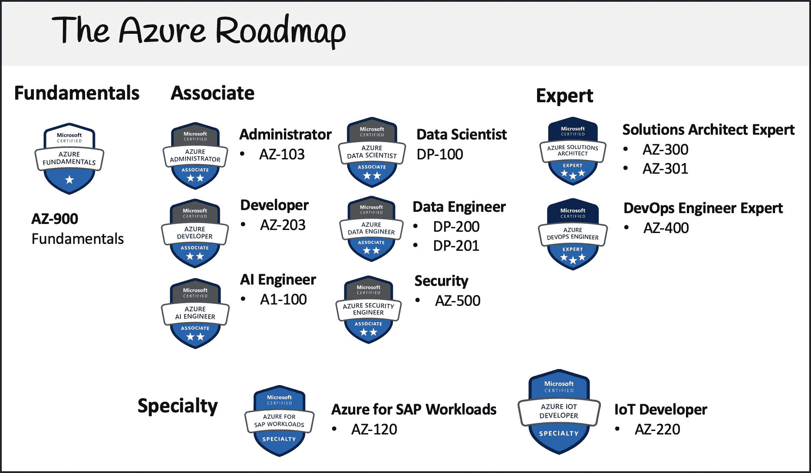

# Azure 基础认证(AZ-900)-通过这个 3 小时的免费课程考试

> 原文：<https://www.freecodecamp.org/news/azure-fundamentals-course-az900/>

# 微软 Azure 是什么？

微软 Azure 是云服务提供商。云服务提供商(CSPs)是一家提供多种云服务的技术公司。Azure 列出了超过 600 种云服务产品，从计算到存储到数据库到机器学习。

Azure 是仅次于亚马逊网络服务(AWS)的第二大流行云平台。尽管如此，许多老牌或大型科技公司都在拥抱这两种云平台。这可能是因为 Azure 能够在成本、利基云产品、易于集成以及开发者对微软软件的熟悉程度上进行竞争。

与 AWS 和谷歌云等其他云平台相比，Azure 有三个竞争优势。

## **优势#1: Azure 和微软在开发者工具上投入了大量资金**

微软开发了迄今为止最流行的代码编辑器 Visual Studio Code。

他们还收购了 GitHub，并将其功能直接移植到 Azure 中。

微软还拥有《我的世界》，并把它作为一种工具，让年轻的开发者学习编程和云计算。

## **优势 2:微软活动目录**

许多公司都投资了 Active Directory 来控制对软件和工作站的访问。现在，他们可以轻松地将其扩展到 Azure 云，而不必学习新的访问管理工具。

当你想向大公司销售软件时，购买的一个普遍要求是用微软 Active Directory 进行单点登录，Azure 在这里有家乡优势。

## **优势#3:机器学习和人工智能**

我认为 AWS 在人工智能和人工智能方面有更好的产品，但 Azure 在使其产品更符合科技公司的口味方面做得更好。

Azure 将他们的人工智能服务划分为许多小型孤立的服务，并且他们拥有 Associate 层的基于数据的角色的认证。这使得有抱负的开发人员更容易获得这些角色。

# **Azure 基金会认证**

Azure 基础认证是微软 Azure 的入门级云认证。它通常被称为其课程代码，AZ-900。

考试涵盖以下领域:

*   云概念
*   Azure 核心服务
*   安全性、隐私、合规性和信任
*   定价和支持

平均学习时间——即使对于刚接触云开发的人来说——也只有一周。

如果您已经获得了 AWS 云认证从业者(AWS 的入门级认证)，也可以进行一些知识传授。但是不要指望不学习就能通过 AZ-900。

微软和 Azure 以前有特定于服务的认证，但他们已经改变为基于角色的认证(基于职位的认证)。

以下是所有基于 Azure 角色的可用认证:

*   天蓝色基础(AZ-900)
*   Azure 管理员(AZ-103)
*   Azure Developer (AZ-203)
*   Azure 人工智能工程师(AI-100)
*   Azure 数据科学家(DP-100)
*   Azure 数据工程师(需要 DP-200 和 DP-201)
*   Azure Security (AZ-500)
*   Azure 解决方案架构师专家(需要 AZ-300 和 AZ-301)
*   Azure DevOps 工程专家(AZ-400)
*   面向 SAP 工作负载的 azure(Az-120)
*   Azure 物联网开发者(Az-220)

## 如何获得认证？

您可以通过支付考试费，并在与 Microsoft Azure 合作的考试中心参加考试来获得认证。

微软 Azure 与 Pearson Vue 合作，Pearson Vue 是一个遍布全球的考试中心网络。Pearson Vue 允许您亲自或在线参加考试。要参加网上考试，你需要确保你有一个安静、整洁的房间和一个正常工作的网络摄像头。

微软在 Pearsue Vue 上有一个门户页面，你可以在那里注册和预订考试。

考试费 **$99 美金**。

## 我可以简单的看视频通过考试吗？

对于入门级的认证，是的，如果你已经有了技术背景，仅仅看视频也是有可能通过的。

对于从助理级别开始的更难的认证级别，有必要使用第三方提供商的付费实践考试。

考试有 **40 到 60** 道题，时间线为 **1 小时**。

及格分数是 70%左右。

对于大多数刚接触云开发的人来说，第一次实践考试的分数是 40%，第二次是 65%，第三次是 85%。

我会说得分 90%以上没必要。如果你在 75-85%的范围内，你就可以参加考试了。

如果您打算使用付费的练习考试，请考虑使用 [Exam Pro 的练习考试](https://www.exampro.co/az-900)，因为资金将直接用于帮助我制作更多免费的云课程。

# 免费的 Azure 基础视频课程

我的课程将永远免费。它也是无广告的。

这个免费课程将近 3 个小时。它包括动手练习。你可以跟随并设置你自己的 Azure 云帐户。

我们将一起探索网络、计算、存储和数据库服务。

您可以免费创建一个 Azure 云帐户。您必须提供有效的信用卡来完成注册。Azure 为新帐户提供 30 天 200 美元的信用点数。如果您在免费层或提供的 Azure 点数之外使用，可能会被收费。这就是说，免费订阅帐户有许多限制，以帮助您避免超支和浪费。

如果你是学生，你可以用你的学生邮箱注册，申请学生权限。学生不需要信用卡，微软给你 100 美元的信用，他们的帐户是沙盒，这意味着你永远不会被计费，除非你选择离开沙盒。

在课程的最后，我会告诉你如何预约考试。

好了——现在你知道了开始 Azure 云认证之旅所需的一切。

前往 freeCodeCamp 的 YouTube 频道[开始学习完整的 3 小时课程](https://www.youtube.com/watch?v=NKEFWyqJ5XA)。