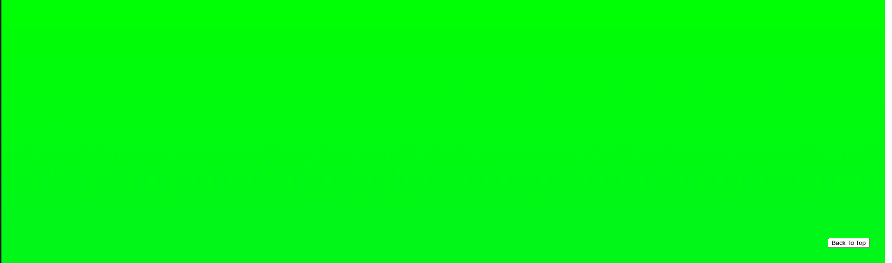
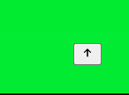
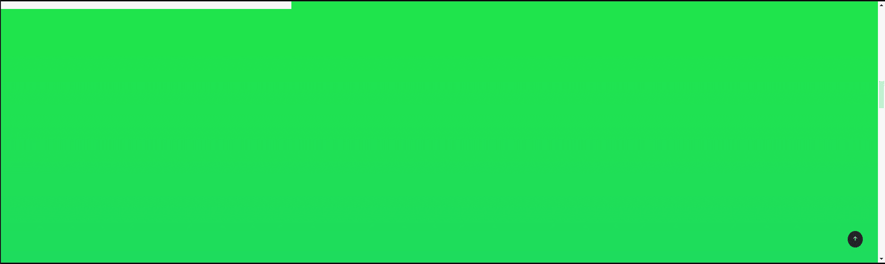
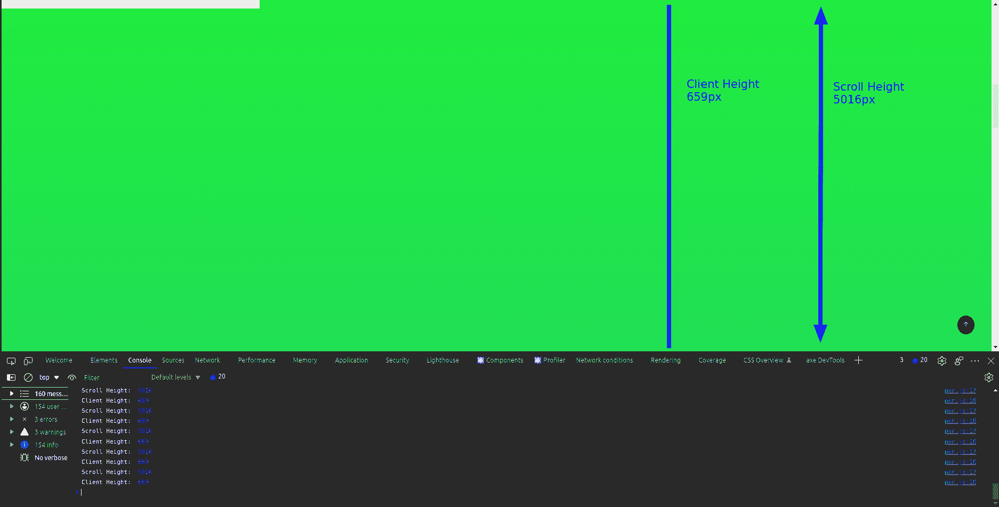

# 如何用 HTML、CSS 和 JavaScript 制作一个返回顶部按钮和页面进度条

> 原文：<https://www.freecodecamp.org/news/back-to-top-button-and-page-progressbar-with-html-css-and-js/>

你可能在很多网站的右下角看到过一个“返回页首”按钮。点击那个按钮会把你带回到页面的顶部。

这对于任何网站来说都是一个很棒的特性，今天我们将看看如何只用 HTML、CSS 和 JavaScript 来构建它。

我们还将看看如何添加一个页面进度条，一个在顶部的进度条，它会随着我们向下滚动而增加，随着我们向上滚动而减少。

请注意，您可以将它添加到任何网站，无论是现有的网站还是您刚刚开始工作的网站。唯一的要求是，网站应该有足够的内容(或足够大的身体高度)是可滚动的，否则就没有意义添加这个。

这是我们将要构建的代码笔(滚动查看神奇之处):

[https://codepen.io/anishde12020/embed/preview/poWPPoe?default-tabs=js%2Cresult&height=300&host=https%3A%2F%2Fcodepen.io&slug-hash=poWPPoe](https://codepen.io/anishde12020/embed/preview/poWPPoe?default-tabs=js%2Cresult&height=300&host=https%3A%2F%2Fcodepen.io&slug-hash=poWPPoe)

Back To Top Button and Page Progress bar with HTML, CSS and JS CodePen

## 如何为你的网站制作一个返回顶部按钮

首先，我要把网站的主体做得很大，这样就可以滚动了:

```
body {
  height: 5000px;
}
```

Document body made scrollable by setting a height of 5000px

我还将为文档主体添加一个线性渐变，这样我们就可以知道文档正在滚动:

```
body {
  height: 5000px;
  background: linear-gradient(#00ff04, #09aad3);
}
```

让我们快速地将“返回顶部”按钮添加到标记中:

```
<button class="back-to-top">Back To Top</button> 
```

Back to top button with a class for base styles

让我们也这样放置按钮:

```
.back-to-top {
  position: fixed;
  right: 2rem;
  bottom: 2rem;
}
```

Styles for back to top button

在这里，我们给它一个固定的位置，这样即使文档被滚动，它仍然在视图中。我们也从屏幕的底部和右侧推动它`2rem`。

我们的文档现在应该是这样的:



Document with a gradient background and a fixed button and the bottom right corner that says "Back To Top"

现在，是时候进行有趣的部分了——添加逻辑。

### 如何在滚动时只显示返回顶部按钮

现在，我们不希望“返回顶部”按钮一直可见——比如当用户位于页面顶部时。所以我们要有条件地展示它。

对于这个例子，我们只在用户滚动了至少 100 个像素时才显示它。

首先，每当用户打开站点时，我们需要隐藏按钮。我们还需要确保添加这个样式，与按钮的基本样式分开，因为按钮需要在滚动中显示。

HTML:

```
<button class="back-to-top hidden">Back To Top</button>
```

Back To Top button with hidden class and base styles

CSS:

```
.hidden {
  display: none;
}
```

Hidden class with display none

下面是有条件地显示按钮的代码:

```
const showOnPx = 100;
const backToTopButton = document.querySelector(".back-to-top")

const scrollContainer = () => {
  return document.documentElement || document.body;
};

document.addEventListener("scroll", () => {
  if (scrollContainer().scrollTop > showOnPx) {
    backToTopButton.classList.remove("hidden")
  } else {
    backToTopButton.classList.add("hidden")
  }
})
```

Code to show/hide the button conditionally

在这里，`scrollContainer`函数返回`document.documentElement`，它只不过是我们文档的 HTML 元素。如果不可用，则返回`document.body`元素。

接下来，我们将向文档中添加一个事件侦听器，它将在滚动时触发回调函数。我们从各自的`scrollContainer`中得到的`scrollTop` ( [MDN Reference](https://developer.mozilla.org/en-US/docs/Web/API/Element/scrollHeight) )值只不过是该元素从顶部开始滚动的像素数。

这里，当该值高于我们设置的`showOnPx`值，即`100px`时，我们从按钮中移除隐藏的类。如果不是这样，我们将该类添加到按钮中(当用户手动向上滚动时特别有用)。

现在，让我们研究每当用户单击按钮时滚动到顶部的逻辑。

### 每当用户单击“返回顶部”按钮时如何滚动到顶部

让我们为此快速编写一个函数:

```
const goToTop = () => {
  document.body.scrollIntoView();
};
```

`goToTop` function

函数的作用是:`scrollIntoView()` ( [MDN Reference](https://developer.mozilla.org/en-US/docs/Web/API/Element/scrollIntoView) )滚动页面，将被调用的元素显示出来。这里我们在主体上调用它，这样页面就会滚动到顶部。

现在，我们需要在单击“返回到顶部”按钮时调用该函数:

```
backToTopButton.addEventListener("click", goToTop)
```

Calling `goToTop()` on click of the back to top button

就是这样！我们已经成功地将“返回页首”功能添加到我们的网站中。

### 如何使卷轴流畅

现在，回到顶端滚动是相当苛刻的。让我们看看如何使它更平滑。我们可以通过将`behaviour`作为`smooth`传递给`scrollIntoView()`函数来做到这一点。

```
const goToTop = () => {
  document.body.scrollIntoView({
    behavior: "smooth",
  });
};
```

Making the scroll smoother

就是这样！现在滚动很好，很流畅。

### 如何设计“返回顶部”按钮的样式

现在,“返回顶部”按钮是一个简单的 HTML 按钮，带有一些文本——看起来很丑。所以让我们来设计一下。

在此之前，我们将使用 SVG 替换文本，所以让我从 [HeroIcons](https://heroicons.com/) 中快速抓取一个:

```
<button class="back-to-top hidden">
  <svg

    class="back-to-top-icon"
    fill="none"
    viewBox="0 0 24 24"
    stroke="currentColor"
  >
    <path
      stroke-linecap="round"
      stroke-linejoin="round"
      stroke-width="2"
      d="M7 11l5-5m0 0l5 5m-5-5v12"
    />
  </svg>
</button>
```

Adding a SVG icon instead of text to the Back To Top Button

我们给图标一个名为`back-to-top-icon`的类。这一点很重要，因为图标不是马上可见的，所以需要进行设计才能可见。

```
.back-to-top-icon {
  width: 1rem;
  height: 1rem;
  color: black;
}
```

Styling the Back To Top Button's icon to make it visible

我们的按钮现在应该是这样的:



Button with a styled SVG icon

按钮看起来还是很丑，所以我们来设计一下:

```
.back-to-top {
  position: fixed;
  right: 2rem;
  bottom: 2rem;
  border-radius: 100%;
  background: #141c38;
  padding: 0.5rem;
  border: none;
  cursor: pointer;
}
```

Styling the button to make it look good

现在，我们的按钮中的向上箭头不可见，让我们将其颜色改为更浅的颜色，这样它就可见了:

```
.back-to-top-icon {
  width: 1rem;
  height: 1rem;
  color: #7ac9f9;
}
```

Updated styles for the Back to Top button arrow icon

我们还可以添加一个悬停效果，让它更好一点:

```
.back-to-top:hover {
  opacity: 60%;
}
```

Adding some hover styles to the button

现在，我们的按钮应该是这样的:


Styled Back to Top Button

### 如何让按钮的输入更流畅

每当我们滚动时，这个按钮似乎不知从哪里冒出来。让我们通过添加一个过渡来改变这种行为，而不是改变显示，我们将改变它的不透明度:

```
.back-to-top {
  position: fixed;
  right: 2rem;
  bottom: 2rem;
  border-radius: 100%;
  background: #7ac9f9;
  padding: 0.5rem;
  border: none;
  cursor: pointer;
  opacity: 100%;
  transition: opacity 0.5s;
}
```

Adding a transition to the opacity of the button

```
.hidden {
  opacity: 0%;
}
```

Setting hidden class to have an opacity of 0%

这也让我们的悬停效果更加流畅。

现在我们来关注一下页面进度条。

## 如何在你的网站上添加页面进度条

我们将使用`div`制作一个进度条。当用户滚动页面时，我们将确定滚动的百分比，并不断增加`width`。让我们先添加`div`，并给它一个类名`progress-bar`:

```
<div class="progress-bar" />
```

Page Scroll Progress Bar Markup

现在我们将为它添加一些样式:

```
.progress-bar {
  height: 1rem;
  background: white;
  position: fixed;
  top: 0;
  left: 0;
}
```

Page Scroll Progress Bar Styles

我们正在修复它，以便当用户滚动时它是可见的。我们也把它放在页面的顶部。

现在，让我们添加设置进度条宽度的 JavaScript:

```
const pageProgressBar = document.querySelector(".progress-bar")
document.addEventListener("scroll", () => {
  const scrolledPercentage =
      (scrollContainer().scrollTop /
        (scrollContainer().scrollHeight - scrollContainer().clientHeight)) *
      100;

  pageProgressBar.style.width = `${scrolledPercentage}%`

  if (scrollContainer().scrollTop > showOnPx) {
    backToTopButton.classList.remove("hidden");
  } else {
    backToTopButton.classList.add("hidden");
  }
});
```

Code to calculate scroll percentage and set progress bar maps

注意，我们使用的是现有的文档滚动事件监听器函数。

这是我们的进度条滚动时的样子:



Page Scroll Progress Bar on Scroll

### 如何计算滚动的百分比

计算滚动百分比实际上很简单。如前所述，`scrollTop` ( [MDN Reference](https://developer.mozilla.org/en-US/docs/Web/API/Element/scrollHeight) )属性是滚动的像素数。

`scrollHeight` ( [MDN Reference](https://developer.mozilla.org/en-US/docs/Web/API/Element/scrollHeight) )是容纳被调用元素的所有子元素所需的最小高度。

最后，`clientHeight` ( [MDN Reference](https://developer.mozilla.org/en-US/docs/Web/API/Element/clientHeight) )是被调用元素的内部高度。

从`scrollHeight`中减去`clientHeight`,因为如果我们不这样做，可见区域也会被考虑在内，所以我们永远不会达到 100%滚动。

为了更好地解释，我整理了这张图表:



Screenshot explaining `clientHeight` and `scrollHeight`

这里，没有箭头的线代表`clientHeight`，它是我们可以看到的内容的高度。带箭头的线代表`scrollHeight`,表示这条线在两个方向上都是连续的。这是容纳所有内容所需的视图高度。

最后，`scrollTop`值除以`scrollHeight`和`clientHeight`的差，我们得到滚动量的十进制值。乘以`100`得到百分比值，我们用它来确定`div`的宽度，也就是进度条上的进度。

## 结论

我希望这篇文章对你有所帮助，并且能够在你的网站上实现返回顶部按钮和页面进度条。

如果你想问我任何事情，一定要在推特上联系我。下一步是在你的网站上实现这一点，并做出你认为合适的改变。

### 资源

*   [本例的代码打开](https://codepen.io/anishde12020/pen/poWPPoe)
*   [MDN 参考为`scrollIntoView()`](https://developer.mozilla.org/en-US/docs/Web/API/Element/scrollIntoView)
*   [MDN 参考为`scrollTop`](https://developer.mozilla.org/en-US/docs/Web/API/Element/scrollTop)
*   [MDN 参考为`scrollHeight`](https://developer.mozilla.org/en-US/docs/Web/API/Element/scrollHeight)
*   [MDN 参考为`clientHeight`](https://developer.mozilla.org/en-US/docs/Web/API/Element/clientHeight)

我目前正在做一个名为 DevKit 的项目，这是一个 PWA，将开发者工具放在一个应用程序中，并提供快速完成工作的方法。一定要去 https://www.devkit.one/看看。