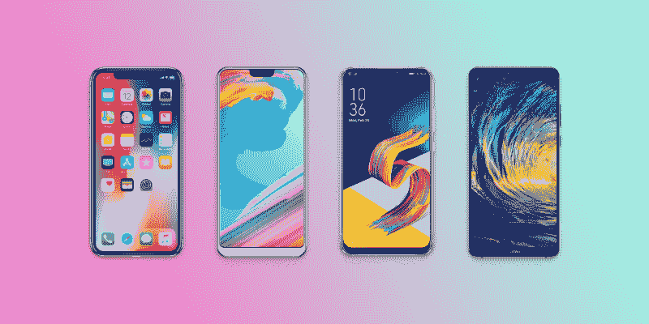
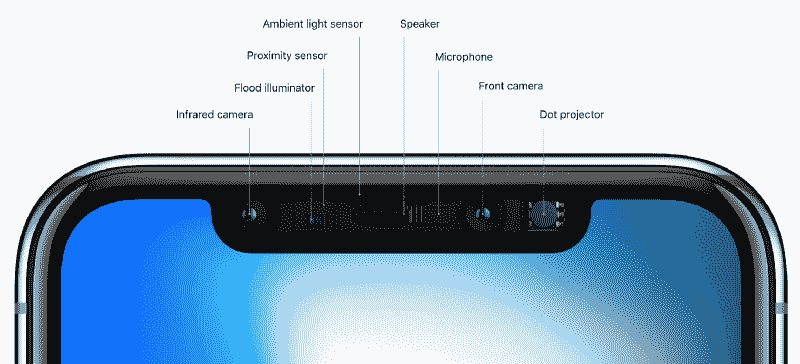
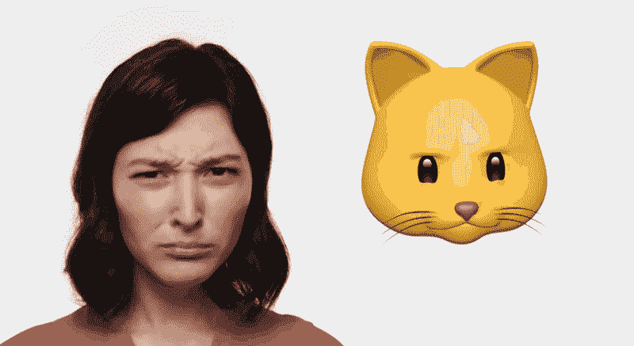
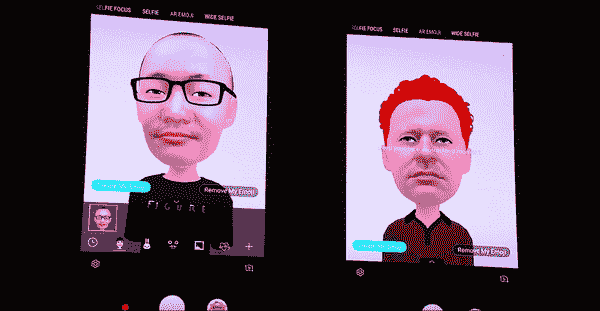

# 糟糕的艺术家复制，伟大的艺术家偷窃——或者说，如何成为一个伟大的设计师

> 原文：<https://www.freecodecamp.org/news/bad-artists-copy-great-artists-steal-or-how-to-become-a-great-designer-a9d0c8aeade1/>

by Teo Yu Siang

# 糟糕的艺术家复制，伟大的艺术家偷窃——或者说，如何成为一个伟大的设计师

在 2018 年世界移动通信大会上，发生了一件奇怪而有趣的事情。不，我不是在说三星的新 S9 和 S9+手机(尽管它们很有趣，好吧)。

我指的是 Android 手机制造商抄袭 iPhone X 最糟糕的功能之一的怪异现象——它的[疯狂](https://www.tomsguide.com/us/iphone-x-notch-design,news-26020.html) [有争议的](https://mashable.com/2017/10/31/iphone-x-notch-different/#ACTV6hDxFsqg)凹槽。

为了提供一些背景信息，2017 年底发布的 iPhone X 采用了全屏设计，除了屏幕顶部的切口，它容纳了新的面部认证方法 FaceID 所需的所有传感器。

最糟糕的是，这个缺口代表了苹果在试图推动全屏设计的同时要求一组传感器进行面部认证的一种妥协。

iPhone X’s notch houses a whole array of sensors that enable FaceID

许多在 MWC2018 发布的新 Android 手机(以及计划在今年晚些时候发布的手机)的屏幕顶部都有一个缺口。华硕的 Zenfone 5、华为的 P20、Oppo 的 R15 和 Ulefone 的 T2 Pro 似乎都加入了这股潮流，并决定采用一流的设计。见鬼，就连 LG 传言中的 G7 也有可能在屏幕上方出现一个镂空的[。](https://www.cnet.com/news/lg-g7-renders-notch/)

如果你需要更多的证据来证明凹口将成为 Android 智能手机的一部分，只需看看 Android P 的测试版，它现在已经增加了对顶部有切口的显示器的官方支持。

最糟糕的部分？这些手机都没有在凹槽中安装额外的传感器来提供准确的面部识别。换句话说，这些凹槽纯粹是 iPhone X 设计的装饰性复制。

这让我想起了史蒂夫·乔布斯广为流传的一句话:

> 好的艺术家临摹，伟大的艺术家偷窃。

对此我想做如下修改，如果只是为了增加一点戏剧性的天赋:

> 糟糕的艺术家复制，伟大的艺术家偷窃

### 抄袭和偷窃的区别

那么抄袭和偷窃有什么区别呢？毕竟，这两种行为听起来同样不道德。

为了理解这句经常被重复的话，让我们追溯到它最早的来源之一。1920 年，著名诗人 T. S .艾略特在一篇关于诗歌的文章中说:

> **不成熟的诗人模仿；成熟的诗人偷窃；糟糕的诗人丑化他们所拿的东西，而好的诗人把它变成更好的东西，或者至少是不同的东西。优秀的诗人把他的盗窃焊接成一个独特的整体感觉，完全不同于它被撕裂的感觉；糟糕的诗人把它扔进没有凝聚力的东西里。**

换句话说，区别在于**意图**。

当你*复制*某物时，你是为了创造相似性而模仿它的特征。另一方面，当小偷闯入你家时，他/她不会偷地垫。你的地垫一文不值。*小偷偷了你的珠宝。*

Copying is mindless and is about creating resemblance; stealing is done with intent and recognizes the value of something else

当你认识到某样东西的价值，并将其应用到你的设计中时，偷窃就发生了。这样做是有目的的，目的是让你的设计比原来更好。而且大多数时候，偷窃还伴随着对你所偷东西的*改进*，哪怕只是为了让它完全符合你自己的设计。

### 不要抄袭。偷窃。

*抄袭*是华硕、华为和 Ulefone 看着 iPhone X，决定他们的新旗舰也将在屏幕顶部有一个缺口。

*复制*是当三星观察到苹果的 animo Ji——苹果在 iPhone X 中内置的一个功能，使其新的 3D 面部识别技术看起来友好有趣——并决定建立自己的 [AR 表情符号](https://techcrunch.com/2018/02/25/samsungs-ar-emoji-taps-creepy-avatars-and-disney-characters-to-compete-with-animoji/),尽管 S9 缺乏实时跟踪 3D 运动的传感器。

Apple’s Animoji humanises facial recognition, a potentially scary piece of technology ([source](https://giphy.com/gifs/producthunt-apple-event-animated-emoji-3ohhwJ2v6v1bHegoKY))

Samsung’s version is… a little less refined ([source](https://youtu.be/8GdA4z9G4Qg))

*偷*另一方面，是谷歌意识到使用双镜头相机系统模拟专业单反相机中发现的浅景深效果的*值*的时候。在[意识到](https://research.googleblog.com/2017/10/portrait-mode-on-pixel-2-and-pixel-2-xl.html)它可以通过使用在单个镜头上捕捉的每个像素的两半*中的微小差异来重现拥有两个镜头的效果后，谷歌接着进行了改进。因此，Pixel 2 和 2XL 手机只有一个摄像头，但在高级算法的帮助下，它们能够再现模拟景深照片。*

*窃取*是当苹果看到 Kinect 的 3D 运动感应技术的前景，并决定[将该技术的改进版本](https://www.theverge.com/circuitbreaker/2017/9/17/16315510/iphone-x-notch-kinect-apple-primesense-microsoft)整合到 iPhone X 中，以实现精确的 3D 面部识别。

*偷*也是日本火车设计师看到了鸟类光滑喙的空气动力学优势，决定[应用](https://99percentinvisible.org/article/biomimicry-designers-learning-natural-world/)这一特性，打造速度更快、噪音更小的子弹头列车。

所以不要抄袭——去偷。

不要仅仅因为设计模式适用于某个产品或服务就盲目地模仿它们。看到所做工作的价值——理解其成功的原因——然后思考如何在应用到设计中时进行改进。

这样，你就能成为一名伟大的设计师。因为你不仅仅是把一个复制的特性扔进你的产品里。相反，你在增加价值，把一个想法变成你自己的。通过这种方式，你的灵感将不仅仅来自于你所在行业的设计——它们将来自于任何地方。