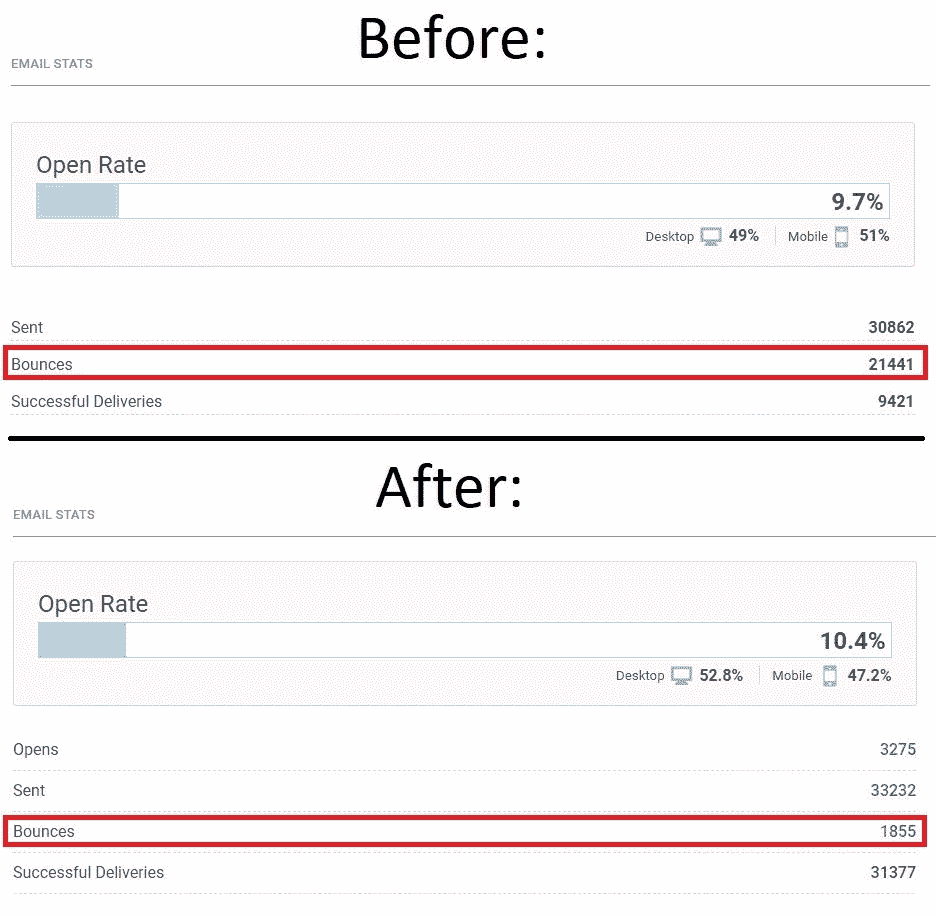
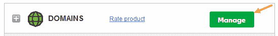
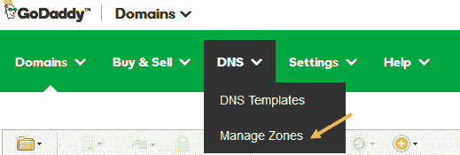
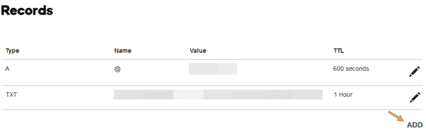
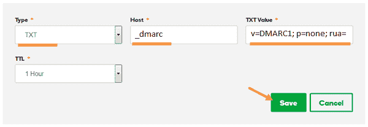
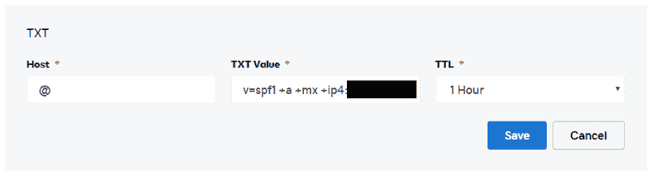
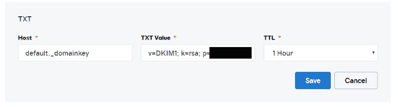
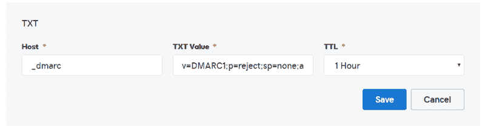

# 停止[营销]电子邮件反弹！如何配置 SPF、DMARC 和 DKIM

> 原文：<https://www.freecodecamp.org/news/bananas-stop-email-bouncebacks-spf-dmarc-dkim/>

**设置要求:**

*   您的域名系统(DNS)编辑器(即注册了电子邮件地址的 GoDaddy Admin)
*   第三方电子邮件管理帐户(电子邮件群发服务[Mailchimp、ConstantContact 等。]、您可能正在使用的附加邮件服务器等。)

您可能正在阅读这篇文章，因为您需要帮助解决刚刚收到的一个错误。此错误可能说明了您的 DMARC 记录以及电子邮件未经验证。最有可能的情况是，你试图用“@gmail.com”或“@yahoo.com”的地址给某人发邮件，或者向类似的免费大型电子邮件提供商发邮件，这些提供商的默认指导方针比你通过自己公司建立的电子邮件服务器更高。

我也在那里，挣扎了很长时间才弄明白——不仅仅是你需要什么，还有如何以正确的方式完成它。

### 我们在配置 SPF、DMARC 和 DKIM 前后的统计数据:

正如您将在下面的图片中看到的，这些实施向我们展示了:

*   在实施之前，跳出率为 70%，总共有 21441 封电子邮件从未进入订户的收件箱。
*   实施后，跳出率仅为 5.6%，降至仅 1855 次跳出率。
*   反弹不仅仅是由于安全问题，一些电子邮件被删除或用户打错了(mail.com 而不是 gmail.com 是一个典型的例子)。

Constant Contact Bounce Statistics, Before & After configuring SPF, DMARC & DKIM.

### 关于实现的重要性已经说得够多了——让我们开始吧！

为了 100%符合电子邮件身份认证，您需要配置 3 样东西:

*   **SPF(发件人策略框架):**用于防止电子邮件伪造(又称欺骗)的框架。欺骗是指有人假装是从您的电子邮件地址发送的。
*   **DKIM(域名密钥识别邮件):**这将允许服务器以你的名义发送电子邮件，同时进行身份验证，以确保确实是你。例如，如果您使用 MailChimp 或 ConstantContact 发送简讯，并声称该简讯来自“john@doecompany.com”，则电子邮件仍将从 MailChimp 或 ConstantContacts 服务器发送。但是，您使用 Blast 电子邮件服务验证了这确实是您，而不是伪装成您的人。**对于企业来说，这是最重要的一点，否则反弹率会很高！**
*   **DMARC(基于域的消息认证、报告和一致性):**也是一种反欺骗机制，将与 SPF 协同工作。拥有其中一个是无效的——你需要两者都得到适当的保护。

DNS 编辑器/ DNS 区域编辑器，GoDaddy 截图示例(首先登录并导航到您的管理仪表板):

GoDaddy Manage Domains Dashboard Screenshot with Arrow pointing at Manage option. (1)

GoDaddy Domains Dashboard Screenshot with the arrow pointing at Manage Zones option. (1)

单击管理区域后，在屏幕中选择需要添加 DNS 条目的域。

GoDaddy DNS Zone Editor Admin Dashboard Screenshot with Arrow pointing on the Add Option. (1)

在右侧记录的底部，您会看到一个“添加”按钮，该按钮会打开以下对话框菜单，您可以在其中分别输入 SPF、DMARC 和 DKIM 条目:

GoDaddy Add DNS Entry Admin Dashboard Screenshot with button pointing at Save button and TXT as type, _dmarc as Host and the required value under TXT Value highlighted. (1)

有关区域编辑器的其他指南，请访问您的域提供商的知识库/支持中心。

### 设置 SPF:

SPF 是最容易设置的。你需要两样东西:

1.  您的 DNS 编辑器(即 GoDaddy 管理门户)
2.  您的电子邮件服务器的 IP 地址

在访问您的 DNS 编辑器(在 CPanel 中也称为 DNS 区域编辑器)之后，您想要创建一个新的 TXT 条目。在这个 TXT 条目中，应该有 3 个可能的字段:主机、TXT 值/值& TTL(生存时间)。您将在这些字段中输入以下内容(一些细节可能会有所不同，**这是基于 GoDaddy 安装**):Host:@ TXT Value:v = sp f1+a+MX+ip4:<您的电子邮件服务器的 IP>~ all TTL:1 小时

GoDaddy DNS Sample TXT Entry for the SPF settings as described above.

**这些设置的解释/含义:**

@ '是 GoDaddy 中的一个名称，指的是您正在工作的领域。因此，如果你在“doecompany.com”中工作，你可以用“doecompany.com”替换“@”，结果将是相同的。但是，在 GoDaddy 的情况下，最好使用“@”符号。

<ip of="" your="" e-mail="" server="">是发送电子邮件的 IP 地址。这不一定是实际网站所在的 IP 地址。</ip>

**+a:** 包含一条记录

**+mx:** 包括邮件服务器记录

**+ip4:** 指定来自哪个 IPv4 服务器

**~all:** 先前申报记录之外的记录将失效。

TTL = 1 小时(或 3600 秒):生存时间，或它应该过期的频率。如果你要更换电子邮件服务器，你会很高兴只有一个小时不被认证的最大间隔。

### 设置 DKIM:

这是三个步骤中最繁琐的一个，也是最关键的一个。您将对代表您的电子邮件名称(即“john@doecompany.com ”)发送的第三方进行身份验证。

我目前设置了 2 个 DKIMs:

1.  对于我的实际邮件服务器，它与我的实际网站位于不同的服务器上(这在企业环境中更常见)。
2.  对于我的电子邮件简讯 blast 服务提供商(在这种情况下是 ConstantContact，很可能是 Mailchimp 或其他人)。

对于这两种情况，你的跑腿工作是一样的。您必须联系您的邮件服务器或第三方电子邮件发送服务的电子邮件支持，让他们为您的帐户安装 DKIM。

这完全不由您控制，通常需要 1-2 天来完成这项任务。基本上，他们会在服务器上注册并安装至少 1024 位编码的 RSA(2048 更好)。

在他们设置好之后，他们会给你发送一个公钥，你将在下一步中使用它来设置你的 DKIM 记录。

就像 SPF & DMARC 记录一样，您将访问您的 DNS 编辑器(在 CPanel 中也称为 DNS 区域编辑器)，并创建一个新的 TXT 条目。在这个 TXT 条目中，应该有 3 个可能的字段:主机、TXT 值/值& TTL(生存时间)。您将在这些字段中输入以下内容(一些细节可能会有所不同，这是基于 GoDaddy 安装，电子邮件作为时事通讯服务托管在 inmotionhosting.com 和 ConstantContact 上)。请记住为每个 DKIM 记录创建一个单独的条目:Host: <provided by="" your="" party="">。_domainkeyTXT 值:v = DKIM1k = rsaTTL: 1 小时</provided>

务必不要在“=”符号后留下任何空格。

GoDaddy DNS Sample TXT Entry for the DKIM settings as described above.

**这些设置的解释/含义:**

主机可以是名称或号码，并且对于第三方来说是真正唯一的。当以您的名义发送电子邮件时，该电子邮件的标题中将包含该名称或号码。这是它将在你的域名下寻找的记录。

用外行人的话来说，在我们的例子中，接收方服务器将进入“doecompany”的 DNS 记录，并查看第三方声称真实的内容是否会在那里。只有当公钥与他们服务器上的密钥正确验证时，电子邮件才会被发送出去。

**v=DKIM1:** 简单地指定 DKIM 的版本，用于进一步阐明要查找的内容。

**k=rsa:** RSA 是最典型的用作密钥(k)的一种。您的第三方可能会选择使用其他内容。但是 2048 位加密的 RSA 是目前最安全的选择。1024 位也不错。

**p= <公共密钥> :** 代替“<公共密钥>，您将获得一个 1024 位或 2048 位的字符串，该字符串由看似随机的文本和数字或其他适合于第三方决定使用的任何加密的值组成。

TTL = 1 小时(或 3600 秒):生存时间，或它应该过期的频率。如果你要更换电子邮件服务器，你会很高兴只有一个小时不被认证的最大间隔。

### 设置 DMARC:

**提醒:**为了让 DMARC 正常工作，您必须先设置 SPF 和 DKIM。因为 DMARC 验证 SPF & DKIM 设置以及发送者是否适合这些设置并且不是欺骗者。如果没有设置 SPF & DKIM，DMARC 将无法工作，并将导致邮件被拒绝。

就像 SPF 记录一样，您将访问您的 DNS 编辑器(在 CPanel 中也称为 DNS 区域编辑器)，并创建一个新的 TXT 条目。在这个 TXT 条目中，应该有 3 个可能的字段:主机、TXT 值/值& TTL(生存时间)。您将在这些字段中输入以下内容(某些细节可能会有所不同，这是基于电子邮件托管在 inmotionhosting.com 上的 GoDaddy 安装):Host:_ dmarcxt Value:v = dmar C1；p =拒绝；sp =无；adkim = r；aspf = r；pct = 100fo = 0；rf = afrfri=86400TTL: 1 小时

GoDaddy DNS Sample TXT Entry for the DMARC settings as described above.

**这些设置的解释/含义:**

主机被声明为“_dmarc”，因为在 GoDaddy 中，它会自动添加“. johndoe.com”作为子域。这意味着当一封电子邮件被发送出去时，DMARC 将总是根据您的域在那个选择器下被检查。如果没有正确设置为' _dmarc '，电子邮件服务器将无法找到您的 dmarc 条目，并且会自动拒绝您的电子邮件，因为它们认为没有条目。

**v=DMARC1:** 声明 DMARC 的版本，以澄清正在使用的内容，并使认证更加合法。

**p=reject:** 如果邮件与 DMARC 记录不匹配，将被收件人邮件服务器拒绝。

**sp=none:** 不检查子域和主域的设置是否一致；这是可选的。

**adkim=r:** 对 dkim 标识符设置是严格(s)还是宽松(r)；默认为“放松”。

**aspf=r:** 对于 spf 标识符设置是严格(s)还是宽松(r)；默认为“放松”。

**pct=100:** 百分之百的电子邮件都会受到 DMARC 的影响。仅 1 到 100 之间的整数值。较小的集合只对测试有意义；出于安全考虑应该是 100。

**fo=0:** 如果 SPF & DKIM 未能通过认证，则创建 DMARC 错误报告。0 是默认值。其他的是 1、d 和 s。1 是如果任何一个失败，生成一个记录。如果签名未通过评估。如果 SPF 评估失败。

**rf=afrf:** 消息失败报告的格式。在撰写本文时，afrf 是唯一受支持的值。

**ri=86400:** 向发件人发送报告间隔了多少秒。86400 是默认值，即 24 小时或 1 天。许多主要的邮箱提供商，如 Gmail、Yahoo 等。每天会发送多份报告。

TTL = 1 小时(或 3600 秒):生存时间，或它应该过期的频率。如果你要更换电子邮件服务器，你会很高兴只有一个小时不被认证的最大间隔。

这就是如何正确认证你的电子邮件。我希望这为你消除了一些神秘感和复杂性。你将不再从你的邮件守护进程中得到那些麻烦的回扣！

* * *

**作者:**

安德里亚斯·洛佩斯—[https://www.linkedin.com/in/andreaslopez/](https://www.linkedin.com/in/andreaslopez/)

**编辑:**

斯特凡·普帕瓦茨—[https://www.linkedin.com/in/stevan-pupavac/](https://www.linkedin.com/in/stevan-pupavac/)

弗雷德里克·阿尔坎塔拉—[https://www.linkedin.com/in/frederick-alcantara/](https://www.linkedin.com/in/frederick-alcantara/)

**来源:**

1.  GoDaddy 截图由 dmarc analyzer . com:[https://www . dmarc analyzer . com/dmarc/dmarc-record-setup-guides/dmarc-setup-guide-go daddy/](https://www.dmarcanalyzer.com/dmarc/dmarc-record-setup-guides/dmarc-setup-guide-godaddy/)