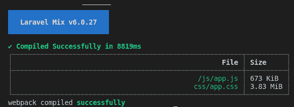
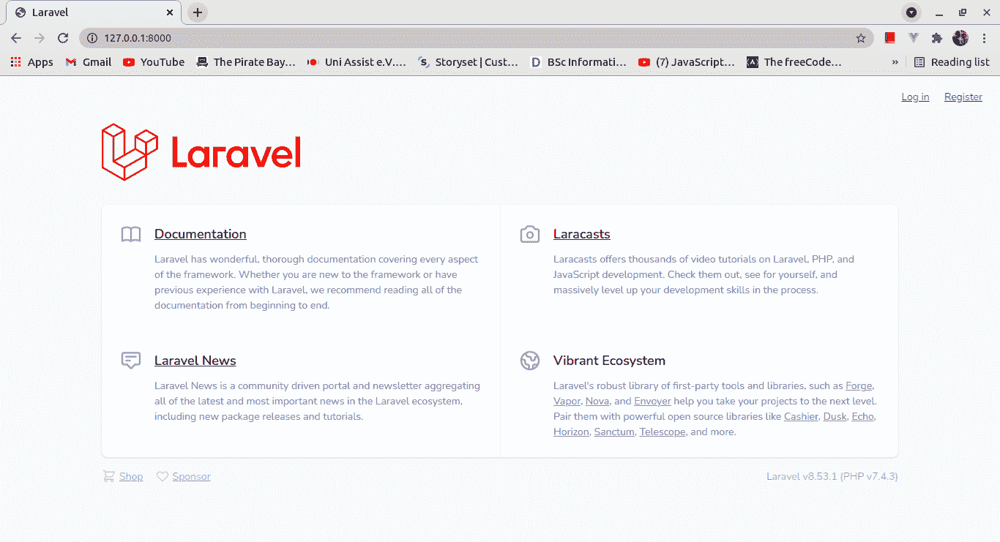
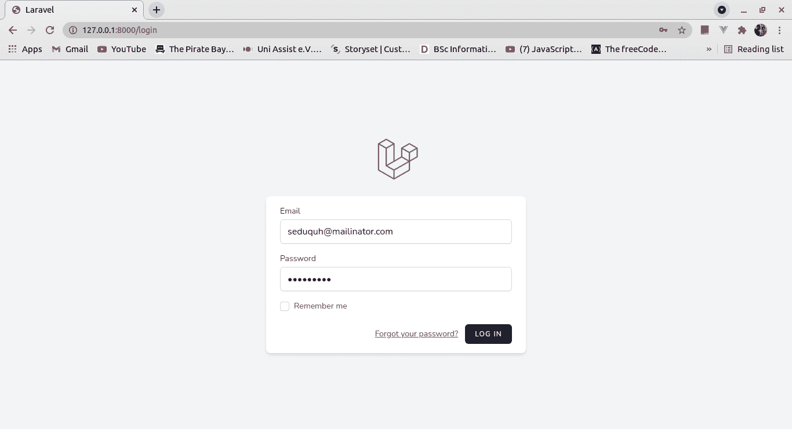
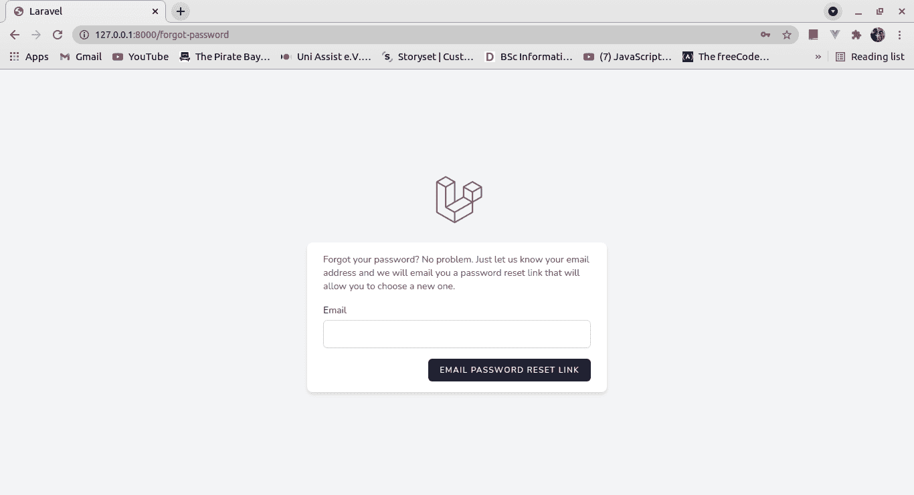
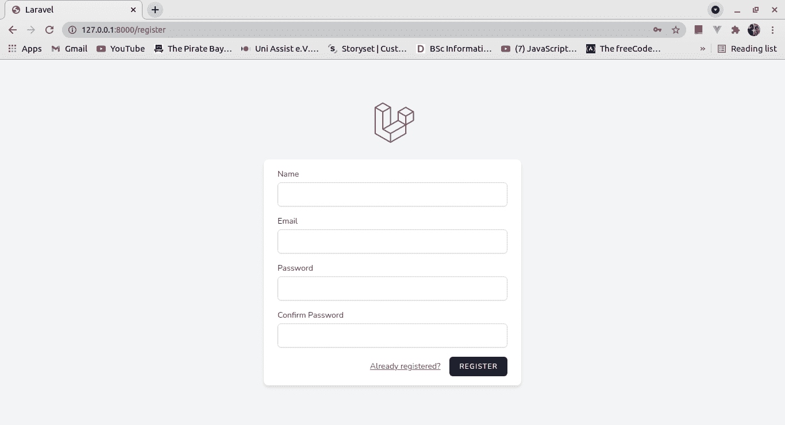
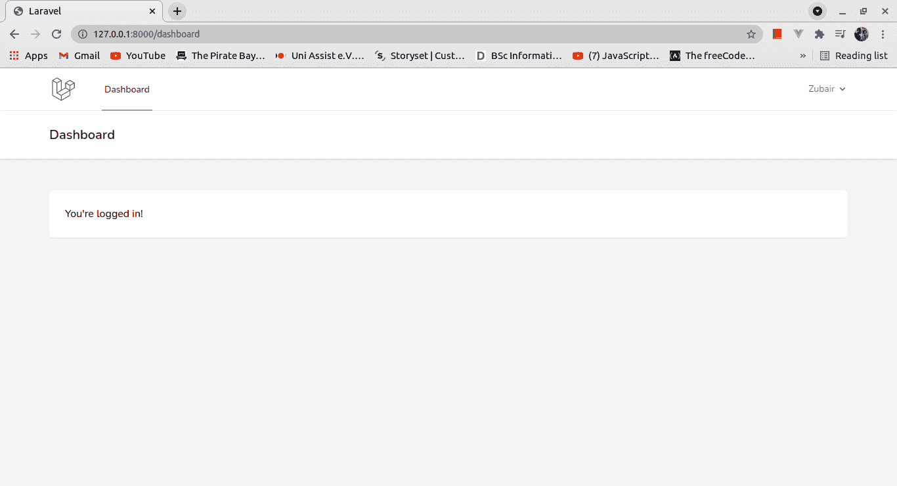

# Laravel 认证教程——如何在 Laravel 8 中设置基本认证

> 原文：<https://www.freecodecamp.org/news/basic-authentication-in-laravel8-using-laravel-breeze/>

如今，身份验证是 web 应用程序中的一个重要特性和基本要求。开发人员花费大量时间为他们创建的每个应用程序构建身份验证模块。

但是这种手动方法会很累，而且有点低效。这才是 Laravel 真正出彩的地方。它与 Laravel Breeze 一起，让您可以担心核心应用程序功能，并为您处理认证。

在我们开始之前，我假设如果你正在阅读这篇文章，你知道一些基本的 PHP。这很可能是您的第一篇 Laravel 文章，但是 PHP 知识将会派上用场。

## 什么是拉勒维尔微风？

你可能想知道——这是什么，它有什么作用？[来自文件](https://laravel.com/docs/8.x/starter-kits):

> Laravel Breeze 是 Laravel 所有认证功能的最小化、简单实现，包括登录、注册、密码重置、电子邮件验证和密码确认。

Laravel Breeze 会自动为您的应用程式搭建路由、控制器和视图，让您注册和验证应用程式的使用者。

在 Laravel 的旧版本中，还有其他方法可以轻松地生成认证框架。

*   在 Laravel 7 中，有一个`[laravel/ui](https://laravel.com/docs/7.x/authentication)`。与 Laravel Breeze 不同，它使用了 Bootstrap 而不是 Tailwind CSS。
*   在 6 之前的版本中，您可以使用`php artisan make:auth`生成支架。

因此，Laravel Breeze 基本上只是对以前版本的最新开发。

使用 Laravel Breeze 可以节省大量开发时间，您的应用程序会变得不那么容易出错。这是因为 Laravel Breeze 生产的支架已经被 Laravel 专业人士证实是最好的。

在我们开始之前，您应该已经安装了 composer 和 Laravel 才能继续。你可以在这里安装作曲家[，在这里](https://getcomposer.org/download/)安装拉勒维尔[。让我们开始吧。](https://laravel.com/docs/8.x/installation)

## 如何安装 Laravel Breeze

```
composer require laravel/breeze --dev 
```

安装完成后，您应该运行`breeze:install`命令将认证视图、路由、控制器和其他资源发布到您的应用程序。

Laravel Breeze 通过将其代码发布到您的应用程序，让您完全控制您的功能和实现。

```
php artisan breeze:install 
```

运行此命令后，您应该会看到文件的一些更改。这里有一些你应该注意的:

*   它创建了认证控制器(相当多)来处理注册、登录(认证)和注销、密码确认、电子邮件验证以及密码重置和更新(它甚至发送电子邮件)。
*   它还使用 Tailwind CSS 创建了匹配所有控制器动作的视图。
*   有一个控制面板视图，用户在成功认证后会被重定向到该视图。
*   它已经修改了登录页面，以包括到身份验证页面的链接。
*   它还创建了 CSS 和 JavaScript 文件，这些文件需要在以后进行编译。
*   现在有一些与认证相关的路由存储在`auth.php` routes 文件中。
*   测试也包含在`tests`目录中。

## 如何编译静态资产

我们希望缩小分别在 resources 文件夹的`css`和`js`文件夹中生成的 CSS 和 JavaScript 文件。

这将给我们带来更快的加载时间，也将减少 HTTP 请求的数量(因为所有的 JavaScript 和 CSS 文件都被编译成一个文件)。

此外，由于 Laravel 允许您自由使用自己的 CSS 预处理器，您会希望将代码编译成浏览器能够解释的内容。

现在，我们需要编译静态资产来完成安装。为此，请运行以下命令:

```
npm install
npm run dev 
```

请记住，这可能需要一段时间，取决于你的网速。



Successful Compilation

还要注意，在你的`public`文件夹中，现在有了`css`和`js`目录，它们保存了可以在你的代码中使用的编译文件。

## 如何配置数据库和迁移

最后一步，您需要配置您的数据库并运行迁移，因为您从用户那里获得的任何数据目前都无法存储。

```
DB_CONNECTION=mysql
DB_HOST=127.0.0.1
DB_PORT=3306
DB_DATABASE=breeze
DB_USERNAME=root
DB_PASSWORD= 
```

```
php artisan migrate 
```

现在您已经设置好了，可以运行您的应用程序了:

```
php artisan serve 
```

前往 [http://localhost:8000](http://localhost:8000) 查看您的应用程序运行情况。



Landing page

您可以看到所有不同的页面，如登录页面、忘记密码页面、注册页面和仪表板:



Login Page



Forgot Password Page



Register Page



Dashboard

现在你知道了。您已经成功安装和设置了 Laravel 和 Laravel Breeze。🎊

## 如何添加前端框架

Laravel Breeze 的优势不仅限于刀片模板。Laravel 允许您构建具有这些优点的单页面应用程序(spa)。

Laravel Breeze 允许您使用 inertia.js(由 Vue 或 React 提供支持)，如果您愿意，您可以轻松安装它来生成这些脚手架。

如果您已经安装了没有前端框架的 Laravel Breeze，则需要 Laravel Breeze 重新编写之前生成的验证文件(主要是刀片文件)才能使用该框架。

```
php artisan breeze:install vue

// Or
php artisan breeze:install react 
```

不要忘记再次编译您的资产。

```
npm install && npm run dev 
```

## 摘要

Laravel 帮助您节省时间，同时也帮助您保持良好的代码质量。它允许您使用 Laravel Breeze 搭建身份验证视图、控制器和路由。

你可以在这里找到这篇文章的所有代码。

如有任何问题或相关建议，欢迎联系我分享。

要阅读更多我的文章或关注我的工作，您可以在 [LinkedIn](https://www.linkedin.com/in/idris-aweda-zubair-5433121a3/) 、 [Twitter](https://twitter.com/AwedaIdris) 和 [Github](https://github.com/Zubs) 上与我联系。又快又简单，还免费！