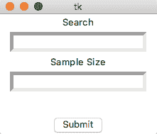
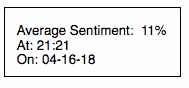
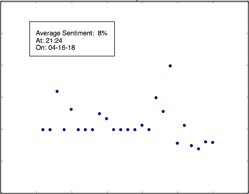
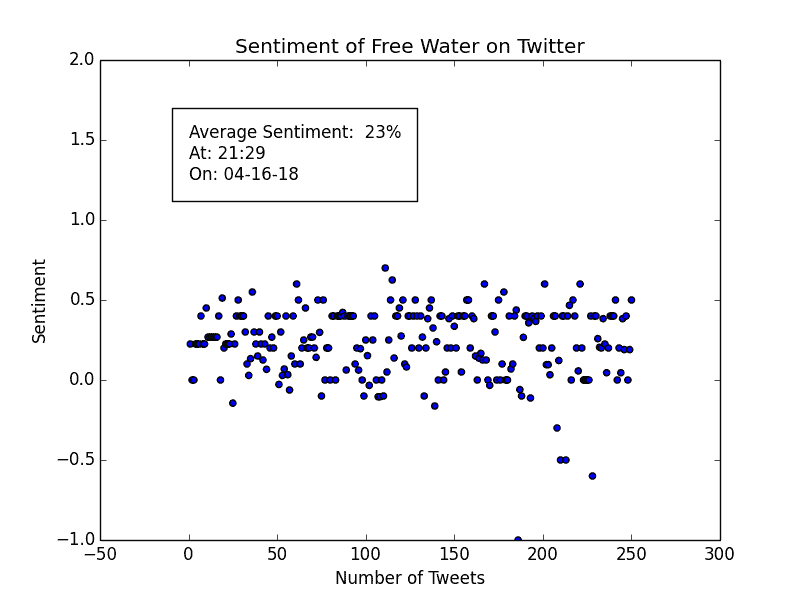
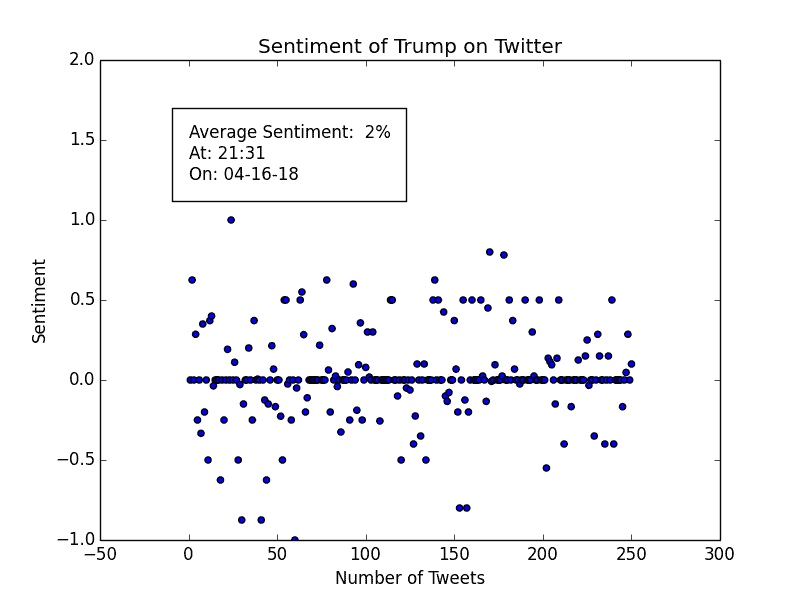

# 基于 Python 的 Twitter 基础数据分析

> 原文：<https://www.freecodecamp.org/news/basic-data-analysis-on-twitter-with-python-251c2a85062e/>

卢卡斯·科霍斯特

# 基于 Python 的 Twitter 基础数据分析

在使用 Tweepy 和 Python 以及[这个代码](https://medium.freecodecamp.org/creating-a-twitter-bot-in-python-with-tweepy-ac524157a607)创建了[免费 Wtr](https://twitter.com/freewtr) 机器人之后，我想知道 Twitter 用户是如何看待这个机器人的，以及他们的感受是什么。所以我创建了一个简单的数据分析程序，它获取给定数量的推文，对它们进行分析，并以散点图的形式显示数据。


Image [credit](https://pixabay.com/en/facebook-analytics-graphs-2265786/).

### 设置

我必须安装几个包来创建这个: **Tweepy** ， **Tkinter** ， **Textblob** 和 **matplotlib** 。您可以使用 pip 软件包管理器安装这些软件。例如:

```
pip install tweepy
```

或者可以像这样克隆到 Github 存储库中。

```
git clone https://github.com/sloria/textblobcd textblobpython setup.py install
```

接下来，您需要创建一个新的 **Python** 文件，并导入以下包。

```
import tweepy #The Twitter APIfrom Tkinter import * #For the GUIfrom time import sleepfrom datetime import datetimefrom textblob import TextBlob #For Sentiment Analysisimport matplotlib.pyplot as plt #For Graphing the Data
```

### Twitter 证书

现在我们需要将一个 Twitter 帐户链接到我们的脚本。如果您还没有，请创建一个。

前往[apps.twitter.com](https://apps.twitter.com/)并使用您的帐户登录。创建一个 Twitter 应用程序，并生成消费者密钥、消费者秘密、访问令牌和访问令牌秘密。

在您的 import 语句下，将您的凭证存储在变量中，然后使用第二段代码通过 Tweepy 验证您的帐户。

```
consumer_key = 'consumer key'consumer_secret = 'consumer secrets'access_token = 'access token'access_token_secret = 'access token secret'
```

```
auth = tweepy.OAuthHandler(consumer_key, consumer_secret)auth.set_access_token(access_token, access_token_secret)api = tweepy.API(auth)
```

如果您想测试您的帐户是否被正确认证，您可以简单地将您的用户名打印到控制台。

```
user = api.me()print (user.name)
```

### 创建 GUI

对于界面，我们将使用两个标签:一个用于**搜索**，另一个用于**样本量**或要分析的推文数量。我们还需要一个提交按钮，这样当点击时，我们可以调用我们的`getData`函数。

```
root = Tk()
```

```
label1 = Label(root, text="Search")E1 = Entry(root, bd =5)
```

```
label2 = Label(root, text="Sample Size")E2 = Entry(root, bd =5)
```

```
submit = Button(root, text ="Submit", command = getData)
```

为了让计算机知道要在屏幕上保留 GUI，我们需要**打包**我们的标签，然后**循环**根显示。

```
label1.pack()E1.pack()
```

```
label2.pack()E2.pack()
```

```
submit.pack(side =BOTTOM)
```

```
root.mainloop()
```

简单地运行这段代码，您应该会看到一个如下所示的窗口:



然而，当文本输入到标签中或点击**提交**按钮时，什么也没有发生。我们必须收集数据。

### 分析推文

首先，我们必须将文本输入到标签中。

```
def getE1():    return E1.get()
```

```
def getE2():    return E2.get()
```

现在我们已经准备好编写`getData`函数了。从现在开始，所有代码都在这个函数中:

```
def getData():    #Code
```

我们需要使用`GetE1()`和`GetE2()`函数。这些将我们的**搜索**和**样本量**存储在变量中，我们可以循环使用。

```
getE1()    keyword = getE1()
```

```
getE2()    numberOfTweets = getE2()    numberOfTweets = int(numberOfTweets)
```

为了存储我们的数据，我们可以使用列表。一个列表是推文的极性(或情绪)，另一个是推文的数量(以便我们可以绘制数据)。

```
 polarity_list = []    numbers_list = []    number = 1
```

tweets 的数量需要声明为 1，因为默认值是 0。

我们现在可以开始遍历这些推文并进行分析。使用 TextBlob，我们可以找到每条推文的情绪，并将其存储到一个变量`polarity`。然后，我们可以将这个变量附加到我们的`polarity_list`中，同时将这个数字附加到我们的`number_list`中。

```
analysis = TextBlob(tweet.text)analysis = analysis.sentimentpolarity = analysis.polarity            polarity_list.append(polarity)            numbers_list.append(number)number = number + 1
```

我们获取这段代码，使用一个`for`循环和`try`语句，在搜索**关键词的 tweets 数量上迭代它。**

```
for tweet in tweepy.Cursor(api.search, keyword, lang="en").items(numberOfTweets):        try:            analysis = TextBlob(tweet.text)            analysis = analysis.sentiment            polarity = analysis.polarity            polarity_list.append(polarity)            numbers_list.append(number)            number = number + 1
```

```
except tweepy.TweepError as e:            print(e.reason)
```

```
except StopIteration:            break
```

### 绘制散点图

为了用 **matplotlib，**绘制我们的散点图，我们首先必须定义轴

```
axes = plt.gca()axes.set_ylim([-1, 2])
```

然后绘制我们的数据列表。

```
plt.scatter(numbers_list, polarity_list)
```

关键信息显示在一个框中。为了显示我们收集的推文的整体情绪，我们计算了所有收集的推文的平均值。此外，因为我们显示的是特定时间的情绪，所以我们希望显示日期和时间。

```
averagePolarity = (sum(polarity_list))/(len(polarity_list))averagePolarity = "{0:.0f}%".format(averagePolarity * 100)time  = datetime.now().strftime("At: %H:%M\nOn: %m-%d-%y")
```

```
plt.text(0, 1.25, "Average Sentiment:  " + str(averagePolarity) + "\n" + time, fontsize=12, bbox = dict(facecolor='none', edgecolor='black', boxstyle='square, pad = 1'))
```



对于标题，我们可以用这个

```
plt.title("Sentiment of " + keyword + " on Twitter") plt.xlabel("Number of Tweets")plt.ylabel("Sentiment")
```

最后用`plot.show()`显示图形。



### 例子

为我的 [**免费 Wtr**](https://twitter.com/freewtr) bot 测试这个，人气简直是天价！



Sample Size of 250 Tweets

至于唐纳德·特朗普，我不能这么说:



下面是 Github 上的[完整源代码](https://github.com/Fidel-Willis/Twitter-Data)。