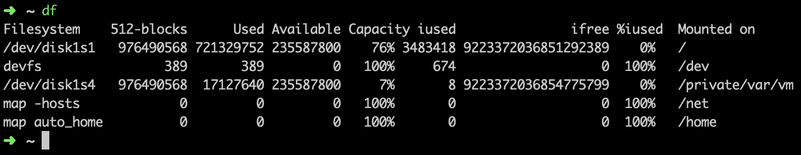
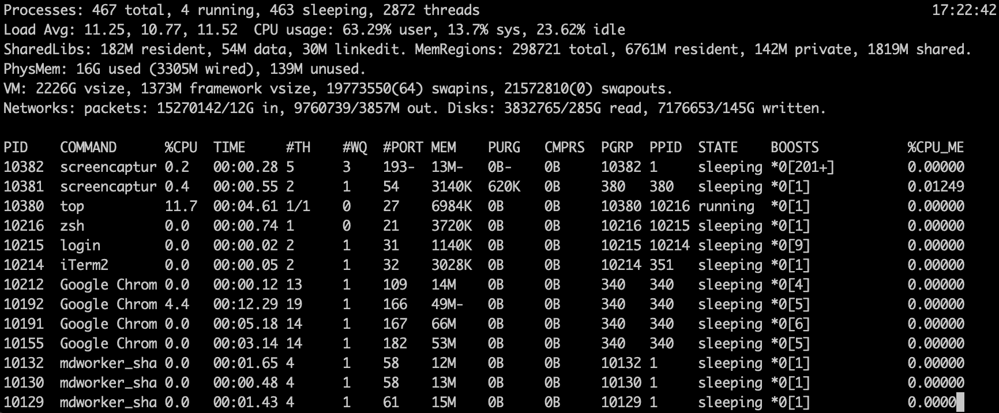

# Linux 命令——您应该知道的基本 Bash 命令行提示

> 原文：<https://www.freecodecamp.org/news/basic-linux-commands-bash-tips-you-should-know/>

Linux 有大量的命令，但是大多数人只使用其中的一小部分。下面是一些在终端中最常用的 Linux 命令。

首先，我们将介绍一些使命令行更易于使用的技巧:

*   使用制表符以便自动完成。当你开始在 Linux 终端中输入一些东西后，按 tab 键，它会建议以你目前输入的字符串开始的可能选项。
*   使用`ctrl+r search_term`搜索您以前使用过的命令。
*   用`ctrl+a`和`ctrl+e`快速移动到一行的开头或结尾。
*   用`!!`复用当前命令中的前一个命令。
*   通过用`;`分隔命令，可以在一行中运行多个命令。

是时候学习常见的 Linux 命令了。您可以通过使用`man`命令获得关于这些命令的更多信息。这将打开命令的手册页。例如，如果您在 linux 终端中键入`man cat`，您将获得更多关于`cat`命令的信息。

### 限位开关（Limit Switch）

列出目录内容。
*例如:* `ls /applications`将显示应用程序文件夹中存储的所有文件和文件夹。

### 激光唱片

切换到目录。
*举例:*用`cd /usr/local`从当前目录变为 */usr/local* 。

重命名或移动文件或目录。
*示例:*命令`mv todo.txt /home/qlarson/Documents`将“todo.txt”移动到“Documents”目录。

### mkdir

创建一个新目录。
*举例:* `mkdir freecodecamp`将一个目录命名为“freecodecamp”。

### 是吗

删除空目录。

### 触控

用指定的名称创建一个空文件。

### 空间

删除文件和/或目录。
*例如:* `rm todo.txt`将删除文件。

### 确定…的位置，发现…的位置

找到特定文件。
*例如:* `locate -i vacuum*mop`命令会搜索任何包含“真空”和“拖把”字样的文件。`-i`使得搜索不区分大小写。

### 清楚的

清除命令行屏幕/窗口，重新开始。

### 丙酸纤维素

复制文件和目录。
*示例:*命令`cp todo.txt /home/qlarson/Documents`将在“Documents”目录下创建一个“todo.txt”的副本。

### 别名

为 Linux 命令创建别名。
*举例:* `alias search=grep`会让你用`search`代替`grep` *。*

### 猫

在屏幕上显示文件的内容。
*例如:* `cat todo.txt`会在屏幕上显示“todo.txt”的文本。

### chown

更改文件所有者。
*举例:* `chown qlarson todo.txt`会让“qlarson”成为“todo.txt”的主人。

### chmod

更改文件的权限。
*示例:* `chmod 777 todo.txt`将使“todo.txt”可读、可写、可由每个人执行。“777”中的数字按顺序指定用户、组和其他人的权限。

### 须藤

执行需要管理权限或根权限的任务。
示例:使用`sudo passwd quincy`更改用户“quincy”的密码。
[“须藤给我做个三明治。”](https://xkcd.com/149/)

### 发现

搜索与提供的模式匹配的文件。此命令用于使用名称、大小、访问时间和修改时间等过滤器搜索文件和文件夹。
*例如:* `find /home/ -name todo.txt`将在主目录及其子目录中搜索名为“todo.txt”的文件。

### 可做文件内的字符串查找

在文件或输出中搜索特定的字符串或表达式。该命令搜索包含指定模式的行，默认情况下，将它们写入标准输出。
*例如:* `grep run todo.txt`会在“todo.txt”文件中搜索“运行”一词。将显示包含“运行”的行。

### 日期

显示或设置系统日期和时间。

### df

显示系统磁盘空间使用情况的报告。

### 杜（姓氏）

显示每个文件占用的空间。这将以磁盘块数显示大小。如果你想用字节、千字节、兆字节来看，就像这样添加`-h`参数:`du -h`。

### 文件

确定文件的类型。
*例如:* `file todo.txt`将可能显示“ASCII 文本”的类型。

### 历史

显示命令历史。

### 杀

停止一个进程。
*示例:*使用命令`kill 485`停止 PID 为 485 的进程。使用`ps`命令(如下)确定过程的 PID。

### 较少的

一次查看一页文件的内容。
*举例:* `less todo.txt` 会显示“todo.txt”的内容。

**PS**显示当前正在运行的进程列表。这可用于确定`kill`流程所需的 PID。

### 显示当前工作目录

显示当前目录的路径名。"**p**rint**w**orking**d**irectory "

### 嘘

通过网络远程登录到另一台 Linux 机器。
*例如:* `ssh quincy@104.25.105.32`将使用用户名“昆西”登录 104.25.105.32。

**尾**——显示一个文件的最后 10 行。使用-n(数字)选项查看更少或更多的行。
*举例:* `tail -n 5 todo.txt`会显示“todo.txt”的最后 5 行。

### 水手

从一个目标文件中存储和提取文件。tar)或 tarball (.tar.gz 或。tgz)。

### 顶端

显示系统中正在使用的资源，类似于 Windows 中的任务管理器。

