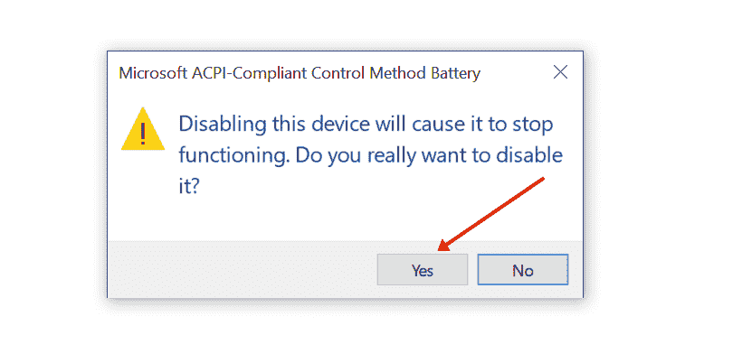

# 电池图标不显示–如何在 Windows PC 中恢复丢失的电池图标

> 原文：<https://www.freecodecamp.org/news/battery-icon-not-showing-how-to-restore-missing-battery-icon-in-windows-pc/>

因此，您正在使用 Windows PC，发现在任务栏中找不到电池图标。

你甚至展开隐藏的图标，你仍然找不到电池图标。

这可能会对你的工作效率产生负面影响——因为如果你不把笔记本电脑插上电源，电池可能会没电，而你却不知道。

我刚刚解决了同样的问题。因此，在本文中，我将向您展示如何在 Windows PC 上恢复丢失的电池图标。

## 解决方案 1:通过任务栏设置显示电池图标

**第一步**:右击任务栏中的空白区域，选择“任务栏设置”。

**第二步**:在“通知区域”下，点击“打开或关闭系统图标”。

**第三步**:打开“电源”。

**NB** :如果电池图标在这里是灰色的，继续本文中的下一个修复。

## 解决方案 2:禁用并重新启用电池硬件

**步骤 1** :右键点击开始，选择设备管理器。

**第二步**:展开电池，右键点击“微软交流适配器”，选择“禁用设备”。

您将看到一条警告。单击是继续。

**步骤 3** :对第二个设备——微软 ACPI 兼容控制方法电池重复**步骤 2** 中的过程。

**步骤 4** :重新启用两个设备。

第五步:重启电脑。

## 结论

如果本文建议的两种修复方法都无法恢复电池图标，您应该更新您的 Windows。

如果你觉得这个指南有用，不要犹豫，分享它，这样你也可以帮助别人。

感谢您的阅读。