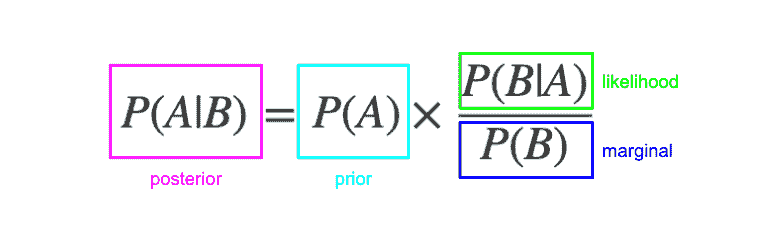
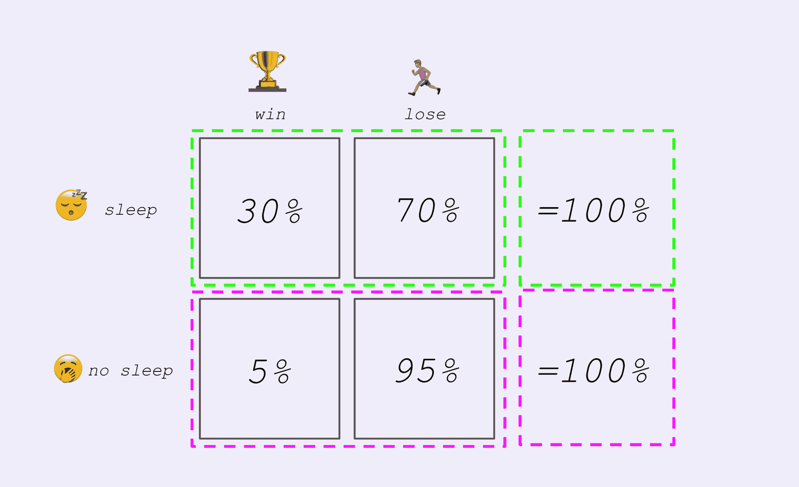
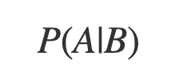

# 贝叶斯法则——为初学者解释

> 原文：<https://www.freecodecamp.org/news/bayes-rule-explained/>

贝叶斯规则是数据科学中最重要的规则。它是数学规则，描述了在给定一些证据的情况下，如何更新一个信念。换句话说，它描述了学习的行为。

这个等式本身并不复杂:

The equation: Posterior = Prior x (Likelihood over Marginal probability)

有四个部分:

*   **后验概率**(考虑证据后的更新概率)
*   **先验概率**(证据被考虑之前的概率)
*   **可能性**(假设信念为真，证据的概率)
*   **边际概率**(任何情况下证据的概率)

贝叶斯法则可以回答各种概率问题，这有助于我们(和机器)理解我们生活的复杂世界。

它以 18 世纪英国神学家和数学家托马斯·贝叶斯的名字命名。贝叶斯最初写了这个概念，但在他的一生中没有得到太多的关注。

法国数学家[皮埃尔·西蒙·拉普拉斯](https://www.freecodecamp.org/news/will-the-sun-rise-tomorrow-255afc810682/)在他 1814 年的著作[*Essai philosophique sur les probabilityés*](https://ia801407.us.archive.org/35/items/essaiphilosophiq00lapluoft/essaiphilosophiq00lapluoft_bw.pdf)*中独立发表了这条法则。*

今天，贝叶斯法则有着众多的应用，从统计分析到机器学习。

这篇文章将用通俗易懂的语言解释贝叶斯法则。

## 条件概率

首先要理解的概念是[条件概率](https://www.mathsisfun.com/data/probability-events-conditional.html)。

你可能已经大致熟悉了[概率](https://en.wikipedia.org/wiki/Probability)。它让你用数学的精确性和严谨性对不确定的事件进行推理。

条件概率是让你谈论多个不确定事件如何相关的桥梁。它让你谈论一个事件的概率如何在不同的条件下变化。

例如，假设你前一天晚上没有睡觉，考虑赢得比赛的概率。如果你睡了一整夜，你可能会认为这个概率比你赢的概率低。

或者，考虑一下犯罪嫌疑人犯罪的可能性，因为在现场发现了他们的指纹。与没有发现他们的指纹相比，你会认为他们有罪的可能性更大。

条件概率的符号通常是:

P(A|B)

其被解读为“给定事件 B 发生，事件 A 发生的概率”。

需要记住的一件重要事情是，条件概率[与它们的逆](https://en.wikipedia.org/wiki/Confusion_of_the_inverse#:~:text=Confusion%20of%20the%20inverse%2C%20also,about%20the%20same%20as%20the\)不同。

也就是说，“事件 A 给定事件 B 的概率”和“事件 B 给定事件 A 的概率”不是一回事。

为了记住这一点，举以下例子:

> 如果下雨，有云的概率(100%)与下雨的概率(如果有云)是相同的。

(插入关于英国天气的笑话)。

## 贝叶斯法则的细节

贝叶斯法则告诉你如何用你已经掌握的信息来计算条件概率。

根据两个事件来思考是有帮助的——一个假设(可能是真的或假的)和证据(可能存在或不存在)。

然而，它可以应用于任何类型的事件，具有任何数量的[离散或连续](https://www.statisticshowto.com/probability-and-statistics/statistics-definitions/discrete-vs-continuous-variables/)结果。

贝叶斯法则让你计算**后验(或“更新”)概率**。这是一个条件概率。如果证据存在，它是假设为真的概率。

在看到新证据之前，将**先验(或“先前”)概率**视为你对假设的信念。如果你已经对假设有了坚定的信念，先验概率将会很大。

先验乘以一个分数。把这当成证据的“力度”。当顶部(分子)较大，底部(分母)较小时，后验概率较大。

分子是**可能性**。这是另一个条件概率。假设假设为真，它是证据存在的概率。

这跟后路不一样！

记住，“假设假设为真，证据存在的概率”和“假设证据存在，假设为真的概率”是不同的。

现在看看分母。这就是证据的**边际概率**。也就是说，它是证据存在的概率，无论假设是真还是假。分母越小，证据越“有说服力”。

## 贝叶斯规则的工作示例

这里有一个简单的例子。

你的邻居正在看他们最喜欢的足球队。你听到他们在欢呼，并想估计他们队得分的概率。

第一步——写下欢呼时进球的后验概率

**步骤 2**–估计目标的先验概率为 2%

假设有 90%的目标，估计欢呼的可能性(如果你的邻居的球队输得很惨，他可能不会庆祝)

**第 4 步**-估计欢呼的边际概率-这可能是因为:

*   进球得分(2%的概率乘以 90%的概率)
*   或者任何其他原因，比如另一个队罚丢了点球或者有球员被罚下(98%的几率，乘以 1%的概率)

现在，把所有东西拼凑起来:

## 贝叶斯规则的用例及后续步骤

贝叶斯法则在许多领域都有使用案例:

*   理解概率问题(包括医学研究中的问题)
*   统计建模和推理
*   机器学习算法(如朴素贝叶斯、期望最大化)
*   定量建模和预测

接下来，您将发现如何使用贝叶斯规则来量化不确定性和模拟现实世界的问题。那么，如何推理“概率的概率”。

最后一步将介绍各种计算技巧如何让你利用贝叶斯法则来解决重要的问题。