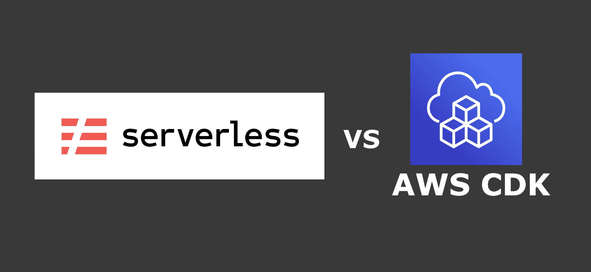
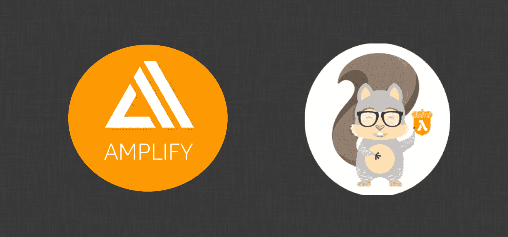

# 2022 年如何成为无服务器开发者

> 原文：<https://www.freecodecamp.org/news/become-a-serverless-developer/>

自 2014 年 AWS Lambda 发布以来，无服务器开发就一直存在，但在过去几年中，事情出现了爆炸式增长。

初创公司和智能科技公司已经开始利用无服务器的可扩展性、可靠性和强大功能来快速发展——现在他们比以往任何时候都需要更多的无服务器开发人员。

成为“无服务器开发者”意味着你可以用 AWS、谷歌云(GCP)或 Azure 等公司的托管服务来构建解决方案。通过将不同的服务拼凑在一起，并在 AWS Lambda 或 CGP 云功能中而不是在服务器上运行所有的业务逻辑，您可以构建解决方案。

随着您的云平台处理几乎所有的操作(安全性、冗余性、可扩展性和联网)，您可以专注于构建最佳解决方案。这意味着可以更快地构建功能，公司也不需要雇佣运营专家。

本文将介绍学习如何成为无服务器开发人员的 5 个步骤，这样您就可以构建一些非常棒的产品。

## 概括起来

1.  有扎实的 JavaScript 或 Python 技能。你不需要成为一个向导，但是舒适地编写一个 Express 或 Flask 服务器将会使剩下的事情变得容易得多。
2.  选择你的框架——选择[无服务器框架](https://www.serverless.com/)或 [AWS CDK。](https://docs.aws.amazon.com/cdk/v2/guide/getting_started.html)
3.  跟随教程开始学习使用您的框架进行构建。首先用 API Gateway 和 Lambda 构建一个 API。
4.  了解有关您正在使用的服务的更多信息。有什么好处，局限性，好的用例，不好的用例？
5.  将您在教程中学到的内容构建到您自己的项目中。

现在你已经学会了构建一个 API，添加更多的服务，每次重复步骤 3-5。一个好的顺序可能是:

*   dynamo db–获取和写入数据
*   S3-读取和写入文件
*   dynamo db——带有二级索引和查询
*   cogn ITO-API 授权
*   app sync–graph QL API

[https://www.youtube.com/embed/u-UaP8XONgg?feature=oembed](https://www.youtube.com/embed/u-UaP8XONgg?feature=oembed)

## 1.扎实的 JavaScript 或 Python 技能

在尝试构建无服务器系统之前，您确实需要很好地掌握一种通用编程语言的基础。你不需要成为一名巫师，但是熟练使用你选择的语言是关键。

你需要舒服地写好代码的原因是它对你构建的软件有巨大的影响。无服务器就像积木，Lambda 代码就像胶水。在这段代码中，您编写了连接各个部分的逻辑。

> 你可以拥有完美的架构，但是如果你的 Lambda 代码有问题，你的解决方案也会有问题。

我推荐 JavaScript (TypeScript)或者 Python。我推荐这两种语言的原因是，大多数使用无服务器架构的公司都会使用这两种语言中的一种。幸运的是，它们也是 FreeCodeCamp 教授的两种语言🎉。

作为最广泛使用的，他们也有更多的教程和更大的社区来帮助你。

我推荐这些语言的另一个原因是，你可以用写 Lambda 代码的语言来写框架代码。你将不断地在 lambda 代码和框架配置之间跳跃。不需要在语言之间转换会节省你很多的大脑汁🧠

## 2.选择你的框架

掌握了这门语言之后，您需要一个工具来帮助您在 AWS 中创建无服务器组件。

有很多，但我会说你应该选择无服务器框架或 AWS CDK。我对无服务器框架有偏见，因为我有一个 **[Youtube 频道](https://www.youtube.com/CompleteCoding)** ，上面有 50 多个用它构建的视频。如果你是 Python 开发者，那么 AWS CDK 可能更适合你。

### 为什么要使用框架？

构建解决方案时，可以在 AWS 控制台中完成所有工作。我就是这样开始我的 AWS 之旅的。

问题是它不可控、不可管理、不可扩展。如果您想将此设置复制到另一个帐户(单独的开发和生产帐户)，您必须记住您已经完成的所有步骤。与多个团队成员一起工作可能会变得混乱。

这就是为什么使用一个框架来允许我们编写基础设施即代码(IaC)是有帮助的。这允许我们使用 Git 进行版本控制。这使得团队合作变得更加容易，支持多环境部署，甚至是持续集成和部署。运行生产工作负载时需要的所有东西

### 无服务器框架

+在大型生产工作负载中得到验证
+易于入门
+大型社区
+大量教程
+大量插件使许多工作变得更容易
-当做非无服务器的事情时就不那么容易
-如果你使用 Python，你必须用 YAML 配置它

### AWS CDK

+来自 AWS 并由他们积极开发
+对 AWS 中几乎所有东西的良好支持
+一些创建可重用结构的酷方法
+不断增长的社区和教程池
+可以使用 Python 定义配置
-与无服务器框架不同的“插件”生态系统

### 其他框架

你们中的一些人可能会问“所有其他的框架呢？”我会解决这些问题。

#### AWS SAM 和 AWS Amplify

这些框架被设计成非常容易做简单的事情。如果你正在阅读这篇文章，那么你可能会用它来快速而轻松地创建一个 API 和网站。

如果这就是你想做的一切，那就太好了。但是如果你想对如何部署它们有更多的控制，或者想部署更复杂的系统，那么你将会很困难。

#### 地形和 Ansible

这些框架已经存在很长时间了，并在企业中作为基础设施代码(IaC)工具使用。

我不把这些作为我的第一个框架的原因是:

1.  你必须学习一门新的语言。Terraform 使用 HCL (Hashcorp 语言)，Ansible 使用 YAML。在学习一门新语言的同时试图了解无服务器架构是不理想的。当你需要创建基础设施的时候，切换到这种语言也是一种大脑高速运转。
2.  他们固执己见，严格要求。得到一个没有完美配置的小东西是行不通的，经常会出现难以理解的错误。
3.  它们不像 CDK 或无服务器框架那样灵活或强大。

#### 网络和无服务器云

这些都是非常新的框架，它们试图让 IaC 变得尽可能简单而强大。

我现在避免使用它们的原因是它们太新了。这有两个缺点:

1.  社区没那么大。这意味着更少的教程和更少的人问你是否卡住了
2.  事情变化很快。最佳实践和通用结构，但有时也包括 API、方法和参数。当学习一个框架时，你不会想处理这些东西。

如果有一个特性是你绝对需要使用的，并且你有一个对这个特定框架非常有经验的人，那么它就可以工作。我还是会推荐两个主要中的一个。

## 3.跟随教程

选择好框架后，您现在可以开始用它构建东西了。

你应该做的第一件事就是构建一个只使用 Lambda 和 API Gateway 的 API。这非常简单，但是会让你练习框架的核心基础。理解了基础知识，学习更高级的东西就会容易得多。

### 为什么要跟随教程

当学习一个新的服务时，通过将它直接添加到一个现有的项目中来尝试和学习它可能很有诱惑力。我建议在你第一次使用任何新的服务或工具时，一定要遵循教程。

当你遵循一个教程，它应该没有任何问题。这意味着您可以专注于了解服务以及它如何与其他一切相适应。

将它添加到您自己的项目中意味着如果有些东西不工作，您必须自己调试它。您可能不知道是否使用了错误的服务，或者是否存在连接到现有系统的错误。

## 4.了解有关您正在使用的服务的更多信息

既然您已经使用了这项新服务，那么最好多了解一下。关于我使用的服务，我想知道的关键问题是:

1.  它的优势、劣势和局限性是什么？
2.  使用该服务的一些理想用例是什么？
3.  您应该避免使用此服务的一些用例是什么？

了解了这三件事，您将能够更好地决定一项服务是否适合您当前正在构建的解决方案。

您可以从很多地方学习:教程、文章，甚至 AWS 文档。

例如，AWS Lambda 对大多数 API 来说都很棒，但运行时间不能超过 15 分钟。如果我需要构建一个 API 来做一些需要 10-20 分钟的批处理，那么一半的时间都会超时。因此，我需要找到另一种解决方案。

同样，你不需要了解每项服务的每一个细节，只要知道什么时候该用什么时候不该用就够了。

## 5.构建您自己的项目

现在，您已经知道了如何构建新的服务(从教程中),并且对何时使用该服务有了很好的理解。

从现在开始，是时候在您自己的项目中使用这些服务了。

我建议您从一个个人项目开始，这个项目只是用来练习使用中的新服务。这样你就不用担心弄坏东西，可以专注于服务的运作。

您现在可以开始在生产应用程序中使用它，在这里您将了解到许多关于服务的细节。您将学习如何使它满足业务需求，以及它如何与其他服务协同工作。如果你能把这作为你工作的一部分，那就更好了。否则，您会同样小心地部署一个应用程序。

## 重复步骤 3-5

恭喜你！您已经学习了如何使用框架构建 API。

这还不是结束，因为总有更多的东西要学，还有成为更好的无服务器开发者的方法。选择一个新的主题、服务或设计模式，并重复步骤 3-5。

如果您刚刚开发了第一个无服务器 API，那么下面是我将学习的下一个主题和服务，以继续您的旅程。

*   dynamo db——创建一个简单的表，获取和写入数据
*   S3——创建 S3 存储桶，读写文件
*   dynamo db——带有二级索引和查询
*   cogn ITO-API 授权
*   app sync–graph QL API

之后，专注于为您的解决方案创建功能，并以此指导下一步的学习。

如果你是一个想要使用无服务器框架的 JavaScript 开发人员，那么我的 Youtube 频道是一个很好的起点，在那里我们创建了关于如何成为最好的无服务器开发人员的教程。