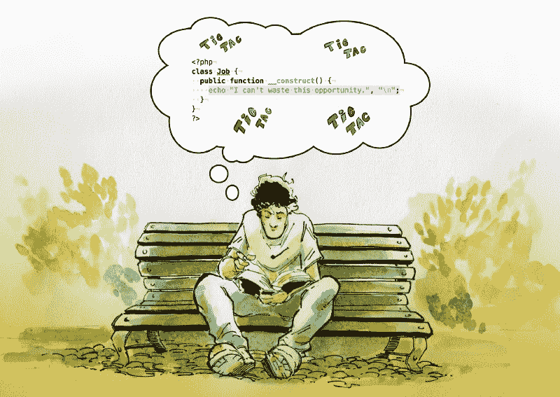

# 我是如何从街头卖食品到为顶尖科技公司工作的——第二部分:获得…

> 原文：<https://www.freecodecamp.org/news/become-ii-how-i-went-from-selling-food-in-the-street-to-working-for-top-firms-in-tech-5da51d788ea9/>

阿尔瓦罗·维德拉

# 我是如何从街头卖食品到为顶尖科技公司工作的——第二部分:找到工作

Illustration by my friend Sebastián Navas

这是本系列文章的第二部分，我想与您分享我是如何进入编程世界的。我从未上过大学去研究它，但我找到了一种绕过它的方法。如果你喜欢这个系列，并想从中看到一本书，请在下面留下评论。这里是第一部的[，以防你还没看过。](https://medium.com/@old_sound/become-how-i-went-from-selling-food-in-the-street-to-working-for-top-firms-in-tech-6aa61a2d0629)

### 得到这份工作

在 2006 年 12 月和 2007 年 1 月期间，我努力让我的地图应用程序运行起来。在构建它的时候，我想学习尽可能多的编程概念，试图把所有能让我为工作面试做好准备的知识都塞进我的脑子里。

在我能学到的所有概念中，我找出了我认为与获得这份工作相关的主要概念。缩小关注范围是实现目标的非常重要的一步，因为我们不想无处不在，试图抓住每个主题的一点点，但却无法深入其中的任何一个。

就我的情况而言，我知道我必须学习面向对象编程，因为这是使用中最重要的编程技术之一。在技术方面，我认为 PHP 是能让我找到工作的关键编程语言，而学习 Flash 编程则是让我与众不同的技能。

我怎么知道的？这是我在网上看到的内容和电脑杂志上写的内容的一点直觉。

甚至在我得到这份工作之前，我就知道学会理解和分析我想打入的市场是非常重要的，找到合适的网站和出版物是实现这一目标的重要一步。这是因为这些资源通常包含指向我们应该关注的想法、趋势和技术的信息。

一旦我的应用程序完成，我觉得我已经为面试做好了准备，是时候建立我的简历了。然而，我不知道科技简历上应该写什么，应该省略什么。我把 MS Word 和 MS Excel 列为我的一些技能，还有 Adobe Illustrator 和一些 InDesign。为什么不呢，对吗？

不对。光是想想那第一份简历就让我脸红。如果没有别的，它所传达的信息是明确的:这个人是个彻头彻尾的笨蛋。

问题是，作为一个试图进入一个新领域并开始职业生涯的人，很难在我的简历上写些让我看起来有能力的东西。我不知道要包括什么，所以我列出了所有的东西。

今天，如果有人把 MS Word 列为一项技能来申请后端开发人员的职位，我敢肯定这个人会被直接拒绝。更糟糕的是，我想我会是那个拒绝这样一份简历的人。但当然，后知后觉是 20/20。

当我的简历完成后，我有了一个可以联系到我的手机号码，我申请了 Live Interactive 的 PHP 程序员职位。你最好相信，当我仔细检查一份心理清单时，我一遍又一遍地看了那个在线表格上的每个输入框。“我的名字拼对了吗？我输入的电话号码正确吗？让我们仔细检查电子邮件。我不想因为写错地址而错过这个机会。”我很紧张，但在某个时刻，我不得不按下发送键。点击。完成了。呼气。“我已经做到了。我已经申请了我的第一份工作。”

> 一旦我的应用程序完成，我觉得我已经为面试做好了准备，是时候建立我的简历了。然而，我不知道科技简历上应该写什么，应该省略什么。

提交申请后，我徘徊在网吧，浏览网页寻找随机的东西。令我惊讶的是，大约半小时后，我的手机开始响了。

“我不知道这个数字，”我想。区号告诉我是从蒙得维的亚打来的，但是太快了，不可能是他们。或者可能吗？

我花了几秒钟才明白，是的，事实上，他们在叫我！你能想象吗？我真的不知道该怎么办。“我应该接这个电话吗？”我想知道。“我大概还没做好这个准备！”我赶紧控制住自己，走到外面去接电话。

“嗨，我们是从现场互动打来的，是关于你的工作申请。这是阿尔瓦罗·魏地拉吗？”电话那头的声音说。

你看到那里发生了什么吗？我简直不敢相信！我刚刚申请工作的公司正在联系我。

“是的，是我，”我回答。

打电话的人原来是正在联系我的人力资源经理，他想和我安排一次面试。她问我什么时候对我合适，所以我告诉她我需要一周的时间，因为“我必须安排这里的事情。”这并不一定，因为我本可以登上下一趟巴士，直接去那里，但我想做好准备——做好 100%的准备，不要错过我唯一的机会。

电话结束时，我挂了电话，因为我已经得到了一个工作面试的机会。现在是我振作起来准备面试的时候了。我毫不怀疑这是我一生只有一次的机会，我不能浪费它。但首先，我必须与我的母亲和妻子分享我的兴奋:我需要与某人谈论发生的事情，以帮助处理我的情绪。

一方面，我所有的努力开始得到回报，这感觉很好。但另一方面，生活让我看到了更好的未来。让未来成为现实现在完全落在了我的肩上，但这是我一个人无法承担的巨大责任。

我花了整整一个星期准备面试，从阅读和重读我的书，到试图猜测我应该穿什么样的衣服去面试。我从未做过程序员，因此，我不知道程序员文化是如何运作的，也不知道我应该有什么样的行为。我也没有人问我这个问题，所以在某个时候，我决定不再过多地担心外观方面，并试图专注于过程的技术方面，希望我的技能会自己说话。

> 我毫不怀疑这是我一生中仅有的一次机会，我不能浪费它，但首先，我必须与我的母亲和妻子分享我的兴奋:我需要与某人谈论发生的事情，以帮助处理我的情绪。

### 意想不到的障碍

时间过得很快，不知不觉中，我已经坐上了两个小时的长途汽车，前往蒙得维的亚。我背包里有 PHP 圣经，还有足够的钱买一个汉堡，并支付从公共汽车站到蒙得维的亚市中心公司办公室的车票。我不想迟到，所以我提前一个小时在附近转悠，尽我最大的努力战胜精神崩溃。

我不得不找些事情来消磨时间，占据我焦虑的头脑，所以我走到附近的广场，找到一条长凳，坐下来继续学习。我不敢相信我过去几个月的所有挣扎会在一个小时内结束。“我尽全力准备了吗？那一次我不想学那部分书好去外面，值得吗？”我想知道。后来我醒悟了。“别说了，”我告诉自己。“现在是时候专注于我面前的这本书了，因为没有理由担心*可能会有*。”

很快，该去面试了。如果这是一部塔伦蒂诺电影，我的角色可能会被称为蓝色先生:深蓝色牛仔裤，蓝色衬衫，深蓝色帽衫。

我到了接待区，受到了人力资源经理的欢迎，一周前我还和他通过电话。她让我坐下等着，并给了我一杯水。我接受了这个提议，并立即开始怀疑自己。“这样做对吗？”我想知道。“我是礼貌还是不礼貌？”焦虑占据了我的心头。

与此同时，人们四处走动，从一个办公室走到另一个办公室。“他们中有我的面试官吗？”我问自己，研究着每一个走过的人。一名男子走向人力资源经理，开始交谈。“啊，一定是他，”我想。但事实并非如此。

在更多的疑惑之后，人事经理叫了我的名字，把我带进了一个大会议室。她递给我一堆纸，告诉我这是面试的第一部分:一个包含 100 多个行为和情景问题的心理测试。什么？是。这个？PHP 圣经中没有一处提到人们需要通过心理测试才能成为程序员！但我尽了最大努力，猜测每个问题的意图。当然，我不知道我选择的答案是否正确，但我希望它们能让我更接近我想要的工作。

一旦我做完了，我就把试卷和我的答案一起退回去，然后被要求重新坐下来等待下一个阶段。不久，人力资源经理给我介绍了一个将要进行编程面试的人。“机不可失，时不再来，”我想。“机不可失，时不再来。”那一刻，我觉得所有的压力都在我身上，我不能让我的妻子，我的妈妈，我的家人失望。"如果我没有得到这份工作，让人们知道这不是因为我面试受阻，不知道该怎么办，"我想。“如果我没有通过下一阶段，最好是因为他们不想要我，而不是因为我缺乏知识或准备。”

#### 我希望你喜欢这第二部分。在下一篇文章中，我会告诉你我是如何得到这份工作的，以及在工作的第一周发生了什么。

演职员表:上面的插图是我的朋友 [***塞巴斯蒂安·纳瓦斯***](https://twitter.com/SebastianNavasF) 制作的。如果你想让他为你的文章或演示文稿提供令人惊叹的插图，请毫不犹豫地与他联系。这是他的另类档案:[https://polacostyle.deviantart.com](https://polacostyle.deviantart.com)或者他的脸书:[https://www.facebook.com/sebastian.navas.16](https://www.facebook.com/sebastian.navas.16)