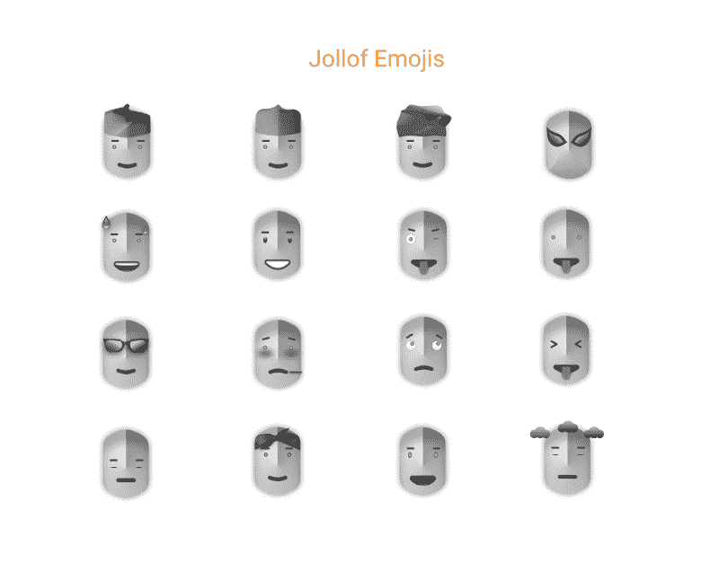
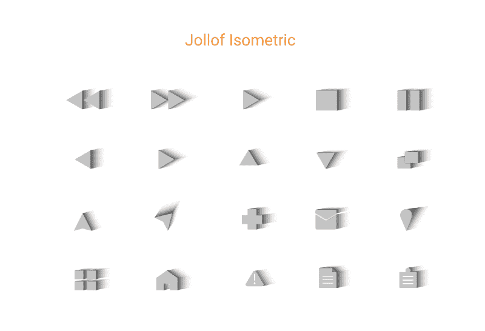
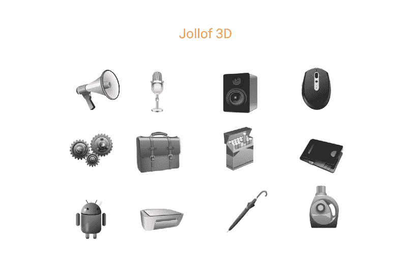
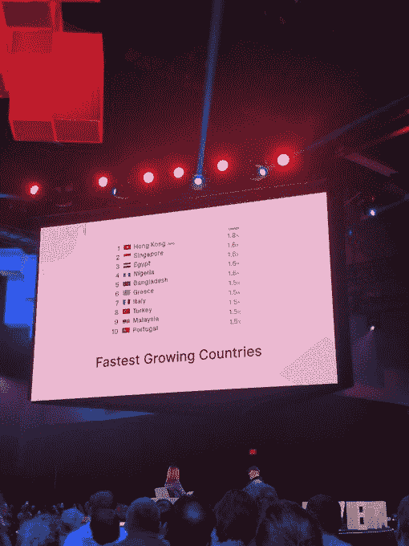

# 我如何成为一名更好的设计师，如何用 Jolloficons 为开源做出贡献

> 原文：<https://www.freecodecamp.org/news/becoming-a-better-designer-and-contributing-to-open-source-with-jolloficons-2c2a47330a1e/>

作者:Gbolahan Taoheed Fawale

# 我如何成为一名更好的设计师，如何用 Jolloficons 为开源做出贡献

今年早些时候，当我还非常积极地参与尼日利亚伊莫州 Owerri 的技术社区时，我和我的朋友们——大部分是开发人员——讨论构建开源项目。我们希望帮助自己更好地磨练我们的技术技能，同时解决社会问题，并为该州规模虽小但正在积极发展的技术社区带来一些关注。

作为其他开发人员中唯一的设计师，我有两种贡献方式:帮助构建项目的模型界面，或者挑选一个前端框架并直接参与代码方面的工作，因为我已经有了一些前端设计的经验。我们的口号是:只要你准备好了，没有什么是你学不到的，或者有一些事情处于危险之中(比如设计工作、全职工作，或者任何形式的职业发展或物质补偿。)这些人仍然是我见过的最有动力、最勤奋的人。

> *“身边都是好人；让你的周围充满积极和挑战你的人，让你变得更好。”*——**阿里·克里格**

### 最初的想法

最初想到的是一个图标包，其中包含与尼日利亚或整个非洲相关的图标，可以用于不同的项目。然而，在那个特殊的时期，我被工作和其他个人责任冲昏了头脑，这种想法并没有出现。

在某个时刻，我也经历了自我麻痹。我一直在思考图标的类型、风格和在上下文中的可用性，因为我认为一些出现在脑海中的图标想法不太适合 web/移动应用程序产品。这特别让我气馁，所以我只是继续“做梦”，而不是实际参与这个项目。

> *“拓宽视野，探索和学习新事物。某些事情肯定会对你有好处"*
> ― **穆斯塔法·赛夫丁**

我想了想我的设计师生涯。我想在 UI/UX 以及设计的其他方面尽我所能做到最好，并成为其他人的灵感来源。我相信尝试不同的东西会让一个人更擅长他们的手艺。作为 Figma 非洲大使和设计倡导者，除了设计和模仿界面，我还想创造、教授和分享一些你可以用 fig ma 做的很酷的事情。所以我开始和 Figma 一起做真实的等距图和 3d 插图，比如这个[受欢迎的建筑](https://medium.freecodecamp.org/how-i-designed-a-popular-landmark-building-in-isometric-3d-using-figma-f059fe333459)和[这个](https://medium.freecodecamp.org/creating-realistic-3d-objects-in-figma-carton-box-example-f674c21c3452)。

Jollof Icons Isometric

用户界面/UX 领域相当广泛，你根本不可能了解全部。每一个新项目/产品每天都在学习，所以我不能说我是这方面的专家。但与此同时，我觉得我应该能够测试新的水域，进行实验，并找到其他方面的设计和我可以学到的技术技能。毕竟，设计和技术的所有这些方面都以某种方式相互关联。

### 开始的动力

今年 7 月，我找到了一份新工作，随后不得不在接下来的一个月——8 月——搬到尼日利亚的拉各斯。毫无疑问，拉各斯是尼日利亚最大的科技中心，环境的突然变化让我被我的“新社区”淹没了，我努力快速适应，同时也试图在比赛中领先。非洲和世界其他地方的一些最优秀的人才可以在拉各斯找到。对我来说，这是一场不同的球赛。

在我的新工作和环境达到一定程度的稳定后，我不得不回想我一直想在年底前完成的一些目标和项目。让我在这里补充一点，你必须总是找时间做兼职项目，因为这给了你成长的空间。这也使你有可能成为一个更好的设计师/开发人员，并加倍你的兴趣和兴奋来学习和做更多的事情。

我脑子里一直有这些设计想法和概念——其中一些我还没有能够探索。然而，我认为把它们拿出来的最好方法是设计一些东西。这促使我决定开发图标包。

我想我已经更清楚我想做什么，我花了几天时间试图找出一种风格；不一样的东西。这就是我如何发现自己在创造可以在不同的数字产品和屏幕上使用的图标，创造非洲背景下的东西，或者只是在我的脑海中充实所有这些设计思想和概念。

Jollof Icons 3d category

第一步是获得域名[jolloficons.com](http://jolloficons.com)，让自己“致力于”这个项目。这是我部署的心理黑客，以确保我开始创建图标的工作。

我看到并喜欢 [Undraw](https://undraw.co/) 的 [Katerina Limpitsouni](https://twitter.com/ninalimpi) 和 [Aggelos Gesoulis](https://twitter.com/anges244) 正在做的事情，同样的还有 [fontawesome](https://fontawesome.com) 的 Dave Gandy 和 VSCode 的 Vancura。但我想做一些不同的事情，一些对非洲来说“原创”的事情。虽然我没能及时发现。

Octoverse Report 2018

### 我需要的推动力

今年在旧金山举行的 Octoverse 开发者大会上，我们看到尼日利亚在 Github 上的组织、存储库和尼日利亚开发者所做的贡献方面上升到第四个增长最快的国家。

也有人担心我们消耗的开源工具比我们生产的多，但现在事情的变化比我们想象的要快，这要感谢像安德拉和 T2 这样的组织，他们正在培养技术人才并支持技术生态系统。

我必须同样提到我们的一些开发者拥护者、专家和导师[阿尼迪·乌多-奥邦](https://www.freecodecamp.org/news/becoming-a-better-designer-and-contributing-to-open-source-with-jolloficons-2c2a47330a1e/undefined)、[汉森·约翰逊](https://www.freecodecamp.org/news/becoming-a-better-designer-and-contributing-to-open-source-with-jolloficons-2c2a47330a1e/undefined)、[普罗斯珀·奥特姆伊瓦](https://www.freecodecamp.org/news/becoming-a-better-designer-and-contributing-to-open-source-with-jolloficons-2c2a47330a1e/undefined)、[克里斯蒂安·恩万巴](https://www.freecodecamp.org/news/becoming-a-better-designer-and-contributing-to-open-source-with-jolloficons-2c2a47330a1e/undefined)、[伊尔·阿德里诺昆](https://www.freecodecamp.org/news/becoming-a-better-designer-and-contributing-to-open-source-with-jolloficons-2c2a47330a1e/undefined)、[阿德瓦勒·阿巴蒂·♠](https://www.freecodecamp.org/news/becoming-a-better-designer-and-contributing-to-open-source-with-jolloficons-2c2a47330a1e/undefined)、[尼奥·伊戈达罗](https://www.freecodecamp.org/news/becoming-a-better-designer-and-contributing-to-open-source-with-jolloficons-2c2a47330a1e/undefined)、[萨姆森·戈迪](https://www.freecodecamp.org/news/becoming-a-better-designer-and-contributing-to-open-source-with-jolloficons-2c2a47330a1e/undefined)、[阿达·恩杜卡·奥约姆](https://www.freecodecamp.org/news/becoming-a-better-designer-and-contributing-to-open-source-with-jolloficons-2c2a47330a1e/undefined)这只是提到了一些支持尼日利亚科技生态系统的杰出人才和组织。

这只是一个时间问题，因为我们尼日利亚的设计师很快就会有很多内容和开源资源与世界分享，因为我们已经在不畏艰难，打破界限。

Figma 非洲设计倡导负责人[namn so uk panah](https://www.freecodecamp.org/news/becoming-a-better-designer-and-contributing-to-open-source-with-jolloficons-2c2a47330a1e/undefined)——他也是我的朋友——一直在寻找精通图像学的有经验的设计师，他们可以通过 Figma 非洲 slack 频道的 AMA 会议与我们分享他们的知识。我记得我们花了一段时间才找到人。很快，VSCode 项目的 Vancura 来到我们的频道，分享他为流行的 VSCode 编辑器设计图标的经验和知识。这是一次既有教育意义又有趣的会议。

> *“拒绝被挑选的暴政。自己挑。”*

> ― **塞斯·戈丁，[戳箱子](https://www.goodreads.com/work/quotes/15271334)**

我通常不喜欢错过分享我的知识和为技术社区做贡献的机会。所以我对自己有点失望，说实话，我感觉很糟糕，因为我一直没有参与图标项目。我觉得，在我们等待更有经验的人参加 AMA 会议的时候，我可能已经能够与设计界分享我自己的经验和知识。但是因为我没有做过，所以没有证据证明我有设计任何图标集的经验或知识。？

所有这些都激发了我做更多事情的欲望，我很快就开始了工作。设计图标不是一件容易的事，尤其是当试图在图标集上实现统一和一致的时候。

### 构建图标

作为一个说唱音乐的忠实粉丝，我曾经在工作中和同事开玩笑说我要在圣诞节那天发行一张说唱专辑(Lmao！什么？！)但不知何故我觉得自己很有责任感，不想让人失望。那我做了什么？我将我的精力和资源用于确保我能在 12 月 25 日推出第一版图标——这应该是我“万众期待”的说唱专辑的正式发布日期？。

> “对于我们在做之前必须学习的东西，我们通过做来学习。” ― **亚里士多德，[尼各马科伦理学](https://www.goodreads.com/work/quotes/2919427)**

我还设计了一个网站的外观模型，并与我的一些愿意帮助建立网站的朋友分享。就在 12 月的几天后，我思考了这一年的一些目标和愿望——我想进入前端开发领域——并决定接受挑战，使用前端框架自己构建网站。

我已经积累了做前端设计的经验，所以唯一的挑战是能够学到足够的知识来建立网站，即使这意味着推迟我为自己设定的圣诞节截止日期。我现在不得不做一些比我最初在模型中设计的更简单的东西。

于是我拿起 Vue.js，边走边学了很多新东西。由于这是一个开源项目，我认为尽可能多地使用开源资源会有好处。我试着用 firebase 托管，但是遇到了一些我不能及时解决的问题——我很注重时间，最终使用了 Github 页面——这对我来说是另一次学习经历。

### 总是在学习

他们说最好的学习方法是实践。

音乐家尝试不同的风格、声音和流派。

开发人员尝试不同的框架、技术和编程语言。

艺术家尝试不同的媒介和概念。

设计师探索设计的不同概念和方面。

这是我努力成为一个更好的设计师。

这是我试图为开源做贡献。

非常感谢 Solomon Okwa 和 T2，当我在这个项目中遇到 vue.js 和 github 的问题时，他们给了我帮助。

感谢每一个以这样或那样的方式激励过我的人。让我们做得更多，让我们给他们一些甜蜜的快乐？(虽然这种大米不像我们的非洲 jollof 那样是红色的)在 2019 年。？

节日快乐！

#### 【2019 年计划的更新

*   添加更多图标
*   添加搜索功能
*   改进网站的用户界面/UX

如果你有任何反馈，图标想法，建议或贡献，请留下评论。你也可以在 twitter 上联系我

如果你喜欢这个项目或者觉得它很有趣，请在 github 上给它打几颗星，链接如下。谢了？

另外，请访问[jolloficons.com](https://jolloficons.com)网站，了解您项目中使用的最新图标。

[**gbmillz/jollofions**](https://github.com/gbmillz/jolloficons)
[*为您的项目提供开源图标(3d、抽象、表情符号、等距)。——gbmillz/jollofions*github.com](https://github.com/gbmillz/jolloficons)

想成为我们社区的一员吗？加入我们的 Figma 非洲松弛频道

以下是一些资源的链接，这些资源加速了我的学习过程，并在建立网站时提供了帮助。

*   vista . js

https://www.youtube.com/watch?v=z6hQqgvGI4Y&t = 2921s

*   github pages

*   **vue . js 官方文档**
*   **堆栈溢出**