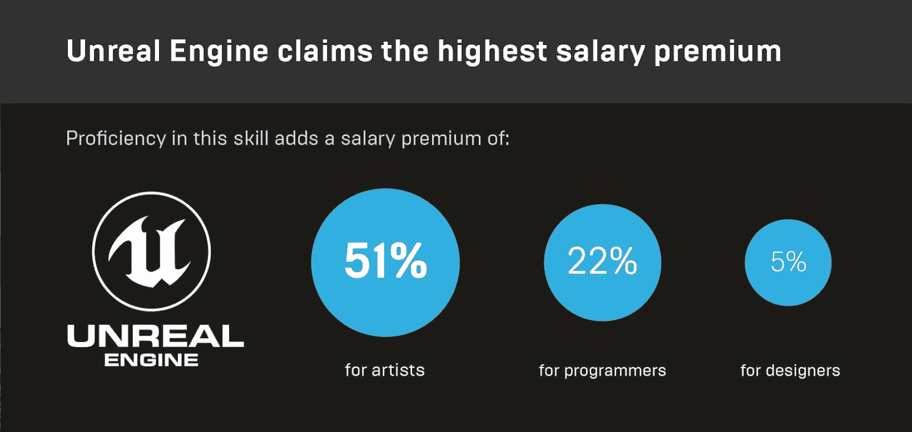
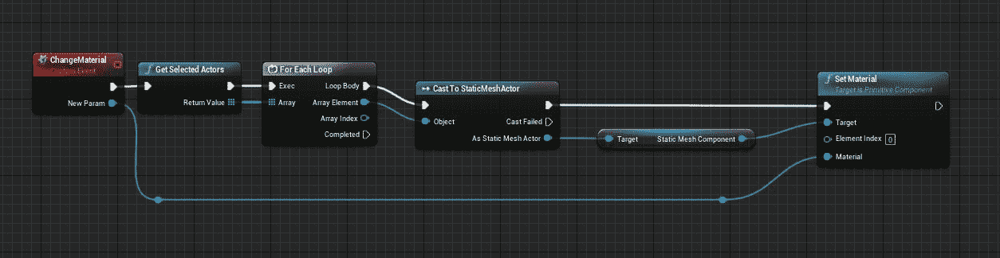
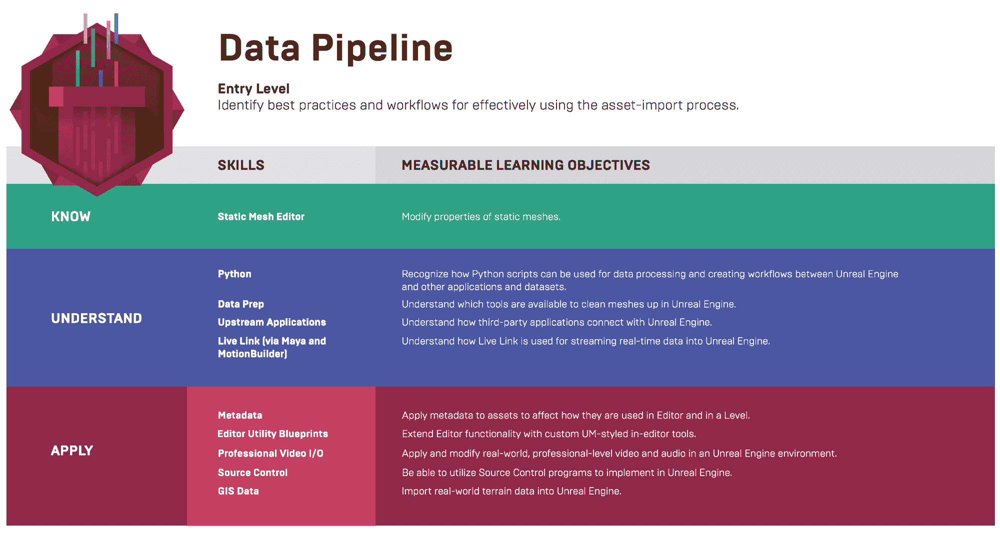
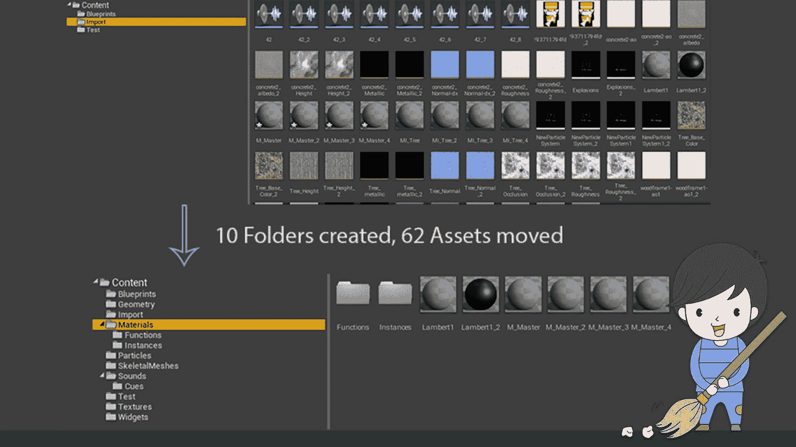
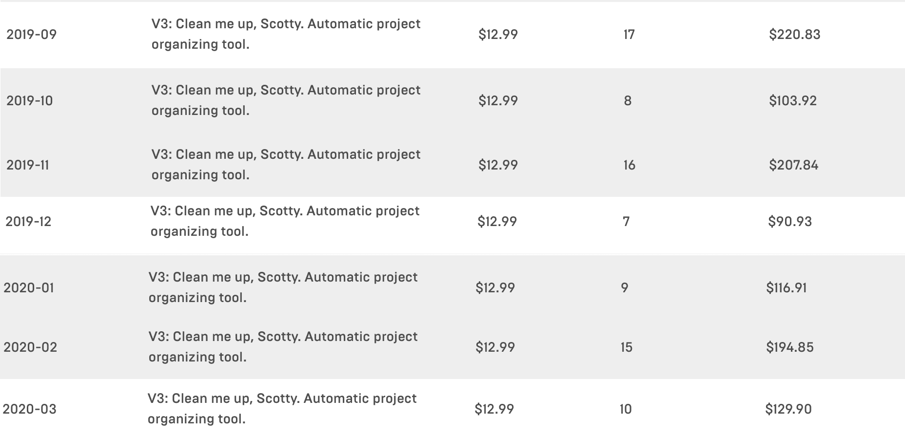

# 如何成为一个虚幻的自动化专家

> 原文：<https://www.freecodecamp.org/news/becoming-an-unreal-automation-expert/>

## 目录

1.  [使用蓝图、C++和 Python 实现工作流程自动化](#automating-workflows-with-blueprints-c-and-python)
2.  [虚幻引擎为什么有趣](#why-the-unreal-engine-is-interesting)
    *   [为什么要在工作流程甚至游戏编程中使用蓝图](#why-use-blueprints-for-workflow-and-even-game-programming)
    *   [为什么使用 C++进行工作流和游戏编程](#why-use-c-for-workflow-and-game-programming)
    *   [为什么使用 Python 进行工作流优化](#why-use-python-for-workflow-optimisation)
3.  [使用 Python 编写我们自己的自动化项目清理脚本](#writing-our-own-automated-project-clean-up-script-using-python)
    *   但是这有回报吗？
4.  [了解如何通过 Udemy 上的脚本自动化和优化工作流程](#learn-how-to-automate-and-optimise-workflows-with-scripting-on-udemy)

## 使用蓝图、C++和 Python 实现工作流自动化

每项工作都有可以自动化的重复性任务和流程。这些任务会占用你大量的时间。

只具备基本脚本知识的人可以构建一个脚本，将执行这些任务的时间减少到最低限度。从长远来看，节省下来的时间会累积成更多的时间，用于更有效率的工作。

因此，学习如何将事情自动化是一项无价的技能。这种技能可以在不同的、更具体的领域获得，然后应用于其他更普遍的领域。

尤其是考虑到当前的困难时期，学习一门对你的就业能力有重大影响的新技能是至关重要的。

在本文中，我们想要描述在使用像虚幻引擎这样的实时软件时自动化的重要性。

## 虚幻引擎为什么有趣

Epic 的虚幻引擎是最受欢迎的游戏和实时 3D 应用之一。它用于创建娱乐内容，如游戏和互动设置。

虚拟和增强现实等学科需要使用复杂的流程，就像任何其他管道一样，可以通过自动化进行优化。

除此之外，游戏和 3D 实时市场也在持续增长，这增加了对人才的需求。

根据劳动力市场分析公司 [Burning Glass Technologies](https://www.burning-glass.com/) 进行的一项研究，虚幻开发者**的平均工资去年增长了 22%**，艺术家的**工资增长了 51%** 。



Source: [https://www.unrealengine.com/en-US/blog/demand-for-unreal-engine-and-real-time-3d-skills-at-all-time-high](https://www.unrealengine.com/en-US/blog/demand-for-unreal-engine-and-real-time-3d-skills-at-all-time-high)

### 为什么要使用工作流程甚至游戏编程的蓝图

除了通用的 C++编程接口，虚幻引擎还提供了一个名为 Blueprints 的**图形化编程系统。它们以 C++代码的形式公开了全部功能，这意味着一切，包括游戏中的功能，都可以在没有巨大性能缺陷的情况下进行编程。**

图形界面允许我们快速地将实体组成一个流来创建功能。看一个为静态网格角色设置材质的例子，我们可以看到蓝图很容易阅读。



Blueprints script to set a material for a static mesh actor

### 为什么使用 C++进行工作流和游戏编程

为虚幻引擎编码的“本地”方法是 C++。它用于创建游戏中的逻辑，简化关卡创建和工作流程，并改善开发管道。它比 Blueprints 更复杂，也更难学习，但可以在运行时间和性能上增加额外的提升。

它的**性能优势**使它成为游戏开发中渲染和物理等基本、底层操作的首选语言。对于已经精通 C++的开发人员来说，不需要直接学习额外的语言就能够自动化流程是一个方便的补充。

### 为什么使用 Python 进行工作流优化

与 Blueprints 或 C++相比，Python 是用于自动化任务的事实上的标准语言之一。它简单易学，易于理解，而且非常通用，因为它几乎可以在任何平台上运行，无需额外的努力。

Epic 在他们的**[Creator ' s Field Guide to Emerging Careers in Interactive 3D](https://epicgames.ent.box.com/s/n12ixy53l8cknz73npimsr54frkvm72c)中，将 Python 列为数据管道工的必备技能之一。**



https://epicgames.ent.box.com/s/n12ixy53l8cknz73npimsr54frkvm72c

虚幻引擎有完整的 Python 脚本支持。可惜不适合实时和游戏内脚本，只能用于虚幻编辑器脚本。然而，Python 的简单性使它成为管道自动化快速原型化的一个不可思议的选择。

Epic 自己试图通过使用[文档](https://docs.unrealengine.com/en-US/Engine/Editor/ScriptingAndAutomation/Python/index.html)、 [API 文档](https://docs.unrealengine.com/en-US/PythonAPI/index.html)，甚至是[录制的关于虚幻引擎 Python 脚本的网络研讨会](https://m.youtube.com/watch?v=0guOMTiwmhk)来推广 Python 的使用。

## 使用 Python 编写我们自己的自动化项目清理脚本

较大的项目会很快变得一团糟。手头有一个脚本，可以通过查看我们选择的所有资产并自动将它们移动到适当的文件夹中来进行清理，这有助于我们大幅改进工作流程。

下面的示意图解释了脚本背后的想法。



> 截至目前，Unreal 中默认设置的 Python 版本是 Python 2.7。如果想用 Python 3，可以按照这里描述的流程[切换到 Python 3。](https://docs.unrealengine.com/en-US/Engine/Editor/ScriptingAndAutomation/Python/index.html)

首先，我们首先需要将虚幻库导入到我们的作用域中。一旦我们完成了这些，我们就可以创建基本类的类实例了。现在，我们只需要`[EditorUtilityLibrary](https://docs.unrealengine.com/en-US/PythonAPI/class/EditorUtilityLibrary.html?highlight=editorutilitylibrary)`来获取所有选中资产的列表。

我们可以通过使用 Python 的`len()`方法获得所选资产的数量，并使用 Unreal 的日志记录方法获得 Unreal 引擎中调试日志上的输出。

```
import unreal

# create unreal class instances
editor_util = unreal.EditorUtilityLibrary()

# get the selected assets
selected_assets = editor_util.get_selected_assets()
num_assets = len(selected_assets)

unreal.log(num_assets)
```

上面的代码片段将向`Debug Log`输出一个数字。对于每个选择的资产，我们现在想要获得一些信息，比如资产名称和类别。

Unreal `[ObjectBase](https://docs.unrealengine.com/en-US/PythonAPI/class/_ObjectBase.html?highlight=objectbase#unreal._ObjectBase)`对象有几个助手方法来获取名称、类和其他属性。我们将利用`get_fname()`和`get_class()`方法。

```
for assets in selected_assets:
    # get the class instance and the clear text name
    asset_name = asset.get_fname()
    asset_class = asset.get_class()

    unreal.log("{} - {}".format(asset_name, asset_class))
```

然而，这只会给我们类的定义，而不是类本身的明文名称，我们想用它来创建文件夹。

为了获得显示名称而不是类定义，我们需要创建一个`[SystemLibrary](https://docs.unrealengine.com/en-US/PythonAPI/class/SystemLibrary.html?highlight=systemlibrary)`的实例。它的`get_class_display_name()`方法接受一个类定义，并以`String`的形式返回类名。

```
# create unreal class instances
editor_util = unreal.EditorUtilityLibrary()
system_lib = unreal.SystemLibrary()

...

for assets in selected_assets:
    # get the class instance and the clear text name
    asset_name = asset.get_fname()
    asset_class = asset.get_class()
    class_name = system_lib.get_class_display_name(asset_class)

    unreal.log("Name: {} - Class: {}".format(asset_name, class_name)) 
```

现在，我们可以在日志中看到类似“Name:new Material-Class:Material”的内容。这正是我们需要的那种信息。

最后一步是将我们的资产“重命名”到一个给定的位置。例如，每个材料将被重命名为`"/Material/<Name of Material Asset>"`，这将把它移动到根据文件夹中。

为了“重命名”资产，我们需要一个额外的类。`rename_loaded_asset()`方法是 [`EditorAssetLibrary`](https://docs.unrealengine.com/en-US/PythonAPI/class/EditorAssetLibrary.html?highlight=editorassetlibrary) 的一部分，所以我们需要先创建这个类的一个实例。除此之外，我们还必须创建一个新的位置，资产将被重新定位到该位置。

为了保持平台独立性，我们将使用`os`模块及其`path.join()`方法。

一旦我们创建了`new_path`变量，我们就可以在对`rename_loaded_asset()`的方法调用中使用它来重新定位我们当前的资产。

```
import os
import unreal

# create unreal class instances
editor_util = unreal.EditorUtilityLibrary()
system_lib = unreal.SystemLibrary()
editor_asset_lib = unreal.EditorAssetLibrary()

...

for assets in selected_assets:
    # get the class instance and the clear text name
    asset_name = asset.get_fname()
    asset_class = asset.get_class()
    class_name = system_lib.get_class_display_name(asset_class)

    # assemble new path and relocate asset
    new_path = os.path.join("/Game", class_name, asset_name)
    editor_asset_lib.rename_loaded_asset(asset_name, new_path)

    unreal.log("Moved {} to {}".format(asset_name, new_path))
```

在虚幻引擎中执行这个脚本，日志会给你提供这样一条消息:`"Moved NewMaterial to /Game/Material/NewMaterial"`。
观察我们的项目，我们现在可以看到所有选择的资产都被清理到根据它们的类别命名的文件夹中。

如您所见，创建一个基本脚本非常简单。当然，我们需要注意错误处理、合适的日志记录以及更复杂工具的友好用户界面，但是即使是简单的脚本也可以节省大量时间。

## 但这有回报吗？

为了向您展示这个领域对自动化的需求有多大，这里有一个工具的**月销售额的截图，该工具的功能包含我们在本文中创建的脚本。**



当然，了解在虚幻引擎中工作的用户和艺术家的需求以了解哪些任务适合自动化是必不可少的。

## 了解如何使用 Udemy 上的脚本自动化和优化工作流程

为了帮助缩小虚幻脚本资源的缺口，我们创建了一个 **[广泛的 Udemy 点播课程](https://www.udemy.com/course/becoming-an-unreal-automation-expert/?referralCode=F42ED1F45E3543848AEE)** 从头开始学习虚幻引擎编辑器脚本。

您可以使用促销代码，[**automateun real 20**](https://www.udemy.com/course/draft/2969558/?referralCode=F42ED1F45E3543848AEE)**。你现在只需花 10 美元就能得到这门课程。这比星巴克的三杯星冰乐还少！**


如果您有任何问题或反馈，请随时通过 Twitter 或直接在课程的讨论部分联系我们:)