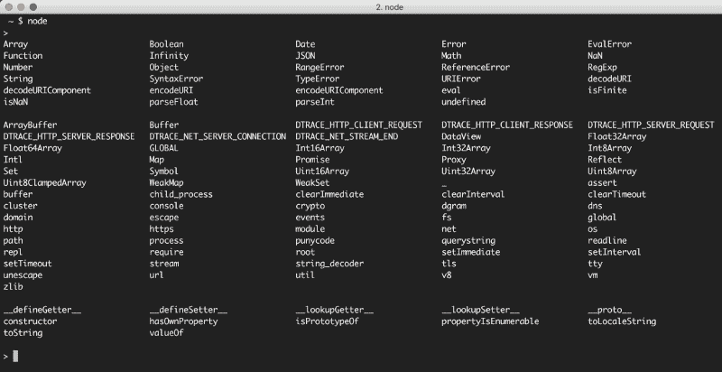

# 在您埋头于包之前，先了解 Node.js 运行时本身

> 原文：<https://www.freecodecamp.org/news/before-you-bury-yourself-in-packages-learn-the-node-js-runtime-itself-f9031fbd8b69/>

> **更新:**这篇文章现在是我的书《Node.js Beyond The Basics》的一部分。

> 阅读此内容的更新版本和更多关于节点在**的信息。**

**本文将挑战您 Node.js 知识的极限。**

**在 Ryan Dahl 第一次[介绍了](https://www.youtube.com/watch?v=ztspvPYybIY)node . js 之后不久，我就开始学习它，甚至在一年前，我还不能回答我在这篇文章中提出的许多问题。如果您真的能回答所有这些问题，那么您对 Node.js 的了解就非常丰富了。我们应该成为朋友。**

**我认为这个挑战会让你大吃一惊的原因是，我们中的许多人一直在以错误的方式学习 Node。大多数关于节点的教程、书籍和课程都关注节点生态系统，而不是节点运行时本身。他们专注于教你在使用 Node 时可以用所有可用的包做什么，比如 Express 和 Socket。IO，而不是教导节点运行时本身的功能。**

**这是有充分理由的。节点是原始的和灵活的。它不提供完整的解决方案，而是提供丰富的运行时，使您能够实现自己的解决方案。像 Express.js 和 Socket 这样的库。IO 更多的是完整的解决方案，所以教授这些库更有意义，这样你就可以让学习者使用这些完整的解决方案。**

**传统观点似乎认为只有那些工作是编写像 Express.js 和 Socket 这样的库的人。IO 需要了解 Node.js 运行时的一切。但我认为这是错误的。在使用这些完整的解决方案之前，对 Node.js 运行时本身有一个坚实的理解是你能做的最好的事情。您至少应该有知识和信心通过代码来判断一个包，这样您就可以做出使用它的明智决定。**

**这就是为什么我决定创建一个完全致力于纯节点的 [Pluralsight 课程](https://www.pluralsight.com/courses/nodejs-advanced)。在为课程做研究时，我为您整理了一个特定问题的列表，以确定您对节点运行时的知识是否已经足够强大，或者是否可以改进。**

**如果你能回答这些问题中的大部分，并且你正在找工作，请告诉我！另一方面，如果这些问题让您大吃一惊，您只需要优先学习节点运行时本身。你的知识会让你成为一个更受欢迎的开发者。**

### **Node.js 知识挑战:**

**其中一些问题简短而简单，而另一些则需要更长的答案和更深入的知识。它们在这里都没有特定的顺序。**

**我知道你在读完这份清单后会想要答案。下面的建议部分有一些答案，但我也会在这篇文章之后的一系列 freeCodeCamp 文章中回答所有这些问题。不过我先调侃一下你的知识吧！**

1.  **Node.js 和 V8 是什么关系？Node 没有 V8 能工作吗？**
2.  **为什么在任何 Node.js 文件中声明一个全局变量时，它并不是对所有模块都是全局的？**
3.  **在导出一个节点模块的 API 时，为什么有时候可以用`exports`而其他时候却要用`module.exports`？**
4.  **我们可以不使用相对路径而需要本地文件吗？**
5.  **同一个包的不同版本可以在同一个应用程序中使用吗？**
6.  **什么是事件循环？是 V8 的一部分吗？**
7.  **什么是调用栈？是 V8 的一部分吗？**
8.  **`setImmediate`和`process.nextTick`有什么区别？**
9.  **如何让异步函数返回值？**
10.  **回调可以和承诺一起使用吗？还是只能这样？**
11.  **其他大部分节点模块实现的是什么节点模块？**
12.  **`spawn`、`exec`、`fork`的主要区别是什么？**
13.  **集群模块是如何工作的？它与使用负载平衡器有什么不同？**
14.  **有哪些`--harmony-*`旗帜？**
15.  **如何读取和检查 Node.js 进程的内存使用情况？**
16.  **当调用堆栈和事件循环队列都为空时，Node 会做什么？**
17.  **什么是 V8 对象和函数模板？**
18.  **什么是 libuv，Node.js 如何使用？**
19.  **如何让 Node 的 REPL 一直使用 JavaScript 严格模式？**
20.  **什么是`process.argv`？它保存什么类型的数据？**
21.  **在节点流程退出之前，我们如何做最后一个操作？这个操作可以异步完成吗？**
22.  **在 Node 的 REPL 中，您可以使用哪些内置的点命令？**
23.  **除了 V8 和 libuv，Node 还有哪些外部依赖？**
24.  **流程`uncaughtException`事件有什么问题？和`exit`事件有什么不同？**
25.  **Node 的 REPL 里面的`_`是什么意思？**
26.  **节点缓冲区使用 V8 内存吗？它们可以调整大小吗？**
27.  **`Buffer.alloc`和`Buffer.allocUnsafe`有什么区别？**
28.  **缓冲区上的`slice`方法和数组上的方法有什么不同？**
29.  **`string_decoder`模块有什么用？它与将缓冲区转换为字符串有什么不同？**
30.  **require 函数的 5 个主要步骤是什么？**
31.  **如何检查局部模块的存在？**
32.  **`package.json`中的`main`属性有什么用？**
33.  **什么是节点中的循环模块依赖，如何避免？**
34.  **require 函数会自动尝试哪三种文件扩展名？**
35.  **当创建 http 服务器并为请求编写响应时，为什么需要使用`end()`函数？**
36.  **什么时候可以使用文件系统`*Sync`方法？**
37.  **怎么能只打印一层深度嵌套的对象呢？**
38.  **`node-gyp`包是用来做什么的？**
39.  **对象`exports`、`require`和`module`在每个模块中都是全局可用的，但是它们在每个模块中是不同的。怎么会？**
40.  **如果您执行一个只有一行代码的节点脚本文件:`console.log(arguments);`，node 到底会打印什么？**
41.  **一个模块如何既能被其他模块请求，又能使用`node`命令直接执行？**
42.  **Node 中既可读又可写的内置流的例子是什么？**
43.  **当 cluster.fork()行在节点脚本中执行时会发生什么？**
44.  **使用事件发射器和使用简单的回调函数来实现代码的异步处理有什么区别？**
45.  **`console.time`函数有什么用？**
46.  **可读流的暂停模式和流动模式有什么区别？**
47.  **`--inspect`参数对 node 命令有什么作用？**
48.  **如何从连接的套接字读取数据？**
49.  **`require`函数总是缓存它需要的模块。如果需要多次执行所需模块中的代码，该怎么办？**
50.  **当处理流时，什么时候使用管道函数，什么时候使用事件？这两种方法可以结合吗？**

### **我认为学习 Node.js 运行时的最佳方法**

**学习 Node.js 可能很有挑战性。以下是我希望能在这个过程中有所帮助的一些指导方针:**

#### **学习 JavaScript 的优秀部分，学习它的现代语法(ES2015 及以后)**

**Node 是 VM 引擎上的一组库，可以编译 JavaScript，因此不言而喻，JavaScript 本身的重要技能是 Node 的重要技能的子集。你应该从 JavaScript 本身开始。**

**你了解函数、[作用域](https://edgecoders.com/function-scopes-and-block-scopes-in-javascript-25bbd7f293d7#.2h7c9bt6l)、绑定、this 关键字、new 关键字、[闭包](https://medium.freecodecamp.com/whats-a-javascript-closure-in-plain-english-please-6a1fc1d2ff1c#.fs8bxulzo)、类、模块模式、原型、回调和承诺吗？你知道可用于数字、字符串、数组、集合、对象和地图的各种方法吗？熟悉这个列表中的项目将使学习节点 API 变得更加容易。例如，在很好地理解回调之前试图学习“fs”模块方法可能会导致不必要的混乱。**

#### **理解节点的非阻塞性质**

**回调和承诺(以及生成器/异步模式)对 Node 尤其重要。您需要理解异步操作是如何成为 Node 中的头等大事的。**

**您可以将节点程序中代码行的非阻塞特性与您点星巴克咖啡的方式进行比较(在商店里，而不是在汽车餐厅):**

1.  **下订单|给 Node 一些要执行的指令(一个函数)**
2.  **自定义您的订单，例如不加鲜奶油|给函数一些参数:`({whippedCream: false})`**
3.  **将您的姓名和订单一起提供给星巴克员工|使用您的函数给 Node 一个回调:`({whippedCream: false}, callback)`**
4.  **站到一边，星巴克的工作人员将从排在你后面的人那里接受订单。**
5.  **当你的订单准备好了，星巴克的工作人员会叫你的名字，给你你的订单|当你的函数被计算，Node.js 有一个准备好的结果，它会调用你的回调结果:`callback(result)`**

**我写了一篇关于这个的博文:[在星巴克看到的异步编程](https://edgecoders.com/asynchronous-programming-as-seen-at-starbucks-fc242cf16aa#.mx2cxr3hi)**

### **了解 JavaScript 并发模型以及它是如何基于事件循环的**

**有一个堆栈、一个堆和一个队列。你可以阅读这方面的书籍，但仍然不能完全理解，但我保证你会明白的，如果你看看这个家伙。**

 **[https://www.youtube.com/embed/8aGhZQkoFbQ?feature=oembed](https://www.youtube.com/embed/8aGhZQkoFbQ?feature=oembed)** 

**Philip 解释了浏览器中的事件循环，但几乎完全相同的事情也适用于 Node.js(有一些不同)。**

#### **理解一个节点进程是如何永不休眠的，并且会在无事可做时退出**

**节点进程可以是空闲的，但它从不休眠。它跟踪所有未完成的回调，如果没有什么要执行的，它将退出。为了保持一个节点进程的运行，你可以使用一个`setInterval`函数，因为这将在事件循环中创建一个永久挂起的回调函数。**

#### **了解可以使用的全局变量，如进程、模块和缓冲区**

**它们都定义在一个全局变量上(在浏览器中通常与`window`变量相比较)。在一个节点的 REPL 中，键入`global.`并点击 tab 键来查看所有可用的项目(或者在一个空行上简单的双击)。其中一些条目是 JavaScript 结构(比如`Array`和`Object`)。其中一些是节点库函数(比如`setTimeout`，或者`console`打印到`stdout` / `stderr`)，还有一些是节点全局对象，可以用于某些任务(例如，`process.env`可以用于读取主机环境变量)。**

****

**你需要理解列表中的大部分内容。**

#### **了解如何使用 Node 附带的内置库，以及它们如何关注“网络”**

**其中一些会感觉很熟悉，例如*计时器*，因为它们也存在于浏览器中，并且 Node 正在模拟该环境。但是，要学的还很多，像`fs`、`path`、`readline`、`http`、`net`、`stream`、`cluster`、...(上面的自动完成列表已经全部完成)。**

**例如，您可以使用`fs`来读/写文件，可以使用`http`来运行流就绪 web 服务器，可以使用`net`来运行 tcp 服务器和程序套接字。如今的 Node 比一年前强大得多，而且通过不断的改进，它变得越来越好。在您寻找一个包来完成一些任务之前，首先要确保您不能使用内置节点包来完成这些任务。**

**`events`库尤其重要，因为大多数节点架构都是事件驱动的。**

**关于节点 API ，你总是可以学到更多的东西，所以继续扩展你的视野吧。**

#### **理解为什么节点被命名为节点**

**您构建简单的单进程构建块(节点),可以用良好的网络协议将它们组织起来，使它们相互通信，并向上扩展以构建大型分布式程序。扩展节点应用程序不是事后才想到的——它本身就包含在名称中。**

#### **阅读并尝试理解为 Node 编写的一些代码**

**选择一个框架，比如 Express，试着理解它的一些代码。对你不明白的事情提出具体的问题。我尽可能在 [jsComplete slack 频道](https://slackin-bfcnswvsih.now.sh/)上回答问题。**

**最后，在不使用任何框架的情况下，用 Node 编写一个 web 应用程序。尝试处理尽可能多的情况，用 HTML 文件响应，解析查询字符串，接受表单输入，并创建一个用 JSON 响应的端点。**

**还可以尝试编写一个聊天服务器，发布一个 npm 包，并为一个开源的基于节点的项目做贡献。**

**祝你好运！感谢阅读。**

**学习 React 还是 Node？签出我的图书:**

*   **[通过构建游戏学习 react . js](http://amzn.to/2peYJZj)**
*   **[Node.js 超越基础](http://amzn.to/2FYfYru)**