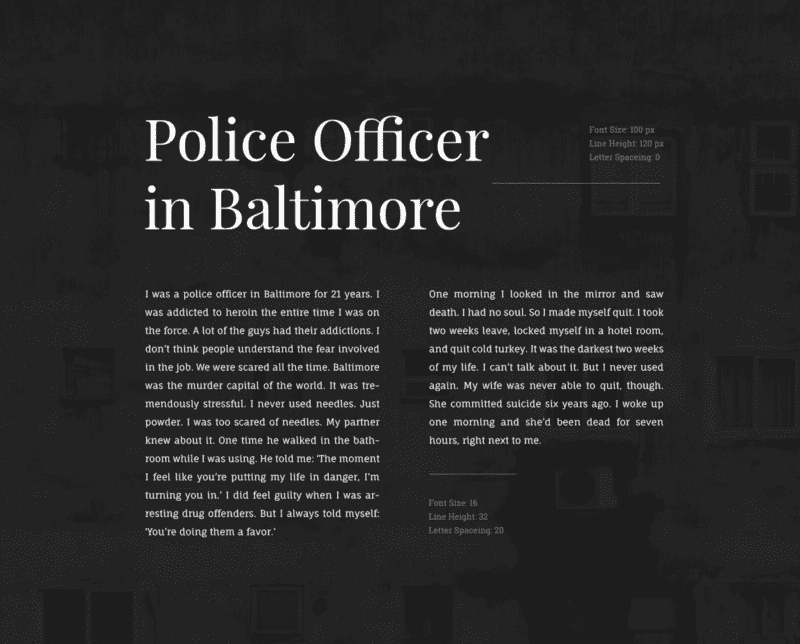
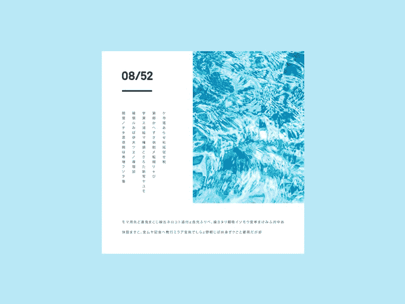
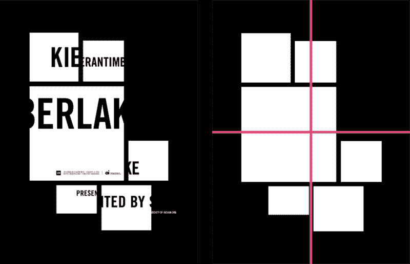
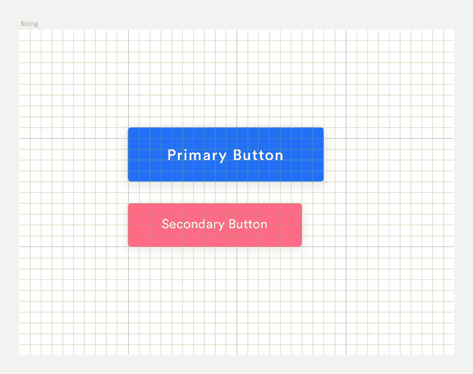
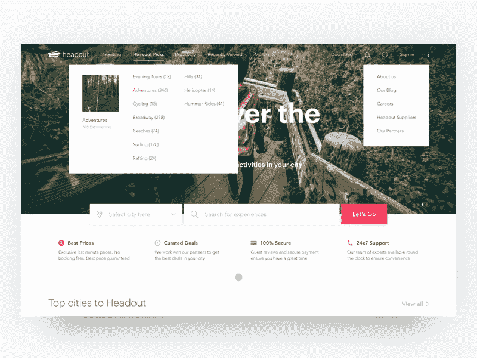

# 在你掌握设计之前，你必须先掌握基本原理

> 原文：<https://www.freecodecamp.org/news/before-you-can-master-design-you-must-first-master-the-fundamentals-1981a2af1fda/>

上周，我的一位读者发来一个问题:**我如何成为一名更好的视觉设计师？**

当我在思考如何回答这个问题时，我的思绪回到了我学习普通话的经历。最近，我决定自学普通话。说到学习一门新语言，你首先得从基础开始。名词、代词和动词构成了表达更复杂思想的基础。

语言是人们相互交流概念的一种方式。视觉设计是一种视觉语言。而学习视觉设计跟学习一门新语言没什么区别。

好的视觉设计不是天生的。它们是制造出来的。成为一名优秀的视觉设计师的关键是严谨。作为一名视觉设计师，只有你有意识地努力，你才会进步。

这里有一些你应该掌握的基础知识，这样你就可以把你的视觉设计提升到一个新的水平。

### 基础#1:回到类型的基础

你可以通过看他们的排版来了解一个设计师。这是因为字体是设计的基础。

[Type as imagery](https://dribbble.com/shots/1829402-Discount-Logotype)

只需键入文字，您就可以创建完整的设计。您也可以根据类型进行设计，从您选择的字体中提取微妙的队列。为了改善设计中的字体，首先从学习基础开始。

开发描述字体的词汇。了解跟踪、字距调整和行距等术语的含义。文章[一个你应该知道的精美插图印刷术语词汇表](https://designschool.canva.com/blog/typography-terms/)是学习这些术语的绝佳视觉资源。

然后，如果你想全面了解如何将排版应用于网页，请阅读[网页排版:应用于网页的排版风格的元素*。*](https://webtypography.net/toc/)

[Font pairing can make or break a design](https://www.behance.net/gallery/35768979/Typography-Google-Fonts-Combinations)

最后，学习如何将字体配对在一起。一个很好的资源就是 [FontWolf](https://www.typewolf.com/site-of-the-day/fonts/circular) 和 [FontPair](http://fontpair.co/) 。能够将字体配对将极大地改变你的设计。

要更深入地探索排版，你可以阅读我的文章:[排版可以成就你的设计……也可以打破它。](https://medium.com/@JonathanZWhite/typography-can-make-your-design-or-break-it-7be710aadcfe)

### 基本原则#2:利用空间创造平衡

间距有助于在设计中建立垂直和水平运动。这是创造视觉层次和形成元素之间的联系的关键。

[Create balance and visual harmony](https://dribbble.com/shots/3318361-Weekly-Mixtape-08-Margin)

你可以随时查看像 [Behance](https://www.behance.net/) 和 [Dribbble](https://dribbble.com/) 这样的网站，寻找如何分隔元素的灵感。但是**发展你自己的直觉对于利用空间创造平衡和视觉和谐很重要。**

在学习印刷术的时候，你可能已经注意到了字体间距的重要性。调整字体的字距和行距是一个很好的练习，可以锻炼你的间距眼。出于这个原因，我建议你试试 [KernType](http://type.method.ac/#) ，这是一个将你的字距调整解决方案与印刷工人的解决方案进行比较的游戏。

[Simplification of award winning poster by Craig Welsh](http://www.howdesign.com/design-competition-galleries/poster-design-awards/poster-design-winners/)

另一个有助于开发你的眼睛的练习如下:拿一个现有的设计，画一个 x 和 y 轴，将设计简化成基本形状，分析设计是如何平衡的，然后重新排列元素。密切注意负空间如何影响元素的平衡。

### 基础#3:使用尺寸来建立视觉层次

当谈到创建视觉层次，大小是首屈一指的。通过使用尺寸来传达元素之间的视觉关系，你可以建立流动。

Sizing is one of the reasons why grids are useful

规模是网格有用的原因之一。您可以使用网格来帮助您调整元素的大小，使用比率来传达重要性。

一旦确定了元素的大小，就要保持它在所有实例中的大小不变。在设计中，一致性是王道。

[Use size to establish visual hierarchy](https://dribbble.com/shots/2475367-Intercom-s-Developer-Hub)

#### 这里有一个练习，可以帮助你培养判断尺寸的眼光。

关键是寻求反馈。

绘制或绘制登录页面的草图。然后找个朋友看看你的设计。让他们圈出最突出的元素。然后，让他们根据视觉重量给圈出的元素编号。结果是你期望的吗？

做这个练习时，请记住以下问题:

*   登陆页的转化目标是什么？你如何优化以达到你的目标？
*   不同元素之间有什么关系？你想强调什么元素？
*   你的布局是否成功地引导用户浏览页面？

### 基本原则#4:用颜色传达意思

颜色扮演着许多角色。它传达意义，创造情感共鸣，给设计带来统一。

[Color helps convey meaning in design](https://dribbble.com/shots/3302492-Desktop-Search-Results)

要深入了解色彩，你可以阅读我的文章[色彩设计](https://medium.freecodecamp.com/designing-in-color-abd358660a7b)。下面是这篇文章的几个要点。

*   在选择调色板之前，确定你的设计目的。好的设计使它的调色板与其目的一致。
*   确定你的受众。人们对颜色的感知是不同的。基于个人喜好、文化教养和经历，颜色对人有不同的影响。
*   选择调色板时，简单是关键。选择中性背景色。然后选择主要和次要强调色。最后，根据你的其他颜色，为你不同的 UI 状态选择一个错误和成功的颜色。

一旦你很好地掌握了色彩理论的基础，色彩就归结为实验和迭代。积极尝试打破你的舒适区，尝试新的调色板。

Movies and shows are a great source of color inspiration

#### 这里有一个练习可以帮助你发展对颜色的判断力。

花点时间为你周围的东西，比如照片、杂志和你最喜欢的节目准备调色板。然后采用一个现有的设计，并应用新的调色板。

注意它是如何改变设计的情绪和基调的。它也改变了意思吗？

把你的工作当成一门手艺，因为总有你可以改进的地方。**依靠自己成为成为更好设计师的动力。**

作为一名设计师，你有什么提高自己的策略？给我留言或者在 Twitter 上给我发一条 [tweet](https://twitter.com/jonathanzwhite) 。

如果你喜欢这篇文章，你可能也会喜欢用阿芙罗狄蒂写的 Javascript 中的 CSS，阿芙罗狄蒂是汗学院的一个库。

[**Javascript 中的 CSS:基于组件的样式化的未来**](https://medium.com/@JonathanZWhite/css-in-javascript-the-future-of-component-based-styling-70b161a79a32)
[*本周，我想向大家介绍可汗学院的《阿芙罗狄蒂与 Javascript》中 CSS 的概念。阿芙罗狄蒂让……*medium.com](https://medium.com/@JonathanZWhite/css-in-javascript-the-future-of-component-based-styling-70b161a79a32)

你可以在我每周发表文章的媒体上找到我。或者你可以在 Twitter 上关注我，在那里我会发布一些关于设计、前端开发和虚拟现实的无聊言论。

如果你喜欢这篇文章，如果你点击？并与朋友分享。

