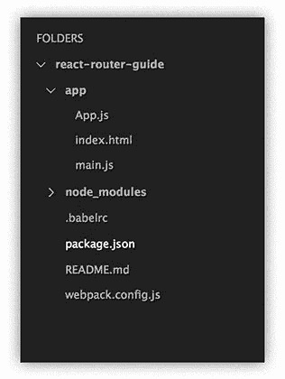
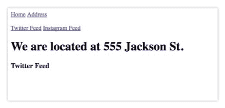
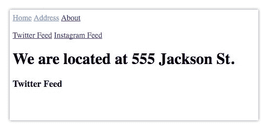
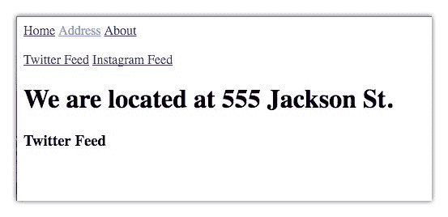
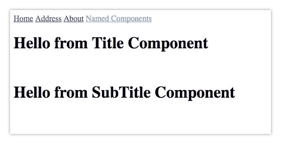
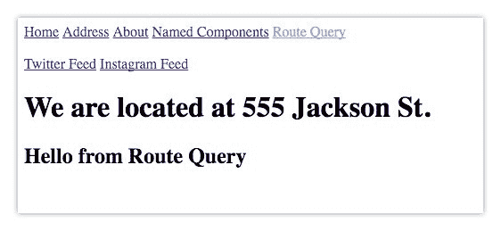

# React 路由器初学者指南

> 原文：<https://www.freecodecamp.org/news/beginner-s-guide-to-react-router-53094349669/>

作者:纳德·达比特

# React 路由器初学者指南

或者说我希望从 React 路由器开始时就知道的事情。

> 点击[此处](https://github.com/dabit3/beginners-guide-to-react-router)进入 Github repo

> 本教程使用 React 路由器版本 2.0.1 和 Babel 版本 6.7.4

React 路由器是 React 的标准路由库。从文档中:

> “React Router 使您的用户界面与 URL 保持同步。它有一个简单的 API，内置了强大的功能，如惰性代码加载、动态路径匹配和位置转换处理。让 URL 成为你的第一个想法，而不是事后的想法。”

### 第一步。入门指南

要开始，您可以[克隆 starter repo](https://github.com/dabit3/beginners-guide-to-react-router) 并跳到第二步，或者按照接下来的步骤手动设置您的项目。

#### **手动设置**

首先，让我们用 React、Babel 和 webpack 来设置我们的环境。首先创建一个文件夹并放入 cd。然后运行 npm init -y:

```
npm init -y
```

*   -你只要对所有的问题都回答“是”

接下来，安装 react、react-router 和 react-dom，并将它们保存为依赖项:

```
npm i react react-dom react-router@2.0.1 --save
```

接下来，安装我们的开发依赖项。这些将是 webpack、webpack-dev-server、babel-core、babel-loader、babel-preset-es2015 和 babel-preset-react

```
npm i webpack webpack-dev-server babel-core babel-loader babel-preset-es2015 babel-preset-react --save-dev
```

现在，让我们为 webpack 和 babel 创建配置文件:

```
touch .babelrc webpack.config.js
```

接下来，让我们为代码创建一个文件夹。我们称这个文件夹为应用程序:

```
mkdir app
```

在 app 目录下创建三个文件:index.html app . js main . js

```
cd apptouch index.html app.js main.js
```

我们的文件结构现在应该是这样的:



现在，打开。babelrc 文件并添加 react 和 ES2015 的预置:

```
{ "presets": [  "es2015",  "react" ]}
```

在 webpack.config.js 中，添加以下配置让我们开始:

```
module.exports = {  entry: './app/main.js',  output: {    path: './app',    filename: 'bundle.js'  },  devServer: {    inline: true,    contentBase: './app',    port: 8100  },  module: {    loaders: [      {        test: /\.js$/,        exclude: /node_modules/,        loader: 'babel'      }    ]  }}
```

> 如果你想了解更多关于 webpack 和 babel 的知识，请查看我的入门教程。

现在 webpack 和 babel 已经建立。让我们为 webpack-dev-server 创建一个快捷方式。打开 package.json 并在“scripts”键中插入以下脚本:

```
"scripts": {  "start": "webpack-dev-server"}
```

现在，我们可以运行 npm start 来启动我们的项目。

让我们现在设置我们的 HTML 和反应。打开 index.html 并创建一个基本的 html 页面。然后，添加一个 id 为 root 的 div 和一个引用 bundle.js 的脚本标记:

```
<!DOCTYPE html>  <html lang="en">  <head>    <meta charset="UTF-8">    <title>React Router</title>  </head>  <body>    <div id="root"></div>    <script src="./bundle.js"></script>  </body></html>
```

现在，让我们进入 main.js 并为我们的应用程序设置一个入口点。在 main.js 文件中键入以下内容:

```
import React from 'react'import ReactDOM from 'react-dom'import App from './app'ReactDOM.render(<App />, document.getElementById('root'))
```

现在，让我们进入 app.js 并创建我们的应用程序组件。打开 app.js 并键入以下内容:

```
import React, { Component } from 'react'import { Router, Route, Link, IndexRoute, hashHistory, browserHistory } from 'react-router'
```

```
const App = () => <h1>Hello World!</h1>
```

```
export default App
```

我们还没有使用 Component 或任何路由器/ react-router 组件，但是我们正在引入它们，以便我们可以开始第二步。

现在，如果您运行项目并导航到 [http://localhost:8100/](http://localhost:8100/) ，您应该会看到“Hello World！！！！！!'在您的屏幕上:

```
npm start
```


Hello World

### 第二步。基本路由

让我们建立一个基本路线。我们将用一个 React 类替换 App 组件，它将返回一个路由器组件。路由器将包装我们将要定义的所有路由。

每条路线将在一个<route>组件中被识别。组件有两个属性:路径和组件。当一个路径匹配给<route>组件的路径时，它将返回指定的组件。</route></route>

在 app.js 中，重构应用程序组件，如下所示:

```
import React, { Component } from 'react'import { Router, Route, Link, IndexRoute, hashHistory, browserHistory } from 'react-router'
```

```
class App extends Component {  render() {    return (      <Router history={hashHistory}>        <Route path='/' component={Home} />        <Route path='/address' component={Address} />      </Router>    )  }}
```

```
const Home = () => <h1>Hello from Home!</h1>const Address = () => <h1>We are located at 555 Jackson St.</h1>
```

```
export default App
```

现在，如果您导航到 [http://localhost:8100/](http://localhost:8100/) 您应该看到我们的 Home 组件，如果您导航到[http://localhost:8100/#/address](http://localhost:8100/#/address)您应该看到我们的 Address 组件。

您会注意到地址栏中的散列后有随机字符串:

> 当使用哈希历史时，您会在查询字符串中看到一个类似于 _k=123abc 的额外项。这是一个键，历史记录使用它在页面加载之间在 window.sessionStorage 中查找持久状态数据。点击此处阅读更多内容。

如果您想要一个更清晰的地址，或者您正在生产中使用它，您可能想要研究 browserHistory vs hashHistory。当使用 browserHistory 时，您必须有一个在任何路由下都能返回您的服务器的服务器，例如，如果使用 nodejs，则像下面这样的配置(来自文档)将会起作用:

```
const express = require('express')const path = require('path')const port = process.env.PORT || 8080const app = express()// serve static assets normallyapp.use(express.static(__dirname + '/public'))// handle every other route with index.html, which will contain// a script tag to your application's JavaScript file(s).app.get('*', function (request, response){  response.sendFile(path.resolve(__dirname, 'public', 'index.html'))})app.listen(port)console.log("server started on port " + port)
```

要了解更多关于 browserHistory 的信息，请点击此链接。

在本教程的剩余部分，我们将使用 hashHistory。

### 第三步。404 路线

现在，如果我们遇到一条没有定义的路线会发生什么？让我们设置一个 404 路由和组件，如果找不到该路由，它将返回:

```
const NotFound = () => (  <h1>404.. This page is not found!</h1>)
```

现在，在下面的*我们的'/address '路线中，创建如下路线:*

```
<Route path='*' component={NotFound} />
```

现在，如果我们导航到某个尚未定义的路由([http://localhost:8100/#/asdfasdf](http://localhost:8100/#/asdfasdf))，我们应该会看到我们的 404 路由。

### 第四步。索引路由和链接

现在，让我们添加导航，让我们之间的网页。

为此，我们将使用<link>组件。<link>类似于使用一个 html 锚标签。

从文档中:

> 允许用户在应用程序中导航的主要方式。将使用适当的 href 呈现一个完全可访问的锚标签。

为此，让我们首先创建一个导航组件。我们的 Nav 组件将包含<link>组件，如下所示:

```
const Nav = () => (  <div>    <Link to='/'>Home</Link>     <Link to='/address'>Address</Link>  </div>)
```

现在我们需要一种方法来使我们的导航组件在所有页面上保持持久。为此，我们将把我们的子路由包装在一个主要的<路由>组件中。我们还需要更新我们的 Home 组件，并创建一个名为 Container 的新组件:

容器:

```
const Container = (props) => <div>  <Nav />  {props.children}</div>
```

`{props.children}`将允许此路线中包装的任何路线在此组件中呈现。

现在，让我们重新编写我们的应用程序组件，如下所示。我们将我们的主页、地址和未找到的路线包装在新的集装箱路线中。我们还将主页设置为我们的索引路径。这意味着当我们点击 [http://localhost:8100](http://localhost:8100/#/) 时，我们的 Home 组件将呈现，因为它被指定为索引:

```
class App extends Component {  render () {    return (      <Router history={hashHistory}>        <Route path='/' component={Container}>          <IndexRoute component={Home} />          <Route path='/address' component={Address} />          <Route path='*' component={NotFound} />        </Route>      </Router>    )  }}
```

作为参考，我们完整的 app.js 代码应该类似于[这个](https://gist.github.com/dabit3/3d0d47c4a8bfccadfd5d15c58cfb1424)。

现在，当我们导航到 [http://localhost:8100](http://localhost:8100/) 时，我们应该会看到我们的 Home 组件，以及我们的 Nav < Link >组件！

### 第五步。多个子/索引路由

现在，假设我们想在地址组件中嵌套一个 twitter feed 和一个 Instagram feed。让我们创建这个功能。

首先，让我们重写我们的地址路由，加入两个新组件:InstagramFeed 和 TwitterFeed:

```
class App extends Component {  render () {    return (      <Router history={hashHistory}>        <Route path='/' component={Container}>          <IndexRoute component={Home} />          <Route path='address' component={Address}>            <IndexRoute component={TwitterFeed} />            <Route path='instagram' component={Instagram} />          </Route>          <Route path='*' component={NotFound} />        </Route>      </Router>    )  }}
```

我们已经将地址的 IndexRoute 设置为 TwitterFeed，并在那里添加了 Instagram 路由。

现在，让我们创建我们的 InstagramFeed 和 TwitterFeed 组件。这些都是非常基本的，只是为了让我们知道我们已经找到了正确的路线:

```
const Instagram = () => <h3>Instagram Feed</h3>const TwitterFeed = () => <h3>Twitter Feed</h3>
```

最后，进入 Address 组件，添加到新组件以及 props.children 的链接，因此组件将呈现为:

```
const Address = (props) => <div>  <br />  <Link to='/address'>Twitter Feed</Link>   <Link to='/address/instagram'>Instagram Feed</Link>  <h1>We are located at 555 Jackson St.</h1>  {props.children}</div>
```

现在，当我们导航到[http://localhost:8100/#/address](http://localhost:8100/#/address)时，address 组件应该和 TwitterFeed 组件一样呈现:



作为参考，到现在为止的代码应该是这样的[这个](https://gist.github.com/dabit3/0c2014b421f2bf98cd95d176f0b29bad)。

### 第六步。activeStyle / activeClassName 和 IndexLink

我们现在来看看如何根据路由是否活动来设计链接的样式。有两种主要方法可以做到这一点，要么直接添加样式，要么通过类添加样式。

从文档中:

> 可以知道它链接的路由何时激活，并在给定属性时自动应用 activeClassName 和/或 activeStyle。如果当前路线是链接路线或李**链接路线的任何后代，则`<link>`将被激活。要使链接仅在精确链接的[路线上激活，请使用](https://github.com/reactjs/react-router/blob/5e483bff96859aa23f42e79aa979632ddcbfd2bc/docs/API.md#indexlink) `<indexedlink>`或设置 onlya**activeonindex 属性。

首先，我们来看看 activeStyle。要应用 activeStyle，只需将 activeStyle 作为属性添加到`<link>`中，并传递您希望`<link>`具有的样式:

```
<Link activeStyle={{color:'#53acff'}} to=''>Home</Link>
```

让我们更新我们的导航组件来实现这一点:

```
const Nav = () => (  <div>    <Link activeStyle={{color:'#53acff'}} to='/'>Home</Link>     <Link activeStyle={{color:'#53acff'}} to='/address'>Address</Link>     <Link activeStyle={{color:'#53acff'}} to='/about'>About</Link>  </div>)
```

现在，让我们看看它在浏览器中的样子。您可能会注意到，当您点击地址时，该住宅仍会高亮显示:



这是因为当与 activeStyle 一起使用`<link>`时，如果当前路线是 l *着墨路线或 l* 着墨路线的任何后代，则`<link>`将被激活。

这意味着因为地址是 Home 的后代，所以它保持高亮显示。要解决这个问题，我们可以将 onlyActiveOnIndex 属性传递给链接组件:

```
<Link onlyActiveOnIndex activeStyle={{color:'#53acff'}} to='/'>Home</Link>
```

现在，当我们查看我们的浏览器时，只有当我们在确切的链接上时，该链接才会突出显示:



还有一个`<link>`的兄弟组件叫做`<indexlink>`。`<indexlink>`仅当当前路线完全是链接路线时才激活。

从文档中:

> `<indexlink>`是 l [ike a](https://github.com/reactjs/react-router/blob/5e483bff96859aa23f42e79aa979632ddcbfd2bc/docs/API.md#link) < Link >，只不过它只有在当前路由正是被链接的路由时才是活动的。相当于<链接>与 onlyActiveOnIndex 道具集。</indexlink>

要实现这一点，首先从 react-router 引入`<indexlink>`:

```
import { ..., IndexLink } from 'react-router'
```

现在，只需用`<indexlink>`组件替换 nav 中的`<link>`组件:

```
const Nav = () => (  <div>    <IndexLink activeStyle={{color:'#53acff'}} to='/'>Home</IndexLink>     <IndexLink activeStyle={{color:'#53acff'}} to='/address'>Address</IndexLink>     <IndexLink activeStyle={{color:'#53acff'}} to='/about'>About</IndexLink>  </div>)
```

现在，添加类 vs 样式怎么样？为此，我们可以使用 activeClassName。让我们在 index.html 中设置一个活动样式:

```
<style>  .active {   color:#53acff  }</style>
```

现在，我们将在导航组件中用 activeClassName 替换 activeStyle:

```
const Nav = () => (  <div>    <IndexLink activeClassName='active' to='/'>Home</IndexLink>     <IndexLink activeClassName='active' to='/address'>Address</IndexLink>     <IndexLink activeClassName='active' to='/about'>About</IndexLink>  </div>)
```

作为参考，我们的代码现在应该类似于[这个](https://gist.github.com/dabit3/ae4eeea9906c26e5643145664d540d0d)。

### 第七步。命名组件

使用命名组件，我们可以将组件指定为`<route>`的道具。

从文档中:

> 当一个路由有一个或多个命名组件时，子元素在 this.props 上按名称可用。在这种情况下，this.props.children 将是未定义的。所有路线组件都可以参与嵌套。

现在让我们深入研究代码，看看它实际上会是什么样子。

首先，让我们创建一个新组件，它将呈现我们命名的组件。这些组件将作为道具提供:

```
const NamedComponents = (props) => (  <div>    {props.title}<br />    {props.subTitle}  </div>)
```

接下来，让我们创建两个名为标题和副标题的新组件:

```
const Title = () => (  <h1>Hello from Title Component</h1>)const SubTitle = () => (  <h1>Hello from SubTitle Component</h1>)
```

现在，让我们为 NamedComponents 组件创建一个新的路由，并在 IndexRoute 中定义标题和副标题组件:

```
<Route path='/namedComponent' component={NamedComponents}>  <IndexRoute components={{ title: Title, subTitle: SubTitle }} /></Route>
```

最后，让我们添加一个导航到此组件的链接:

```
<IndexLink activeClassName='active' to='/namedComponent'>Named Components</IndexLink>
```

现在，当我们查看浏览器时，应该会看到新的命名组件链接，当单击该链接时，应该会看到标题和副标题组件呈现在屏幕上:



作为参考，我们的代码现在应该类似于[这个](https://gist.github.com/dabit3/5a75ecdba89dc2a45c1aaaf2727ddad1)。

### 第八步。路线参数

许多应用程序的基本部分是从 url 读取路由参数的能力。

为了实现这一点，让我们重温一下 About 组件。首先，让我们重写路由器中的路径，以获取一个可选参数，我们将其命名为:

```
<Route path='/about/:name' component={About} />
```

现在，让我们重写 About 组件以使用这个名称变量:

```
const About = (props) => (  <div>    <h3>Welcome to the About Page</h3>    <h2>{props.params.name}</h2>  </div>)
```

现在，如果我们访问[http://localhost:8100/#/About/Nader](http://localhost:8100/#/about/nader)，我们会看到我的名字显示在“欢迎来到关于页面”下面。

这里唯一的问题是，如果我们重新访问[http://localhost:8100/#/about](http://localhost:8100/#/about)，我们会得到 404，因为没有 name 参数。要解决这个问题，我们可以将参数用括号括起来，使其成为可选参数:

```
<Route path='/about(/:name)' component={About} />
```

现在，如果我们访问[http://localhost:8100/#/about](http://localhost:8100/#/about)我们不再得到 404，仍然可以访问 name 变量。

我们还可以进一步检查 props.name 是否可用，并显示一些内容:

```
{ props.params.name && <h2>Hello, {props.params.name}</h2>}
```

现在，只有在有 name 参数可用的情况下，才会显示内容。

作为参考，我们的代码现在应该类似于[这个](https://gist.github.com/dabit3/a31358742f837cf4826d55828931543f)。

### 第九步。查询字符串参数

您还可以将查询字符串作为道具传递给将在特定路径上呈现的任何组件，并以 props.location.query 的形式访问这些参数

要了解其工作原理，让我们创建一个名为 Query 的新组件，并呈现一个名为 props.location.query.message 的属性:

```
const Query = (props) => (  <h2>{props.location.query.message}</h2>)
```

现在，让我们在已经创建的地址路由中设置新的查询路由:

```
...<Route path='/address' component={Address}>  <IndexRoute component={TwitterFeed} />  <Route path='instagram' component={Instagram} />  <Route path='query' component={Query} /></Route>...
```

最后，让我们通过创建一个新的链接组件来链接到这个路由，并传入一个名为 message 的查询字符串并给它一个值。这是在我们已经使用的“to”属性中完成的。

我们不是传递一个指向“to”的链接，而是在一个对象中传递定义的路径名和查询属性:

```
<IndexLink   activeClassName='active'   to={{     pathname: '/address/query',     query: { message: 'Hello from Route Query' }   }}>Route Query</IndexLink>
```

现在，如果我们单击我们的路由查询链接，我们应该会看到我们的消息呈现在屏幕上:



作为参考，我们的代码现在应该类似于[这个](https://gist.github.com/dabit3/651f2dae058ff99810eb771c2817d622)。

这涵盖了 React 路由器入门的许多基本用例。

> 我的名字是纳德·达比特。我是[学校状态](https://www.schoolstatus.com/)的开发人员，在那里我们通过在一个地方提供所有数据来帮助教育工作者做出明智的教学决策。来看看我们的 [@schoolstatusapp。](https://twitter.com/schoolstatusapp)

> 如果你喜欢 React 和 React Native，在 [Devchat.tv](http://devchat.tv/) 上看看我们的播客 [React Native Radio](https://devchat.tv/react-native-radio)

> 如果你喜欢这篇文章，请推荐并分享它！谢谢你的时间