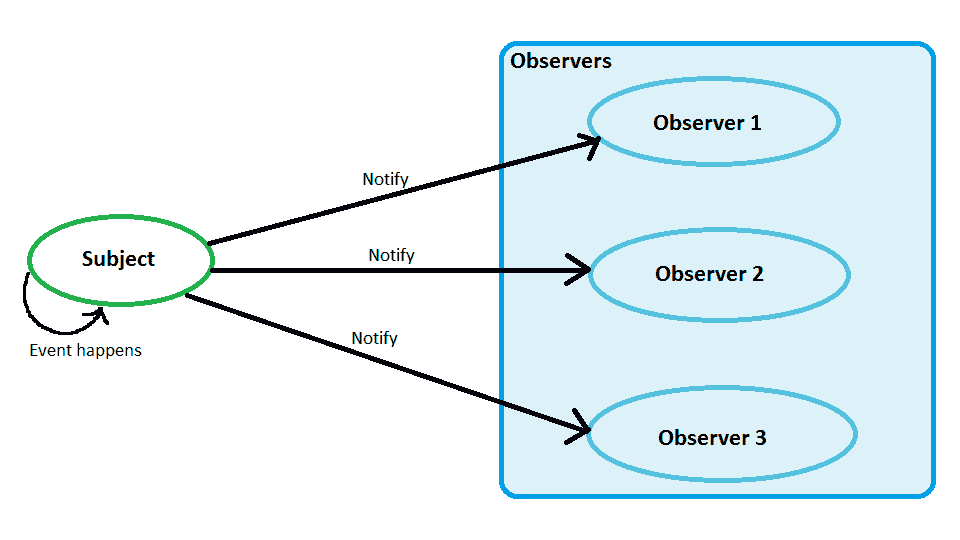
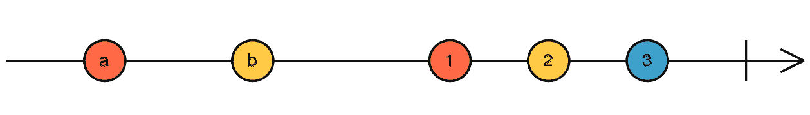
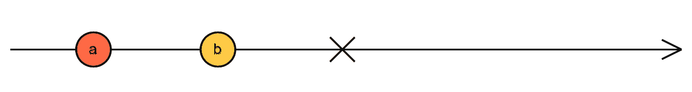
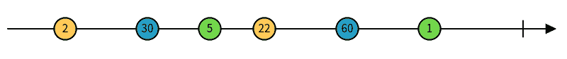
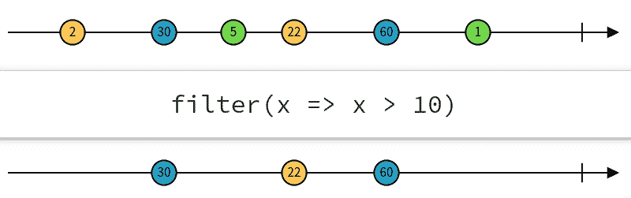

# RxJS & Redux Observable 初学者指南

> 原文：<https://www.freecodecamp.org/news/beginners-guide-to-rxjs-redux-observables/>

Redux-Observable 是一个基于 RxJS 的 Redux 中间件，允许开发者使用异步操作。它是 redux-thunk 和 redux-saga 的替代品。

本文涵盖了 RxJS 的基础知识，如何设置 Redux-Observables，以及它的一些实际用例。但在此之前，我们需要了解*观察者模式*。

## 观察者模式

在观察者模式中，一个称为“可观察的”或“主体”的对象维护着一个称为“观察者”的订阅者集合。当受试者的状态改变时，它会通知所有的观察者。

在 JavaScript 中，最简单的例子就是事件发射器和事件处理程序。

当你做`.addEventListener`的时候，你正在把一个观察者推进主体的观察者集合中。每当事件发生时，主体通知所有的观察者。



Observer Pattern

## RxJS

根据官方网站，

> *RxJS 是[react vex](http://reactivex.io/)的 JavaScript 实现，这是一个通过使用可观察序列来组成异步和基于事件的程序的库。*

简单地说，RxJS 是观察者模式的一个实现。它还扩展了 Observer 模式，提供了允许我们以声明方式组合观察对象和主题的操作符。

观察者、可观察对象、操作者和主体是 RxJS 的组成部分。现在让我们更详细地看一下每一个。

### 观察者

观察者是可以订阅观察对象和主题的对象。订阅后，他们可以收到三种类型的通知——下一个、错误和完成。

具有以下结构的任何对象都可以用作观察器。

```
interface Observer<T> {
    closed?: boolean;
    next: (value: T) => void;
    error: (err: any) => void;
    complete: () => void;
}
```

当可观察对象推送下一个、错误和完成通知时，观察者的`.next`、`.error`和`.complete`方法被调用。

### 看得见的

可观测量是可以在一段时间内发出数据的物体。可以用“大理石图”来表示。



Successfully completed Observable

其中横线表示时间，圆形节点表示可观察体发出的数据，竖线表示可观察体已经成功完成。



Observable with an error

可观测量可能会遇到错误。十字代表可观察到的误差。

“完成”和“错误”状态是最终状态。这意味着，Observables 在成功完成或遇到错误后不会发出任何数据。

### 创造一个可观察的

使用接受一个参数的`new Observable`构造函数 subscribe 函数来创建观察值。可观测量也可以使用一些操作符来创建，但是我们将在以后讨论操作符时再讨论这个问题。

```
import { Observable } from 'rxjs';

const observable = new Observable(subscriber => {
   // Subscribe function 
});
```

### 订阅可观察的

Observables 可以使用它们的`.subscribe`方法并传递一个 Observer 来订阅。

```
observable.subscribe({
    next: (x) => console.log(x),
    error: (x) => console.log(x),
    complete: () => console.log('completed');
});
```

### 可观察的执行

我们传递给`new Observable`构造函数的 subscribe 函数会在每次订阅观察对象时执行。

subscribe 函数接受一个参数——订户。订阅者类似于观察者的结构，它有相同的 3 种方法:`.next`、`.error`和`.complete`。

可观察对象可以使用`.next`方法将数据推送给观察者。如果观察已经成功完成，它可以使用`.complete`方法通知观察者。如果可观测对象遇到了错误，它可以使用`.error`方法将错误推给观测者。

```
// Create an Observable
const observable = new Observable(subscriber => {
   subscriber.next('first data');
   subscriber.next('second data');
   setTimeout(() => {
       subscriber.next('after 1 second - last data');
       subscriber.complete();
       subscriber.next('data after completion'); // <-- ignored
   }, 1000);
   subscriber.next('third data');
});

// Subscribe to the Observable
observable.subscribe({
    next: (x) => console.log(x),
    error: (x) => console.log(x),
    complete: () => console.log('completed')
});

// Outputs:
//
// first data
// second data
// third data
// after 1 second - last data
// completed
```

### 可观测量是单播的

可观测量是*单播*，这意味着可观测量最多可以有一个订户。当观察者订阅一个可观察对象时，它得到一个有自己执行路径的可观察对象的副本，使可观察对象单播。

这就像看 YouTube 视频一样。所有观众观看相同的视频内容，但是他们可以观看视频的不同片段。

**例**:让我们创建一个在 10 秒内发出 1 到 10 的可观测值。然后，立即订阅一次可观察的，5 秒钟后再订阅一次。

```
// Create an Observable that emits data every second for 10 seconds
const observable = new Observable(subscriber => {
	let count = 1;
    const interval = setInterval(() => {
		subscriber.next(count++);

        if (count > 10) {
        	clearInterval(interval);   
        }
    }, 1000);
});

// Subscribe to the Observable
observable.subscribe({
	next: value => {
        console.log(`Observer 1: ${value}`);
    }
});

// After 5 seconds subscribe again
setTimeout(() => {
    observable.subscribe({
        next: value => {
            console.log(`Observer 2: ${value}`);
        }
    });
}, 5000);

/* Output

Observer 1: 1
Observer 1: 2
Observer 1: 3
Observer 1: 4
Observer 1: 5
Observer 2: 1
Observer 1: 6
Observer 2: 2
Observer 1: 7
Observer 2: 3
Observer 1: 8
Observer 2: 4
Observer 1: 9
Observer 2: 5
Observer 1: 10
Observer 2: 6
Observer 2: 7
Observer 2: 8
Observer 2: 9
Observer 2: 10

*/
```

在输出中，您可以注意到第二个观察者从 1 开始打印，尽管它在 5 秒钟后订阅。发生这种情况是因为第二个观察者收到了 subscribe 函数再次被调用的可观察对象的副本。这说明了可观测量的单播行为。

## 学科

主体是一种特殊类型的可观察对象。

### 创建主题

使用`new Subject`构造函数创建一个主题。

```
import { Subject } from 'rxjs';

// Create a subject
const subject = new Subject();
```

### 订阅主题

订阅 Subject 类似于订阅 Observable:使用`.subscribe`方法并传递一个 Observer。

```
subject.subscribe({
    next: (x) => console.log(x),
    error: (x) => console.log(x),
    complete: () => console.log("done")
});
```

### 主题的执行

与 Observables 不同，Subject 调用自己的`.next`、`.error`和`.complete`方法将数据推送给观察者。

```
// Push data to all observers
subject.next('first data');

// Push error to all observers
subject.error('oops something went wrong');

// Complete
subject.complete('done');
```

### 主题是多播的

主题是*组播:*多个观察者共享同一个主题及其执行路径。这意味着所有的通知都被广播给所有的观察者。这就像看一个直播节目。所有观众都在同时观看相同内容的相同片段。

**举例:**让我们创建一个在 10 秒内发出 1 到 10 的主题。然后，立即订阅一次可观察的，5 秒钟后再订阅一次。

```
// Create a subject
const subject = new Subject();

let count = 1;
const interval = setInterval(() => {
    subscriber.next(count++);
    if (count > 10) {
        clearInterval(interval);
    }
}, 1000);

// Subscribe to the subjects
subject.subscribe(data => {
    console.log(`Observer 1: ${data}`);
});

// After 5 seconds subscribe again
setTimeout(() => {
    subject.subscribe(data => {
    	console.log(`Observer 2: ${data}`);
	});
}, 5000);

/* OUTPUT

Observer 1: 1
Observer 1: 2
Observer 1: 3
Observer 1: 4
Observer 1: 5
Observer 2: 5
Observer 1: 6
Observer 2: 6
Observer 1: 7
Observer 2: 7
Observer 1: 8
Observer 2: 8
Observer 1: 9
Observer 2: 9
Observer 1: 10
Observer 2: 10

*/ 
```

在输出中，您可以注意到第二个观察者从 5 开始打印，而不是从 1 开始。发生这种情况是因为第二个观察者正在分享同一个主题。因为 5 秒后订阅，所以主体已经完成了 1 到 4 的发射。这说明了主题的多播行为。

### 主体既是可观察的，也是观察者

科目有`.next`、`.error`和`.complete`法。这意味着它们遵循观察者的结构。因此，一个主题也可以被用作观察者，并传递给可观察对象或其他主题的`.subscribe`函数。

**举例:**让我们创建一个可观察对象和一个主体。然后使用主体作为观察者来订阅可观察物。最后，订阅主题。被观察者发出的所有值都会推送给主体，主体会把收到的值广播给它所有的观察者。

```
// Create an Observable that emits data every second
const observable = new Observable(subscriber => {
   let count = 1;
   const interval = setInterval(() => {
       subscriber.next(count++);

       if (count > 5) {
        	clearInterval(interval);   
       }
   }, 1000);
});

// Create a subject
const subject = new Subject();

// Use the Subject as Observer and subscribe to the Observable
observable.subscribe(subject);

// Subscribe to the subject
subject.subscribe({
    next: value => console.log(value)
});

/* Output

1
2
3
4
5

*/
```

## 经营者

操作符使 RxJS 变得有用。运算符是返回新的可观测值的纯函数。它们可以分为两大类:

1.  创建运算符
2.  可管道化运算符

### 创建运算符

创建运算符是可以创建新的可观察对象的函数。

**示例:**我们可以使用`from`操作符创建一个发出数组中每个元素的可观察对象。

```
const observable = from([2, 30, 5, 22, 60, 1]);

observable.subscribe({
    next: (value) => console.log("Received", value),
    error: (err) => console.log(err),
    complete: () => console.log("done")
});

/* OUTPUTS

Received 2
Received 30
Received 5
Received 22
Received 60
Received 1
done

*/
```

使用大理石图也可以观察到这一点。



### 可管道化运算符

可管道操作符是将一个可观察值作为输入，并返回一个具有修改行为的新可观察值的函数。

**举例:**让我们用`from`操作符创建可观察值。现在，使用这个可观察对象，我们可以创建一个新的可观察对象，它使用`filter`操作符只发出大于 10 的数字。

```
const greaterThanTen = observable.pipe(filter(x => x > 10));

greaterThanTen.subscribe(console.log, console.log, () => console.log("completed"));

// OUTPUT
// 11
// 12
// 13
// 14
// 15
```

同样可以用大理石图来表示。



还有许多更有用的操作符。你可以在官方 RxJS 文档[这里](https://rxjs-dev.firebaseapp.com/guide/operators)看到完整的操作符列表和例子。

理解所有常用的运算符至关重要。以下是我经常使用的一些运算符:

1.  `mergeMap`
2.  `switchMap`
3.  `exhaustMap`
4.  `map`
5.  `catchError`
6.  `startWith`
7.  `delay`
8.  `debounce`
9.  `throttle`
10.  `interval`
11.  `from`
12.  `of`

## 冗余可观测量

根据官方网站，

> [基于 RxJS](http://github.com/ReactiveX/RxJS) 的中间件用于 [Redux](http://github.com/reactjs/redux) 。撰写和取消异步行动，以创造副作用和更多。

在 Redux 中，无论何时调度一个动作，它都会运行所有的 reducer 函数，并返回一个新的状态。

Redux-observable 采用所有这些分派的动作和新状态，并从中创建两个可观察值——动作可观察值`action$`和状态可观察值`state$`。

Actions observable 将发出所有使用`store.dispatch()`分派的动作。States observable 将发出根 reducer 返回的所有新的状态对象。

## 史诗

根据官方网站，

> 它是一个接受一系列动作并返回一系列动作的函数。 ****动作进，动作出。****

Epics 是可用于订阅动作和状态观察值的函数。一旦订阅，epics 将接收动作和状态流作为输入，并且它必须返回动作流作为输出。 ***动作进-动作出**。*

```
const someEpic = (action$, state$) => { 
    return action$.pipe( // subscribe to actions observable
        map(action => { // Receive every action, Actions In
            return someOtherAction(); // return an action, Actions Out
        })
    )
}
```

重要的是要明白，Epic 中接收到的所有动作都已经*通过 reducer*完成了运行。

在 Epic 中，我们可以使用任何 RxJS 可观察模式，这就是 redux-observables 有用的地方。

**示例:**我们可以使用`.filter`运算符来创建一个新的中间可观测值。同样，我们可以创建任意数量的中间可观测量，但最终可观测量的最终输出必须是一个动作，否则 redux-observable 会引发异常。

```
const sampleEpic = (action$, state$) => {
    return action$.pipe(
    	filter(action => action.payload.age >= 18), // can create intermediate observables and streams
        map(value => above18(value)) // where above18 is an action creator
    );
}
```

Epics 发出的每个动作都使用`store.dispatch()`立即调度。

## 设置

首先，让我们安装依赖项。

```
npm install --save rxjs redux-observable
```

创建一个名为`epics`的单独文件夹来保存所有的史诗。在`epics`文件夹中创建一个新文件`index.js`，使用`combineEpics`函数合并所有史诗，创建根史诗。然后导出根史诗。

```
import { combineEpics } from 'redux-observable';
import { epic1 } from './epic1';
import { epic2 } from './epic2';

const epic1 = (action$, state$) => {
 ...   
}

const epic2 = (action$, state$) => {
 ...   
}

export default combineEpics(epic1, epic2);
```

使用`createEpicMiddleware`函数创建一个 epic 中间件，并将其传递给`createStore` Redux 函数。

```
import { createEpicMiddleware } from 'redux-observable';
import { createStore, applyMiddleware } from 'redux';
import rootEpic from './rootEpics';

const epicMiddleware = createEpicMiddlware();

const store = createStore(
    rootReducer,
    applyMiddleware(epicMiddlware)
);
```

最后，将根 epic 传递给 epic 中间件的`.run`方法。

```
epicMiddleware.run(rootEpic);
```

## 一些实际使用案例

RxJS 有一个很大的学习曲线，redux-observable 设置恶化了已经很痛苦的 redux 设置过程。所有这些都让 Redux observable 看起来有些矫枉过正。但是这里有一些实际的使用案例可以改变你的想法。

在本节中，我将比较 redux-observables 和 redux-thunk，以展示 redux-observables 如何在复杂的用例中有所帮助。我不讨厌 redux-thunk，我爱它，我每天都在用它！

### 1.进行 API 调用

**用例:**调用 API 获取帖子的评论。当 API 调用正在进行时显示加载器，并处理 API 错误。

redux-thunk 的实现如下所示，

```
function getComments(postId){
    return (dispatch) => {
        dispatch(getCommentsInProgress());
        axios.get(`/v1/api/posts/${postId}/comments`).then(response => {
            dispatch(getCommentsSuccess(response.data.comments));
        }).catch(() => {
            dispatch(getCommentsFailed());
        });
    }
}
```

这是绝对正确的。但是动作创作者臃肿。

我们可以用 redux-observables 编写一个史诗来实现同样的功能。

```
const getCommentsEpic = (action$, state$) => action$.pipe(
    ofType('GET_COMMENTS'),
    mergeMap((action) => from(axios.get(`/v1/api/posts/${action.payload.postId}/comments`).pipe(
        map(response => getCommentsSuccess(response.data.comments)),
        catchError(() => getCommentsFailed()),
        startWith(getCommentsInProgress())
    )
);
```

现在它允许我们有一个像这样干净简单的动作创建器，

```
function getComments(postId) {
    return {
        type: 'GET_COMMENTS',
        payload: {
            postId
        }
    }
}
```

### 2.请求去抖

**用例:**每当文本字段的值改变时，通过调用 API 为文本字段提供自动完成功能。API 调用应该在用户停止输入 1 秒后进行。

redux-thunk 的实现如下所示，

```
let timeout;

function valueChanged(value) {
    return dispatch => {
        dispatch(loadSuggestionsInProgress());
        dispatch({
            type: 'VALUE_CHANGED',
            payload: {
                value
            }
        });

        // If changed again within 1 second, cancel the timeout
        timeout && clearTimeout(timeout);

        // Make API Call after 1 second
        timeout = setTimeout(() => {
        	axios.get(`/suggestions?q=${value}`)
                .then(response =>
                      dispatch(loadSuggestionsSuccess(response.data.suggestions)))
                .catch(() => dispatch(loadSuggestionsFailed()))
        }, 1000, value);
    }
}
```

它需要一个全局变量`timeout`。当我们开始使用全局变量时，我们的动作创建者不再是纯粹的函数。对使用全局变量的动作创建者进行单元测试也变得很困难。

我们可以使用`.debounce`操作符用 redux-observable 实现同样的功能。

```
const loadSuggestionsEpic = (action$, state$) => action$.pipe(
    ofType('VALUE_CHANGED'),
    debounce(1000),
    mergeMap(action => from(axios.get(`/suggestions?q=${action.payload.value}`)).pipe(
    	map(response => loadSuggestionsSuccess(response.data.suggestions)),
        catchError(() => loadSuggestionsFailed())
    )),
    startWith(loadSuggestionsInProgress())
);
```

现在，我们的动作创作者可以被清理，更重要的是，他们可以再次成为纯粹的函数。

```
function valueChanged(value) {
    return {
        type: 'VALUE_CHANGED',
        payload: {
            value
        }
    }
}
```

### 3.请求取消

**用例:**继续前面的用例，假设用户在 1 秒钟内没有输入任何东西，我们进行了第一次 API 调用来获取建议。

假设 API 本身返回结果平均需要 2-3 秒。现在，如果用户在调用第一个 API 的过程中输入了什么，1 秒钟后，我们将创建第二个 API。我们可能最终同时有两个 API 调用，这可能会产生一个竞争条件。

为了避免这种情况，我们需要在进行第二次 API 调用之前取消第一次 API 调用。

redux-thunk 的实现如下所示，

```
let timeout;
var cancelToken = axios.cancelToken;
let apiCall;

function valueChanged(value) {    
    return dispatch => {
        dispatch(loadSuggestionsInProgress());
        dispatch({
            type: 'VALUE_CHANGED',
            payload: {
                value
            }
        });

        // If changed again within 1 second, cancel the timeout
        timeout && clearTimeout(timeout);

        // Make API Call after 1 second
        timeout = setTimeout(() => {
            // Cancel the existing API
            apiCall && apiCall.cancel('Operation cancelled');

            // Generate a new token
            apiCall = cancelToken.source();

            axios.get(`/suggestions?q=${value}`, {
                cancelToken: apiCall.token
            })
                .then(response => dispatch(loadSuggestionsSuccess(response.data.suggestions)))
                .catch(() => dispatch(loadSuggestionsFailed()))

        }, 1000, value);
    }
}
```

现在，它需要另一个全局变量来存储 Axios 的取消令牌。更多全局变量=更多不纯函数！

为了使用 redux-observable 实现同样的功能，我们需要做的就是用`.switchMap`替换`.mergeMap`。

```
const loadSuggestionsEpic = (action$, state$) => action$.pipe(
    ofType('VALUE_CHANGED'),
    throttle(1000),
    switchMap(action => from(axios.get(`/suggestions?q=${action.payload.value}`)).pipe(
    	map(response => loadSuggestionsSuccess(response.data.suggestions)),
        catchError(() => loadSuggestionsFailed())
    )),
    startWith(loadSuggestionsInProgress())
);
```

由于它不需要对我们的动作创建者做任何改变，它们可以继续是纯函数。

类似地，有许多 Redux-Observables 实际上大放异彩的用例！比如轮询一个 API，显示小吃店，[管理 WebSocket 连接](https://techinscribed.com/websocket-connection-reconnection-rxjs-redux-observable/)等。

## 最后

如果您正在开发一个包含如此复杂用例的 Redux 应用程序，强烈推荐使用 Redux-Observables。毕竟，使用它的好处与您的应用程序的复杂性成正比，从上面提到的实际用例中可以明显看出。

我坚信使用正确的库集将帮助我们[开发更干净和可维护的应用程序](https://techinscribed.com/clean-react-architecture-with-redux-immer-typescript-redux-observable/)，从长远来看，使用它们的好处将超过缺点。