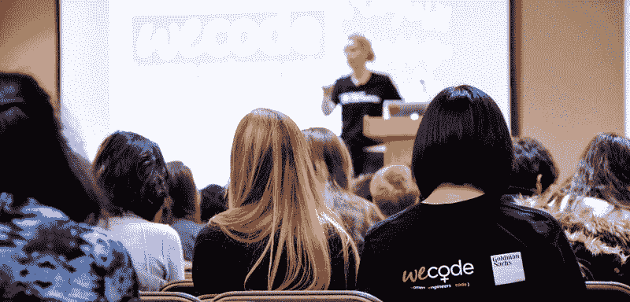

# 作为一个男人在女性科技会议上是什么感觉

> 原文：<https://www.freecodecamp.org/news/being-a-man-at-a-womens-tech-conference-b567602b59ad/>

由 Elijah Valenciano

# 作为一个男人在女性科技会议上是什么感觉

老实说，我很紧张。当我准备参加一个大约有 500 名年轻女性黑客和技术爱好者参加的会议时，一些恐慌的想法开始涌入我的脑海。

我会被视为局外人吗？
*人们会因为发现自己的导师不是女性而失望吗？*
*人们会在讨论中听我说话吗？我说的话有可信度吗？*
*我会被判断为无知或没有意识吗？*
*会不会所有的男卫生间都临时改成女卫生间？*

本月早些时候，我有幸参加了在哈佛大学举行的最大的计算机科学领域女性学生会议。我作为导师被公司邀请，同行的还有我的高级主管和大学关系技术招聘人员——两人都是女性。

我对被邀请感到困惑——我是一名男性，也是一名刚毕业的大学生——对参加也有点紧张。但我最终获得了一个关于科技行业包容性的宝贵视角，这是我在“普通”会议上无法体会到的。所谓“正常”，我指的是通常由男性主导的技术专家聚会。

### **学习倾听**

在这次会议中，我学到了一件重要的事情，如果不是最重要的事情，那就是倾听的价值。

当我参加不同的研讨会和讲座时，我通常会被吸引到后面。我也犹豫着要不要开口提问。然而，在这段自我意识的静坐时间里，我学到了很多关于女性技术专家的经验、观点和未来计划。一位著名的演讲者甚至将她的舞台定为一名竞选国会议员的女工程师。

我听到了克服障碍、改变社会的成功和鼓舞人心的女性的故事。令人惊讶的是，在会议结束时，我似乎也发出了自己的声音。我准备好了提问，也准备好了贡献自己的力量。

### **成为盟友**

在那次会议之前，我不明白成为盟友意味着什么。我仍然不确定我知道那是什么意思。

我能说的是，至少现在，我能提供的最好的是成为一个*见多识广的同事——一个倾听我同事的经历并支持他们的朋友。*

### **参与解决**

在我们的讨论中，有一点变得很清楚，那就是需要每个人来解决问题。

女人一个人做不到。这只会导致一个孤立的解决方案。男人肯定一个人做不到。解决困扰科技行业的包容性问题需要双方的沟通和努力。

### **现在做什么**

关于女性在科技领域面临的障碍，还有很多需要了解的。但现在至少我对工作场所发生的事情有了一定程度的了解。

我还会去参加女性科技会议吗？如果我再次被邀请，是的。我之前抱着的不安全感的问题还会浮在脑海里吗？大概吧。但是，尽我所能让科技成为一个更具包容性的领域比我自己的不安全感重要得多。