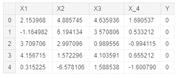
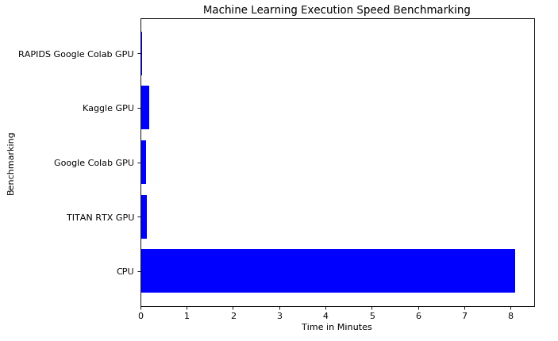
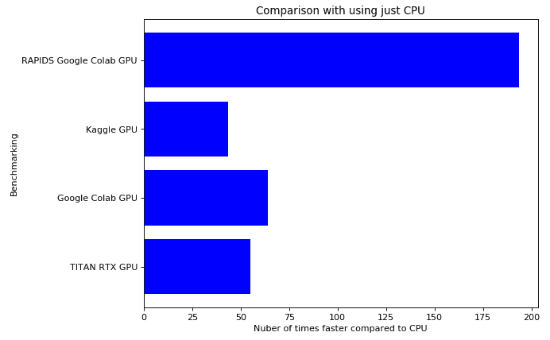

# 如何评测机器学习的执行速度

> 原文：<https://www.freecodecamp.org/news/benchmarking-machine-learning-execution-speeds/>

## 介绍

由于存储容量和内存管理方面的最新进展，在自己家中舒适地创建机器学习和深度学习项目变得容易得多。

在本文中，我将向您介绍 Python 中机器学习项目的不同可能方法，并给出它们在执行速度上的一些权衡。一些不同的方法是:

*   使用个人电脑/笔记本电脑 CPU(中央处理器)/GPU(图形处理器)。
*   使用云服务(Kaggle，Google Colab)。

首先，我们需要导入所有必要的依赖项:

```
import numpy as np
import pandas as pd
from sklearn.preprocessing import StandardScaler
from sklearn.model_selection import train_test_split
from sklearn import preprocessing
from xgboost import XGBClassifier
import xgboost as xgb
from sklearn.metrics import accuracy_score
```

对于本例，我决定使用高斯分布构建一个简单的数据集，由四个要素和两个标注(0/1)组成:

```
# Creating a linearly separable dataset using Gaussian Distributions.
# The first half of the number in Y is 0 and the other half 1.
# Therefore I made the first half of the 4 features quite different from
# the second half of the features (setting the value of the means quite 
# similar) so that make quite simple the classification between the 
# classes (the data is linearly separable).
dataset_len = 40000000
dlen = int(dataset_len/2)
X_11 = pd.Series(np.random.normal(2,2,dlen))
X_12 = pd.Series(np.random.normal(9,2,dlen))
X_1 = pd.concat([X_11, X_12]).reset_index(drop=True)
X_21 = pd.Series(np.random.normal(1,3,dlen))
X_22 = pd.Series(np.random.normal(7,3,dlen))
X_2 = pd.concat([X_21, X_22]).reset_index(drop=True)
X_31 = pd.Series(np.random.normal(3,1,dlen))
X_32 = pd.Series(np.random.normal(3,4,dlen))
X_3 = pd.concat([X_31, X_32]).reset_index(drop=True)
X_41 = pd.Series(np.random.normal(1,1,dlen))
X_42 = pd.Series(np.random.normal(5,2,dlen))
X_4 = pd.concat([X_41, X_42]).reset_index(drop=True)
Y = pd.Series(np.repeat([0,1],dlen))
df = pd.concat([X_1, X_2, X_3, X_4, Y], axis=1)
df.columns = ['X1', 'X2', 'X3', 'X_4', 'Y']
df.head()
```



Figure 1: Example Dataset

最后，现在我们只需准备好要输入到机器学习模型中的数据集(将其分为特征和标签，以及训练和测试集):

```
train_size = 0.80
X = df.drop(['Y'], axis = 1).values
y = df['Y']

# label_encoder object knows how to understand word labels. 
label_encoder = preprocessing.LabelEncoder() 

# Encode labels
y = label_encoder.fit_transform(y) 

# identify shape and indices
num_rows, num_columns = df.shape
delim_index = int(num_rows * train_size)

# Splitting the dataset in training and test sets
X_train, y_train = X[:delim_index, :], y[:delim_index]
X_test, y_test = X[delim_index:, :], y[delim_index:]

# Checking sets dimensions
print('X_train dimensions: ', X_train.shape, 'y_train: ', y_train.shape)
print('X_test dimensions:', X_test.shape, 'y_validation: ', y_test.shape)

# Checking dimensions in percentages
total = X_train.shape[0] + X_test.shape[0]
print('X_train Percentage:', (X_train.shape[0]/total)*100, '%')
print('X_test Percentage:', (X_test.shape[0]/total)*100, '%')
```

输出训练测试分割结果如下所示:

```
X_train dimensions:  (32000000, 4) y_train:  (32000000,)
X_test dimensions: (8000000, 4) y_validation:  (8000000,)
X_train Percentage: 80.0 %
X_test Percentage: 20.0 %
```

我们现在准备开始对不同的方法进行基准测试。在接下来的所有例子中，我们将使用 [XGBoost(梯度增强决策树)](https://towardsdatascience.com/https-medium-com-vishalmorde-xgboost-algorithm-long-she-may-rein-edd9f99be63d)作为我们的分类器。

## 1)中央处理器

在我的个人机器上(不使用 GPU)训练一个 XB 分级机，得到了以下结果:

```
%%time

model = XGBClassifier(tree_method='hist')
model.fit(X_train, y_train)
```

```
CPU times: user 8min 1s, sys: 5.94 s, total: 8min 7s
Wall time: 8min 6s
XGBClassifier(base_score=0.5, booster='gbtree', colsample_bylevel=1,
              colsample_bynode=1, colsample_bytree=1, gamma=0,
              learning_rate=0.1, max_delta_step=0, max_depth=3,
              min_child_weight=1, missing=None, n_estimators=100, n_jobs=1,
              nthread=None, objective='binary:logistic', random_state=0,
              reg_alpha=0, reg_lambda=1, scale_pos_weight=1, seed=None,
              silent=None, subsample=1, tree_method='hist', verbosity=1)
```

一旦我们训练了我们的模型，我们现在可以检查它的预测准确性:

```
sk_pred = model.predict(X_test)
sk_pred = np.round(sk_pred)
sk_acc = round(accuracy_score(y_test, sk_pred), 2)
print("XGB accuracy using Sklearn:", sk_acc*100, '%')
```

```
XGB accuracy using Sklearn: 99.0 %
```

总之，使用标准的 CPU 机器，训练我们的分类器达到 99%的准确率需要大约 8 分钟。

## 2) GPU

我现在将在我的个人电脑上使用 NVIDIA TITAN RTX GPU 来加速训练。在这种情况下，为了激活 XGB 的 GPU 模式，我们需要将 ***tree_method*** 指定为 ***gpu_hist*** 而不是 ***hist*** 。

```
%%time

model = XGBClassifier(tree_method='gpu_hist')
model.fit(X_train, y_train)
```

在这个例子中，使用泰坦 RTX 只需要 8.85 秒的执行时间(比只使用 CPU 快 50 倍！).

```
sk_pred = model.predict(X_test)
sk_pred = np.round(sk_pred)
sk_acc = round(accuracy_score(y_test, sk_pred), 2)
print("XGB accuracy using Sklearn:", sk_acc*100, '%')
```

```
XGB accuracy using Sklearn: 99.0 %
```

由于 GPU 能够减轻 CPU 的负载，释放 RAM 内存并并行执行多个任务，因此速度有了显著提高。

## 3) GPU 云服务

我现在将介绍两个免费 GPU 云服务的例子(Google Colab 和 Kaggle ),并向您展示它们能够达到的基准分数。在这两种情况下，我们都需要显式打开各自笔记本上的 gpu，并将 XGBoost***tree _ method***指定为 ***gpu_hist*** 。

### Google Colab

使用 Google Colab NVIDIA TESLA T4 GPU，已经记录了以下分数:

```
CPU times: user 5.43 s, sys: 1.88 s, total: 7.31 s
Wall time: 7.59 s
```

### 卡格尔

相反，使用 Kaggle 会导致执行时间稍长:

```
CPU times: user 5.37 s, sys: 5.42 s, total: 10.8 s
Wall time: 11.2 s
XGBClassifier(base_score=0.5, booster='gbtree', colsample_bylevel=1,
              colsample_bynode=1, colsample_bytree=1, gamma=0,
              learning_rate=0.1, max_delta_step=0, max_depth=3,
              min_child_weight=1, missing=None, n_estimators=100, n_jobs=1,
              nthread=None, objective='binary:logistic', random_state=0,
              reg_alpha=0, reg_lambda=1, scale_pos_weight=1, seed=None,
              silent=None, subsample=1, tree_method='gpu_hist', verbosity=1)
```

使用 Google Colab 或 Kaggle 都显著减少了执行时间。

使用这些服务的一个缺点是可用的 CPU 和 RAM 数量有限。事实上，稍微增加示例数据集的维度会导致 Google Colab 耗尽 RAM 内存(在使用泰坦 RTX 时这不是问题)。

在使用受约束的内存设备时，解决这类问题的一种可能方法是优化代码，以尽可能消耗最少的内存(使用定点精度和更高效的数据结构)。

## 4)加分点:急流

作为补充，我现在将向您介绍 RAPIDS，这是 NVIDIA 的一个 Python 库的开源集合。在这个例子中，我们将利用它与 XGBoost 库的集成来加速我们在 Google Colab 中的工作流。这个例子的完整笔记本(带有如何在 Google Colab 中设置 RAPIDS 的说明)可以在[这里](https://drive.google.com/open?id=1LZzK-iq9xEEuOfEpv2SLeCyV6ksx0kio)或者在[我的 GitHub 账户上找到。](https://github.com/pierpaolo28/Artificial-Intelligence-Projects/blob/master/NVIDIA-RAPIDS%20AI/RAPIDS%20GPU%20Benchmark%20Colab.ipynb)

RAPIDS 被设计成数据处理的下一个发展阶段。由于其 Apache Arrow 内存格式，与 Spark 内存处理相比，RAPIDS 可以将速度提高大约 50 倍。此外，它还能够从一个 GPU 扩展到多个 GPU。

所有的 RAPIDS 库都是基于 Python 的，并且被设计成具有类似 Pandas 和 Sklearn 的接口，以便于采用。

RAPIDS 的结构基于不同的库，以便加速端到端的数据科学。它的主要组成部分是:

*   cuDF =用于执行数据处理任务(类似熊猫)。
*   cuML =用于创建机器学习模型(类似 Sklearn)。
*   cuGraph =用于执行图形分析(NetworkX)。

在本例中，我们将利用它的 XGBoost 集成:

```
dtrain = xgb.DMatrix(X_train, label=y_train)
dtest = xgb.DMatrix(X_test, label=y_test)

%%time

params = {}
booster_params = {}
booster_params['tree_method'] = 'gpu_hist' 
params.update(booster_params)

clf = xgb.train(params, dtrain)
```

```
CPU times: user 1.42 s, sys: 719 ms, total: 2.14 s
Wall time: 2.51 s
```

正如我们在上面看到的，使用 RAPIDS 只花了大约 2.5 秒来训练我们的模型(将执行时间减少了将近 200 倍！).

最后，我们现在可以检查我们使用 RAPIDS 获得了与我们在其他情况下注册的完全相同的预测准确性:

```
rapids_pred = clf.predict(dtest)

rapids_pred = np.round(rapids_pred)
rapids_acc = round(accuracy_score(y_test, rapids_pred), 2)
print("XGB accuracy using RAPIDS:", rapids_acc*100, '%')
```

```
XGB accuracy using RAPIDS: 99.0 %
```

如果你有兴趣了解更多关于急流城的信息，更多信息请点击这里。

## 结论

最后，我们现在可以比较不同方法的执行时间。如图 2 所示，使用 GPU 优化可以显著减少执行时间，特别是如果与 RAPIDS 库的使用相集成的话。



Figure 2: Execution Time comparison

图 3 显示了 GPU 模型比我们的基准 CPU 结果快多少倍。



Figure 3: Focus on CPU Execution Time Comparison

## 联系人

如果你想了解我最新的文章和项目，[通过媒体](https://medium.com/@pierpaoloippolito28?source=post_page---------------------------)关注我，并订阅我的[邮件列表](http://eepurl.com/gwO-Dr?source=post_page---------------------------)。以下是我的一些联系人详细信息:

*   [Linkedin](https://uk.linkedin.com/in/pier-paolo-ippolito-202917146?source=post_page---------------------------)
*   [个人博客](https://pierpaolo28.github.io/blog/?source=post_page---------------------------)
*   [个人网站](https://pierpaolo28.github.io/?source=post_page---------------------------)
*   [中等轮廓](https://towardsdatascience.com/@pierpaoloippolito28?source=post_page---------------------------)
*   [GitHub](https://github.com/pierpaolo28?source=post_page---------------------------)
*   [卡格尔](https://www.kaggle.com/pierpaolo28?source=post_page---------------------------)

来自本文的封面照片[。](https://hardzone.es/noticias/tarjetas-graficas/nvidia-hopper-arquitectura-mcm/)