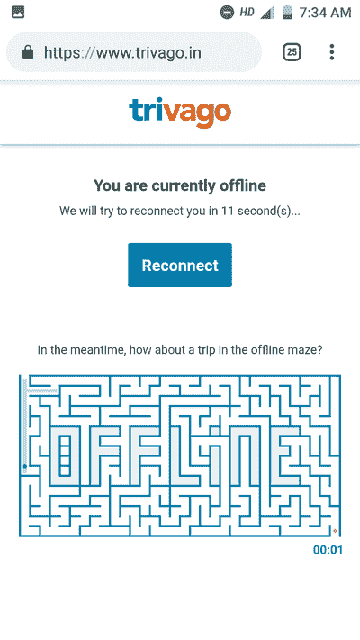
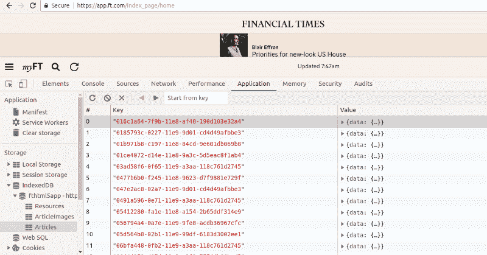
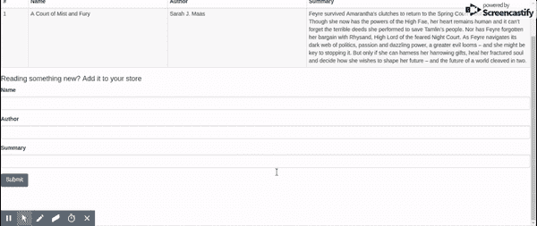
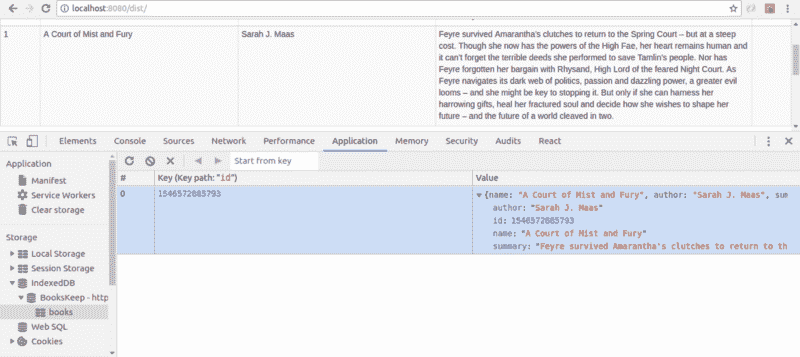
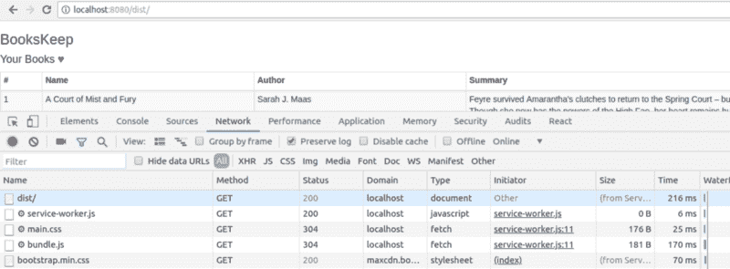

# 为什么渐进式网络应用程序是伟大的，以及如何建立一个

> 原文：<https://www.freecodecamp.org/news/benefits-of-progressive-web-applications-pwas-and-how-to-build-one-a763e6424717/>

作者:安基塔·马桑

# 为什么渐进式网络应用程序很棒，以及如何构建一个


Photo by [Jamie Street](https://unsplash.com/photos/33oxtOMk6Ac?utm_source=unsplash&utm_medium=referral&utm_content=creditCopyText) on [Unsplash](https://unsplash.com/search/photos/app?utm_source=unsplash&utm_medium=referral&utm_content=creditCopyText)

在本教程中，我们将构建渐进式 Web 应用程序(PWAs)的基础。我将帮助您理解传统 web 的痛点，以及需要更好的东西来对抗本机应用程序。我们将深入研究构成 PWA 的组件— *服务人员*、*索引数据库*、 *manifest.json* & *网页推送通知*。最有趣的是，我们将从头开始构建 PWA。

### 我是如何想到写这篇教程的

我正和全家人一起吃晚饭，一条新短信的通知突然出现在我的手机上。这条消息证实了我收到了新的薪水。虽然这是经常性的新闻，但每次发生这种情况，我的家人都会很高兴。

趁着环境宜人，哥哥惊呼想要一部新手机。当我问他为什么需要一部手机时，他说他的手机变得非常慢，时不时会收到内存不足的警告。我很惊讶听到这个，因为他的手机比我的更先进，我的手机仍然工作得很好。

为了满足我的好奇心，我检查了他的手机，发现他已经安装了 40 多个应用程序，以满足他的多样化需求。？‍♀️:有两个阅读不同类别博客的应用程序，其中两个用于获取新闻更新，三个用于电子商务应用程序，三个用于游戏，一个用于关注他的共同基金，另一个用于处理他的银行账户交易，还有几个他不经常使用的应用程序。

我问他，在采取大胆措施安装原生应用程序之前，他是否曾尝试访问过相应的网站。他把那块比萨饼放在一边，转过身来对着我，想要进行一次详细的谈话。

他开始说，他总是先访问一个网站，这个网站通过显示 fat install 横幅迫使他下载原生应用程序。他说在网上的经历是如此令人沮丧，以至于不可能完成哪怕是一个简单的任务。

他的电子商务应用程序在及时更新订单方面做得非常好，并且通过发送推送通知让他了解折扣方面做得非常好。本地应用程序的用户体验简直令人惊叹，*网站*无法超越这一点。他对网络的看法很严厉。然而，他承认原生应用程序的大小增加了他的手机内存，但他在这方面无能为力。

### 人们对网络的误解

我哥哥的想法和大多数用户对网络的想法完全一样。传统的网络又慢又丑。让我们花一点时间看看移动网络上的 Twitter，通常被称为 Twitter Lite，并理解我最后一句话中“T2 传统”一词的意义。


体验和原生 app 不相上下吗？它可以立即加载。没有 janky 滚动。看起来不像老传统网站。你可能已经注意到了底部的一个小横幅，要求你*将 Twitter* 添加到你的主屏幕上。这是敦促用户安装原生应用程序的更好的方式吗？不，不是的。它不会下载兆字节大小的原生应用程序。它要求你在主屏幕上添加 Twitter Lite。字面意思是添加一个快捷方式，使用主屏幕上的图标访问 twitter 移动网络。

让我们通过点击*将 Twitter 添加到主屏幕*来试验一下，看看新的网络提供了什么。如果横幅没有出现在您的案例中，请点击右侧的三个点并选择选项*添加到主屏幕*。现在，在主屏幕上点击 twitter 图标。是不是很神奇？哦对了，这个应用还可以给你发实时推送通知。网络现在不会感觉像一个失落的世界。一旦你在一个网络应用程序上选择了推送通知，它就会通过向用户展示所有的更新来吸引用户。

还有一个更重要的东西是传统老网站所缺乏的——处理间歇性或无互联网连接的能力。与 WIFI 相比，网络在 2G 设备上的表现截然不同。大多数时候，在 2G 网络上浏览时，屏幕上什么也没有，或者是一个加载器。这对最终用户来说是令人沮丧的。

好消息是，现代网络也可以解决这个问题。当你的网络关闭时，你看不到恐龙。这是一个很好的应用程序外壳，当你没有连接到互联网时就会弹出来。我真的很喜欢 Trivago 处理这个问题的方式，他们展示了一个很好的应用程序外壳来玩离线迷宫。



让我们再来看一个这类的应用— [金融时报](https://app.ft.com/)。在你的浏览器中加载[金融时报](https://app.ft.com/)，现在关掉你的互联网。重新加载页面。体验还是一样的。这难道不是让网络看起来很棒的东西吗？这些解决传统网络痛点的网络应用被通俗地称为**渐进式网络应用**。

在本教程中，我们将探索渐进式 Web 应用程序，并从头开始构建一个。

### 渐进式 Web 应用程序的优势

渐进式网络应用程序(pwa)包括:

#### 快的

他们充分利用本地缓存来存储静态资产。静态资产的缓存减少了每次加载时服务器获取这些资产的次数。这带来了与本地应用程序相似的令人难以置信的用户体验。他们对用户交互反应迅速。

#### 可靠的

PWAs 几乎可以立即加载数据。来自应用程序的每个 fetch 网络请求都要经过服务工作器(稍后将详细介绍)。它们操作缓存(IndexedDB 或任何其他本地缓存)。在互联网连接时断时续或速度缓慢的情况下，服务人员可以直接从缓存中发送对网络请求的响应。PWAs 甚至可以在 2G 连接上可靠地工作。

#### 迷人的

本机应用程序利用操作系统的能力向用户显示重要的通知，这是应用程序的强大功能之一。及时发送推送通知有助于更长时间地留住用户。PWAs 利用网络推送通知向用户通知相关更新。

*渐进式网络应用*是指快速、可靠、引人入胜的网络应用，它们提供与本地应用类似的体验。有资格被称为渐进式 Web 应用程序的应用程序包括并采用了以下内容:

**服务人员**

*服务人员*，简单来说就是几行 JavaScript 代码，一直在后台运行。然而，当它们不被使用时，它们进入休眠状态。它们作为事件驱动的系统运行。每当一个特定的事件(例如，对服务器的获取请求)被调用时，服务工作者就活跃起来。

我们可以使用服务工作器中的 fetch 事件监听器来处理`fetch`事件的`response`。对于开始处理获取请求和一些其他事件的服务工作者来说，应该在 web 应用程序上注册、安装和激活它。

**IndexedDB 或任何其他本地缓存**

pwa 将 JavaScript 文件、样式表和图像等静态资产存储在本地缓存中，以备后续访问。一些 pwa 使用 IndexedDB，它基本上是一种结构化的键值对数据结构。与其他客户端存储选项相比，IndexedDB 用于存储大量数据。

我们早些时候看到了《金融时报》处理“T2 无法上网”事件的方式。它仍然在主页上显示所有的文章。它利用 IndexedDB 来存储这些文章中的数据。

让我们来看看实际情况。你可以在 Chrome DevTools 的 Applications 标签下找到 IndexedDB。在 IndexedDB 下，转到*文章*部分。



**网页推送通知**

服务工作者还监听推送事件，并有各自的推送事件处理程序负责向用户显示推送通知。应用程序必须获得用户的许可，才能向他们显示推送通知。一旦用户选择接收推送通知，浏览器就会为他们生成一个唯一的令牌。然后，服务器可以使用这个唯一的令牌与用户通信。

**manifest.json 文件**

manifest.json 通常是应用程序的元数据文件。一个应用程序包括 index.html 的 manifest.json，如下所示

`<link rel="manifest" href="manifest.jso` n" >

json 负责告诉浏览器这个应用程序是一个 PWA。它告诉浏览器名称、背景颜色、主题颜色和图标用于这个应用程序。它还告诉应用程序应该以何种模式打开。例如，*独立模式*通过提供类似于本地应用的感觉来启动 PWA。

**丰富的用户体验**

众所周知，PWAs 拥有丰富的用户体验。它们直接从缓存中访问静态资产，因此在响应用户交互时没有延迟。

让我们利用上面列出的组件来构建一个渐进式 Web 应用程序。

### 用例——构建图书宝库

我们将构建一个名为*book keep*的应用程序。这将有助于保持我们已经读过的书和正在阅读的书的系统记录。*学来的聪明话不应该白费。*

该应用将包含以下特征:

1.  显示图书列表(标题、作者、摘要和最喜欢的引用)
2.  向列表中添加新书



#### 先决条件—我们的技术堆栈

*   *反应* —用于构建前端
*   *IndexedDB* —用于存储图书记录(请注意，没有后端数据库)
*   *WebPack* —作为开发服务器，用于捆绑资产

我们走吧！为了简单起见，我创建了一个[样板文件](https://github.com/ankita1910/bookskeep-pwa/tree/master/boilerplate)来开始。

#### 理解样板文件

`package.json` - `package.json`包含项目依赖关系。当您执行`npm install`时，这些依赖项将被下载到您的系统中。因为我们使用 React 来构建我们的前端，`react` & `react-dom`库包含在依赖项部分。

在`devDependencies`对象中，包含了 babel 预置和少数 webpack 相关插件。 [Babel](https://babeljs.io/) 是一个 JavaScript 编译器，用于语法转换，将下一代 JavaScript 转换成浏览器兼容版本。

浏览器不直接理解 React 语法，所以我们使用`babel-preset-react`将 React 和 JSX 转换成浏览器理解的 JavaScript。我们使用[网络包](https://webpack.js.org/)作为模块捆绑器。

`webpack.config.js`包含生成静态资产包所需的配置设置。`module.exports`中的`entry`对象包含应用程序的入口点，在我们的例子中是`app.js`。Webpack 使用这个入口点生成一个依赖关系图，并从`app.js`开始在包中不断添加依赖关系。`output`对象包含输出文件夹的路径，而`filename`基于它们在 entry 对象中的值生成动态文件名。在我们的例子中，它将是`bundle.js`，因为我们已经在入口点中提到了 bundle。

接下来有一些规则要转换。js &。scss 特定文件。在将这些文件添加到主包之前，将使用它们各自的加载程序对它们进行转换。

*   [HTMLWebpackPlugin](https://webpack.js.org/plugins/html-webpack-plugin/) 在提供的`index.html`模板中添加生成的输出包。
*   [ExtractTextPlugin](https://github.com/webpack-contrib/extract-text-webpack-plugin) 移动。css 模块放到一个单独的文件中。
*   CopyWebpackPlugin 只是将`manifest.json`文件和`service-worker.js`文件从`src`复制到`dist`。

我们将沿着这个教程建立`src`。目前，它包含一个 id 为`app`的 div 元素`index.html`。`app.js`是应用程序的根组件。现在它包含简单的标题&主体组件。

让我们开始建造我们的书吧。我们将通过以下步骤逐步实现这一点:

1.  构建用于显示图书记录的表格组件
2.  在表中添加新书的规定
3.  将图书记录存储在 IndexedDB 中
4.  向缓存静态资产添加服务工作者
5.  添加 manifest.json

### 构建用于显示图书记录的表格组件

我们使用`react-bootstrap`来构建 UI。让我们从`react-bootstrap`导入表格组件。

在终端中使用命令`npm start`启动服务器。前往`localhost:8080/dist/`。我们还没有任何图书记录，所以这个表是空的。`BooksHeaders`正在从常量文件夹中导入。请在[这里](https://github.com/ankita1910/bookskeep-pwa/blob/master/app/src/js/constants/books-headers.js)的常量文件夹的`books-headers.js`文件中添加`BooksHeaders`。

就是我们在表格中显示的一组对象。`getTableMarkup`函数用`getTableData`函数构建带有`getTableHeaders`的表头&表体。`booksData`维护组件的状态。如果要添加新的图书记录，应该将其推入`booksData`数组。

### 在表中添加新书的规定

让我们更进一步，在表格中添加我们的第一条图书记录。我们需要添加的只是从基本文件夹导入`BookForm`组件，并为其提供一个`onSubmit`道具。`onSubmit` prop 接受一个函数，当用户点击表单中的提交按钮时，该函数将被调用，并为我们提供新书的详细信息。一旦你完成了这个动作，你的身体部分就应该看起来像这个。

下面是`BookForm`组件:

`FieldGroup`只是一个标记输入的包装器。请将[这个](https://github.com/ankita1910/bookskeep-pwa/blob/master/app/src/js/utils/field-group.js)放到`utils`文件夹的`field-group.js`文件中。`BookForm`组件在`formData`对象中保持其状态。每当用户输入姓名、作者或摘要时，它都会保存在组件状态中。submit 按钮将组件状态传递给父 Body 组件，然后父 Body 组件将其添加到 state - `booksData`数组中。

添加图书记录后，您将看到您的表现在已经填充了该记录。但是当你刷新页面时，这一切都消失了。我们必须解决这个问题。

### 将图书记录存储在 IndexedDB 中

*IndexedDB* 是一个结构化的客户端存储数据库。IndexedDB 中的记录存储为键值对。我们将把图书记录保存在 IndexedDB 中。IndexedDB 提供了在数据库中添加、删除和更新记录的 API。让我们通过在`utils`文件夹的`indexeddb.js`文件中创建一个包装器来研究这些 API。

对 IndexedDB 执行的操作本质上是异步的。因此，IndexedDB APIs 为成功和错误事件提供了适当的挂钩。

首先，我们必须创建我们的数据库。让我们编写一个`initialize`函数来处理初始化任务:

在上面的代码片段中，`BooksKeep`是 IndexedDB 数据库的名称，`books`是一个 *ObjectStore* 。 *ObjectStore* 类似于 SQL 中的一个表。语句`idb.open(DB, 1)`是打开 IndexedDB 数据库`BooksKeep`的异步请求，第二个参数 1 表示数据库的版本。请求变量的类型为`[IDBOpenDBRequest](https://developer.mozilla.org/en-US/docs/Web/API/IDBOpenDBRequest)`。

我们在请求对象上定义了`onsuccess`、`onerror`和`onupgradeneeded`函数，在各自的事件中调用。例如，当数据库成功打开时会调用`onsuccess`回调，在`onsuccess`方法中，我们缓存了`BooksKeep`数据库的实例。`onupgradeneeded`每当数据库版本发生变化时，就会调用该方法。

目前，在版本 1 中，我们只添加了一个名为`books`的 ObjectStore。比方说，在稍后阶段，当我们的应用程序增长时，我们决定再添加一个 ObjectStore。我们必须将数据库的版本升级到 2，并在`onupgradeneeded`方法中添加这个新 ObjectStore 的模式。

我们将在 IndexedDB 包装器中编写三个重要的方法— *get* 、 *update* 、&、 *delete —* 。执行这些操作的一般思想是首先获取存储的实例，将操作包装在事务中，然后为各自的异步请求编写成功和错误事件处理程序。事务只是操作的包装，以确保数据的完整性。如果事务中的任何操作失败，则不会对数据库执行任何操作。

例如，我们的 put 或 update 方法如下所示:

`update`方法需要三个参数:

`type`是 objectStore 的名称，`data`是我们打算在 objectStore 中添加/更新的图书记录，`callback`是在 objectStore 中成功添加`data`后将被调用的函数类型。

`transaction`是在`[IDBOpenDBRequest](https://developer.mozilla.org/en-US/docs/Web/API/IDBOpenDBRequest)`实例上定义的，它采用 objectStore 的名称和操作执行的模式。在本例中，模式是`readwrite`,因为我们正在写入 objectStore。

如前所述，IndexedDB 接受键值对形式的数据。我们使用时间戳来为特定记录生成唯一的标识符。`store.put(data)`异步地将图书记录添加到`books` objectStore 中。在同一行中，我在包装器中添加了 get & delete 方法。请点击查看 IndexedDB 包装器[的完整代码。](https://github.com/ankita1910/bookskeep-pwa/blob/master/app/src/js/utils/indexeddb.js)

既然我们的 IndexedDB 包装器已经设置好了，那么每当用户试图添加新的图书记录时，就应该使用包装器中的 add/update 函数了。让我们修改我们的身体组件来适应这些变化。

首先在 Body 组件中导入`IndexedDbWrapper`。我们将在`componentDidMount`中调用`IndexedDbWrapper`的`initialize`函数。`initialize`方法将回调作为`initializeDB`函数，该函数在主体组件中定义。`initializeDB`通过从 IndexedDB 获取存储的图书记录来设置应用程序的初始状态。

关于`IndexedDbWrapper`的最后一件事是在提交图书记录时调用它的`update`方法。我们必须修改主体组件的`onSubmit`方法，如下所示:

现在，新记录将首先被添加到 IndexedDB 中，一旦成功完成，我们将更新组件的状态。尝试添加新的图书记录并重新加载页面。您仍会在表格中看到您的图书记录。这是它的来源！



让我们添加一条记录并刷新页面。数据被保留下来，这正是我们想要的。我们已经建立了一种在客户端直接获取数据的方法。我们离构建渐进式 Web 应用程序的目标越来越近了。

### 向缓存静态资产添加服务工作者

下一步是通过从缓存中获取静态资产来利用服务人员的能力。服务人员首先必须在网页上注册。

*服务人员登记*

`initializeSW`函数在 Body 组件中定义，我们会在`componentDidMount`生命周期钩子中调用它。`serviceWorker`在[导航仪](https://developer.mozilla.org/en-US/docs/Web/API/Navigator)上定义。据 MDN 报道，

> 导航界面表示用户代理的状态和身份。它允许脚本查询它，并注册自己进行一些活动。

使用在`navigator.serviceWorker`对象上定义的`register`方法注册一个服务工作者。`register`方法获取服务工作者文件的 URL。当服务人员在网页上成功注册时，它返回一个`Promise`来解决这个问题。完成后，您将在控制台中看到一条成功消息。默认情况下，服务人员可以拦截来自网页的所有获取请求。

`register`方法还有一个可选的第二个参数，它定义了服务工作者的`scope`。

```
navigator.serviceWorker.register('./service-worker.js', { scope: '/products' })
```

上述服务人员将只拦截`/products/*`个请求。所以像`/payments`这样的东西是不会被上面的服务人员拦截的。

如前所述，服务工作者作为一个事件驱动的系统运行。注册成功后，触发一个`install`事件。我们可以利用 install 事件处理程序来完成初始化任务。在我们的例子中，我们将设置缓存来存储静态资产。

下面是安装事件处理程序:

`event.waitUntil`当 URL 被添加到缓存中时，确保服务工作者是活动的。

服务人员还没有开始施展魔法。安装成功后，会触发一个`activate`事件，这是清除旧的未使用的缓存的好地方。让我们尽一份力:

`activate`事件处理程序负责删除除了`bookskeep-cache`之外的所有缓存。当网页向服务器发出网络请求时，服务工作器的 fetch 事件被触发。因此，如果我们要操作或修改为特定请求发送的响应，我们必须在 fetch 事件处理程序中完成。

方法让我们将修改后的响应发送回客户端。它返回一个解析为有效响应的承诺。`cache.match`检查请求是否是有效的缓存资源(如果您还记得，我们已经在安装事件处理程序中为`urlsToCache`变量添加了几个特定的 URL)。

如果对该请求的响应存在于缓存中，我们将它直接发送给客户端，否则，我们从服务器请求该资源，将其放入缓存以供后续命中，然后将其发送给客户端。



[这里是](https://github.com/ankita1910/bookskeep-pwa/blob/master/mid-steps/service-worker-1.js)服务工作者文件，带有上面解释的三个事件处理程序。

### 添加 manifest.json

`short_name`在主屏幕上用作应用程序的名称。如果没有提供`short_name`，则使用`name`属性代替。`icons`在应用程序启动器和闪屏上显示为应用程序的主屏幕图标。`start_url`告诉浏览器应用程序的起始页。当应用程序启动时，用户将被定向到此 URL。`standalone`因为应用程序的显示属性赋予其本机应用程序的外观&感觉。该应用程序在自己的窗口中运行，并隐藏了一些浏览器特有的元素，如 URL 栏。`background_color`设置应用程序首次启动时闪屏的颜色，`theme_color`显示工具栏的颜色。

这就是了。我们已经摆好了我们的书。让我们快速回顾一下我们在本教程中学到的内容:

1.  传统的 web 缺乏一些本机应用程序现成提供的重要功能。渐进式网络应用程序极大地改善了用户的网络体验。它们快速、可靠、引人入胜，并提供类似于本机应用程序的体验。
2.  pwa 利用服务工作器、IndexedDB(或任何其他本地缓存)、manifest.json 和 Web 推送通知。
3.  服务工作者作为一个事件驱动的系统运行，并监听获取和推送事件。`fetch` event 允许我们在连接缓慢或断断续续的情况下，直接从缓存中发送对网络请求的响应。`push`事件让我们向用户显示推送通知，并通过通知用户及时更新来帮助吸引用户。
4.  IndexedDB 是一个键值结构。它有助于在客户端存储大量数据。通知浏览器应用程序的一些重要属性。
5.  我们学习了如何开始构建渐进式 Web 应用程序。

这是对渐进式 Web 应用程序的快速介绍。如果您想了解更多，这里有一些资源:

1.  [渐进式网络应用的广泛指南](https://www.smashingmagazine.com/2018/11/guide-pwa-progressive-web-applications/)
2.  查看我在 GitHub 上的 [BooksKeep](https://github.com/ankita1910/bookskeep) 应用程序。我增加了一些新功能，比如更新图书记录，添加报价&支持网络推送通知。我会继续加更多！
3.  [服务人员](https://hackernoon.com/service-workers-62a7b14aa63a)

如果你觉得这个教程有帮助，请告诉我，并与你认为可能从中受益的人分享。

*最初发表于[hashnode.com](https://hashnode.com/post/benefits-of-progressive-web-applications-pwas-and-how-to-build-one-cjqry4q0c00qo8ms1ckbv9xnc)。*