# React 应用的最佳后端即服务

> 原文：<https://www.freecodecamp.org/news/best-backend-service-react/>

如果你正在自己开发一个应用或者预算有限，你可能会考虑使用后端即服务(BaaS)。这样做可以让您专注于应用程序的前端，但仍然有一个具有数据库、身份验证等功能的全栈应用程序。

在本指南中，我们将介绍 React 开发人员的三个最佳选择，帮助您使用后端即服务快速启动应用，同时节省时间、精力和成本。

想要一个学习 React 的好资源吗？每天使用 [**React 训练营**](https://reactbootcamp.com/) 在 30 分钟内成为 React pro。

## Supabase

多年来，Firebase 一直主导着后端即服务领域。然而，在过去的几年里，Supabase 已经成为一个很好的选择。

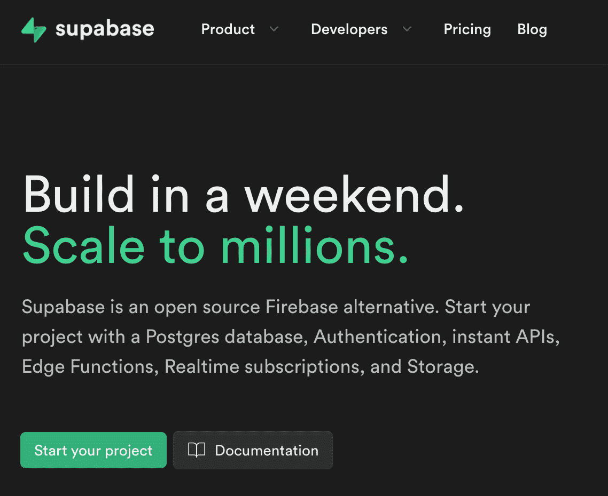

Supabase homepage

Supabase 的主要好处是**开源**。简而言之，Supabase 允许您将代码部署到任何您喜欢的地方。你可以构建你的应用程序，将其部署到 Supabase 的服务器上，或者你可以稍后将其部署到你自己的托管服务上。

这样做的最大好处是，它可以帮助您避免**供应商锁定**。如果您遇到想要从您正在使用的服务中迁移出来的情况，就会出现供应商锁定的问题。例如，如果服务的价格变得过高，或者您在使用该服务时遇到了根本性的问题。问题是你被“锁定”了，可能很难去别的地方。

正如您将看到的这个列表中的其他两个选项(Firebase 和 AWS Amplify)，它们有一定程度的供应商锁定。简而言之，离开它们并不容易。

另一方面，Supabase 让你可以灵活地在你喜欢的地方托管你的项目，而不需要一个困难的迁移过程。

Supabase 为您提供了一个 Postgres 数据库，它几乎兼容所有 React 框架，包括许多其他非 React JavaScript 库。

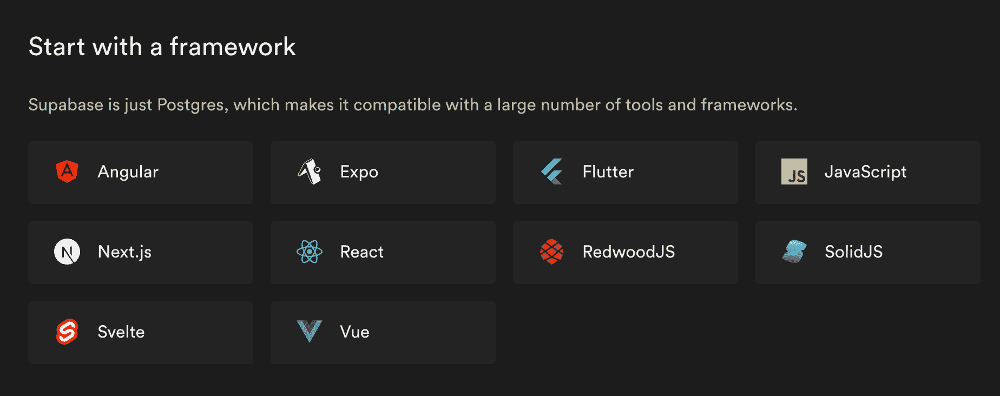

Supabase-supported JavaScript libraries

要开始在 React 应用程序中使用 Supabase，您需要安装`supabase-js` npm 包。

要真正启动 Supabase 项目并创建数据库，您需要登录 Supabase.com。免费层将为您提供您需要的所有主要功能，包括免费数据库和内置身份验证。

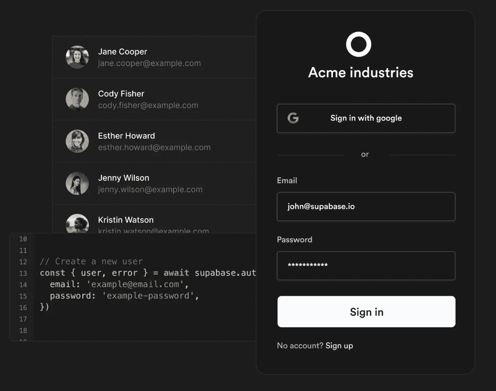

Supabase Authentication

Supabase 认证包括大量主要的社交提供商，如谷歌和脸书。

它们还提供内置存储，允许您存储任何类型的文件。如果您的应用程序支持视频或图像上传，这个特性将是必不可少的。

Supabase 还通过 WebSockets 支持实时数据，这是 Firebase 和 AWS Amplify 都提供的功能。

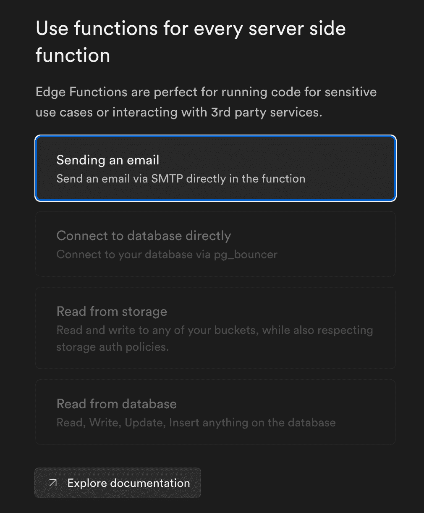

Supabase storage and functions

Supabase 提供了 edge 函数，使您能够编写与数据库交互的自定义代码。如果您想要编写一些 Supabase npm 软件包不支持的自定义逻辑，或者如果您想要在服务器上做一些事情，例如发送电子邮件，这些边缘函数可能会很有用。

Supabase 比 Firebase 有优势的一个方面是他们的**全文搜索**功能。

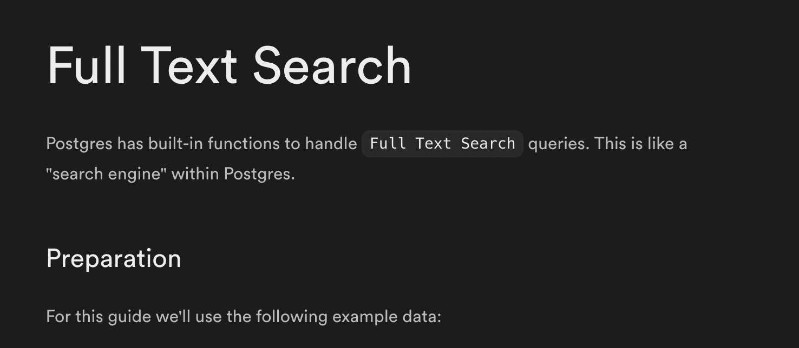

Supabase full text search

如果你想为你的应用提供基于数据库中存储的搜索功能，这是 Firebase 的云 Firestore 数据库所不能提供的。

Supabase 的免费计划可以带你走很长的路，但如果你想要数据库备份，加上存储额外数据的能力，数据库或存储超出免费限制，你需要升级到他们的 Pro 计划(每个项目每月 25 美元)。与 Firebase 和 AWS 不同，如果你想要比免费限制提供的更多的东西，价格会大幅上涨。

也就是说，Supabase pro tier 非常慷慨。当你准备好将你的应用推向世界时，它将从后端提供你需要的几乎所有东西，每月只需 25 美元。

## 重火力点

Firebase 的寿命和它所提供的东西是无与伦比的。

Firebase 已经存在了 10 年，提供了所有后端解决方案中最多的产品。

这是一个非常复杂的一体化服务，拥有自己的 NoSQL 数据库存储，可以与任何一种可以想象的社交提供商进行认证，以及一些 Supabase 不具备的功能，如崩溃分析、性能洞察、A/B 测试、推送通知等等。

如果你真的想要最完整的选择，你应该认真考虑 Firebase。

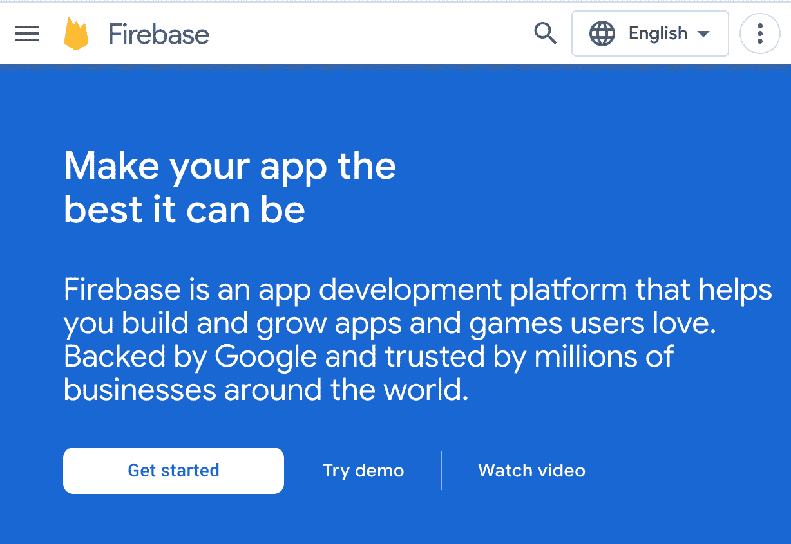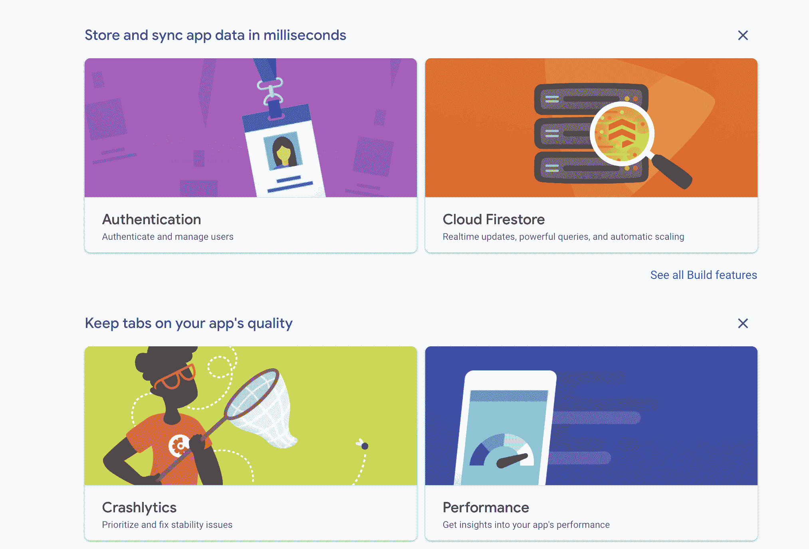

Firebase homepage and services

Firebase 同样很容易安装。你可以在 Firebase 的网站上为许多免费项目创建一个帐户。

创建数据库或专用存储只需点击一个按钮。Firebase 在提供一个非常方便的仪表板来与您的所有产品(如数据库)进行交互方面也是无与伦比的。

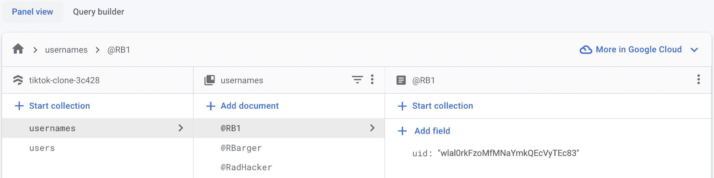

Firebase Cloud Firestore

Firebase 的所有这些优点都可能是一个潜在的缺点。Firebase 确实提供了如此多的功能，以至于要弄清楚启动和运行时应该使用什么，不应该使用什么，这可能有点让人不知所措。

我建议您的 React 应用程序首先使用云 FireStore 数据库、认证和存储，如果您需要在服务器上提供自定义逻辑，请添加 Firebase functions 服务。只有这样，你才需要考虑他们的其他选择。

与 Supabase 不同，但与 AWS Amplify 相似，Firebase 包括内置主机。没有必要去别处寻找托管服务或任何其他定制解决方案。

正如我前面提到的，Firebase 的真正缺点是供应商锁定。一旦你用 Firebase 构建了你的应用，迁移到另一个平台可能会相当困难。也就是说，许多公司已经把他们的整个生计建立在 Firebase 上。

计算使用 Firebase 的成本有点困难。幸运的是，Firebase 提供了一个方便的计算器，可以根据应用程序的资源使用情况给你一个更好的主意。

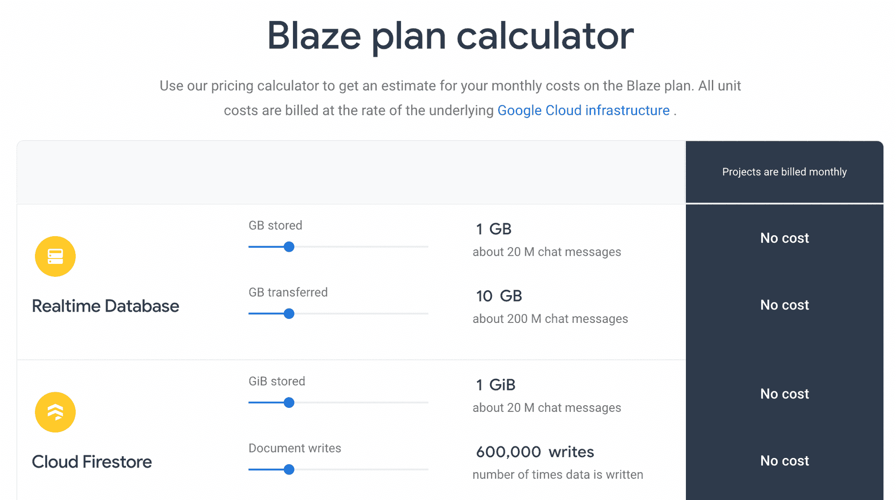

Firebase's plan calculator

他们的计划对免费用户很慷慨，你可以开始免费使用几乎所有的服务。一旦超过限额，你只需开始支付。

Firebase 是最接近一体化服务的应用后端。如果你打算快速构建你的应用，尽可能少花时间在选择和管理服务上，那么使用 Firebase 是不会错的。

## AWS 放大器

最后一个竞争者是 AWS amplify，它经常被忽略，但不应该被忽略。

众所周知，AWS 有时很难导航，但 AWS Amplify 是这个规则的例外。AWS Amplify 不仅为 JavaScript 开发人员提供了令人印象深刻的数据库、存储和实时体验，还提供了一个组件库 Amplify UI。

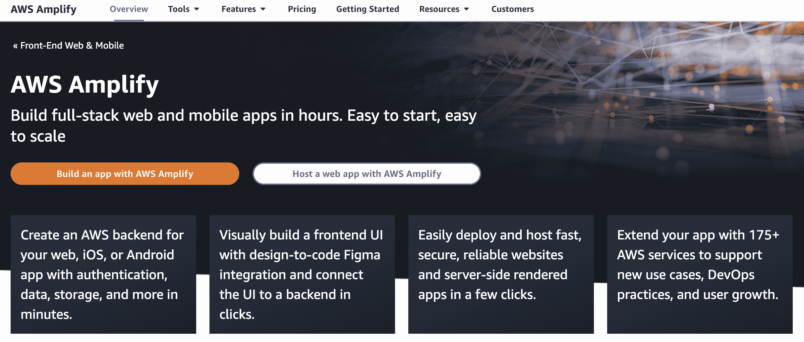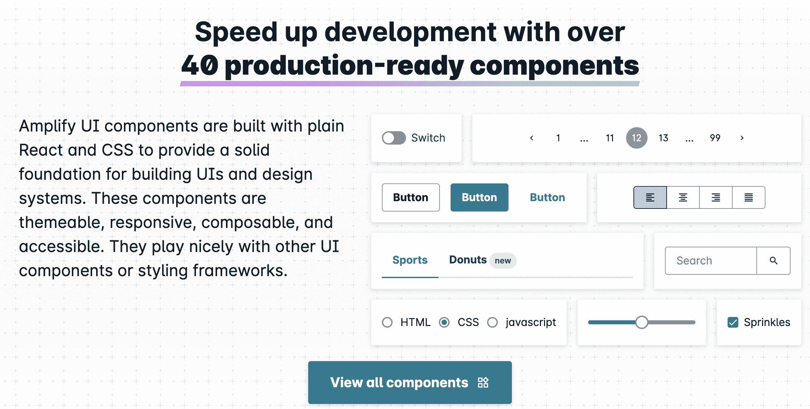

AWS Amplify and Amplify UI

例如，Amplify UI 为您提供了自己的开箱即用的身份验证组件，而不是创建自己的身份验证组件。

简而言之，AWS Amplify 为您提供了 Firebase 的几乎所有工具，以及已经与您的 AWS 后端集成的优质预制组件。

与 Firebase 和 Supabase 相比，使用 AWS Amplify 的另一个好处是，它很可能是最便宜的。

就基础设施业务而言，AWS 的定价是最低的。在许多情况下，如果你是第一次使用 AWS，AWS 会给你启动积分。如果是这样，你的应用程序的成本可能几乎为零。

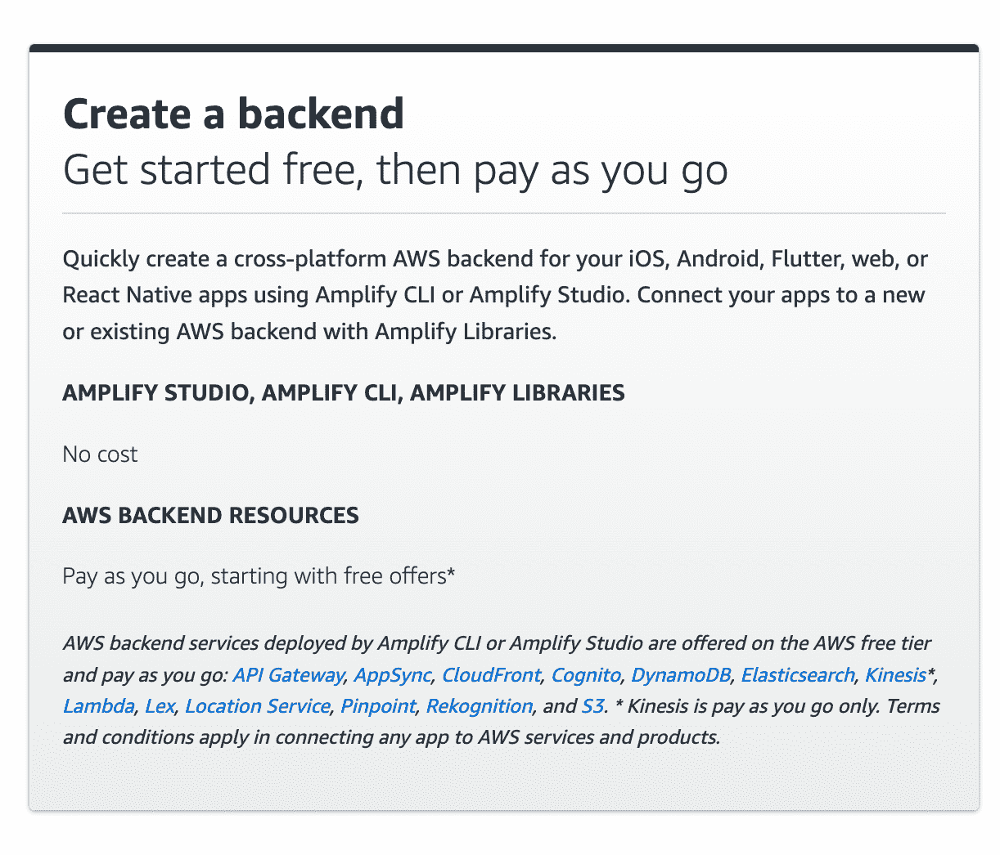

Amplify Pricing

使用 AWS Amplify 的一大注意事项是它依赖于 GraphQL。如果你不熟悉 GraphQL，这可能是你的一个症结。它确实有一个 REST API 替代品。然而，REST 选项并不那么有特色，也不提供同样的好处，比如订阅的实时数据。

使用 AWS amplify 的另一个缺点是，您可以编写定制的解析器来与数据库和其他 AWS 服务进行交互，但是它们不是用 JavaScript 编写的。相反，Amplify 控制台使用所谓的“Apache Velocity 模板语言”或 VTL。请注意，如果您需要编写定制的业务逻辑，那么编写定制的服务器代码可能会非常困难。

AWS Amplify 提供大量的集成服务，并允许您使用如此多的 AWS 产品，如 DynamoDB、S3 和 ElasticSearch。它被构建来支持您可能拥有的每一个可以想象的开发者需求。它甚至可以让你做像音频到文本转录和扩展现实(XR)集成这样的事情。

如果你正在寻找最具成本效益的服务，并且不牺牲 Firebase 的任何功能，Amplify 绝对值得一试。如果你熟悉 GraphQL，并且非常了解 AWS 生态系统，Amplify 也是一个不错的选择。

## 感谢阅读！

希望您现在已经准备好为您的 React 项目选择最好的后端作为服务工具。

## 想成为一名工作就绪的 React 开发人员吗？

如果你喜欢这个 React 教程，看看我的 [React 训练营](https://reactbootcamp.com)。

它将为您提供所需的所有培训:

*   每天只需 30 分钟，就能从完全的初学者变成专业的反应者
*   从零开始到部署，构建 4 个全栈 React 项目
*   了解构建您喜欢的任何应用程序的强大技术堆栈

 
*点击加入 React 训练营*