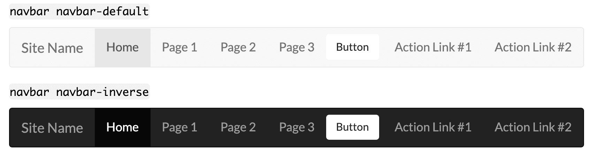

# 响应式网页设计的最佳自举教程

> 原文：<https://www.freecodecamp.org/news/best-bootstrap-tutorial-responsive-web-design/>

Bootstrap 是一个流行的 web 开发前端框架。它包含预构建的组件和设计元素来设计 HTML 内容的样式。Chrome、Firefox、Opera、Safari 和 Internet Explorer 等现代浏览器都支持 Bootstrap。

Bootstrap 包括一个用于不同布局的响应网格系统。这是建立一个移动友好网站的一个很好的起点。它还包括可选的 JavaScript 功能，如可折叠内容、传送带和模态。

#### **版本历史**

Twitter 最初开发 Bootstrap 框架作为内部工具。他们在 2011 年 8 月将其作为开源项目发布。

Bootstrap 2 于 2012 年 1 月发布。主要特征之一是引入了 12 列响应网格系统。Bootstrap 3 出现在 2013 年 8 月，转向扁平设计和移动优先的方法。Bootstrap 4 从 2017 年 8 月开始提供测试版，现在包括 Sass 和 Flexbox。

Bootstrap 4 在 2017 年发布一些测试版本之前已经开发了两年，而第一个稳定版本是在 2018 年 1 月发布的。一些显著的变化包括:

*   从少到多；
*   转移到 Flexbox 和改进的网格系统；
*   添加的卡片(替换孔、缩略图和面板)；
*   还有更多！

在撰写本文时，Bootstrap 的最新版本是 [4.1.3](http://blog.getbootstrap.com/2018/07/24/bootstrap-4-1-3/) 。如果你想了解任何公告的消息，请点击[这里](http://blog.getbootstrap.com/)。

#### **安装**

将 Bootstrap 添加到 web 项目中有两个主要选项。您可以链接到公开可用的资源，或者直接下载框架。

##### **链接到另一个信号源**

您可以通过在引用内容交付网络(CDN)的网页的`<head>`中使用`<link>`元素来添加引导 CSS:

`<link rel="stylesheet" href="https://stackpath.bootstrapcdn.com/bootstrap/4.1.3/css/bootstrap.min.css" integrity="sha384-MCw98/SFnGE8fJT3GXwEOngsV7Zt27NXFoaoApmYm81iuXoPkFOJwJ8ERdknLPMO" crossorigin="anonymous">`

添加 Bootstrap 的 JavaScript 元素类似于通常放在''标签底部的`<script>`元素。您可能需要首先包含一些依赖项。请特别注意列出的顺序:

```
<script src="https://code.jquery.com/jquery-3.3.1.slim.min.js" integrity="sha384-q8i/X+965DzO0rT7abK41JStQIAqVgRVzpbzo5smXKp4YfRvH+8abtTE1Pi6jizo" crossorigin="anonymous"></script>
<script src="https://cdnjs.cloudflare.com/ajax/libs/popper.js/1.14.3/umd/popper.min.js" integrity="sha384-ZMP7rVo3mIykV+2+9J3UJ46jBk0WLaUAdn689aCwoqbBJiSnjAK/l8WvCWPIPm49" crossorigin="anonymous"></script>
<script src="https://stackpath.bootstrapcdn.com/bootstrap/4.1.3/js/bootstrap.min.js" integrity="sha384-ChfqqxuZUCnJSK3+MXmPNIyE6ZbWh2IMqE241rYiqJxyMiZ6OW/JmZQ5stwEULTy" crossorigin="anonymous"></script>
```

*注意:这些只是示例，可能会随时更改，恕不另行通知。请参考 CDN，了解当前项目中包含的链接。*

##### **下载/安装**

您可以使用 Bower、Composer、Meteor 或 npm 下载并安装引导源文件。这允许更大的控制和根据需要包含或排除模块的选项。

`npm install bootstrap`

`gem 'bootstrap', '~> 4.1.3'`

*注意:这些只是示例，可能会随时更改，恕不另行通知。请参考<a href = '[https://getbootstrap.com/](https://getbootstrap.com/)' target = '*blank ' rel = ' no follow '>Bootstrap 网站获取最新链接。

#### **自举电网系统**

网格系统是一个移动优先的 flexbox 系统，用于快速构建适合所有设备的各种形状和大小的布局。它基于 12 列布局，有多个层，每个层对应一个媒体查询范围。

Bootstrap 附带预定义的网格类，供您在标记中使用。在 https://getbootstrap.com/docs/4.1/layout/grid/查看更多细节和示例

### **助推器特性**

*   Bootstrap 3 支持最新版本的 Google Chrome、Firefox、Internet Explorer、Opera 和 Safari(Windows 上除外)。它还支持回到 IE8 和最新的 Firefox 扩展支持版本(ESR)。[12]
*   从 2.0 开始，Bootstrap 支持响应式 web 设计。这意味着网页布局会根据所用设备(台式机、平板电脑、手机)的特点进行动态调整。
*   从 3.0 版本开始，Bootstrap 采用了移动优先的设计理念，默认强调响应式设计。
*   版本 4.0 增加了 Sass 和 Flexbox 支持

#### **更多信息:**

Bootstrap 有完整的文档，有许多[示例](https://getbootstrap.com/docs/4.0/examples/)和一个用于入门的 [HTML 模板](https://getbootstrap.com/docs/4.0/getting-started/introduction/)(该模板仅包含脚本；它不包含网格系统的设置，如果那是你正在寻找的)。

此外，你可以找到基于 Bootstrap 框架的免费主题和付费主题，以提供更加定制化和时尚的外观。

#### **引导资源:**

[Bootstrap 的官方博客](http://blog.getbootstrap.com/)

[自举网站灵感](http://expo.getbootstrap.com/)

[展示使用 Bootstrap 构建的网站](http://builtwithbootstrap.com/)

[使用 Bootstrap 的项目的 HTML linter](https://github.com/twbs/bootlint)

[引导程序的设计元素和代码片段](https://bootsnipp.com/)

[用于引导的代码、主题和附加资源](http://expo.getbootstrap.com/resources/)

# 引导程序入门教程

使用 Bootstrap 可以轻松设计一个完全响应的网站，是一个值得学习的框架。

#### 什么是响应式网站？

响应式网站是指根据浏览器的大小来调整和重新排列页面上项目的网站。有了响应式网站，如果你调整浏览器的大小，你可以看到实时发生的变化。Bootstrap 使您的网站对您的需求做出响应。

#### **如何将引导程序添加到您的页面**

将 bootstrap 添加到您的页面是一个快速的过程，只需将以下内容添加到代码中的`<head>`标记中。

```
<link rel="stylesheet" href="https://stackpath.bootstrapcdn.com/bootstrap/4.1.3/css/bootstrap.min.css" integrity="sha384-MCw98/SFnGE8fJT3GXwEOngsV7Zt27NXFoaoApmYm81iuXoPkFOJwJ8ERdknLPMO" crossorigin="anonymous">
```

您还需要在代码中的`body`标记之间添加以下内容。使用 bootstrap，您将使用`<div>`标签。当使用 Bootstrap 的许多特性时，每个标签都有自己独特的一组应用类，允许标签执行其任务。本引导指南的其他部分将展示更多引导如何使用`<div>`标签的例子。(`<div>`标签不是 Bootstrap 独有的，但是 Bootstrap 会使用它们。).

下面是将添加到代码中的`body`标记的代码，以完成入门。请记住，虽然这创建了容器，但页面仍将保持空白，直到您向容器中添加内容。

```
<div class="alert alert-success" role="alert">
    <strong>Congratulations!</strong>
    <p>Bootstrap is now working on this page</p>
</div>
```

# 模板

模板是预先构建的工具包，使创建新网页变得轻而易举。如果你对你想要的布局有一个大概的想法，或者如果你想浏览一个普通布局模板库来寻找想法，引导模板可以让你在最初的构建过程中摆脱很多的乏味和挫折。这种帮助有助于你关注项目的细节，而不是想知道为什么 CSS 不合作。

### **入门**

*   Bootstrap 的官方网页提供“主题”而不是模板。主题只是完全构建的初始项目，而模板只是描述一个预构建的 HTML 框架。主题是要花钱的，也许可以帮助开发新手，而许多模板是开源的，只提供所需的初步布局元素。
*   下面是专门为 Bootstrap 制作的布局模板列表。玩得开心！

### **模板链接**

*   [启动引导模板](https://startbootstrap.com/)
*   [W3 学校引导模板](https://www.w3schools.com/bootstrap/bootstrap_templates.asp)
*   [包装引导程序](https://wrapbootstrap.com/)
*   [Wow 滑块](http://wowslider.com/posts/35-top-free-bootstrap-templates-2016-95.html)
*   [自举制作](https://bootstrapmade.com/)

## **导航栏**

Bootstrap 框架为您提供了一个名为导航栏的功能。简而言之，导航栏(也称为 navbars)是页面顶部显示导航信息的标题。

#### **如何使用**

要使用引导导航栏，您需要在网页的`<body>`元素内的顶部添加一个`<nav>`元素。您可以添加各种样式来自定义导航栏的显示。

#### **代码示例**

这是制作一个基本导航条所需的代码。

```
<nav class="navbar navbar-default">
  <div class="container-fluid">
    <div class="navbar-header">
      <a class="navbar-brand" href="#">Site Name</a>
    </div>
    <ul class="nav navbar-nav">
      <li class="active"><a href="#">Home</a></li>
      <li><a href="#">Page 1</a></li>
      <li><a href="#">Page 2</a></li>
      <li><a href="#">Page 3</a></li>
    </ul>
  </div>
</nav>
```

#### **导航条样式**

Bootstrap 在 Bootstrap 框架中提供了一组类来设计你的导航条。这些类别如下:

*   这是导航条的默认样式。
*   除了颜色颠倒之外，这与默认样式相似。

#### **向导航栏添加下拉菜单**

你可以在导航栏中包含一个下拉菜单。该特性要求您包含 Bootstrap 的 javascript 文件才能工作。

```
<li class="dropdown">
  <a class="dropdown-toggle" data-toggle="dropdown" href="#">Drop down
    <span class="caret"></span>
  </a>
<ul class="dropdown-menu">
    <li><a href="#">Item 1</a></li>
    <li><a href="#">Item 2</a></li>
    <li><a href="#">Item 3</a></li>
  </ul>
</li>
```

#### **向导航栏添加按钮**

您可以在导航栏上添加按钮。现有的 Bootstrap Button 类可以工作，但是您需要在类列表的末尾包含类`navbar-btn`。

```
<button class="btn navbar-btn">Button</button>
```

#### **向导航栏添加表单**

您也可以将表单添加到导航栏。这可用于搜索字段、快速登录字段等任务。

```
<form class="navbar-form navbar-right">
  <div class="form-group">
      <input type="text" class="form-control" placeholder="Search">
  </div>  
  <button type="submit" class="btn btn-default">Search</button>  
</form>
```

#### **在导航条上向右对齐元素**

在某些情况下，您可能希望将导航栏中的元素靠右对齐(例如登录或注册按钮。).为此，您需要使用`navbar-right`类。

```
<nav class="navbar navbar-default">
  <div class="container-fluid">
    <div class="navbar-header">
      <a class="navbar-brand" href="#">Site Name</a>
    </div>
    <ul class="nav navbar-nav">
      <li class="active"><a href="#">Home</a></li>
      <li><a href="#">Page 1</a></li>
      <li><a href="#">Page 2</a></li>
      <li><a href="#">Page 3</a></li>
    </ul>
    <ul class="nav navbar-nav navbar-right">
      <li><a href="#">Action Link #1</a></li>
      <li><a href="#">Action Link #2</a></li>
    </ul>
  </div>
</nav>
```

#### **独立于滚动显示导航条**

在某些情况下，你可能想让导航条保持在屏幕的顶部或底部，而不管滚动。您需要将`navbar-fixed-top`或`navbar-fixed-bottom`类添加到`<nav>`元素中。

```
<nav class="navbar navbar-default navbar-fixed-top">
  <div class="container-fluid">
    <div class="navbar-header">
      <a class="navbar-brand" href="#">Site Name</a>
    </div>
    <ul class="nav navbar-nav">
      <li class="active"><a href="#">Home</a></li>
      <li><a href="#">Page 1</a></li>
      <li><a href="#">Page 2</a></li>
      <li><a href="#">Page 3</a></li>
    </ul>
  </div>
</nav>
```

#### **折叠导航栏**

在小屏幕上(比如手机或平板电脑)，导航条会占据太多空间。幸运的是，可以折叠导航条。您可以使用下面的示例来实现这一点。

```
<nav class="navbar navbar-default">
  <div class="container-fluid">
    <div class="navbar-header">
      <a class="navbar-brand" href="#">Site Name</a>
    </div>
    <ul class="nav navbar-nav">
      <li class="active"><a href="#">Home</a></li>
      <li><a href="#">Page 1</a></li>
      <li><a href="#">Page 2</a></li>
      <li><a href="#">Page 3</a></li>
    </ul>
  </div>
</nav>
```

#### **导航条示例**

