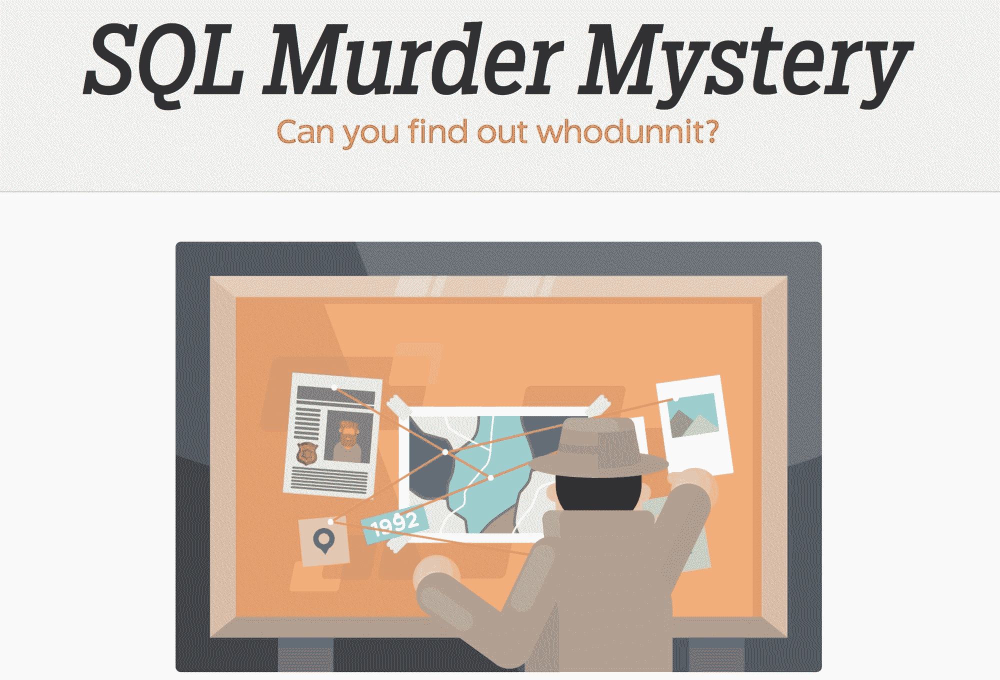
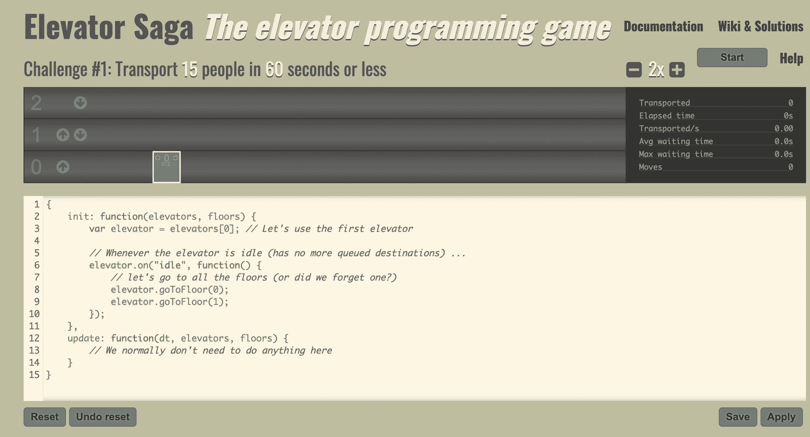
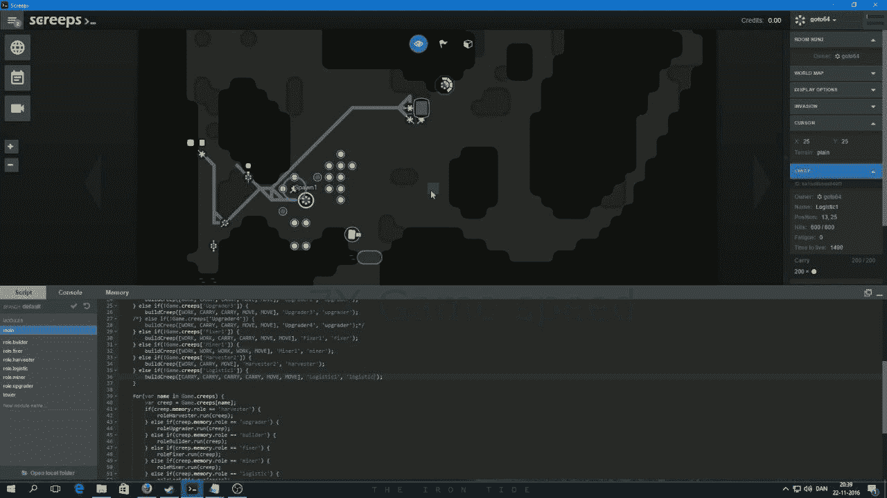
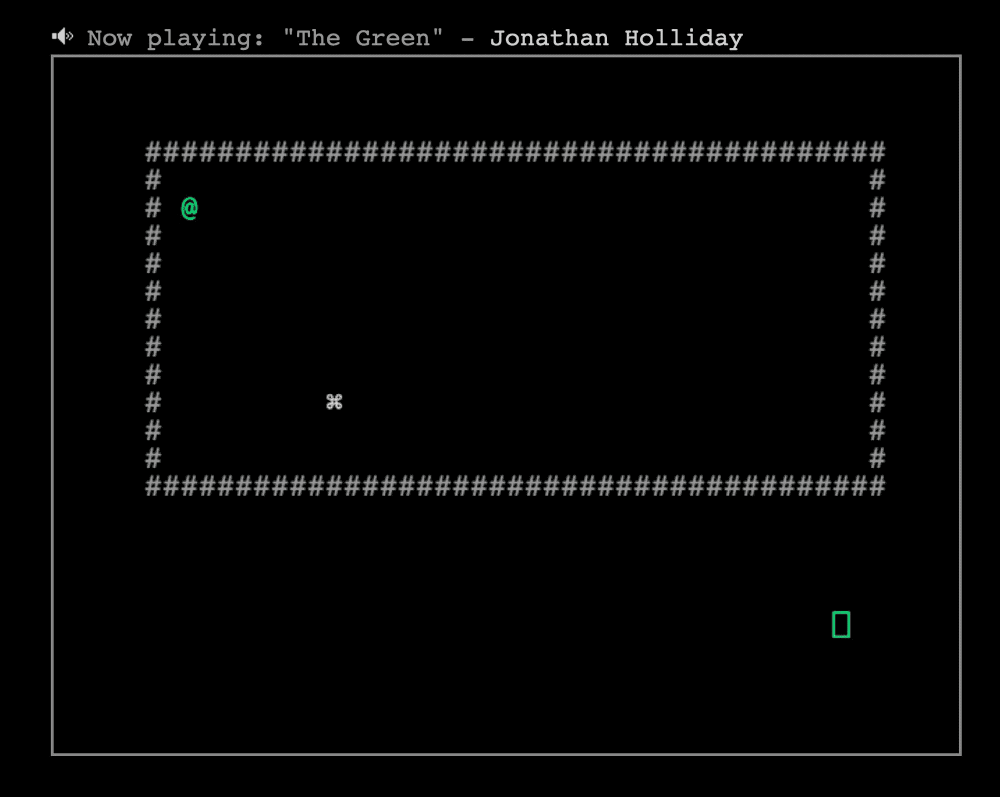
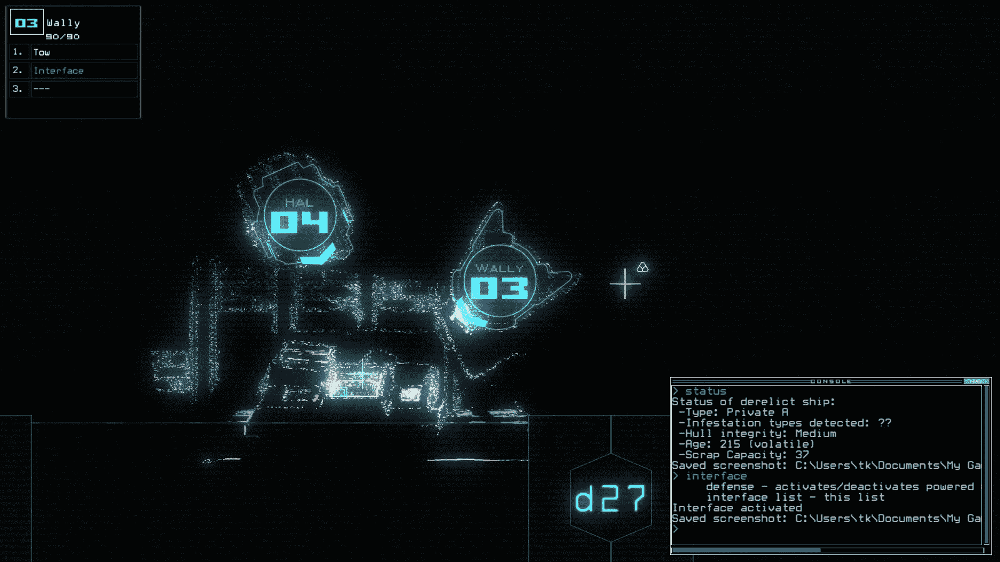
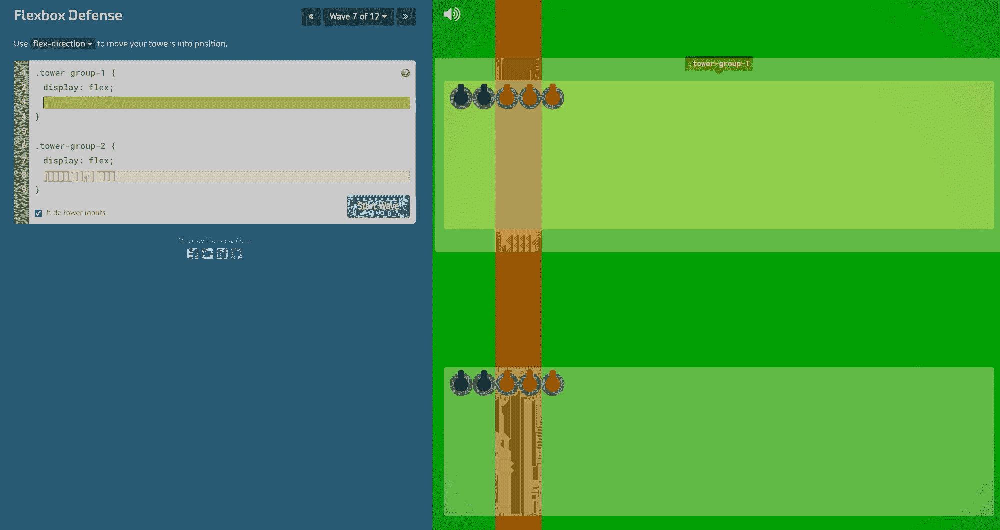
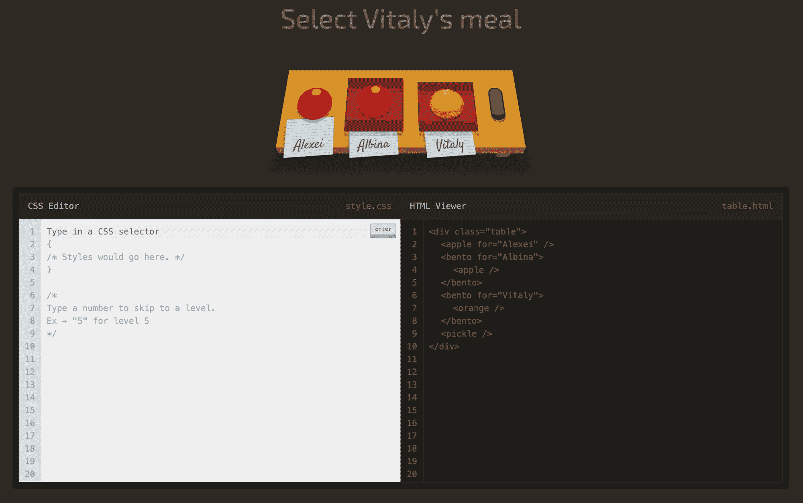
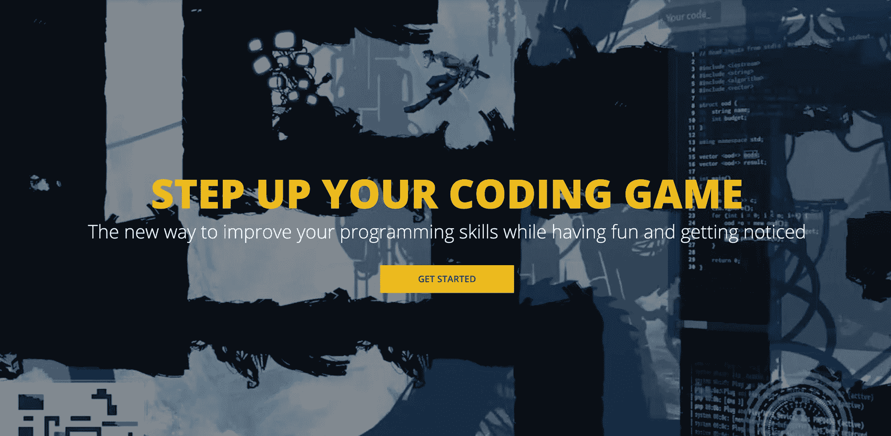
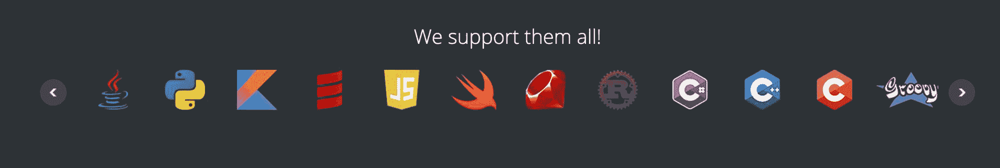
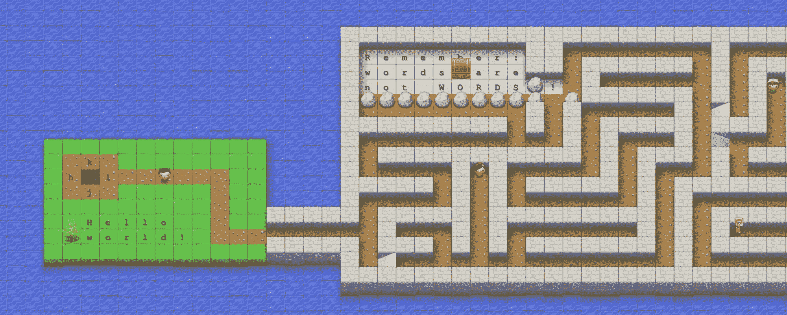

# 成人学习如何编码的 9 个最佳在线编码游戏

> 原文：<https://www.freecodecamp.org/news/best-coding-games-online-adults-learn-to-code/>

大多数编码游戏都是针对儿童的。但是也有一些很棒的编码游戏是针对那些想学习编码的成年人的。

不要误解我——在 Code.org 或可汗学院使用游戏没有任何问题。你可以学习 Scratch，这是一种编程语言，旨在帮助孩子学习循环和变量等概念。其中一些游戏甚至教授基本的 Python 或 JavaScript。

但如果你是一个完全成熟的成年人，可能更难对像《我的世界》或迪士尼的《冰雪奇缘》这样的儿童主题游戏感到兴奋。相反，你可能想找一些更严肃的游戏，让你在学习的时候保持专注。

如果这描述了你，那么我有个好消息。这个列表中充满了游戏，你可以在其中做出有意义的战略决策，然后通过代码执行这些决策。

请注意，这个列表中的所有游戏也适合孩子。但是他们的主要受众是成人学习者。

让我们开始吧。

## 最佳编码游戏精选#1: SQL 谋杀之谜

启动 SQL 谋杀之谜时，您会收到一些基本说明:

> “发生了一起罪案，侦探需要你的帮助。你依稀记得犯罪是发生在 2018 年 1 月 15 日某个时候的谋杀，发生在 SQL 市。首先从警察局的数据库中检索相应的犯罪现场报告。”

从那里，您必须使用您的 SQL 查询技能来找到杀手。

如果你对 SQL 有经验，你可能一次就能解开这个谜。如果没有，有一个很好的演练向您展示一些查询技巧。

SQL 谋杀之谜将帮助您理解和应用数据库概念，如:

*   主键和外键
*   聚合函数
*   表连接
*   甚至通配符

你可以在这里免费玩 SQL 谋杀之谜。

## 最佳编码游戏精选#2:电梯传奇

Elevator Function's minimalistic graphics, stats, and code editor

在电梯传奇中，你设计了一系列电梯来处理越来越多的乘客。

通过它的 19 个挑战，你将调整你的算法来最大限度地减少乘客从一个楼层到另一个楼层的等待时间。

这个游戏会给你大量的 JavaScript 练习。这也将迫使你发挥创造力，尝试优化方法。

这里有一个 30 秒的演示视频，让你了解电梯编程的玩法:

[https://www.youtube.com/embed/J1ie70_rDXE?feature=oembed](https://www.youtube.com/embed/J1ie70_rDXE?feature=oembed)

你可以在你的浏览器里免费玩电梯传奇。

## 最佳编码游戏精选#3: Screeps

Screeps Gameplay. Image Credit: [Goto64](https://www.google.com/url?sa=i&url=https%3A%2F%2Fwww.youtube.com%2Fwatch%3Fv%3DtOmonUwf6pI&psig=AOvVaw0N_9V-3sHlbbaiFsVlLBNN&ust=1598392456033000&source=images&cd=vfe&ved=0CA0QjhxqFwoTCPjb24fqtOsCFQAAAAAdAAAAABA9)

Screeps 标榜自己是“程序员的 MMO 沙盒策略游戏”

这是一个严肃的编程游戏，假设你已经知道一些基本的编程。

您可以使用现实生活中的编程语言(如 JavaScript)来控制您的单元。甚至可以编译 C++之类的语言，通过 WebAssembly 运行。

Screeps 早在 2017 年就出来了，现在还在积极维护。它目前在 Steam 上获得了 89%的正面评价，超过 1000 条评论，这使它成为整个 Steam 平台上最受好评的游戏之一。

这是完整的预告片:

[https://www.youtube.com/embed/ZboTgOajnGg?feature=oembed](https://www.youtube.com/embed/ZboTgOajnGg?feature=oembed)

Screeps Trailer

注意 Screeps 是付费游戏。但是有一个免费的演示可以在你的浏览器上运行。

如果你想得到完整的游戏，[你可以在这里](https://store.steampowered.com/app/464350/Screeps/)的 Steam 商店买到 Screeps。

## 最佳编码游戏选择#4:不可信

The minimalist ASCII interface of Untrusted

不可信是一个基于浏览器的流氓式游戏，它使用真实世界的 JavaScript 作为主要的游戏输入。

用游戏自己的话来说，“你必须在你的浏览器中编辑并重新执行运行游戏的 JavaScript，以将埃瓦尔博士从这个黑暗和混乱的现实中拯救出来！”

你可以在这里用你的浏览器[播放不可信的权限。](https://alexnisnevich.github.io/untrusted/)

## 最佳编码游戏精选#5: Duskers

A screenshot of Dusker's unique graphical style and command line interface

尽管之前的 4 款游戏都使用了真正的编程语言，但 Duskers 更像是 shell 脚本。

你扮演一个被困在太空中并且物资不足的程序员。你必须与废弃的宇宙飞船对接，然后清除它们。

但是你不能直接和这些船互动。相反，你控制一队无人机——每架都有自己的能力——并告诉他们如何探索这些船只。

但是要小心——如果你不小心，这些船上的怪物会摧毁你的无人机。

这个游戏完全是通过输入命令行界面来控制的。因为游戏本质上是实时的，这可能会导致当你试图从危险中拯救你的无人机时快速键入命令的一些紧张时刻。

这是 Duskers' launch 的命令行主题预告片:

[https://www.youtube.com/embed/dux33m_7M6w?feature=oembed](https://www.youtube.com/embed/dux33m_7M6w?feature=oembed)

The Duskers launch trailer

这里有一个关于游戏性及其编程根源的更深入的概述(17 分钟观看):

[https://www.youtube.com/embed/e9G6YmjC7KM?feature=oembed](https://www.youtube.com/embed/e9G6YmjC7KM?feature=oembed)

## 最佳编码游戏精选#7: Flexbox 防御(浏览器)

The main Flexbox Defense gameplay loop: programming your towers to defend against invaders.

这是一个塔防游戏，需要你使用基于 Flexbox 的命令来保护自己。

通过使用现实生活中的 CSS Flexbox 代码，你可以调整炮塔的位置，在入侵的敌人占领你之前射击他们。

有趣的事实:这个游戏是由独立黑客创始人考特兰·艾伦的兄弟钱宁·艾伦设计的。两兄弟都是优秀的程序员，对教学充满热情。

您可以在此的浏览器中[玩 Flexbox Defense。](http://www.flexboxdefense.com/)

## 最佳编码游戏精选#8: CSS Diner

CSS Diner 是一款浏览器游戏，可以帮助你学习 CSS 选择器。在 32 个级别的课程中，您将学习如何使用各种不同的属性选择 DOM 元素:

*   `id`
*   `classname`
*   `nth-of-type`
*   `nth-child`
*   `not(x)`
*   `[attribute="value"]`
*   还有更多

这是一个轻松的游戏，你可能想打几次，只是为了加强你的 CSS 选择器肌肉记忆。

你可以在你的浏览器里免费玩 CSS Diner 游戏。

## 最佳编码游戏精选#9:编码游戏

CodinGame 实际上是几个编码小游戏的集合。

最棒的是，你可以用任何你喜欢的语言编写代码。他们的编辑器支持大量的语言，并在服务器上为你编译这些语言。

Some of the languages CodinGame supports for its programming games

CodinGame 具有内置的排行榜和其他功能，可以给你足够的动力来继续练习编码。尽管该平台早在 2012 年就已经推出，但仍然没有其他类似的平台。

如果你正在寻找一个可以在 Twitch 或 YouTube 上进行实时编码的编程游戏，不用再找了。这里有很多乐趣。

您可以[在这里](https://www.codingame.com/start)的浏览器中免费探索 CodinGame。

## 奖励编码游戏:VIM 冒险

VIM Adventures teaches you how to use VIM by navigating mazes and gathering items.

好的——所以这不是一个编码游戏，而是一个教你一个强大的编码工具的游戏:VIM 代码编辑器。

您将通过有趣的方式学习 VIM 键盘快捷键和基本的 VIM 概念。这比反复思考要少得多，例如，努力回忆如何退出 VIM。

您可以在这里的浏览器中免费玩 VIM 冒险游戏。

## 必须全部播放

我希望这个列表给了你足够多的成人编程游戏来练习你的编程技巧。

如果我错过了什么好的，请发微博告诉我。

快乐编码。