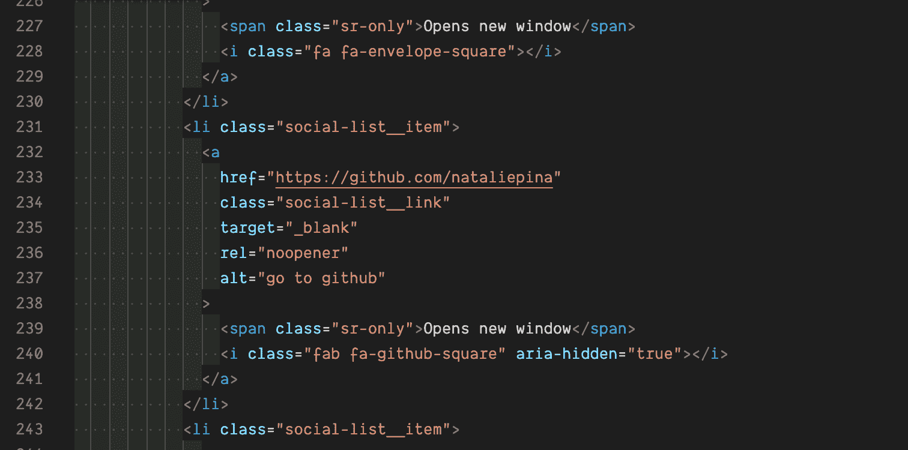
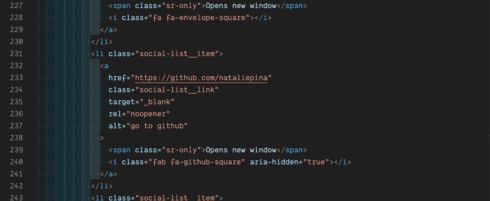
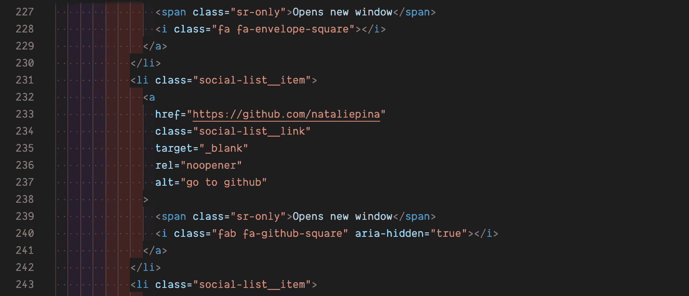
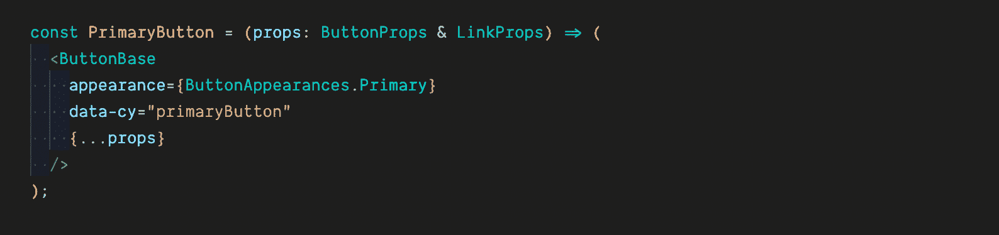
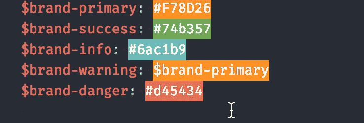
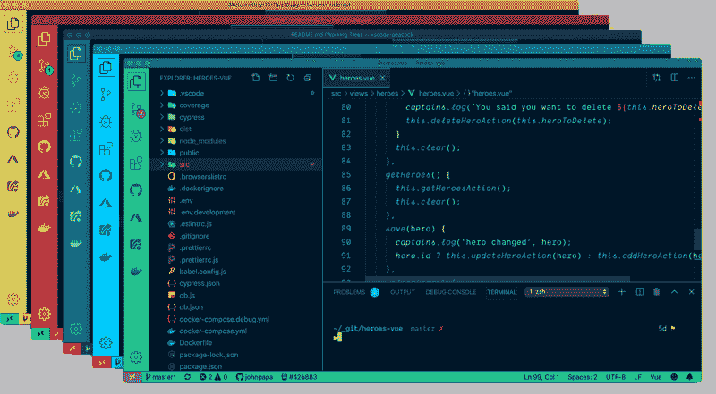
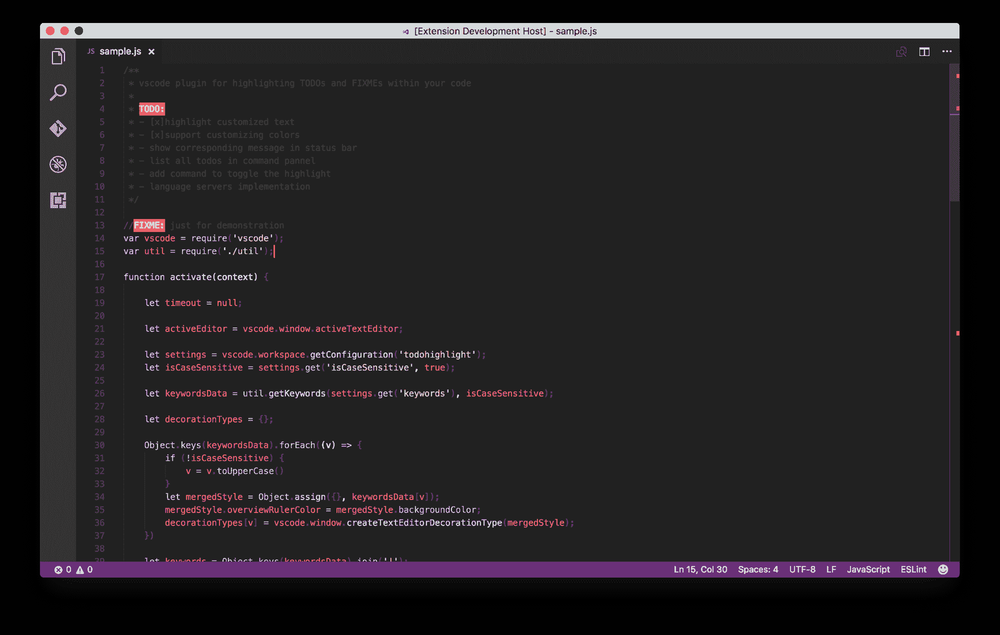

# 最佳多彩 VSCode 扩展–如何个性化您的编辑器

> 原文：<https://www.freecodecamp.org/news/best-colorful-vscode-extensions-for-productivity/>

工程师花了一天的大部分时间在他们的集成开发环境(简称 IDE)中编写代码。并且 [Visual Studio Code](https://code.visualstudio.com/) 是市场上最好的免费 IDE 之一。

我发现个性化我的 IDE 帮助我享受更多使用它的时间。我想和大家分享同样的喜悦，并且一直在寻找和测试最好的扩展来下载。其中许多会帮助你更有效率。

这篇文章超出了主题扩展的范围，所以我建议先挑选一个主题。或者试试我目前最喜欢的主题，[德古拉精制](https://marketplace.visualstudio.com/items?itemName=mathcale.theme-dracula-refined)。

## 缩进彩虹

[Indent Rainbow](https://marketplace.visualstudio.com/items?itemName=oderwat.indent-rainbow) 是一款非常棒的工具，可以为您的设置增添色彩，提高工作效率。它还可以帮助您对缩进进行对齐检查。每个压痕都有一种交替的彩虹色。

Indent Rainbow

### 奖励:缩进彩虹调色板

想在你的缩进彩虹自定义颜色？看看 Evondev 的[缩进彩虹调色板](https://marketplace.visualstudio.com/items?itemName=evondev.indent-rainbow-palettes)。

安装 Indent Rainbow 后，安装这个扩展并按照概述的步骤选择一个新的渐变调色板。

Indent Palettes1

Indent Palettes2

## 括号对着色机

这将为括号添加彩虹色，匹配的括号将具有相同的颜色。当我寻找一个丢失的或额外的括号时，这个扩展节省了我很多时间。

[括号对着色](https://marketplace.visualstudio.com/items?itemName=CoenraadS.bracket-pair-colorizer-2)是另一个受欢迎的扩展，安装量超过 400 万。

#### 2022 年的折旧通知

这个扩展最近已经贬值了。这是因为对 VSCode 的升级允许括号对彩色化设置。这可以通过用户设置中的`"editor.bracketPairColorization.enabled": true`打开。

这一功能的改进性能使其成为更好的选择，但如果你不喜欢编辑你的用户设置，我建议你寻找一些扩展来处理这个问题，比如括号对着色程序或[彩虹括号](https://marketplace.visualstudio.com/items?itemName=wayou.vscode-todo-highlight)。

## 使…变成彩色

[着色](https://marketplace.visualstudio.com/items?itemName=kamikillerto.vscode-colorize)用颜色值高亮显示颜色变量。对于翻译十六进制代码和变量名来说，这是一个方便的省时工具。

Photo Credit: Colorize

## 雄孔雀

[孔雀](https://marketplace.visualstudio.com/items?itemName=johnpapa.vscode-peacock)提供可选的窗口颜色。它非常适合管理多个工作区。在相似的窗口之间跳跃时，很容易忘记自己在哪个工作区，但孔雀提供的明亮颜色不会。你甚至可以[自定义工作区颜色](https://papapeacockstorage.z13.web.core.windows.net/guide/#favorite-colors)。

Photo Credit: Peacock

## 虚拟代码图标

添加图标有助于浏览文件夹。 [VSCode Icons](https://marketplace.visualstudio.com/items?itemName=vscode-icons-team.vscode-icons) 拥有丰富的图标库，可匹配各种文件类型。

例如，您可以根据图标很容易地看出您选择的是 TypeScript 文件还是 JavaScript 文件。它还为文件夹结构增添了额外的色彩和细节。

Photo Credit: vscode-icons

## 待办事项突出显示

[待办事项突出显示](https://marketplace.visualstudio.com/items?itemName=wayou.vscode-todo-highlight)将定制您的待办事项注释列表，并使它们以彩色显示。很容易忽略被注释掉的代码，但使用这个扩展就不行了，因为很难忽略亮橙色的文本。

`TODO`和`FIXME`内置在关键字中。您可以选择自定义这些颜色，并添加额外的关键字。

Photo Credit: TODO Highlight

## TL；速度三角形定位法(dead reckoning)

下面是本文中提到的扩展的精简列表。

*   [缩进彩虹](https://marketplace.visualstudio.com/items?itemName=oderwat.indent-rainbow)
*   [括号对上色器](https://marketplace.visualstudio.com/items?itemName=CoenraadS.bracket-pair-colorizer-2)
*   [着色](https://marketplace.visualstudio.com/items?itemName=kamikillerto.vscode-colorize)
*   [孔雀](https://marketplace.visualstudio.com/items?itemName=johnpapa.vscode-peacock)
*   [虚拟代码图标](https://marketplace.visualstudio.com/items?itemName=vscode-icons-team.vscode-icons)
*   [待办事项高亮显示](https://marketplace.visualstudio.com/items?itemName=wayou.vscode-todo-highlight)
*   [德拉库拉精制主题](https://marketplace.visualstudio.com/items?itemName=mathcale.theme-dracula-refined)

我希望这些扩展也能给你的 VSCode 带来彩虹般的色彩。