# 2020 年加入的最佳开发者社区

> 原文：<https://www.freecodecamp.org/news/best-developer-communities-to-be-part-of-in-2020/>

如果你想成为一名开发者，我不能过分强调加入开发者社区的好处。有很多好处，从对等编程到共享知识、指导、共享支持、共享工具、代码审查、回答问题等等。

社区通常是建立在个人在特定区域学习的共同努力之上的，每个社区的目标因个人的集体需求而异。

多年来，这些开发人员社区在世界各地发展壮大，虽然目标和使命不同，但总体目标仍然是为开发人员提供一个学习、互动、分享想法、相互支持和成长的平台。

“如果你想走得快，就一个人走。想走远，就一起走。”–非洲谚语

为了更好地帮助那些寻找社区加入的人，我列出了 20 个最佳社区，排名不分先后，包括工程、设计、数据科学、机器学习、开发者关系、技术写作等等。

如果你知道更多对你有帮助的社区，请在评论区分享，让大家都受益:)。

## 1.[女性编码](https://www.womenwhocode.com)

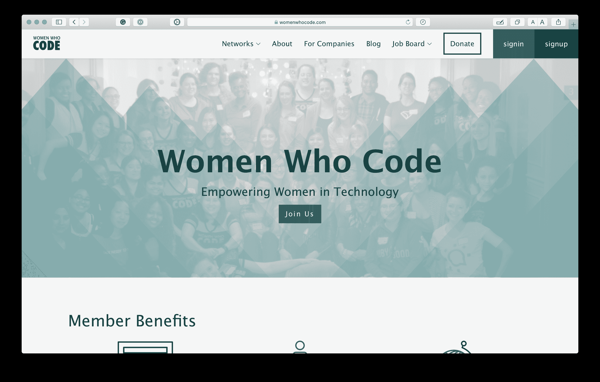

Women Who Code 是一个国际非营利组织，为从事技术工作的女性提供活动、编码资源、工作、导师等全球社区。他们旨在激励、支持和帮助女性发展技能并在职业生涯中脱颖而出。

立即加入以获得对他们的社区、活动、奖学金、免费活动门票、工作板等的独家访问权。

## 2.[哈希节点](http://hashnode.com/)

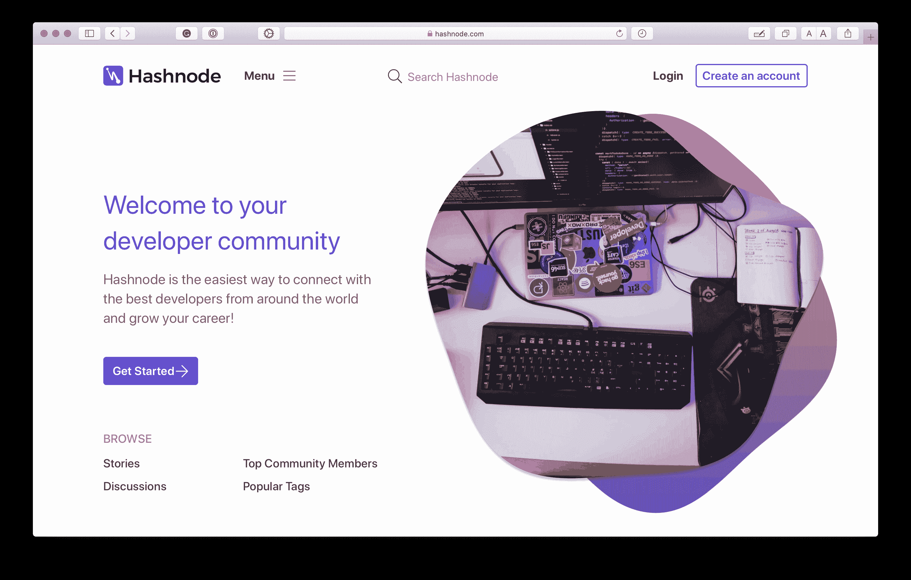

Hashnode 是一个在线社区，开发者可以在这里分享知识和发展职业。来自世界各地的开发人员参与到关于 Hashnode 的讨论中。你可以写故事，问开放式问题以及技术问题，匿名提问，并开始投票。你还可以[向受欢迎的科技团队和有影响力的开发者提问](https://hashnode.com/amas)或者从[科技行业杰出女性的故事中学习](https://hashnode.com/series/she-inspires-cjt0d02lq001e7ps2wo420g15)。

Hashnode 的 Devblog 平台让你能够在自己的定制域上创建个人博客，只需简单的几步，就能拥有成长为一名博客作者所需的一切。(无付费墙、免费域名、SSL、帖子自动备份、降价、AMP 支持等等)。[拥有你的规范](https://hashnode.com/post/hey-developers-own-your-canonical-ck1ggpmgs000cd9s1323ltbo7)，让你的内容独立，建立你的领域权威。

## 3. [Freecodecamp](https://www.freecodecamp.org/)

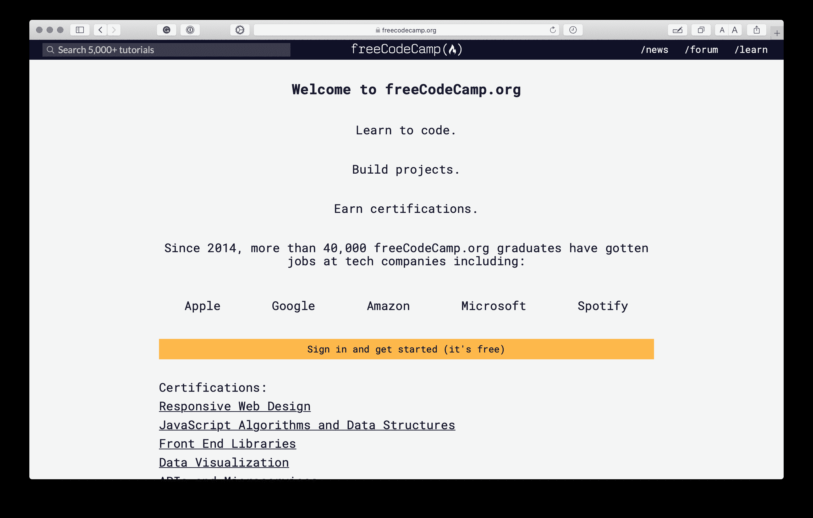

freeCodeCamp 是一个非营利组织，它通过数以千计的视频(T1)、文章(T3)、互动编码课程(T5)和世界各地数以千计的 freeCodeCamp 学习小组来帮助人们免费学习编码。

您通过完成编码挑战和构建项目以及验证认证来学习。

## 4.[堆栈溢出](https://stackoverflow.com)

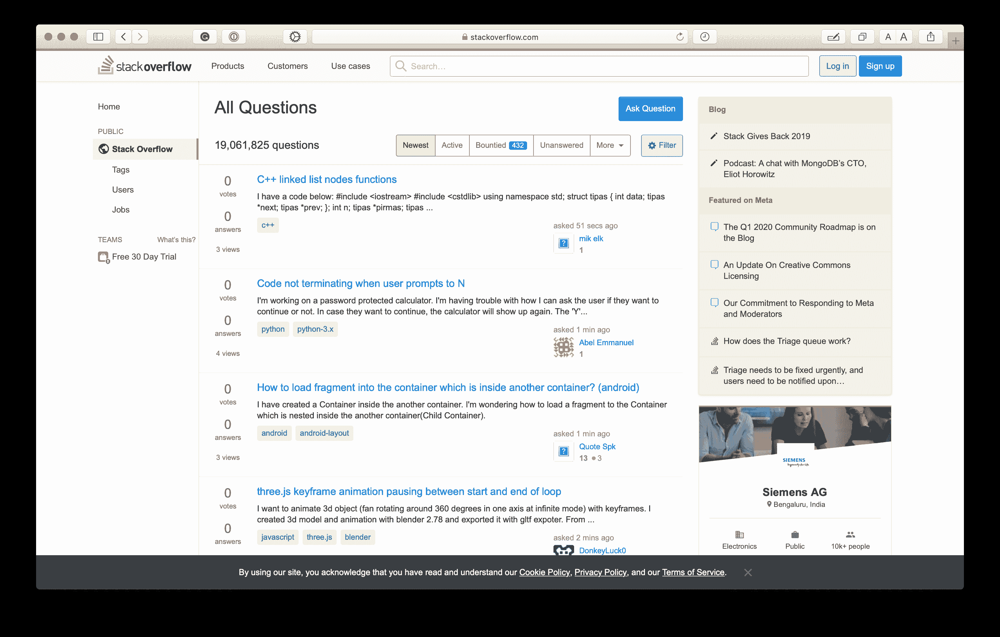

Stack Overflow 是一个面向程序员的问答网站，提供了大量关于计算机编程各种主题的问题和答案。

您可以从已经提出和回答的问题中学习，通过回答问题来分享您的编程知识，或者在此分享您的问题/错误。

## 5.[黑客新闻](https://news.ycombinator.com/)

Hacker News 是一个关注计算机科学和企业家精神的社会新闻网站，在这里你可以提交一个技术内容的链接。

这是一个向广泛的观众推广您的内容并从其他技术极客那里找到令人惊叹的内容的好地方。

## 6.[黑客月](https://hackernoon.com/)

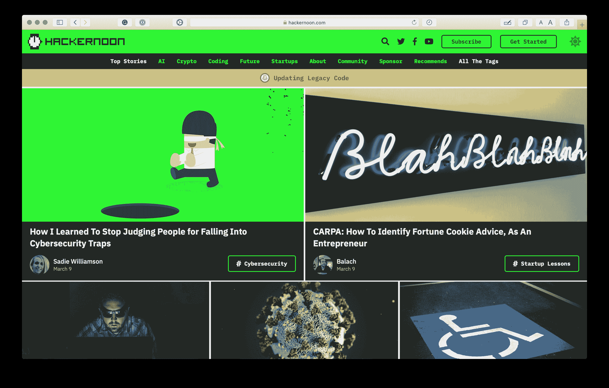

Hackernoon 是一个科技媒体网站，提供由真正的科技专业人士撰写的故事和观点，供技术专家、软件开发人员、比特币创造者和区块链爱好者阅读。

您可以在这里撰写技术文章，并从大量可用的自由技术内容中学习。

## 7. [SitePoint 社区](https://www.sitepoint.com/community/)

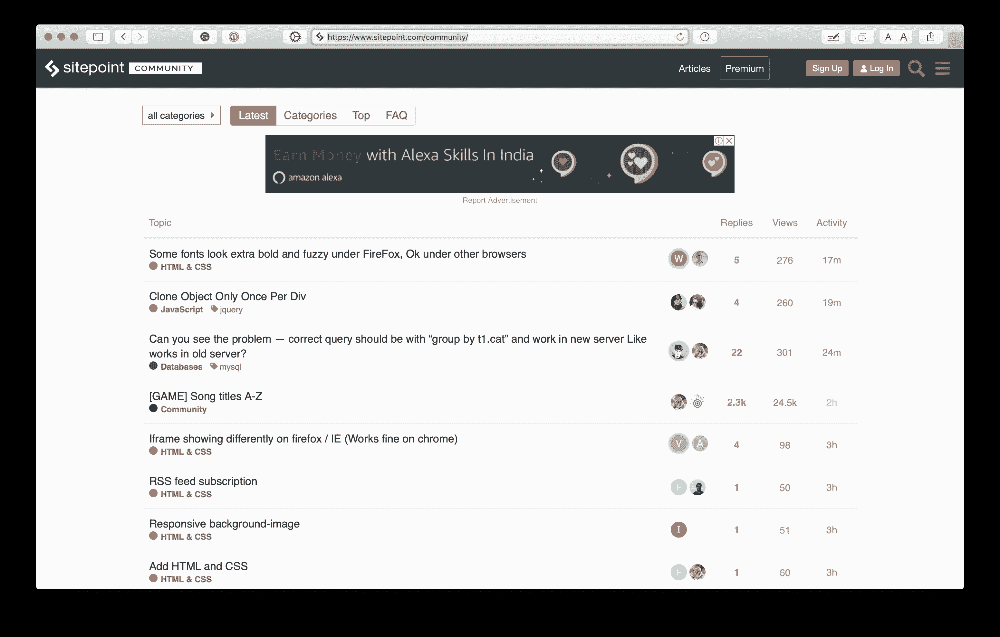

SitePoint community 是一个为网页设计者和开发者提供的讨论网页开发的社区，包括 HTML、CSS、JavaScript、PHP、Photoshop、SEO 等等。

类似于 StackOverflow，你可以在这里提问和回答所有的 web 开发问题。

## 8.[卡格尔](https://www.kaggle.com/)

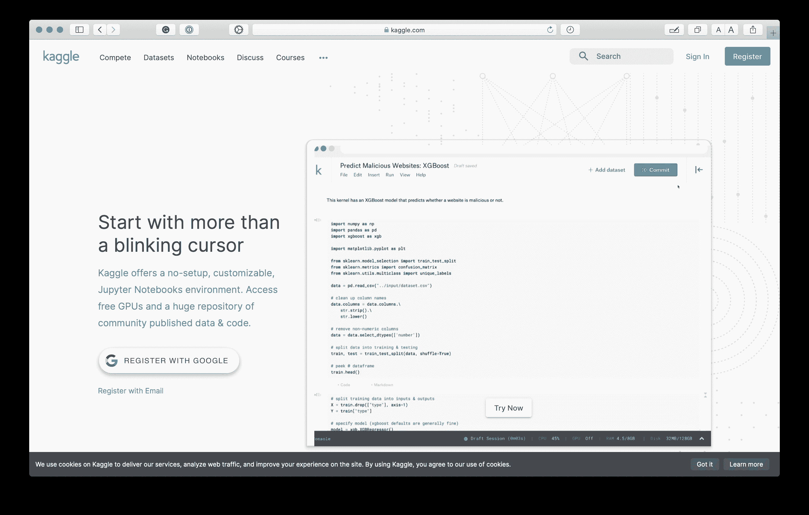

Kaggle 是一个由数据科学家和机器学习实践者组成的在线社区，拥有一个庞大的社区发布数据和代码存储库，拥有超过 19，000 个公共数据集和 200，000 个开放笔记本。Kaggle 还提供关于机器学习、熊猫、Python、深度学习、数据可视化、SQL 以及竞赛的课程，以及帮助您成长的讨论。

## 9.[独立黑客](https://www.indiehackers.com/)

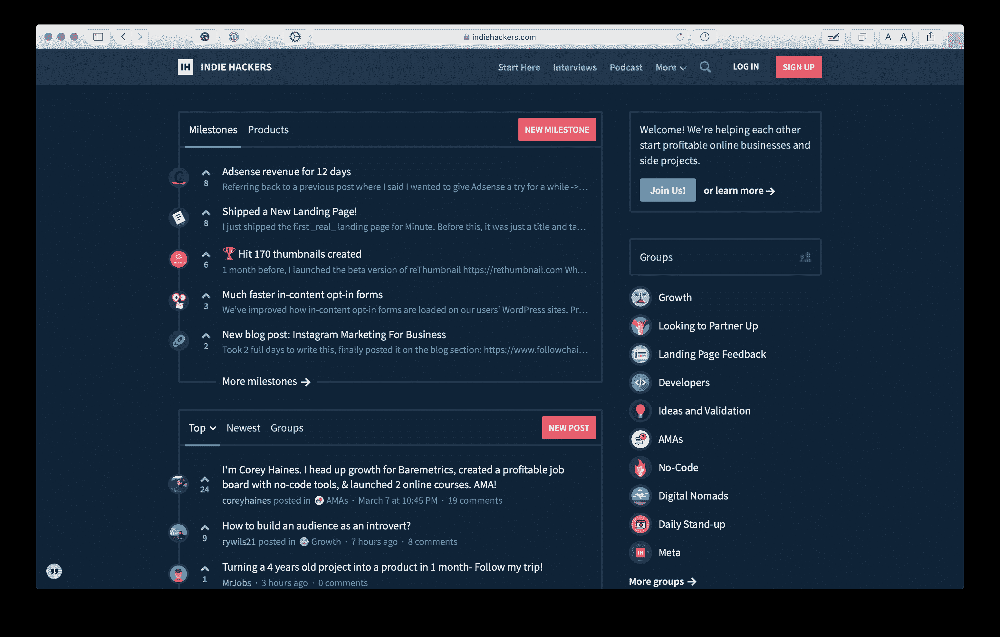

独立黑客是“建立一个可以产生收入的在线项目的人。”独立黑客是一个全球性的开发者社区，他们分享他们的项目、策略以及他们公司和副业项目背后的收入统计数据。

您可以向数百家成功在线企业背后的创始人学习，并通过他们的全球聚会、讨论、文章等与其他正在创办和发展自己公司的人联系。

## 10.[代码新手](https://www.codenewbie.org/)

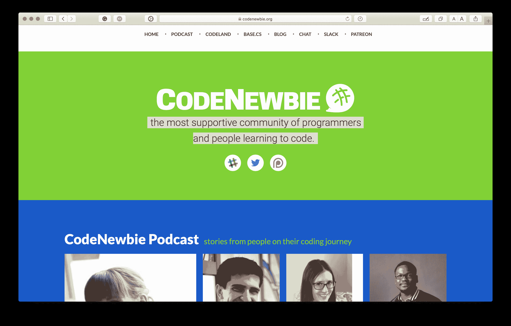

Code Newbie 是最支持程序员和学习编码的人的社区。它最初是每周一次的 Twitter 聊天，为学习编码的人提供急需的支持。从那以后，它已经发展成为一个由学习编码的人们组成的支持性的国际社区。

## 11.[数字海洋社区](https://www.digitalocean.com/community)

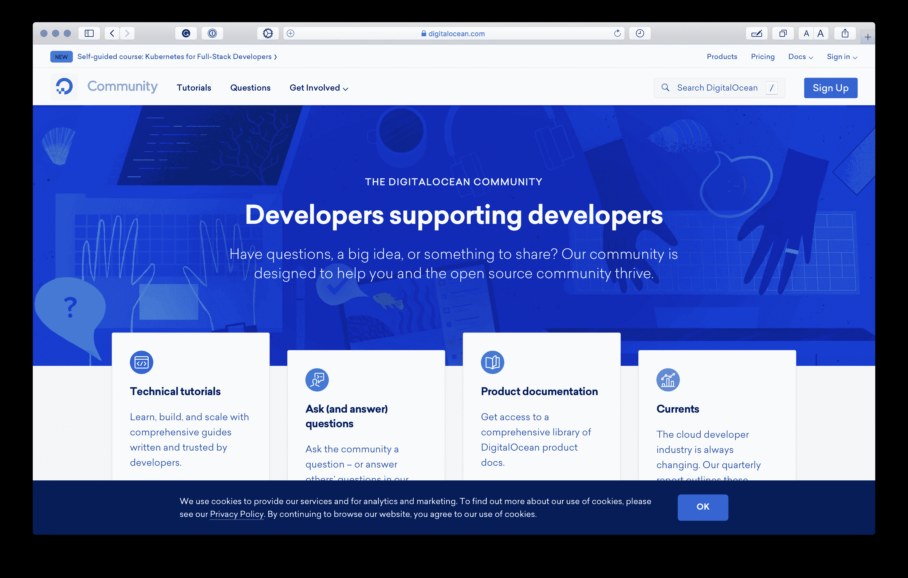

这是一个包容性的地方，开发人员可以在这里找到或提供支持，并为 DevOps 和云计算爱好者社区做出贡献。该社区为开发者提供了全面的指南、教程、趋势、问答会议等等。

## 12.[产品搜寻](https://www.producthunt.com/)

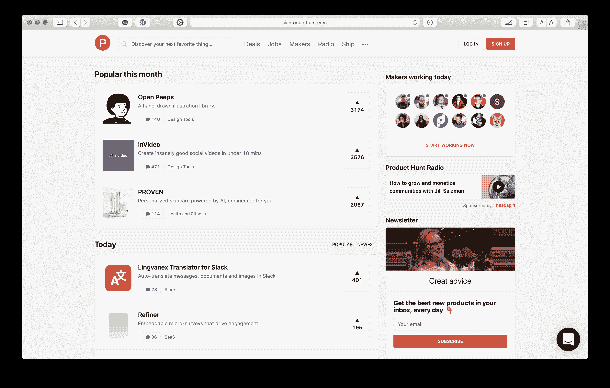

Product Hunt 是一个激动人心的社区，每天都有精彩的产品推出。这是一个产品爱好者分享和了解最新移动应用程序、网站、硬件项目和技术创新的地方。

## 13. [Reddit](https://reddit.com)

Reddit 是由数千个子社区组成的全球社区，无休止的对话和真实的网络，为开发者提供了大量永无止境的信息流，如 [r/reactjs](https://www.reddit.com/r/reactjs) 、 [r/vuejs](https://www.reddit.com/r/vuejs/) 、 [r/JAMstack_dev](https://www.reddit.com/r/JAMstack_dev/) 、 [r/Python](https://www.reddit.com/r/Python/) 等等。

## 14.[发展事业](https://devcareer.io/)

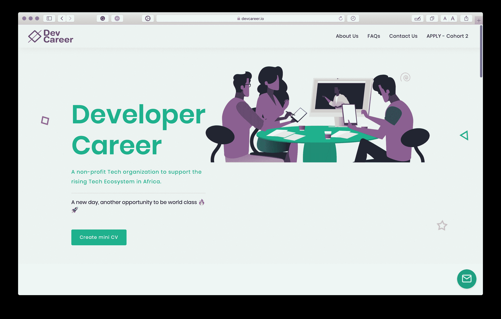

DevCareer 是一个非营利组织，致力于为未来的开发人员提供指导和资源，使他们成为世界级的开发人员。他们为通过该计划的非洲软件开发人员提供笔记本电脑、共同工作空间、资源、指导和工作安排。

## 15.[交互设计基础社区](https://www.interaction-design.org/community)

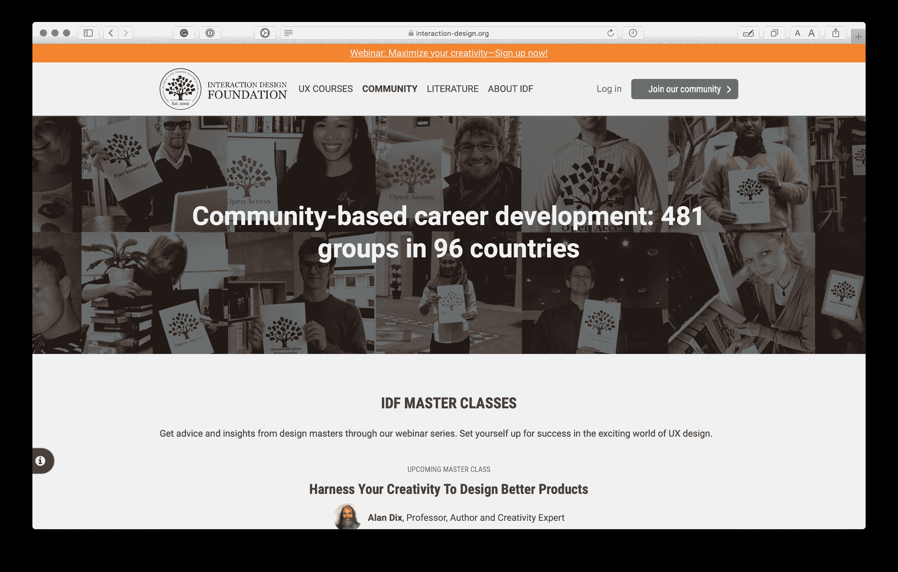

交互设计基金会社区为设计师提供了一个激动人心的机会，让他们在为新的用户体验工作做准备的同时创建和完善自己的作品。他们提供来自 UX 专家的课程，世界各地城市的当地 UX 设计会议，UX 讨论，合作等等。

## 16.[日常 UI](https://www.dailyui.co/)

每日 UI 是一个免费的每日 UI 设计挑战、设计灵感和惊喜奖励系列，让你在 100 天内成为更好的设计师。他们惊人的日常提醒会激励你不断学习。

## 17.[开发到](https://dev.to/)

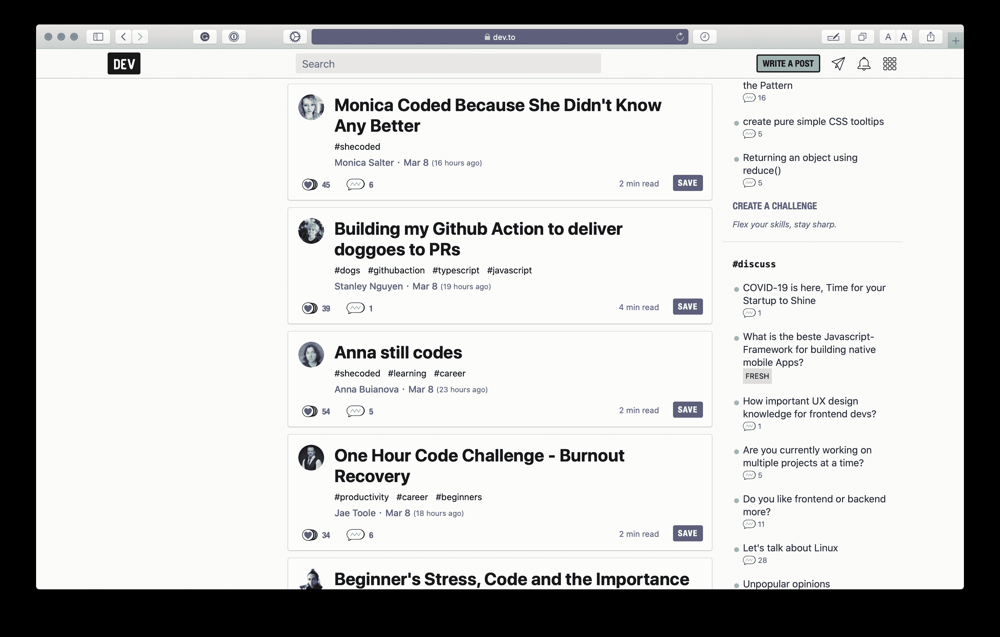

DEV 是一个软件开发人员互相帮助的社区。DEV 为开发者提供了一个学习和分享知识的地方。

## 18. [DevRel 集体](https://devrelcollective.fun/)

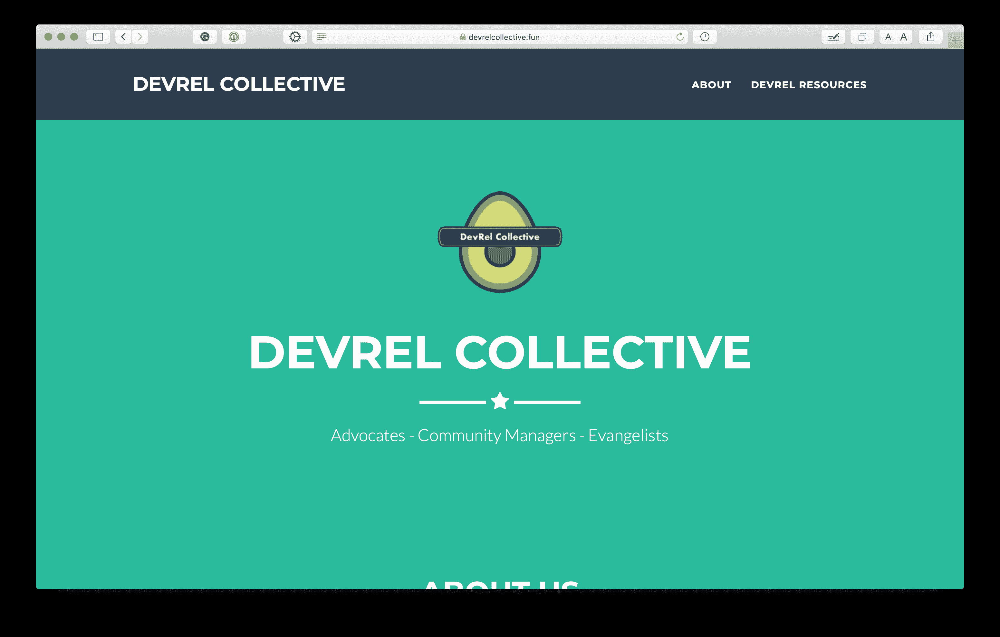

DevRel Collective 是一个开发者关系爱好者社区，旨在促进 DevRel 社区之间的信息、资源和鼓励的共享。

如果你积极参与开发者社区、宣传或事件管理，你应该加入这个社区。

## 19.[脸书开发商圈](https://developers.facebook.com/developercircles/)

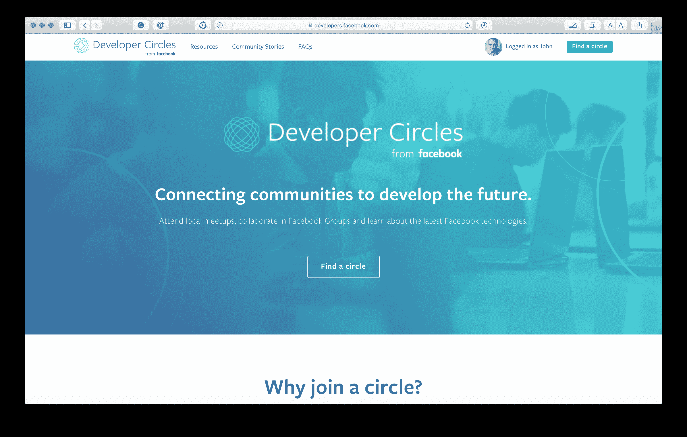

来自脸书的开发者圈子是一个旨在为开发者创建本地组织的社区的项目。这些社区提供了一个论坛，围绕特定市场中开发人员最关心的主题进行讨论和知识共享。

[在这里找到离你最近的本地开发者圈](https://developers.facebook.com/developercircles/find)。

## 20.[谷歌开发者团体](https://developers.google.com/community/gdg)

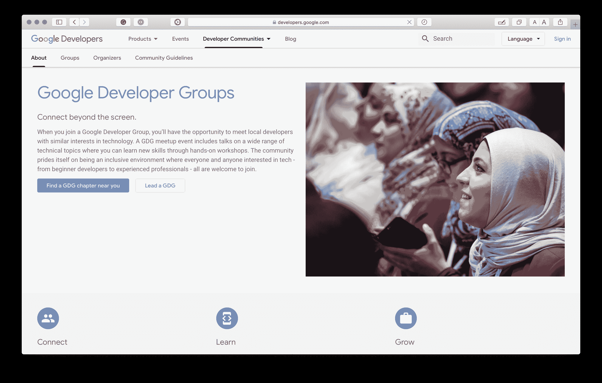

GDG 通过聚会和实践研讨会将有相似兴趣的软件开发人员聚集在一起。该社区欢迎所有对技术感兴趣的人，从初学者到有经验的专业人士

[点击此处查找离您最近的 GDG 分会](https://developers.google.com/community/gdg/groups)

## 结论

"没有比一个社区发现它所关心的东西更强大的变革力量了."玛格丽特·j·惠特利

开发者社区中的纽带已经从仅仅是“技术小组”发展到“家庭小组”，在那里每个人都热衷于分享知识、回馈社会，并帮助每个人达到更高的高度。

这难道不令人惊奇吗？为分享知识和团结成为日常秩序的新时代干杯。？？