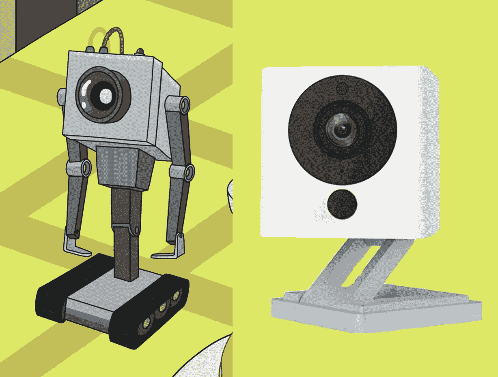
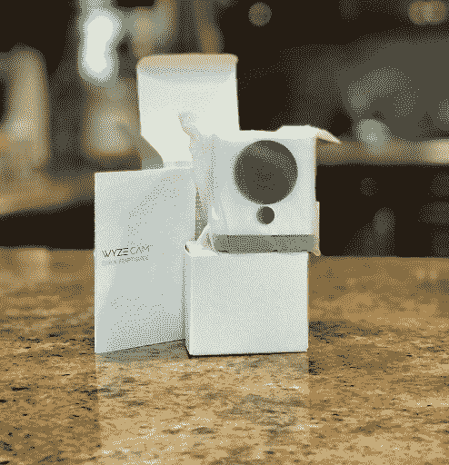
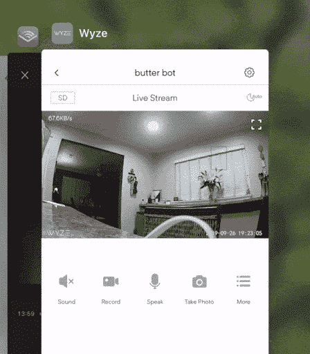
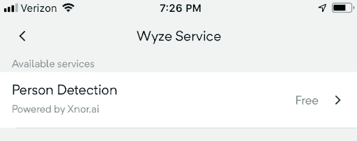
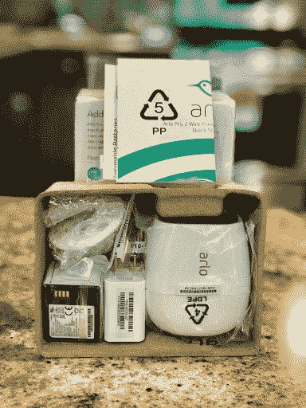
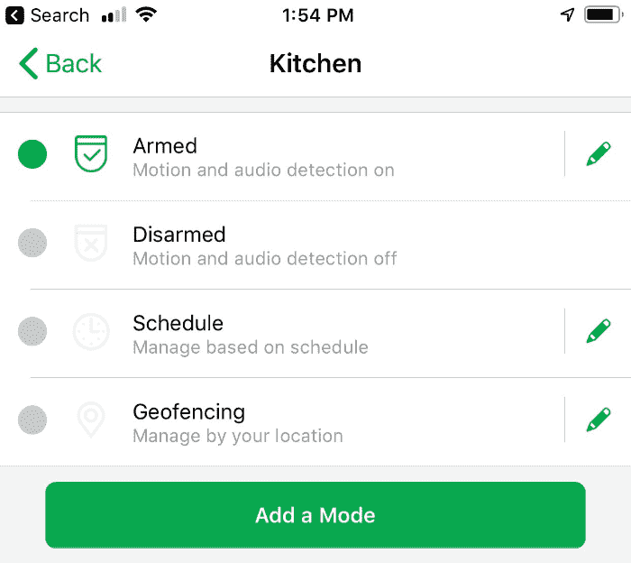
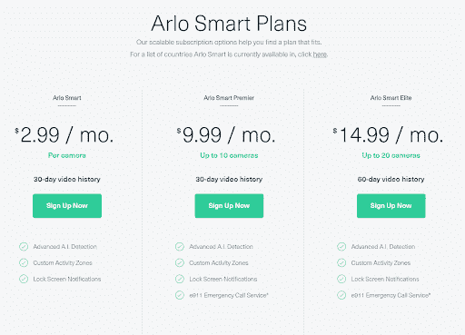
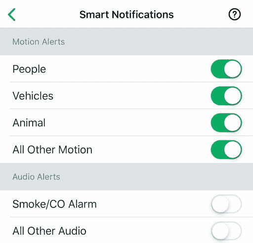
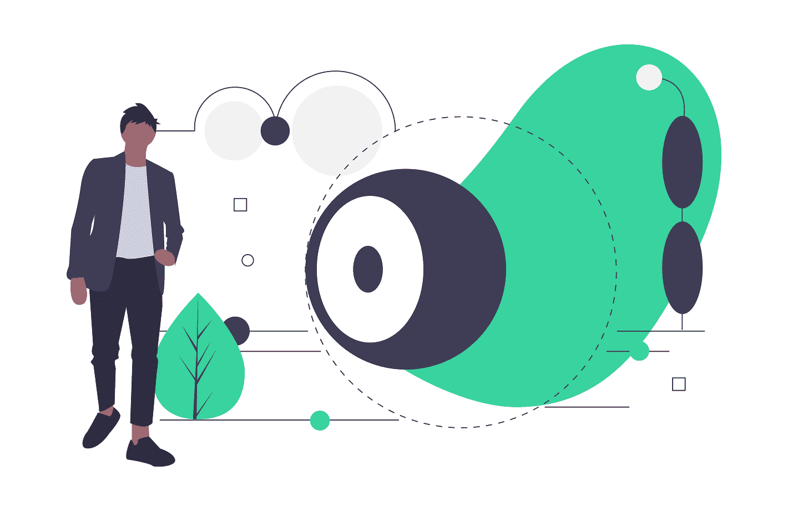

# 最好最亮的人工智能智能摄像机- 2019 年版

> 原文：<https://www.freecodecamp.org/news/best-of-ai-smart-cams/>

每个家庭都在成为智能家居。我记得向朋友们炫耀我的声控灯和我的狗的实时视频，好像我是某种数字巫师。

在 2016 年，游戏是找到任何智能设备，并将其与你现有的系统相连，如果你可以的话。但事实是，今天我 70 多岁的妈妈可以做我以前做的所有很酷的事情，而且她有更多的相机...更多的狗。

这是一个新世界，我们都有选择。我们家的方方面面变得越来越互联，越来越嘈杂。随着我们的家中堆满了智能流媒体设备，“智能”和价格变得至关重要。我们不想淹没在昂贵的推送通知中。数字生活的未来是智能和可靠的通知。这是艾说，“拿着我的啤酒。”

最初，摄像机只支持简单的运动检测。他们应该有一个警告，“这将经常发生，你会恨你的生活。如果一张纸动了，或者松鼠来了，就等着假通知吧！”对于基本动作，设备一遍又一遍地喊狼来了，以至于你完全禁用了“功能”。摄像机的目的是传递信息和安全，但如果你有数百个假警报，你将两者都得不到。

这就是为什么我认为人工智能将成为家庭安全领域的下一个大事件。人工智能不知疲倦地观察，并帮助你重新获得对你的领域的确定性，因为这就是为什么你首先想要一个家用相机。

作为一名人工智能和智能家居爱好者，我多年来一直在添加小工具、相机、锁、传感器和灯。我熟悉市面上可靠的和不可靠的设备，熟悉它们的人工智能，熟悉它们天生的愚蠢。

经过不断的试验，我的家用摄像头系统有门铃、Vivint Smarthome、Wyze 摄像头和 Arlo Pro 2 系统。有了所有这些选择，即使对我来说，所有的比较都太疯狂了。

所以我要选择两个摄像头进行人工智能对比。我认为这两者已经并将继续对家用摄像系统产生重大影响。和我一起深入了解 Arlo Pro 2 和 Wyze cam 的人工智能！

## 我们能得到什么样的 AI？

上面提到的所有摄像机都具有出色的视频、双向音频、语音辅助服务和区域范围检测。虽然它们各自的内存、滚动云覆盖和外观都有很大的不同，但我将把重点放在人工智能特性上，这样我们就可以更好地掌握未来的特性。

## Wyze Cam v2

Wyze Cam v2 小巧可爱。这让我想起了《瑞克和莫蒂》中的一个场景，所以我把我的命名为“黄油机器人”。

从包装上你可以立即看出，它很紧凑，非常适合 1080p 智能设备。甚至为设备设置使用计算机视觉通过二维码查找和设置！

### 人工智能

绿色边界框指示导致检测开始的运动区域，注意这不是人检测。

现在我们来谈谈人物检测。Wyze Cam v2(也是最初的 Wyze Cam)上的人员检测由 Xnor.ai 的深度学习技术提供支持。你可能会认出这家公司，当他们通过创造一个[小而轻的人工智能设备而出现时，这个设备是太阳能的](https://www.xnor.ai/solar-powered-ai)，轻得足以被一个气球举起。

Xnor.ai 利用专门的深度学习技术，允许简单的基于 CPU 的设备在大得多的 GPU 驱动的设备旁边保持其重量。因为人员检测声明“由 Xnor.ai 提供动力”,所以可以说该服务直接在相机上进行。[这一点得到了发布的专题文章](https://www.geekwire.com/2019/seattle-startups-vs-amazon-wyze-xnor-ai-partner-new-person-recognition-feature-20-security-camera/)的证实！

特别是在 FaceApp 的隐私暴行之后，[这是一个人工智能应用程序，它声称在使用照片时拥有版权](https://www.forbes.com/sites/thomasbrewster/2019/07/17/faceapp-is-the-russian-face-aging-app-a-danger-to-your-privacy/#17bbf72c2755)，这是一个令人耳目一新的优势。随着固件更新的发生，我们可能会免费获得新的服务，因为一切都在设备上运行。

Wyze cam 使用的另一个漂亮的人工智能应用是，如果它听到烟雾或二氧化碳警报响起，它可以向你发送通知。不是任何声音，比如我的狗叫，而是一个真正的警报声音可以触发通知。相当漂亮！

## 爱洛 Pro 2

得到一辆爱洛并不难。这些设备无处不在。时尚的设计配有一个大小合适的包装，并假设您已经有一个爱洛专业基站进行连接。

## 人工智能

默认情况下，爱洛开始时只检测动作和音频。这款开箱即用的设备其实没有什么人工智能可言。

为了打开人工智能的局面，我们必须有一个聪明的计划。这是以美元计价的价格:

US Prices Listing - See UK here [https://www.arlo.com/uk/landing/arlosmart/](https://www.arlo.com/uk/landing/arlosmart/)

这些附加在相机上的价格可能意味着这些设备的人工智能服务是在云中而不是在设备上处理的。但是，爱洛智能计划提供的功能具有多种多样的检测方案。

爱洛智能的人工智能特性:

*   人物检测
*   车辆检测
*   动物检测
*   包裹检测

网站上没有说明(但这是一个值得了解的事实)，爱洛智能计划在其智能通知中包括了火灾/一氧化碳报警警报。

这些都是可以探测到的很棒的东西！车辆检测可以帮助你识别你家附近来来往往的车辆。动物检测将帮助您跟踪您的狗，包裹检测非常适合那些非亚马逊包裹仍然会给你通知。

我在这里要表达的一个警告点是，人工智能深深融入了“智能”计划，这意味着你的整个检测系统可能完全依赖于事件发生时你的网络连接运行得如何。虽然我们生活在一个高度互联的世界，但网络问题或宕机可能会错过一个事件，让您一无所知。

另一个重要的警告是，基于云的检测必须将所有内容发送到服务器来检测人，而 Wyze 只能在检测到人的情况下触发云记录。当你添加摄像头时，看起来你可能会给你连接广泛的家增加一些不必要的拥挤。人工智能云解决方案似乎有一些与发送数据相关的重大缺点，例如降低了数据隐私性，高带宽使用率，以及可能增加的功耗。

# 对比评估两者

## 人物检测

现在，如果不能直接访问驱动每个系统的机器学习模型，很难为人员检测创建具体的测试，但进行一些简单的实验是值得的。以下是我做的三个实验(是的，我做这些的时候看起来很疯狂)。

***剧透预警:**他们俩表演的一模一样*

| **冲刺测试** -快速跑过设备 |
| *Wyze Cam v2* | *爱洛专业版 2* |
| 快速冲刺不会触发人的探测，只会触发动作。
行走速度触发人物检测。 | 快速冲刺不会触发人的探测，只会触发动作。
行走速度触发人物检测。 |

| **手部测试** -仅向摄像机展示一只手 |
| *Wyze Cam v2* | *爱洛专业版 2* |
| 手会引发动作，但不会被表示为一个人。 | 手会引发动作，但不会被表示为一个人。 |

| **做人测试**——做人！它能探测到我吗？ |
| *Wyze Cam v2* | *爱洛专业版 2* |
| 没错。站着别动，做个人，你会被发现的。 | 没错。站着别动，做个人，你会被发现的。 |

虽然这两个平台都有改进的空间，但对于智能相机来说，这是一个非常棒的功能集。阿洛确实把我误归类为宠物，所以可能需要收紧一些，但也可能是因为我没有修剪胡子:)

## 金钱

截至目前，Wyze 相机的价格为 **$19.99 美元**，并配有 14 天的视频滚动录制功能。您可以通过向相机添加 SD 卡来延长每台设备的录像时间。人员检测是您启用的免费服务。就是这样。没有订阅、试用或追加销售。

我觉得这款很清爽。这个价位、设备上存储的隐私性和人工智能使它成为一份相当不错的礼物。这是 AI on-device vs cloud 的一大好处。

爱洛 Pro 2 的零售价约为 **$179.99 美元**，并需要一个 Pro 基站( **$70** )。免费计划附带云端 7 天滚动录音。要添加人工智能功能，您需要添加每个摄像机每月 2.99 美元的**，或者最多 10 个摄像机每月 9.99 美元的**，或者最多 20 个摄像机每月 14.99 美元的**。所以可以肯定地说，你看到的价格是 Wyze 相机的 10 倍左右。******

******我是爱洛相机系统的粉丝，我认为爱洛创新并创造了高质量的产品。虽然我总是愿意为质量付费，但我确信阿洛的设备可以进行一些改进，以证明其高级价格标签的合理性。随着人工智能从云端沉淀到每个边缘设备，这将成为一个有趣的市场。******

## ******价值******

************

******十倍的价格(不包括基站)来管理 3 个应该在本地处理的人工智能功能是丰富的，即使对像我这样的技术人员来说。尤其是知道没有什么限制 Wyze 推出新的固件更新来弥合差距。包裹、动物和汽车检测是相对简单的人工智能模型，可以在固件升级中出现，并作为可能的*免费*功能存在，或者可能是一次性购买。基本上是公平竞争。******

******边缘设备的人工智能作为分布式架构似乎更强大，而不是 100%基于云。苹果已经宣布了各种保护隐私的举措，我认为任何不这样做的企业都会落后，而竞争对手会将节省的成本转移给他们的客户。******

******总的来说，在这次评估后，我会购买更多的 Wyze 设备。这两款设备在人物检测方面表现都非常出色，这是我最大的特点。但是 Wyze 在一个包中提供了我最重要的功能，不会阻塞我的 WiFi 或钱包。******

## ******这对行业和其他家庭安全公司意味着什么？******

******Wyze 摄像头体积小，功耗低，可在本地存储器上连续记录，支持人工智能，售价 19.99 美元。人员、包裹、宠物和汽车检测等功能是可扩展智能家居安全的未来。******

******价格合理的高信号、低噪声人工智能设备将成为智能家居的新标准。家用相机公司可能需要在每台设备上采用人工智能，以满足不断提高的人工智能标准，为设备优化检测的超级明星人工智能公司将随着这种需求的增加而增长。对于那些对智能家居感兴趣的人来说，这是一个令人兴奋的未来。******

* * *

### ******在 Twitter 上告诉我你的相机人工智能体验:******

## ******[@GantLaborde](https://twitter.com/GantLaborde)******

******[http://gantlaborde.com/](http://gantlaborde.com/)******