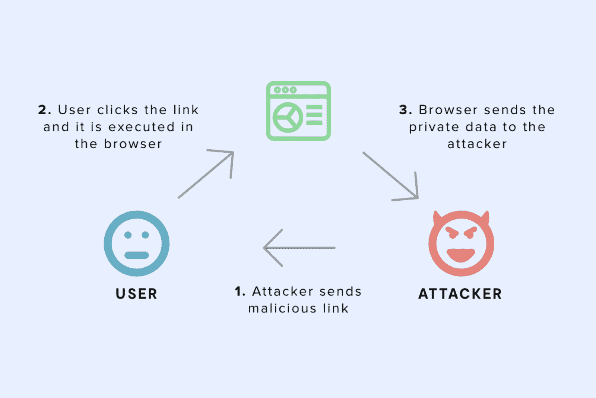
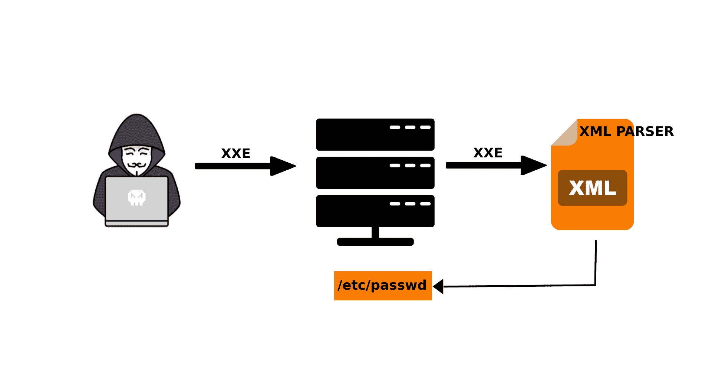
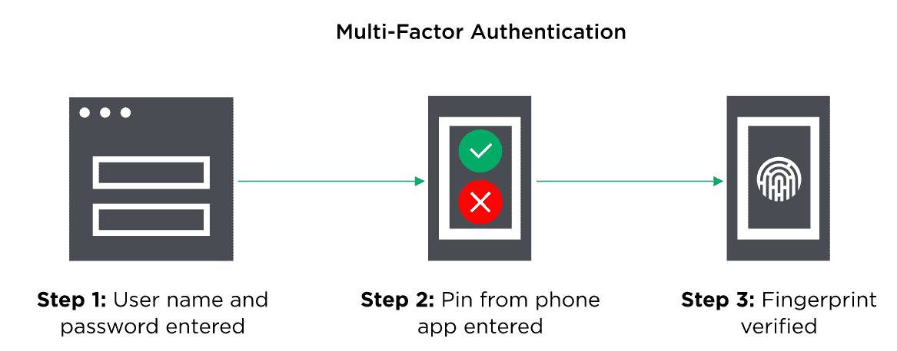
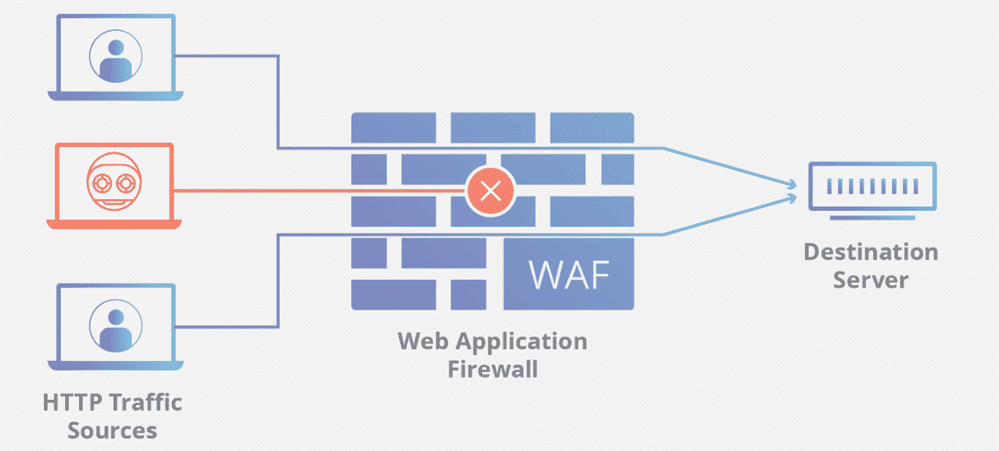

# 如何保护 React.js 应用程序

> 原文：<https://www.freecodecamp.org/news/best-practices-for-security-of-your-react-js-application/>

React.js 是一个可扩展的开源 JavaScript 库，也是当今最常用的前端框架之一。

它是动态的，如果您想创建具有可重用组件的交互式 web 应用程序，它很容易上手。

在应用程序中使用 React.js 有很多原因:

*   它的灵活性——你可以创建复杂的应用程序，而无需重新加载网页
*   简单——您可以快速轻松地启动并运行项目
*   它与其他 JS 库的易用性
*   它的可定制性——有许多开源组件可以与您的项目集成。

如你所见，React 很棒。但是在你的项目中使用它时，你需要注意一些事情。

## 应对安全漏洞

在当今世界，共享的数据比以往任何时候都多，您必须注意在应用程序中使用的任何技术的相关风险。

React 既方便又快捷，这使得它很容易出现风险，并且很容易忘记安全问题。

尽管 React 的攻击点比其他框架少，但它仍然不是完全安全的。由于 React 与其他开源组件兼容，并且没有强大的默认安全设置，因此它很容易出现安全漏洞。

海量的个人数据不断被各种 app 分享。这增加了暴露私人和财务数据的危险(和可能性)。如果你的公司使用 React，在数据泄露的情况下，他们可能会面临违反隐私法规的情况。

如果没有适当的安全特性，您的 React 应用程序将毫无用处，因此最好谨慎行事，正面应对这些安全威胁。

## React 应用程序最常见的安全威胁

由于 React 一直在更新和改进，我无法在这里创建一个详尽的漏洞列表。但是我将在这里讨论一些更广为人知和常见的威胁。

### 1.跨站点脚本(XSS)

XSS 是一个严重的客户端漏洞。攻击者能够在您的程序中添加一些被解释为有效的恶意代码，并作为应用程序的一部分执行。这损害了应用程序的功能和用户数据。



[ [Source](https://www.thirdrocktechkno.com/blog/5-react-security-vulnerabilities-serious-enough-to-break-your-application/) ]

有两种类型的跨站点脚本攻击:

1.  **反射 XSS**–在这里，攻击者使用带有浏览器处理的一些 JS 代码的恶意链接来访问和操作页面内容、cookies 和其他重要的用户数据。
2.  **存储的 XSS**–在这种攻击中，恶意内容存储在服务器上，并在用户请求存储的数据时执行。这会导致网页上出现不想要的内容。

### 2.身份验证被破坏

React.js 应用程序中的另一个常见问题是授权不充分或较差。这可能导致攻击者窃取用户凭据并实施暴力攻击。

与破坏授权相关的风险有很多，比如在 URL 中暴露会话 id、攻击者发现容易且可预测的登录详细信息、凭据的未加密传输、注销后持续有效的会话以及其他与会话相关的因素。

### 3.SQL 注入

此漏洞暴露了应用程序的数据库。攻击者注入有害的 SQL 代码，允许他们未经许可编辑数据。

黑客可以访问你的应用程序的所有数据，创建假 id，甚至控制管理员权限。

### 4.XML 外部实体攻击(XXE)



[ [Source](https://securitysouls.com/what-are-xxexml-external-entity-attacks/) ]

XXE 攻击是指攻击者将目标对准将 XML 转换成可读代码所需的 XML 解析器。

恶意代码被注入解析器以收集敏感数据，甚至试图进行 CSRF(跨站点请求伪造)和 DDoS(分布式拒绝服务)攻击。

### 5.拉链条

React 应用程序中有一个非常特殊的漏洞，称为“zip slip ”,它涉及利用允许上传 zip 文件的功能。

如果用于解压缩 zip 文件的归档不安全，攻击者可以将上传的文件解压缩到指定的目录之外，然后就可以访问该文件。

### 6.任意代码执行

这种威胁是一种常见的风险，它使攻击者能够在应用程序的某些进程上执行任意命令。

这些随机命令是危险的，因为它们可以对您的配置文件或代码的任何部分进行更改。

好了，现在我们知道什么会出错，让我们看看如何防范它。

## React.js 安全性的最佳实践

正如他们所说，一盎司的预防抵得上一磅的治疗——所以遵循适当的协议并确保您的应用程序是安全的，这始终是一个好主意。

你可能不会考虑每一个可能的漏洞，但你肯定可以通过减轻最常见的风险来使你的应用程序更加安全。


[ [Source](https://asperbrothers.com/) ]

以下是保护 React 应用程序的一些最佳实践:

### **1。React 应用程序的安全基本认证**

应用程序安全性的一个基本但重要的原则是确保服务器和客户机之间的连接是安全的。

在构建应用程序时，一个简单的方法是确保域头具有 realm 属性。领域包含有效用户的列表，并在访问任何受限数据时提示输入用户名和密码。

以下是如何设置安全领域的示例:

```
<security-realm name="ApplicationRealm">
  <authentication>
    <local default-user="$local" allowed-users="comma-separated-list"/>
    <properties path="application-users.properties"/>
  </authentication>
  <authorization>
    <properties path="application-roles.properties"/>
  </authorization>
</security-realm> 
```

如果可能，另一种简单有效的技术是使用多因素身份认证。这种身份验证方法确保用户只有在提供两个或更多身份验证凭据以验证其身份后，才被授予访问应用程序重要部分的权限。



[ [Source](https://www.onelogin.com/learn/what-is-mfa) ]

要遵循的另一个基本规则是，对于每次新的登录，您都应该使用安全的服务器端会话管理器创建一个新的会话 ID。

当您的 React.js 应用程序设置了基本的安全身份验证时，它有助于缓解 XSS 和不完整的身份验证问题。

### 2.确保 HTML 代码是有弹性的

任何 React 应用程序都需要 HTML 来呈现它，因此必须确保 HTML 代码不容易受到攻击。实现这一点的三种建设性方法是:

**A .禁用 HTML 标记**

当为任何 HTML 元素设置了“disabled”属性时，它就变成不可变的。不可能在表单中聚焦或提交该元素。

然后，您可以进行一些验证，并仅在验证为真时才启用该元素。这可以防止提交任何可能导致灾难性后果的恶意数据。

下面是禁用按钮的示例代码片段:

```
var Component = React.createClass({
	getInitialState() {
    	return {
        	submitting: true
        }
    },

    handleSubmit() {
    },

    render() {

    	return (<div>
        	<button type="button" disabled={this.state.submitting} onClick={ this.handleSubmit }>Submit</button>
    }
});

ReactDOM.render(
	<Component />,
    document.getElementById('container')
);
```

**B .使用转义字符**

JavaScript XML (JSX)是一种让您在 React 中编写 HTML 的语法。它有一个内置的自动转义功能，可以用来保护您的应用程序。

如果默认情况下用花括号{}绑定数据，那么 React 将自动对不属于绑定数据的值进行转义。

这里有一个例子:

```
return (<p style={{color: myAppColor}}>{myAppRating}</p>);
```

如果黑客试图在 myAppColor 变量中注入额外的代码，比如 *color: purple，background-color: pink* ，那么 JSX 解析器将检测到这个无效的 CSS 输入。所以额外的数据将被转义，攻击将被中和。

**C .利用 dangerouslySetInnerHTML 并净化 HTML**

您的应用程序可能需要呈现像用户提供的数据一样的动态 HTML 代码。这是使用“innerHTML”完成的，这使得应用程序容易受到恶意数据的攻击。

React 有一个功能可以通知你这个叫做`dangerouslySetInnerHTML` prop 的潜在漏洞。这是一个警告，因此您可以检查并确保在该属性存在时输入的数据来自可信来源。

```
return (<p dangerouslySetInnerHTML={{__html: myAppReview}}></p>);
```

您也可以使用像 [DOMPurify](https://github.com/cure53/DOMPurify) 这样的库来扫描用户输入并删除恶意内容。

```
// Import DOMPurify
const DOMPurify = require('dompurify')(window);

// Sanitize the review
return (<p dangerouslySetInnerHTML={{__html: myAppReview}}></p>);
```

现在，假设攻击者添加了带有图像的“onerror”代码，如下所示:

```
The app is <b>robust</b> and <i>interesting.</i>.

```

清理后的值将导致以下结果:

```
The app is <b>robust</b> and <i>interesting.</i>.

```

所有这些措施都可以保护您的 React 应用程序免受 XSS 和任意代码执行等攻击。

### 3.URL 解析时使用允许列表/阻止列表和验证

当使用锚标签`<a>`和 URL 链接内容时，您需要非常小心攻击者添加以 JavaScript 为前缀的有效负载。

为了避免基于 URL 的恶意脚本注入，请始终使用 HTTP 或 HTTPS 协议验证 URL。

```
function validateURL(url) {
	const parsed = new URL(url)
	return ['https:', 'http:'].includes(parsed.protocol)
}
<a href={validateURL(url) ? url : ''}>This is a link!</a>
```

保护 React 应用程序的另一种方法是使用 allowlist/blocklist 方法。Allowlisting 是指您拥有所有安全且允许访问的链接的列表，而 blocklisting 是指拥有所有潜在威胁的列表，如果请求访问，这些威胁将被阻止。

很难跟踪所有可能的有害链接，因此一个好的做法是允许列出已知的网站并阻止其他所有的链接。

URL 验证有助于防止身份验证失败、XSS、任意代码执行和 SQL 注入。

### 4.当允许连接到任何数据库时，总是使用最小特权原则

在 React 应用程序中，始终使用最小特权原则。这意味着必须允许每个用户和进程只访问对其目的绝对必要的信息和资源。

当连接到应用程序的数据库时，允许任何人更新、插入或删除是很危险的，因此为不同的用户分配正确的数据库角色非常重要。

除非非常重要，否则不要将应用程序数据库的管理权限授予任何人。这使得您的应用程序更安全，更不容易受到 SQL 注入攻击。

### 5.保护您的 React APIs

React APIs 的好处和坏处是它们允许你的应用程序和其他服务之间的连接。这些可以存储信息，甚至执行命令。这将您的应用程序暴露给 XSS 和 SQL 注入。

针对此漏洞的一种强大的缓解技术是根据 API 模式验证所有 API 函数。此外，安排及时的模式验证，并对所有交互使用 SSL/TLS 加密。

为了增加安全性，在通过 API 传输数据时，使用良性字符而不是`<`。

```
window.__PRELOADED_STATE__ =   ${JSON.stringify(preloadedState).replace( /</g, '\\u003c')}
```

### 6.实施网络应用防火墙(WAF)

WAF 是一个应用程序过滤器，它通过监控、分析和过滤双向流量来检测和阻止恶意内容。



[ [Source](https://www.cloudflare.com/en-in/learning/ddos/glossary/web-application-firewall-waf/) ]

您可以通过三种方式实现 web 应用程序防火墙:

1.  硬件级的基于网络的防火墙。
2.  集成到软件中的基于主机的防火墙。
3.  基于云晶圆

WAF 的基于签名的过滤在对抗 SQL 注入、XSS、任意代码执行和 zip 滑动方面是相当有效的。

### 7.建立适当的文件管理

在 React 应用程序中，你应该始终遵循适当的文件管理实践，以避免 zip slip 和其他类似的风险。

*   确认文件名是标准的，没有任何特殊字符。
*   每当文件以 zip 格式上传时，总是在提取和使用文件之前重命名它们。
*   将单个组件的所有文件一起存储在一个文件夹中，以便可以快速发现任何可疑文件。

### 8.从不序列化敏感数据

React 应用程序很有可能使用 JSON 来设置应用程序的初始状态。

这可能有潜在的危险，因为 JSON.stringify()是一个将任何数据转换为字符串而不检测恶意值的函数。攻击者可以通过注入可以修改有效数据的 JS 对象来操纵用户名和密码等数据。

```
<script>window.__STATE__ = ${JSON.stringify({ data })}</script>
```

您可以使用 serialize-javascript NPM 模块来对呈现的 JSON 进行转义，也可以使用复杂的 JSON 格式来避免序列化。但是防止任何不幸的最好方法是从序列化形式中省略机密数据。

## 结论

在创建 React 应用程序时，您必须考虑许多潜在的威胁。如果没有适当的安全性，您的应用程序可能会成为网络攻击的受害者，这可能会导致财务损失、浪费时间、违反信任和法律问题。

每天都有新的威胁出现，攻击者利用越来越多的漏洞，让您的 React 应用程序安全可能非常复杂和困难。

你可以雇佣专门从事安全的 React 开发者，也可以将开发外包给专门从事 React JS 应用开发的软件开发公司。当涉及到安全问题时，确保你身边有一个专家！