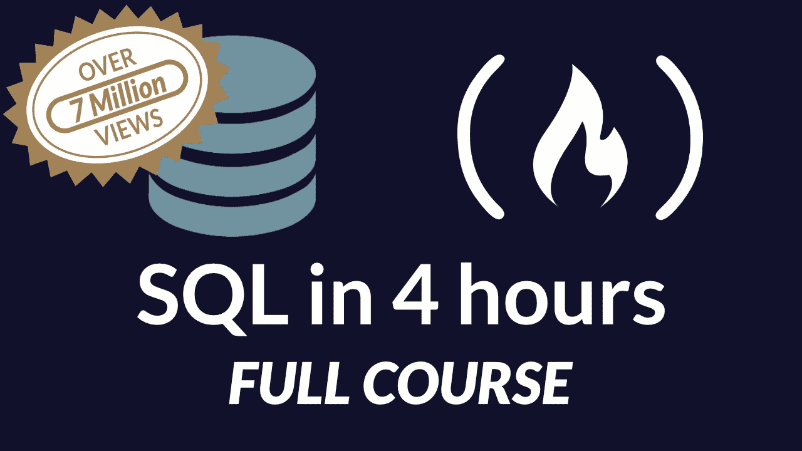

# 最佳 SQL 数据库教程

> 原文：<https://www.freecodecamp.org/news/best-sql-database-tutorial/>

SQL 代表结构化查询语言。它是用于操作和管理关系数据库(通常称为“SQL 数据库”)中数据的最常用工具。

SQL 通常读作“sequel”它最流行的变体是 MySQL、PostgreSQL 和 SQLite——SQL 的一个版本，通常用于原型开发。它引入了使用 SQL 查询通过一个命令访问许多记录的概念。

我们建议从 freeCodeCamp 的 [4 小时 SQL 数据库教程](https://www.youtube.com/watch?v=HXV3zeQKqGY)开始。



我们还推荐哈佛 CS50 的数据库和 SQL 课程。

如果你愿意，这里有一个关于关系数据库设计的完整的 [9 小时教程](https://www.youtube.com/watch?v=ztHopE5Wnpc)，这样你就可以使用 SQL 构建你自己的 RDBMS 系统。


# 一些常见的 SQL 语句和查询

## SQL Select 语句

### Select 和 From 子句

查询的选择部分通常是确定在结果中显示哪些数据列。还可以应用一些选项来显示不是表列的数据。

此示例显示了从“student”表中选择的三列和一个计算列。数据库存储学生的 studentID、名字和姓氏。我们可以将名字和姓氏列组合起来创建全名计算列。

```
select studentID, FirstName, LastName, FirstName + ' ' + LastName as FullName
from student;
```

```
+-----------+-------------------+------------+------------------------+
| studentID | FirstName         | LastName   | FullName               |
+-----------+-------------------+------------+------------------------+
|         1 | Monique           | Davis      | Monique Davis          |
|         2 | Teri              | Gutierrez  | Teri Gutierrez         |
|         3 | Spencer           | Pautier    | Spencer Pautier        |
|         4 | Louis             | Ramsey     | Louis Ramsey           |
|         5 | Alvin             | Greene     | Alvin Greene           |
|         6 | Sophie            | Freeman    | Sophie Freeman         |
|         7 | Edgar Frank "Ted" | Codd       | Edgar Frank "Ted" Codd |
|         8 | Donald D.         | Chamberlin | Donald D. Chamberlin   |
|         9 | Raymond F.        | Boyce      | Raymond F. Boyce       |
+-----------+-------------------+------------+------------------------+
9 rows in set (0.00 sec)
```

CHECK 约束用于限制可放置在列中的值范围。

如果在单个列上定义 CHECK 约束，则该列只允许某些值。

如果在表上定义 CHECK 约束，它可以根据行中其他列的值来限制某些列中的值。

### **创建表的 SQL 检查**

当创建“Persons”表时，下面的 SQL 在“Age”列上创建一个检查约束。检查约束确保您不能有任何 18 岁以下的人:

****MySQL:****

```
CREATE TABLE Persons (
    ID int NOT NULL,
    LastName varchar(255) NOT NULL,
    FirstName varchar(255),
    Age int,
    CHECK (Age>=18)
);
```

****SQL Server / Oracle / MS 访问:****

```
CREATE TABLE Persons (
    ID int NOT NULL,
    LastName varchar(255) NOT NULL,
    FirstName varchar(255),
    Age int CHECK (Age>=18)
);
```

若要允许命名 CHECK 约束，并在多个列上定义 CHECK 约束，请使用以下 SQL 语法:

****MySQL/SQL Server/Oracle/MS 访问:****

```
CREATE TABLE Persons (
    ID int NOT NULL,
    LastName varchar(255) NOT NULL,
    FirstName varchar(255),
    Age int,
    City varchar(255),
    CONSTRAINT CHK_Person CHECK (Age>=18 AND City='Sandnes')
);
```

### **对变更表进行 SQL 检查**

要在已经创建表的情况下对“Age”列创建检查约束，请使用以下 SQL:

****MySQL/SQL Server/Oracle/MS 访问:****

```
ALTER TABLE Persons
ADD CHECK (Age>=18);
```

若要允许命名 CHECK 约束，并在多个列上定义 CHECK 约束，请使用以下 SQL 语法:

****MySQL/SQL Server/Oracle/MS 访问:****

```
ALTER TABLE Persons
ADD CONSTRAINT CHK_PersonAge CHECK (Age>=18 AND City='Sandnes');
```

### **删除检查约束**

要删除 CHECK 约束，请使用以下 SQL:

****SQL Server / Oracle / MS 访问:****

```
ALTER TABLE Persons
DROP CONSTRAINT CHK_PersonAge;
```

****MySQL:****

```
ALTER TABLE Persons
DROP CHECK CHK_PersonAge; 
```

## **SQL Where 子句**

### **`WHERE`子句(与/或，`IN`，`BETWEEN`，`LIKE` )**

`WHERE`子句用于限制返回的行数。

在这种情况下，所有这五个都将被使用是一个有点可笑的`WHERE`子句。

以下是当前完整的学生列表，用于与`WHERE`子句结果集进行比较:

```
select studentID, FullName, sat_score, rcd_updated from student;
```

```
+-----------+------------------------+-----------+---------------------+
| studentID | FullName               | sat_score | rcd_updated         |
+-----------+------------------------+-----------+---------------------+
|         1 | Monique Davis          |       400 | 2017-08-16 15:34:50 |
|         2 | Teri Gutierrez         |       800 | 2017-08-16 15:34:50 |
|         3 | Spencer Pautier        |      1000 | 2017-08-16 15:34:50 |
|         4 | Louis Ramsey           |      1200 | 2017-08-16 15:34:50 |
|         5 | Alvin Greene           |      1200 | 2017-08-16 15:34:50 |
|         6 | Sophie Freeman         |      1200 | 2017-08-16 15:34:50 |
|         7 | Edgar Frank "Ted" Codd |      2400 | 2017-08-16 15:35:33 |
|         8 | Donald D. Chamberlin   |      2400 | 2017-08-16 15:35:33 |
|         9 | Raymond F. Boyce       |      2400 | 2017-08-16 15:35:33 |
+-----------+------------------------+-----------+---------------------+
9 rows in set (0.00 sec)
```

将显示的行是…

*   学生 id 介于 1 和 5 之间(包括 1 和 5)
*   `OR` studentID = 8

这里有一个更新的查询，其中任何具有 SAT 分数的记录都不会出现在这个列表中(1000，1400):

```
select  studentID, FullName, sat_score, recordUpdated
from    student
where   (studentID between 1 and 5 or studentID = 8)
        and
        sat_score NOT in (1000, 1400);
```

```
+-----------+----------------------+-----------+---------------------+
| studentID | FullName             | sat_score | rcd_updated         |
+-----------+----------------------+-----------+---------------------+
|         1 | Monique Davis        |       400 | 2017-08-16 15:34:50 |
|         2 | Teri Gutierrez       |       800 | 2017-08-16 15:34:50 |
|         4 | Louis Ramsey         |      1200 | 2017-08-16 15:34:50 |
|         5 | Alvin Greene         |      1200 | 2017-08-16 15:34:50 |
|         8 | Donald D. Chamberlin |      2400 | 2017-08-16 15:35:33 |
+-----------+----------------------+-----------+---------------------+
5 rows in set (0.00 sec)
```

*与所有这些 SQL 内容一样，它们比本入门指南中的内容要多得多。

我希望这至少能给你足够的时间开始。

请查看您的数据库管理器手册，并自己尝试不同的选项，从中获得乐趣。

## **SQL 更新语句**

要更新表中的记录，可以使用`UPDATE`语句。

小心点。您可以更新表中的所有记录，也可以只更新一部分记录。使用`WHERE`条件指定您想要更新的记录。一次可以更新一列或多列。语法是:

```
UPDATE table_name
SET column1 = value1, 
    column2 = value2, ...
WHERE condition;
```

下面是一个更新 Id 为 4 的记录名称的示例:

```
UPDATE Person
SET Name = “Elton John”
WHERE Id = 4;
```

还可以通过使用其他表中的值来更新表中的列。使用`JOIN`子句从多个表中获取数据。语法是:

```
UPDATE table_name1
SET table_name1.column1 = table_name2.columnA
    table_name1.column2 = table_name2.columnB
FROM table_name1
JOIN table_name2 ON table_name1.ForeignKey = table_name2.Key
```

以下是更新所有记录的经理的示例:

```
UPDATE Person
SET Person.Manager = Department.Manager
FROM Person
JOIN Department ON Person.DepartmentID = Department.ID
```

### **更新查询能做什么**

更新查询使 DBA 或使用 SQL 的程序员能够用一个命令更新许多记录。

重要的安全提示！在你改变它之前，总是有一个你要改变的备份！

本节将:

*   向学生表中添加一个新字段
*   测试用学校分配的电子邮件地址更新该字段的逻辑
*   更新新字段。

这是我们开始这一过程时的学生表:

```
SELECT * FROM student;
```

```
+-----------+------------------------+-----------+------------------+---------------------+---------------------+
| studentID | FullName               | sat_score | programOfStudy   | rcd_Created         | rcd_Updated         |
+-----------+------------------------+-----------+------------------+---------------------+---------------------+
|         1 | Monique Davis          |       400 | Literature       | 2017-08-16 15:34:50 | 2017-08-16 15:34:50 |
|         2 | Teri Gutierrez         |       800 | Programming      | 2017-08-16 15:34:50 | 2017-08-16 15:34:50 |
|         3 | Spencer Pautier        |      1000 | Programming      | 2017-08-16 15:34:50 | 2017-08-16 15:34:50 |
|         4 | Louis Ramsey           |      1200 | Programming      | 2017-08-16 15:34:50 | 2017-08-16 15:34:50 |
|         5 | Alvin Greene           |      1200 | Programming      | 2017-08-16 15:34:50 | 2017-08-16 15:34:50 |
|         6 | Sophie Freeman         |      1200 | Programming      | 2017-08-16 15:34:50 | 2017-08-16 15:34:50 |
|         7 | Edgar Frank "Ted" Codd |      2400 | Computer Science | 2017-08-16 15:35:33 | 2017-08-16 15:35:33 |
|         8 | Donald D. Chamberlin   |      2400 | Computer Science | 2017-08-16 15:35:33 | 2017-08-16 15:35:33 |
|         9 | Raymond F. Boyce       |      2400 | Computer Science | 2017-08-16 15:35:33 | 2017-08-16 15:35:33 |
+-----------+------------------------+-----------+------------------+---------------------+---------------------+
9 rows in set (0.00 sec)
```

### **更改表格并添加新字段**

```
 ALTER TABLE `fcc_sql_guides_database`.`student` 
	ADD COLUMN `schoolEmailAdr` VARCHAR(125) NULL AFTER `programOfStudy`;
```

执行 alter 后的 student 表。

```
mysql> SELECT FullName, sat_score, programOfStudy, schoolEmailAdr FROM student;
+------------------------+-----------+------------------+----------------+
| FullName               | sat_score | programOfStudy   | schoolEmailAdr |
+------------------------+-----------+------------------+----------------+
| Monique Davis          |       400 | Literature       | NULL           |
| Teri Gutierrez         |       800 | Programming      | NULL           |
| Spencer Pautier        |      1000 | Programming      | NULL           |
| Louis Ramsey           |      1200 | Programming      | NULL           |
| Alvin Greene           |      1200 | Programming      | NULL           |
| Sophie Freeman         |      1200 | Programming      | NULL           |
| Edgar Frank "Ted" Codd |      2400 | Computer Science | NULL           |
| Donald D. Chamberlin   |      2400 | Computer Science | NULL           |
| Raymond F. Boyce       |      2400 | Computer Science | NULL           |
+------------------------+-----------+------------------+----------------+
9 rows in set (0.00 sec)
```

### 测试逻辑(非常重要的一步！)

```
SELECT FullName, instr(FullName," ") AS firstSpacePosition, 
concat(substring(FullName,1,instr(FullName," ")-1),"@someSchool.edu") AS schoolEmail
FROM student;
```

```
+------------------------+--------------------+------------------------+
| FullName               | firstSpacePosition | schoolEmail            |
+------------------------+--------------------+------------------------+
| Monique Davis          |                  8 | Monique@someSchool.edu |
| Teri Gutierrez         |                  5 | Teri@someSchool.edu    |
| Spencer Pautier        |                  8 | Spencer@someSchool.edu |
| Louis Ramsey           |                  6 | Louis@someSchool.edu   |
| Alvin Greene           |                  6 | Alvin@someSchool.edu   |
| Sophie Freeman         |                  7 | Sophie@someSchool.edu  |
| Edgar Frank "Ted" Codd |                  6 | Edgar@someSchool.edu   |
| Donald D. Chamberlin   |                  7 | Donald@someSchool.edu  |
| Raymond F. Boyce       |                  8 | Raymond@someSchool.edu |
+------------------------+--------------------+------------------------+
9 rows in set (0.00 sec)
```

关于 concat()的一个注意事项:在 MySQL 中，这个命令用于组合字符串，在其他 SQL 版本中不是这样(查看您的手册)。在这种用法中，它是这样工作的:直到但不包括第一个空格的全名字段的子字符串与“@someSchool.edu”组合。在现实世界中，这要复杂得多，您需要确保电子邮件地址是唯一的。

### **做更新**

我们假设这就是我们想要的，并使用以下信息更新表格:

```
UPDATE student SET schoolEmailAdr = concat(substring(FullName,1,instr(FullName," ")-1),"@someSchool.edu")
WHERE schoolEmailAdr is NULL;
```

成功！

```
mysql> SELECT FullName, sat_score, programOfStudy, schoolEmailAdr FROM student;
+------------------------+-----------+------------------+------------------------+
| FullName               | sat_score | programOfStudy   | schoolEmailAdr         |
+------------------------+-----------+------------------+------------------------+
| Monique Davis          |       400 | Literature       | Monique@someSchool.edu |
| Teri Gutierrez         |       800 | Programming      | Teri@someSchool.edu    |
| Spencer Pautier        |      1000 | Programming      | Spencer@someSchool.edu |
| Louis Ramsey           |      1200 | Programming      | Louis@someSchool.edu   |
| Alvin Greene           |      1200 | Programming      | Alvin@someSchool.edu   |
| Sophie Freeman         |      1200 | Programming      | Sophie@someSchool.edu  |
| Edgar Frank "Ted" Codd |      2400 | Computer Science | Edgar@someSchool.edu   |
| Donald D. Chamberlin   |      2400 | Computer Science | Donald@someSchool.edu  |
| Raymond F. Boyce       |      2400 | Computer Science | Raymond@someSchool.edu |
+------------------------+-----------+------------------+------------------------+
9 rows in set (0.00 sec)
```

)