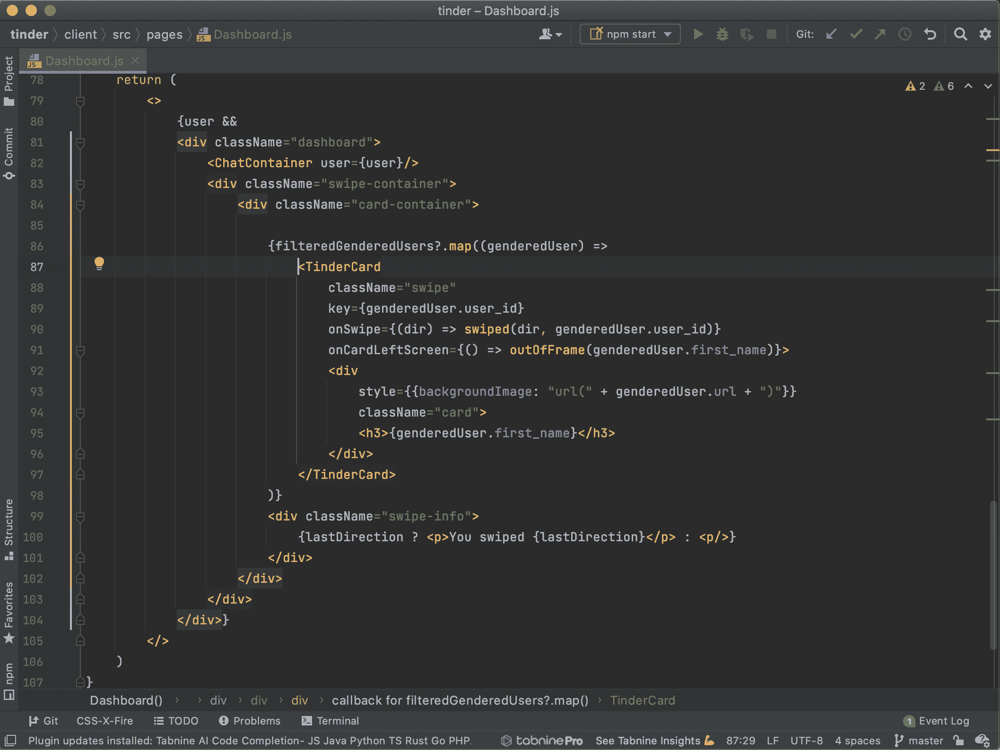
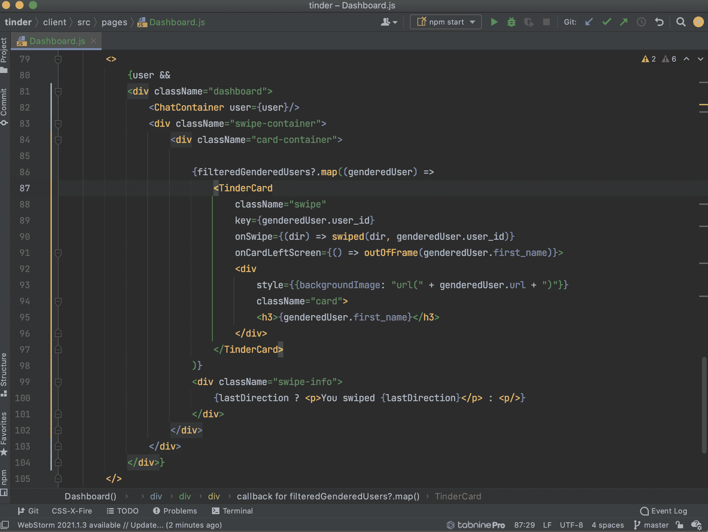
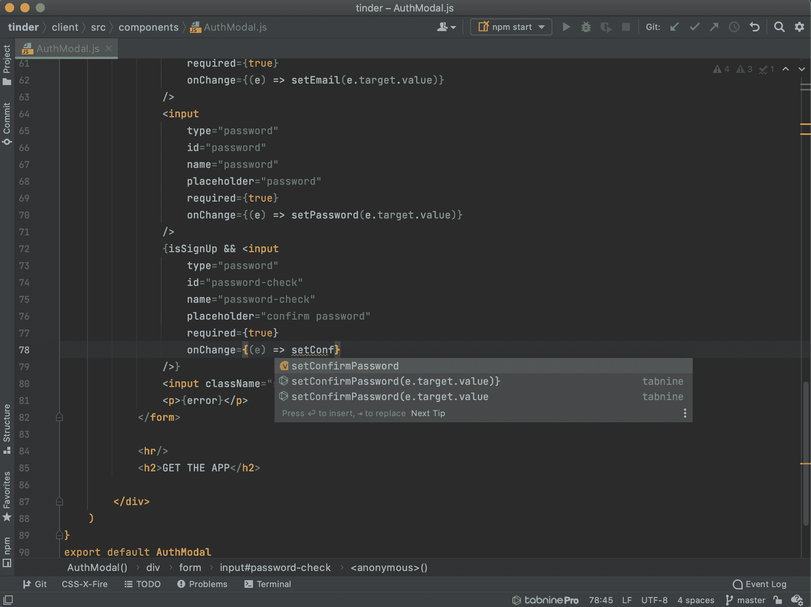
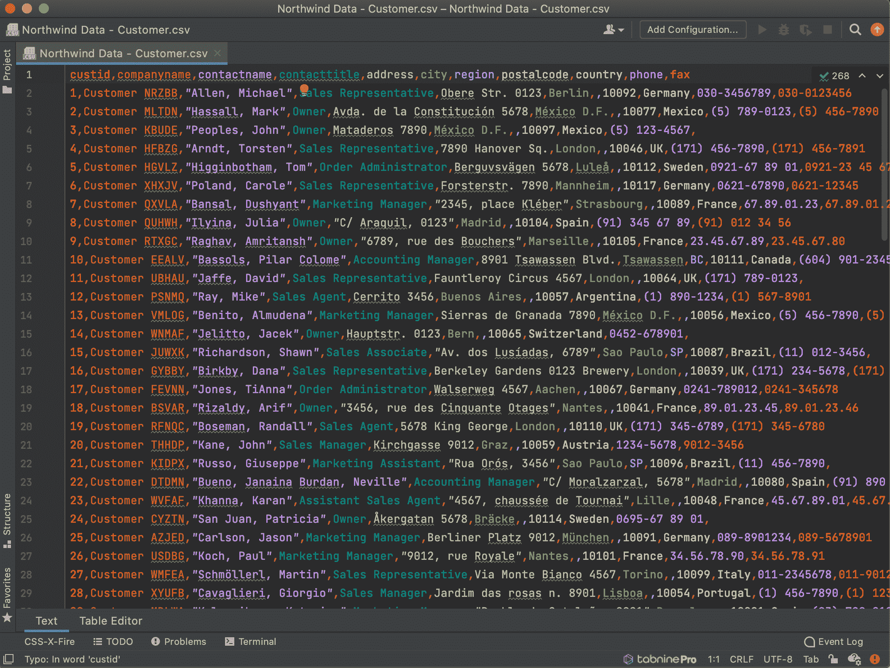
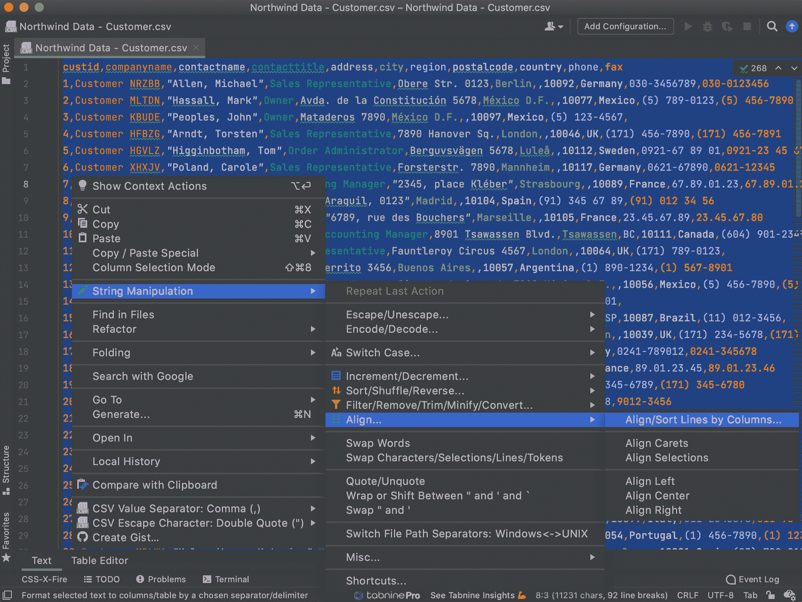
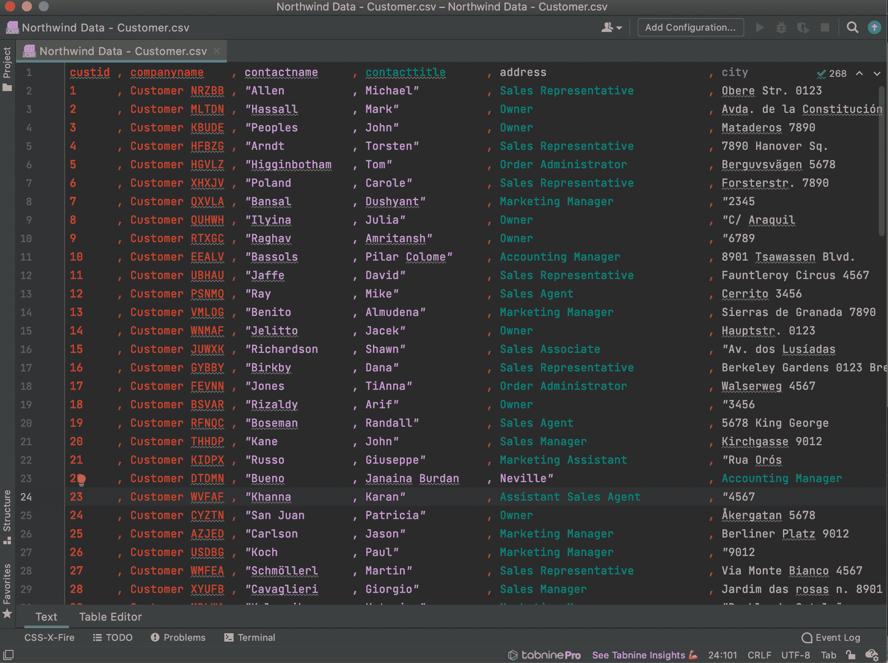
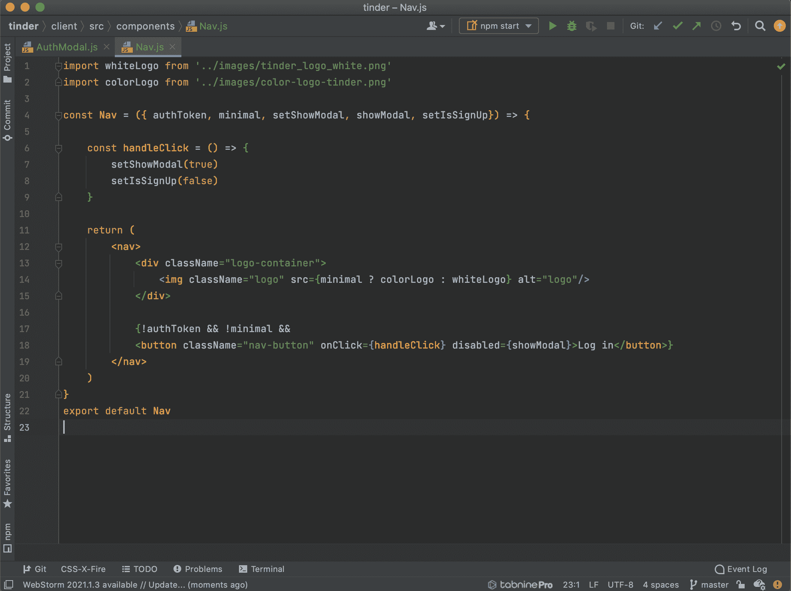
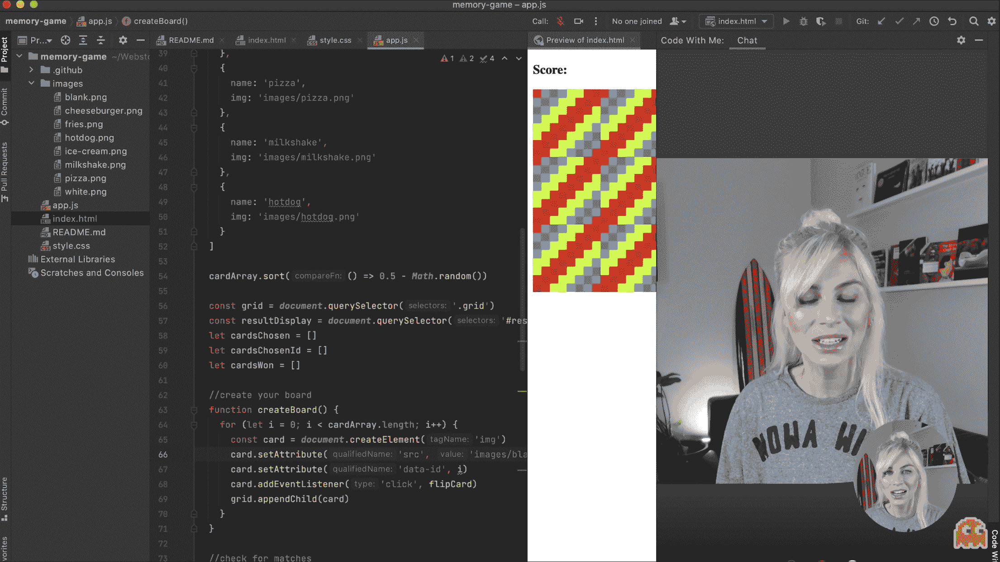
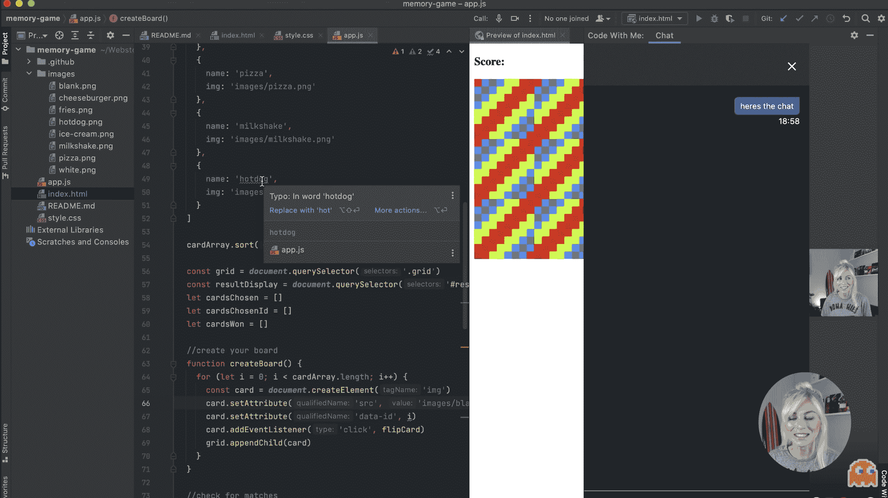

# 有效编码的最佳 Webstorm 插件

> 原文：<https://www.freecodecamp.org/news/best-webstorm-plugins-for-effective-coding/>

作为一名软件开发人员，我使用各种插件来避免错误和更有效地编码，这让我的生活更加轻松。

虽然这些省时省力的技巧看起来可以忽略不计，但当它们累积在一起时，就真的会有所不同。

在这篇文章中，我将与你分享我最喜欢的 JavaScript 开发者的 WebStorm 插件以及我的理由。

## 彩虹括号

因为谁没有花时间去揣摩哪些括号是彼此的呢？在处理 JavaScript 项目时，我经常将括号嵌套在一起，导致如下结果:

No Rainbow Brackets

跟踪某些函数的范围变得非常困难，尤其是当您想要删除一些函数时。

当涉及到作用域函数时，使用彩虹括号，您可以直观地看到代码中发生了什么。

事实上，彩虹括号不仅适用于括号，还适用于圆括号，这使得 React 项目中的映射等内容很容易识别。

Rainbow Brackets!

点击 了解更多彩虹括号 [**。**](https://plugins.jetbrains.com/plugin/10080-rainbow-brackets)

## 小报

Tabine 是我最喜欢的插件已经有一段时间了。我喜欢使用它的精确文本补全功能，它可以准确地为我预测整行代码，我可以选择通过简单的按键来接受。

Tabnine predicting code snippets based on my coding habits

它通过人工智能驱动的预测编码算法来实现这一点。当启用时，Tabnine 实际上会从您的编码习惯和您从事的项目中学习，因此它可以准确地预测您接下来要键入的内容。

我目前在我的 Webstorm IDE 中使用 Tabnine 进行 JavaScript 项目。但是它也有 30 多种语言版本，支持 21 种 ide 和代码编辑器。

点击 了解更多 [**。**](https://www.tabnine.com/install/webstorm)

## 战斗支援车

如果你使用 CSV 文件，这是一个很酷的方法。

CSV 插件将 CSV 或“逗号分隔值”视为 JetBrains IDEs 中自己的语言。这意味着它有自己的语法定义、结构化语言元素和相关的文件类型，如。csv，。tsv 和. psv。

有了这个插件，我们可以像处理编辑器中的其他代码一样处理它，错误会被突出显示出来。以下是您将获得的支持的完整列表:

*   CSV/TSV/PSV 文件检测
*   灵活的表格编辑器
*   可定制的文本编辑器
*   可自定义的列颜色
*   可定制的行注释
*   语法验证
*   语法突出显示(可定制)
*   内容格式化(可定制)
*   快速修复检查
*   意图(Alt+Enter)，例如引用/取消引用(全部)，左/右移动列
*   结构视图(标题-条目布局)
*   支持'，'，'；'、':'、' | '和'↹'作为预定义的值分隔符
*   支持自由定义的值分隔符
*   支持行注释(默认数量，可定制)
*   突出显示活动列值
*   制表符(↹)分隔符突出显示

How a .csv file looks when opened in Webstorm, with the CSV plugin.

在这里阅读更多关于 CSV [**的内容。**](https://plugins.jetbrains.com/plugin/10037-csv)

还有彩虹 CSV，如果你想在你的生活中添加一些额外的颜色！

## 字处理

字符串操作插件允许你用各种内置选项立即格式化字符串。

因此，例如，如果您想将一串突出显示的字符串更改为 camelCase，您可以立即完成。但这只是冰山一角。您可以排序字符串，过滤它们，甚至通过区分大小写来排序它们！

在整理代码时，这个工具可以节省大量时间。

Before String Manipulation

After String Manipulation! So neat and tidy in one click!

能力列表太长了，所以你可以在网站 [**这里**]( https://plugins.jetbrains.com/plugin/2162-string-manipulation) **查看，而不是贴在这里。**

## 较美丽

在提到的所有插件中，我使用 beauty 的时间最长，有时会忘记它，因为它已经成为我作为开发人员的日常活动的一部分。

更漂亮地接受你写的代码，并提供标准化和一致性。基本上，如果每个人都使用更漂亮的，那么我们所有的代码将遵循完全相同的指导方针——为一致性欢呼！

它不像 ESLint 那样为用户提供大量的选项。如果你真的想，那么你可以改变它，但那真的会违背它的目的。

Before Prettier

在这里你可以看到更漂亮的工作。它使用了一些代码，并使所有代码行的长度都小于 60 个字符。如果一行超过了它，它会被放到一个新的单独的行上。如果需要，它还会添加分号，并确保所有引号都一致。

After Prettier

那里，漂亮多了！(geddit？)

更漂亮的实际上已经捆绑了 WebStorm，所以你甚至不需要安装它就可以使用它。

## 跟我来

这与其说是一个插件，不如说是 WebStorm 的一个常规功能，因为它已经与**版本 2021.1** 打包在一起，但仍然值得一提。

现在，随着远程工作在我们的生活中变得越来越常见，我们对高效共享代码的需求比以往任何时候都更加重要。

我知道这一点，因为我已经花了很多时间“截屏”我的屏幕，并在与同事开发人员讨论时通过 Slack 发送。如果有一个工具，有人可以看到我的屏幕，编辑我的代码...

Me using Code With Me

这就是 Code With Me 所做的事情，外加视频通话。

您可以选择谁可以编辑您正在共享的代码。如果你正在对一个大的群组通话进行演示，并且不希望任何人接触它，你也可以切换到“只读”模式。

Me showing the chat functionality of Code With Me

这项功能绝对是远程工作的救星。如果你想对这个功能有更多的了解，请务必点击这里的链接。

感谢阅读！我希望这些插件能帮助你在日常编码中变得更有效率。

[Code with Ania KubówHello everyone. This channel is run by Ania Kubow. In this channel, I will be teaching you JavaScript,React, HTML, CSS, React-native, Node.js and so much more! A little bit about me:My background is in the financial markets, where I worked as a derivates broker our of University. After starting m…YouTube](https://www.youtube.com/channel/UC5DNytAJ6_FISueUfzZCVsw)