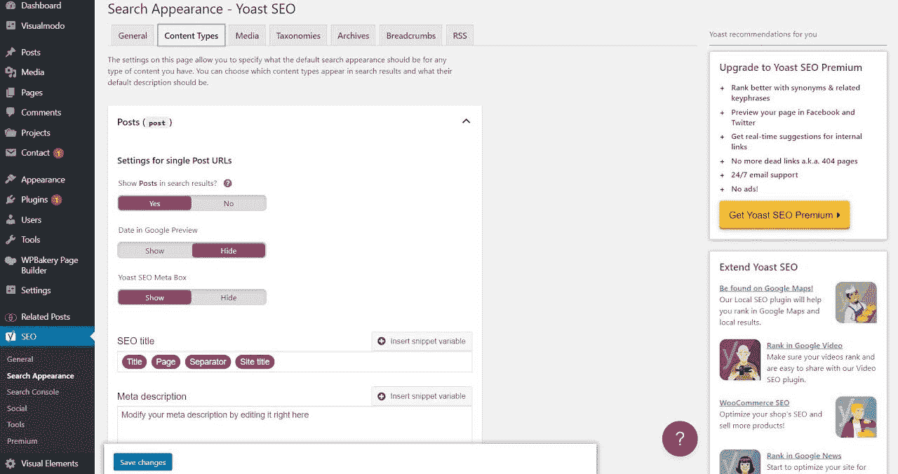
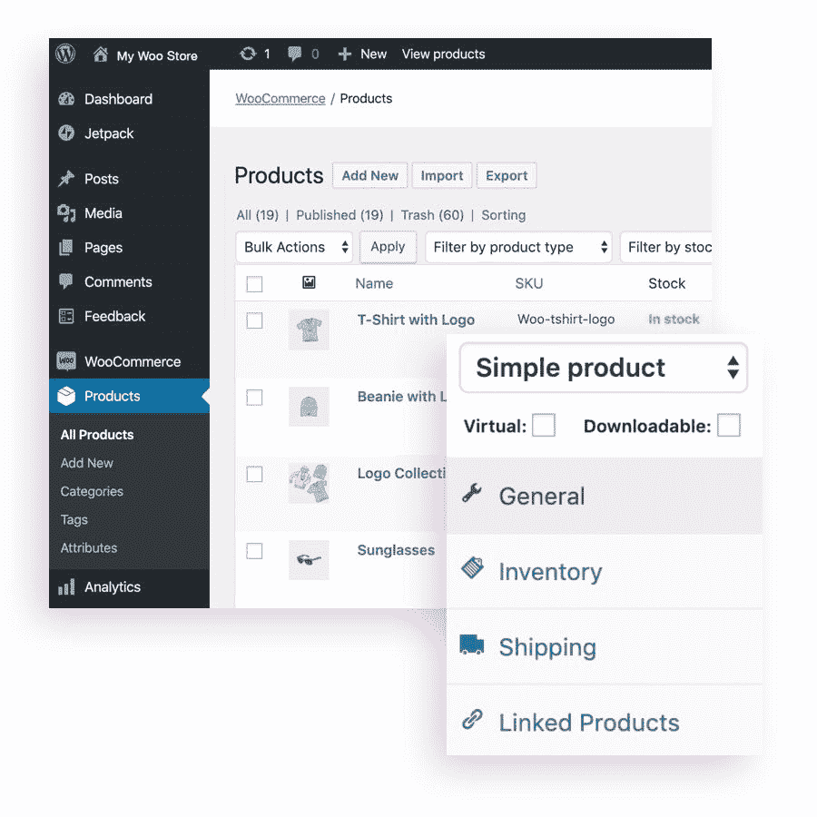
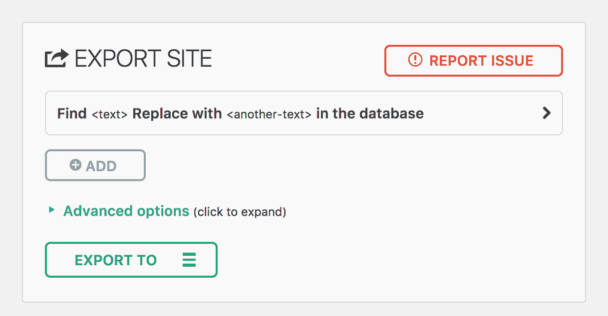

# 最佳 WordPress 插件——15 个提高你工作效率的工具

> 原文：<https://www.freecodecamp.org/news/best-wordpress-plugins/>

如果你使用 WordPress，那么你就会知道一个好的插件堆栈有多重要。它们旨在改善从媒体处理和基本功能到安全性等所有方面。

理论上，你想吃多少就吃多少，但不要吃得太多。一个好的经验法则是保持插件的数量最少。在我的[终极 WordPress 指南](https://www.weblime.com/stories/the-ultimate-wordpress-guide\)中，我解释了我的软限制是 10 左右。

这并不意味着一个有 12 或 13 个插件的网站是不好的。这意味着你应该尽最大努力去质疑每一个插件的安装，并证明它的必要性。

请记住，你的插件越少，当出现问题时，你需要做的故障诊断就越少。避免多个插件执行相同的功能也是一个好主意。它们不仅会产生冲突并引发问题，还会增加管理的难度，没有任何真正的好处。

但是网络上有这么多插件，很难选择。为了帮助你，我整理了一个 15 个插件的列表，这些插件对于提高你作为开发人员和商务人员的工作效率是必不可少的。

# 最佳 WordPress 插件

## Akismet 垃圾邮件

[根据他们的文档](https://akismet.com/wordpress/)，Akismet 根据他们的全球垃圾邮件数据库检查你网站上提交的评论和联系表格。如果插件发现匹配，它会自动将其标记为垃圾邮件，从而防止您的网站发布恶意内容。

这可以为您节省数十个小时的繁琐工作，否则您将不得不投入战斗垃圾邮件。这些机器人在数百万个网站上发布相同的评论，通常是与你的博客无关的广告网站。

如果你决定把这些评论留在你的网站上，你就冒着让访问者的电脑感染各种病毒的风险，因为这是隐藏在大多数垃圾链接背后的东西。

垃圾评论也会伤害你的搜索引擎优化工作，因为你的网站会自动指向可疑网站的链接。

只需安装 Akismet，就可以轻松抵御这些攻击。一旦你把它添加到你的 WordPress 网站，你只需要激活它。

在 926 条评论中，Akismet 的平均评分为 4.7 星。

## WordFence 安全性

根据 PurpleSec 的数据，由于新冠肺炎疫情，网络犯罪上升了惊人的 600%。保护你的 WordPress 安装的一个好方法是添加一个安全插件。

Wordfence 是 WordPress 领先的安全插件。这意味着绝大多数 WordPress 管理员都在使用它，包括许多对插件的缺陷和功能提供反馈的人。这确保了插件不断更新，并随着每个新版本变得更好。

Wordfence 通过检查您的文件漏洞、实时扫描您的站点以检测恶意软件、监控谁访问了您的站点、阻止不良 IP 等来帮助您防止黑客利用您的站点。

在 3，737 条评论中，WordFence 的平均评分为 4.7 星。

## WP Cerber

WP Cerber Security 结合了 Akismet 和 WordFence 的功能。如果你想在同一个插件下拥有完整的安全功能，那么 WP Cerber 可能是正确的选择。

Cerber 是一个易于设置、易于管理的反垃圾邮件解决方案，用于保护您的联系人和注册表单。Cerber Security 采用了同样强大的 Cerber 反垃圾邮件引擎，可以保护 Slashdot、Reddit、Digg 等热门网站上的评论部分。

该插件通过只允许注册用户的评论来保护你的网站免受垃圾评论的侵害。Cerber Security 提供了一个可选的验证码挑战形式的验证，以进一步防止机器人。

Cerber CAPTCHA security 是目前业界最准确的反垃圾邮件技术，它可以消除垃圾邮件注册，并保护您的联系人表单免受电子邮件收割机和机器人等自动攻击。

WP Cerber 在 554 条评论中的平均评分为 4.9 星，这使得它在用户反馈方面成为同类产品中最好的之一。

## 约斯特

现在你已经保护了你的网站，是时候看看那些让 SEO 轻而易举的插件了。

Yoast 是最完整的 WordPress SEO 插件。它处理搜索引擎优化您的网站的所有方面，包括关键字研究、元描述、标题等等。Yoast 帮助你使你的网站容易被人和搜索引擎如 Google、Bing 或 Yahoo 访问。

Yoast 提供了优化页面内容所需的工具，包括页面分析、每个帖子类型的动态元框、帖子片段预览和片段编辑器。

随着 Yoast SEO 在您的网站上运行，您将更加熟悉 SEO 最佳实践以及搜索引擎如何查看您网站的内容。这是最重要的插件之一，应该是你的 WordPress 堆栈的一部分。

Yoast 是迄今为止评分最高的 WordPress 插件，在 27414 条评论中，平均评分为 4.8 星。

## 兰克马斯

Rankmath 是一个算法内容生成器。您可以使用它来创建 SEO 优化的内容，同时节省您大量的时间。

RankMaths 的简单界面可以帮助你在几分钟内创建独特的文章、博客帖子、页面、自定义链接等。

Rankmath 根据热门问题提供丰富的关键词建议，为您节省时间。你可以按原样使用这些问题，或者将它们添加到你的关键词中，使它们与谷歌的算法更加相关。

此外，RankMath 将自动为您生成模式标记，其中包括所有可能的信息类型，包括位置、联系方式和营业时间(当然，在它们有意义的地方)。

一些人发现兰克马斯在提高排名方面比约斯特更好，而另一些人喜欢坚持经典。

在 3874 条评论中，RankMath 的平均评分为 4.9 星。

## 时事通讯胶水

SEO 插件是提高你的流量的好方法，但是这么多用户你打算怎么办？答案很简单——让他们订阅你的时事通讯。

时事通讯胶水是一个 WordPress 插件，可以立即将你的博客变成时事通讯。

在不到 5 分钟的时间里，你可以将你的博客内容转化为你的时事通讯，按照你想要的方式对订阅者进行细分和标记。不需要编码。不需要学习曲线。这是从博客制作时事通讯最快的方法。

通过一次向订户发送新老帖子，在几秒钟内创建每周简讯。如果你想要更短的东西，你甚至可以只发送一个帖子的标题和摘要。

您可以向任何简讯添加标签和片段，以便不同的读者群根据他们喜欢阅读的内容获得不同的简讯。

你可以免费获得插件，一旦你的电子邮件列表增加，就可以升级。值得一提的是，如果您目前正在使用另一个简讯应用程序，您需要升级才能迁移您的联系人列表。

简讯胶水是相当新的，但在 12 篇评论中，平均评分为 5 星。

## 伍尔科贸易公司

WooCommerce 由 WordPress 背后的团队创建，是一个强大、灵活的电子商务解决方案，可以帮助你建立一个在线商店。因为它内置在 WordPress 界面中，所以你可以使用 WordPress 自带的所有工具。您可以使用熟悉的工具从仪表板轻松管理您的店面。

凭借其独特的 hooks 系统，你可以扩展 WooCommerce 来做你需要它做的事情，仅此而已。无论您是想添加多种货币，与其他服务集成，还是使用自定义模板和样式，WooCommerce 都能胜任。

WooCommerce 受益于 WordPress 背后的庞大社区。如果你不想创造自己独特的设计，Envato Market 上有超过 30，000 种免费和高级模板供你选择。

有了 WooCommerce，建立网上商店的可能性是无穷无尽的，最棒的是它是免费的。

WooCommerce 在 3，804 条评论中的平均评分为 4.5 星。

## UpdraftPlus

UpdraftPlus 是一个革命性的 WordPress 备份插件，提供连续备份、文件版本控制、备份暂存等等。它允许在上升气流保险库上进行无限制的存储，带有简单的恢复选项，并让您能够按需克隆网站。

UpdraftPlus 已经在超过 300 万个网站上进行了测试，为任何规模的网站提供最佳的 WordPress 备份解决方案。对于企业级的能力和安全性，它允许在他们的安全云保险库中无限存储。UpdraftPlus 的按钮恢复选项对初学者和专家都很有用。

借助连续备份，您可以放心，您的数据将始终得到备份。如果你的网站崩溃或被黑客攻击，或者你不小心删除了一些无法从你的博客/网站恢复的东西，那么你可以毫不费力地把它找回来！

在当今世界，确保你的网站有备份尤其重要。正如我之前提到的，黑客数量最近增加了 6 倍。使用 UpdaftPlus，您可以做好最坏的准备，并在成为黑客的受害者时节省大量时间和金钱。

在 5，589 条评论中，UpdraftPlus 的平均评分为 4.8 星。

## WP 超级缓存

WP 超级缓存是 WordPress 的一个缓存插件。它从你的动态 WordPress 博客创建静态 HTML 文件。在一个 HTML 文件生成之后，你的 web 服务器将服务于这个文件，而不是处理相对较重的初始 WordPress PHP 脚本。

该插件包括一个管理页面，您可以在其中控制缓存设置并查看关于缓存命中和未命中的统计数据。

它还有一个“快速缓存”模式，可以用来测试缓存对网站性能的影响。该选项禁用缓存压缩和 gzip 支持，但允许您查看在不启用这些功能的情况下页面加载的速度(在决定是否启用这些功能时，这可能是有用的信息)。

WP 超级缓存通过自动加速你的网站为你节省了大量的麻烦。你只需要安装并激活它。

WP Super Cache 在 1278 条评论中的平均评分为 4.2 星。

## 管理工作

这个插件是为多个 WordPress 安装的管理员设计的。如果你的组织管理多个网站，你应该试试 ManageWP。

使用 ManageWP，您可以从一个仪表板登录到您的所有站点，并即时访问每个站点的关键信息。它让你清楚地了解所有网站的进展情况，你不需要从一个网站切换到另一个网站来查看它们。

ManageWP 具有基于云的架构，因此无论您身在何处，都可以即时管理您的网站。它不仅能节省时间，还能让你放松神经。你可以忘记所有更新网站的麻烦。

ManageWP 自动解决常规任务，为您节省时间、精力和金钱。它负责日常安全措施、插件更新、数据库清理、垃圾邮件清理等等。

在 603 条评论中，ManageWP 的平均评分为 4.7 星。

## 一体化 WP 迁移

这个插件对于那些想要进行专业和快速的网站迁移的人来说是一个非常棒的工具，毫不费力，几乎不需要任何技术知识。

这个插件允许你将你的站点从一个主机服务转移到另一个，从共享主机转移到 VPS，从 VPS 转移到云主机，甚至从共享主机转移到云主机。而这还只是冰山一角！

一体式 WP 迁移还包括其他几个功能，可能会引起经验丰富的 WordPress 用户的兴趣。例如，该插件允许您将迁移安排在非高峰时间，以最大限度地减少任何可能的停机时间。

该插件已经过广泛测试，并被证实与大多数 WordPress 插件和主题兼容。

因此，如果你决定升级你的主机包或简单地将你的网站转移到另一个主机提供商，多合一的 WP 迁移是这项工作的工具。

在 6，836 条评论中，一体式 WP 迁移的平均评级为 4.6 星。

## 喷气背包

当你在经营一个网站或企业时，有两样东西你不能失去:你的数据和你的客户。

Jetpack 的免费安全产品有助于防止恶意攻击，如暴力攻击(当黑客试图通过尝试数千个密码组合来闯入您的网站)、垃圾邮件(如垃圾评论，这会损害网站声誉)和停机(如黑客使您的网站离线)。

Jetpack Security 还提供易于使用的数据备份，使您能够在几分钟内恢复您的网站或业务，即使它被黑客攻击。

在 1675 条评论中，Jetpack 的平均评分为 3.9 星。

## BuddyPress

BuddyPress 是 WordPress 的一个社交网络插件，它允许你把你的 WordPress 安装变成一个全功能的社区网站。

BuddyPress 具有社交网站中常见的流行功能，包括用户资料、活动流、用户组、私人消息、活动、论坛、群组等。

然而最重要的是，它允许你在你的 WordPress 站点上轻松地创建你独特的社区，以你想要的方式工作！

BuddyPress 建立在开源社区巨人的肩膀上，WordPress 和 bbPress 从一开始就被用作 BuddyPress 的基础。

BuddyPress 在 344 条评论中的平均评分为 4.2 星。

## 聚焦社交媒体源

一些人认为，谷歌在搜索中对页面进行排名时会考虑社交媒体的分享和喜欢，所以拥有活跃的社交媒体源可能会帮助你排名更高。

免费版的社交媒体 feed 可以让你将多个 Instagram 账户的照片和视频合并成一个 Instagram feed，在你的网站上一次显示所有账户的所有内容。这使得从多个 Instagram 帐户发布照片和视频变得很容易，而不必分别发布到每个帐户。

高级版还允许你在网站上添加多个 Instagram 订阅源，每个订阅源显示来自不同 Instagram 账户的帖子。

高级版还为您提供了 4 个免费模板，因此您可以选择最适合您的网站或出版物的设计。您甚至可以将自己的定制 CSS 添加到模板中，包括 HTML 和 JavaScript。

Spotlight 社交媒体订阅的平均评分为 4.8 星，100 条评论中有 5 条评论。

## 基本的

Elementor 的拖放式网站构建器使任何人都能够以前所未有的速度设计、开发和发布网站。

无论您是一名正在寻找实现像素级完美网站的方法的网页设计师，一名希望快速上网的营销人员，还是一名希望扩展其能力的开发人员，Elementor 的网站构建器都有您需要的东西-直观的拖放编辑器、高级设计功能和完全开源的方法。

Elementor 提供了强大的工具集，可以在几分钟内轻松创建美观且功能强大的网站。

它提供了你所需要的一切来制作真正特别的东西:直观的拖放编辑器，无限的颜色和字体，谷歌字体集成，开箱即用的响应行为，加上你期望从一个网站建设者那里得到的所有功能:视差背景，滑块，画廊，博客功能等等。

在 5995 条评论中，Elementor 的平均评分为 4.7 星。

## 结论

这个列表并不详尽，但这确实是重点。你不需要 50 个插件就能拥有一个功能完善、功能丰富的网站。你当然不需要做同样事情的多个插件。

你所需要的只是一些关键的插件，这些插件可以让你扩展你的网站的内容，让它运行得更快，并且尽可能以最好看的方式显示你的内容。

生产力是你成功的核心。如果你用更少的时间做更多的事情，你就可以把更多的时间花在对你真正重要的事情上。

这些 WordPress 插件将提高你的效率，并帮助你专注于如何发展你的业务和创造更多的收入，而他们做基础工作，你做思考。