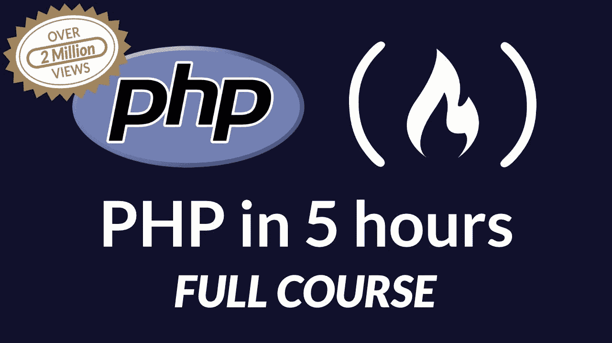

# 最好的 WordPress 教程

> 原文：<https://www.freecodecamp.org/news/best-wordpress-tutorial/>

WordPress 是一个基于 PHP 和 MySQL 的免费开源内容管理系统。功能包括插件架构和模板系统。它与博客联系最紧密，但也支持其他类型的网络内容，包括更传统的邮件列表和论坛、媒体画廊和在线商店。

WordPress 为几乎 27%的网站提供支持，目前主导着 CMS 的市场份额。由一个巨大的社区支持，这个开源平台通过主题/插件和定制软件为数十亿美元的经济提供动力。

我们建议你从 YouTube 上的 freeCodeCamp 的 4 小时 WordPress 教程开始学习。这将帮助你从头开始建立一个 WordPress 网站。


然后，我们鼓励你学习 PHP——支持 WordPress 的编程语言。freeCodeCamp 在 YouTube 上有一个关于 PHP 和 WordPress 的 4 小时教程。



## **什么是 PHP？**

PHP 是一种服务器端脚本语言，由拉斯马斯·勒德尔夫于 1995 年创建。

PHP 是一种广泛使用的开源通用脚本语言，特别适合 web 开发，并且可以嵌入到 HTML 中。

## 缩写 PHP 代表什么？

最初 PHP 代表“个人主页”，是拉斯马斯·勒德尔夫为了在自己的网站上使用而创建的。后来在 1997 年，更多的开发人员扩展了这种语言，缩写也变成了它今天的意思:“PHP:超文本预处理器”。因为 PHP 中的第一个“P”也代表“PHP”，所以它被称为“递归首字母缩略词”。

## **PHP 是用来做什么的？**

截至 2017 年 10 月，82%的服务器端语言已知的网站使用 PHP。它通常用在网站上，以动态生成网页内容。用例包括:

*   网站和 web 应用程序(服务器端脚本)
*   命令行脚本
*   桌面(GUI)应用程序

通常，它以第一种形式动态生成网页内容。例如，如果您有一个博客网站，您可以编写一些 PHP 脚本来从数据库中检索您的博客文章并显示它们。PHP 脚本的其他用途包括:

*   处理和保存表单数据中的用户输入
*   设置和使用网站 cookies
*   限制访问您网站的某些页面

## **PHP 是如何工作的？**

所有的 PHP 代码只在网络服务器上执行，而不是在你的本地计算机上。例如，如果您在网站上完成一个表单并提交它，或者单击一个用 PHP 编写的网页的链接，实际上没有 PHP 代码在您的计算机上运行。

相反，表单数据或网页请求被发送到 web 服务器，由 PHP 脚本处理。然后，web 服务器将处理后的 HTML 发回给您(这就是名称中的“超文本预处理器”的由来)，您的 web 浏览器显示结果。

因此，您看不到网站的 PHP 代码，只能看到 PHP 脚本生成的 HTML。

下图说明了这一点:


PHP 是一种解释型语言。这意味着当您对源代码进行更改时，您可以立即测试这些更改，而无需首先将源代码编译成二进制形式。跳过编译步骤会使开发过程更快。

PHP 代码包含在`<?php`和`?>`标签之间，然后可以嵌入到 HTML 中。

## **安装**

PHP 可以在有或没有网络服务器的情况下安装。

### **GNU/Linux**

在基于 Debian 的 GNU/Linux 发行版上，您可以通过以下方式安装:

```
sudo apt install php
```

安装后，您可以运行任何 PHP 文件，只需在您的终端中这样做:

```
php file.php
```

你也可以安装一个本地主机服务器来运行 PHP 网站。对于安装 Apache Web 服务器:

```
sudo apt install apache2 libapache2-mod-php
```

## **PHP 能做什么？**

*   PHP 可以生成动态页面内容
*   PHP 可以在服务器上创建、打开、读取、写入、删除和关闭文件
*   PHP 可以收集表单数据
*   PHP 可以发送和接收 cookies
*   PHP 可以添加、删除、修改数据库中的数据
*   PHP 可以用来控制用户访问
*   PHP 可以加密数据

## **为什么选择 PHP？**

*   PHP 可以在各种平台上运行(Windows，Linux，Unix，Mac OS X 等等)。)
*   PHP 几乎兼容今天使用的所有服务器(Apache、IIS 等。)
*   PHP 支持广泛的数据库
*   PHP 是免费的。从官方 PHP 资源下载:[secure.php.net](https://secure.php.net/)
*   PHP 简单易学，在服务器端运行高效

## **PHP 框架**

由于为一个网站编写完整的代码对于大多数项目来说并不实际/可行，所以大多数开发人员倾向于使用框架进行 web 开发。使用框架的优势在于

*   你不必每次创建一个项目都重新发明轮子；很多细微的差别已经为你处理好了
*   它们通常结构良好，因此有助于分离关注点
*   大多数框架倾向于遵循该语言的最佳实践
*   它们中的许多都遵循 MVC(模型-视图-控制器)模式，因此它将表示层从逻辑中分离出来

## **流行框架**

*   拉勒维尔
*   [symphony](https://symfony.com/)
*   [Zend](http://www.zend.com/)
*   [CakePHP](https://cakephp.org/)

## **文档**

PHP 是[有据可查的](http://php.net/docs.php)。[官方文档](http://php.net/manual/en/)包括几乎所有功能参考指南的例子，以及用户评论。

## **其他资源**

*   [Tizag.com PHP 教程](http://www.tizag.com/phpT/):PHP 入门的相关教程
*   令人敬畏的 PHP:PHP 库、资源和“闪亮的东西”的精选列表
*   [Laracasts.com](https://laracasts.com/):用 PHP 学习 web 应用开发的会员制网站