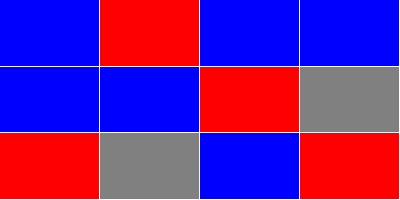
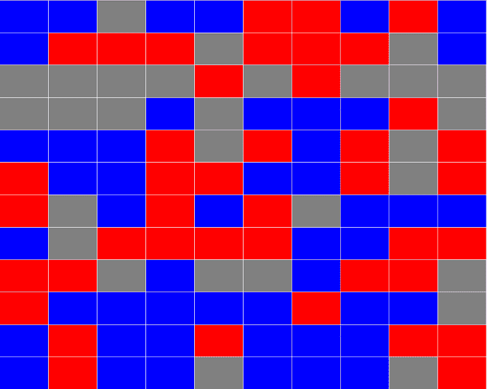

# 打赌你解决不了这个谷歌面试问题。

> 原文：<https://www.freecodecamp.org/news/bet-you-cant-solve-this-google-interview-question-4a6e5a4dc8ee/>

凯文·加德亚尼

# 打赌你解决不了这个谷歌面试问题。

#### 把棘手的问题分成小块。

我想看看其他人对软件工程的看法，于是开始在 YouTube 上疯狂观看 TechLead。在接下来的几天里，我想出了各种办法来回答他在谷歌工作时提出的一个面试问题。

### 这个视频让我很兴奋

TechLead 在 **谷歌**的 100 多次采访中提出了一个**问题。我很好奇想出一个 RxJS 的解决方案。但是这篇文章将介绍传统的方法。**

他提问的真正目的是从受访者那里获得信息。他们会在编码前问正确的问题吗？该解决方案是否符合项目的指导方针？他甚至指出，如果你得到了正确的答案，这一点都不重要。他想知道你是怎么想的，你是否能理解这个问题。

他谈到了几种解决方案，一种是递归的(受堆栈大小的限制)，另一种是迭代的(受内存大小的限制)。我们将调查这两个问题以及更多问题！

### TechLead 的问题

在他的问题中，他要求我们获取这个项目网格，并获得所有颜色都相同的最大连续块的计数。

当我听到他的问题并看到照片时，我在想“哦，伙计，我必须做一些 2D 形象建模来解决这个问题”。听起来在面试中几乎不可能回答。

但是他解释多了之后，真的不是那么回事。你正在处理已经捕获的数据，而不是解析图像。我现在意识到，这个形象实际上是用词不当。

### 数据建模

在您编写任何代码之前，您需要定义您的数据模型。我怎么强调这一点都不为过。在编写如此高级的代码之前，首先要弄清楚你在做什么，并收集业务需求。

在我们的案例中，TechLead 为我们定义了许多要求:

*   我们称之为彩色方块或“节点”的概念。
*   我们的数据集中有 10K 节点。
*   节点被组织成列和行(2D)。
*   列数和行数可以是奇数。
*   节点有颜色和一些表示邻接的方式。

我们还可以从数据中获得更多信息:

*   没有两个节点会重叠。
*   节点永远不会与其自身相邻。
*   一个节点永远不会有重复的邻接。
*   位于边上和角上的节点将分别缺少一个或两个邻接。

我们不知道的是:

*   行与列的比率
*   可能的颜色数量。
*   只有一种颜色的机会。
*   颜色的粗略分布。

作为开发人员，您的级别越高，您知道要问的问题就越多。也不是经验的问题。虽然这很有帮助，但如果你不能挑出未知的东西，它不会让你变得更好。

我不指望大多数人能挑出这些未知数。直到我开始在脑子里运行算法，我也不知道他们全部。未知需要时间去弄清楚。为了找到所有的问题，需要与业务人员反复讨论。

看着他的图像，似乎分布是随机的。他只用了三种颜色，而且从来没有说过其他的话，所以我们也要说。我们还假设所有的颜色都有可能是一样的。

因为它可能会破坏我们的算法，所以我将假设我们使用的是 100x100 的网格。这样，我们就不必处理 1 行和 10K 列的奇怪情况。

在典型情况下，我会在数据发现的前几个小时内问所有这些问题。这才是 TechLead 真正关心的。你是要从编写一个随机的解决方案开始，还是要找出问题所在？

你会在你的数据模型中犯错误。我知道当我第一次写这篇文章的时候我是这样做的，但是如果你提前计划，这些问题将会更容易处理。因此，我最终只能重写一小部分代码。

### 创建数据模型

我们需要知道数据是如何进来的，以及我们希望以什么格式来处理它。

由于我们没有处理数据的系统，我们需要自己想出一个可视化的方法。

我们数据的基本组成部分:

*   颜色
*   身份证明
*   X
*   Y

为什么我们需要身份证？因为我们可能会不止一次地碰到同一个项目。我们希望防止无限循环，所以我们需要标记出在这些情况下我们到了哪里。

此外，像这样的数据通常会被赋予某种 ID、散列或其他值。这是一个唯一的标识符，所以我们有一些方法来识别特定的节点。如果我们想知道最大的连续块，我们需要知道该块中有哪些节点。

由于他在网格中形成了数据，我将假设我们将使用 X 和 Y 值得到它。仅仅使用这些属性，我就能够生成一些 HTML 来确保我们生成的东西看起来像他给我们的一样。

这是使用绝对定位完成的，就像他的例子一样:

Answer: 3

它甚至可以处理更大的数据集:

Answer: 18

他是生成节点的代码:

我们获取列和行，根据项目的数量创建一个 1D 数组，然后根据该数据生成节点。

我用的是`colorId`，而不是`color`。第一，因为随机化更干净。第二，我们通常必须自己查找颜色值。

虽然他从未明确指出，但他只使用了 3 种颜色值。我也将我们的数据集限制为 3 种颜色。只要知道它可能是数百种颜色，最终的算法不需要改变。

作为一个简单的例子，下面是一个 2x2 节点列表:

### 数据处理

无论我们使用哪种方法，我们都想知道每个节点的邻接关系。x 和 Y 的值不会减少它。

所以给定一个 X 和 Y，我们需要知道如何找到相邻的 X 和 Y 值。虽然这很简单。我们简单地找到 X 和 y 上的节点正负 1。

我为这部分逻辑编写了一个助手函数:

我们生成节点的方式，实际上有一种数学方法来计算相邻节点的 id。相反，我将假设节点会以随机的顺序进入我们的系统。

我第二次运行所有节点来添加邻接:

我已经避免在这个预处理代码中做任何不必要的优化。这不会影响我们最终的性能统计，只会有助于简化我们的算法。

我把`colorId`改成了`color`。这对于我们的算法来说是完全不必要的，但我想让它更容易可视化。

我们为每组相邻的 X 和 Y 值调用`getNodeAtLocation`，找到我们的`northId`、`eastId`、`southId`和`westId`。我们不传递 X 和 Y 值，因为它们不再需要。

在获得基数 id 之后，我们将它们转换成一个单独的`adjacentIds`数组，其中只包含那些有值的数组。这样，如果我们有角和边，我们就不用担心检查那些 id 是否为空。它还允许我们循环一个数组，而不是在我们的算法中手工记录每个基数 ID。

这里是另一个 2x2 的例子，使用一组新的节点贯穿`addAdjacencies`:

### 预处理优化

我想大大简化本文的算法，所以我添加了另一个优化过程。这个函数删除与当前节点颜色不匹配的相邻 id。

在重写了我们的`addAdjacencies`函数之后，这就是我们现在拥有的:

我在增加更多功能的同时，对`addAdjacencies`进行了瘦身。

通过移除颜色不匹配的节点，我们的算法可以 100%确定`adjacentIds`属性中的任何 id 都是连续的节点。

最后，我删除了所有没有相同颜色邻接的节点。这进一步简化了我们的算法，我们已经将所有节点缩减到我们关心的节点。

### 错误的方式——递归

TechLead 声明我们不能递归地执行这个算法，因为我们会遇到堆栈溢出。

虽然他说的有一部分是对的，但是有一些方法可以缓解这个问题。迭代或者使用尾部递归。我们将会看到迭代的例子，但是 JavaScript 不再具有尾部递归这一本机语言特性。

虽然我们仍然可以在 JavaScript 中模拟尾部递归，但我们将保持简单，而是创建一个典型的递归函数。

在我们破解代码之前，我们需要弄清楚我们的算法。对于递归，使用[深度优先搜索](https://en.wikipedia.org/wiki/Depth-first_search)是有意义的。不用担心会不会计算机科学术语。当我向一位同事展示我想出的不同解决方案时，他说了这句话。

#### 该算法

我们将从一个节点开始，尽可能地走远，直到到达一个端点。然后，我们将返回并采取下一个分支路径，直到我们已经扫描了整个连续块。

那是它的一部分。我们还必须跟踪我们去过的地方和最大的连续块的长度。

我所做的是将我们的功能分成两部分。一个将保存最大的列表和先前扫描的 id，同时至少循环每个节点一次。另一个将从一个未扫描的根节点开始，进行深度优先遍历。

这些函数如下所示:

疯狂吧。我甚至考虑过展示代码，因为它太粗糙了。

为了减肥，让我们一步一步来。

#### 递归函数

`getContiguousIds`是我们的递归函数。每个节点调用一次。每次它返回时，您都会得到一个连续节点的更新列表。

这个函数中只有一个条件:*我们的节点已经在列表中了吗？*如果没有，再次调用`getContiguousIds`。当它返回时，我们将有一个更新的连续节点列表，该列表返回到我们的 reducer 并用作下一个`adjacentId`的状态。

你可能想知道我们在哪里给`contiguousIds`添加值。当我们把当前节点放到 T2 上时就会发生这种情况。每次我们进一步递归时，我们都确保在循环它的`adjacentIds`之前将当前节点添加到`contiguousIds`列表中。

总是添加当前节点可以确保我们不会无限递归。

#### 循环

这个函数的后半部分也遍历每个节点一次。

递归函数周围有 reducer。这个检查我们的代码是否被扫描过。如果是这样，继续循环，直到我们找到一个没有的节点，或者直到我们退出循环。

如果我们的节点没有被扫描，调用`getContiguousIds`并等待它完成。这是同步的，但是需要一些时间。

一旦它返回一个`contiguousIds`列表，对照`largestContiguousIds`列表检查那些。如果更大，存储该值。

同时，我们将把这些`contiguousIds`添加到我们的`scannedIds`列表中，以标记我们去过的地方。

当你看到所有的东西都摆放好了，就很简单了。

#### 执行

即使是 10K 项目，它也没有遇到 3 种随机颜色的堆栈溢出问题。如果我把所有东西都改成使用单一颜色，我可能会遇到堆栈溢出。这是因为我们的递归函数经历了 10K 递归。

### 顺序迭代

由于内存比函数调用栈大，我的下一个想法是在一个循环中完成所有的事情。

我们要记录一系列节点列表。我们将不断添加它们，并将它们连接在一起，直到我们退出循环。

这个方法要求我们将所有可能的节点列表保存在内存中，直到循环结束。在递归的例子中，我们只在内存中保存了最大的列表。

又一个疯狂的。让我们从头开始。我们将每个节点循环一次。但是现在我们要检查我们的 id 是否在节点列表的列表中:`contiguousIdsList`。

如果它不在`contiguousIds`的任何列表中，我们将添加它和它的`adjacentIds`。这样，在循环过程中，其他东西会链接到它。

如果我们的节点在其中一个列表中，它可能在其中的几个列表中。我们希望将所有这些链接在一起，并从`contiguousIdsList`中移除未链接的。

就是这样。

在我们得到一个节点列表之后，我们检查哪个是最大的，我们就完成了。

#### 执行

与递归版本不同，当所有 10K 项目都是相同的颜色时，这个*会完成*。

除此之外，它相当慢；比我原先预计的要慢得多。我忘记了在我的性能评估中考虑列表的循环，这显然对性能有影响。

### 随机迭代

我想采用递归方法背后的方法论，并迭代地应用它。

我花了一个晚上的大部分时间试图记住如何动态地改变循环中的索引，然后我想起了`while(true)`。我已经很久没有写传统的循环了，我已经完全忘记了。

现在我有了武器，我准备进攻。由于我花了很多时间试图加快可观察版本的速度(稍后会详细介绍)，所以我决定采用懒惰和老派的方法来改变数据。

该算法的目标是准确命中每个节点一次，并且只存储最大的连续块:

尽管我像大多数人一样写了这篇文章，但它是迄今为止可读性最差的。我甚至不能告诉你这是怎么回事，除非我自己从头到尾看一遍。

我们不是添加到先前扫描的 id 列表中，而是从我们的`remainingNodes`数组中拼接出值。

懒！我从来不会建议自己这样做，但是我已经到了创建这些示例的极限，想尝试一些不同的东西。

#### 崩溃

我把它分成由`if`块分隔的 3 个部分。

让我们从中间部分开始。我们正在检查`queuedIds`。如果我们有一些，我们对队列中的项目进行另一次循环，看看它们是否在我们的`remainingNodes`中。

第三节，要看第二节的结果。如果我们没有任何`queuedIds`，而`remainingNodesIndex`是`-1`，那么我们就完成了这个节点列表，我们需要从一个新的根节点开始。新的根节点总是在索引`0`处，因为我们拼接了我们的`remainingNodes`。

回到我们循环的顶部，我本可以使用`while(true)`，但是我想要一条出路以防出错。这在调试时很有帮助，因为无限循环很难弄清楚。

之后，我们要拼接出我们的节点。我们将它添加到我们的列表`contiguousIds`中，并将`adjacentIds`添加到队列中。

#### 执行

这最终几乎和递归版本一样快。当所有节点颜色相同时，这是所有算法中最快的。

### 特定于数据的优化

#### 相似颜色分组

因为我们知道只有蓝色和蓝色搭配，我们可以将相似颜色的节点组合在一起作为顺序迭代版本。

把它分成 3 个更小的数组降低了我们的内存占用，减少了我们需要在链表中循环的次数。尽管如此，这并没有解决所有颜色都一样的情况，所以这不会修复我们的递归版本。

这也意味着我们可以多线程化操作，将执行时间减少近三分之一。

如果我们按顺序执行这些，我们只需要先运行三个中最大的一个。如果最大的比另外两个大，就不需要检查了。

#### 最大可能尺寸

我们可以检查每个迭代，而不是在特定的时间间隔检查我们是否有最大的列表。

如果最大的集合大于或等于可用节点的一半(5K 或更高)，显然我们已经有了最大的。

使用随机迭代版本，我们可以找到迄今为止最大的列表大小，并查看还剩下多少节点。如果有小于最大的尺寸，我们已经得到了最大的。

#### 使用递归

虽然递归有其局限性，但我们仍然可以使用它。我们要做的就是检查剩余节点的数量。如果在堆栈限制之下，我们可以切换到更快的递归版本。有风险，但随着循环的深入，这肯定会缩短执行时间。

#### 使用“for”循环

因为我们知道最大项目数，所以将`reduce`函数切换到传统的`for`循环会有一点好处。

不管出于什么原因，`Array.prototype`方法与`for`循环相比[慢得令人难以置信。](https://itnext.io/speed-up-javascript-array-processing-8d601c57bb0d)

#### 使用尾部递归

同样，在这篇文章中，我也没有讨论可观察到的版本，我认为尾部递归需要一篇自己的文章。

这是一个很大的话题，有很多要解释，但是虽然它允许递归版本运行，但它可能不会像您期望的那样比`while`循环更快。

### RxJS:可维护性与性能

有一些方法可以重写这些函数，让你更容易理解和维护它们。我想到的主要解决方案是在 Redux-Observable 风格中使用 RxJS，但是没有 Redux。

这实际上是我对这篇文章的挑战。我想用常规方式编码，然后用 RxJS 流式传输数据，看看我能把它推进多远。

我在 RxJS 中做了 3 个版本，并做了一些改动来加快执行时间。与我的传感器文章不同，即使我增加了行数和列数，这三篇文章的速度都变慢了。

那个星期的晚上，我花了很多时间构思可能的解决方案，梳理每一寸代码。我甚至会躺在地上，闭上眼睛，想啊想啊。每一次，我都想出了更好的主意，但是不断遇到 JavaScript 速度的限制。

我可以做的优化有一大堆，但代价是代码的可读性。我不要那个(反正还是用了一个)。

我最终得到了一个可观察到的解决方案——现在是最快的——只用了一半的时间。这是最大的进步。

我唯一一次能够用可观测量击败内存密集型顺序迭代是在每个节点都是相同颜色的时候。那是唯一一次。从技术上讲，这也胜过递归，因为在这种情况下它会堆栈溢出。

在研究了如何用 RxJS 传输数据流之后，我意识到这对于这篇文章来说太多了。期待下一篇文章详细介绍这些代码示例。

如果想早点看到代码，可以在 GitHub 上看到:
[https://GitHub . com/Sawtaytoes/JavaScript-Performance-Interview-Question](https://github.com/Sawtaytoes/JavaScript-Performance-Interview-Question)

### 最终统计

一般来说，最大的连续块平均有 30 到 80 个节点。

这些是我的号码:

无论我运行多少次测试，每个方法的相对位置都保持不变。

当所有节点都是相同颜色时，Redux-Observable 并发方法会受到影响。我尝试了很多方法来让它更快，但都没用:/。

### 游戏开发

在我的职业生涯中，我遇到过两次这种代码。那是在 Lua 的一个小规模的活动中，发生在我开发独立游戏 Pulsen T1 的时候。

有一次，我正在绘制一张世界地图。它有一个预定义的节点列表，我实时处理这个列表。这允许点击`[LEFT]`、`[RIGHT]`、`[UP]`和`[DOWN]`来移动你在世界地图上的位置，即使角度稍微偏离。

我还编写了一个节点生成器，用于包含 X 和 Y 值的未知项目列表。听起来熟悉吗？我还必须使网格在屏幕上居中。尽管在 HTML 中做这个比在游戏引擎中要容易得多。尽管如此，将一堆绝对定位的 div 居中也不容易。

在这两个解决方案中，实时执行时间并不是什么大问题，因为当你加载游戏时，我做了很多预处理。

我想强调的是，TechLead 的问题可能是你在职业生涯中遇到的；也许吧，但是在典型的 JavaScript 应用程序中，速度很少成为一个因素。

根据 TechLeads 的其他视频，他在谷歌使用 Java。我假设他面试的职位关心执行速度。他们可能有一堆工作任务要处理大量数据，因此像这样的解决方案可能是必要的。

但是，这可能是一份从事 HTML 和 CSS 的工作，他只是在引诱受访者；谁知道呢！

### 结论

正如你在最终统计中看到的，看起来最差的代码几乎是最快的，并且完成了我们所有的需求。祝你好运维护那个混蛋！

根据我自己的经验，我花了更长的时间来开发非 RxJS 版本。我认为这是因为更快的版本需要整体思考。Redux-Observable 允许你以小块的方式思考。

这真是一个有趣又令人沮丧的问题。一开始看起来真的很难，但是把它拆成碎片后，碎片都凑在一起了:)。

### 更多阅读

如果您想了解更多关于 JavaScript 性能的内容，请查看我的其他文章:

*   [加速 JavaScript 数组处理](https://itnext.io/speed-up-javascript-array-processing-8d601c57bb0d)
*   [使用转换器加速 JavaScript 数组](https://itnext.io/using-transducers-to-speed-up-javascript-arrays-92677d000096)

如果你喜欢你所读的，请查看我的其他类似的令人大开眼界的文章:

*   [试听:权威指南](https://itnext.io/the-definitive-guide-to-callbacks-in-javascript-44a39c065292)
*   [承诺:权威指南](https://itnext.io/promises-the-definitive-guide-6a49e0dbf3b7)
*   [特性标志:真正敏捷](https://itnext.io/feature-flags-be-truly-agile-820ff50294c)
*   用食物表情符号制作便便